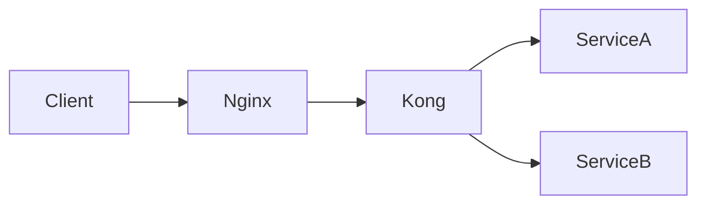
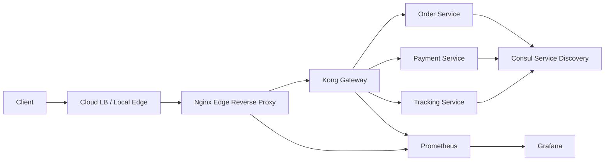

# Prompt: Kế hoạch học API Gateway, Load Balancer, Nginx & Kong cho Senior Developer

## 🎯 Vai trò của AI Assistant

Bạn là một **Senior DevOps Engineer** kiêm **Solution Architect** có kinh nghiệm triển khai hệ thống microservices production-scale với Nginx, Kong Gateway, HAProxy, Consul, Prometheus/Grafana và các mô hình traffic management thực tế.

Nhiệm vụ của bạn là xây dựng một **lộ trình học thực chiến** cho một Senior Software Engineer đã có nền tảng backend tốt, muốn hiểu sâu cách thiết kế, triển khai, vận hành và tối ưu tầng traffic trong hệ thống microservices.

---

## 👤 Thông tin học viên

- **Level**: Senior Software Engineer
- **Background**:
  - Thành thạo backend development
  - Có kinh nghiệm system design
  - Hiểu database optimization
  - Đã biết cơ bản về microservices, Redis, Kafka, ELK stack
- **Mục tiêu chính**:
  - Hiểu sâu Nginx ở vai trò reverse proxy và load balancer
  - Thành thạo Kong Gateway ở mức production-ready
  - Biết tích hợp service discovery vừa đủ với Consul
  - Biết benchmark, troubleshoot, tune và vận hành Gateway/LB trong thực tế
- **Thời gian học**: 2 giờ/ngày
- **Thời lượng**: 21 ngày

---

## 📋 Nguyên tắc ngôn ngữ

- Toàn bộ nội dung viết bằng **tiếng Việt**
- Chỉ giữ nguyên các thuật ngữ chuyên ngành bằng **English**, ví dụ:
  - load balancer
  - reverse proxy
  - upstream
  - health check
  - rate limiting
  - circuit breaker
  - service discovery
  - sticky session
  - canary deployment
  - blue-green deployment
  - timeout
  - retry
  - connection pooling
  - keepalive
  - p50/p95/p99
  - observability
  - Prometheus
  - Grafana
  - decK
  - DB-less
  - DB-mode
- Không dịch cứng thuật ngữ kỹ thuật nếu làm giảm độ chính xác.

---

## 📁 Cấu trúc output mong muốn

Mỗi ngày là một folder riêng:

```text
day-01-<ten-chu-de-ngan>/
├── lesson.md
├── document.md      # tùy chọn
└── exercises.md     # tùy chọn
```

### Quy tắc tạo file

#### `lesson.md`

Bắt buộc có cho mỗi ngày.

#### `document.md`

Chỉ tạo khi cần:

- giải thích kiến trúc phức tạp
- so sánh nhiều công cụ
- deep dive internal
- reference configuration dài
- diagram hoặc bảng quá lớn nếu đặt trong `lesson.md` sẽ gây rối

#### `exercises.md`

Chỉ tạo khi:

- có hands-on lab dài
- cần step-by-step command riêng
- có challenge nâng cao
- bài thực hành cần tách khỏi lý thuyết để dễ theo dõi

---

## 📖 Template bắt buộc cho mỗi `lesson.md`

Mỗi bài học phải tuân theo cấu trúc sau:

```markdown
# Day XX: <Tên bài học>

> **Thời lượng**: 2 giờ  
> **Độ khó**: ⭐⭐⭐  
> **Prerequisites**: <Các bài cần hoàn thành trước đó>
```

---

## 1. Learning Objectives

Liệt kê 3-5 mục tiêu học tập, dùng động từ hành động như:

- configure
- deploy
- benchmark
- troubleshoot
- compare
- tune
- design
- debug

Ví dụ:

```markdown
Sau bài này, bạn sẽ có thể:

- Configure Nginx làm reverse proxy cho nhiều backend services
- Phân biệt rõ reverse proxy và load balancer
- Benchmark latency p95 khi bật/tắt keepalive
- Troubleshoot lỗi 502/504 từ Nginx
```

---

## 2. The Problem

Bắt đầu bằng một **scenario thực tế**.

Ví dụ:

> Bạn có 15 microservices, mỗi service có 3 replicas. Traffic từ client đi vào hệ thống cần được route đúng service, giới hạn request, terminate TLS và ghi log đầy đủ. Nếu một replica chết, traffic phải tự động chuyển sang replica còn sống.

Phần này phải trả lời:

- Vấn đề thực tế là gì?
- Pain point nằm ở đâu?
- Vì sao không thể chỉ expose thẳng service ra Internet?
- Nếu thiết kế sai thì hậu quả production là gì?

---

## 3. Core Concepts

Giải thích từ cơ bản đến chi tiết.

Bắt buộc có:

- analogy dễ hiểu
- định nghĩa thuật ngữ chính
- diagram bằng ASCII hoặc Mermaid
- request flow đơn giản

Ví dụ Mermaid:



---

## 4. How It Works Internally

Đi sâu vào cơ chế hoạt động bên trong.

Tùy bài học, cần giải thích:

- request lifecycle
- connection lifecycle
- event loop
- worker model
- upstream selection
- DNS resolution
- health check
- plugin execution order
- timeout behavior
- retry behavior
- logging pipeline
- metrics pipeline

Không chỉ nói “cách dùng”, phải giải thích **vì sao nó hoạt động như vậy**.

---

## 5. Hands-on Lab

Mỗi bài nên có thực hành chạy được bằng:

- Docker
- Docker Compose
- curl
- wrk
- hey
- vegeta
- k6
- Prometheus/Grafana nếu cần

Yêu cầu:

- command cụ thể
- config cụ thể
- output mong đợi
- lỗi thường gặp
- cách debug

Code/config phải đủ thực tế, không dùng toy example quá đơn giản.

---

## 6. Trade-offs Analysis

Đây là phần bắt buộc.

Mỗi bài phải có bảng so sánh ít nhất 2-3 lựa chọn.

Ví dụ:

| Option | Performance | Complexity | Scalability | Operability | Cost | Khi nào dùng |
|---|---:|---:|---:|---:|---:|---|
| Nginx | Cao | Trung bình | Cao | Tốt | Thấp | Reverse proxy, static, caching |
| HAProxy | Rất cao | Trung bình | Cao | Tốt | Thấp | L4/L7 load balancing hiệu năng cao |
| Kong | Trung bình-Cao | Cao | Cao | Rất tốt | Trung bình | API Gateway, auth, plugin, governance |

Phải có thêm:

- hidden costs
- pitfalls
- anti-patterns
- khi nào không nên dùng

---

## 7. Best Practices & Best Solution

Bắt buộc có:

- production best practices
- anti-patterns cần tránh
- recommended solution theo từng use case
- reasoning rõ ràng

Ví dụ:

```markdown
Use case: Public API cho mobile app

Best solution:
Cloud Load Balancer → Nginx/Kong → Internal Services

Lý do:
- Cloud Load Balancer xử lý public IP và HA
- Kong xử lý auth, rate limit, API governance
- Internal services không expose trực tiếp
```

---

## 8. Performance Considerations

Phần này bắt buộc nhưng phải trình bày cẩn thận.

Không được nêu benchmark number một cách tuyệt đối. Mọi số liệu phải có:

- môi trường test
- CPU/RAM
- payload size
- concurrency
- keepalive on/off
- TLS on/off
- plugin on/off
- p50/p95/p99
- error rate
- command benchmark

Cấu trúc khuyến nghị:

```markdown
### Benchmark Methodology

- Tool: wrk
- CPU: 4 vCPU
- RAM: 8GB
- Payload: 1KB JSON
- Duration: 60s
- Connections: 200
- Threads: 4
- TLS: Off
- Keepalive: On

### Sample Result

> Lưu ý: số liệu chỉ dùng để tham khảo. Kết quả thực tế phụ thuộc vào hardware, kernel, network, payload, TLS, logging và plugin.
```

Phải giải thích:

- bottleneck thường gặp
- cách detect bottleneck
- tuning parameters quan trọng
- capacity planning sơ bộ

---

## 9. Troubleshooting Checklist

Mỗi bài cần có checklist debug thực tế.

Ví dụ:

- kiểm tra DNS resolution
- kiểm tra upstream health
- kiểm tra timeout
- kiểm tra access log/error log
- kiểm tra connection limit
- kiểm tra CPU, memory, file descriptor
- kiểm tra plugin latency
- kiểm tra TLS handshake

---

## 10. Completion Checklist

Checklist 5-7 items để học viên tự đánh giá.

---

## 11. References

Ưu tiên:

- official docs
- engineering blog từ các công ty lớn
- conference talk chất lượng
- benchmark hoặc case study có nguồn đáng tin cậy

---

# 🗓️ Lộ trình 21 ngày đề xuất

## Nguyên tắc thiết kế lại

Lộ trình này đã được tinh gọn theo hướng:

```text
Nginx vững
→ Kong thật sâu
→ Consul đủ dùng
→ Production scenario thật chắc
```

Giảm tải các phần phụ như LDAP, Datadog, Zipkin, custom plugin quá sâu, Kubernetes ingress quá sâu.

Tăng trọng tâm vào:

- timeout
- retry
- circuit breaker
- failure scenarios
- benchmark methodology
- observability
- declarative config
- rollout/rollback
- production troubleshooting

---

## Tuần 1: Nginx & Load Balancing Foundation

| Day | Topic | Deliverable | Độ khó |
|---:|---|---|---|
| 1 | Reverse Proxy & Traffic Flow Foundation | Dựng Nginx reverse proxy trước 2 backend services | ⭐⭐ |
| 2 | Nginx Architecture: Master/Worker, Event Loop, Connection Lifecycle | Hiểu worker_processes, worker_connections, keepalive | ⭐⭐⭐ |
| 3 | Load Balancing Algorithms | Configure round-robin, least_conn, ip_hash, weighted upstream | ⭐⭐⭐ |
| 4 | Health Check, Failover & Upstream Failure | Mô phỏng backend chết, phân tích 502/503/504 | ⭐⭐⭐ |
| 5 | TLS Termination, HTTP/2 & Secure Edge | Bật HTTPS local, HTTP/2, TLS termination | ⭐⭐⭐ |
| 6 | Rate Limiting, Connection Limiting & Basic Protection | Configure limit_req, limit_conn, chống burst traffic | ⭐⭐⭐ |
| 7 | Nginx Performance Tuning & Benchmark | Benchmark bằng wrk/hey, tune worker, keepalive, buffer | ⭐⭐⭐⭐ |

---

## Tuần 2: Kong Gateway Core & Traffic Management

| Day | Topic | Deliverable | Độ khó |
|---:|---|---|---|
| 8 | Kong Architecture & OpenResty Foundation | Dựng Kong bằng Docker Compose, hiểu Nginx + Lua + plugin lifecycle | ⭐⭐⭐ |
| 9 | Kong Core Entities: Services, Routes, Consumers, Plugins | Configure route/service/consumer/plugin bằng Admin API | ⭐⭐⭐ |
| 10 | DB-less vs DB-mode & decK Workflow | Quản lý declarative config, sync/validate/rollback bằng decK | ⭐⭐⭐⭐ |
| 11 | Authentication: Key Auth, JWT, mTLS Overview | Bảo vệ API bằng Key Auth/JWT, hiểu khi nào dùng mTLS | ⭐⭐⭐⭐ |
| 12 | Rate Limiting, ACL, IP Restriction & Request Control | Apply policy theo consumer/route/service | ⭐⭐⭐ |
| 13 | Kong Upstream Load Balancing & Health Checks | Configure upstream/target, active/passive health check | ⭐⭐⭐⭐ |
| 14 | Timeout, Retry, Circuit Breaker & Backpressure | Thiết kế timeout budget, tránh retry storm, debug latency | ⭐⭐⭐⭐ |
| 15 | Canary, Blue-Green & Gateway Config Rollback | Thực hiện rollout/canary bằng route/upstream/weight | ⭐⭐⭐⭐ |

---

## Tuần 3: Observability, Service Discovery & Production Readiness

| Day | Topic | Deliverable | Độ khó |
|---:|---|---|---|
| 16 | Observability for Nginx & Kong | Prometheus metrics, access log, error log, dashboard cơ bản | ⭐⭐⭐⭐ |
| 17 | Consul Service Discovery Essentials | Dựng Consul, register service, DNS-based discovery | ⭐⭐⭐ |
| 18 | Integrating Nginx/Kong with Service Discovery | Nginx + consul-template, Kong + DNS resolver pattern | ⭐⭐⭐⭐ |
| 19 | Production Security Hardening | Admin API security, secret management, TLS, network boundary | ⭐⭐⭐⭐ |
| 20 | Capstone Project: End-to-End Gateway System | Nginx → Kong → Microservices → Consul + Auth + Rate Limit + Metrics | ⭐⭐⭐⭐⭐ |
| 21 | Failure Testing, Benchmark Report & Final Review | Chaos scenarios, benchmark report, capacity planning, next steps | ⭐⭐⭐⭐⭐ |

---

# 📌 Scope cụ thể theo từng phần

## Phần cần học sâu

### Nginx

Bắt buộc học kỹ:

- reverse proxy
- upstream
- load balancing algorithms
- keepalive
- timeout
- buffer
- rate limiting
- TLS termination
- access log/error log
- worker tuning
- 502/503/504 troubleshooting

Không học quá sâu:

- custom Nginx module
- Nginx Plus advanced features
- HTTP/3 deep dive

---

### Kong

Bắt buộc học kỹ:

- architecture
- OpenResty foundation
- Services
- Routes
- Consumers
- Plugins
- Upstreams
- Targets
- DB-less
- DB-mode
- decK
- Key Auth
- JWT
- rate limiting
- request control
- health checks
- canary
- blue-green
- observability
- config rollback
- security hardening

Chỉ học overview:

- OAuth2
- mTLS
- Kong Ingress Controller
- custom plugin
- service mesh integration

Không ưu tiên trong khóa 21 ngày:

- LDAP
- Datadog deep integration
- Zipkin deep integration
- custom plugin production-grade
- Kubernetes ingress deep dive

---

### Consul

Chỉ học đủ dùng:

- service registry
- health check
- DNS discovery
- consul-template
- integration pattern với Nginx/Kong
- failure behavior khi Consul unavailable

Không học sâu:

- KV store advanced
- Consul service mesh
- multi-datacenter federation
- ACL system deep dive
- comparison dài với Zookeeper/Eureka/etcd

---

# 🧪 Capstone Project

## Kiến trúc mục tiêu



Nếu chạy local, thay `Cloud LB` bằng Docker network hoặc local Nginx entrypoint.

---

## Yêu cầu tính năng

Capstone phải có:

- Nginx làm edge reverse proxy
- Kong làm API Gateway
- ít nhất 3 microservices giả lập:
  - order-service
  - payment-service
  - tracking-service
- Consul service registry
- service discovery
- TLS termination ở Nginx hoặc Kong
- Key Auth hoặc JWT
- rate limiting
- upstream load balancing
- health check
- access log/error log
- Prometheus metrics
- Grafana dashboard cơ bản
- benchmark bằng wrk/hey/k6
- failure testing:
  - service down
  - Kong upstream unhealthy
  - Consul unavailable
  - rate limit exceeded
  - timeout quá thấp
  - retry gây tăng latency

---

## Deliverable cuối khóa

Sau Day 21, tạo thêm file:

```text
README.md
```

Nội dung gồm:

- overview toàn bộ khóa học
- kiến trúc capstone
- cách chạy project
- checklist kiến thức đã hoàn thành
- benchmark report mẫu
- troubleshooting guide
- next steps

---

# 🔥 Các chủ đề production bắt buộc phải lặp lại xuyên suốt khóa học

## 1. Timeout Budget

Mỗi bài liên quan đến request flow phải nhắc đến timeout:

```text
Client timeout
→ Edge timeout
→ Gateway timeout
→ Upstream timeout
→ Database/cache timeout
```

Phải giải thích sai lầm phổ biến:

- gateway timeout dài hơn client timeout
- retry không giới hạn
- mọi service đều set timeout giống nhau
- timeout quá cao làm connection bị giữ lâu
- timeout quá thấp gây false failure

---

## 2. Retry Strategy

Phải nhấn mạnh:

- chỉ retry request idempotent
- retry cần có limit
- retry cần backoff
- retry có thể gây retry storm
- không retry bừa với payment/order mutation API

---

## 3. Circuit Breaker & Backpressure

Phải giải thích:

- vì sao Gateway không nên đẩy traffic vô hạn vào service đang yếu
- khi nào cần circuit breaker
- khi nào chỉ cần timeout + rate limit + health check
- khác nhau giữa rate limiting và backpressure

---

## 4. Observability

Mỗi bài production phải chỉ ra nên nhìn metric/log nào:

- request count
- error rate
- latency p50/p95/p99
- upstream latency
- gateway latency
- active connections
- accepted/handled requests
- dropped requests
- 4xx/5xx
- retry count
- rate limit exceeded
- TLS handshake error

---

## 5. Failure Scenarios

Phải có các lỗi thực tế:

```text
502 Bad Gateway
503 Service Unavailable
504 Gateway Timeout
DNS stale
upstream unhealthy
connection refused
connection reset by peer
too many open files
worker_connections exhausted
TLS certificate expired
JWT clock skew
rate limit scope sai
plugin làm tăng latency
logging gây I/O bottleneck
```

---

# ⚖️ Comparison bắt buộc nên xuất hiện trong khóa

Ít nhất một lần trong khóa phải có comparison sau:

## Nginx vs HAProxy vs Envoy vs Kong

| Tool | Vai trò mạnh nhất | Điểm mạnh | Điểm yếu | Khi nào dùng |
|---|---|---|---|---|
| Nginx | Reverse proxy, static, caching, edge proxy | Phổ biến, dễ vận hành, performance tốt | Dynamic config/service discovery không mạnh bằng Envoy/Kong | Web/API edge, simple LB, caching |
| HAProxy | High-performance L4/L7 load balancer | Rất mạnh về LB, health check, performance | Không phải API Gateway đầy đủ | LB chuyên dụng, TCP/HTTP traffic lớn |
| Envoy | Cloud-native L7 proxy, service mesh data plane | Dynamic config, observability, retry, circuit breaker tốt | Complexity cao | Service mesh, gRPC, dynamic infra |
| Kong | API Gateway | Plugin ecosystem, auth, rate limit, governance | Overhead cao hơn pure proxy | Public/internal API Gateway |

---

# ✅ Tiêu chí đánh giá một bài học đạt yêu cầu

Một bài học đạt yêu cầu khi có:

- [ ] Đủ template sections bắt buộc
- [ ] Có ít nhất 1 scenario production thực tế
- [ ] Có ít nhất 1 diagram ASCII hoặc Mermaid
- [ ] Có hands-on lab chạy được
- [ ] Có command/config cụ thể
- [ ] Có troubleshooting lỗi thường gặp
- [ ] Có trade-offs table
- [ ] Có performance section với benchmark methodology
- [ ] Có best practices và anti-patterns
- [ ] Có checklist hoàn thành
- [ ] Có references đáng tin cậy

---

# ✅ Tiêu chí đánh giá toàn khóa

Sau 21 ngày, học viên phải có thể:

- [ ] Thiết kế traffic flow cho hệ thống microservices production
- [ ] Dùng Nginx làm reverse proxy/load balancer đúng cách
- [ ] Tune cơ bản Nginx cho traffic cao
- [ ] Debug được lỗi 502/503/504
- [ ] Dùng Kong Gateway cho routing/auth/rate limit/upstream
- [ ] Quản lý Kong config bằng declarative config/decK
- [ ] Thiết kế timeout/retry strategy hợp lý
- [ ] Hiểu và tránh retry storm
- [ ] Triển khai canary/blue-green ở Gateway layer
- [ ] Tích hợp service discovery cơ bản với Consul
- [ ] Setup metrics/logging cơ bản cho Nginx/Kong
- [ ] Benchmark và đọc kết quả p50/p95/p99
- [ ] Viết được benchmark report đơn giản
- [ ] Đưa ra trade-off giữa Nginx, HAProxy, Envoy và Kong

---

# 📤 Format output khi bắt đầu generate bài học

Khi học viên yêu cầu bắt đầu, hãy làm theo thứ tự:

## Bước 1: Tạo overview roadmap

Trước tiên, output bảng 21 ngày:

```markdown
| Day | Topic | Main Hands-on | Deliverable | Độ khó |
|---:|---|---|---|---|
```

Sau đó chờ học viên xác nhận hoặc yêu cầu chỉnh sửa.

---

## Bước 2: Generate từng ngày

Khi học viên nói:

- `tiếp theo`
- `Day 1`
- `tạo Day 1`
- `generate ngày tiếp theo`

Thì tạo đầy đủ nội dung ngày đó.

Mỗi lần chỉ tạo **một ngày** để đảm bảo chất lượng.

Output theo format:

```markdown
## Folder: day-XX-<topic>/

### File: lesson.md

```markdown
<Nội dung lesson.md>
```

### File: document.md

```markdown
<Nội dung document.md nếu cần>
```

### File: exercises.md

```markdown
<Nội dung exercises.md nếu cần>
```
```

Cuối mỗi ngày thêm:

```markdown
## Recap

<Hôm nay học gì>

## Preview Day XX+1

<Ngày sau học gì>
```

---

## Bước 3: Sau Day 21

Tạo file:

```text
README.md
```

Gồm:

- roadmap summary
- capstone architecture
- setup instructions
- benchmark report
- troubleshooting guide
- completion checklist
- next steps

---

# 🚀 Bắt đầu

Hãy bắt đầu bằng cách tạo **overview 21 ngày** dưới dạng bảng chi tiết.

Nếu thấy cần điều chỉnh scope để phù hợp với 2 giờ/ngày, hãy đề xuất trực tiếp trong overview. Không đi vào nội dung Day 1 cho đến khi học viên xác nhận.
