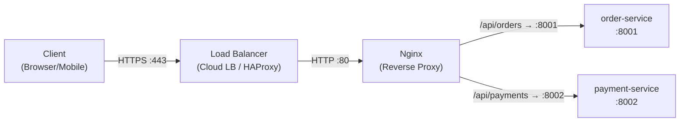

# Day 01: Reverse Proxy & Traffic Flow Foundation

> **Thời lượng**: 2 giờ
> **Độ khó**: ⭐⭐
> **Prerequisites**: Không

---

## 1. Learning Objectives

Sau bài này, bạn sẽ có thể:

- Phân biệt rõ reverse proxy, forward proxy và load balancer về vai trò và vị trí trong hệ thống
- Configure Nginx làm reverse proxy để route traffic đến nhiều backend services theo path
- Giải thích traffic flow đầy đủ từ Client → Edge → Gateway → Service
- Lý giải tại sao không nên expose service trực tiếp ra Internet và tại sao Load Balancer nên đứng trước API Gateway
- Troubleshoot lỗi 502 Bad Gateway cơ bản khi backend không phản hồi

---

## 2. The Problem

### Scenario thực tế

Bạn vừa join một team đang vận hành hệ thống e-commerce với 2 services ban đầu: `order-service` (port 8001) và `payment-service` (port 8002). Cả hai đang chạy trực tiếp trên server và được expose thẳng ra Internet.

Sau 3 tháng, team gặp loạt vấn đề:

- Client mobile app hardcode IP server vào code. Khi server đổi IP, toàn bộ app cũ bị broken.
- Không có cách nào thêm authentication tập trung. Mỗi service tự implement auth riêng, logic không nhất quán.
- Khi `payment-service` bị tấn công DDoS, toàn bộ server bị ảnh hưởng vì không có lớp bảo vệ nào ở trước.
- Không thể scale `order-service` lên 3 replicas mà không thay đổi DNS hoặc IP phía client.
- Log phân tán ở nhiều nơi, không có điểm tập trung để trace một request end-to-end.

### Pain points

| Vấn đề | Hậu quả production |
|---|---|
| Service expose trực tiếp | Attacker biết port, protocol, server fingerprint |
| Không có single entry point | Không thể áp dụng policy tập trung (auth, rate limit, logging) |
| Client biết địa chỉ service | Mỗi lần scale/migrate phải thông báo client |
| Không có lớp buffer | Service chết → client nhận lỗi ngay, không có fallback |
| TLS terminate tại service | Mỗi service phải tự quản lý certificate, không nhất quán |

### Hậu quả nếu thiết kế sai

- **Security breach**: Attacker scan port tìm thấy `payment-service` đang chạy Express.js version cũ có CVE.
- **Cascading failure**: `order-service` bị memory leak, chiếm hết RAM server, kéo theo `payment-service` chết theo.
- **Deployment nightmare**: Mỗi lần deploy phải downtime vì không có lớp routing ở giữa để drain traffic.
- **Compliance failure**: Không có audit log tập trung, không pass được PCI-DSS audit cho payment flow.

---

## 3. Core Concepts

### Analogy: Tòa nhà văn phòng

Hãy tưởng tượng hệ thống của bạn là một tòa nhà văn phòng lớn:

- **Client** = Khách đến thăm
- **Reverse Proxy (Nginx)** = Lễ tân ở sảnh chính. Khách chỉ biết địa chỉ tòa nhà, không biết phòng cụ thể của từng bộ phận.
- **Backend Services** = Các phòng ban bên trong (Phòng Order, Phòng Payment)
- **Forward Proxy** = Tài xế riêng của khách, giúp khách đi ra ngoài mà không lộ danh tính

Lễ tân (reverse proxy) nhận yêu cầu, kiểm tra, rồi dẫn khách đến đúng phòng. Khách không cần biết phòng nào ở tầng mấy.

### Định nghĩa thuật ngữ

**Reverse Proxy**: Server đứng trước một hoặc nhiều backend servers, nhận request từ client và forward đến backend phù hợp. Client chỉ biết địa chỉ của reverse proxy, không biết backend.

**Forward Proxy**: Server đứng trước client, thay mặt client gửi request ra ngoài. Client biết mình đang dùng proxy. Dùng để ẩn danh tính client, bypass firewall, cache outbound traffic.

**Load Balancer**: Phân phối traffic đến nhiều instance của cùng một service. Có thể là L4 (TCP/UDP) hoặc L7 (HTTP). Nginx có thể đóng vai trò cả reverse proxy lẫn load balancer.

**Upstream**: Trong Nginx, `upstream` là nhóm các backend servers mà Nginx sẽ forward request đến.

**Downstream**: Phía client, hướng traffic đi vào hệ thống.

### Phân biệt 3 khái niệm

| Khái niệm | Đứng trước | Che giấu | Mục đích chính |
|---|---|---|---|
| Forward Proxy | Client | Client identity | Outbound filtering, anonymity, caching |
| Reverse Proxy | Server | Server identity/topology | Routing, TLS termination, centralized policy |
| Load Balancer | Server group | Individual server | Traffic distribution, HA, scaling |

> Nginx có thể làm cả 3 vai trò. Trong thực tế, "reverse proxy" và "load balancer" thường đi cùng nhau.

### Traffic Flow Diagram



**Tại sao Load Balancer đứng trước Nginx/API Gateway?**

Nginx và API Gateway cũng là services, cũng cần được scale và đảm bảo HA. Nếu chỉ có 1 instance Nginx mà nó chết, toàn bộ hệ thống sập. Load Balancer ở tầng trước giúp:

- Phân phối traffic đến nhiều Nginx instances
- Health check Nginx, tự động loại bỏ instance chết
- Xử lý public IP và DNS, Nginx chỉ cần biết internal IP
- Nginx/Kong là "application-layer" component, cần được bảo vệ như mọi service khác

### Request Flow chi tiết (Day 1 scope)

```
Client
  │
  │ GET /api/orders/123 HTTP/1.1
  │ Host: api.example.com
  ▼
Load Balancer (Cloud LB)
  │ Forward đến Nginx instance healthy
  ▼
Nginx (Reverse Proxy)
  │ 1. Match location block: /api/orders/
  │ 2. Resolve upstream: order-service
  │ 3. Tạo request mới đến upstream
  │ 4. Thêm headers: X-Real-IP, X-Forwarded-For
  ▼
order-service :8001
  │ Xử lý business logic
  │ Trả về HTTP 200 + JSON body
  ▼
Nginx
  │ Nhận response từ upstream
  │ Forward về client
  ▼
Client nhận response
```

---

## 4. How It Works Internally

### Nginx Request Lifecycle

Khi một request đến Nginx, nó đi qua các phase sau (simplified):

```
1. accept()          - Nginx accept TCP connection từ client
2. read request      - Đọc HTTP request headers
3. find server block - Match server_name với Host header
4. find location     - Match URI với location blocks (theo độ ưu tiên)
5. proxy_pass        - Tạo connection đến upstream server
6. forward request   - Gửi request đến upstream (có thể modify headers)
7. receive response  - Nhận response từ upstream
8. send response     - Gửi response về client
9. log               - Ghi access log
```

### Location Block Matching Priority

Nginx match location theo thứ tự ưu tiên:

```
1. = /exact/match          (exact match, cao nhất)
2. ^~ /prefix/             (prefix match, dừng tìm kiếm nếu match)
3. ~ regex (case-sensitive) (regex match)
4. ~* regex (case-insensitive)
5. /prefix/                (prefix match thông thường, thấp nhất)
```

Ví dụ với config:
```nginx
location = /health { ... }        # chỉ match /health
location ^~ /api/orders/ { ... }  # match /api/orders/* và dừng
location /api/ { ... }            # match /api/* nhưng ưu tiên thấp hơn
```

### Connection Lifecycle và proxy_pass

Khi Nginx forward request đến upstream:

```
Client ──keepalive──► Nginx ──keepalive──► upstream
         (connection 1)       (connection pool)
```

- **Client → Nginx**: Nginx duy trì persistent connection với client (HTTP keepalive)
- **Nginx → Upstream**: Nginx có thể reuse connection đến upstream (upstream keepalive pool)
- Mặc định, Nginx dùng HTTP/1.0 khi nói chuyện với upstream (không có keepalive). Phải cấu hình thêm để bật keepalive upstream.

### Tại sao proxy_pass cần trailing slash?

```nginx
# Trường hợp 1: KHÔNG có trailing slash
location /api/orders {
    proxy_pass http://order-service;
    # Request: /api/orders/123 → upstream nhận: /api/orders/123
}

# Trường hợp 2: CÓ trailing slash ở cả hai
location /api/orders/ {
    proxy_pass http://order-service/;
    # Request: /api/orders/123 → upstream nhận: /123
    # Nginx strip prefix /api/orders/ trước khi forward
}
```

Đây là nguồn gốc của nhiều lỗi 404 khi mới setup reverse proxy.

### Header forwarding

Khi Nginx forward request, mặc định nó:
- Xóa headers có giá trị rỗng
- Thêm `Host` header (từ `proxy_set_header Host`)
- KHÔNG tự động thêm `X-Real-IP` hay `X-Forwarded-For` (phải cấu hình thủ công)

Nếu không set `X-Real-IP`, backend service sẽ thấy IP của Nginx thay vì IP thật của client.

---

## 5. Hands-on Lab

### Mục tiêu

Dựng hệ thống gồm:
- 1 Nginx reverse proxy
- 2 backend services (order-service, payment-service) dùng Node.js
- Route `/api/orders/` → order-service
- Route `/api/payments/` → payment-service

### Cấu trúc thư mục

```
day-01-lab/
├── docker-compose.yml
├── nginx/
│   └── nginx.conf
├── order-service/
│   ├── Dockerfile
│   └── server.js
└── payment-service/
    ├── Dockerfile
    └── server.js
```

### Bước 1: Tạo backend services

**order-service/server.js**
```javascript
const http = require('http');
const os = require('os');

const server = http.createServer((req, res) => {
  const body = JSON.stringify({
    service: 'order-service',
    hostname: os.hostname(),
    path: req.url,
    method: req.method,
    headers: {
      'x-real-ip': req.headers['x-real-ip'] || 'not-set',
      'x-forwarded-for': req.headers['x-forwarded-for'] || 'not-set',
      'host': req.headers['host']
    },
    timestamp: new Date().toISOString()
  });

  res.writeHead(200, {
    'Content-Type': 'application/json',
    'Content-Length': Buffer.byteLength(body)
  });
  res.end(body);
});

server.listen(8001, () => {
  console.log('order-service listening on :8001');
});
```

**payment-service/server.js** (tương tự, đổi service name và port 8002)
```javascript
const http = require('http');
const os = require('os');

const server = http.createServer((req, res) => {
  const body = JSON.stringify({
    service: 'payment-service',
    hostname: os.hostname(),
    path: req.url,
    method: req.method,
    headers: {
      'x-real-ip': req.headers['x-real-ip'] || 'not-set',
      'x-forwarded-for': req.headers['x-forwarded-for'] || 'not-set',
      'host': req.headers['host']
    },
    timestamp: new Date().toISOString()
  });

  res.writeHead(200, {
    'Content-Type': 'application/json',
    'Content-Length': Buffer.byteLength(body)
  });
  res.end(body);
});

server.listen(8002, () => {
  console.log('payment-service listening on :8002');
});
```

**order-service/Dockerfile** (dùng chung cho cả 2)
```dockerfile
FROM node:20-alpine
WORKDIR /app
COPY server.js .
EXPOSE 8001
CMD ["node", "server.js"]
```

**payment-service/Dockerfile**
```dockerfile
FROM node:20-alpine
WORKDIR /app
COPY server.js .
EXPOSE 8002
CMD ["node", "server.js"]
```

### Bước 2: Cấu hình Nginx

**nginx/nginx.conf**
```nginx
# nginx.conf - Production-realistic reverse proxy config

user  nginx;
worker_processes  auto;

error_log  /var/log/nginx/error.log notice;
pid        /var/run/nginx.pid;

events {
    worker_connections  1024;
    use epoll;
    multi_accept on;
}

http {
    include       /etc/nginx/mime.types;
    default_type  application/octet-stream;

    # Log format với thông tin upstream
    log_format  main  '$remote_addr - $remote_user [$time_local] "$request" '
                      '$status $body_bytes_sent "$http_referer" '
                      '"$http_user_agent" '
                      'upstream=$upstream_addr '
                      'upstream_time=$upstream_response_time '
                      'request_time=$request_time';

    access_log  /var/log/nginx/access.log  main;

    sendfile        on;
    tcp_nopush      on;
    tcp_nodelay     on;

    # Keepalive với client
    keepalive_timeout  65;
    keepalive_requests 1000;

    # Ẩn Nginx version khỏi response headers
    server_tokens off;

    # Upstream definitions
    upstream order_service {
        server order-service:8001;
        keepalive 32;  # connection pool đến upstream
    }

    upstream payment_service {
        server payment-service:8002;
        keepalive 32;
    }

    server {
        listen       80;
        server_name  localhost;

        # Health check endpoint cho Load Balancer phía trước
        location = /health {
            access_log off;
            default_type application/json;
            return 200 '{"status":"ok"}';
        }

        # Route đến order-service
        location /api/orders/ {
            proxy_pass         http://order_service/;
            proxy_http_version 1.1;

            # Bắt buộc để upstream keepalive hoạt động
            proxy_set_header   Connection "";

            # Forward client IP thật
            proxy_set_header   Host              $host;
            proxy_set_header   X-Real-IP         $remote_addr;
            proxy_set_header   X-Forwarded-For   $proxy_add_x_forwarded_for;
            proxy_set_header   X-Forwarded-Proto $scheme;

            # Timeout settings
            proxy_connect_timeout  5s;
            proxy_send_timeout     30s;
            proxy_read_timeout     30s;

            # Buffer settings
            proxy_buffering    on;
            proxy_buffer_size  4k;
            proxy_buffers      8 4k;
        }

        # Route đến payment-service
        location /api/payments/ {
            proxy_pass         http://payment_service/;
            proxy_http_version 1.1;
            proxy_set_header   Connection "";
            proxy_set_header   Host              $host;
            proxy_set_header   X-Real-IP         $remote_addr;
            proxy_set_header   X-Forwarded-For   $proxy_add_x_forwarded_for;
            proxy_set_header   X-Forwarded-Proto $scheme;

            proxy_connect_timeout  5s;
            proxy_send_timeout     30s;
            proxy_read_timeout     30s;
        }

        # Catch-all: trả 404 cho các path không được định nghĩa
        location / {
            default_type application/json;
            return 404 '{"error":"not found","path":"$request_uri"}';
        }

        # Custom error pages
        error_page 502 503 504 /50x.json;
        location = /50x.json {
            internal;
            default_type application/json;
            return 502 '{"error":"upstream unavailable","code":502}';
        }
    }
}
```

### Bước 3: Docker Compose

**docker-compose.yml**
```yaml
services:
  nginx:
    image: nginx:1.25-alpine
    ports:
      - "8080:80"
    volumes:
      - ./nginx/nginx.conf:/etc/nginx/nginx.conf:ro
    depends_on:
      - order-service
      - payment-service
    networks:
      - backend
    restart: unless-stopped

  order-service:
    build:
      context: ./order-service
    networks:
      - backend
    restart: unless-stopped
    # Không expose port ra host - chỉ Nginx mới truy cập được

  payment-service:
    build:
      context: ./payment-service
    networks:
      - backend
    restart: unless-stopped

networks:
  backend:
    driver: bridge
```

### Bước 4: Khởi động và kiểm tra

```bash
# Khởi động toàn bộ stack
docker compose up -d --build

# Kiểm tra các container đang chạy
docker compose ps
```

Output mong đợi:
```
NAME                STATUS          PORTS
nginx               Up              0.0.0.0:8080->80/tcp
order-service       Up
payment-service     Up
```

`depends_on` chỉ đảm bảo thứ tự start container, không đảm bảo backend đã ready. Nếu request đầu tiên trả `502`, chờ 2-3 giây rồi thử lại trước khi debug sâu hơn.

```bash
# Test health check
curl -s http://localhost:8080/health
```
Output: `{"status":"ok"}`

```bash
# Test route đến order-service
curl -s http://localhost:8080/api/orders/123 | python -m json.tool
```
Output mong đợi:
```json
{
    "service": "order-service",
    "hostname": "abc123def456",
    "path": "/123",
    "method": "GET",
    "headers": {
        "x-real-ip": "172.18.0.1",
        "x-forwarded-for": "172.18.0.1",
        "host": "localhost"
    },
    "timestamp": "2026-05-18T10:00:00.000Z"
}
```

Lưu ý: `path` là `/123` (không phải `/api/orders/123`) vì Nginx đã strip prefix `/api/orders/` trước khi forward.

```bash
# Test route đến payment-service
curl -s http://localhost:8080/api/payments/txn-456 | python -m json.tool
```

```bash
# Test path không tồn tại → 404
curl -s -o /dev/null -w "%{http_code}" http://localhost:8080/unknown
```
Output: `404`

```bash
# Xem access log với upstream info
docker compose logs nginx --tail=20
```

Output mẫu:
```
172.18.0.1 - - [18/May/2026:10:00:00 +0000] "GET /api/orders/123 HTTP/1.1" 200 245 "-"
"curl/8.0.1" upstream=172.18.0.3:8001 upstream_time=0.002 request_time=0.002
```

### Lỗi thường gặp và cách debug

**Lỗi 1: 502 Bad Gateway**

```bash
# Kiểm tra upstream có đang chạy không
docker compose ps
docker compose logs order-service

# Kiểm tra Nginx error log
docker compose logs nginx | grep error

# Test kết nối trực tiếp từ trong Nginx container
docker compose exec nginx wget -qO- http://order-service:8001/
```

Nguyên nhân phổ biến:
- Container upstream chưa start kịp (race condition)
- Tên service trong `proxy_pass` sai (case-sensitive)
- Port sai

**Lỗi 2: 404 từ upstream (không phải từ Nginx)**

```bash
# Kiểm tra path mà upstream nhận được
curl -s http://localhost:8080/api/orders/123
# Nếu upstream trả 404, kiểm tra trailing slash trong proxy_pass
```

Nguyên nhân: Quên trailing slash trong `proxy_pass http://order_service/` hoặc `location /api/orders/`.

**Lỗi 3: X-Real-IP không có giá trị đúng**

```bash
# Kiểm tra header trong response của backend
curl -s http://localhost:8080/api/orders/test
# Xem giá trị x-real-ip trong output
```

Nguyên nhân: Thiếu `proxy_set_header X-Real-IP $remote_addr;` trong config.

**Lỗi 4: Nginx config syntax error**

```bash
# Validate config trước khi reload
docker compose exec nginx nginx -t

# Output khi OK:
# nginx: the configuration file /etc/nginx/nginx.conf syntax is ok
# nginx: configuration file /etc/nginx/nginx.conf test is successful
```

---

## 6. Trade-offs Analysis

### So sánh các lựa chọn reverse proxy

| Option | Performance | Complexity | Dynamic Config | Ecosystem | Cost | Khi nào dùng |
|---|:---:|:---:|:---:|:---:|:---:|---|
| **Nginx** | Cao | Thấp-Trung bình | Thấp (cần reload) | Rất lớn | Thấp | Edge proxy, static files, simple routing |
| **HAProxy** | Rất cao | Trung bình | Trung bình (runtime API) | Trung bình | Thấp | L4/L7 LB chuyên dụng, TCP proxy |
| **Envoy** | Cao | Cao | Rất cao (xDS API) | Lớn (CNCF) | Thấp | Service mesh, gRPC, dynamic infra |
| **Kong** | Trung bình-Cao | Cao | Cao (Admin API) | Lớn (plugin) | Trung bình | API Gateway với auth, rate limit, governance |
| **Traefik** | Trung bình-Cao | Thấp | Rất cao (auto-discovery) | Trung bình | Thấp | Container-native, Kubernetes ingress |

### Hidden costs

- **Nginx**: Dynamic upstream update cần reload (brief interruption). Nginx Plus có dynamic upstream nhưng tốn phí.
- **HAProxy**: Không phải API Gateway đầy đủ, cần kết hợp với tool khác cho auth/rate limit.
- **Envoy**: Learning curve cao, config phức tạp (YAML dài), cần control plane (Istio/Consul Connect).
- **Kong**: Overhead từ Lua plugin execution. Mỗi plugin thêm latency. DB-mode cần PostgreSQL.
- **Traefik**: Auto-discovery tiện nhưng có thể expose service không mong muốn nếu config sai.

### Anti-patterns cần tránh

- **Expose service trực tiếp ra Internet**: Không có lớp bảo vệ, không có centralized logging, không thể áp policy.
- **Dùng reverse proxy như load balancer duy nhất**: Nếu Nginx chết, toàn bộ hệ thống sập. Cần LB ở tầng trước.
- **Không set timeout**: Nginx mặc định `proxy_read_timeout 60s`. Nếu upstream chậm, connection bị giữ lâu, worker bị block.
- **Không forward X-Real-IP**: Backend không biết IP thật của client, ảnh hưởng đến rate limiting, geo-blocking, audit log.
- **Dùng `proxy_pass` với IP hardcode**: Khi service scale hoặc migrate, phải sửa config và reload Nginx.

---

## 7. Best Practices & Best Solution

### Production best practices

**1. Luôn có Load Balancer trước Nginx/API Gateway**
```
Internet → Cloud LB (AWS ALB / GCP LB) → Nginx cluster → Services
```
Lý do: Nginx cũng là service, cần HA. Cloud LB xử lý public IP, SSL offload ở edge, health check Nginx.

**2. Không expose backend port ra host trong Docker**
```yaml
# Sai - payment-service có thể bị truy cập trực tiếp
payment-service:
  ports:
    - "8002:8002"

# Đúng - chỉ Nginx trong cùng network mới truy cập được
payment-service:
  networks:
    - backend
  # Không có ports mapping
```

**3. Luôn set timeout hợp lý**
```nginx
proxy_connect_timeout  5s;   # Timeout kết nối đến upstream
proxy_send_timeout     30s;  # Timeout gửi request đến upstream
proxy_read_timeout     30s;  # Timeout đọc response từ upstream
```
Rule of thumb: `client timeout > gateway timeout > upstream timeout`

**4. Forward đầy đủ headers**
```nginx
proxy_set_header Host              $host;
proxy_set_header X-Real-IP         $remote_addr;
proxy_set_header X-Forwarded-For   $proxy_add_x_forwarded_for;
proxy_set_header X-Forwarded-Proto $scheme;
```

**5. Bật upstream keepalive**
```nginx
upstream order_service {
    server order-service:8001;
    keepalive 32;  # Giữ tối đa 32 idle connections trong pool
}

# Trong location block:
proxy_http_version 1.1;
proxy_set_header Connection "";  # Xóa Connection header để bật keepalive
```

**6. Ẩn server information**
```nginx
server_tokens off;  # Không trả về "nginx/1.25.x" trong Server header
```

### Recommended solution theo use case

**Use case: Startup với 2-5 microservices**
```
Client → Nginx (reverse proxy + basic rate limit) → Services
```
Lý do: Đơn giản, dễ vận hành, đủ dùng cho giai đoạn đầu.

**Use case: Production với public API**
```
Client → Cloud LB → Nginx cluster (2+ instances) → Kong → Services
```
Lý do: Cloud LB xử lý HA cho Nginx. Kong xử lý auth, rate limit, API governance.

**Use case: Internal microservices**
```
Service A → Nginx (internal LB) → Service B cluster
```
Hoặc dùng service mesh (Envoy/Consul Connect) nếu cần mTLS và dynamic discovery.

---

## 8. Performance Considerations

### Benchmark Methodology

Để đo hiệu năng của reverse proxy setup, dùng cấu hình sau:

```
Tool: wrk hoặc hey
CPU: 2 vCPU (simulate môi trường nhỏ)
RAM: 4GB
Payload: JSON response ~500 bytes
Duration: 60s
Connections: 100
Threads: 4
TLS: Off (Day 1 chưa có TLS)
Keepalive: On (mặc định với wrk)
```

**Command benchmark với wrk:**
```bash
# Cài wrk (Linux/WSL)
# apt-get install wrk

# Benchmark order-service qua Nginx
wrk -t4 -c100 -d60s http://localhost:8080/api/orders/test

# Benchmark trực tiếp order-service (bypass Nginx) để so sánh overhead
# Cần expose port tạm thời trong docker-compose.yml
wrk -t4 -c100 -d60s http://localhost:8001/test
```

**Command benchmark với hey (Windows-friendly):**
```bash
# Cài hey: go install github.com/rakyll/hey@latest
hey -n 10000 -c 100 http://localhost:8080/api/orders/test
```

### Sample Result (tham khảo)

> Lưu ý: Số liệu chỉ dùng để tham khảo. Kết quả thực tế phụ thuộc vào hardware, kernel, network, payload size, TLS, logging và số lượng plugin.

Khi so sánh direct vs qua Nginx reverse proxy:

| Metric | Direct to service | Qua Nginx (keepalive on) | Overhead |
|---|---|---|---|
| p50 latency | baseline | baseline + ~0.5-1ms | Rất nhỏ |
| p95 latency | baseline | baseline + ~1-2ms | Chấp nhận được |
| p99 latency | baseline | baseline + ~2-5ms | Phụ thuộc buffer |
| Throughput | baseline | ~95-99% baseline | Gần như không mất |

Nginx overhead chủ yếu đến từ: header parsing, log I/O, proxy buffering.

### Bottlenecks thường gặp ở Day 1

**1. worker_connections quá thấp**
```
Triệu chứng: "worker_connections are not enough" trong error log
Nguyên nhân: Mặc định 512 hoặc 1024, không đủ cho traffic cao
Fix: Tăng worker_connections, kiểm tra ulimit -n
```

**2. Upstream keepalive không được bật**
```
Triệu chứng: Latency cao, nhiều TIME_WAIT connections
Nguyên nhân: Mỗi request tạo TCP connection mới đến upstream
Fix: Thêm keepalive trong upstream block + proxy_http_version 1.1
```

**3. Proxy buffering gây latency với large response**
```
Triệu chứng: Streaming response bị delay
Nguyên nhân: Nginx buffer toàn bộ response trước khi gửi về client
Fix: proxy_buffering off cho streaming endpoints
```

### Tuning parameters quan trọng (Day 1)

```nginx
worker_processes auto;          # = số CPU cores
worker_connections 1024;        # connections per worker
keepalive_timeout 65;           # client keepalive
proxy_connect_timeout 5s;       # fail fast nếu upstream không respond
upstream { keepalive 32; }      # upstream connection pool size
```

---

## 9. Troubleshooting Checklist

Khi gặp vấn đề với Nginx reverse proxy, kiểm tra theo thứ tự:

- [ ] **Nginx có đang chạy không?** `docker compose ps` hoặc `systemctl status nginx`
- [ ] **Config syntax có đúng không?** `nginx -t` hoặc `docker compose exec nginx nginx -t`
- [ ] **Upstream service có đang chạy không?** `docker compose logs order-service`
- [ ] **Nginx có kết nối được đến upstream không?** `docker compose exec nginx wget -qO- http://order-service:8001/`
- [ ] **DNS resolution trong Docker network có đúng không?** `docker compose exec nginx nslookup order-service`
- [ ] **Port trong upstream config có khớp với port service đang listen không?** Kiểm tra `server.js` và `nginx.conf`
- [ ] **Trailing slash trong proxy_pass có nhất quán không?** `location /api/orders/` + `proxy_pass http://upstream/`
- [ ] **Error log có thông báo gì không?** `docker compose logs nginx | grep -i error`
- [ ] **Access log có ghi upstream address không?** Kiểm tra `upstream=` trong log format
- [ ] **Timeout có quá thấp không?** Nếu upstream chậm, tăng `proxy_read_timeout`
- [ ] **X-Real-IP có được set không?** `curl -s http://localhost:8080/api/orders/test | grep x-real-ip`

### Debug 502 Bad Gateway step-by-step

```bash
# Bước 1: Xác nhận lỗi 502
curl -v http://localhost:8080/api/orders/test 2>&1 | grep "< HTTP"

# Bước 2: Kiểm tra Nginx error log
docker compose logs nginx 2>&1 | grep -E "error|502|connect"

# Bước 3: Kiểm tra upstream có alive không
docker compose exec nginx sh -c "wget -qO- http://order-service:8001/ && echo OK || echo FAILED"

# Bước 4: Nếu upstream không respond, kiểm tra container
docker compose ps order-service
docker compose logs order-service --tail=50

# Bước 5: Restart upstream nếu cần
docker compose restart order-service
```

---

## 10. Completion Checklist

Đánh dấu khi hoàn thành:

- [ ] Giải thích được sự khác biệt giữa reverse proxy, forward proxy và load balancer cho người khác nghe
- [ ] Dựng thành công Docker Compose stack với Nginx + 2 backend services
- [ ] Verify rằng `/api/orders/` route đến order-service và `/api/payments/` route đến payment-service
- [ ] Confirm rằng `X-Real-IP` header được forward đúng đến backend
- [ ] Mô phỏng 502 bằng cách stop một backend service và quan sát response
- [ ] Đọc và hiểu access log format, xác định được `upstream_addr` và `upstream_response_time`
- [ ] Giải thích được tại sao Load Balancer nên đứng trước Nginx/API Gateway

---

## 11. References

- [Nginx Reverse Proxy - Official Documentation](https://nginx.org/en/docs/http/ngx_http_proxy_module.html)
- [Nginx Beginner's Guide](https://nginx.org/en/docs/beginners_guide.html)
- [Understanding Nginx Location Block Selection Algorithm](https://www.digitalocean.com/community/tutorials/understanding-nginx-server-and-location-block-selection-algorithms)
- [Nginx Upstream Keepalive](https://nginx.org/en/docs/http/ngx_http_upstream_module.html#keepalive)
- [Dropbox Engineering: Optimizing web servers for high throughput and low latency](https://dropbox.tech/infrastructure/optimizing-web-servers-for-high-throughput-and-low-latency)
- [Cloudflare: What is a reverse proxy?](https://www.cloudflare.com/learning/cdn/glossary/reverse-proxy/)
- [NGINX Cookbook - O'Reilly](https://www.nginx.com/resources/library/complete-nginx-cookbook/)

---

## Recap

Hôm nay bạn đã học:

- **Reverse proxy** là lớp trung gian đứng trước backend services, nhận request từ client và forward đến đúng service. Client không biết backend topology.
- **Tại sao cần reverse proxy**: Centralized policy (auth, rate limit, logging), ẩn backend topology, TLS termination, single entry point.
- **Load Balancer nên đứng trước Nginx/API Gateway** vì Nginx cũng là service cần HA và scaling.
- **Traffic flow**: Client → Cloud LB → Nginx → Backend Services
- **Nginx config cơ bản**: `upstream`, `location`, `proxy_pass`, `proxy_set_header`, timeout settings.
- **Trailing slash gotcha**: `proxy_pass http://upstream/` strip prefix, `proxy_pass http://upstream` giữ nguyên path.
- **Debug 502**: Kiểm tra upstream alive → DNS resolution → port → config syntax.

## Preview Day 2

**Day 2: Nginx Architecture - Master/Worker, Event Loop, Connection Lifecycle**

Bạn sẽ đi sâu vào bên trong Nginx để hiểu:
- Tại sao Nginx xử lý được hàng nghìn concurrent connections với ít RAM?
- Master process và Worker process làm gì?
- Event-driven model khác gì so với thread-per-connection model?
- `worker_processes`, `worker_connections`, `keepalive` ảnh hưởng thế nào đến performance?
- Tại sao `worker_processes auto` không phải lúc nào cũng là đáp án đúng?
