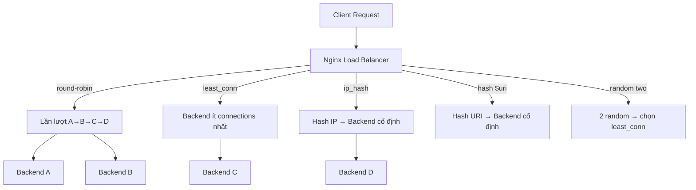

# Day 03: Load Balancing Algorithms

> **Thời lượng**: 2 giờ
> **Độ khó**: ⭐⭐⭐
> **Prerequisites**: Day 01 (Reverse Proxy & Traffic Flow), Day 02 (Nginx Architecture)

---

## 1. Learning Objectives

Sau bài này, bạn sẽ có thể:

- Configure và phân biệt các load balancing algorithm: round-robin, least_conn, ip_hash, hash, random
- Thiết kế weighted upstream phù hợp với backend có cấu hình phần cứng khác nhau
- Giải thích cơ chế sticky session bằng ip_hash và các giới hạn của nó
- Nhận biết anti-pattern khi chọn sai algorithm cho từng use case
- Configure backup server, max_fails, fail_timeout để xử lý failover

---

## 2. The Problem

> Bạn vừa scale hệ thống e-commerce từ 1 lên 4 backend instances. Sau khi bật round-robin, bạn nhận được complaint từ team: một số user bị logout giữa chừng, một số request bị timeout trong khi backend khác vẫn idle, và server mới (RAM 16GB) đang nhận cùng số request như server cũ (RAM 4GB). Đây là 3 vấn đề khác nhau, cần 3 giải pháp khác nhau.

**Pain points thực tế:**

- **Session mất**: Round-robin phân phối request của cùng một user sang nhiều backend khác nhau. Nếu session lưu in-memory (không dùng Redis), user bị logout.
- **Uneven load**: Backend A xử lý request nặng (image resize, DB query chậm) trong khi backend B đang idle. Round-robin vẫn tiếp tục gửi request mới vào backend A đang bận.
- **Capacity mismatch**: Server mới có RAM/CPU gấp 4 lần server cũ nhưng nhận cùng số request — lãng phí tài nguyên.

**Hậu quả nếu thiết kế sai:**

- Dùng ip_hash với mobile clients → sticky session bị phá vỡ khi user đổi mạng (4G → WiFi)
- Dùng round-robin cho long-lived connection (WebSocket, gRPC streaming) → connection imbalance nghiêm trọng
- Dùng least_conn mà không có health check → request tiếp tục gửi vào backend đang chết (0 active connections = "rảnh nhất")

---

## 3. Core Concepts

### 3.1 Analogy

Hãy tưởng tượng một quầy lễ tân khách sạn với 4 nhân viên:

- **Round-robin**: Lần lượt mỗi người một khách. Công bằng về số lượng, không quan tâm khách đó cần bao lâu.
- **Least connections**: Gửi khách đến nhân viên đang phục vụ ít người nhất. Hợp lý hơn khi mỗi khách cần thời gian khác nhau.
- **IP hash**: Khách quen luôn được phục vụ bởi cùng một nhân viên (dựa trên số điện thoại). Đảm bảo tính nhất quán.
- **Weighted**: Nhân viên giỏi hơn nhận nhiều khách hơn theo tỉ lệ đã định.

### 3.2 Các algorithm trong Nginx

```
┌─────────────────────────────────────────────────────────────────┐
│                    NGINX UPSTREAM ALGORITHMS                     │
├──────────────────┬──────────────────────────────────────────────┤
│  round-robin     │  Default. Lần lượt theo thứ tự.              │
│  least_conn      │  Gửi đến backend ít active connections nhất. │
│  ip_hash         │  Hash client IP → backend cố định.           │
│  hash $var       │  Hash bất kỳ biến → backend (consistent).    │
│  random          │  Ngẫu nhiên, có thể kết hợp two least_conn.  │
└──────────────────┴──────────────────────────────────────────────┘
```

### 3.3 Request flow với từng algorithm

**Round-robin:**
```
Request 1 → Backend A
Request 2 → Backend B
Request 3 → Backend C
Request 4 → Backend D
Request 5 → Backend A  ← quay vòng
```

**Least connections:**
```
Backend A: 10 active connections
Backend B:  2 active connections  ← chọn cái này
Backend C:  7 active connections
Backend D:  5 active connections
```

**IP hash:**
```
Client 192.168.1.10  → hash(192.168.1) → Backend B  (luôn luôn)
Client 10.0.0.5      → hash(10.0.0)    → Backend A  (luôn luôn)
Client 172.16.0.1    → hash(172.16.0)  → Backend C  (luôn luôn)
```

**Weighted round-robin:**
```
Backend A (weight=3): nhận 3 request
Backend B (weight=1): nhận 1 request
→ Tỉ lệ 3:1 trong mỗi chu kỳ
```

### 3.4 Diagram tổng quan



---

## 4. How It Works Internally

### 4.1 Round-robin: Weighted Round-Robin thực sự

Nginx không dùng simple round-robin. Nó dùng **Smooth Weighted Round-Robin (SWRR)** — thuật toán của Nginx đảm bảo phân phối đều hơn, tránh burst vào một backend.

Ví dụ với weight A=5, B=1, C=1:

```
Iteration | Current weights before | Selected | Current weights after
    1     | A=5, B=1, C=1          |    A     | A=-2, B=1, C=1
    2     | A=3, B=2, C=2          |    A     | A=-4, B=2, C=2
    3     | A=1, B=3, C=3          |    B     | A=1, B=-4, C=3
    4     | A=6, B=-3, C=4         |    A     | A=-1, B=-3, C=4
    5     | A=4, B=-2, C=5         |    C     | A=4, B=-2, C=-2
    6     | A=9, B=-1, C=-1        |    A     | A=2, B=-1, C=-1
    7     | A=7, B=0, C=0          |    A     | A=0, B=0, C=0
```

Kết quả: A được chọn 5 lần, B 1 lần, C 1 lần — đúng tỉ lệ weight, nhưng phân bổ đều hơn thay vì AAAAABC.

### 4.2 Least connections: Cơ chế đếm

Nginx worker process duy trì counter `active_connections` cho mỗi upstream peer. Khi request đến:

1. Worker đọc counter của tất cả peers (trong shared memory)
2. Chọn peer có counter thấp nhất
3. Tăng counter của peer đó lên 1
4. Khi response trả về, giảm counter xuống 1

**Lưu ý quan trọng**: Counter này là số lượng request đang được xử lý, không phải TCP connections. Với keepalive upstream, một TCP connection có thể phục vụ nhiều request tuần tự.

### 4.3 IP hash: Hash function và giới hạn

Nginx ip_hash dùng hash trên **3 octet đầu** của IPv4 (ví dụ: `192.168.1.x` → hash `192.168.1`). Điều này có nghĩa:

- Tất cả client trong cùng `/24` subnet → cùng backend
- Với IPv6, hash trên toàn bộ địa chỉ

**Vấn đề với NAT và mobile:**

```
Office NAT: 1000 users → 1 public IP → tất cả vào Backend A
Mobile: user đổi từ 4G sang WiFi → IP thay đổi → session mất
IPv6 CGNAT: nhiều user share prefix → uneven distribution
```

### 4.4 Consistent hashing với `hash $variable consistent`

Khác với ip_hash, `hash` directive cho phép hash bất kỳ biến Nginx:

```nginx
hash $request_uri consistent;
hash $cookie_session consistent;
hash $http_x_user_id consistent;
```

Từ khóa `consistent` kích hoạt **Consistent Hashing (Ketama algorithm)**:

```
Không có consistent:
  Backend A: keys 0-33%
  Backend B: keys 33-66%
  Backend C: keys 66-100%
  → Thêm Backend D: remapping ~75% keys

Có consistent (Ketama):
  Mỗi backend có nhiều virtual nodes trên hash ring
  → Thêm Backend D: chỉ remapping ~25% keys
```

Dùng `consistent` khi backend là **cache server** — tránh cache miss hàng loạt khi scale.

### 4.5 Random two: Power-of-Two Choices

```nginx
upstream backend {
    random two least_conn;
    server backend1:8080;
    server backend2:8080;
    server backend3:8080;
    server backend4:8080;
}
```

Thuật toán:
1. Chọn ngẫu nhiên 2 backend từ pool
2. Trong 2 backend đó, chọn cái có ít connections hơn

Ưu điểm: Giảm coordination overhead so với least_conn thuần (không cần đọc toàn bộ pool), phù hợp với pool lớn (>10 backends).

### 4.6 Backup server và failover

```nginx
upstream backend {
    server backend1:8080;
    server backend2:8080;
    server backend3:8080 backup;  # chỉ dùng khi tất cả primary down
}
```

Nginx theo dõi health thụ động (passive health check):
- `max_fails=3`: sau 3 lần fail liên tiếp → đánh dấu backend là unavailable
- `fail_timeout=30s`: sau 30 giây, thử lại backend đó
- Khi tất cả primary down → traffic chuyển sang backup

---

## 5. Hands-on Lab

Xem file `exercises.md` để thực hành đầy đủ với Docker Compose.

**Tóm tắt lab:**
1. Dựng 1 Nginx + 4 backend echo server
2. Test round-robin: 100 requests, đếm phân phối
3. Test least_conn: backend với độ trễ khác nhau
4. Test ip_hash: sticky behavior
5. Test weighted: tỉ lệ 3:1
6. Failover: kill 1 backend, quan sát redistribution

---

## 6. Trade-offs Analysis

### 6.1 Bảng so sánh chính

| Algorithm | Latency-sensitive | Stateful App | Cache-friendly | Uneven Backend | Complexity | Khi nào dùng |
|---|:---:|:---:|:---:|:---:|:---:|---|
| round-robin | Tốt | Không | Không | Không | Thấp | Stateless app, backend đồng nhất |
| least_conn | Rất tốt | Không | Không | Tốt | Thấp | Backend có response time khác nhau |
| ip_hash | Trung bình | Có (giới hạn) | Không | Không | Thấp | Pseudo sticky session (không có Redis) |
| hash $var | Tốt | Có (theo var) | Rất tốt | Không | Trung bình | Cache backend, session theo cookie/header |
| hash consistent | Tốt | Có | Rất tốt | Không | Trung bình | Cache backend, scale in/out thường xuyên |
| random two | Rất tốt | Không | Không | Tốt | Thấp | Pool lớn, giảm coordination overhead |
| weighted | Tốt | Không | Không | Rất tốt | Thấp | Backend khác cấu hình phần cứng |

### 6.2 Hidden costs và pitfalls

**ip_hash:**
- Không thực sự là sticky session — chỉ là "best effort"
- Khi thêm/bớt backend, hash mapping thay đổi → session mất
- Office NAT: 1000 users → 1 backend → không load balance được

**least_conn:**
- Không tính đến "weight" của từng request (1 request nặng = 1 request nhẹ)
- Với backend đang chết (0 connections), Nginx vẫn gửi request vào đó trước khi phát hiện lỗi
- Cần kết hợp với health check để hiệu quả

**weighted:**
- Weight tĩnh, không tự điều chỉnh theo load thực tế
- Nếu backend A (weight=3) bị chậm, vẫn nhận 3x traffic
- Không phải giải pháp cho auto-scaling

**hash $variable (không có consistent):**
- Thêm/bớt 1 backend → remapping ~(N-1)/N keys → cache miss hàng loạt
- Luôn dùng `consistent` khi backend là cache

### 6.3 Anti-patterns

```
ANTI-PATTERN 1: ip_hash với mobile app
  → User đổi mạng → IP thay đổi → session mất
  → Giải pháp: dùng hash $cookie_session hoặc Redis session

ANTI-PATTERN 2: round-robin cho long-lived connections
  → WebSocket/gRPC: connection mở lâu → backend đầu tiên nhận
    tất cả connections mới trong khi backend khác idle
  → Giải pháp: least_conn

ANTI-PATTERN 3: weighted mà không có health check
  → Backend A (weight=3) chết → 75% traffic bị lỗi
  → Giải pháp: luôn configure max_fails + fail_timeout

ANTI-PATTERN 4: hash $request_uri cho API có query string động
  → /api/users?page=1, /api/users?page=2 → hash khác nhau
  → Không sticky theo user, chỉ sticky theo URL
  → Giải pháp: hash $cookie_session hoặc $http_x_user_id
```

---

## 7. Best Practices & Best Solution

### 7.1 Decision tree chọn algorithm

```
Bạn có stateful session không?
├── Có → Dùng Redis/external session store
│         → Sau đó dùng round-robin hoặc least_conn
│         → KHÔNG dùng ip_hash làm giải pháp chính
└── Không → Backend có response time đồng đều không?
            ├── Có → round-robin (đơn giản, hiệu quả)
            └── Không → least_conn

Backend có phải cache server không?
└── Có → hash $request_uri consistent

Backend có cấu hình phần cứng khác nhau không?
└── Có → weighted round-robin (hoặc weighted least_conn)

Pool backend lớn (>10)?
└── Có → random two least_conn
```

### 7.2 Production best practices

**1. Luôn có health check:**
```nginx
upstream backend {
    least_conn;
    server backend1:8080 max_fails=3 fail_timeout=30s;
    server backend2:8080 max_fails=3 fail_timeout=30s;
    server backend3:8080 backup;
}
```

**2. Kết hợp algorithm với keepalive:**
```nginx
upstream backend {
    least_conn;
    server backend1:8080;
    server backend2:8080;
    keepalive 32;          # giữ 32 idle connections mỗi worker
    keepalive_requests 100;
    keepalive_timeout 60s;
}
```

**3. Sticky session đúng cách (không dùng ip_hash):**
```nginx
# Dùng hash theo cookie (cần set cookie ở application layer)
upstream backend {
    hash $cookie_session_id consistent;
    server backend1:8080;
    server backend2:8080;
}
```

**4. Weighted với slow-start (Nginx Plus / OpenResty):**
```nginx
# Nginx OSS: không có slow-start, phải tự quản lý
# Nginx Plus: server backend1:8080 weight=5 slow_start=30s;
# Workaround OSS: bắt đầu với weight thấp, tăng dần thủ công
```

### 7.3 Recommended solution theo use case

| Use case | Algorithm | Lý do |
|---|---|---|
| REST API stateless | least_conn | Xử lý uneven response time tốt hơn round-robin |
| WebSocket / gRPC streaming | least_conn | Long-lived connections cần balance theo số lượng |
| Cache backend (Redis, Memcached) | hash $key consistent | Tối đa cache hit rate |
| Session-based app (legacy) | hash $cookie_session consistent | Sticky theo session ID, không phụ thuộc IP |
| Mixed hardware (old + new server) | weighted least_conn | Tận dụng server mạnh hơn |
| Microservices đồng nhất | round-robin | Đơn giản, đủ tốt |

---

## 8. Performance Considerations

### 8.1 Benchmark Methodology

```
Tool: wrk + hey
CPU: 4 vCPU (test environment)
RAM: 8GB
Payload: 1KB JSON response
Duration: 60s
Connections: 200
Threads: 4
TLS: Off
Keepalive: On
Backend: 4 instances (echo server)
```

> Lưu ý: số liệu dưới đây chỉ dùng để tham khảo tương đối. Kết quả thực tế phụ thuộc vào hardware, kernel, network, payload, TLS, logging và plugin.

### 8.2 Overhead của từng algorithm

| Algorithm | CPU overhead | Memory overhead | Ghi chú |
|---|---|---|---|
| round-robin | Rất thấp | Rất thấp | Chỉ cần counter đơn giản |
| least_conn | Thấp | Thấp | Đọc shared memory counter |
| ip_hash | Thấp | Thấp | Hash computation đơn giản |
| hash $var | Thấp-Trung bình | Thấp | Phụ thuộc độ phức tạp của biến |
| hash consistent | Trung bình | Trung bình | Ketama ring lookup |
| random two | Thấp | Thấp | 2 random + 1 comparison |

**Thực tế**: Với traffic thông thường (<50k RPS), overhead của algorithm selection là không đáng kể. Bottleneck thường nằm ở backend, không phải ở Nginx.

### 8.3 Bottleneck thường gặp

```
1. Backend chậm + round-robin:
   → Request queue up tại backend chậm
   → Dùng least_conn để tự động tránh backend bận

2. ip_hash với NAT:
   → 1 backend nhận 80% traffic
   → Monitor: nginx_upstream_requests_total per backend

3. Keepalive không được configure:
   → Mỗi request tạo TCP connection mới đến backend
   → Tăng latency ~1-3ms mỗi request (TCP handshake)
   → Thêm keepalive 32 vào upstream block

4. max_fails quá thấp:
   → Backend bị đánh dấu unavailable do spike tạm thời
   → Tăng fail_timeout, giảm max_fails
```

### 8.4 Tuning parameters quan trọng

```nginx
upstream backend {
    least_conn;

    server backend1:8080 max_fails=3 fail_timeout=30s weight=1;
    server backend2:8080 max_fails=3 fail_timeout=30s weight=1;

    # Keepalive connections đến backend
    keepalive 32;
    keepalive_requests 1000;
    keepalive_timeout 60s;
}

server {
    location /api/ {
        proxy_pass http://backend;

        # Timeout budget
        proxy_connect_timeout 5s;
        proxy_send_timeout 30s;
        proxy_read_timeout 30s;

        # Retry chỉ với idempotent methods
        proxy_next_upstream error timeout http_502 http_503;
        proxy_next_upstream_tries 2;
        proxy_next_upstream_timeout 10s;
    }
}
```

---

## 9. Troubleshooting Checklist

### 9.1 Phân phối không đều

```
□ Kiểm tra weight của từng server trong upstream block
□ Kiểm tra ip_hash có đang dùng không (NAT issue?)
□ Kiểm tra số lượng active connections: nginx_upstream_active
□ Kiểm tra access log: grep backend_name /var/log/nginx/access.log | wc -l
□ Kiểm tra keepalive: connection reuse có đang hoạt động không?
```

### 9.2 Session mất sau khi scale

```
□ Xác nhận algorithm đang dùng (cat nginx.conf | grep -A5 upstream)
□ Kiểm tra ip_hash: user có đổi IP không? (mobile, VPN, NAT)
□ Kiểm tra hash $cookie: cookie có được set đúng không?
□ Kiểm tra số lượng backend: thêm/bớt backend làm hash thay đổi?
□ Giải pháp dài hạn: chuyển session sang Redis
```

### 9.3 Backend bị đánh dấu unavailable sai

```
□ Kiểm tra max_fails và fail_timeout trong upstream config
□ Kiểm tra error log: tail -f /var/log/nginx/error.log
□ Kiểm tra backend health: curl -v http://backend:8080/health
□ Kiểm tra proxy_next_upstream: có retry quá nhiều không?
□ Kiểm tra timeout: proxy_connect_timeout có quá thấp không?
```

### 9.4 502/503 sau khi thêm backend mới

```
□ Kiểm tra DNS resolution: nslookup backend-hostname
□ Kiểm tra port: nc -zv backend-host 8080
□ Kiểm tra firewall/security group
□ Kiểm tra backend đã ready chưa: health endpoint trả về 200?
□ Kiểm tra Nginx reload: nginx -t && nginx -s reload
```

### 9.5 Metrics cần theo dõi

```
nginx_upstream_requests_total{upstream, server}   # phân phối request
nginx_upstream_active_connections{upstream}        # active connections
nginx_upstream_fails_total{upstream, server}       # số lần fail
nginx_upstream_response_time_seconds{quantile}     # latency per backend
```

---

## 10. Completion Checklist

- [ ] Giải thích được sự khác nhau giữa round-robin, least_conn, ip_hash, hash, random
- [ ] Configure được weighted upstream với tỉ lệ mong muốn
- [ ] Giải thích được tại sao ip_hash không phải sticky session thực sự
- [ ] Configure được backup server và passive health check (max_fails, fail_timeout)
- [ ] Chạy được lab Docker Compose với 4 backend và test từng algorithm
- [ ] Quan sát được phân phối request thực tế khác với lý thuyết trong trường hợp nào
- [ ] Biết khi nào dùng `hash $var consistent` thay vì ip_hash

---

## 11. References

- [Nginx upstream module documentation](https://nginx.org/en/docs/http/ngx_http_upstream_module.html)
- [Nginx load balancing guide](https://docs.nginx.com/nginx/admin-guide/load-balancer/http-load-balancer/)
- [Smooth Weighted Round-Robin algorithm — Nginx blog](https://www.nginx.com/blog/nginx-power-of-two-choices-load-balancing-algorithm/)
- [Consistent Hashing (Ketama) — Last.fm engineering](https://www.last.fm/user/RJ/journal/2007/04/10/rz_libketama_-_a_consistent_hashing_algo_for_memcache_clients)
- [Power of Two Random Choices — Michael Mitzenmacher paper](https://www.eecs.harvard.edu/~michaelm/postscripts/handbook2001.pdf)
- [HAProxy load balancing algorithms comparison](https://www.haproxy.com/blog/load-balancing-affinity-persistence-sticky-sessions-what-you-need-to-know/)
- [Nginx upstream health checks](https://docs.nginx.com/nginx/admin-guide/load-balancer/http-health-check/)

---

## Recap

Hôm nay bạn đã học 6 load balancing algorithm trong Nginx: round-robin (default, đơn giản), least_conn (tốt cho uneven response time), ip_hash (pseudo sticky session với nhiều giới hạn), hash $variable consistent (cache-friendly, scale tốt), weighted (backend khác cấu hình), và random two (pool lớn). Điểm quan trọng nhất: không có algorithm nào là tốt nhất cho mọi trường hợp — phải chọn dựa trên đặc điểm của workload và backend.

## Preview Day 04

**Day 04: Health Check, Failover & Upstream Failure** — Bạn sẽ học cách Nginx phát hiện backend chết (passive vs active health check), phân tích các HTTP error code 502/503/504 từ góc độ upstream, configure retry strategy đúng cách, và mô phỏng các failure scenario thực tế để hiểu behavior của hệ thống khi có sự cố.
