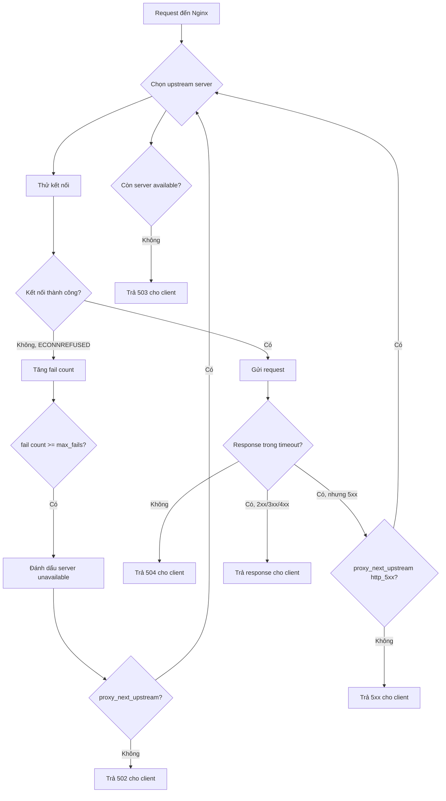

# Day 4: Health Check, Failover & Upstream Failure

> **Thời lượng**: 2 giờ
> **Độ khó**: ⭐⭐⭐
> **Prerequisites**: Day 1 (Reverse Proxy), Day 2 (Nginx Architecture), Day 3 (Load Balancing Algorithms)

---

## 1. Learning Objectives

Sau bài này, bạn sẽ có thể:

- Phân biệt **passive health check** và **active health check**, biết khi nào dùng cái nào
- Configure `max_fails`, `fail_timeout`, `backup`, `down` trong Nginx upstream
- Phân tích chính xác nguyên nhân gây ra **502**, **503**, **504** từ Nginx error log
- Configure `proxy_next_upstream` để retry sang backend khác khi gặp lỗi
- Thiết kế **timeout budget** đúng thứ tự: client → edge → gateway → upstream
- Debug failover behavior bằng Docker Compose với nhiều failure scenario

---

## 2. The Problem

> Bạn đang vận hành một API service với 3 backend replicas đằng sau Nginx. Lúc 2 giờ sáng, một backend bị OOM killer terminate. Nginx vẫn tiếp tục gửi traffic vào backend đó, khiến 1/3 request trả về 502. Monitoring alert lên nhưng on-call engineer mất 10 phút mới xử lý xong. Trong 10 phút đó, hàng nghìn request thất bại.

**Vấn đề thực tế:**

- Nginx không tự biết backend đã chết cho đến khi thực sự thử kết nối và thất bại
- Sau khi phát hiện backend chết, Nginx cần bao lâu để ngừng gửi traffic vào đó?
- Nếu tất cả backend đều chết, Nginx trả về gì?
- Nếu backend không chết hẳn mà chỉ chậm (slow response), Nginx xử lý thế nào?

**Pain points:**

- **Passive health check** (Nginx OSS mặc định): chỉ phát hiện lỗi khi đã có request thất bại thực sự
- **Active health check** (Nginx Plus / module bên thứ ba): probe định kỳ, phát hiện sớm hơn nhưng tốn tài nguyên
- Không có circuit breaker tích hợp trong Nginx OSS → phải dùng `proxy_next_upstream` + `max_fails` + `fail_timeout`

**Hậu quả nếu thiết kế sai:**

- `fail_timeout` quá dài → backend chết nhưng Nginx vẫn thử trong nhiều phút
- `max_fails` quá thấp → backend bị đánh dấu down vì 1-2 lỗi thoáng qua (false positive)
- Không có `proxy_next_upstream` → mỗi request chỉ thử 1 backend, không retry
- Timeout budget sai thứ tự → client timeout trước khi gateway có cơ hội retry

---

## 3. Core Concepts

### 3.1 Passive Health Check (Nginx OSS)

Nginx OSS không chủ động probe backend. Nó chỉ theo dõi kết quả của các request thực tế.

**Analogy**: Giống như bạn chỉ biết một nhà hàng đóng cửa khi bạn đến tận nơi và thấy cửa khóa, không phải vì ai đó gọi điện kiểm tra trước.

```nginx
upstream backend_pool {
    server 10.0.0.1:8080 max_fails=3 fail_timeout=30s;
    server 10.0.0.2:8080 max_fails=3 fail_timeout=30s;
    server 10.0.0.3:8080 max_fails=3 fail_timeout=30s;
}
```

- `max_fails=3`: sau 3 lần thất bại liên tiếp trong `fail_timeout` window → đánh dấu server là **unavailable**
- `fail_timeout=30s`: khoảng thời gian đếm số lần thất bại VÀ thời gian server bị đánh dấu unavailable
- Sau `fail_timeout`, Nginx thử lại 1 request để kiểm tra server có sống lại chưa

### 3.2 Active Health Check (Nginx Plus / Module)

Nginx Plus có directive `health_check` trong `location` block, probe định kỳ mà không cần request thực.

```nginx
# Nginx Plus only
upstream backend_pool {
    zone backend_zone 64k;
    server 10.0.0.1:8080;
    server 10.0.0.2:8080;
}

server {
    location /api/ {
        proxy_pass http://backend_pool;
        health_check interval=5s fails=2 passes=3 uri=/health;
    }
}
```

**Nginx OSS alternatives:**
- `nginx_upstream_check_module` (Tengine fork)
- External health checker (HAProxy, Consul, Kubernetes liveness probe) kết hợp với dynamic upstream reload
- Sử dụng Kong Gateway (có active health check tích hợp)

### 3.3 Phân biệt 502 / 503 / 504

```
┌─────────────────────────────────────────────────────────────────┐
│                    HTTP Error từ Nginx                          │
├──────────┬──────────────────────────────────────────────────────┤
│  502     │ Bad Gateway                                          │
│          │ Nginx kết nối được đến upstream nhưng nhận response  │
│          │ không hợp lệ, hoặc upstream từ chối kết nối (ECONNREFUSED) │
│          │ hoặc reset connection (ECONNRESET)                   │
├──────────┼──────────────────────────────────────────────────────┤
│  503     │ Service Unavailable                                  │
│          │ Tất cả upstream đều bị đánh dấu unavailable          │
│          │ (đã vượt max_fails) → không còn server nào để gửi   │
├──────────┼──────────────────────────────────────────────────────┤
│  504     │ Gateway Timeout                                      │
│          │ Nginx kết nối được đến upstream nhưng upstream       │
│          │ không trả lời trong thời gian proxy_read_timeout     │
└──────────┴──────────────────────────────────────────────────────┘
```

### 3.4 Failover Decision Flow



---

## 4. How It Works Internally

### 4.1 Passive Health Check Lifecycle

```
Timeline:
t=0s   Request 1 → server A → ECONNREFUSED → fail_count[A]=1
t=1s   Request 2 → server A → ECONNREFUSED → fail_count[A]=2
t=2s   Request 3 → server A → ECONNREFUSED → fail_count[A]=3 → A marked UNAVAILABLE
t=2s   Request 4 → server B (A bị skip)
...
t=32s  fail_timeout hết → A được thử lại (1 request probe)
t=32s  Request probe → server A → SUCCESS → A marked AVAILABLE lại
t=32s  fail_count[A] reset về 0
```

**Quan trọng**: Trong khoảng `t=0s` đến `t=2s`, 3 request đã thất bại trước khi A bị đánh dấu down. Đây là chi phí của passive health check.

### 4.2 proxy_next_upstream Behavior

```nginx
proxy_next_upstream error timeout invalid_header http_500 http_502 http_503;
proxy_next_upstream_tries 3;
proxy_next_upstream_timeout 10s;
```

- `error`: lỗi kết nối (ECONNREFUSED, ECONNRESET)
- `timeout`: `proxy_connect_timeout` hoặc `proxy_read_timeout` hết
- `http_502`, `http_503`: upstream trả về 502/503
- `proxy_next_upstream_tries 3`: tối đa thử 3 server (bao gồm lần đầu)
- `proxy_next_upstream_timeout 10s`: tổng thời gian cho tất cả các lần retry không vượt quá 10s

**Cảnh báo**: `proxy_next_upstream` chỉ an toàn với **idempotent requests** (GET, HEAD). Với POST/PUT/DELETE, retry có thể gây duplicate action.

### 4.3 Timeout Parameters

```nginx
proxy_connect_timeout 5s;   # Thời gian chờ thiết lập TCP connection
proxy_send_timeout    60s;  # Thời gian chờ gửi request body đến upstream
proxy_read_timeout    60s;  # Thời gian chờ nhận response từ upstream
```

**Timeout Budget nguyên tắc bắt buộc:**

```
Client timeout (browser/mobile)
  > Edge Nginx timeout (proxy_read_timeout)
    > Gateway timeout (Kong/internal proxy)
      > Upstream service timeout
        > Database/cache timeout
```

**Sai lầm phổ biến:**

```
Client timeout = 30s
Nginx proxy_read_timeout = 60s  ← SAI: client đã timeout trước khi Nginx nhận được response
```

Khi client timeout trước, Nginx vẫn giữ connection đến upstream, lãng phí tài nguyên.

### 4.4 Backup Server

```nginx
upstream backend_pool {
    server 10.0.0.1:8080;
    server 10.0.0.2:8080;
    server 10.0.0.3:8080 backup;  # Chỉ dùng khi tất cả primary down
}
```

Backup server không nhận traffic bình thường. Chỉ được kích hoạt khi tất cả non-backup server đều unavailable.

### 4.5 DNS Resolution Issue

Nginx resolve DNS của upstream **một lần khi startup** (hoặc khi reload). Nếu backend đổi IP sau đó, Nginx vẫn dùng IP cũ cho đến khi reload.

```nginx
# Giải pháp: dùng resolver + set $upstream động
resolver 127.0.0.1 valid=30s;
set $upstream_host "backend.internal";
proxy_pass http://$upstream_host;
```

---

## 5. Hands-on Lab

Xem file `exercises.md` để thực hành đầy đủ 5 failure scenarios với Docker Compose.

**Tóm tắt lab setup:**

```yaml
# docker-compose.yml
services:
  nginx:
    image: nginx:1.25-alpine
    ports: ["8080:80"]
    volumes: ["./nginx.conf:/etc/nginx/nginx.conf:ro"]
    depends_on: [backend1, backend2, backend3]

  backend1:
    image: python:3.11-slim
    command: python -c "
      import http.server, time
      class H(http.server.BaseHTTPRequestHandler):
        def do_GET(self):
          self.send_response(200)
          self.end_headers()
          self.wfile.write(b'backend1')
      http.server.HTTPServer(('', 8080), H).serve_forever()"
    ports: ["8081:8080"]

  backend2:
    image: python:3.11-slim
    command: python -c "..."  # tương tự, trả về 'backend2'
    ports: ["8082:8080"]

  backend3:
    image: python:3.11-slim
    command: python -c "..."  # tương tự, trả về 'backend3'
    ports: ["8083:8080"]
```

```nginx
# nginx.conf - cấu hình cho lab
upstream backend_pool {
    server backend1:8080 max_fails=2 fail_timeout=15s;
    server backend2:8080 max_fails=2 fail_timeout=15s;
    server backend3:8080 max_fails=2 fail_timeout=15s;
}

server {
    listen 80;

    location / {
        proxy_pass http://backend_pool;
        proxy_connect_timeout 3s;
        proxy_read_timeout    10s;
        proxy_next_upstream   error timeout http_500 http_502 http_503;
        proxy_next_upstream_tries 3;
        proxy_next_upstream_timeout 15s;

        add_header X-Upstream-Addr $upstream_addr;
        add_header X-Upstream-Status $upstream_status;
    }
}
```

**Scenario nhanh - kill 1 backend:**

```bash
# Terminal 1: gửi request liên tục
while true; do curl -s http://localhost:8080/ -w " [%{http_code}]\n"; sleep 0.5; done

# Terminal 2: kill backend1
docker compose stop backend1

# Quan sát: vài upstream attempt đầu fail; client có thể vẫn nhận 200 nếu retry sang backend khác thành công
# Access log sẽ cho thấy upstream_status dạng "502, 200" trong các request có retry
# Sau max_fails lần thất bại, backend1 bị đánh dấu down
# Traffic tự động chuyển sang backend2 và backend3
```

---

## 6. Trade-offs Analysis

### 6.1 Passive vs Active vs Hybrid Health Check

| Tiêu chí | Passive (Nginx OSS) | Active (Nginx Plus) | Hybrid (External) |
|---|---|---|---|
| Phát hiện lỗi | Chậm (sau khi request thất bại) | Nhanh (probe định kỳ) | Nhanh |
| Tài nguyên | Thấp | Trung bình (probe traffic) | Cao (thêm component) |
| False positive | Có thể (thoáng qua) | Ít hơn (passes threshold) | Tùy config |
| Complexity | Thấp | Trung bình | Cao |
| Chi phí | Miễn phí | Nginx Plus license | Tùy tool |
| Khi nào dùng | Hầu hết use case | Cần phát hiện nhanh | Microservices + Consul/K8s |

### 6.2 Xử lý 502 vs 503 vs 504

| Lỗi | Nguyên nhân chính | Hành động ngay | Hành động dài hạn |
|---|---|---|---|
| 502 | Backend crash, ECONNREFUSED, OOM | Kiểm tra backend process, restart | Tăng `max_fails`, thêm replica, alert |
| 503 | Tất cả backend down | Khởi động lại ít nhất 1 backend | Backup server, circuit breaker, capacity planning |
| 504 | Backend slow, DB lock, GC pause | Kiểm tra backend latency, DB query | Giảm `proxy_read_timeout`, tối ưu backend, timeout budget |

### 6.3 proxy_next_upstream: Khi nào bật, khi nào tắt

| Scenario | Nên bật | Lý do |
|---|---|---|
| GET /api/products | Có | Idempotent, safe to retry |
| POST /api/orders | Không | Có thể tạo duplicate order |
| PUT /api/payment | Không | Có thể charge 2 lần |
| GET /api/health | Có | Idempotent |
| POST /api/search | Tùy | Idempotent về mặt data nhưng tốn CPU |

---

## 7. Best Practices & Best Solution

### 7.1 Production Configuration Template

```nginx
upstream api_backend {
    # Primary servers
    server 10.0.0.1:8080 max_fails=3 fail_timeout=30s weight=1;
    server 10.0.0.2:8080 max_fails=3 fail_timeout=30s weight=1;
    server 10.0.0.3:8080 max_fails=3 fail_timeout=30s weight=1;

    # Backup server (chỉ dùng khi tất cả primary down)
    server 10.0.0.4:8080 backup;

    keepalive 32;
}

server {
    listen 80;

    location /api/ {
        proxy_pass http://api_backend;

        # Timeout budget: client (30s) > Nginx (25s) > upstream (20s)
        proxy_connect_timeout  5s;
        proxy_send_timeout    25s;
        proxy_read_timeout    25s;

        # Retry chỉ với idempotent errors
        proxy_next_upstream error timeout http_502 http_503;
        proxy_next_upstream_tries 2;       # Tối đa 2 lần thử
        proxy_next_upstream_timeout 20s;   # Tổng budget cho retry

        # Headers để debug
        proxy_set_header X-Real-IP $remote_addr;
        proxy_set_header X-Forwarded-For $proxy_add_x_forwarded_for;
        add_header X-Upstream-Addr $upstream_addr always;
    }
}
```

### 7.2 Anti-patterns cần tránh

**Anti-pattern 1: Retry vô hạn**
```nginx
# SAI
proxy_next_upstream_tries 0;  # 0 = unlimited → retry storm
```

**Anti-pattern 2: Timeout quá cao**
```nginx
# SAI: giữ connection 5 phút, lãng phí worker connection
proxy_read_timeout 300s;
```

**Anti-pattern 3: Gateway timeout > Client timeout**
```
Client timeout = 10s
proxy_read_timeout = 60s  ← SAI: client đã ngắt kết nối, Nginx vẫn chờ
```

**Anti-pattern 4: max_fails=1**
```nginx
# SAI: 1 lỗi thoáng qua (network blip) → backend bị đánh dấu down
server backend1:8080 max_fails=1 fail_timeout=60s;
```

**Anti-pattern 5: Retry POST/PUT/DELETE**
```nginx
# SAI: có thể gây duplicate transaction
proxy_next_upstream error timeout http_500 http_502 http_503;
# Không phân biệt GET vs POST
```

### 7.3 Recommended Solution theo Use Case

**Use case: REST API với mix GET/POST**
```
Bật proxy_next_upstream chỉ cho: error timeout http_502 http_503
Không bật: http_500 (có thể là business error, không nên retry)
Giới hạn: proxy_next_upstream_tries 2
```

**Use case: Payment/Order API**
```
Tắt proxy_next_upstream hoàn toàn cho POST/PUT
Dùng idempotency key ở application layer
Timeout ngắn + alert nhanh thay vì retry
```

**Use case: Internal microservice**
```
Dùng Kong Gateway với active health check
Circuit breaker ở Kong layer
Nginx chỉ làm edge proxy, không cần retry phức tạp
```

---

## 8. Performance Considerations

### 8.1 Benchmark Methodology

```
Tool: wrk
CPU: 4 vCPU
RAM: 8GB
Payload: 1KB JSON response
Duration: 60s
Connections: 100
Threads: 4
TLS: Off
Keepalive: On
Backend: 3 instances Python HTTP server
```

> Lưu ý: số liệu chỉ dùng để tham khảo. Kết quả thực tế phụ thuộc vào hardware, kernel, network, payload, TLS, logging và plugin.

### 8.2 Impact của Health Check Config lên Performance

| Config | Latency p99 | Error rate khi 1 backend down | Ghi chú |
|---|---|---|---|
| max_fails=1, fail_timeout=10s | Thấp | ~0.3% (1 request thất bại) | Aggressive, false positive cao |
| max_fails=3, fail_timeout=30s | Thấp | ~1% (3 request thất bại) | Balanced |
| max_fails=5, fail_timeout=60s | Thấp | ~1.7% (5 request thất bại) | Conservative |
| Không có health check | Thấp | ~33% (1/3 request đến dead backend) | Nguy hiểm |

### 8.3 Bottleneck khi Failover

- **Worker connection exhaustion**: khi backend slow, connections bị giữ lâu → `worker_connections` cạn kiệt
- **Retry storm**: nhiều request retry cùng lúc → tăng load lên backend đang yếu
- **Timeout cascade**: upstream timeout → Nginx timeout → client timeout → client retry → tăng load thêm

**Detect bottleneck:**
```bash
# Kiểm tra active connections
curl -s http://localhost/nginx_status

# Kiểm tra error log
tail -f /var/log/nginx/error.log | grep -E "upstream|connect|timeout"

# Kiểm tra upstream response time
awk '{print $NF}' /var/log/nginx/access.log | sort -n | awk 'NR==int(NR*0.95)'
```

---

## 9. Troubleshooting Checklist

Khi gặp 502/503/504 từ Nginx:

**Bước 1: Xác định loại lỗi**
- [ ] Đọc Nginx error log: `tail -100 /var/log/nginx/error.log`
- [ ] Tìm keyword: `connect() failed`, `upstream timed out`, `no live upstreams`
- [ ] Kiểm tra HTTP status code trong access log

**Bước 2: Kiểm tra upstream**
- [ ] `curl -v http://backend-ip:port/health` từ Nginx host
- [ ] Kiểm tra process backend còn chạy không: `ps aux | grep <service>`
- [ ] Kiểm tra port đang listen: `ss -tlnp | grep <port>`
- [ ] Kiểm tra firewall/security group

**Bước 3: Kiểm tra timeout**
- [ ] So sánh `proxy_read_timeout` với thời gian backend xử lý thực tế
- [ ] Kiểm tra DB query time nếu backend slow
- [ ] Kiểm tra GC pause nếu backend là JVM

**Bước 4: Kiểm tra health check state**
- [ ] Nginx Plus: `curl http://localhost/api/status` (upstream status API)
- [ ] Nginx OSS: quan sát error log để thấy khi nào backend bị đánh dấu down
- [ ] Kiểm tra `fail_timeout` còn hiệu lực không

**Bước 5: Kiểm tra resource**
- [ ] `cat /proc/sys/net/core/somaxconn` (connection backlog)
- [ ] `ulimit -n` (file descriptor limit)
- [ ] `free -m` (memory)
- [ ] `top` hoặc `htop` (CPU)

**Error log patterns:**

```
# 502: connection refused
connect() failed (111: Connection refused) while connecting to upstream

# 502: connection reset
recv() failed (104: Connection reset by peer) while reading response header

# 504: read timeout
upstream timed out (110: Connection timed out) while reading response header

# 503: no upstream available
no live upstreams while connecting to upstream
```

---

## 10. Completion Checklist

Tự đánh giá sau khi hoàn thành Day 4:

- [ ] Giải thích được sự khác biệt giữa passive và active health check, và tại sao Nginx OSS chỉ có passive
- [ ] Configure được `max_fails` và `fail_timeout` phù hợp với SLA của service
- [ ] Phân biệt được 502, 503, 504 từ error log message cụ thể
- [ ] Configure được `proxy_next_upstream` đúng cách, biết khi nào không nên dùng
- [ ] Thiết kế được timeout budget đúng thứ tự: client > edge > gateway > upstream
- [ ] Chạy được ít nhất 3 failure scenario trong lab và quan sát đúng HTTP status code
- [ ] Giải thích được retry storm là gì và cách phòng tránh

---

## 11. References

- [Nginx upstream module documentation](https://nginx.org/en/docs/http/ngx_http_upstream_module.html)
- [Nginx proxy module - proxy_next_upstream](https://nginx.org/en/docs/http/ngx_http_proxy_module.html#proxy_next_upstream)
- [Nginx Plus active health checks](https://docs.nginx.com/nginx/admin-guide/load-balancer/http-health-check/)
- [Understanding Nginx 502/503/504](https://www.nginx.com/blog/avoiding-top-10-nginx-configuration-mistakes/)
- [Timeout best practices - AWS Architecture Blog](https://aws.amazon.com/builders-library/timeouts-retries-and-backoff-with-jitter/)
- [Retry storms and how to avoid them - Netflix Tech Blog](https://netflixtechblog.com/making-the-netflix-api-more-resilient-a8ec62159c2d)
- [Circuit Breaker Pattern - Martin Fowler](https://martinfowler.com/bliki/CircuitBreaker.html)

---

## Recap

Hôm nay bạn đã học:

- **Passive health check** là cơ chế mặc định của Nginx OSS: phát hiện lỗi sau khi request thất bại thực sự, không phải probe định kỳ
- **502** = upstream từ chối kết nối hoặc trả response không hợp lệ; **503** = không còn upstream nào available; **504** = upstream không trả lời trong timeout
- `proxy_next_upstream` cho phép retry sang backend khác, nhưng chỉ an toàn với idempotent requests
- **Timeout budget** phải theo thứ tự: client > edge > gateway > upstream, vi phạm thứ tự này gây lãng phí tài nguyên
- Retry storm là nguy cơ thực sự khi nhiều layer cùng retry vào backend đang yếu

## Preview Day 5

**Day 5: TLS Termination, HTTP/2 & Secure Edge**

Ngày mai bạn sẽ học cách bật HTTPS cho Nginx, terminate TLS tại edge, cấu hình HTTP/2, và hiểu tại sao TLS termination tại gateway layer lại quan trọng hơn là để từng backend tự xử lý TLS. Bạn cũng sẽ thực hành tạo self-signed certificate và cấu hình cipher suite phù hợp cho production.
