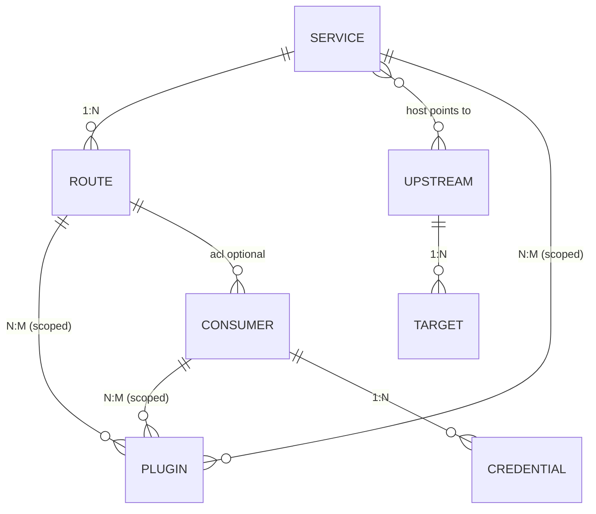
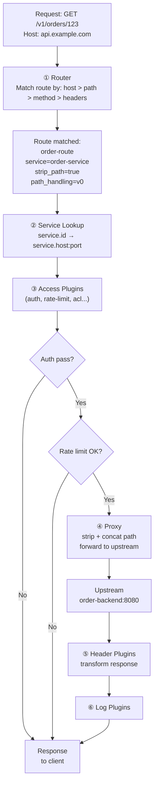

# Day 09: Kong Core Entities: Services, Routes, Consumers, Plugins

> **Thời lượng**: 2 giờ
> **Độ khó**: ⭐⭐⭐
> **Prerequisites**: Day 8 (Kong Architecture & OpenResty Foundation)

---

## 1. Learning Objectives

Sau bài này, bạn sẽ có thể:

- Configure **Service**, **Route**, **Consumer**, **Plugin** bằng Admin API (curl)
- Hiểu mối quan hệ 1 Service : N Route và 1 Route : 1 Service
- Phân biệt **plugin scope** (global / service / route / consumer) và precedence khi nhiều scope match
- Chuyển declarative config từ Admin API imperative sang `kong.yml`
- Troubleshoot routing issues: 404, 401, 502 bằng Admin API inspection

---

## 2. The Problem

> Bạn vừa migrate 5 internal API services từ standalone Nginx sang Kong. Mỗi service cần:
> - `/v1/orders` route tới order-service (port 8080)
> - `/v1/payments` route tới payment-service (port 8081), yêu cầu API key
> - `/v1/tracking` route tới tracking-service (port 8082), yêu cầu JWT
> - `/admin/*` route chỉ consumer `admin-team` được gọi
> - Tất cả endpoint công khai phải rate-limit 100 req/min
> - Mỗi service có timeout riêng (orders: 30s, payments: 10s, tracking: 15s)
>
> **Câu hỏi**: dùng `kong.yml` hay Admin API? Plugin scope nào? Route precedence ra sao nếu `/v1/orders` và `/v1/orders/urgent` cùng tồn tại?

**Pain points thực tế:**

- Entity đặt tên không rõ ràng, rely trên UUID → khó debug, khó migrate config
- Plugin global bật cho toàn bộ traffic nhưng không biết tại sao request chậm
- Route path overlap không hiểu precedence → route sai được chọn → 404 hoặc 401
- Service trỏ thẳng host thay vì qua Upstream → không tận dụng load balancing ảo
- Anti-pattern: tạo 1 Service, 1 Route prefix `/`, push mọi traffic vào → mất routing logic
- Kong DB-less mà dùng CRUD Admin API → `405 Not Allowed`; chỉ `GET` và `POST /config` phù hợp cho declarative reload

**Hậu quả nếu thiết kế sai:**

- Route conflict → request đến sai upstream → 502 hoặc data corruption
- Plugin precedence không rõ → auth bypass (consumer-level config không override được global)
- Rate-limit global cho cả internal `/admin/*` → internal tool bị chặn
- Timeout mặc định 60s cho mọi service → upstream chậm kéo theo Gateway timeout cascade

---

## 3. Core Concepts

### 3.1 Entity Relationship Overview



**4 entity cốt lõi:**

```
Service     → "Upstream backend" (where)
Route       → "Traffic rule"     (how/which)
Consumer    → "Caller identity"  (who)
Plugin      → "Middleware logic" (what)
```

### 3.2 Service Entity

**Analogy**: Service giống như một danh thiếp có ghi "Công ty X, địa chỉ Y, điện thoại Z". Kong dùng danh thiếp này để biết gửi request đến đâu.

**URL shorthand** — tiện lợi khi chỉ cần specify endpoint:

```bash
# Kong tự parse url thành protocol/host/port/path
curl -s -X POST http://localhost:8001/services \
  -d "name=order-service" \
  -d "url=http://order-backend:8080/api/v1"
```

Tương đương với:

```bash
curl -s -X POST http://localhost:8001/services \
  -d "name=order-service" \
  -d "protocol=http" \
  -d "host=order-backend" \
  -d "port=8080" \
  -d "path=/api/v1"
```

**Service trỏ tới Upstream** (load balancer ảo, deep dive Day 13):

```bash
# Service trỏ tới Upstream "order-upstream" thay vì trỏ thẳng IP
curl -s -X POST http://localhost:8001/services \
  -d "name=order-service" \
  -d "url=http://order-upstream/api/v1"
```

### 3.3 Route Entity

**Analogy**: Route giống như biển chỉ đường. "Đi thẳng 100m → cổng A" tương ứng với path `/orders` → order-service.

**4 loại matching** (dùng riêng hoặc kết hợp):

```bash
# Path-based (prefix match)
curl -s -X POST http://localhost:8001/services/order-service/routes \
  -d "paths[]=/v1/orders"

# Host-based (virtual hosting)
curl -s -X POST http://localhost:8001/services/order-service/routes \
  -d "hosts[]=api.example.com"

# Method-based
curl -s -X POST http://localhost:8001/services/order-service/routes \
  -d "methods[]=POST"

# Header-based
curl -s -X POST http://localhost:8001/services/order-service/routes \
  -d 'headers[X-API-Category]=premium'
```

**Path matching mode** (Kong 3.x):

| Mode | Syntax | Example |
|---|---|---|
| Prefix match | plain string | `/v1/orders` matches `/v1/orders/123` |
| Regex match (Kong 2.x) | `~` prefix | `~^/v1/orders/\d+$` |
| Regex match (Kong 3.x traditional) | `~/pattern` | `~/^/v1/orders/\d+$` |
| Expressions (Kong 3.x opt-in) | DSL | `http.path ^= "/v1/orders"` |

**Request flow với strip_path và path_handling:**

```
Client request:  GET /v1/orders/123
                 │
         ┌───────▼────────┐
         │  Route matches  │
         │  paths=["/v1/orders"] │
         │  strip_path=true │
         │  path_handling="v0"  │
         └───────┬─────────┘
                 │ Kong strips "/v1/orders"
                 │ New path = "/123"
                 │ Concat: service.path + new_path
                 │ service.path = "/api"
                 │ Result: "/api/123"
                 ▼
         ┌───────────────────┐
         │  Upstream receives  │
         │  GET /api/123      │
         │  Host: order-backend:8080 │
         └───────────────────┘
```

### 3.4 Consumer Entity

**Analogy**: Consumer giống như thẻ nhân viên. Mỗi người gọi API phải có thẻ (credential) để Kong biết "ai đang gọi" và áp policy phù hợp.

**Consumer không có endpoint** — nó chỉ là identity. Credential gắn vào Consumer:

```bash
# Tạo consumer
curl -s -X POST http://localhost:8001/consumers \
  -d "username=mobile-app" \
  -d "custom_id=app-ios-2.1.0"

# Gắn Key-Auth credential
curl -s -X POST http://localhost:8001/consumers/mobile-app/key-auth \
  -d "key=km_LiveKey123456789"

# Gắn JWT credential
curl -s -X POST http://localhost:8001/consumers/mobile-app/jwt \
  -d "algorithm=RS256" \
  -d "rsa_public_key=@public.pem"
```

**Anonymous Consumer** (cho auth optional):

```bash
# Plugin key-auth: anonymous consumer set
# → Request không có API key → được gán identity "anonymous-consumer"
# → Request có API key → được gán identity thật
curl -s -X POST http://localhost:8001/consumers \
  -d "username=anonymous"
```

### 3.5 Plugin Entity

**Analogy**: Plugin giống như lớp kính trên camera. Ánh sáng (request) đi qua nhiều lớp kính (plugins) trước khi đến film (upstream). Mỗi lớp kính có thể:
- Cho ánh sáng qua bình thường (config không block)
- Giảm cường độ (rate-limit)
- Đổi màu (transform request/response)
- Chặn hẳn (auth reject)

**Plugin scope** quyết định plugin áp dụng cho request nào:

```bash
# Global plugin: áp dụng MỌI request qua Kong
curl -s -X POST http://localhost:8001/plugins \
  -d "name=rate-limiting" \
  -d "config.minute=100"

# Service-level plugin: chỉ request đến service này
curl -s -X POST http://localhost:8001/services/order-service/plugins \
  -d "name=rate-limiting" \
  -d "config.minute=500"

# Route-level plugin: chỉ request match route này
curl -s -X POST http://localhost:8001/routes/payment-route/plugins \
  -d "name=key-auth" \
  -d "config.key_names=apikey,X-API-Key"

# Consumer-level plugin: chỉ request từ consumer này
curl -s -X POST http://localhost:8001/consumers/mobile-app/plugins \
  -d "name=rate-limiting" \
  -d "config.minute=10000"
```

---

## 4. How It Works Internally

### 4.1 Request Lifecycle với Kong Entities



### 4.2 Plugin Precedence Matrix

Khi request match nhiều plugin scope cùng lúc, Kong dùng **precedence** để quyết định dùng config nào:

| Priority | Scope Combination | Config Used |
|---|---|---|
| 1 (highest) | Consumer + Route + Service | Consumer override |
| 2 | Consumer + Route | Consumer override |
| 3 | Consumer + Service | Consumer override |
| 4 | Route + Service | Route-level config |
| 5 | Consumer only | Consumer-level config |
| 6 | Route only | Route-level config |
| 7 | Service only | Service-level config |
| 8 (lowest) | Global | Global config |

**Quy tắc**: specificity cao nhất thắng. Consumer config luôn override route/service/global.

### 4.3 Routing Precedence (Traditional Router)

Kong 3.x default dùng **Traditional Router**. Priority tính như sau:

```
1. Longest path match (số lượng path segments nhiều nhất)
2. Regex priority cao hơn non-regex
3. Non-regex path (prefix match)
4. Host match
5. Method match
6. Header match
```

```bash
# Ví dụ: request GET /v1/orders/urgent
# Kong sẽ thử match theo thứ tự:

Route A: paths=["/v1/orders"]           # prefix match, 2 segments
Route B: paths=["/v1/orders/urgent"]     # prefix match, 3 segments ← CHỌN
Route C: paths=["/v1/orders/urgent/"]    # prefix match, 4 segments

# Route B thắng vì longest path match
```

**Regex priority**:

```bash
# Route D: paths=["~/v1/orders/.*"]    regex_priority=10
# Route E: paths=["~/v1/orders/urgent"] regex_priority=20

# E thắng vì regex_priority cao hơn (same path match count)
```

### 4.4 Expressions Router (Kong 3.x, opt-in)

Bật bằng env `KONG_ROUTER_FLAVOR=expressions`. DSL mạnh hơn traditional router:

```
(http.host == "api.example.com" && http.path ^= "/v1/orders")
|| (http.method == "POST" && http.path ^= "/v2/products")
```

Grammar đầy đủ (xem `document.md`):

```
expression := condition | "(" expression ")" | expression "&&" expression | expression "||" expression
condition  := http"."field operator value
operator   := "==" | "!=" | "^=" | "$=" | "~=" | "in"
```

### 4.5 Admin API Internals

**Endpoints pattern:**

```
GET    /{entity}           # list (paginated)
POST   /{entity}           # create
GET    /{entity}/{id_or_name}  # read
PATCH  /{entity}/{id_or_name}  # partial update
PUT    /{entity}/{id_or_name}  # upsert (replace)
DELETE /{entity}/{id_or_name}  # delete

# Nested routes
POST   /services/{name}/routes
POST   /services/{name}/plugins
POST   /consumers/{name}/key-auth
POST   /consumers/{name}/jwt
POST   /consumers/{name}/basicauth-credentials
```

**Pagination:**

```bash
# Offset-based (default, Kong 3.x)
curl "http://localhost:8001/services?size=10&offset=abc123"

# Kết quả có: next: URL hoặc null
```

**DB-less config reload:**

```bash
# POST /config → replace toàn bộ declarative config
curl -s -X POST http://localhost:8001/config \
  -F "config=@kong.yml"
```

---

## 5. Hands-on Lab

### 5.1 Setup: Kong DB-mode Docker Compose

```bash
mkdir -p mocks

cat > mocks/order-expectation.json << 'EOF'
[
  { "httpRequest": { "path": "/orders/123" }, "httpResponse": { "statusCode": 200, "body": "{\"service\":\"order\",\"orderId\":\"123\"}" } },
  { "httpRequest": { "path": "/orders/urgent" }, "httpResponse": { "statusCode": 200, "body": "{\"service\":\"order\",\"type\":\"urgent\"}" } }
]
EOF

cat > mocks/payment-expectation.json << 'EOF'
[
  { "httpRequest": { "path": "/payments/abc" }, "httpResponse": { "statusCode": 200, "body": "{\"service\":\"payment\",\"paymentId\":\"abc\"}" } }
]
EOF

cat > mocks/tracking-expectation.json << 'EOF'
[
  { "httpRequest": { "path": "/tracking/TK001" }, "httpResponse": { "statusCode": 200, "body": "{\"service\":\"tracking\",\"trackingId\":\"TK001\"}" } }
]
EOF

cat > docker-compose.yml << 'EOF'
version: "3.8"
services:
  postgres:
    image: postgres:15-alpine
    container_name: kong-day09-postgres
    environment:
      POSTGRES_USER: kong
      POSTGRES_PASSWORD: kongpass
      POSTGRES_DB: kong
    healthcheck:
      test: ["CMD-SHELL", "pg_isready -U kong -d kong"]
      interval: 5s
      timeout: 5s
      retries: 10

  kong:
    image: kong:3.6
    container_name: kong-day09
    environment:
      KONG_DATABASE: postgres
      KONG_PG_HOST: postgres
      KONG_PG_USER: kong
      KONG_PG_PASSWORD: kongpass
      KONG_PG_DATABASE: kong
      KONG_PROXY_ACCESS_LOG: /dev/stdout
      KONG_ADMIN_ACCESS_LOG: /dev/stdout
      KONG_ADMIN_LISTEN: 0.0.0.0:8001
      KONG_PLUGINS: key-auth,rate-limiting,jwt,acl
    ports:
      - "8000:8000"   # proxy
      - "8443:8443"   # proxy TLS
      - "8001:8001"   # admin
      - "8444:8444"   # admin TLS
    depends_on:
      postgres:
        condition: service_healthy
    healthcheck:
      test: ["CMD", "kong", "health"]
      interval: 10s
      timeout: 5s
      retries: 5

  # Mock upstream services
  order-svc:
    image: mockserver/mockserver:5.15.0
    container_name: order-svc
    environment:
      MOCKSERVER_INITIALIZATION_JSON_PATH: /config/order-expectation.json
    volumes:
      - ./mocks/order-expectation.json:/config/order-expectation.json:ro

  payment-svc:
    image: mockserver/mockserver:5.15.0
    container_name: payment-svc
    environment:
      MOCKSERVER_INITIALIZATION_JSON_PATH: /config/payment-expectation.json
    volumes:
      - ./mocks/payment-expectation.json:/config/payment-expectation.json:ro

  tracking-svc:
    image: mockserver/mockserver:5.15.0
    container_name: tracking-svc
    environment:
      MOCKSERVER_INITIALIZATION_JSON_PATH: /config/tracking-expectation.json
    volumes:
      - ./mocks/tracking-expectation.json:/config/tracking-expectation.json:ro
EOF

docker compose up -d postgres order-svc payment-svc tracking-svc
docker compose run --rm kong kong migrations bootstrap
docker compose up -d kong

sleep 10
docker compose ps
```

Expected:

```text
kong-day09-postgres   Up (healthy)
kong-day09            Up (healthy)
order-svc             Up
payment-svc           Up
tracking-svc          Up
```

### 5.2 Lab 1: CRUD Service & Route bằng Admin API

```bash
# Wait for Kong ready
sleep 5
curl -s http://localhost:8001/

# === CREATE 3 SERVICES ===
curl -s -X POST http://localhost:8001/services \
  -d "name=order-service" \
  -d "url=http://order-svc:1080/orders" \
  -d "connect_timeout=5000" \
  -d "read_timeout=30000" \
  -d "write_timeout=30000" \
  -d "retries=3"

curl -s -X POST http://localhost:8001/services \
  -d "name=payment-service" \
  -d "url=http://payment-svc:1080/payments" \
  -d "connect_timeout=3000" \
  -d "read_timeout=10000" \
  -d "write_timeout=10000" \
  -d "retries=2"

curl -s -X POST http://localhost:8001/services \
  -d "name=tracking-service" \
  -d "url=http://tracking-svc:1080/tracking" \
  -d "connect_timeout=5000" \
  -d "read_timeout=15000" \
  -d "write_timeout=15000" \
  -d "retries=3"

# === CREATE ROUTES ===
curl -s -X POST http://localhost:8001/services/order-service/routes \
  -d "name=order-route" \
  -d "paths[]=/v1/orders" \
  -d "strip_path=true" \
  -d "path_handling=v0" \
  -d "protocols[]=http"

curl -s -X POST http://localhost:8001/services/payment-service/routes \
  -d "name=payment-route" \
  -d "paths[]=/v1/payments" \
  -d "strip_path=true" \
  -d "path_handling=v0" \
  -d "protocols[]=http"

curl -s -X POST http://localhost:8001/services/tracking-service/routes \
  -d "name=tracking-route" \
  -d "paths[]=/v1/tracking" \
  -d "strip_path=true" \
  -d "path_handling=v0" \
  -d "protocols[]=http"

# === VERIFY: LIST ALL ===
echo "=== Services ==="
curl -s http://localhost:8001/services | jq '.data[].name'
echo "=== Routes ==="
curl -s http://localhost:8001/routes | jq '.data[].name'

# === VERIFY ROUTING ===
curl -s http://localhost:8000/v1/orders/123
curl -s http://localhost:8000/v1/payments/abc
curl -s http://localhost:8000/v1/tracking/TK001
```

### 5.3 Lab 2: Consumer + Key-Auth

```bash
# === CREATE CONSUMERS ===
curl -s -X POST http://localhost:8001/consumers \
  -d "username=mobile-app" \
  -d "custom_id=app-ios-2.1.0" \
  -d "tags[]=team-mobile"

curl -s -X POST http://localhost:8001/consumers \
  -d "username=admin-team" \
  -d "tags[]=team-admin"

curl -s -X POST http://localhost:8001/consumers \
  -d "username=anonymous" \
  -d "tags[]=anonymous"

# === CREATE KEY-AUTH CREDENTIALS ===
# Mobile app
MOBILE_KEY="km_mobile_$(date +%s)"
curl -s -X POST http://localhost:8001/consumers/mobile-app/key-auth \
  -d "key=${MOBILE_KEY}" | jq '{key, id}'

# Admin team (no key-auth, chỉ dùng cho ACL)
# → sẽ dùng basic-auth hoặc JWT ở Day 11

# === APPLY KEY-AUTH PLUGIN route-level cho payment ===
curl -s -X POST http://localhost:8001/routes/payment-route/plugins \
  -d "name=key-auth" \
  -d "config.key_names=apikey,X-API-Key" \
  -d "config.key_in_query=true" \
  -d "config.key_in_header=true" \
  -d "config.anonymous=anonymous"  # allow anonymous fallback

# === VERIFY ===
# Without API key → should pass (anonymous)
curl -s http://localhost:8000/v1/payments/abc

# With wrong API key → 401
curl -s http://localhost:8000/v1/payments/abc?apikey=wrong

# With correct API key → pass
curl -s "http://localhost:8000/v1/payments/abc?apikey=${MOBILE_KEY}"
```

### 5.4 Lab 3: Route Conflict — Routing Precedence

```bash
# Tạo 2 route conflict trên cùng 1 service
curl -s -X POST http://localhost:8001/services/order-service/routes \
  -d "name=order-route-prefix" \
  -d "paths[]=/v1/orders" \
  -d "strip_path=true" \
  -d "regex_priority=0"

curl -s -X POST http://localhost:8001/services/order-service/routes \
  -d "name=order-route-urgent" \
  -d "paths[]=/v1/orders/urgent" \
  -d "strip_path=true" \
  -d "regex_priority=0"

echo "=== Routes ==="
curl -s http://localhost:8001/services/order-service/routes \
  | jq '.data[] | {name, paths, strip_path}'

# Request /v1/orders/urgent → phải match route order-route-urgent (longest)
curl -s http://localhost:8000/v1/orders/urgent
curl -s http://localhost:8000/v1/orders/123

# Lưu ý: regex_priority chỉ áp dụng cho regex routes, không dùng để override
# thứ tự giữa hai plain prefix routes. Với plain path, longest path match thắng.

# Ví dụ regex route có priority rõ ràng:
curl -s -X POST http://localhost:8001/services/order-service/routes \
  -d "name=order-route-regex-urgent" \
  -d 'paths[]=~/v1/orders/urgent$' \
  -d "strip_path=true" \
  -d "regex_priority=20"

curl -s http://localhost:8001/routes/order-route-regex-urgent \
  | jq '{name, paths, regex_priority}'
```

### 5.5 Lab 4: path_handling v0 vs v1 — Path Concat Debug

```bash
# Lần lượt thử 4 tổ hợp, observe URL upstream nhận

# Config A: service.path=/api  route.paths=["/v1/orders"]  strip_path=true  path_handling=v0
# Upstream receives: /api + /orders = /api/orders

# Config B: service.path=/api  route.paths=["/v1/orders"]  strip_path=false  path_handling=v0
# Upstream receives: /api + /v1/orders = /api/v1/orders

# Config C: service.path=/api  route.paths=["/v1/orders"]  strip_path=true  path_handling=v1
# v1 treats service.path as a raw prefix and can produce surprising joins.
# Kong recommends v0; v1 is not supported by Expressions router and may be removed.

# Config D: service.path=/api  route.paths=["/v1/orders"]  strip_path=false  path_handling=v1
# Avoid v1 for new routes; keep this test only to recognize legacy behavior.

# Test bằng mock service log
curl -sv http://localhost:8000/v1/orders/123 2>&1 | grep -E "(< HTTP|X-Upstream-Path)"
```

### 5.6 Lab 5: preserve_host — Host Header Inspection

```bash
# Tạo route với preserve_host=true
curl -s -X PATCH http://localhost:8001/routes/order-route \
  -d "preserve_host=true"

# Gọi httpbin /headers để xem Host header upstream nhận
curl -s -H "Host: api.example.com" http://localhost:8000/v1/orders/123

# preserve_host=true  → upstream nhận Host: api.example.com
# preserve_host=false → upstream nhận Host: order-svc:1080 (default)

# Inspect bằng mock server log
docker logs order-svc 2>&1 | grep -i host
```

### 5.7 Lab 6: Inspect Plugin Precedence

```bash
# Global rate-limit: 100 req/min
curl -s -X POST http://localhost:8001/plugins \
  -d "name=rate-limiting" \
  -d "config.minute=100" \
  -d "config.policy=local"

# Route-level: payment-route được 500 req/min
curl -s -X POST http://localhost:8001/routes/payment-route/plugins \
  -d "name=rate-limiting" \
  -d "config.minute=500" \
  -d "config.policy=local"

# Consumer-level: mobile-app được 10000 req/min
curl -s -X POST http://localhost:8001/consumers/mobile-app/plugins \
  -d "name=rate-limiting" \
  -d "config.minute=10000" \
  -d "config.policy=local"

# Verify: kiểm tra plugin precedence
# mobile-app consumer + payment-route + payment-service:
# → consumer-level (10000) override route-level (500) override global (100)

echo "=== All plugins on payment-route ==="
curl -s "http://localhost:8001/routes/payment-route/plugins" | jq '.data[] | {name, enabled, config}'
```

---

## 6. Trade-offs Analysis

### Trade-off 1: Admin API (Imperative) vs kong.yml (Declarative)

| Aspect | Admin API | kong.yml |
|---|---|---|
| **State management** | Imperative — mỗi lệnh thay đổi trạng thái | Declarative — file = desired state |
| **Restart survival** | DB-mode: persist trong PostgreSQL; DB-less: CRUD bị chặn, chỉ read-only | Config trên disk/Git; survive restart |
| **Version control** | Khó track changes | Git-friendly — diff rõ ràng |
| **Rollback** | Phải replay ngược từng lệnh | `deck sync --state old.yml` |
| **Scalability** | Ổn cho ~50 entities | Tốt cho hàng nghìn entities |
| **Use case** | Development, debugging, scripting | Production, CI/CD, GitOps |
| **Validation** | Runtime (lỗi khi apply) | Pre-apply (deck validate) |

**Hidden cost**: Admin API trong DB-mode dễ tạo drift giữa desired state và actual state khi nhiều người thao tác cùng lúc. DB-less tránh drift bằng cách buộc thay đổi qua declarative file hoặc `POST /config`.

### Trade-off 2: Plugin Global vs Scoped

| Aspect | Global Plugin | Route/Service-level Plugin |
|---|---|---|
| **Performance** | Tệ hơn — check mọi request | Tốt hơn — chỉ check khi match |
| **Maintenance** | Dễ quên plugin đang chạy global | Rõ ràng, visibility tốt |
| **Override** | Không override được từ route/consumer | Consumer override > Route > Service |
| **Use case** | Logging, basic stats | Auth, rate-limit, transform |

**Pitfall**: Global rate-limit 100 req/min cho toàn bộ traffic + global response-cache → internal `/admin/*` bị rate-limit không cần thiết, hoặc cache miss vì global không biết route-specific key.

### Trade-off 3: Service trỏ Host vs Upstream

| Aspect | Service.host = IP/DNS | Service trỏ Upstream |
|---|---|---|
| **Load balancing** | Không có (Nginx upstream quản lý) | Có (Kong Upstream entity) |
| **Health check** | Passive (qua proxy) | Active + passive (Day 13) |
| **Canary/weighted** | Không | Có (weight trên Target) |
| **Complexity** | Thấp | Cao |
| **Use case** | Single backend, deterministic IP | Multiple replicas, dynamic target |

### Trade-off 4: Path-based vs Host-based Routing

| Aspect | Path-based | Host-based |
|---|---|---|
| **Multi-tenancy** | Khó hơn (cần path prefix) | Dễ hơn (mỗi tenant subdomain) |
| **SSL cert** | 1 cert cho nhiều API | Mỗi subdomain cần cert riêng |
| **Route conflict** | Dễ xung đột path | Tránh được path collision |
| **Simplicity** | Đơn giản cho monolithic | Phức tạp hơn |

---

## 7. Best Practices & Best Solution

### 7.1 Naming Convention

```bash
# ✅ Đúng: snake_case cho name, kebab-case hợp lý nhưng nên giữ consistent
name=order-service
name=payment-route
name=mobile-app-consumer
tags=["team-payment", "env-staging"]

# ❌ Sai: dùng UUID làm name, không có tag
name=a1b2c3d4-e5f6-7890-abcd-ef1234567890
```

### 7.2 Plugin Scope Best Practice

**Nên làm:**
- Auth plugin: route-level (hoặc service-level) — không global
- Rate-limit: route-level hoặc consumer-level — không global cho tất cả
- Logging plugin: global (ít impact performance, quan trọng cho observability)

**Không nên:**
- Không bật 10 plugin global cùng lúc
- Không enable plugin mà không check `protocols` field (plugin chỉ chạy với protocol nó support)

### 7.3 Service Timeout Pinning

```bash
# ✅ Tốt: mỗi service có timeout riêng phù hợp business logic
curl -X POST http://localhost:8001/services/order-service -d "read_timeout=30000"
curl -X POST http://localhost:8001/services/payment-service -d "read_timeout=10000"
curl -X POST http://localhost:8001/services/tracking-service -d "read_timeout=15000"

# ❌ Sai: dùng default 60s cho mọi service
```

### 7.4 Anti-patterns

```
❌ Anti-pattern 1: Single Service + Route prefix "/"
   Service: name=api, host=backend:8080
   Route:   paths=["/"]
   → Kong nhận mọi request, không có routing logic
   → Mất khả năng per-route policy, logging không phân biệt được service

❌ Anti-pattern 2: Global plugin không có anonymous consumer
   key-auth global + không set anonymous
   → Internal tools (monitoring, cron) cũng phải có API key
   → Hoặc bypass bằng cách tạo internal API key shared

❌ Anti-pattern 3: Không đặt regex_priority
   Route A: paths=["~/orders/urgent"]   (default priority=0)
   Route B: paths=["/orders/urgent"]   (default priority=0)
   → Regex có priority 0 vẫn thắng plain path
   → Nhưng không rõ ràng, dễ confuse khi có nhiều route
```

### 7.5 Recommended Solution cho Production Scenario

```bash
# Production design:
# /v1/orders       → order-service  (public, rate-limit 500/min)
# /v1/payments    → payment-service (API key required, rate-limit 100/min)
# /v1/tracking    → tracking-service (JWT required, rate-limit 200/min)
# /admin/*        → admin-service   (ACL: admin-team only, rate-limit 1000/min)
# All public      → global rate-limit 100/min

# kong.yml:
_format_version: "3.0"
_transform: true

services:
  - name: order-service
    url: http://order-upstream/api
    routes:
      - name: order-route
        paths: ["/v1/orders"]
        strip_path: true
    plugins:
      - name: rate-limiting
        config:
          minute: 500
          policy: local

  - name: payment-service
    url: http://payment-upstream/api
    routes:
      - name: payment-route
        paths: ["/v1/payments"]
        strip_path: true
    plugins:
      - name: key-auth
        config:
          key_names: ["apikey"]
          anonymous: anonymous
      - name: rate-limiting
        config:
          minute: 100

  - name: tracking-service
    url: http://tracking-upstream/api
    routes:
      - name: tracking-route
        paths: ["/v1/tracking"]
        strip_path: true
    plugins:
      - name: jwt
      - name: rate-limiting
        config:
          minute: 200

consumers:
  - username: mobile-app
    tags: ["team-mobile"]
    keyauth_credentials:
      - key: "${KEY_MOBILE_APP}"

  - username: admin-team
    tags: ["team-admin"]
    acl_groups:
      - group: admin-team

plugins:
  - name: rate-limiting
    config:
      minute: 100
    # Chỉ dùng global nếu đây là default quota có chủ ý.
    # Route-specific quota nên đặt dưới từng service/route để tránh chặn nhầm internal traffic.
```

---

## 8. Performance Considerations

### 8.1 Router Build Cost

Kong rebuild router mỗi khi:
- Route entity được thêm/sửa/xóa
- Nginx config reload triggered

Các số dưới đây chỉ là dạng report mẫu để học cách trình bày; không dùng làm benchmark chuẩn nếu thiếu môi trường, route shape và hardware:

| Router Type | 100 Routes | 1,000 Routes | 10,000 Routes |
|---|---|---|---|
| Traditional | ~50ms | ~500ms | ~5s |
| Expressions | ~100ms | ~800ms | ~3s (scale better) |

**Kong 3.x default**: Traditional router. Với 1000+ routes, cân nhắc Expressions router (`KONG_ROUTER_FLAVOR=expressions`).

Benchmark route matching nên ghi rõ:

```text
Environment:
  Kong: 3.6, DB-mode, Docker bridge
  CPU/RAM: 4 vCPU, 8GB RAM
  Routes: 1,000 prefix routes, no regex
  Payload: GET JSON ~512B
  TLS: Off
  Keepalive: On
  Plugins: none / key-auth / key-auth + rate-limiting

Command:
  wrk -t4 -c200 -d60s --latency http://localhost:8000/v1/orders/123

Report:
  RPS, p50, p95, p99, max latency, error rate
```

### 8.2 Plugin Performance

| Plugin Phase | Impact | Notes |
|---|---|---|
| `access` | Cao nhất | Auth, rate-limit chạy ở đây — tránh chain dài |
| `header_filter` | Trung bình | Transform response headers |
| `body_filter` | Thấp | Transform response body |
| `log` | Thấp nhất | Ghi log, gửi metrics |

**Recommendation**: Đọc nhanh `X-Kong-Proxy-Latency` và `X-Kong-Upstream-Latency` bằng `curl -sI`, sau đó dùng Prometheus plugin hoặc access log để đo lâu dài. Không dựa vào một request đơn lẻ để kết luận performance.

### 8.3 Service Retry Behavior

```bash
# retries=3 có nghĩa: Kong retry tối đa 3 lần cho các operation
# Không retry: CONNECT error, DELETE request, body chứa data
# Retry: GET, HEAD, POST, PUT, PATCH, DELETE body-less

# Retry chỉ hoạt động khi upstream trả lỗi (timeout, 502, 503)
# Không retry nếu upstream trả 500 (application error, không phải network)
```

---

## 9. Troubleshooting Checklist

### 9.1 HTTP 404 — Route Not Found

```bash
# 1. Kiểm tra route có tồn tại không
curl http://localhost:8001/routes | jq '.data[] | {name, paths, hosts}'

# 2. Kiểm tra route có match path không
curl http://localhost:8001/routes?paths=/v1/orders

# 3. Kiểm tra service có tồn tại không
curl http://localhost:8001/services/order-service

# 4. Kiểm tra protocol match
curl http://localhost:8001/routes/order-route | jq '.protocols'

# 5. Kiểm tra request với verbose
curl -v http://localhost:8000/v1/orders/123 2>&1
```

### 9.2 HTTP 401 — Authentication Failed

```bash
# 1. Kiểm tra credential có tồn tại không
curl http://localhost:8001/consumers/mobile-app/key-auth

# 2. Kiểm tra key-auth plugin có enable không
curl http://localhost:8001/routes/payment-route/plugins | jq '.data[] | select(.name=="key-auth")'

# 3. Kiểm tra plugin scope: global vs route vs service
# Global plugin chặn trước route-level
curl "http://localhost:8001/plugins?name=key-auth" | jq '.data[].config.anonymous'

# 4. Check anonymous consumer nếu dùng optional auth
curl http://localhost:8001/consumers/anonymous
```

### 9.3 HTTP 429 — Rate Limit Hit

```bash
# 1. Kiểm tra rate-limit plugin trên route
curl http://localhost:8001/routes/payment-route/plugins | jq '.data[] | select(.name=="rate-limiting")'

# 2. Kiểm tra service-level rate-limit
curl http://localhost:8001/services/payment-service/plugins | jq '.data[] | select(.name=="rate-limiting")'

# 3. Kiểm tra global rate-limit
curl "http://localhost:8001/plugins?name=rate-limiting" | jq '.data[] | {config: .config}'

# 4. Reset rate limit counter (local policy): restart Kong
# Redis policy: flush Redis
```

### 9.4 HTTP 502/504 — Upstream Error

```bash
# 1. Kiểm tra service config
curl http://localhost:8001/services/payment-service

# 2. Kiểm tra upstream host:port đúng không
curl -v http://payment-svc:1080/payments/abc  # từ trong container network

# 3. Kiểm tra connect/read/write timeout
curl http://localhost:8001/services/payment-service | jq '{connect_timeout, read_timeout, write_timeout}'

# 4. Kiểm tra retries
curl http://localhost:8001/services/payment-service | jq '.retries'

# 5. Kiểm tra Kong error log
docker logs kong-day09 2>&1 | grep -i "502\|upstream\|connection"
```

### 9.5 Plugin Not Running

```bash
# 1. Kiểm tra plugin có enabled=true không
curl http://localhost:8001/plugins | jq '.data[] | select(.name=="rate-limiting") | .enabled'

# 2. Kiểm tra protocol match
# Plugin "jwt" chỉ chạy với protocols=["http","https"]
curl http://localhost:8001/plugins | jq '.data[] | select(.name=="jwt") | .protocols'

# 3. Kiểm tra route/service có đúng protocols không
curl http://localhost:8001/routes/order-route | jq '.protocols'

# 4. Kiểm tra plugin scope có match request không
# Consumer plugin: chỉ chạy khi consumer identity được resolve
```

### 9.6 Quick Diagnostic Commands

```bash
# DB-mode: inspect từng entity qua Admin API
curl -s http://localhost:8001/services | jq '.data[].name'
curl -s http://localhost:8001/routes | jq '.data[].name'
curl -s http://localhost:8001/plugins | jq '.data[] | {name, route, service, consumer}'

# DB-less only: dump toàn bộ declarative config
# curl -s http://localhost:8001/config | jq .

# Health check
curl http://localhost:8001/status

# Liệt kê routes theo path
curl -s "http://localhost:8001/routes?size=1000" | jq -r '.data[] | "\(.name) -> \(.paths)"'

# Tìm route nào match path X
curl -s "http://localhost:8001/routes?paths=/v1/orders"

# Kiểm tra plugin precedence
curl -s "http://localhost:8001/routes/order-route/plugins?size=100" | \
  jq '.data[] | {name, enabled, route, service, consumer}'
```

---

## 10. Completion Checklist

Sau khi hoàn thành bài học, tự kiểm tra:

- [ ] Tạo được 3 Service + 3 Route bằng Admin API, verify routing thành công
- [ ] Tạo Consumer + Key-Auth credential, apply key-auth route-level, verify 401 khi không có key
- [ ] Áp dụng rate-limiting plugin ở cả 3 scope (global, route, consumer), verify precedence
- [ ] Thử nghiệm path_handling v0 vs v1, giải thích được upstream path khác nhau
- [ ] Thử nghiệm strip_path true vs false, giải thích được path concat
- [ ] Thử nghiệm preserve_host true vs false, verify Host header upstream nhận
- [ ] Tạo 2 route conflict, verify longest-path-match routing precedence
- [ ] Convert toàn bộ config sang kong.yml, restart Kong, verify routing vẫn hoạt động
- [ ] Trả lời được: khi nào dùng global vs route-level plugin?
- [ ] Trả lời được: plugin precedence khi consumer + route + service cùng match?

---

## 11. References

- [Kong Documentation: Admin API](https://docs.konghq.com/gateway/latest/admin-api/)
- [Kong Documentation: Configuration Reference](https://docs.konghq.com/gateway/latest/reference/configuration/)
- [Kong Documentation: Declarative Configuration (kong.yml)](https://docs.konghq.com/gateway/latest/db-less-and-declarative-config/)
- [Kong Documentation: Routing Concepts](https://docs.konghq.com/gateway/latest/get-started/services-and-routes/)
- [Kong Documentation: Plugin Development — Access Phase](https://docs.konghq.com/gateway/latest/plugin-development/)
- [Kong Hub: Key-Auth Plugin](https://docs.konghq.com/hub/kong-inc/key-auth/)
- [Kong Hub: Rate-Limiting Plugin](https://docs.konghq.com/hub/kong-inc/rate-limiting/)
- [Kong Gateway 3.x — Expressions Router](https://docs.konghq.com/gateway/latest/reference/router-expressions/)
- [Kong Blog: Declarative Config vs Admin API — When to Use What](https://konghq.com/blog/)
- [Kong Community Forum: Route Precedence Questions](https://discuss.konghq.com/)

---

## Recap

Day 9 đã học cách vận dụng 4 entity cốt lõi của Kong (Service, Route, Consumer, Plugin) thông qua Admin API và `kong.yml` declarative format.

**Điều cần nhớ:**

- **Service**: upstream backend target — nên đặt name, pin timeout riêng, có thể trỏ tới Upstream entity
- **Route**: rule matching — dùng paths/hosts/methods/headers, hiểu precedence (longest path match → regex priority)
- **Consumer**: caller identity — gắn credential (key-auth, JWT, basic-auth), hỗ trợ anonymous
- **Plugin**: middleware — 4 scope, precedence: consumer > route > service > global; avoid global unless necessary
- **path_handling v0 vs v1**: thay đổi cách Kong concat service.path + stripped route path
- **kong.yml** `_format_version: "3.0"`: nên dùng cho production thay vì Admin API để có version control và rollback

## Preview Day 10

**Day 10: DB-less vs DB-mode & decK Workflow** — So sánh hai chế độ vận hành Kong, giới thiệu decK (declarative config tool) cho validate/sync/diff/backup Kong config, CI/CD pipeline với decK Gate.
