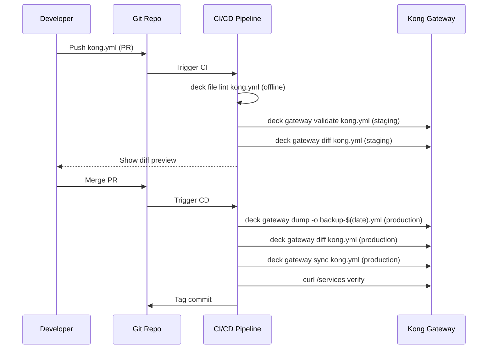
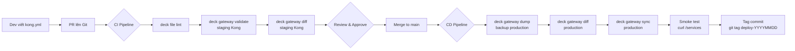

# Day 10: DB-less vs DB-mode & decK Workflow

> **Thời lượng**: 2 giờ
> **Độ khó**: ⭐⭐⭐⭐
> **Prerequisites**: Day 8 (Kong Architecture & Deployment), Day 9 (Core Entities: Service, Route, Plugin, Consumer), Day 1-7 (Nginx & Load Balancing fundamentals)

---

## 1. Learning Objectives

Sau bài này, bạn sẽ có thể:

- Phân biệt 3 deployment mode của Kong (DB-mode, DB-less, Hybrid) và chọn đúng theo use case
- Thiết kế GitOps pipeline cho Kong config dùng decK: lint → validate → diff → sync → rollback
- Sử dụng thành thạo các lệnh decK 1.40+ (`deck gateway dump/diff/sync/validate/ping/reset`, `deck file lint/render/convert`)
- Implement tag-based partial sync để nhiều team quản lý Kong config độc lập
- Thiết kế rollback strategy cho Kong config trong production
- Debug các failure scenario phổ biến: sync conflict, format mismatch, DP cache stale

---

## 2. The Problem

> **Scenario thực tế**: Team bạn đang vận hành Kong Gateway cho 20+ microservices. Mọi thay đổi config đều thực hiện trực tiếp qua Admin API — không có review, không có audit trail, không có rollback. Tuần trước, một dev mới vô tình push plugin `rate-limiting` global với config `1 req/min` thay vì `1000 req/min`. Kết quả: outage 30 phút, toàn bộ API trả về 429. Không ai biết ai đã thay đổi gì, không có cách rollback nhanh.
>
> Bạn được giao nhiệm vụ: thiết kế quy trình để mọi thay đổi Kong config phải qua PR → review → deploy có rollback. Bạn chọn mode nào? Tool gì? Lưu config ở đâu?

**Pain points của cách làm cũ (imperative Admin API):**

- Không có audit trail — ai thay đổi gì, khi nào?
- Không có review process — một người push là xong
- Rollback thủ công — phải nhớ state trước đó là gì
- Không reproducible — không thể recreate Kong state từ đầu
- Multi-node inconsistency — nếu có nhiều Kong node, mỗi node có thể ở state khác nhau

**Giải pháp**: Declarative config với decK + GitOps pipeline.

---

## 3. Core Concepts

### 3.1 Ba Deployment Mode của Kong

Kong Gateway 3.x hỗ trợ 3 deployment mode với trade-off khác nhau về complexity, scalability và operational model.

```mermaid
graph TB
    subgraph "DB-mode (Traditional)"
        A1[Admin API] -->|write| DB1[(PostgreSQL)]
        DB1 -->|LISTEN/NOTIFY| K1[Kong Node 1]
        DB1 -->|LISTEN/NOTIFY| K2[Kong Node 2]
        DB1 -->|LISTEN/NOTIFY| K3[Kong Node 3]
    end

    subgraph "DB-less"
        F1[kong.yml] -->|KONG_DECLARATIVE_CONFIG| K4[Kong Node A]
        F1 -->|KONG_DECLARATIVE_CONFIG| K5[Kong Node B]
        A2[Admin API] -->|POST /config| K4
        A2 -->|POST /config| K5
    end

    subgraph "Hybrid Mode (CP-DP)"
        A3[Admin API] -->|write| DB2[(PostgreSQL)]
        DB2 --> CP[Control Plane]
        CP -->|mTLS port 8005| DP1[Data Plane 1]
        CP -->|mTLS port 8005| DP2[Data Plane 2]
        CP -->|mTLS port 8005| DP3[Data Plane 3 - Edge]
        DP1 -.->|disk cache fallback| CACHE1[/tmp/kong-fallback.json]
        DP2 -.->|disk cache fallback| CACHE2[/tmp/kong-fallback.json]
    end
```

### 3.2 DB-mode (Traditional Mode)

**Cơ chế hoạt động:**

- Mọi Kong node kết nối trực tiếp vào PostgreSQL (Cassandra đã deprecated từ Kong 3.4)
- Admin API write config vào DB, Kong node nhận thay đổi qua PostgreSQL `LISTEN/NOTIFY` mechanism
- Propagation time: vài chục millisecond (near-instant)
- Mỗi node tự query DB để load config khi khởi động

**Yêu cầu infrastructure:**

```yaml
# docker-compose.yml cho DB-mode
services:
  postgres:
    image: postgres:15-alpine
    environment:
      POSTGRES_DB: kong
      POSTGRES_USER: kong
      POSTGRES_PASSWORD: kongpass
    volumes:
      - pgdata:/var/lib/postgresql/data

  kong-migrations:
    image: kong:3.7
    command: kong migrations bootstrap
    environment:
      KONG_DATABASE: postgres
      KONG_PG_HOST: postgres
      KONG_PG_USER: kong
      KONG_PG_PASSWORD: kongpass
    depends_on:
      - postgres

  kong:
    image: kong:3.7
    environment:
      KONG_DATABASE: postgres
      KONG_PG_HOST: postgres
      KONG_PG_USER: kong
      KONG_PG_PASSWORD: kongpass
      KONG_ADMIN_LISTEN: "0.0.0.0:8001"
      KONG_PROXY_LISTEN: "0.0.0.0:8000"
    ports:
      - "8000:8000"
      - "8001:8001"
    depends_on:
      - kong-migrations
```

**Khi nào dùng DB-mode:**
- Internal gateway với nhiều team cùng chỉnh config
- Cần Kong Manager UI (chỉ hoạt động với DB-mode)
- Plugin cần lưu state vào DB (rate-limit counter, OAuth token)
- Cần workspace và RBAC đầy đủ

### 3.3 DB-less Mode

**Cơ chế hoạt động:**

- Kong load config từ file `kong.yml` khi khởi động (qua `KONG_DECLARATIVE_CONFIG`)
- Hot-reload: `POST /config` với toàn bộ YAML mới → Kong replace toàn bộ config trong RAM
- Mỗi node load config độc lập — không có sync mechanism giữa các node
- Admin API ở chế độ readonly cho entity (không thể POST /services, /routes trực tiếp)

**Cấu trúc file kong.yml:**

```yaml
# kong.yml — format version 3.0 (Kong 3.x + decK 1.21+)
_format_version: "3.0"
_transform: true

services:
  - name: user-service
    url: http://user-svc:3000
    tags:
      - team-a
      - production
    routes:
      - name: user-routes
        paths:
          - /api/v1/users
        methods:
          - GET
          - POST
        strip_path: false
    plugins:
      - name: rate-limiting
        config:
          minute: 1000
          policy: local

  - name: order-service
    url: http://order-svc:3001
    tags:
      - team-b
      - production
    routes:
      - name: order-routes
        paths:
          - /api/v1/orders
        methods:
          - GET
          - POST
          - PUT

consumers:
  - username: mobile-app
    tags:
      - team-a
    keyauth_credentials:
      - key: "mobile-app-secret-key-2026"

plugins:
  - name: prometheus
    config:
      status_code_metrics: true
      latency_metrics: true
```

**Khởi động Kong DB-less:**

```bash
docker run -d \
  --name kong-dbless \
  -e KONG_DATABASE=off \
  -e KONG_DECLARATIVE_CONFIG=/kong/declarative/kong.yml \
  -e KONG_ADMIN_LISTEN="0.0.0.0:8001" \
  -e KONG_PROXY_LISTEN="0.0.0.0:8000" \
  -v $(pwd)/kong.yml:/kong/declarative/kong.yml \
  -p 8000:8000 \
  -p 8001:8001 \
  kong:3.7
```

**Hot-reload không restart:**

```bash
# Replace toàn bộ config (atomic operation)
curl -X POST http://localhost:8001/config \
  -F config=@kong.yml

# Hoặc dùng decK (recommended)
deck gateway sync kong.yml
```

**Giới hạn của DB-less:**
- Một số plugin không hỗ trợ DB-less (OAuth2 cần DB để lưu token)
- Không có workspace
- Không có Kong Manager UI
- `POST /config` là atomic replace — nếu YAML lỗi, toàn bộ config bị reject

### 3.4 Hybrid Mode (Control Plane / Data Plane)

**Cơ chế hoạt động:**

Hybrid mode tách Kong thành 2 tier:
- **Control Plane (CP)**: Có DB, expose Admin API, nhận config changes
- **Data Plane (DP)**: Không có DB, proxy traffic, nhận config từ CP qua mTLS WebSocket (port 8005)

```
Admin API → CP (với DB) → mTLS WebSocket port 8005 → DP nodes
                                                      ↓
                                              disk cache fallback
                                         (/usr/local/kong/config.json.gz)
```

**DP Resilience**: Khi CP down, DP vẫn proxy traffic bình thường bằng config cache trên disk. DP chỉ fail khi restart mà không có cache và CP không reachable.

**Cấu hình Hybrid mode:**

```bash
# Bước 1: Generate cluster certificate
docker run --rm kong:3.7 kong hybrid gen_cert \
  --cluster-cert /tmp/cluster.crt \
  --cluster-cert-key /tmp/cluster.key

# Bước 2: Control Plane
docker run -d --name kong-cp \
  -e KONG_DATABASE=postgres \
  -e KONG_PG_HOST=postgres \
  -e KONG_ROLE=control_plane \
  -e KONG_CLUSTER_CERT=/certs/cluster.crt \
  -e KONG_CLUSTER_CERT_KEY=/certs/cluster.key \
  -e KONG_CLUSTER_LISTEN="0.0.0.0:8005" \
  -e KONG_ADMIN_LISTEN="0.0.0.0:8001" \
  -v $(pwd)/certs:/certs \
  -p 8001:8001 -p 8005:8005 \
  kong:3.7

# Bước 3: Data Plane
docker run -d --name kong-dp-1 \
  -e KONG_DATABASE=off \
  -e KONG_ROLE=data_plane \
  -e KONG_CLUSTER_CONTROL_PLANE=kong-cp:8005 \
  -e KONG_CLUSTER_CERT=/certs/cluster.crt \
  -e KONG_CLUSTER_CERT_KEY=/certs/cluster.key \
  -e KONG_CLUSTER_CERT_DOMAIN=kong_clustering \
  -e KONG_PROXY_LISTEN="0.0.0.0:8000" \
  -v $(pwd)/certs:/certs \
  -p 8000:8000 \
  kong:3.7
```

**Verify CP-DP connectivity:**

```bash
# Xem danh sách DP đang kết nối
curl http://localhost:8001/clustering/data-planes | jq '.data[] | {id, hostname, last_seen, config_hash}'
```

### 3.5 Bảng So Sánh 3 Mode

| Aspect | DB-mode | DB-less | Hybrid |
|---|---|---|---|
| DB requirement | PostgreSQL HA | Không cần | PostgreSQL ở CP |
| Config source | Admin API → DB | YAML file | Admin API → DB → DP qua mTLS |
| Hot-reload | Tự động (LISTEN/NOTIFY, ~ms) | POST /config hoặc kong reload | Auto pull qua WebSocket |
| GitOps friendly | Trung bình | Cao | Cao |
| Scale DP | Add node + connect DB | Add node + cùng YAML | Add node + connect CP |
| Failure khi DB down | Không write được, read OK | N/A | DP vẫn proxy với cached config |
| Multi-tenant / workspace | Đầy đủ | Hạn chế | Đầy đủ (ở CP) |
| Kong Manager UI | Có | Không | Có (ở CP) |
| Plugin state (rate-limit counter) | Lưu trong DB | In-memory (mất khi restart) | Lưu trong DB (ở CP) |
| Use case | Internal Gateway, dev với UI | Edge, immutable, embedded | Multi-DC, edge fleet, isolation |
| Operational complexity | Trung bình | Thấp | Cao |

---

## 4. How It Works Internally

### 4.1 decK — Declarative Kong CLI

**decK** (Declarative Kong) là CLI tool cho phép quản lý Kong config dạng declarative, bất kể backing store là DB hay DB-less. decK hoạt động như một "desired state reconciler" — nó so sánh state mong muốn (YAML file) với state thực tế (Kong) và apply diff.

**Lưu ý quan trọng về versioning command:**

```
decK < 1.21 (cũ):    deck dump / deck sync / deck diff
decK ≥ 1.21 (mới):   deck gateway dump / deck gateway sync / deck gateway diff
```

Từ decK 1.21+, tất cả lệnh tương tác với Kong đều dùng subcommand `gateway`. Bài này dùng **decK 1.40+** với Kong **3.6/3.7**.

### 4.2 decK Workflow Internals



### 4.3 decK State Reconciliation

Khi chạy `deck gateway sync`, decK thực hiện 3 bước:

1. **Fetch current state**: Gọi Admin API để lấy toàn bộ entity hiện tại
2. **Compute diff**: So sánh desired state (YAML) với current state
3. **Apply changes**: Gọi Admin API để create/update/delete entity

decK là **idempotent** — chạy `sync` nhiều lần với cùng YAML cho kết quả giống nhau.

### 4.4 Format Version và _transform

**Format version:**

```yaml
# Kong 2.x / decK 1.x cũ
_format_version: "1.1"

# Kong 3.x / decK 1.21+
_format_version: "3.0"
```

**_transform flag:**

```yaml
_transform: true   # decK gửi credential plaintext → Kong tự hash (bcrypt/sha256)
_transform: false  # Credential đã được pre-hashed, decK gửi nguyên
```

Dùng `_transform: true` khi viết config thủ công. Dùng `_transform: false` khi export từ Kong (để tránh double-hash).

### 4.5 Tag-based Partial Sync

Tag-based sync cho phép nhiều team quản lý Kong config độc lập mà không ảnh hưởng lẫn nhau:

```bash
# Chỉ sync entity có tag "team-a", không touch entity của team-b
deck gateway sync --select-tag team-a team-a-config.yml

# Chỉ sync entity có tag "production" VÀ "team-b"
deck gateway sync --select-tag team-b --select-tag production team-b-config.yml
```

**Cơ chế**: decK filter entity theo tag trước khi compute diff. Entity không có tag match sẽ bị ignore hoàn toàn.

---

## 5. Hands-on Lab

### Lab 1: Bootstrap Kong DB-less + decK

**Cài decK:**

```bash
# macOS
brew install kong/deck/deck

# Linux (pinned version)
curl -sL https://github.com/kong/deck/releases/download/v1.40.0/deck_1.40.0_linux_amd64.tar.gz \
  | tar -xz -C /usr/local/bin deck

# Verify
deck version
# Output: decK v1.40.0
```

**Khởi động Kong DB-less:**

```bash
# Tạo kong.yml tối thiểu
cat > kong.yml << 'EOF'
_format_version: "3.0"
_transform: true

services:
  - name: httpbin
    url: https://httpbin.org
    routes:
      - name: httpbin-route
        paths:
          - /httpbin
        strip_path: true
EOF

# Start Kong
docker run -d \
  --name kong-dbless \
  -e KONG_DATABASE=off \
  -e KONG_DECLARATIVE_CONFIG=/kong/declarative/kong.yml \
  -e KONG_ADMIN_LISTEN="0.0.0.0:8001" \
  -e KONG_PROXY_LISTEN="0.0.0.0:8000" \
  -v $(pwd)/kong.yml:/kong/declarative/kong.yml \
  -p 8000:8000 \
  -p 8001:8001 \
  kong:3.7

# Test connectivity
deck gateway ping --kong-addr http://localhost:8001
# Output: Successfully connected to Kong!
# Kong version:  3.7.x
```

### Lab 2: Workflow Chuẩn — Edit → Lint → Validate → Diff → Sync

```bash
# Thêm service mới vào kong.yml
cat >> kong.yml << 'EOF'

  - name: echo-service
    url: http://httpbin.org/anything
    tags:
      - team-a
    routes:
      - name: echo-route
        paths:
          - /echo
        methods:
          - GET
          - POST
EOF

# Bước 1: Lint offline (không cần Kong running)
deck file lint kong.yml
# Output: Linting kong.yml...
# No issues found.

# Bước 2: Validate online (Kong kiểm tra schema)
deck gateway validate kong.yml --kong-addr http://localhost:8001
# Output: Validating...
# No issues found.

# Bước 3: Xem diff trước khi apply
deck gateway diff kong.yml --kong-addr http://localhost:8001
# Output:
# creating service echo-service
# creating route echo-route for service echo-service
# Summary:
#   Created: 2
#   Updated: 0
#   Deleted: 0

# Bước 4: Apply
deck gateway sync kong.yml --kong-addr http://localhost:8001
# Output:
# creating service echo-service
# creating route echo-route for service echo-service
# Summary:
#   Created: 2
#   Updated: 0
#   Deleted: 0

# Bước 5: Verify
curl http://localhost:8001/services | jq '.data[].name'
# "httpbin"
# "echo-service"

curl http://localhost:8000/echo
# HTTP 200 — proxied to httpbin.org/anything
```

### Lab 3: File Splitting với deck file render

```bash
# Tách config thành nhiều file
cat > services.yml << 'EOF'
_format_version: "3.0"
_transform: true

services:
  - name: user-service
    url: http://user-svc:3000
    tags: [team-a]
    routes:
      - name: user-route
        paths: [/api/v1/users]
EOF

cat > consumers.yml << 'EOF'
_format_version: "3.0"
_transform: true

consumers:
  - username: mobile-app
    tags: [team-a]
    keyauth_credentials:
      - key: "mobile-secret-2026"
EOF

cat > plugins.yml << 'EOF'
_format_version: "3.0"
_transform: true

plugins:
  - name: prometheus
    config:
      status_code_metrics: true
      latency_metrics: true
EOF

# Merge thành 1 file để review
deck file render services.yml consumers.yml plugins.yml -o merged.yml
cat merged.yml

# Sync trực tiếp từ nhiều file (không cần merge)
deck gateway sync services.yml consumers.yml plugins.yml \
  --kong-addr http://localhost:8001
```

### Lab 4: Tag-based Partial Sync

```bash
# Tạo config cho 2 team
cat > team-a.yml << 'EOF'
_format_version: "3.0"
_transform: true

services:
  - name: team-a-service
    url: http://team-a-backend:3000
    tags: [team-a]
    routes:
      - name: team-a-route
        paths: [/team-a]
        tags: [team-a]
EOF

cat > team-b.yml << 'EOF'
_format_version: "3.0"
_transform: true

services:
  - name: team-b-service
    url: http://team-b-backend:3001
    tags: [team-b]
    routes:
      - name: team-b-route
        paths: [/team-b]
        tags: [team-b]
EOF

# Sync team-a (team-b không bị touch)
deck gateway sync --select-tag team-a team-a.yml \
  --kong-addr http://localhost:8001

# Verify: team-b service vẫn nguyên vẹn
curl http://localhost:8001/services | jq '.data[] | {name, tags}'
```

### Lab 5: Rollback Drill

```bash
# Bước 1: Backup state hiện tại
deck gateway dump -o backup-pre-change-$(date +%F-%H%M).yml \
  --kong-addr http://localhost:8001

# Bước 2: Apply một change "broken" (rate-limit quá thấp)
cat > broken-change.yml << 'EOF'
_format_version: "3.0"
_transform: true

plugins:
  - name: rate-limiting
    config:
      minute: 1
      policy: local
EOF

deck gateway sync broken-change.yml --kong-addr http://localhost:8001

# Bước 3: Verify bị broken
curl http://localhost:8000/echo
# HTTP 429 Too Many Requests

# Bước 4: Rollback
deck gateway sync backup-pre-change-*.yml --kong-addr http://localhost:8001
# Output: deleting plugin rate-limiting
# Summary: Deleted: 1

# Bước 5: Verify restored
curl http://localhost:8000/echo
# HTTP 200 OK
```

---

## 6. Trade-offs Analysis

### 6.1 Imperative (Admin API) vs Declarative (decK)

| Aspect | Imperative (Admin API) | Declarative (decK + YAML) |
|---|---|---|
| Audit trail | Không có | Git history đầy đủ |
| Review process | Không có | PR workflow |
| Rollback | Thủ công, khó | `deck gateway sync backup.yml` |
| Idempotency | Không (POST tạo mới, PUT update) | Có (sync luôn đạt desired state) |
| Partial update | Dễ (chỉ update field cần) | Cần cẩn thận (sync có thể delete) |
| Learning curve | Thấp | Trung bình |
| CI/CD integration | Khó | Dễ |
| Multi-team | Conflict dễ xảy ra | Tag-based isolation |
| **Khi nào dùng** | Dev/debug nhanh, one-off | Production, GitOps |

### 6.2 DB-less vs Hybrid: Khi Nào Upgrade?

| Tiêu chí | DB-less | Hybrid |
|---|---|---|
| Số Kong node | 1-5 | 5+ |
| Multi-region | Khó (phải sync YAML thủ công) | Dễ (DP tự pull từ CP) |
| Plugin cần DB state | Không hỗ trợ | Hỗ trợ (state ở CP) |
| Workspace / RBAC | Không | Có |
| Operational complexity | Thấp | Cao |
| Config propagation | Manual (POST /config) | Automatic (WebSocket) |
| **Upgrade khi** | — | Node > 5, cần workspace, cần OAuth2/session plugin |

### 6.3 decK vs Alternatives

| Tool | Approach | Strengths | Weaknesses |
|---|---|---|---|
| decK | Declarative YAML | Native Kong, GitOps-ready, tag-based | Chỉ cho Kong |
| Kong Manager UI | GUI | Dễ dùng, visual | Không GitOps, không audit trail |
| Terraform Kong provider | IaC | Tích hợp với infra IaC | Chậm hơn decK, state file phức tạp |
| Pulumi Kong provider | IaC (code) | Type-safe, programmatic | Ít phổ biến hơn |
| Kong Konnect | SaaS | Managed, UI đẹp | Vendor lock-in, cost |
| **Khi nào dùng decK** | — | Kong-only team, GitOps, CI/CD | — |

---

## 7. Best Practices & Best Solution

### 7.1 GitOps Pipeline Chuẩn



### 7.2 Production Best Practices

**DO:**
- Lưu toàn bộ kong.yml trong Git (GitOps)
- Tách config theo team/workspace, dùng tag
- Backup state trước mỗi sync: `deck gateway dump -o backup-$(date +%F-%H%M).yml`
- Luôn chạy `deck gateway diff` trước `sync` trong CI để có preview
- Pin version: `kong:3.7` và `deck:1.40.0` trong CI image
- Dùng `--select-tag` để isolate team config
- Validate trên staging trước khi sync production

**DON'T (Anti-patterns):**
- Hot-edit kong.yml trực tiếp trên server production
- Sync mà không validate trước
- Dùng `deck gateway reset` trên production (không có undo)
- Để nhiều CI pipeline sync cùng lúc (race condition — last write wins)
- Commit credential plaintext vào Git (dùng secret management)
- Dùng `_format_version: "1.1"` với Kong 3.x (dùng `"3.0"`)

### 7.3 Rollback Strategies

**Method 1: Backup file (nhanh nhất)**
```bash
# Trước khi sync
deck gateway dump -o state-$(date +%F-%H%M).yml

# Khi cần rollback
deck gateway sync state-2026-05-18-1430.yml
```

**Method 2: Git revert**
```bash
git revert HEAD  # Revert commit thay đổi kong.yml
# CI/CD tự động chạy deck gateway sync với version cũ
```

**Method 3: Blue-green declarative**
```
Kong Cluster A (active) ←── DNS/LB
Kong Cluster B (standby)

# Khi cần rollback: switch DNS/LB sang Cluster B
# Cluster B vẫn chạy config cũ
```

**Trade-off quan trọng**: Rollback decK nhanh nhưng mất runtime state của plugin (ví dụ: rate-limit counter trong DB, OAuth token). Rollback chỉ restore config, không restore data.

---

## 8. Performance Considerations

### 8.0 Benchmark Methodology

Không dùng các số dưới đây như cam kết tuyệt đối. Khi đo config reload hoặc decK sync trong môi trường của bạn, ghi lại tối thiểu:

| Parameter | Value mẫu |
|---|---|
| Kong | 3.7, DB-less hoặc Hybrid |
| decK | 1.40.0 |
| CPU/RAM | 4 vCPU, 8GB RAM |
| Entity count | 100 / 1k / 10k services-routes-plugins |
| Admin API network | localhost hoặc same VPC |
| TLS | Off cho Admin API lab, On trong production |
| Keepalive | On |
| Command | `time deck gateway sync kong.yml --kong-addr ...` |
| Metrics | sync duration, Admin API error rate, proxy p50/p95/p99 trong lúc sync |

Ví dụ đo reload impact:

```bash
# Terminal 1: đo proxy latency khi đang sync
wrk -t4 -c100 -d60s http://localhost:8000/httpbin/get

# Terminal 2: apply config nhiều entity
time deck gateway sync kong.yml --kong-addr http://localhost:8001
```

### 8.1 Config Reload Latency

| Mode | Reload mechanism | Latency | Blocking? |
|---|---|---|---|
| DB-mode | PostgreSQL LISTEN/NOTIFY | ~10-50ms | Không |
| DB-less | POST /config (atomic replace) | 0.5-3s (tùy số entity) | Nhẹ (in-flight request OK) |
| Hybrid | WebSocket push từ CP | ~100-500ms | Không |

**DB-less POST /config** thực hiện atomic swap toàn bộ config trong RAM. Với 10k+ entity, thao tác này có thể mất 2-5 giây. Request đang in-flight vẫn được xử lý với config cũ cho đến khi swap hoàn tất.

### 8.2 decK Sync Performance

```bash
# Với nhiều entity (10k+), tăng parallelism
deck gateway sync kong.yml \
  --parallelism 20 \
  --kong-addr http://localhost:8001

# File splitting giúp giảm context mỗi lần sync
# Thay vì sync 1 file 5000 entity, sync 5 file 1000 entity mỗi file
deck gateway sync --select-tag team-a team-a.yml  # chỉ 200 entity
```

### 8.3 Hybrid Mode DP Cache

DP lưu config cache tại `/usr/local/kong/config.json.gz` (mặc định). Khi CP down:
- DP tiếp tục proxy với cached config
- DP không nhận config mới cho đến khi CP recover
- Nếu DP restart khi CP down: load từ disk cache, không cần CP

---

## 9. Troubleshooting Checklist

### 9.1 Checklist

| Triệu chứng | Nguyên nhân | Cách fix |
|---|---|---|
| `Kong is unreachable` | Admin API URL sai, RBAC chặn | Check `--kong-addr`, thêm `--headers "Kong-Admin-Token:xxx"` |
| `schema violation` | Field sai trong YAML | Chạy `deck file lint` để tìm field lỗi |
| Sync xong nhưng /config không thay đổi | Cache, Kong chưa reload | `curl -X POST :8001/config -F config=@kong.yml` |
| Hybrid DP không nhận config | Cert sai, port 8005 blocked, version mismatch | Check cert, firewall, đảm bảo CP-DP cùng major version |
| `format version mismatch` | YAML dùng format 1.1 với Kong 3.x | `deck file convert --from kong-gateway-2.x --to kong-gateway-3.x` |
| Race condition 2 CI pipeline | Last write wins | Dùng mutex/lock ở CI level (ví dụ: Terraform state lock pattern) |
| `POST /config` reject toàn bộ | YAML có 1 entity lỗi | Fix entity lỗi, re-sync |
| DP cache stale sau CP down lâu | Config drift | Restart DP sau khi CP recover để force re-pull |

### 9.2 Debug Commands

```bash
# Kiểm tra Kong version và mode
curl http://localhost:8001/ | jq '{version: .version, database: .configuration.database}'

# Kiểm tra config hash (DB-less)
curl http://localhost:8001/config/hash

# Kiểm tra DP connectivity (Hybrid)
curl http://localhost:8001/clustering/data-planes | jq '.data[] | {hostname, last_seen, config_hash}'

# Verbose diff để debug
deck gateway diff kong.yml --verbose 2 --kong-addr http://localhost:8001

# Validate với output chi tiết
deck file lint kong.yml --verbose
```

---

## 10. Completion Checklist

Sau khi hoàn thành bài học, tự kiểm tra:

- [ ] Phân biệt được DB-mode, DB-less và Hybrid theo consistency, operability, dependency và rollback model
- [ ] Chạy được workflow `deck file lint` → `deck gateway validate` → `deck gateway diff` → `deck gateway sync`
- [ ] Tách config nhiều file, render lại để review, rồi sync mà không làm mất entity ngoài phạm vi
- [ ] Dùng `--select-tag` để partial sync một team và giải thích được rủi ro nếu tag thiếu hoặc sai
- [ ] Backup state bằng `deck gateway dump` và rollback được một thay đổi plugin gây lỗi
- [ ] Debug được `format version mismatch`, schema violation, Admin API unreachable và Hybrid DP stale cache
- [ ] Mô tả được vì sao decK sync cần CI mutex để tránh race condition giữa nhiều pipeline

---

## 11. References

- [Kong Docs: DB-less and Declarative Configuration](https://docs.konghq.com/gateway/latest/production/deployment-topologies/db-less-and-declarative-config/)
- [Kong Docs: Hybrid Mode](https://docs.konghq.com/gateway/latest/production/deployment-topologies/hybrid-mode/)
- [decK Docs: Gateway Commands](https://developer.konghq.com/deck/)
- [Kong Docs: Declarative Configuration Format](https://docs.konghq.com/gateway/latest/reference/declarative-config/)
- [Kong Docs: Admin API `/config`](https://docs.konghq.com/gateway/latest/admin-api/)
- [GitHub Actions: Concurrency](https://docs.github.com/en/actions/using-jobs/using-concurrency)

---

## Appendix: Failure Scenarios

### Scenario 1: Kong DB-less khởi động với YAML lỗi syntax

```
Kong start → load kong.yml → parse error → fail fast, không start
Error: [declarative] failed parsing declarative configuration: ...
```

**Fix**: Luôn chạy `deck file lint` trước khi deploy YAML mới.

### Scenario 2: deck gateway sync partial fail

```
deck gateway sync → entity 1 OK → entity 2 schema error → sync abort
→ Kong state: entity 1 đã được create, entity 2 chưa
→ State inconsistent
```

**Fix**: Rollback bằng backup dump trước đó. Đây là lý do tại sao phải dump trước mỗi sync.

### Scenario 3: Race condition — 2 CI pipeline sync cùng lúc

```
Pipeline A: diff → thấy cần create service-x
Pipeline B: diff → thấy cần create service-y
Pipeline A: sync → create service-x
Pipeline B: sync → create service-y, delete service-x (vì không có trong B's YAML)
```

**Fix**: Dùng CI-level mutex (ví dụ: GitHub Actions concurrency group, hoặc distributed lock).

### Scenario 4: DB-less POST /config drop in-flight request

```
POST /config với YAML mới → atomic swap config
→ Request đang chạy với plugin scope cũ có thể bị drop nếu plugin bị remove
```

**Fix**: Dùng Hybrid mode nếu cần zero-downtime config update với nhiều plugin changes.

---

## Recap

Bài này đã cover:

- **3 deployment mode**: DB-mode (PostgreSQL, dynamic), DB-less (YAML file, GitOps), Hybrid (CP-DP, mTLS, edge fleet)
- **decK 1.40+**: `deck gateway` subcommand (không phải `deck` cũ), workflow lint → validate → diff → sync → rollback
- **GitOps pipeline**: PR → CI lint/validate → CD diff/sync → backup → tag
- **Tag-based partial sync**: `--select-tag` để isolate team config
- **Rollback strategies**: backup dump, git revert, blue-green
- **Failure scenarios**: partial sync, race condition, DP cache stale

**Key insight**: decK biến Kong config thành "infrastructure as code" — mọi thay đổi đều có audit trail, review process và rollback capability. Đây là nền tảng để vận hành Kong ở production scale.

---

## Preview Day 11

**Day 11: Authentication — Key Auth, JWT, mTLS Overview**

Bài tiếp theo sẽ đi sâu vào authentication layer của Kong:
- **Key Auth plugin**: API key management, credential rotation
- **JWT plugin**: Verify JWT token tại Kong, không cần backend xử lý
- **mTLS**: Client certificate authentication cho service-to-service
- **Consumer + Credential model**: Cách Kong map request → consumer → permission
- **Auth plugin ordering**: Khi nào auth chạy trong plugin execution chain
- **Hands-on**: Secure một API với Key Auth + Rate Limiting per consumer
