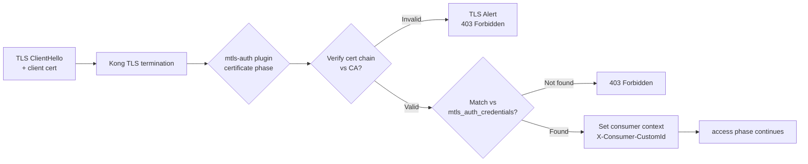

# Day 11: Reference Document — JWT Internals, mTLS Handshake & Kong Auth Deep Dive

---

## 1. JWT Structure — Header / Payload / Signature

### 1.1 Anatomy of a JWT

JWT (JSON Web Token, RFC 7519) là một URL-safe token gồm 3 phần ngăn cách bởi dấu chấm:

```
BASE64URL(header).BASE64URL(payload).BASE64URL(signature)
```

**Example:**

```
eyJhbGciOiJSUzI1NiJ9
.
eyJpc3MiOiJhcGktcHJvZCIsInN1YiI6Im1vYmlsZS1hcHAiLCJhdWQiOiJodHRwczovL2FwaS5leGFtcGxlLmNvbSIsImV4cCI6MTc1MDAwMDAwMCwiaWF0IjoxNzQ5OTk5OTk5LCJqdGkiOiJ0b2tlbi0xMjM0NTY3ODkwIn0
.
MCOeCetFaZ2mPsQGLlIaHqnVxZ0MvhCGc0yU0S5V5Z3Y8...Signature
```

### 1.2 JWT Header

```json
{
  "alg": "RS256",
  "typ": "JWT",
  "kid": "key-id-2026-01"
}
```

| Field | Ý nghĩa | Giá trị phổ biến |
|---|---|---|
| `alg` | Algorithm dùng để sign | HS256, HS384, HS512, RS256, RS384, RS512, ES256, ES384, ES512, PS256, PS384, PS512, none |
| `typ` | Token type | JWT |
| `kid` | Key ID — dùng để identify key trong JWKS | String bất kỳ |

### 1.3 JWT Payload (Claims)

Claims là các cặp key-value chứa thông tin về token và subject. Chia làm 3 loại:

**Registered Claims (RFC 7519):**

| Claim | Tên | Ý nghĩa |
|---|---|---|
| `iss` | Issuer | Ai đã phát hành token. Kong dùng để lookup jwt_secret |
| `sub` | Subject | Identity của chủ token (user ID, service name) |
| `aud` | Audience | Token dành cho ai. Kong verify xem `aud` có match config không |
| `exp` | Expiration Time | Unix timestamp — token hết hạn sau thời điểm này |
| `nbf` | Not Before | Unix timestamp — token chưa valid trước thời điểm này |
| `iat` | Issued At | Unix timestamp — token được phát hành lúc nào |
| `jti` | JWT ID | Unique identifier — dùng để revoke token (blacklist) |

**Example payload:**

```json
{
  "iss": "my-api-gateway",
  "sub": "user-12345",
  "aud": "order-service",
  "exp": 1750000000,
  "nbf": 1749800000,
  "iat": 1749800000,
  "jti": "tok_unique_123456",
  "roles": ["admin", "orders:read"],
  "org_id": "org-abc"
}
```

### 1.4 JWT Signature

Signature được tạo bằng algorithm được chỉ định trong header. Công thức chung:

```
signature = ALGORITHM(
  base64url(header) + "." + base64url(payload),
  signing_key
)
```

---

## 2. JWT Signing Algorithms

### 2.1 HS256 — HMAC with SHA-256

**Symmetric**: cùng một secret key dùng cả để sign và verify.

```
HMACSHA256(
  base64url(header) + "." + base64url(payload),
  shared_secret_key
)
```

**Pros:**
- Nhanh, low CPU overhead
- Đơn giản để implement

**Cons:**
- Secret phải được share giữa issuer và verifier
- Nếu secret leak — attacker tạo token hợp lệ
- Không suitable cho multi-party (partner A không thể verify token của partner B mà không có secret)

**Khi dùng:**
- Internal microservice (issuer = API gateway, verifier = Kong)
- Single-tenant, secret không cần share

**Kong config:**
```yaml
jwt_secrets:
  - key: "internal-issuer"   # iss claim
    algorithm: HS256
    secret: "super-secret-key-only-kong-knows"  # stored hashed
```

### 2.2 RS256 — RSA Signature with SHA-256

**Asymmetric**: private key sign, public key verify.

```
RSASSA-PKCS1-v1_5-SHA256(
  base64url(header) + "." + base64url(payload),
  rsa_private_key
)
```

**Pros:**
- Public key có thể distribute freely — không cần secret transmission
- Issuer giữ private key, verifier chỉ cần public key
- Compromised public key không cho phép tạo token giả
- Multiple verifier có thể verify token mà không biết private key

**Cons:**
- RSA signature verification chậm hơn HMAC (~3-5x)
- Key management phức tạp hơn (key rotation)

**Khi dùng:**
- Partner B2B (partner sign, Kong verify với public key)
- Mobile app với OAuth2/OIDC (Keycloak/Auth0 sign, Kong verify với public key)
- Multi-tenant API

**Kong config:**
```yaml
jwt_secrets:
  - key: "partner-a-issuer"
    algorithm: RS256
    rsa_public_key: |
      -----BEGIN PUBLIC KEY-----
      MIIBIjANBgkqhkiG9w0BAQEFAAOCAQ8A...
      -----END PUBLIC KEY-----
```

### 2.3 ES256 — ECDSA with P-256 and SHA-256

**Asymmetric** như RS256, nhưng dùng elliptic curve cryptography.

```
ECDSA-P256-SHA256(
  base64url(header) + "." + base64url(payload),
  ecdsa_private_key
)
```

**Pros:**
- Signature size nhỏ hơn RSA (~32-64 bytes vs 256-512 bytes)
- Signature verification nhanh hơn RSA

**Cons:**
- ít supported hơn RS256 trong legacy system
- Phức tạp hơn về key generation

### 2.4 Algorithm "none" — Anti-pattern

```
Header: {"alg": "none", "typ": "JWT"}
Payload: {"sub": "admin", "role": "admin"}
Signature: "" (empty)
```

**Tấn công**: Attacker gửi token với `alg: none` → không có signature verify → được chấp nhận.

**Kong default**: reject `alg: none`. Tuy nhiên, check plugin config để đảm bảo:

```yaml
plugins:
  - name: jwt
    config:
      # Kong mặc định chặn alg: none
      # Không cần config gì thêm
```

---

## 3. JWKS — JSON Web Key Set

### 3.1 JWKS Format

JWKS (RFC 7517) là một endpoint trả về public keys dùng để verify JWT:

```json
{
  "keys": [
    {
      "kty": "RSA",
      "use": "sig",
      "kid": "key-id-2026-01",
      "alg": "RS256",
      "n": "0vx7agoebGcQSuuPiLJXZptN9nndrQmbXEps2aiAFbWhM78LhWx4cbbfAAtVT86zwu1RK7aPFFxuhDR1L6tSoc_BJECPebWKRXjBZCiFV4n3oknjhMstn64tZ_2W-5JsGY4Hc5n9yBXArwl93lqt7_RN5w6Cf0h4QyQ5v-65YGjQR0_FDW2QvzqY368QQMicAtaSqzs8KJZgnYb9c7d0zgdAZHzu6qMQvRL5hajrn1n91CbOpbISD08qNLyrdkt-bFTWhAI4vMQFh6WeZu0fM4lFd2NcRwr3XPksINHaQ-G_xBniIqbw0Ls1jF44-csFCur-kEgU8awapJzKnqDKgw",
      "e": "AQAB"
    }
  ]
}
```

### 3.2 Kong JWKS Config

```yaml
jwt_secrets:
  - key: "keycloak-issuer"
    algorithm: RS256
    jwks_uri: "https://keycloak.example.com/realms/myrealm/protocol/openid-connect/certs"
```

**Khi Kong verify JWT:**

1. Kong extract `kid` từ JWT header
2. Kong fetch keys từ JWKS endpoint (hoặc dùng cached keys)
3. Kong match `kid` với key trong JWKS response
4. Kong verify signature bằng matched public key

### 3.3 Key Rotation Strategy

**Rotation plan cho RS256:**

```
Day 0:  Active key (kid: "v1") → Kong có rsa_public_key v1
Day 180: Generate new key pair (kid: "v2"), publish to JWKS
        Kong JWKS cache tự fetch key mới
Day 180-365: Both v1 và v2 valid
        Client vẫn dùng token signed v1 (old tokens chưa hết hạn)
        Client mới sign với v2
Day 365: Revoke v1, chỉ v2 còn valid
        → Old token với kid v1 bị reject
```

**Kong JWKS cache TTL:** Mặc định Kong cache JWKS response. Khi key mới được publish, Kong sẽ tự refresh sau khi TTL expire (default 3600s).

```yaml
plugins:
  - name: jwt
    config:
      jwks_cache_ttl: 3600     # seconds
      jwks_skip_kid_match: false  # must match kid
      # Nếu jwks_uri unreachable: fail_action = reject (default)
```

---

## 4. mTLS Handshake — Step by Step

### 4.1 TLS 1.3 Full Handshake (mTLS)

mTLS yêu cầu client present certificate trong TLS handshake. Khác với standard TLS chỉ server present cert, mTLS yêu cầu cả hai bên đều present certificate.

**Step 1: ClientHello**

```
Client                          Server (Kong)
  |                               |
  |------ TLS ClientHello ------->|
  |   + supported_versions: TLS 1.3
  |   + cipher_suites: TLS_AES_256_GCM_SHA384
  |   + signature_algorithms: rsa_pkcs1_sha256, ecdsa_secp256r1_sha256
  |   + psk_mode: psk_dhe_ke      ← cho session resumption
  |   + SNI: api.example.com
  |   + client_certificate_list   ← mTLS: client gửi certificate
  |      (empty ở đầu handshake)   (bước này chỉ là announcement)
```

**Step 2: ServerHello + Certificate**

```
  |<----- TLS ServerHello --------|
  |   + version: TLS 1.3
  |   + selected_cipher_suite
  |   + psk_random (nếu PSK)
  |
  |<----- Certificate ------------|
  |   Server certificate chain
  |   (leaf → intermediate → root)
```

**Step 3: Server CertificateVerify**

```
  |<----- CertificateVerify ------|
  |   Signature over handshake
  |   using server's private key
```

Server prove ownership của certificate bằng cách sign toàn bộ handshake transcript.

**Step 4: Client Certificate + CertificateVerify**

```
  |------ Certificate ----------->|
  |   Client certificate chain
  |
  |------ CertificateVerify ----->|
  |   Signature over handshake
  |   using client's private key
```

**Step 5: Finished**

```
  |<------ Finished --------------|
  |   MAC over full transcript

  |------ Finished -------------->|
  |   MAC over full transcript

  ======= Encrypted channel ======>
         Application Data
```

**mTLS handshake overhead:** 1-RTT (TLS 1.3) hoặc 2-RTT (TLS 1.2). Session resumption giảm về 0-RTT (PSK) hoặc 1-RTT (session ID/ticket).

### 4.2 Kong mTLS Plugin — Certificate Verification

Kong mtls-auth plugin verify client certificate ở certificate phase (trước access phase):



**mtls-auth plugin config:**
```yaml
plugins:
  - name: mtls-auth
    route: mtls-route
    config:
      skip_consumer_lookup: false
      revocation_check_mode: "SKIP"  # NONE, SKIP, CLOSEST
      ca_certificates:
        - ca_cert_1
      send_ca_dn: true
      http_timeout: 30000
```

**Consumer mapping cho mTLS:**

Có 2 cách map certificate → Consumer:

1. **Subject CN match**: certificate CN → Consumer username
2. **SAN match**: certificate SAN (DNS/IP) → Consumer custom_id

```yaml
consumers:
  - username: partner-a
    mtls_auth_credentials:
      - ca_certificate: ca_cert_1
        subject_name: "partner-a-client"
        # Certificate CN phải match "partner-a-client"

  - username: partner-b
    mtls_auth_credentials:
      - ca_certificate: ca_cert_1
        subject_alt_name: "partner-b-dns"
        # Certificate SAN phải match "partner-b-dns"
```

---

## 5. Kong Auth Plugin Priority List

### 5.1 Complete Priority Order (Cao → Thấp)

| Priority | Plugin | Phase | Type |
|---|---|---|---|
| **2000** | cors | access | Security |
| **1600** | mtls-auth | **certificate** | Auth |
| **1000000** | pre-function | rewrite/access | Custom |
| **100001** | correlation-id | access | Observability |
| **1005** | jwt | access | Auth |
| **1004** | oauth2 | access | Auth |
| **1003** | key-auth | access | Auth |
| **1002** | ldap-auth | access | Auth |
| **1001** | basic-auth | access | Auth |
| **1000** | hmac-auth | access | Auth |
| **990** | ip-restriction | access | Security |
| **950** | acl | access | Authorization |
| **910** | rate-limiting | access | Policy |
| **801** | request-transformer | access | Transform |
| **800** | response-transformer | header_filter | Transform |
| **13** | prometheus | log | Observability |
| **12** | http-log | log | Observability |
| **-1000** | post-function | access/log | Custom |

### 5.2 Priority Implications

**mtls-auth chạy ở certificate phase** (trước access phase) — có nghĩa là certificate được verify trước khi HTTP request được parse. Nếu certificate invalid, TLS connection bị reject ngay lập tức — không đến access phase.

**jwt priority (1005) > key-auth (1003)**: Khi cả hai plugin cùng enable trên một route, JWT verify chạy trước. Nếu JWT token có nhưng invalid → 401. Nếu JWT không có → fall through → key-auth chạy.

**auth plugins chạy trước rate-limiting (910)**: Điều này đảm bảo Kong biết consumer identity trước khi kiểm tra quota. Nếu rate-limiting chạy trước, anonymous request sẽ dùng toàn bộ quota trước khi auth plugin kịp chạy.

---

## 6. Kong-Managed Auth vs Delegated to OAuth2/OIDC Provider

### 6.1 Kong-Managed Auth

```
Client → Kong (key-auth/jwt plugin) → Upstream
           ↓
      Kong verifies credential
      Kong sets consumer context
      Kong enforces rate limit
```

**Pros:**
- Single point of control cho auth logic
- Không có external dependency khi verify
- Low latency (no network round-trip)
- Dễ debug (credential trong Kong)

**Cons:**
- Kong phải quản lý credential lifecycle (rotation, revocation)
- Không có user management (VD: login page, password reset)
- Không có OAuth2 flow (authorization code, PKCE)

### 6.2 OAuth2/OIDC Provider (Keycloak, Auth0, Okta)

```
Client → OAuth2 Provider → Access Token → Kong (jwt plugin) → Upstream
                                                      ↑
                                              Kong verify JWT
                                              (no DB lookup needed)
```

**Pros:**
- User management đầy đủ (login, MFA, password policy)
- OAuth2/OIDC standard (authorization code, PKCE, device flow)
- Token có claims (roles, org) do provider phát hành
- Single Sign-On (SSO) across applications
- Provider handle revocation, session management

**Cons:**
- External dependency (provider down → auth down)
- Higher latency (token introspection hoặc JWKS fetch)
- Complexity cao hơn
- Vendor lock-in

### 6.3 Hybrid Approach — Best of Both Worlds

```
Client → OAuth2 Provider (Keycloak) → JWT Access Token
       → Kong (jwt plugin) → Upstream
              ↓
         Kong verify RS256 signature
         Kong enforce rate-limit
         Kong set consumer context
```

**Đây là recommended approach cho public API:**
- Keycloak/Auth0 handle user management và OAuth2 flow
- Kong chỉ verify token (stateless, no DB lookup)
- Kong enforce rate-limit và other policies
- Consumer = `sub` claim trong JWT (Keycloak user ID)

---

## 7. Kong Auth vs Nginx auth_request Module

### 7.1 Nginx auth_request

```
Client → Nginx → auth_request /auth-verify → Upstream auth service
              ↑
              ↓
       auth service trả:
       - 200 + headers → allow
       - 401/403 → reject
```

**Pros:**
- Flexible: auth logic hoàn toàn tùy biến trong auth service
- Dùng được với bất kỳ auth system nào (OAuth2, LDAP, custom)

**Cons:**
- Extra network round-trip cho every request
- Auth service là bottleneck
- Không có consumer model
- Không có native credential management
- Auth service down → all requests blocked

### 7.2 Kong Auth Plugins

```
Client → Kong → JWT verify (HS256/RS256)
              → Key-auth lookup (cached)
              → mTLS verify (certificate phase)
              → Upstream
```

**Pros:**
- No external network round-trip (stateless JWT verify)
- Built-in consumer model
- Built-in credential management
- Rate-limit, ACL, IP restriction tích hợp
- Prometheus metrics cho auth events

**Cons:**
- Less flexible than custom auth service
- Phải chọn plugin phù hợp với use case

### 7.3 Comparison Table

| Aspect | Nginx auth_request | Kong key-auth | Kong jwt | Kong mtls-auth |
|---|---|---|---|---|
| **Stateless?** | Không (auth service call) | Có (DB cache) | Có | Có |
| **DB dependency** | Auth service | Kong DB/Redis | Không | Không |
| **Consumer model** | Không có | Có | Có | Có |
| **Latency per request** | +5-50ms | +1ms | +1-3ms | +2-10ms |
| **Custom auth logic** | Có | Không | Không | Không |
| **Built-in metrics** | Không | Prometheus | Prometheus | Prometheus |
| **Key rotation** | Auth service | Ngay lập tức | Short-lived token | Cert rotation |
| **Audit trail** | Auth service logs | Consumer quota logs | Consumer quota logs | Cert logs |

---

## 8. Production Observability for Auth

### 8.1 Prometheus Metrics for Auth

Kong Prometheus plugin expose các metric liên quan đến auth:

```bash
# Các metric quan trọng cho auth:
kong_http_requests_total{consumer="mobile-app", service="payment-service",
  route="payment-route", status="401"}
kong_http_requests_total{consumer="partner-a", status="403"}

kong_kong_latency_ms{consumer="mobile-app", type="auth"}
kong_kong_latency_ms{consumer="", type="upstream"}

# JWT verify time
kong_plugin_jwt_credential_validated{consumer="mobile-app",algorithm="RS256"}

# mTLS handshake
kong_tls_handshake_total{consumer="partner-a",success="true"}
kong_tls_handshake_total{consumer="",success="false"}
```

### 8.2 Alerting Rules

```yaml
# Alert: Auth failure rate cao
- alert: HighAuthFailureRate
  expr: |
    sum(rate(kong_http_requests_total{status="401"}[5m]))
    / sum(rate(kong_http_requests_total[5m])) > 0.05
  for: 2m
  labels:
    severity: warning
  annotations:
    summary: "Auth failure rate > 5% — possible credential leak or misconfiguration"

# Alert: JWT signature failure spike
- alert: JWTSignatureFailures
  expr: |
    sum(rate(kong_http_requests_total{status="401",
      route=~".*jwt.*"}[5m])) > 10
  for: 1m
  labels:
    severity: critical
  annotations:
    summary: "JWT signature failures spike — check secret rotation"

# Alert: mTLS handshake failures
- alert: MTLSHandshakeFailures
  expr: |
    sum(rate(kong_tls_handshake_total{success="false"}[5m]))
    / sum(rate(kong_tls_handshake_total[5m])) > 0.01
  for: 5m
  labels:
    severity: warning
  annotations:
    summary: "mTLS handshake failure rate > 1% — check cert expiry"
```

### 8.3 Logging — Consumer Identification

```yaml
# kong.yml: Structured log format với consumer info
format: '{"time":$TIME_iso,"host":"$hostname","client_ip":"$remote_addr",
  "consumer":"$consumer_username","route":"$route_name","service":"$service_name",
  "status":$status,"latency_ms":$request_time,"bytes_sent":$bytes_sent}'

# Log khi auth fail (JWT invalid)
# Xem trong docker logs:
# [warn] 1#0 lua coroutine output: jwt signature verification failed
# consumer: mobile-app, route: /api/orders, status: 401
```
