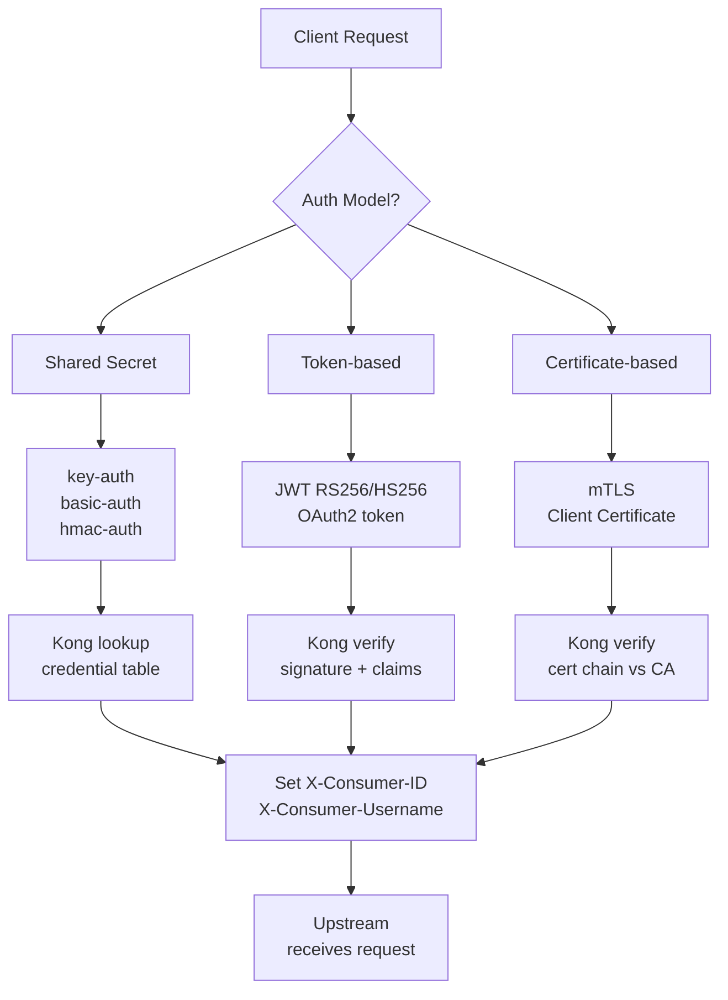
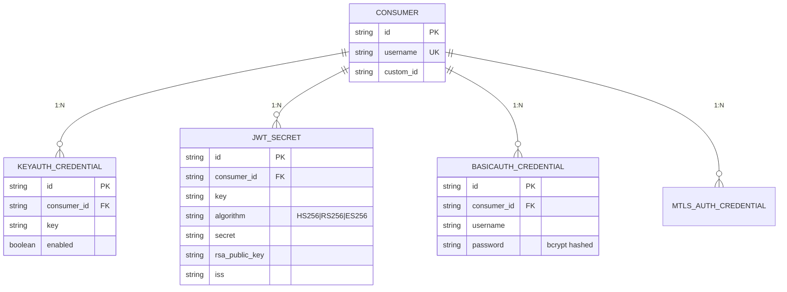
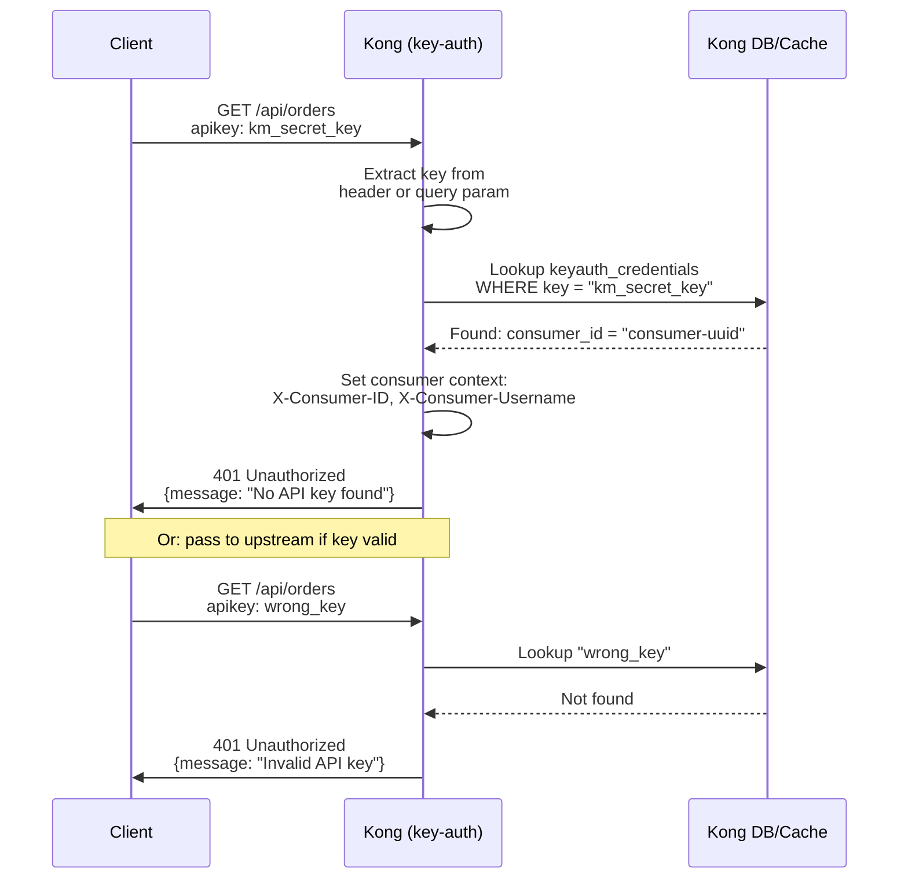
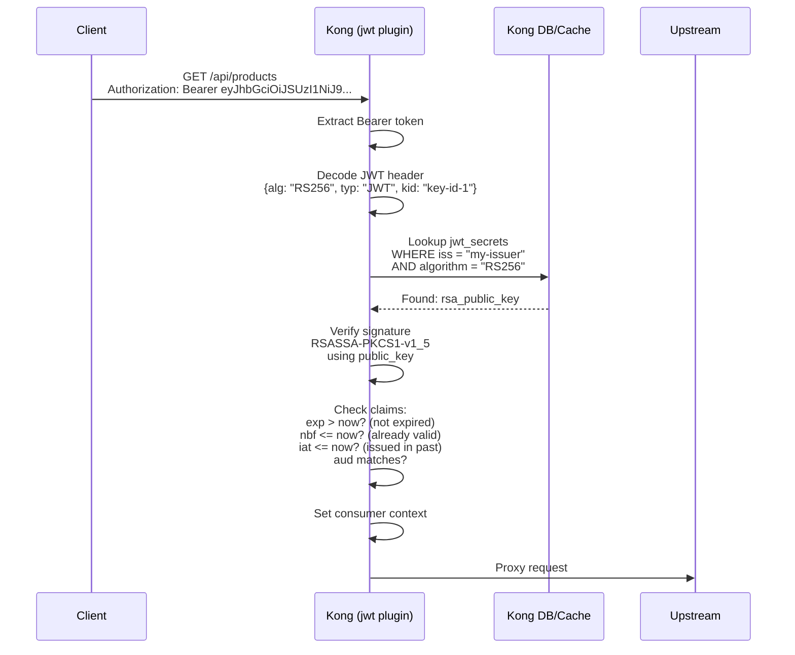
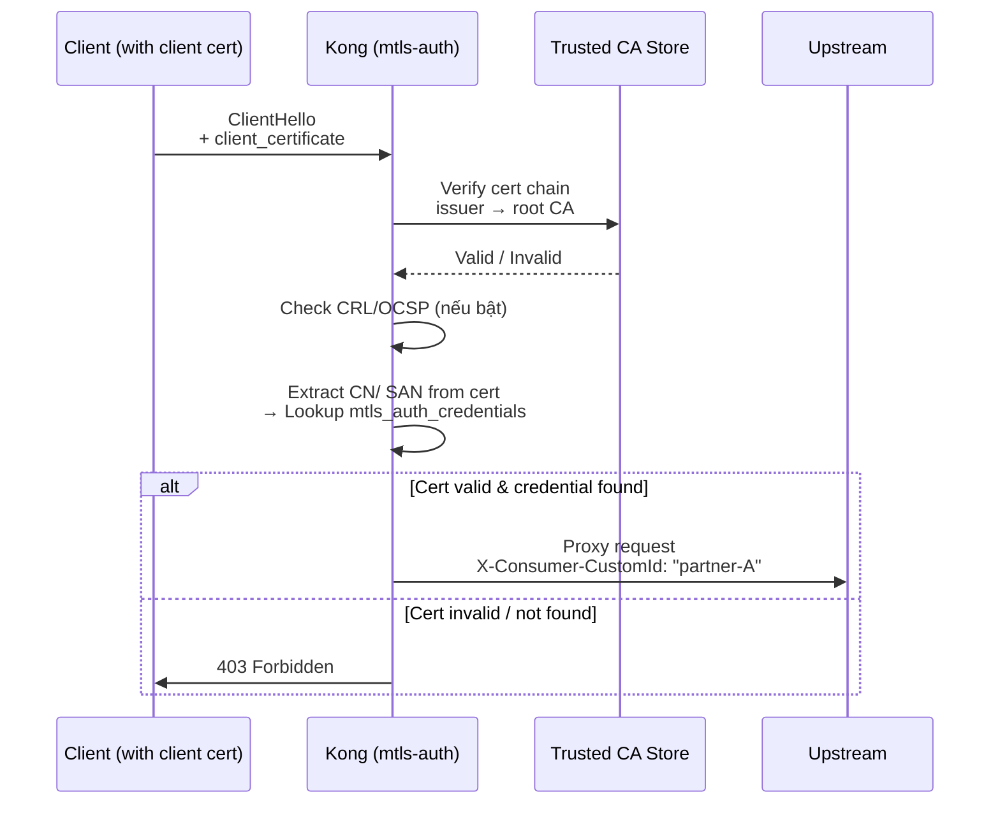

# Day 11: Authentication — Key Auth, JWT, mTLS Overview

> **Thời lượng**: 2 giờ
> **Độ khó**: ⭐⭐⭐⭐
> **Prerequisites**: Day 8 (Kong Architecture), Day 9 (Core Entities: Service, Route, Consumer, Plugin), Day 10 (DB-less & decK)

---

## 1. Learning Objectives

Sau bài này, bạn sẽ có thể:

- Configure **key-auth plugin** ở route-level, tạo Consumer và API key credential, verify 401 khi key sai/missing
- Configure **JWT plugin** với HS256 và RS256 algorithm, verify signature, check exp/nbf claims, debug JWT errors phổ biến
- Thiết kế **anonymous consumer pattern** để nhiều auth plugin fallback về cùng một anonymous identity
- Mô tả **mTLS plugin** ở mức overview — generate CA + client cert, hiểu mutual TLS authentication tại Kong (lab chạy đầy đủ cần Kong Gateway Enterprise/Konnect hoặc image có `mtls-auth`)
- Apply auth plugin + rate-limiting per Consumer để bảo vệ API có observability đầy đủ
- So sánh 4 phương án auth (Key Auth / JWT HS256 / JWT RS256 / mTLS) theo security level, performance overhead, complexity và key rotation strategy
- Troubleshoot các lỗi 401/403 phổ biến: key not found, JWT signature fail, expired token, mTLS handshake fail

---

## 2. The Problem

> **Scenario thực tế**: Bạn vận hành một nền tảng API gồm 12 microservices, phục vụ 3 loại client khác nhau:
>
> - **Mobile app** (100k MAU): yêu cầu auth cho mỗi API call — team mobile muốn dùng API key đơn giản
> - **Partner B2B** (20 đối tác): mỗi đối tác cần credential riêng, có thể bị revoke, cần track quota riêng
> - **Internal service-to-service** (8 services): không thể dùng API key vì secret leak risk, cần certificate-based auth hoặc signed token
>
> Tuần trước, một dev vô tình commit API key production vào GitHub. Partner B2B bị gián đoạn 2 giờ vì phải rotate key thủ công. Internal service-to-service dùng chung API key — khi một service bị compromise, toàn bộ cluster bị ảnh hưởng.
>
> **Câu hỏi**: Nên dùng phương án auth nào cho từng loại client? Kong xử lý ở layer nào? Làm sao revoke key/token ngay lập tức khi có incident?

**Pain points thực tế:**

- API key đặt trong query string (URL log, browser history, server access log)
- Basic Auth không có khả năng revoke — leak một lần là compromised vĩnh viễn
- JWT không revoke được (stateless) — khi token bị leak, không có cách invalidate ngoài đợi exp
- Shared secret giữa nhiều service — compromise một, compromise tất cả
- Không phân biệt được "ai đang gọi" — không có Consumer model
- Auth logic nằm trong application code — mỗi service phải implement lại

**Hậu quả nếu thiết kế sai:**

- Data breach từ leaked API key (không revoke được)
- Revenue loss khi partner B2B bị gián đoạn vì key rotation downtime
- Security gap khi internal service bị compromise và không có mTLS
- Compliance fail (PCI-DSS, SOC 2) khi không có audit trail cho "ai gọi API lúc nào"
- Không có quota enforcement — một consumer có thể chiếm toàn bộ bandwidth

---

## 3. Core Concepts

### 3.1 Authentication vs Authorization

**Authentication** (xác thực): "Bạn là ai?" — verify identity của client. Kong xử lý ở layer này: key-auth kiểm tra API key, JWT verify token signature, mTLS verify client certificate.

**Authorization** (ủy quyền): "Bạn được làm gì?" — enforce permission sau khi biết identity. Kong xử lý bằng ACL plugin, rate-limiting per consumer, IP restriction.

> **Lưu ý quan trọng**: Bài này tập trung vào Authentication. Authorization (ACL, rate-limit, IP restriction) là Day 12.

### 3.2 Ba Model Authentication



**Model 1 — Shared Secret** (Key Auth, Basic Auth, HMAC Auth):
- Client gửi secret cố định (API key hoặc password) trong mỗi request
- Kong lookup secret trong credential table (keyauth_credentials, basicauth_credentials)
- Đơn giản, dễ implement, nhưng không revoke được nếu leak mà không có blacklist mechanism

**Model 2 — Token-based** (JWT, OAuth2):
- Client gửi token có expire time (JWT) hoặc access token (OAuth2)
- Token được signed bằng secret (HS256) hoặc private key (RS256)
- Stateless — Kong verify mà không cần DB lookup
- Không revoke được (stateless), trừ khi dùng token blacklist hoặc short-lived token

**Model 3 — Certificate-based** (mTLS):
- Client gửi X.509 certificate trong TLS handshake
- Kong verify certificate chain từ trusted CA
- Không có secret transmission — private key không bao giờ rời khỏi client
- Phức tạp về operations: cert generation, rotation, revocation

> **Licensing note**: `mtls-auth` là Enterprise plugin trong Kong Gateway. Bài này vẫn cover mTLS vì đây là pattern production quan trọng cho service-to-service và partner API, nhưng lab chính với image OSS tập trung vào Key Auth và JWT.

### 3.3 Kong Consumer Model và Credential Entity

Mỗi auth plugin tạo một **credential table** riêng trong Kong's DB (hoặc declarative config):



**Kong credential tables:**

| Plugin | Table (DB-mode) | Credential trong kong.yml |
|---|---|---|
| key-auth | `keyauth_credentials` | `keyauth_credentials[].key` |
| jwt | `jwt_secrets` | `jwt_secrets[]` |
| basic-auth | `basicauth_credentials` | `basicauth_credentials[]` |
| mTLS | `mtls_auth_credentials` | `mtls_auth_credentials[]` |

### 3.4 Anonymous Consumer Pattern

Khi một route có nhiều auth plugin (key-auth OR jwt), Kong dùng `anonymous` consumer để handle request không có credential:

```
Request không có API key
  → key-auth plugin: "key not found"
  → Kiểm tra anonymous consumer ID
  → Gán identity = anonymous consumer
  → Continue (không return 401)
  → Rate-limit kiểm tra anonymous consumer quota
```

```bash
# Kong.yml: key-auth plugin với anonymous fallback
plugins:
  - name: key-auth
    route: payment-route
    config:
      key_names: ["apikey", "X-API-Key"]
      anonymous: "anonymous"   # consumer username

consumers:
  - username: mobile-app
    keyauth_credentials:
      - key: "km_prod_secret_key"

  - username: anonymous
    # Không có credential — chỉ là fallback identity
    plugins:
      - name: rate-limiting
        config:
          minute: 10   # anonymous bị giới hạn thấp
```

**Khi nào dùng anonymous pattern:**

- Auth là optional cho một số endpoint (VD: public docs nhưng premium docs cần auth)
- Migration: bật auth mà không muốn break existing clients ngay
- Internal monitoring/cron: không cần real consumer credential

### 3.5 Consumer Context — Kong inject Headers

Sau khi auth plugin verify thành công, Kong inject headers vào request trước khi forward đến upstream:

```
X-Consumer-ID:        "11e3a1b2-c4d5-..."
X-Consumer-Username:  "mobile-app"
X-Credential-Identifier: "keyauth:km_prod_secret_key"
X-Anonymous-Consumer: "true"   # nếu dùng anonymous consumer
```

**Upstream dùng các header này để:**

- Log: biết ai gọi API
- Authorization: enforce permission ở application layer
- Audit: compliance report "ai truy cập dữ liệu lúc nào"

---

## 4. How It Works Internally

### 4.1 Access Phase — Nơi Auth Plugin Chạy

Trong Kong request lifecycle, auth plugin chạy ở **access phase** (cùng phase với rate-limiting, ACL, IP restriction). Access phase nằm sau routing nhưng trước khi request được proxy đến upstream:

```
rewrite phase
    ↓
access phase        ← auth plugins chạy ở đây
    ↓
balancer phase
    ↓
upstream
    ↓
header_filter phase
    ↓
body_filter phase
    ↓
log phase
```

Auth plugin có thể **terminate request sớm** bằng `kong.response.exit(401, {...})` — request không đến upstream nếu auth fail.

### 4.2 Plugin Priority — Thứ Tự Thực Thi

Trong cùng access phase, các plugin chạy theo **priority giảm dần** (số lớn chạy trước). Auth plugins có priority cao hơn rate-limiting (910):

| Plugin | Priority | Loại |
|---|---:|---|
| jwt | **1005** | Auth |
| oauth2 | 1004 | Auth |
| key-auth | **1003** | Auth |
| ldap-auth | 1002 | Auth |
| basic-auth | 1001 | Auth |
| hmac-auth | 1000 | Auth |
| mtls-auth | **1600** | Auth (certificate phase) |
| cors | 2000 | Security |
| ip-restriction | 990 | Security |
| acl | 950 | Authorization |
| rate-limiting | 910 | Policy |
| request-transformer | 801 | Transform |

> **Quan trọng**: mTLS chạy ở **certificate phase** (trước cả access phase) — TLS handshake verify certificate trước khi HTTP request được parse. JWT (priority 1005) chạy trước key-auth (priority 1003).

### 4.3 Key Auth Flow



**Key extraction order** (theo config `key_names`):
1. Header `apikey` (default)
2. Header `X-API-Key`
3. Query param `?apikey=xxx`

### 4.4 JWT Flow



**JWT structure:**

```
eyJhbGciOiJSUzI1NiJ9.eyJpc3MiOiJteS1pc3N1ZXIiLCJzdWIiOiJtb2JpbGUtYXBwIiw
iYXVkIjoiYXBpLmV4YW1wbGUuY29tIiwiZXhwIjoxNzUwMDAwMDAwLCJpYXQiOjE3NDk4MDAw
MDB9.Signature
```

**Decoded header:**
```json
{
  "alg": "RS256",
  "typ": "JWT",
  "kid": "key-id-1"
}
```

**Decoded payload (claims):**
```json
{
  "iss": "my-issuer",        // Issuer — lookup jwt_secret
  "sub": "mobile-app",       // Subject — Consumer identifier
  "aud": "api.example.com",  // Audience — đúng API không?
  "exp": 1750000000,         // Expiration time (Unix timestamp)
  "nbf": 1749800000,         // Not before (token chưa valid)
  "iat": 1749800000,         // Issued at
  "jti": "unique-token-id"   // JWT ID — dùng cho blacklist
}
```

### 4.5 mTLS Overview Flow

mTLS (mutual TLS) khác với standard TLS ở chỗ **cả client và server đều present certificate**. Server verify client certificate trước khi accept connection:



### 4.6 Kong Credential Caching

Kong cache credential lookup trong `lua_shared_dict` để tránh DB hit mỗi request:

```
kong_db_cache (128m):     credential data
kong_db_cache_miss (12m):  negative cache (key not found)
```

**Cache invalidation triggers:**

- Manual: `DELETE /consumers/{name}/key-auth/{credential_id}` → immediate invalidation
- DB-mode: cluster event broadcast → all nodes invalidate
- DB-less: `POST /config` → full cache flush + reload

**Timeout budget cho auth lookup:**

```
Auth lookup budget: ≤ 10ms (target)
  ├─ Key-auth DB lookup:    1-3ms (local cache hit)
  ├─ JWT signature verify:   0.5-2ms (HS256) / 1-5ms (RS256)
  ├─ mTLS cert chain verify: 2-10ms (first connection) / <1ms (session resumption)
  └─ JWKS fetch (first time): 5-50ms (network) → CACHE kết quả

→ Auth không được vượt quá 10% total timeout budget
```

---

## 5. Hands-on Lab

Các lab chi tiết có trong file `exercises.md`. Tổng quan:

| Lab | Chủ đề | Kong resource tạo |
|---|---|---|
| 1 | Key Auth — Consumer + API key | Consumer, keyauth_credentials, key-auth plugin |
| 2 | JWT HS256 — encode/decode/verify | Consumer, jwt_secret (HS256), jwt plugin |
| 3 | JWT RS256 — RSA key pair, JWKS | RSA key pair, jwt_secret (RS256), JWKS endpoint |
| 4 | Multiple Auth + Anonymous | key-auth + jwt cùng route, anonymous consumer |
| 5 | mTLS Overview — CA + client cert | CA generation, mtls-auth plugin, mTLS route |
| 6 | Auth + Rate Limit per Consumer | key-auth + rate-limiting combo, verify per-consumer quota |
| 7 | (Optional) Key Rotation + Blacklist | JWT blacklist strategy, credential rotation |

---

## 6. Trade-offs Analysis

### 6.1 Auth Plugin Comparison

| Aspect | Key Auth | Basic Auth | JWT HS256 | JWT RS256 | mTLS | OAuth2 Delegate |
|---|---|---|---|---|---|---|
| **Security** | Trung bình | Thấp | Trung bình | Cao | Rất cao | Cao |
| **Stateless?** | Có | Có | Có | Có | Có | Không |
| **DB lookup?** | Có (key lookup) | Có (password verify) | Không | Không | Không | Có (token introspection) |
| **Revocable?** | Ngay lập tức | Không | Chỉ nếu blacklist | Chỏ nếu blacklist | CRL/OCSP | Ngay lập tức |
| **Performance** | ~1ms (cached) | ~2ms | ~1ms | ~2-3ms | ~2-10ms* | ~5-50ms** |
| **Complexity** | Thấp | Thấp | Trung bình | Cao | Rất cao | Rất cao |
| **Key rotation** | Dễ (delete credential) | Khó (password change) | Trung bình (rotate secret) | Dễ (rotate public key) | Phức tạp (cert lifecycle) | Trung bình |
| **Storage secret** | Kong DB | Kong DB | Shared secret | Public key only | CA chain | Token server |
| **Use case** | Partner API, mobile | Legacy system | Internal microservice | Partner B2B, mobile | Service-to-service | Public API với OAuth2/OIDC |
| **Compliance** | PCI-DSS hạn chế | Không đủ | Cần short exp | Tốt | PCI-DSS tốt | Tốt nhất |

*mTLS first connection overhead; session resumption giảm đáng kể.
**OAuth2 delegate: introspection request overhead mỗi request.

### 6.2 Hidden Costs & Pitfalls

**JWT pitfalls:**

- **Không revoke được** (stateless) → phải dùng short-lived token (exp ≤ 15 phút) + refresh token pattern
- **Leak secret = game over** (HS256) → secret phải được lưu trong secret manager, không commit vào Git
- **RS256 public key rotation** → nếu không dùng JWKS endpoint, client phải update public key thủ công
- **Clock skew** → nbf/exp verify fail khi server và client clock drift > 30s
- **JWT none algorithm** → attacker gửi `{"alg":"none"}` để bypass signature check (known attack vector)

**Key Auth pitfalls:**

- **API key trong URL query** → log, browser history, CDN cache log đều chứa key
- **Key leak vào Git** → không có cách revoke ngay lập tức (phải delete credential + force restart DB cache)
- **Shared key** → nhiều service dùng chung key → một leak = tất cả compromised

**mTLS pitfalls:**

- **Cert expiry không monitor** → production outage khi cert hết hạn mà không có alerting
- **CRL distribution** → revoke list phải được distribute đến tất cả Kong node
- **CA compromise** → toàn bộ PKI bị compromise
- **Session resumption** → không hoạt động qua load balancer nếu LB không support TLS session cache

### 6.3 Anti-patterns

```
ANTI-PATTERN 1: API key trong query string
   GET /api/orders?apikey=km_secret_key
   → Key xuất hiện trong:
     - Server access log
     - CDN access log
     - Browser history
     - Load balancer log
   → FIX: Luôn dùng header (apikey, Authorization)

ANTI-PATTERN 2: Basic Auth không có TLS
   Authorization: Basic base64(user:pass)
   → Username/password transmit plaintext
   → FIX: Basic Auth chỉ dùng khi có HTTPS

ANTI-PATTERN 3: JWT dùng algorithm "none"
   Header: {"alg": "none"}
   → Signature không được verify
   → FIX: Kong reject algorithm "none" by default

ANTI-PATTERN 4: Long-lived JWT (exp = 1 năm)
   → Không revoke được khi employee leave hoặc key leak
   → FIX: exp ≤ 15 phút, dùng refresh token pattern

ANTI-PATTERN 5: mTLS không check certificate revocation
   → Compromised private key vẫn hoạt động cho đến khi cert hết hạn
   → FIX: Bật CRL hoặc OCSP check trong mtls-auth plugin
```

---

## 7. Best Practices & Best Solution

### 7.1 Theo Use Case

**Use case: Public API cho mobile app**

```
Best solution: JWT RS256 + Keycloak (OAuth2/OIDC)
  → Mobile app get token từ Keycloak
  → Kong jwt plugin verify RS256 signature
  → Consumer = subject claim trong JWT
  → exp = 15 phút, refresh token = 7 ngày
```

**Lý do:**
- RS256: public key có thể distribute mà không cần secret transmission
- Short-lived token: revoke bằng cách revoke refresh token trong Keycloak
- Keycloak: chuẩn OIDC, hỗ trợ MFA, session management
- Kong không cần biết về user management — chỉ verify token

**Use case: Internal service-to-service**

```
Best solution: mTLS hoặc JWT HS256 với service identity
  → Mỗi service có certificate hoặc service account JWT
  → Kong verify certificate hoặc JWT signature
  → Service identity = CN/SAN trong cert hoặc iss claim trong JWT
```

**Lý do:**
- mTLS: không có secret transmission — private key không bao giờ rời khỏi service
- JWT HS256: đơn giản, stateless, không cần PKI infrastructure
- Service identity không gắn với human user → không cần OAuth2/OIDC overhead

**Use case: Partner B2B API**

```
Best solution: Key Auth + IP Restriction + Rate Limit per Consumer
  → Mỗi partner có API key riêng
  → IP whitelist cho partner server
  → Rate limit 1000 req/min per partner
```

**Lý do:**
- Key Auth: đơn giản, dễ integrate (partner chỉ cần thêm header)
- IP restriction: partner không thể dùng key từ IP khác
- Rate limit per consumer: đảm bảo công bằng giữa các partner
- Revocable: delete credential → partner mất quyền truy cập ngay lập tức

**Use case: Legacy system (không thể thay đổi client)**

```
Best solution: Basic Auth (HTTPS only) + Kong rate limiting
  → Client dùng username/password
  → Kong verify, upstream chỉ nhận downstream call
```

### 7.2 Production Best Practices

**DO:**

- Luôn dùng HTTPS — API key và JWT token không bao giờ transmit qua HTTP
- Dùng `Authorization: Bearer <token>` thay vì query param cho JWT
- Dùng `apikey` hoặc `X-API-Key` header thay vì `?apikey=xxx` cho Key Auth
- Set `exp` claim JWT ≤ 900s (15 phút) cho mobile app
- Monitor credential expiry: Prometheus alert khi API key sắp hết hạn (nếu có exp)
- Dùng Kong Prometheus plugin để count 401/403 → alert khi tỉ lệ > 5%
- Implement key rotation schedule: rotate API key 90 ngày, RSA key pair 1 năm
- Dùng Kong workspaces (Enterprise) để isolate auth config giữa các team

**DON'T:**

- Không commit raw secret vào Git — dùng secret manager (Vault, AWS Secrets Manager)
- Không dùng algorithm "HS256" cho partner B2B (secret phải share)
- Không dùng algorithm "none" trong JWT header
- Không bật auth plugin ở global scope nếu có endpoint không cần auth
- Không ignore 401/403 spike trong Prometheus — đó là dấu hiệu của credential leak

---

## 8. Performance Considerations

### 8.1 Benchmark Methodology

**Tool**: `wrk` hoặc `hey`
**Environment**: 4 vCPU, 8GB RAM, localhost network
**Payload**: 1KB JSON
**Duration**: 60s
**Connections**: 200
**Threads**: 4
**TLS**: Off (auth overhead, không phải TLS overhead)
**Kong mode**: DB-less
**Cache**: credential đã warm (first request đã done)

> **Lưu ý**: số liệu chỉ dùng để tham khảo. Kết quả thực tế phụ thuộc hardware, payload, Kong version, số plugin đồng thời, cache hit rate.

### 8.2 Sample Latency Comparison

| Scenario | p50 | p95 | p99 | Notes |
|---|---|---|---|---|
| Baseline (no auth) | 1ms | 2ms | 3ms | Kong proxy only |
| Key Auth (cached) | 1.5ms | 3ms | 5ms | DB cache hit |
| JWT HS256 | 2ms | 4ms | 6ms | HMAC verify |
| JWT RS256 | 3ms | 6ms | 10ms | RSA signature verify |
| JWT RS256 + JWKS fetch (cold) | 15ms | 30ms | 50ms | First request only |
| mTLS (session resumed) | 2ms | 3ms | 5ms | TLS ticket/session ID |
| mTLS (full handshake) | 10ms | 20ms | 30ms | First connection |
| OAuth2 token introspection | 10ms | 30ms | 60ms | HTTP round-trip to token server |

**JWT RS256 vs HS256**: RS256 đắt hơn vì RSA signature verification (~3-5x slower than HMAC). Tuy nhiên với JWKS caching, chỉ first request bị penalty.

**mTLS session resumption**: TLS 1.3 session resumption (PSK) giảm đáng kể handshake overhead. Một Kong node với session cache có thể handle 50k+ resumed connections/second.

### 8.3 Bottleneck Analysis

**Key Auth bottleneck:**
- DB lookup latency (DB-mode) → giảm bằng Redis cache
- Key not found (negative cache miss) → first request per key hit cache miss

**JWT bottleneck:**
- JWKS fetch lần đầu (network 5-50ms) → cache JWKS ở Kong, refresh 1 giờ/lần
- JWKS endpoint unreachable → Kong fail-closed (reject all JWT) hoặc fail-open (configurable)
- RS256 signature verify CPU-bound → scale Kong horizontally

**mTLS bottleneck:**
- Full handshake (1-RTT) overhead cao → dùng session resumption
- Cert chain verification CPU-bound → cache verified cert chain per session
- CRL/OCSP check thêm latency → chỉ bật nếu compliance yêu cầu

### 8.4 Capacity Planning

Auth overhead addition khi capacity planning:

```
Target throughput: 10,000 RPS
Auth overhead:     ~2ms per request (JWT HS256)
→ Additional CPU: 10,000 × 2ms = 20,000ms CPU/s = 20 cores

With 4 vCPU Kong node: 20 / 4 = 5 Kong nodes needed for auth overhead alone
→ Real-world: auth overhead là ~10-15% total CPU với JWT
```

---

## 9. Troubleshooting Checklist

### 9.1 HTTP 401 — No API Key / Key Not Found

```bash
# 1. Kiểm tra key có được gửi đúng cách
curl -v http://localhost:8000/api/orders 2>&1 | grep -i "apikey\|www-authenticate"

# 2. Kiểm tra key_names config
curl -s http://localhost:8001/routes/payment-route/plugins \
  | jq '.data[] | select(.name=="key-auth") | .config.key_names'

# 3. Kiểm tra credential có tồn tại
curl -s http://localhost:8001/consumers/mobile-app/key-auth \
  | jq '.data[] | {key: .key, enabled: .enabled}'

# 4. Kiểm tra key có đúng (lookup by key)
curl -s http://localhost:8001/key-auths \
  | jq '.data[] | select(.key=="km_mobile_xxx")'

# 5. Kiểm tra consumer enabled
curl -s http://localhost:8001/consumers/mobile-app \
  | jq '{username, custom_id, enabled}'

# 6. Check Kong error log
docker logs kong-dbless 2>&1 | grep -i "key-auth\|credential\|401"
```

**Nguyên nhân phổ biến:**
- Key không match (case sensitive, whitespace)
- Key bị delete nhưng cache chưa invalidate
- `anonymous` consumer không được set → key-auth fail không fallback

### 9.2 HTTP 401 — JWT Signature Failed

```bash
# 1. Decode JWT header + payload (không cần signature)
echo "eyJhbGciOiJIUzI1NiJ9.eyJpc3MiOiJ..." | \
  base64 -d | jq .

# 2. Kiểm tra JWT secret/public key trong Kong
curl -s http://localhost:8001/consumers/mobile-app/jwt \
  | jq '.data[] | {algorithm, key, rsa_public_key: (.rsa_public_key != null)}'

# 3. Verify signature bằng jwt-cli
jwt decode <token> --secret <secret>       # HS256
jwt decode <token> --pubkey <public.pem>   # RS256

# 4. Check exp claim — clock skew có thể gây fail
date
echo "JWT exp: $(echo <token> | cut -d. -f2 | base64 -d | jq .exp)"

# 5. Kiểm tra iss claim match jwt_secret issuer
curl -s http://localhost:8001/consumers/mobile-app/jwt \
  | jq '.data[] | .key'   # "iss" claim phải match "key" field

# 6. Check Kong error log
docker logs kong-dbless 2>&1 | grep -i "jwt\|signature\|verify"
```

**Nguyên nhân phổ biến:**
- Secret/key mismatch: client dùng secret A, Kong lưu secret B
- Algorithm mismatch: client sign RS256, Kong expect HS256
- RS256 public key không đúng (key rotation không update ở Kong)
- JWT token có `alg: none` → Kong reject
- Clock skew > 30s → exp/nbf check fail

### 9.3 HTTP 401 — JWT Token Expired

```bash
# 1. Decode payload, check exp
TOKEN="eyJ..." && echo "$TOKEN" | cut -d. -f2 | base64 -d | jq '{iat, exp, nbf}'
date -u  # So sánh với exp timestamp

# 2. Kiểm tra Kong config nbf/exp tolerance
curl -s http://localhost:8001/plugins \
  | jq '.data[] | select(.name=="jwt") | .config'

# 3. Check Kong system clock
docker exec kong-dbless date -u

# Fix: client phải request token mới
# Long-term fix: dùng refresh token pattern
```

### 9.4 HTTP 403 — Consumer Disabled / ACL Denied

```bash
# 1. Kiểm tra consumer enabled
curl -s http://localhost:8001/consumers/mobile-app \
  | jq '{username, enabled}'

# 2. Kiểm tra ACL plugin có deny rule không
curl -s http://localhost:8001/consumers/mobile-app/plugins \
  | jq '.data[] | select(.name=="acl")'

# 3. Kiểm tra consumer group membership
curl -s http://localhost:8001/consumers/mobile-app/acls \
  | jq '.data[].group'
```

### 9.5 mTLS Handshake Fail

```bash
# 1. Verify client certificate exists
openssl s_client -connect localhost:8443 \
  -cert client.crt -key client.key -CAfile ca.crt

# 2. Check mTLS plugin config
curl -s http://localhost:8001/routes/mtls-route/plugins \
  | jq '.data[] | select(.name=="mtls-auth") | .config'

# 3. Verify CA certificate
openssl x509 -in ca.crt -text -noout \
  | grep -E "Subject:|Issuer:|Not Before|Not After"

# 4. Check cert expiry
openssl x509 -in client.crt -noout -dates

# 5. Verify cert chain
openssl verify -CAfile ca.crt client.crt

# 6. Check CRL (nếu dùng)
curl -s http://crl.example.com/ca.crl | openssl crl -text
```

**Nguyên nhân phổ biến:**
- Client cert expired
- CA certificate không match (wrong CA used to sign client cert)
- SNI mismatch (client gửi wrong hostname trong TLS ClientHello)
- CRL server unreachable (nếu dùng CRL check)

### 9.6 DB Cache Stale Sau Key Rotation

```bash
# 1. Check cache TTL config
curl -s http://localhost:8001/status | jq '.memory.lua_shared_dicts'

# 2. Force cache invalidation (DB-less): POST /config
curl -X POST http://localhost:8001/config \
  -F config=@kong.yml

# 3. Verify credential đã được update
curl -s http://localhost:8001/consumers/mobile-app/key-auth \
  | jq '.data[] | {key, created_at}'

# 4. Check Kong error log
docker logs kong-dbless 2>&1 | grep -i "cache\|invalidat"
```

### 9.7 JWKS Endpoint Unreachable

```bash
# 1. Test JWKS endpoint
curl -s https://auth.example.com/.well-known/jwks.json | jq .

# 2. Check Kong JWKS uri config
curl -s http://localhost:8001/consumers/mobile-app/jwt \
  | jq '.data[] | .jwks_uri'

# 3. Test từ trong Kong container
docker exec kong-dbless curl -s https://auth.example.com/.well-known/jwks.json

# 4. Kong error: JWKS fetch fail → check fail_action config
# fail_action: "reject" (default) or "ignore" (skip JWT verify)
```

---

## 10. Completion Checklist

Sau khi hoàn thành bài học, tự kiểm tra:

- [ ] Tạo Consumer + key-auth credential, apply key-auth plugin route-level, verify 401 khi không có key và 200 khi có key đúng
- [ ] Tạo Consumer + JWT credential với HS256, encode JWT, verify signature + exp claim, debug được lỗi "signature verification failed"
- [ ] Tạo RSA key pair, configure JWT RS256, verify signature với public key, giải thích được tại sao RS256 an toàn hơn HS256 cho partner API
- [ ] Configure anonymous consumer để key-auth và jwt cùng chạy trên một route, verify anonymous request có quota riêng
- [ ] Mô tả được mTLS flow, biết `mtls-auth` cần CA certificate và hiểu điều kiện license/runtime để chạy lab đầy đủ
- [ ] Combine key-auth + rate-limiting per Consumer, verify mỗi consumer có quota riêng, anonymous bị giới hạn thấp
- [ ] Giải thích được: auth vs authorization, khi nào dùng Key Auth vs JWT vs mTLS, hidden cost của JWT (không revoke được)
- [ ] So sánh được Kong auth plugin với Nginx auth_request module về stateless, DB dependency, consumer model

---

## 11. References

- [Kong Hub: key-auth Plugin](https://docs.konghq.com/hub/kong-inc/key-auth/)
- [Kong Hub: jwt Plugin](https://docs.konghq.com/hub/kong-inc/jwt/)
- [Kong Hub: mtls-auth Plugin](https://docs.konghq.com/hub/kong-inc/mtls-auth/)
- [Kong Hub: basic-auth Plugin](https://docs.konghq.com/hub/kong-inc/basic-auth/)
- [Kong Hub: hmac-auth Plugin](https://docs.konghq.com/hub/kong-inc/hmac-auth/)
- [RFC 7519 — JSON Web Token (JWT)](https://datatracker.ietf.org/doc/html/rfc7519)
- [RFC 7515 — JSON Web Signature (JWS)](https://datatracker.ietf.org/doc/html/rfc7515)
- [RFC 7518 — JSON Web Algorithms (JWA)](https://datatracker.ietf.org/doc/html/rfc7518)
- [RFC 8446 — TLS 1.3](https://datatracker.ietf.org/doc/html/rfc8446)
- [RFC 8705 — OAuth 2.0 Mutual TLS Client Authentication](https://datatracker.ietf.org/doc/html/rfc8705)
- [OWASP API Security Top 10 — Broken Authentication](https://owasp.org/API-Security/)
- [Kong Blog: JWT Security Best Practices](https://konghq.com/blog/)
- [Mozilla SSL Configuration Generator](https://ssl-config.mozilla.org/)
- [JWT.io — Debug JWT online](https://jwt.io/)

---

## Recap

Day 11 đã cover authentication layer của Kong Gateway — từ shared-secret (Key Auth) đến token-based (JWT) đến certificate-based (mTLS).

**Điều cần nhớ:**

- **Authentication** = "bạn là ai?" — Kong verify credential và set consumer context
- **Authorization** = "bạn được làm gì?" — Day 12 (ACL, rate-limit, IP restriction)
- **Key Auth**: đơn giản, DB lookup, revocable ngay, phù hợp partner B2B
- **JWT HS256**: stateless, shared secret, không revoke được, phù hợp internal service
- **JWT RS256**: stateless, public key, dễ rotate, phù hợp partner + mobile (với Keycloak)
- **mTLS**: an toàn nhất, không secret transmission, phức tạp về operations
- **Anonymous consumer**: fallback pattern khi auth là optional
- **Plugin priority**: mTLS (1600) > JWT (1005) > key-auth (1003) > rate-limiting (910)

**Key insight**: Không có phương án auth nào phù hợp cho tất cả use case. Chọn đúng dựa trên: security requirement, operational complexity, revoke requirement, và team capability.

---

## Preview Day 12

**Day 12: Rate Limiting, ACL, IP Restriction & Request Control**

Bài tiếp theo sẽ mở rộng từ authentication (Day 11) sang authorization và request control:
- Rate Limiting plugin: local vs Redis policy, per-consumer quota, fallback khi Redis down
- ACL plugin: whitelist/blacklist consumer group, kết hợp với auth plugin
- IP Restriction: whitelist/blacklist IP/CIDR, X-Forwarded-For spoofing protection
- Request Transformer: thêm header, rewrite path trước khi upstream nhận
- Response Transformer: normalize response format, remove sensitive header
- Hands-on: xây dựng access control layer hoàn chỉnh cho B2B partner API
