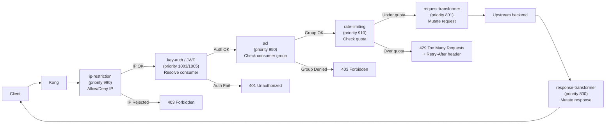

# Day 12: Rate Limiting, ACL, IP Restriction & Request Control

> **Thời lượng**: 2 giờ
> **Độ khó**: ⭐⭐⭐
> **Prerequisites**: Day 6 (Nginx Rate Limiting — leaky bucket, burst/nodelay, real IP), Day 9 (Plugin scope: global/service/route/consumer, precedence matrix), Day 11 (Authentication — consumer identity được resolve trước khi áp policy)

---

## 1. Learning Objectives

Sau bài này, bạn sẽ có thể:

- Configure **rate-limiting** plugin với 3 policy (`local` / `cluster` / `redis`) và giải thích được trade-off về distributed accuracy
- Configure **ACL plugin** để restrict API access theo consumer group (allow/deny list)
- Configure **IP Restriction** với CIDR notation, hiểu cách lấy real client IP khi đứng sau Cloud Load Balancer
- Apply plugin precedence: consumer > route > service > global, dùng ACL group làm bridge giữa auth và rate-limit
- Configure **request-transformer** để inject consumer metadata vào header gửi upstream
- So sánh Kong rate-limiting với Nginx OSS `limit_req`, nắm được scenario nào dùng cái nào

---

## 2. The Problem

> **Scenario thực tế**: Bạn vận hành một public API platform phục vụ 3 nhóm khách hàng:
>
> - **Free tier**: 100 request/giờ, không cần API key (rate-limit theo IP)
> - **Pro tier**: 10,000 request/giờ, bắt buộc API key (rate-limit theo consumer)
> - **Enterprise tier**: unlimited, bắt buộc API key + IP whitelist
>
> Ngoài ra:
> - **Partner B2B**: chỉ được gọi từ IP range `203.0.113.0/24` — không được phép gọi từ IP khác
> - **Mobile app cũ (version < 2.0)**: phải block hoàn toàn, trả 403
> - **Login endpoint**: cần rate-limit cực kỳ nghiêm ngặt (5 req/phút) để chống brute-force
>
> Tất cả phải apply đúng người + đúng route mà **không sửa code service backend**.

**Pain points thực tế:**

- Rate-limit theo IP cho mobile app → CGNAT khiến hàng nghìn user chia sẻ 1 IP → legitimate user bị reject nhầm
- Rate-limit `local` policy ở 5 Kong node → mỗi node đếm riêng → true limit thực tế = `config × 5` nodes
- ACL group name sai chính tả → partner B2B bị reject dù credential đúng
- IP restriction không trust Cloud LB IP → reject toàn bộ user (X-Forwarded-For bị bỏ qua)
- Redis down → rate-limit fail-open (cho qua hết) hay fail-close (trả 500)? Không có config `fault_tolerant`

**Hậu quả production:**

- ACL sai chính tả → incident lớn, partner không truy cập được trong giờ cao điểm
- IP restriction trước auth → internal monitoring script bị block (nên đặt sau auth hoặc whitelist internal)
- Policy `local` ở multi-node → quota 100 req/h được thực tế 500 req/h ở 5 node → backend overload

---

## 3. Core Concepts

### 3.1 Bốn Nhóm Plugin Kong cho Traffic Control

```
┌─────────────────────────────────────────────────────────────┐
│                    Request đi vào Kong                      │
│                                                             │
│  ┌─────────────────────┐                                    │
│  │ 1. Rate Limiting    │ Quota & throttling                  │
│  │    & Quota          │ limit_req, rate-limiting,          │
│  │                     │ response-ratelimiting              │
│  └─────────────────────┘                                    │
│              │                                              │
│  ┌─────────────────────┐                                    │
│  │ 2. Access Control    │ Identity & permission               │
│  │    (AuthZ)          │ acl, ip-restriction,              │
│  │                     │ bot-detection                      │
│  └─────────────────────┘                                    │
│              │                                              │
│  ┌─────────────────────┐                                    │
│  │ 3. Request Mutation │ Sửa request trước khi gửi         │
│  │                     │ request-transformer,                │
│  │                     │ correlation-id                      │
│  └─────────────────────┘                                    │
│              │                                              │
│  ┌─────────────────────┐                                    │
│  │ 4. Size & Body      │ Validation & termination           │
│  │    Validation       │ request-size-limiting,              │
│  │                     │ request-termination                 │
│  └─────────────────────┘                                    │
│              │                                              │
│         Upstream backend                                    │
└─────────────────────────────────────────────────────────────┘
```

### 3.2 Rate Limiting Policy — local vs cluster vs redis

| Policy | Lưu trữ counter | Multi-node | Accuracy | Use case |
|---|---|---|---|---|
| `local` | In-memory (shared dict) | Không (mỗi node đếm riêng) | Thấp | Dev/test, single node |
| `cluster` | PostgreSQL (DB-mode only) | Có (DB shared) | Cao nhưng chậm | DB-mode legacy, deprecated |
| `redis` | Redis | Có (Redis shared) | Cao | **Production multi-node** |

**`local` policy — số đếm trên mỗi Kong node:**

```
Request đến Kong Node 1: counter = 1
Request đến Kong Node 2: counter = 1  (không biết Node 1)
Request đến Kong Node 3: counter = 1  (không biết Node 1, 2)

→ True limit thực tế = config × Số node Kong
```

**`redis` policy — số đếm tập trung:**

```
Request đến Kong Node 1 → Redis: INCR key = 2
Request đến Kong Node 2 → Redis: INCR key = 3
Request đến Kong Node 3 → Redis: INCR key = 4

→ True limit = config (Redis là single source of truth)
```

**`cluster` policy** dùng PostgreSQL — deprecated cho production vì:
- Mỗi request phải query DB → latency cao
- Connection pool DB dễ bị quá tải khi traffic tăng
- Không hoạt động ở DB-less mode

### 3.3 Window Strategy — Fixed vs Sliding

**Fixed Window (rate-limiting plugin — OSS):**

```
Window 1 (00:00-01:00): max 100 req
Window 2 (01:00-02:00): max 100 req

→ Burst boundary issue:
  Request 99 @ 00:59:00 → OK
  Request 100 @ 00:59:00 → OK
  Request 1 @ 01:00:00 → OK (window mới reset!)
  → 201 requests trong 2 phút nhưng không vi phạm fixed window
```

**Sliding Window (rate-limiting-advanced plugin — Enterprise):**

```
Sliding window = trượt theo thời gian thực
Request @ 00:59:00 → tính weighted average trong window [23:59:00, 00:59:00]
Request @ 01:00:00 → tính weighted average trong window [01:00:00, 01:00:00]

→ Không có burst boundary, chính xác hơn nhưng tốn memory hơn
```

### 3.4 Plugin Scope Precedence (từ Day 9, ví dụ với rate-limit)

Khi request match nhiều plugin scope cùng lúc:

| Priority | Scope | Rate-limit Used |
|---|---|---|
| 1 (cao nhất) | Consumer + Route + Service | Consumer config |
| 2 | Consumer + Route | Consumer config |
| 3 | Consumer + Service | Consumer config |
| 4 | Route + Service | Route config |
| 5 | Consumer only | Consumer config |
| 6 | Route only | Route config |
| 7 | Service only | Service config |
| 8 (thấp nhất) | Global | Global config |

**Ví dụ thực tế:**

```yaml
# Global plugin: 100 req/min
plugins:
  - name: rate-limiting
    config:
      minute: 100
      policy: redis

# Route-level: 1000 req/min cho /v1/orders
services:
  - name: order-service
    routes:
      - name: order-route
        paths: ["/v1/orders"]
        plugins:
          - name: rate-limiting
            config:
              minute: 1000
              policy: redis

# Consumer-level: 10000 req/min cho Pro tier
consumers:
  - username: pro-user
    plugins:
      - name: rate-limiting
        config:
          minute: 10000
          policy: redis
```

**Request flow kết quả:**
- `pro-user` + `/v1/orders` → **10000 req/min** (consumer override route + global)
- `free-user` + `/v1/orders` → **1000 req/min** (route override global)
- `free-user` + `/v1/products` (không có route-level plugin) → **100 req/min** (global)

### 3.5 ACL Plugin — Group-based Authorization

ACL không phải authentication (Day 11), mà là **authorization layer** — xác định consumer thuộc nhóm nào và API endpoint có cho phép nhóm đó không.

**Cơ chế hoạt động:**

```
Consumer tạo → gán vào group
  consumer "pro-user" → ACL entries: ["pro", "premium"]
  consumer "enterprise-user" → ACL entries: ["enterprise", "pro"]
  consumer "partner-b2b" → ACL entries: ["b2b"]

Plugin ACL trên route/service:
  allow: ["pro", "enterprise"]  → chỉ consumer thuộc pro HOẶC enterprise được vào
  deny: ["b2b"]                → consumer thuộc b2b bị reject (override allow)

Request flow:
  1. Auth plugin resolve consumer (key-auth / JWT)
  2. ACL plugin load ACL entries của consumer rồi so với plugin.allow/deny
  3. Nếu không match allow hoặc match deny → 403 Forbidden
```

**Anti-pattern phổ biến — ACL group name sai chính tả:**

```yaml
# Consumer khai báo
consumer:
  username: enterprise-user
  acls:
    - group: "enterprsie"   # ← SAI CHÍNH TẢ! "enterprise" ≠ "enterprsie"

# Plugin cho phép
plugins:
  - name: acl
    config:
      allow: ["enterprise"]  # → consumer không match! → 403 cho dù credential đúng
```

### 3.6 IP Restriction Plugin

**Hai chế độ:**

```yaml
# Whitelist mode: chỉ IP/CIDR trong danh sách được phép
plugins:
  - name: ip-restriction
    config:
      allow:
        - 127.0.0.1
        - 10.0.0.0/8
        - 203.0.113.0/24  # Partner B2B IP range
      deny: []             # không có deny list

# Blacklist mode: IP/CIDR trong danh sách bị từ chối
plugins:
  - name: ip-restriction
    config:
      allow: []
      deny:
        - 1.2.3.4
        - 5.6.7.0/24
```

**Lấy real IP khi đứng sau Cloud Load Balancer:**

```
Client (1.2.3.4) ──► Cloud LB (203.0.113.1) ──► Kong
                                                      │
                                        $remote_addr = 203.0.113.1 ← SAI
                                        X-Forwarded-For = 1.2.3.4
```

Kong phải được config để đọc IP thật:

```bash
# Kong config: trusted_ips
KONG_TRUSTED_IPS=0.0.0.0/0,::/0        # Trust tất cả (chỉ dùng trong mạng nội bộ)
# Hoặc:
KONG_TRUSTED_IPS=203.0.113.0/24          # Chỉ trust Cloud LB IP range

# Trong docker-compose.yml:
environment:
  KONG_TRUSTED_IPS: "0.0.0.0/0,::/0"
  KONG_REAL_IP_RECURSIVE: "on"
  KONG_REAL_IP_HEADER: "X-Forwarded-For"
  KONG_REAL_IP_MASK: "32"
```

**CIDR notation:**

```yaml
# Single IP
allow: ["192.0.2.100"]

# IPv4 CIDR
allow: ["192.0.2.0/24"]      # 256 IPs (192.0.2.0 → 192.0.2.255)
allow: ["10.0.0.0/8"]         # 16M IPs (internal network)

# IPv6
allow: ["2001:db8::/32"]
```

### 3.7 Request Flow — Plugin Execution Order



**Plugin priority list quan trọng:**

| Priority | Plugin | Chạy khi nào |
|---|---|---|
| 990 | `ip-restriction` | TRƯỚC auth — chặn IP xấu sớm |
| 1003 | `key-auth` | Authenticate request |
| 1005 | `jwt` | Verify JWT token |
| 950 | `acl` | Check consumer group membership |
| 910 | `rate-limiting` | Check quota sau khi biết consumer |
| 951 | `request-size-limiting` | Kiểm tra body size |
| 801 | `request-transformer` | Sửa request headers/body |
| 800 | `response-transformer` | Sửa response headers/body |

**Quy tắc**: Higher priority = chạy trước. `ip-restriction` (990) chạy trước `key-auth` (1003) — nghĩa là IP block được kiểm tra TRƯỚC khi auth. Đây là design có chủ đích: chặn attacker sớm, không tốn resource cho auth.

---

## 4. How It Works Internally

### 4.1 Rate Limiting — Redis Policy Deep Dive

**Redis key structure:**

```
rate-limiting:<consumer_id>:<route_id>:<window>
  ↓                    ↓          ↓       ↓
Kong tự generate  hoặc     hash     số window (epoch / window_size)
  "unknown" cho IP-based
```

**Redis Lua script (atomic operation — EVAL):**

```lua
-- Kong dùng Lua script atomic để tránh race condition
-- Script này chạy atomic trên Redis (không bị interrupt)

local key = KEYS[1]           -- "rate-limiting:consumer-123:route-456:3600"
local limit = tonumber(ARGV[1]) -- 1000 (quota)
local window = tonumber(ARGV[2]) -- 3600 (seconds)

local current = redis.call('INCR', key)  -- Atomic increment

if current == 1 then
    redis.call('EXPIRE', key, window)   -- Set TTL = window size
end

if current > limit then
    return 0   -- Over quota → reject
else
    return 1   -- OK
end
```

**Tại sao phải atomic?** Nếu không dùng Lua script:

```
Request A: INCR key → 99
Request B: INCR key → 100  (cùng lúc với A)
Request A: CHECK 100 > 100? → No → PASS
Request B: CHECK 101 > 100? → Yes → REJECT

→ Bị reject nhầm vì counter tăng 2 lần trước khi check
```

**Redis pipeline vs Lua script:**

| Approach | Pros | Cons |
|---|---|---|
| Redis Lua script | Atomic — không race condition | Phải load script vào Redis |
| Redis pipeline (MULTI/EXEC) | Nhanh cho batch | Không atomic cho single key |
| Kong Lua script (EVALSHA) | Reuse script, tránh re-compile | Redis phải có script cached |

### 4.2 Response Headers khi Rate Limited

Khi request bị reject, Kong trả về:

```
HTTP/1.1 429 Too Many Requests
Retry-After: 3600
X-RateLimit-Limit-Minute: 1000
X-RateLimit-Remaining-Minute: 0
X-RateLimit-Limit-Hour: 10000
X-RateLimit-Remaining-Hour: 0
RateLimit-Reset: 1716000000
Content-Type: application/json

{"message":"API rate limit exceeded"}
```

**Header `RateLimit-Reset`** là Unix timestamp — client có thể tính chính xác khi nào quota reset mà không cần đoán.

### 4.3 request-transformer — Template Rendering

Plugin `request-transformer` có 4 action chính:

```yaml
plugins:
  - name: request-transformer
    config:
      # Thêm header mới — dùng template variable
      add:
        headers:
          - "X-Consumer-ID:$(consumer.id)"
          - "X-Consumer-Username:$(consumer.username)"
          - "X-Request-ID:$(request.id)"

      # Ghi đè header
      replace:
        headers:
          - "X-Forwarded-For:$(remote_addr)"

      # Xóa header
      remove:
        headers:
          - "X-Internal-Debug"

      # Thêm query param
      add:
        querystring:
          - "api_version=2"
```

**Template variables có sẵn:**

| Variable | Giá trị |
|---|---|
| `$(consumer.id)` | Consumer UUID |
| `$(consumer.username)` | Consumer username |
| `$(request.id)` | Unique request ID |
| `$(remote_addr)` | Client IP (sau khi real_ip) |

ACL group không phải field trực tiếp của Consumer trong declarative config. Nếu cần quan sát group, bật `hide_groups_header: false` trong ACL plugin và đọc response/request header `X-Authenticated-Groups`.
| `$(request.uri)` | Original request URI |

**Lưu ý**: `request-transformer` chỉ chạy ở **access phase** (request side). Muốn transform response headers/body, dùng `response-transformer` (chạy ở `header_filter`/`body_filter` phase).

### 4.4 request-termination — Short-circuit Response

Plugin này terminate request tại Gateway, không forward đến upstream:

```yaml
plugins:
  - name: request-termination
    config:
      # Maintenance mode — trả 503
      status_code: 503
      message: "Service under maintenance"
      body: '{"error":"maintenance","retry_after":3600}'
      content_type: "application/json"

      # Block mobile app cũ
      status_code: 403
      message: "App version not supported"
```

**Use case chính:**
- **Maintenance mode**: upstream đang deploy, trả 503 thay vì 502
- **Deprecate endpoint**: trả 410 Gone
- **Block by condition**: mobile app version cũ, region block, rate-limit hard limit

---

## 5. Hands-on Lab

> **Tóm tắt** — Chi tiết đầy đủ trong `exercises.md`.
>
> Môi trường: Kong 3.7 DB-less + Redis 7 + 2 backend services (order-service, payment-service) giả lập bằng `mockserver`.
>
> File cần thiết:
> - `docker-compose.yml` (Kong + Redis + 2 mock service)
> - `kong.yml` (declarative config)
> - `seed-data.sh` (tạo consumers + ACL groups)

**Quick start:**

```bash
cd day-12-kong-traffic-control/
docker compose up -d

# Verify Kong + Redis ready
sleep 10
curl -s http://localhost:8001/ | jq '.version'
curl -s http://localhost:8001/services | jq '.data | length'

# Apply kong.yml
deck gateway sync kong.yml --kong-addr http://localhost:8001

# Test rate limit
for i in $(seq 1 5); do
  curl -si http://localhost:8000/v1/orders \
    -H "apikey: km_free_testkey" | head -1
done
```

---

## 6. Trade-offs Analysis

### 6.1 Rate Limiting Policy: local vs cluster vs redis

| Tiêu chí | `local` | `cluster` | `redis` |
|---|---|---|---|
| **Accuracy** | Thấp (×Số node) | Cao (DB shared) | Cao (Redis shared) |
| **Performance** | Rất nhanh (memory) | Chậm (DB query/req) | Nhanh (~1ms overhead) |
| **HA / Scale** | Mỗi node độc lập | PostgreSQL HA cần setup | Redis Cluster / Sentinel |
| **Dependency** | Không | PostgreSQL | Redis |
| **DB-less compatible** | Có | Không | Có |
| **Setup complexity** | Thấp | Trung bình | Trung bình |
| **Cost** | Miễn phí | PostgreSQL cost | Redis cost |
| **Khi nào dùng** | Dev/test, 1 node | Legacy DB-mode only | **Production multi-node** |

**Hidden costs:**
- Redis là **single point of failure** — cần Redis Sentinel (2+ replicas) hoặc Redis Cluster
- Redis bị quá tải → latency tăng thêm 5-50ms/request → cascade failure
- `fault_tolerant=true` (default): Redis down → fail-open → **không có rate limit** → backend có thể overload
- `fault_tolerant=false`: Redis down → trả 500 → outage có thể tránh được nhưng gây false positive

### 6.2 rate-limiting vs rate-limiting-advanced vs response-ratelimiting

| Tiêu chí | `rate-limiting` (OSS) | `rate-limiting-advanced` (Enterprise) | `response-ratelimiting` |
|---|---|---|---|
| **Window type** | Fixed window | Sliding window log / counter | Fixed window |
| **Accuracy** | Có burst boundary | Không burst boundary | Đếm response, không request |
| **Policy** | local/cluster/redis | redis only | local/redis |
| **Distributed** | Có (redis) | Có | Có (redis) |
| **Cost** | Miễn phí | Kong Enterprise | Miễn phí |
| **Limit by** | Request sent | Request received | Response received |
| **Use case** | **Standard quota** | **Precise billing / SLA** | **Response-size quota** |

**`response-ratelimiting`** đếm dựa trên response từ upstream — hữu ích khi:
- Backend trả cached response nhanh nhưng vẫn muốn quota theo response size
- Quota theo bandwidth (MB) thay vì request count

### 6.3 Nginx OSS limit_req vs Kong rate-limiting

| Tiêu chí | Nginx `limit_req` | Kong `rate-limiting` |
|---|---|---|
| **Granularity** | IP, header, URI | Consumer, route, service, global |
| **Distributed** | Không (per instance) | Có (Redis backend) |
| **Dynamic config** | Cần reload | Admin API — dynamic |
| **Algorithm** | Leaky bucket (fixed rate) | Token bucket / fixed window |
| **Auth integration** | Không | Có (plugin chain) |
| **Observability** | Log parsing | Prometheus metrics |
| **Latency overhead** | ~1-5 microsecond | ~1-2 ms (Redis) |
| **Cost** | Miễn phí | Miễn phí (OSS) |
| **Phù hợp** | Edge protection, L4/L7 | API Gateway, multi-tenant |

---

## 7. Best Practices & Best Solution

### 7.1 Multi-tier API — Best Solution Pattern

```
┌─────────────────────────────────────────────────────────┐
│  Global Default: 100 req/min (IP-based, anonymous)       │
│  plugins: [rate-limiting, policy=redis, minute=100]      │
└────────────────────────────┬────────────────────────────┘
                             │
         ┌───────────────────┼───────────────────┐
         │                   │                   │
    ACL Group: free     ACL Group: pro    ACL Group: enterprise
    Consumer: free-*   Consumer: pro-*   Consumer: ent-*
                             │                   │
    Route-level override:  Route-level override:  Route-level + IP whitelist:
    minute=500             minute=10000           unlimited + ip-restriction
```

**kong.yml snippet:**

```yaml
_format_version: "3.0"
_transform: true

# === CONSUMERS & GROUPS ===
consumers:
  - username: free-anonymous
    acls:
      - group: free

  - username: pro-mobile-app
    acls:
      - group: pro
    keyauth_credentials:
      - key: "km_pro_key_2026"

  - username: enterprise-client
    acls:
      - group: enterprise
    keyauth_credentials:
      - key: "km_ent_key_2026"

  - username: partner-b2b
    acls:
      - group: b2b
      - group: enterprise        # b2b cũng có quyền enterprise
    keyauth_credentials:
      - key: "km_b2b_key_2026"

plugins:
  # === GLOBAL DEFAULT (anonymous + free) ===
  - name: rate-limiting
    _comment: "Global default 100 req/min cho anonymous/free"
    config:
      minute: 100
      policy: redis
      fault_tolerant: true
      hide_client_headers: false

  # === /v1/orders — PRO/ENTERPRISE ONLY ===
  - name: acl
    _comment: "Chỉ pro/enterprise được gọi /v1/orders"
    route: order-route
    config:
      allow: [pro, enterprise]
      deny: []

  - name: rate-limiting
    _comment: "Override: 1000 req/min cho /v1/orders"
    route: order-route
    config:
      minute: 1000
      policy: redis
      fault_tolerant: false    # Không cho qua khi Redis down

  # === /v1/orders/payment — PARTNER B2B IP WHITELIST ===
  - name: ip-restriction
    _comment: "Chỉ partner B2B IP được gọi /v1/orders/payment"
    route: partner-route
    config:
      allow:
        - 203.0.113.0/24    # Partner B2B IP range
        - 10.0.0.0/8        # Internal IP
      deny: []

  - name: rate-limiting
    route: partner-route
    config:
      minute: 100000         # Partner không bị giới hạn
      policy: redis

  # === /v1/auth/login — STRICT RATE LIMIT ===
  - name: rate-limiting
    _comment: "Login endpoint: 5 req/min chống brute-force"
    route: login-route
    config:
      minute: 5
      policy: redis
      fault_tolerant: false
```

### 7.2 Production Best Practices

**DO:**
- Policy `redis` cho production multi-node — không có ngoại lệ
- `fault_tolerant: false` cho critical API, `true` cho non-critical (trade-off: fail-open vs fail-close)
- `Retry-After` header luôn trả về — client biết khi nào thử lại
- Monitor Redis latency — `redis.latency > 5ms` là warning threshold
- Đặt `ip-restriction` sau auth để internal monitoring không bị block
- Verify ACL group name bằng script (dễ sai chính tả)
- Rate-limit theo **consumer ID** (authenticated) không theo IP

**DON'T (Anti-patterns):**
- Rate-limit theo IP cho mobile app — CGNAT/NAT khiến nhiều user = 1 IP
- Policy `local` ở multi-node production — accuracy thất thường
- `ip-restriction` whitelist chỉ có 1 IP — SPOF, cần range/CIDR
- Không set `fault_tolerant` — không biết behavior khi Redis down
- ACL group sai chính tả → partner không vào được mà không hiểu tại sao
- Whitelist IP range quá rộng (`0.0.0.0/0`) — attacker có thể spoof

### 7.3 Redis Failure Mode Decision

```
Redis Down
     │
     ├── fault_tolerant: true (fail open)
     │   → Cho request đi qua không rate-limit
     │   → Backend có thể overload
     │   → Dùng khi: non-critical API, prefer availability
     │
     └── fault_tolerant: false (fail close)
         → Trả HTTP 500
         → Graceful degradation
         → Dùng khi: critical API, billing, SLA-bound
```

**Best practice**: Dùng `fault_tolerant: false` cho tất cả API có SLA. Dùng `fault_tolerant: true` chỉ cho internal tooling.

---

## 8. Performance Considerations

### 8.1 Benchmark Methodology

**Disclaimer**: Số liệu bên dưới chỉ dùng để tham khảo. Kết quả thực tế phụ thuộc hardware, OS, network, payload, TLS, logging và plugin chain.

| Parameter | Value |
|---|---|
| Tool | `wrk` |
| CPU | 4 vCPU |
| RAM | 8GB |
| Payload | 1KB JSON |
| Duration | 60s |
| Connections | 200 |
| Threads | 4 |
| Kong | 3.7 DB-less, 1 node |
| Redis | 7.2 (localhost) |

### 8.2 Sample Comparison

| Kong Config | p50 latency | p95 latency | p99 latency | RPS | Notes |
|---|---|---|---|---|---|
| Baseline (no plugin) | 2ms | 5ms | 8ms | 8,500 | Proxy only |
| Rate-limit `local` | 2ms | 5ms | 9ms | 8,300 | ~2% overhead |
| Rate-limit `redis` | 3ms | 7ms | 12ms | 7,200 | ~15% overhead |
| Rate-limit + ACL | 3ms | 7ms | 11ms | 7,100 | ACL ~negligible |
| Full chain (ACL + RL + RT) | 4ms | 9ms | 15ms | 6,500 | 3 plugin |

**Nhận xét:**
- Redis latency overhead: **~1ms/p99** — chấp nhận được cho production
- Redis contention: khi Redis bị quá tải (CPU > 80%), latency tăng gấp 5-10x → cần Redis monitoring
- Kong node count: 5 Kong node × `local` policy = ~5× quota thực tế → dùng `redis`

### 8.3 Bottleneck Thường Gặp

| Bottleneck | Triệu chứng | Cách phát hiện | Fix |
|---|---|---|---|
| Redis latency | p99 tăng đột ngột | `redis-cli latency monitor` | Redis CPU upgrade, sharding |
| Redis connection pool exhausted | Error: `connection pool full` | Kong error log | Tăng `redis_pool_size` |
| ACL group miss (Lua lookup) | 403 tăng bất thường | `kong_http_status{code="403"}` | Verify consumer groups |
| Rate-limit counter stale | Quota không reset đúng lúc | Log `X-RateLimit-Reset` | Check Redis TTL sync |

---

## 9. Troubleshooting Checklist

### 9.1 HTTP 429 — Rate Limit Exceeded nhưng sai consumer

```bash
# 1. Kiểm tra consumer được resolve đúng chưa
curl -si http://localhost:8000/v1/orders -H "apikey: km_test" \
  | grep -E "(X-Consumer|401|403|429)"

# 2. Kiểm tra consumer có tồn tại không
curl -s http://localhost:8001/consumers/km_test/key-auth

# 3. Kiểm tra ACL group
curl -s http://localhost:8001/consumers/km_test/acls | jq '.data[].group'

# 4. Kiểm tra rate-limit plugin trên route
curl -s http://localhost:8001/routes/order-route/plugins \
  | jq '.data[] | select(.name=="rate-limiting") | .config'

# 5. Check Redis keys trực tiếp
redis-cli KEYS "rate-limiting:*"
redis-cli GET "rate-limiting:<consumer_id>:..."
```

### 9.2 ACL 403 Forbidden không hoạt động

```bash
# 1. Verify ACL groups — LỖI THƯỜNG GẶP NHẤT: sai chính tả
curl -s http://localhost:8001/acls | jq '.data[] | {consumer: .consumer.id, group}'

# 2. Verify ACL plugin config
curl -s http://localhost:8001/routes/order-route/plugins \
  | jq '.data[] | select(.name=="acl") | .config'

# 3. Kiểm tra plugin priority — ip-restriction (990) chạy TRƯỚC acl (950)
# Nếu IP bị reject ở bước 990 → không bao giờ đến ACL
curl -s http://localhost:8001/plugins?name=ip-restriction \
  | jq '.data[].config'

# 4. Nếu dùng anonymous consumer: anonymous không có groups → ACL luôn deny
# Fix: set config.hide_client_headers=false để xem headers
```

### 9.3 IP Restriction reject Cloud LB IP thay vì client

```bash
# 1. Check Kong đang dùng IP nào
curl -si http://localhost:8000/v1/orders -H "apikey: km_test" \
  | grep -E "(X-Forwarded-For|X-Real-IP|Client-IP)"

# 2. Verify trusted_ips config
docker exec kong-container env | grep -E "KONG_TRUSTED|KONG_REAL_IP"

# 3. Test bằng curl với X-Forwarded-For giả mạo
curl -si http://localhost:8000/v1/orders \
  -H "X-Forwarded-For: 1.2.3.4" \
  -H "apikey: km_test"

# 4. Verify Kong nhận đúng IP
# Thêm debug header bằng request-transformer
curl -si http://localhost:8000/v1/orders -H "apikey: km_test" \
  | grep "X-Consumer"
```

### 9.4 Rate-limit counter sai khi Kong scale (policy local)

```bash
# Triệu chứng: 100 req/min config nhưng user gửi được 500 req/min
# Nguyên nhân: 5 Kong node × local policy = mỗi node đếm riêng

# 1. Verify policy
curl -s http://localhost:8001/plugins?name=rate-limiting \
  | jq '.data[].config.policy'

# 2. Fix:
# DB-less: sửa kong.yml từ policy local sang redis rồi `deck gateway sync`.
# DB-mode: có thể PATCH plugin qua Admin API nếu quy trình vận hành cho phép.

# 3. Verify Redis connectivity
redis-cli ping
redis-cli INFO clients | grep connected
```

### 9.5 Redis Connection Timeout — fail-open hay fail-close?

```bash
# 1. Check fault_tolerant setting
curl -s http://localhost:8001/plugins?name=rate-limiting \
  | jq '.data[].config.fault_tolerant'

# 2. Simulate Redis down
docker compose stop redis

# 3. Test behavior
curl -si http://localhost:8000/v1/orders -H "apikey: km_test" \
  | head -1
# fault_tolerant=true  → HTTP 200 (fail open)
# fault_tolerant=false → HTTP 500 (fail close)

# 4. Restart Redis
docker compose start redis
```

---

## 10. Completion Checklist

- [ ] Configure được rate-limiting plugin với 3 policy, giải thích được sự khác nhau local/cluster/redis
- [ ] Tạo 3 consumer tier (free/pro/enterprise), gán ACL group, verify 403 khi group không match
- [ ] Configure IP restriction với CIDR notation, verify IP whitelist/blacklist hoạt động
- [ ] Configure trusted_ips cho Cloud LB, verify real IP được dùng thay vì LB IP
- [ ] Configure request-transformer để inject consumer metadata vào upstream headers
- [ ] Configure request-termination cho maintenance mode, verify 503 response
- [ ] Integrate rate-limiting + ACL + key-auth trong cùng request flow, verify plugin priority order
- [ ] Test Redis failure (stop Redis container), observe fail-open vs fail-close behavior
- [ ] Benchmark và so sánh latency p50/p95/p99: no plugin vs rate-limit local vs rate-limit redis
- [ ] So sánh được Kong rate-limiting với Nginx OSS limit_req, biết khi nào dùng cái nào

---

## 11. References

- [Kong Hub: rate-limiting plugin](https://docs.konghq.com/hub/kong-inc/rate-limiting/)
- [Kong Hub: rate-limiting-advanced (Enterprise)](https://docs.konghq.com/hub/kong-inc/rate-limiting-advanced/)
- [Kong Hub: response-ratelimiting plugin](https://docs.konghq.com/hub/kong-inc/response-ratelimiting/)
- [Kong Hub: acl plugin](https://docs.konghq.com/hub/kong-inc/acl/)
- [Kong Hub: ip-restriction plugin](https://docs.konghq.com/hub/kong-inc/ip-restriction/)
- [Kong Hub: request-transformer plugin](https://docs.konghq.com/hub/kong-inc/request-transformer/)
- [Kong Hub: request-termination plugin](https://docs.konghq.com/hub/kong-inc/request-termination/)
- [Kong Hub: request-size-limiting plugin](https://docs.konghq.com/hub/kong-inc/request-size-limiting/)
- [Kong Hub: bot-detection plugin](https://docs.konghq.com/hub/kong-inc/bot-detection/)
- [Kong Docs: plugin priority](https://docs.konghq.com/gateway/latest/plugin-development/pdk/priority/)
- [Cloudflare Engineering Blog: rate limiting](https://blog.cloudflare.com/counting-things-a-distributed-time-series/)
- [Stripe Engineering Blog: API rate limiting](https://stripe.com/blog/rate-limits)
- [RFC 6585 — HTTP Status Code 429](https://tools.ietf.org/html/rfc6585)
- [RFC 7231 — Retry-After Header](https://tools.ietf.org/html/rfc7231#section-7.1.3)

---

## Recap

Day 12 đã học cách vận dụng 4 nhóm plugin Kong cho traffic control:

- **Rate Limiting**: policy `redis` cho distributed multi-node production, `local` cho dev/test; sliding window (Enterprise) vs fixed window (OSS); header `X-RateLimit-*` và `Retry-After` giúp client biết quota còn lại
- **ACL**: authorization layer theo consumer group, chạy sau auth (950); allow/deny list; **LỖI PHỔ BIẾN**: group name sai chính tả → 403 không rõ nguyên nhân
- **IP Restriction**: whitelisting/blacklisting với CIDR notation; **PHẢI** config `trusted_ips` + `real_ip_header` khi đứng sau Cloud LB
- **Request Control**: `request-transformer` (access phase, inject consumer metadata), `request-termination` (short-circuit), `request-size-limiting` (body validation)
- **Plugin chain**: ip-restriction (990) → key-auth (1003) → acl (950) → rate-limiting (910) → request-transformer (801) → upstream

## Preview Day 13

**Day 13: Kong Upstream Load Balancing & Health Checks**

Day tiếp theo sẽ học cách Kong quản lý upstream tập trung — khác với Nginx upstream, Kong có **Upstream entity** + **Target entity** cho phép active health check, weighted load balancing, và passive health check tự động. Đây là nền tảng để hiểu canary/blue-green deployment ở Day 15.
