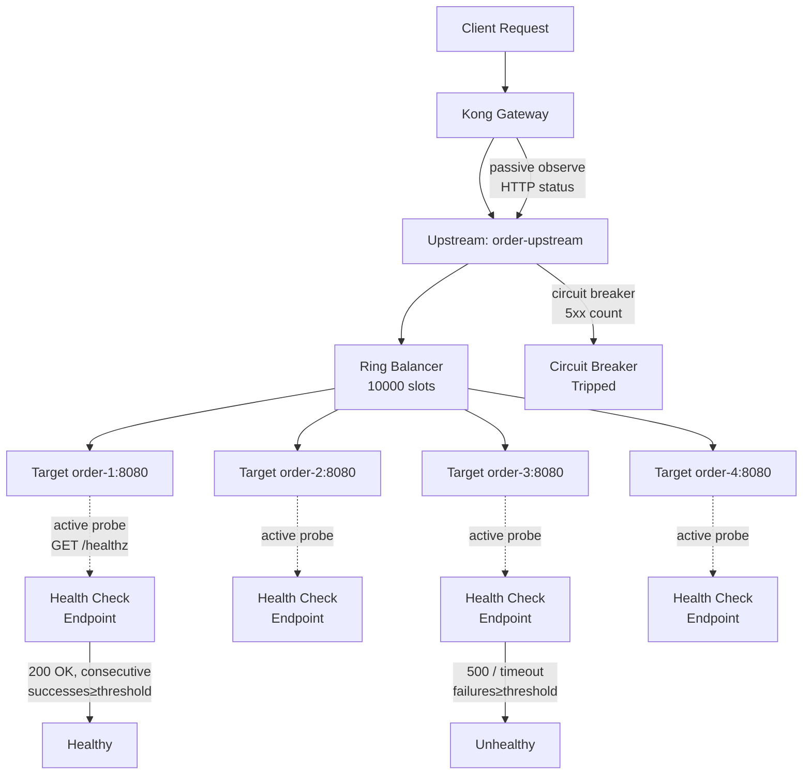

# Day 13: Kong Upstream Load Balancing & Health Checks

> **Thời lượng**: 2 giờ
> **Độ khó**: ⭐⭐⭐⭐
> **Prerequisites**: Day 3 (Load Balancing Algorithms), Day 4 (Health Check & Failover Nginx OSS), Day 9 (Service/Route/Consumer/Plugin), Day 10 (DB-less & decK)

---

## 1. Learning Objectives

Sau bài này, bạn sẽ có thể:

- Phân biệt **Service trỏ tới IP/DNS** vs **Service trỏ tới Upstream entity**, hiểu khi nào dùng named upstream
- Configure **Upstream** entity với 5 algorithm (`round-robin`, `consistent-hashing`, `least-connections`, `latency`, `none`) và hash inputs
- Configure **active health check** (proactive probe) vs **passive health check** (circuit breaker), biết khi nào dùng cái nào
- Sử dụng **ring balancer** (10000 slot) để phân phối request, hiểu cách weight ảnh hưởng slot allocation
- Configure **timeout budget** và **retry strategy** trên Service/Upstream level, tránh retry storm khi tất cả target unhealthy
- Debug **target stuck unhealthy** và **uneven distribution** bằng Admin API + Prometheus metrics

---

## 2. The Problem

> **Scenario thực tế**: Order-service có 4 replicas chạy trong Kubernetes. Tuần này xảy ra 2 incident:
>
> **Incident 1** — Lúc 3 giờ sáng, replica `order-3` bị GC pause 5 giây (JVM full GC). Kong gửi request vào `order-3`, request bị 504 Gateway Timeout sau 60s (default timeout). On-call engineer mất 8 phút detect và remove `order-3` khỏi rotation. Trong 8 phút đó, ~480 request bị timeout.
>
> **Incident 2** — Sau deploy phiên bản mới của order-service, replica `order-4` vừa start bị memory leak quay vòng (OOM killed sau 30s). Nhưng Kong không phát hiện sớm — nó vẫn gửi request vào `order-4` cho đến khi process thực sự bị OOM. 30s đầu tiên, mỗi request nhận được response chậm hoặc 502/503 bất thường.
>
> **Câu hỏi**: Nginx OSS có thể giải quyết được không? Kong làm gì khác?

**Pain points thực tế:**

- **Nginx OSS chỉ có passive health check**: phát hiện lỗi sau khi request thất bại thực sự (Day 4) — với `order-3`, 1 request đã timeout 60s trước khi Nginx biết backend có vấn đề
- **Nginx OSS không có active probe**: không chủ động GET health endpoint, không phát hiện replica bắt đầu slow trước khi user thấy
- **Nginx OSS không có circuit breaker primitive**: `max_fails=3` không đủ để ngăn cascade failure khi backend bắt đầu degrade
- **Target weight tĩnh**: phải reload config khi thêm/bớt backend — Kong có active target discovery

**Giải pháp Kong:**
- **Active health check**: chủ động probe `/healthz` mỗi 5-10s, phát hiện unhealthy trước khi user thấy
- **Passive health check**: observe traffic thực, đếm HTTP status, làm circuit breaker primitive
- **Upstream entity**: load balancer ảo với ring balancer, dynamic target registration
- **Retries**: tự động retry sang target healthy khác khi target hiện tại fail

---

## 3. Core Concepts

### 3.1 Service vs Upstream — Hai cách route request

**Cách 1: Service trỏ thẳng backend (DNS/IP)**

```bash
# Service host = DNS name thuần, không qua Upstream entity
curl -s -X POST http://localhost:8001/services \
  -d "name=order-service" \
  -d "url=http://order-backend:8080/api"
```

Request flow:
```
Client → Kong → order-backend:8080 (DNS resolution 1 lần khi startup)
```

**Hạn chế**: Không có load balancing ảo, không có active health check, không thể weighted distribution.

**Cách 2: Service trỏ tới Upstream entity (named upstream)**

```bash
# Service host = tên Upstream entity
# Kong resolve tên Upstream → ring balancer → chọn target
curl -s -X POST http://localhost:8001/services \
  -d "name=order-service" \
  -d "url=http://order-upstream/api"
```

Request flow:
```
Client → Kong → Service "order-service"
                  → Upstream "order-upstream" (ring balancer)
                      → Target order-1:8080 (weight=100)
                      → Target order-2:8080 (weight=100)
                      → Target order-3:8080 (weight=0, draining)
                      → Target order-4:8080 (weight=100)
```

**Lợi ích**: Load balancing ảo, active/passive health check, weight-based distribution, slot-based algorithm.

### 3.2 Upstream Entity — Tổng quan

**Analogy**: Upstream giống như một "bộ điều phối cuộc gọi" (switchboard operator) của tổng đài cũ. Khi có cuộc gọi đến, operator chọn một trong các đường dây (target) đang rảnh để kết nối. Operator có thể:
- Kiểm tra xem đường dây có bận không trước khi kết nối (active health check)
- Ghi nhận ai vừa nghe máy rồi không gọi lại nữa (circuit breaker)
- Ưu tiên đường dây có băng thông rộng hơn (weighted distribution)

**Upstream entity fields:**

```bash
curl -s -X POST http://localhost:8001/upstreams \
  -d "name=order-upstream" \
  -d "slots=10000" \
  -d "algorithm=round-robin" \
  -d "hash_on=none" \
  -d "hash_fallback=none" \
  -d "healthchecks.active.type=http" \
  -d "healthchecks.active.http_path=/healthz" \
  -d "healthchecks.active.interval=10" \
  -d "healthchecks.active.timeout=5" \
  -d "healthchecks.active.healthy.successes=2" \
  -d "healthchecks.active.unhealthy.tcp_failures=1" \
  -d "healthchecks.active.unhealthy.http_failures=3" \
  -d "healthchecks.active.unhealthy.timeouts=3" \
  -d "healthchecks.passive.type=http" \
  -d "healthchecks.passive.healthy.successes=2" \
  -d "healthchecks.passive.unhealthy.http_failures=5" \
  -d "healthchecks.passive.unhealthy.timeouts=3"
```

### 3.3 Target Entity — Backend Instance

```bash
# Thêm 4 replicas làm target
curl -s -X POST http://localhost:8001/upstreams/order-upstream/targets \
  -d "target=order-1:8080" \
  -d "weight=100"

curl -s -X POST http://localhost:8001/upstreams/order-upstream/targets \
  -d "target=order-2:8080" \
  -d "weight=100"

curl -s -X POST http://localhost:8001/upstreams/order-upstream/targets \
  -d "target=order-3:8080" \
  -d "weight=0"   # drain, nhận 0% traffic

curl -s -X POST http://localhost:8001/upstreams/order-upstream/targets \
  -d "target=order-4:8080" \
  -d "weight=100"
```

**Target immutable**: Target không thể update sau khi tạo. Nếu muốn đổi weight, phải tạo target mới với cùng `host:port` — lịch sử target được giữ nguyên, không overwrite.

```bash
# Sai: Kong không cho phép PATCH target để đổi weight
curl -s -X PATCH http://localhost:8001/upstreams/order-upstream/targets/order-3:8080 \
  -d "weight=50"  # → không hoạt động

# Đúng: tạo target mới cùng target string; bản ghi active mới nhất sẽ quyết định weight
curl -s -X POST http://localhost:8001/upstreams/order-upstream/targets \
  -d "target=order-3:8080" \
  -d "weight=50"
```

### 3.4 5 Load Balancing Algorithms

| Algorithm | Kong config value | Tương đương Nginx | Khi nào dùng |
|---|---|---|---|
| Round-robin | `round-robin` | `round-robin` | Backend đồng nhất, stateless |
| Consistent hashing | `consistent-hashing` | `hash $var consistent` | Stateful session, cache |
| Least connections | `least-connections` | `least_conn` | Backend uneven latency |
| Latency (EWMA) | `latency` | — (Kong only) | Microservices gRPC/REST mixed |
| None | `none` | — | DNS-based discovery (SRV record) |

**Hash inputs** (khi dùng `consistent-hashing`):

```bash
# hash_on: giá trị dùng để hash
# consumer  → hash theo consumer ID (authenticated user)
# ip        → hash theo client IP
# header    → hash theo HTTP header cụ thể
# cookie    → hash theo cookie cụ thể
# path      → hash theo request path
# query_arg → hash theo query parameter cụ thể

# Ví dụ: sticky session theo session ID header
curl -s -X POST http://localhost:8001/upstreams \
  -d "name=order-upstream" \
  -d "algorithm=consistent-hashing" \
  -d "hash_on=header" \
  -d "hash_on_header=X-Session-ID" \
  -d "hash_fallback=round-robin"

# hash_fallback: khi giá trị hash không có (anonymous), dùng algo nào
# round-robin, least-connections, latency, none
```

### 3.5 Active vs Passive Health Check



---

## 4. How It Works Internally

### 4.1 Ring Balancer — 10000 Slot Allocation

Kong dùng **ring balancer** để phân phối request vào các target. Ring có **10000 slot** (configurable qua `slots` field).

```
Ví dụ: 3 target với weights [100, 100, 50]

Slot allocation theo tổng weight = 250:
  order-1 (w=100): ~4000/10000 slots = 40%
  order-2 (w=100): ~4000/10000 slots = 40%
  order-3 (w=50):  ~2000/10000 slots = 20%

Mỗi lựa chọn target dùng ring đã build theo weight ratio.
Với `round-robin`, Kong đi qua ring theo weighted round-robin; với
`consistent-hashing`, hash request map vào ring để giữ sticky behavior.
```

**So sánh với Nginx smooth weighted round-robin** (Day 3):

- Nginx: dùng smooth weighted round-robin với upstream tĩnh trong config
- Kong: build in-memory ring từ Target entity động, health checker có thể skip target unhealthy
- **Slot count 10000** giúp weight ratio mịn hơn, nhất là khi dùng consistent hashing hoặc weight nhỏ

### 4.2 DNS Resolution — lua-resty-dns-client

Kong dùng thư viện `lua-resty-dns-client` (không phải OS resolver mặc định):

```bash
# Cấu hình DNS resolver trong Kong
curl -s -X POST http://localhost:8001/upstreams/order-upstream \
  -d "name=order-upstream" \
  -d "host_header=order-upstream" \
  -d "client_certificate=" \
  -d "use_srv_name=true"
```

**DNS Resolution behavior:**

| Record type | Behavior | Use case |
|---|---|---|
| A / AAAA | Single IP, resolve 1 lần và cache theo TTL | Static IP backend |
| CNAME | Resolve chain đến IP cuối | Alias |
| SRV | IP + Port + Weight từ DNS | Consul, Kubernetes headless service |

**DNS TTL handling:**

```
DNS TTL = 0 (động, không cache)
→ Kong resolve mỗi request → phát hiện target mới ngay
→ Nhưng tăng latency ~1-3ms mỗi request

DNS TTL > 0 (stale DNS)
→ Kong cache theo TTL → không phát hiện target mới trong TTL window
→ Có thể gây 502 nếu backend IP đổi

→ Best practice: TTL = 30s cho service discovery động
```

### 4.3 Active Health Check — Probe Timeline

```
Timeline (interval=10s, threshold=2):

t=0s    Kong probe → order-3:8080/healthz → 200 OK → successes=1
t=10s   Kong probe → order-3:8080/healthz → 200 OK → successes=2 → order-3 = HEALTHY
t=20s   Kong probe → order-3:8080/healthz → 500 Internal Error → successes=0, http_failures=1
t=30s   Kong probe → order-3:8080/healthz → 500 → http_failures=2
t=40s   Kong probe → order-3:8080/healthz → 500 → http_failures=3 → order-3 = UNHEALTHY
t=40s   Kong stop gửi traffic vào order-3
t=50s   Kong probe → order-3:8080/healthz → 200 OK → successes=1
t=60s   Kong probe → order-3:8080/healthz → 200 OK → successes=2 → order-3 = HEALTHY
t=60s   Kong resume gửi traffic vào order-3
```

**Health check interval và detection latency:**

```
interval = 10s
→ Phát hiện unhealthy trong: interval × threshold = 10 × 3 = 30s (worst case)
→ Nginx OSS passive: phát hiện sau max_fails × average_request_interval

→ Active check phát hiện Nhanh hơn passive, nhưng tốn resource probe
```

### 4.4 Passive Health Check — Circuit Breaker Primitive

```bash
# Passive health check config là field của Upstream, không phải endpoint /health
curl -s -X PATCH http://localhost:8001/upstreams/order-upstream \
  -d "healthchecks.passive.type=http" \
  -d "healthchecks.passive.healthy.successes=2" \
  -d "healthchecks.passive.unhealthy.http_failures=5" \
  -d "healthchecks.passive.unhealthy.timeouts=3"
```

**Circuit breaker state machine:**

```
CLOSED (normal) → request thành công → successes++
CLOSED → request thất bại (5xx/timeout) → failures++
CLOSED → failures ≥ threshold → OPEN (circuit tripped)
OPEN → không gửi request vào target này (fast fail)
OPEN → sau probe thành công → HALF-OPEN (allow 1 probe)
HALF-OPEN → probe OK → CLOSED (reset counter)
HALF-OPEN → probe FAIL → OPEN (stay)
```

**Sự khác biệt active vs passive:**

| Tiêu chí | Active Health Check | Passive Health Check |
|---|---|---|
| **Detection timing** | Proactive — phát hiện trước khi user thấy | Reactive — phát hiện sau khi request thất bại |
| **Resource cost** | Probe traffic (thêm load lên backend) | Không có cost |
| **False positive risk** | Có thể (probe path sai, timeout ngắn) | Thấp hơn (chỉ count thất bại thực) |
| **Config phức tạp** | Interval, threshold, path, type (HTTP/TCP) | Threshold, http_statuses, timeouts |
| **Production recommendation** | Bật always | Bật always (circuit breaker) |

**Production best practice: dùng cả hai**
- Active: phát hiện slow-start replica trước khi nhận traffic thực
- Passive: circuit breaker khi upstream trả 5xx mass, stop retrying ngay

### 4.5 Manual Health Control — Force State

```bash
# Force target unhealthy (cho maintenance window)
curl -s -X PUT http://localhost:8001/upstreams/order-upstream/targets/order-3:8080/unhealthy

# Force target healthy (sau khi fix xong)
curl -s -X PUT http://localhost:8001/upstreams/order-upstream/targets/order-3:8080/healthy
```

Use case: rolling deploy — mark old replica unhealthy trước khi terminate.

### 4.6 Service Timeout + Retry — Failure Budget

```bash
# Service level timeout
curl -s -X POST http://localhost:8001/services \
  -d "name=order-service" \
  -d "url=http://order-upstream/api" \
  -d "connect_timeout=2000"    # ms — kết nối TCP, mặc định 60000ms
  -d "send_timeout=60000"       # ms — gửi request body
  -d "read_timeout=30000"       # ms — nhận response, mặc định 60000ms
  -d "retries=3"               # số lần retry, mặc định 5
```

**Timeout Budget principle (từ Day 4):**

```
Client timeout        30s
  ↓ Kong proxy        25s (connect + write + read)
    ↓ Upstream timeout 20s (service.read_timeout)
      ↓ Backend DB    15s (application timeout)
```

**Retry strategy rules:**

```
Retry chỉ khi: error / timeout / 502 / 503
Không retry:    500 (application error), 401 (auth), 404 (not found), 429 (rate limit)

Retry limit: retries=3 (default 5)
Retry storm: nếu tất cả target unhealthy → retries=3 × N targets → N×3 request vào backend

→ Cảnh báo: retries không được circuit breaker. Nếu upstream chậm nhưng không die,
  retries làm tăng load gấp N lần.
```

---

## 5. Hands-on Lab

**Tóm tắt setup**: Kong 3.7 DB-less + 4 backend replicas (order-service variant) + Prometheus metrics.

Chi tiết từng lab trong file `exercises.md`:

```
Exercises:
  1.  Bootstrap Kong + 4 replicas, observe round-robin distribution
  2.  Configure Upstream + Target, compare with direct host service
  3.  Active health check — kill 1 replica, observe automatic failover
  4.  Passive health check — simulate 5xx, observe circuit breaker trip
  5.  Weight=0 drain pattern — rolling deploy simulation
  6.  Consistent-hashing + hash_fallback — sticky session
  7.  Health check tuning — threshold và interval, observe detection latency
```

---

## 6. Trade-offs Analysis

### 6.1 Algorithm × Tiêu Chí

| Algorithm | Latency-sensitive | Cache-friendly | Stateful | Complexity | Khi nào dùng |
|---|:---:|:---:|:---:|:---:|---|
| `round-robin` | Tốt | Không | Không | Thấp | Backend đồng nhất, stateless |
| `consistent-hashing` | Tốt | Rất tốt | Có | Trung bình | Sticky session, cache backend |
| `least-connections` | Rất tốt | Không | Không | Thấp | Backend uneven latency |
| `latency` (EWMA) | Rất tốt | Không | Không | Cao | Microservices mixed REST/gRPC |
| `none` | — | — | — | Thấp | DNS-based discovery only |

### 6.2 Active vs Passive vs Both

| Tiêu chí | Active only | Passive only | Both (recommended) |
|---|---|---|---|
| Detection latency | 5-30s (interval × threshold) | 1 request fail (ms) | Cả hai |
| Resource cost | Probe traffic (~1-5 RPS per target) | Không có | Trung bình |
| False positive risk | Cao (probe path không accessible) | Thấp | Trung bình |
| Slow-start detection | Có ✓ | Không | Có ✓ |
| Circuit breaker | Không | Có ✓ | Có ✓ |
| Config complexity | Cao | Thấp | Trung bình |
| **Production recommendation** | Không đủ | Không đủ | **Có ✓** |

### 6.3 Hidden Costs và Anti-patterns

**Hidden cost — Active check probe overload:**
```
4 replicas × interval=1s × health endpoint CPU=5ms = 20ms CPU/s = 2% overhead
4 replicas × interval=1s × health endpoint CPU=50ms = 200ms CPU/s = 20% overhead
→ interval=10s giảm overhead xuống 2% (với 5ms endpoint)
```

**Hidden cost — Slot count quá thấp:**
```
slots=100, weights=[1, 1, 1] → mỗi target ~33 slots
→ Variance cao: 1 slot = 1% traffic → phân phối lệch ±10% possible
→ slots=10000 → variance < 1%
```

**Anti-pattern 1: `successes=1` (quá dễ mark healthy)**
```bash
# Sai: 1 probe OK → healthy → nhận traffic ngay dù probe có thể false positive
curl -X POST http://localhost:8001/upstreams/order-upstream \
  -d "healthchecks.active.healthy.successes=1"
# Nên dùng successes=2 hoặc 3
```

**Anti-pattern 2: Dùng `none` algorithm mà không có DNS SRV**
```bash
# Sai: Kong không biết distribute traffic, tất cả request đi đâu?
curl -X POST http://localhost:8001/upstreams \
  -d "algorithm=none"
# Chỉ dùng khi DNS resolver tự phân phối (SRV record)
```

**Anti-pattern 3: Retries không có limit khi upstream degrade**
```
retries=5, 4 replicas → max 25 attempts cho 1 request
→ upstream degrade 10% → 2.5× traffic increase → cascade failure
→ Luôn set retries phù hợp, có circuit breaker passive
```

---

## 7. Best Practices & Best Solution

### 7.1 Production Configuration Template

```bash
# === UPSTREAM: order-upstream ===
curl -s -X POST http://localhost:8001/upstreams \
  -d "name=order-upstream" \
  -d "algorithm=round-robin" \
  -d "slots=10000" \
  -d "hash_on=none" \
  -d "hash_fallback=none" \
  \
  -d "healthchecks.active.type=http" \
  -d "healthchecks.active.http_path=/healthz" \
  -d "healthchecks.active.interval=10" \
  -d "healthchecks.active.timeout=5" \
  -d "healthchecks.active.healthy.successes=2" \
  -d "healthchecks.active.healthy.interval=10" \
  -d "healthchecks.active.healthy.request_interval=10" \
  -d "healthchecks.active.unhealthy.tcp_failures=1" \
  -d "healthchecks.active.unhealthy.http_failures=3" \
  -d "healthchecks.active.unhealthy.timeouts=3" \
  \
  -d "healthchecks.passive.type=http" \
  -d "healthchecks.passive.healthy.successes=2" \
  -d "healthchecks.passive.unhealthy.http_failures=5" \
  -d "healthchecks.passive.unhealthy.timeouts=3" \
  | jq .

# === TARGETS: 4 replicas ===
for i in 1 2 3 4; do
  curl -s -X POST http://localhost:8001/upstreams/order-upstream/targets \
    -d "target=order-$i:8080" \
    -d "weight=100"
done

# === SERVICE: trỏ tới Upstream ===
curl -s -X POST http://localhost:8001/services \
  -d "name=order-service" \
  -d "url=http://order-upstream/api" \
  -d "connect_timeout=2000" \
  -d "read_timeout=30000" \
  -d "write_timeout=30000" \
  -d "retries=3" \
  | jq .

# === ROUTE ===
curl -s -X POST http://localhost:8001/services/order-service/routes \
  -d "name=order-route" \
  -d "paths[]=/v1/orders" \
  -d "strip_path=true" \
  | jq .
```

### 7.2 Recommended Solution theo Use Case

**Use case: Stateless REST API, 4 replicas đồng nhất**
```
algorithm: round-robin
healthchecks: active(interval=10s, successes=2) + passive(http_failures=5, timeouts=3)
timeout: connect=2s, read=30s
retries: 3
```

**Use case: Stateful session, sticky theo consumer**
```
algorithm: consistent-hashing
hash_on: consumer
hash_fallback: round-robin
healthchecks: active + passive
```

**Use case: Backend uneven latency (microservices mixed fast/slow)**
```
algorithm: least-connections
→ Hoặc latency (EWMA) nếu dùng Kong 3.x
```

**Use case: Rolling deploy — drain trước khi terminate**
```
1. PUT /targets/{old}:8080/unhealthy (force unhealthy)
2. Chờ active check confirm unhealthy
3. docker compose stop order-old
4. docker compose up order-new
5. PUT /targets/{new}:8080/healthy (force healthy)
```

### 7.3 Capacity Planning — Target Weight

```
weight = CPU_cores × desired_RPS_per_core
weight_ratio = weight_A : weight_B : weight_C

Ví dụ:
  order-1: 4 vCPU, 16GB RAM → weight=400
  order-2: 4 vCPU, 16GB RAM → weight=400
  order-3: 2 vCPU, 8GB RAM  → weight=200

Tổng weight = 1000
→ order-1: 40%, order-2: 40%, order-3: 20%
→ Phân phối đúng với capacity
```

---

## 8. Performance Considerations

### 8.1 Benchmark Methodology

```
Tool: wrk
CPU: 4 vCPU
RAM: 8GB
Payload: 1KB JSON response
Duration: 60s warmup + 120s measure
Connections: 100
Threads: 4
TLS: Off
Keepalive: On
Backend: 4 replicas (Python FastAPI echo server)
Kong version: 3.7
```

> Lưu ý: số liệu dưới đây chỉ dùng để tham khảo. Kết quả thực tế phụ thuộc vào hardware, kernel, network, payload, plugin, health check config.

### 8.2 Sample Overhead — Health Check vs No Health Check

| Config | Latency p50 | Latency p95 | Latency p99 | Ghi chú |
|---|---|---|---|---|
| No health check | 2ms | 4ms | 8ms | Baseline |
| Active (interval=10s, 4 targets) | 2ms | 4ms | 9ms | Probe overhead ~1ms thêm |
| Active (interval=1s, 4 targets) | 3ms | 5ms | 11ms | Probe overhead ~3ms thêm |
| Active + Passive | 2ms | 4ms | 10ms | Passive gần như overhead 0 |

**Overhead của active health check**:
- Probe traffic: 4 targets × 1 probe/10s = 0.4 RPS probe traffic
- Backend CPU: tùy thuộc health endpoint complexity
- Kong internal: 4 worker × periodic timer

### 8.3 Algorithm Overhead

| Algorithm | Relative CPU overhead | Notes |
|---|---|---|
| `round-robin` | Baseline (1×) | Chỉ counter increment |
| `least-connections` | 1.01× baseline | Đọc counter per request |
| `consistent-hashing` | 1.05× baseline | Hash computation + ring lookup |
| `latency` (EWMA) | 1.02× baseline | Exponential moving average update |
| `none` | Baseline | Không chọn, dùng DNS resolution |

### 8.4 Kong Proxy Keepalive — Connection Reuse

```bash
# Kong giữ keepalive connection tới upstream target
# Cấu hình trong Kong: KONG_UPSTREAM_KEEPALIVE_POOL_SIZE
# Mặc định: tự động

# Benefit:
# - Tránh TCP handshake overhead mỗi request
# - Giảm TIME_WAIT connections
# - Latency giảm ~1-3ms cho mỗi request

# Quan sát bằng Prometheus:
#   kong_upstream_target_health{target="order-1:8080", health="healthy"}
#   kong_upstream_target_health{target="order-2:8080", health="unhealthy"}
```

---

## 9. Troubleshooting Checklist

### 9.1 Target Stuck Unhealthy

```
□ Probe path đúng không? curl http://order-3:8080/healthz trả về 200?
□ Health check interval quá dài? (default 10s — có thể OK)
□ Threshold quá cao? successes=10 → rất khó healthy
□ Kong log có gì? docker logs kong | grep health
□ Target port đúng chưa? Có thể service đổi port mà target chưa update
□ DNS TTL có vấn đề? Target IP đổi nhưng Kong vẫn cache IP cũ
```

### 9.2 Uneven Distribution

```
□ Kiểm tra weight của từng target:
  curl http://localhost:8001/upstreams/order-upstream/targets | jq '.data[] | {target, weight, created}'

□ slots=10000 quá thấp cho weight chênh lệch lớn?
  slots mới = slots_cũ × (max_weight / min_weight)

□ hash_on có gây bias không? hash_on=ip với office NAT
  → Tất cả office user → 1 target → overload

□ Kiểm tra phân phối thực tế:
  for i in {1..100}; do curl -s http://localhost:8000/v1/orders | jq -r '.upstream'; done | sort | uniq -c
```

### 9.3 DNS Stale — 502 sau Deploy

```
□ Target mới chưa được resolve:
  docker exec kong curl -s http://order-new:8080/healthz

□ Kiểm tra Kong DNS cache:
  Kong dùng lua-resty-dns-client, cache theo TTL từ DNS record
  Nếu TTL=0 hoặc TTL quá dài → DNS stale

□ Workaround: restart Kong sau deploy
  docker compose restart kong

□ Tốt hơn: dùng SRV record với TTL=30s
```

### 9.4 Target Drain không Đúng — 502 sau Rolling Deploy

```
□ Đã force unhealthy trước khi stop container?
  PUT /upstreams/order-upstream/targets/order-old:8080/unhealthy

□ Active check interval=10s → phải chờ ~10s sau khi force unhealthy
  → Đợi target chuyển sang unhealthy trước khi stop container

□ Check: target list trước khi deploy
  curl http://localhost:8001/upstreams/order-upstream/targets | jq '.data[] | {target, weight, health}'
```

### 9.5 Connection Pool Exhausted

```
□ upstream keepalive pool đầy?
  Kong: KONG_UPSTREAM_KEEPALIVE_POOL_SIZE (default: auto)

□ Backend có slow response → connections bị giữ lâu
  → Giảm read_timeout từ 60s xuống 30s
  → Tăng KONG_UPSTREAM_KEEPALIVE_POOL_SIZE

□ Check active connections:
  docker exec kong curl -s http://localhost:8001/upstreams/order-upstream
```

### 9.6 Observability Metrics

```bash
# Health status per target
curl -s http://localhost:8001/upstreams/order-upstream/health \
  | jq '.data[] | {target, health, weight, created_at}'

# Prometheus metrics
curl -s http://localhost:8001/metrics | grep -E \
  "kong_upstream_target_health|kong_upstream|kong_kong_"

# Check all upstreams health
curl -s http://localhost:8001/upstreams | jq '.data[].name'
```

---

## 10. Completion Checklist

Tự kiểm tra sau khi hoàn thành Day 13:

- [ ] Giải thích được sự khác biệt giữa Service.host = DNS name và Service.host = Upstream name, khi nào dùng named upstream
- [ ] Tạo được Upstream entity với active + passive health check, verify bằng `GET /upstreams/{name}/health`
- [ ] Phân biệt được active health check (proactive probe) vs passive health check (circuit breaker), khi nào dùng cái nào
- [ ] Configure được 5 algorithm (round-robin, consistent-hashing, least-connections, latency, none) và hash inputs
- [ ] Triển khai được weight=0 drain pattern cho rolling deploy, verify target nhận 0% traffic
- [ ] Configure được consistent-hashing với hash_fallback, verify sticky session
- [ ] Debug được target stuck unhealthy bằng Admin API + logs
- [ ] Hiểu DNS resolution trong Kong (lua-resty-dns-client, TTL, SRV record)
- [ ] Giải thích được ring balancer (10000 slots) và cách weight ảnh hưởng distribution
- [ ] So sánh được Kong active health check với Nginx OSS passive-only health check (Day 4)

---

## 11. References

- [Kong Documentation: Upstream Entity](https://docs.konghq.com/gateway/latest/admin-api/upstreams/)
- [Kong Documentation: Target Entity](https://docs.konghq.com/gateway/latest/admin-api/targets/)
- [Kong Documentation: Health Checks](https://docs.konghq.com/gateway/latest/reference/health-checks/)
- [Kong Blog: Ring Balancer Deep Dive](https://konghq.com/blog/ring-balancer)
- [lua-resty-dns-client: DNS Resolution in Kong](https://github.com/kong/lua-resty-dns-client)
- [EWMA Load Balancing — Wu et al. (VUB/Google)](https://www.eecs.harvard.edu/~mao/papers/osdi14-paper-final.pdf)
- [Power of Two Choices — Mitzenmacher](https://www.eecs.harvard.edu/~michaelm/postscripts/handbook2001.pdf)
- [Consistent Hashing — Karger et al. (Akamai)](https://www.akamai.com/us/en/multimedia/documents/technical-publication/consistent-hashing-and-random-trees-distributed-caching-protocols-technically-proven.pdf)
- [Nginx Plus: Active Health Checks (so sánh Kong vs Nginx Plus)](https://docs.nginx.com/nginx/admin-guide/load-balancer/http-health-check/)
- [Martin Fowler: Circuit Breaker](https://martinfowler.com/bliki/CircuitBreaker.html)

---

## Recap

Day 13 đã cover Kong Upstream Load Balancing và Health Checks — điểm khác biệt quan trọng so với Nginx OSS:

- **Kong có active health check** (proactive probe) — phát hiện unhealthy trước khi user thấy, khác với Nginx OSS chỉ có passive
- **Upstream entity** = named load balancer với ring balancer (10000 slot), 5 algorithm, hash inputs
- **Target** = backend instance, immutable, weight=0 cho drain pattern
- **Passive health check** = circuit breaker primitive — count 5xx/timeout từ traffic thực
- **DNS resolution** = lua-resty-dns-client với TTL-aware cache, SRV record support
- **Timeout + Retry** = phải tune riêng cho từng service, tránh retry storm

---

## Preview Day 14

**Day 14: Timeout, Retry, Circuit Breaker & Backpressure**

Ngày mai sẽ đi sâu vào failure resilience ở tầng gateway:
- Timeout Budget end-to-end: client → Kong → upstream → DB
- Retry strategy: exponential backoff, jitter, idempotency key
- Retry storm prevention: circuit breaker + bulkhead pattern
- Kong response transformer + error handling plugin
- Observability: latency breakdown, timeout attribution, retry counter metrics
