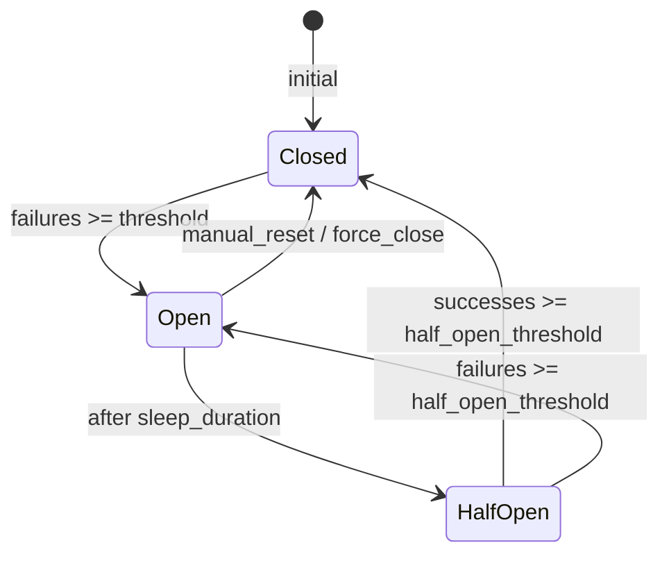

# Day 14: Reference Document — Timeout Budget Mathematical Model, Retry Strategies, Circuit Breaker & Envoy Comparison

---

## 1. Timeout Budget — Mathematical Model

### 1.1 Deadline Chain Formalization

Timeout budget là một **deadline chain** — mỗi tầng có một budget riêng, và budget này phải nhỏ hơn tổng budget còn lại ở tầng ngoài:

```
D_client   = T_max chờ (VD: 30s)
D_edge     = D_client  - δ_edge     (δ_edge = edge processing time)
D_gateway  = D_edge    - δ_gateway   (δ_gateway = Kong Lua/plugin overhead)
D_upstream = D_gateway - δ_upstream  (δ_upstream = upstream processing budget)
D_db       = D_upstream - δ_app      (δ_app = application processing)
```

**Constraint bắt buộc:**

```
D_upstream < D_gateway < D_edge < D_client
D_db       < D_upstream
```

### 1.2 Retry Budget Equation

```
Total time với N retries:
T_total = T_req
        + Σ (T_backoff[i] + T_req)   for i = 1 to N
        where T_backoff[i] = min(cap, base × 2^i × jitter)

Constraint: T_total < D_gateway (deadline còn lại khi request đến gateway)

Tổng quát:
T_total = (N + 1) × T_req + Σ T_backoff[i]
```

**Ví dụ tính toán:**

```
Scenario: Public API với T_client = 30s

Edge overhead (Nginx):     5s   → D_edge = 25s
Kong overhead (Lua/plugin): 2s  → D_gateway = 23s
Upstream logic:             5s  → D_upstream = 18s
DB:                         3s  → D_db = 3s

Retry budget:
- Upstream p95 = 200ms
- retries = 2
- backoff = full jitter với base = 100ms, cap = 2s

T_backoff = random(0, 200ms) + random(0, 400ms) = max ~600ms
T_total = 3 × 200ms + 600ms = 1.2s << 18s → AN TOÀN ✓

Bad scenario (retry không có cap):
- retries = 10, base = 1000ms
- T_backoff = 1000 + 2000 + 4000 + ... = 1023000ms = 1023s >> 18s → SAI
```

### 1.3 Deadline Propagation via HTTP Header

**`X-Request-Deadline` header format:**

```
X-Request-Deadline: <absolute_timestamp_ms>
Hoặc:
X-Request-Deadline: <remaining_ms>
```

**Nginx edge — tính và propagate deadline:**

```nginx
# Lấy deadline từ client hoặc tính mặc định
map $http_x_request_deadline $effective_deadline {
    default   "30000";           # 30s default
    ""        "30000";
    ~^[0-9]+$ $http_x_request_deadline;
}

# Trừ edge overhead (5s)
# Kong deadline = client_deadline - 5000ms
set $kong_deadline $effective_deadline;
if ($effective_deadline != "30000") {
    set $kong_deadline $effective_deadline;  # Client gửi deadline cụ thể
}

# Nếu muốn tự động trừ overhead:
# set $kong_deadline 25000;  # 30s - 5s edge overhead

location /api/ {
    proxy_set_header X-Request-Deadline $effective_deadline;
    proxy_read_timeout 20s;   # D_edge
}
```

**Kong Lua — đọc và respect deadline:**

```lua
-- kong/plugins/header-propagate/handler.lua
local header_propagate = {}

function header_propagate:access(conf)
    local kong = kong
    local deadline = kong.request.get_header("X-Request-Deadline")

    if deadline then
        kong.ctx.shared.request_deadline = tonumber(deadline)
    end

    -- Thêm header để upstream biết còn bao lâu
    kong.service.request.set_header(
        "X-Request-Deadline",
        deadline or os.date("%s") * 1000 + 30000
    )
end

return header_propagate
```

---

## 2. Retry Strategy — Deep Dive

### 2.1 Exponential Backoff Formula

**Base exponential backoff:**
```
delay[i] = min(cap, base × 2^i)
```

| attempt | base=1s, cap=30s | base=100ms, cap=2s |
|---|---|---|
| 0 | 1s | 100ms |
| 1 | 2s | 200ms |
| 2 | 4s | 400ms |
| 3 | 8s | 800ms |
| 4 | 16s | 1600ms |
| 5 | 30s (capped) | 2s (capped) |
| **Tổng** | **61s** | **5s** |

**Full Jitter (Marc Brooker recommendation):**
```
delay[i] = random(0, min(cap, base × 2^i))

Average delay với full jitter = half của exponential
→ Tổng thời gian giảm đáng kể so với pure exponential
→ Tránh thundering herd tốt nhất
```

**Equal Jitter:**
```
delay[i] = base_delay / 2 + random(0, base_delay / 2)
where base_delay = min(cap, base × 2^i)

Đảm bảo minimum delay = base_delay / 2 (không bao giờ quá nhanh)
```

**Decorrelated Jitter (AWS architecture):**
```
sleep[i] = random(base, previous_sleep × 3)

Ưu điểm: adapt tốt khi nhiều client cùng retry cùng lúc
Nhược điểm: first attempt delay có thể lớn (nếu previous_sleep lớn)
```

### 2.2 Retry Storm & Thundering Herd

**Retry storm** = nhiều client retry cùng lúc sau một sự kiện failure, gây load spike gấp N lần.

```
Normal: 1000 req/s → upstream xử lý 1000 req/s

t=0s:   Upstream chậm 2s (DB slow)
t=2s:   1000 request timeout
t=2-4s: 1000 client retry → upstream nhận 2000 request
t=4s:   2000 retry tiếp → upstream nhận 4000 request
t=6s:   Upstream overload hoàn toàn
```

**Thundering herd** = khi nhiều request đợi cùng một resource (VD: 1 backend), và resource recover → tất cả đổ vào cùng lúc.

```
t=30s:  Backend recover (đã down 30s)
t=30s:  Passive HC probe = OK → backend marked healthy
t=30s:  500 request đang đợi → ALL gửi đến backend cùng lúc
t=30-31s: Backend overload lại vì 500 concurrent request
```

**Giải pháp retry storm:**

| Giải pháp | Mechanism | Trade-off |
|---|---|---|
| Retry budget (Google SRE) | Extra request ≤ 10% total | Giới hạn retry, có thể miss valid retry |
| Circuit breaker | Reject ngay khi open, không retry | Request bị fail ngay thay vì retry |
| Jitter | Randomize retry time | Đơn giản, hiệu quả cao |
| Token bucket (client) | Client có budget retry | Client phải implement, không control ở gateway |
| Exponential backoff + cap | Delay tăng theo attempt, có cap | Đơn giản, khuyến nghị |

### 2.3 Idempotency-Key Pattern

```bash
# Client gửi POST với idempotency-key
curl -X POST https://api.example.com/orders \
  -H "Idempotency-Key: order-$(uuidgen)-$(date +%s)" \
  -H "Content-Type: application/json" \
  -d '{"amount": 1000, "currency": "USD"}'

# Backend behavior:
# 1. Check: Idempotency-Key đã tồn tại?
#    → Có: Trả response cũ (đã cached)
#    → Không: Xử lý, cache response với key, trả response
```

```sql
-- PostgreSQL — idempotency table
CREATE TABLE idempotency_keys (
    key         VARCHAR(64) PRIMARY KEY,
    request_hash VARCHAR(64) NOT NULL,  -- Hash của request body
    response    JSONB,
    created_at  TIMESTAMPTZ DEFAULT NOW(),
    expires_at  TIMESTAMPTZ DEFAULT NOW() + INTERVAL '24 hours'
);

CREATE INDEX ON idempotency_keys (expires_at);
-- Cleanup expired key định kỳ
DELETE FROM idempotency_keys WHERE expires_at < NOW();
```

---

## 3. Circuit Breaker State Machine

### 3.1 State Machine — Formal Definition



**State transition parameters:**

| Parameter | Default | Ý nghĩa |
|---|---|---|
| `failure_threshold` | 50% | Mở CB khi error rate > 50% |
| `volume_threshold` | 20 | Tối thiểu request để đếm error rate |
| `sleep_duration` | 60s | Thời gian CB open trước khi half-open |
| `half_open_requests` | 3 | Số request thử trong half-open |
| `success_threshold` | 2 | Số success để đóng CB từ half-open |

### 3.2 Circuit Breaker Implementations Comparison

| Implementation | CB Level | Config | Backoff | Half-open | Observability |
|---|---|---|---|---|---|
| **Netflix Hystrix** | Command | Hystrix config | ✓ (Hystrix timer) | ✓ | Dashboard, events |
| **Polly (.NET)** | Policy per call | Code | ✓ (built-in) | ✓ | Custom |
| **Sentinel (Alibaba)** | Resource | Dashboard/code | ✓ | ✓ | Dashboard, metrics |
| **Envoy outlier detection** | Host/target | xds | ✓ (ejection algorithm) | ✓ (auto eject/uneject) | stats |
| **Envoy CB filter** | Route | xds | ✓ | ✓ | stats |
| **Kong passive HC (OSS)** | Target | kong.yml | ✓ (fail_timeout) | ✓ (auto) | Health API |
| **Kong CB plugin (Enterprise)** | Route/Service | kong.yml | ✓ (sleep_duration) | ✓ | Prometheus |

### 3.3 Envoy Outlier Detection vs Kong Passive HC

**Envoy outlier detection** (Istio/service mesh):

```yaml
# Envoy CDS — outlier detection trên cluster
clusters:
  - name: payment-cluster
    type: STRICT_DNS
    health_checks:
      - timeout: 5s
        interval: 10s
        unhealthy_threshold: 3
        healthy_threshold: 2
    outlier_detection:
      # Ejection algorithm: mở CB khi:
      consecutive_gateway_failures: 5   # 5xx từ upstream
      consecutive_5xx: 5
      consecutive_local_origin_failure: 3
      # CB mở trong:
      base_ejection_time: 30s           # = base × ejection_number
      max_ejection_percent: 50           # Tối đa 50% host bị eject
      # Recovery:
      success_rate_minimum_hosts: 3      # Cần ≥3 host mới tính success rate
```

**Envoy circuit breaker filter:**

```yaml
# Envoy route CB
routes:
  - match: { prefix: /api/payment }
    route:
      retry_policy:
        retry_on: "5xx,reset,connect-failure"
        num_retries: 2
        per_try_timeout: 3s              # Timeout per retry attempt
        retry_back_off:
          base_interval: 1s
          max_interval: 10s
      rate_limits:
        - stage: 1
          limit:
            id: request_limit
```

**Kong passive health check (equivalent):**

```yaml
# Kong upstream — passive health check
upstreams:
  - name: payment-upstream
    healthchecks:
      passive:
        healthy:
          http_statuses: [200, 201, 204]
          successes: 2           # 2 lần OK → healthy
        unhealthy:
          http_failures: 5      # 5 lần 5xx → unhealthy target
          tcp_failures: 3       # 3 lần TCP error → unhealthy
          timeouts: 3           # 3 lần timeout → unhealthy
          interval: 0           # 0 = không có active probe
```

**So sánh:**

| Aspect | Envoy outlier detection | Kong passive HC |
|---|---|---|
| Unit | Per-host (IP) | Per-target (host:port) |
| Ejection | Network-level (host bị skip hoàn toàn) | Target bị mark unhealthy |
| Error types | 5xx, TCP failure, timeout | TCP failure, timeout, HTTP failures |
| Recovery | Automatic (base_ejection_time) | Automatic (fail_timeout) |
| Config complexity | Cao (xDS) | Thấp (kong.yml) |
| Visibility | stats + Jaeger | Admin API health endpoint |

---

## 4. Little's Law & Backpressure

### 4.1 Little's Law Formula

```
L = λ × W

L = Số request đang xử lý (in-flight, concurrency)
λ = Throughput (arrival rate, req/s)
W = Thời gian xử lý trung bình (latency, s)
```

**Ứng dụng cho capacity planning:**

```
Ví dụ:
- Kong xử lý 5000 req/s
- Upstream latency p95 = 200ms
- Concurrency = 5000 × 0.2s = 1000 connections

→ Kong worker_connections phải ≥ 1000 × safety_factor (2) = 2000
→ upstream keepalive ≥ 1000 / worker_count = 250 mỗi worker
```

### 4.2 Backpressure Scenarios

**Scenario 1: Slow upstream → memory growth**

```
Normal: Kong receives 1000 req/s, forward to upstream, upstream p99 = 100ms
→ In-flight: 1000 × 0.1 = 100 requests
→ Memory per request: ~10KB → 1MB buffer

Slow: Upstream p99 = 10s (DB lock)
→ In-flight: 1000 × 10 = 10.000 requests
→ Memory: 10.000 × 10KB = 100MB per Kong worker
→ worker_connections exhausted → request queuing
→ proxy_buffer_size filled → 504
```

**Scenario 2: Upstream keepalive exhaustion**

```
upstream keepalive 32 (default) + retries 5
→ 1 connection handle 1 request + 5 retry = 6 requests
→ 32 connections = 32 × 6 = 192 requests/s throughput
→ Nếu traffic = 1000 req/s → 808 request bị reject/queued
```

### 4.3 Kong Backpressure Config

```yaml
# kong.yml — backpressure mitigation
services:
  - name: heavy-service
    url: http://heavy-upstream
    retries: 0                    # Tắt retry → giảm connection usage
    connect_timeout: 2000
    write_timeout: 3000
    read_timeout: 5000

upstreams:
  - name: heavy-upstream
    slots: 100                   # Load balancer slots
    healthchecks:
      active:
        healthy:
          interval: 10           # Active probe mỗi 10s
          successes: 1
        unhealthy:
          interval: 5            # Probe nhanh hơn khi unhealthy
          http_failures: 2

plugins:
  - name: proxy-cache           # Cache → giảm upstream load
    config:
      response_code: [200]
      request_method: [GET]
      cache_ttl: 30

  - name: rate-limiting          # Rate limit → giới hạn concurrency
    config:
      second: 100                 # 100 req/s per consumer
      policy: local              # In-memory, không tốn upstream resource
```

---

## 5. Kong Enterprise Circuit Breaker Plugin — Full Config

```yaml
# kong.yml — Kong Enterprise circuit breaker
_format_version: "3.0"
_transform: true

services:
  - name: payment-service
    url: http://payment-upstream
    plugins:
      - name: circuit-breaker
        # Bật circuit breaker ở service level
        config:
          # Thresholds — CB mở khi:
          error_rate_threshold: 0.5          # Error rate > 50%
          volume_threshold: 20               # Ít nhất 20 request
          interval: 10                        # Trong 10 giây window

          # Recovery
          sleep_duration: 30                  # CB open trong 30s

          # Half-open
          half_open_requests: 5               # Cho 5 request thử

          # Status code trigger
          status_codes:
            - 500
            - 502
            - 503
            - 504
            - 408

          # Tags để filter
          tags: [production, payment]
```

**Kong OSS workaround — pre-function CB:**

```lua
-- kong/plugins/custom-circuit-breaker/handler.lua
-- WARNING: Prototype only — không production-grade

local cb = {
  PRIORITY = 1000,  -- Chạy sớm trong access phase
}

local state = "closed"  -- closed | open | half_open
local failures = 0
local successes = 0
local window_start = ngx.now()

local FAILURE_THRESHOLD = 5
local SUCCESS_THRESHOLD = 2
local WINDOW_SIZE = 10  -- seconds
local HALF_OPEN_MAX = 3
local half_open_count = 0

local function reset_window()
  window_start = ngx.now()
  failures = 0
  successes = 0
end

function cb:access(conf)
  local now = ngx.now()

  -- Reset window nếu hết thời gian
  if now - window_start >= WINDOW_SIZE then
    reset_window()
  end

  -- State machine
  if state == "open" then
    kong.response.exit(503, { error = "Circuit breaker open" })
    return
  end

  if state == "half_open" then
    half_open_count = half_open_count + 1
    if half_open_count > HALF_OPEN_MAX then
      kong.response.exit(503, { error = "Circuit breaker half-open limit" })
      return
    end
  end

  -- Gắn header để log phase kết thúc
  kong.service.request.set_header("X-CB-State", state)
end

function cb:header_filter(conf)
  local status = kong.response.get_status()

  if state == "half_open" then
    if status >= 200 and status < 300 then
      successes = successes + 1
      if successes >= SUCCESS_THRESHOLD then
        state = "closed"
        half_open_count = 0
        reset_window()
        kong.log("Circuit breaker CLOSED from half-open")
      end
    else
      state = "open"
      half_open_count = 0
      kong.log("Circuit breaker OPEN from half-open")
    end
    return
  end

  if status >= 500 then
    failures = failures + 1
    if failures >= FAILURE_THRESHOLD then
      state = "open"
      kong.log.err("Circuit breaker OPEN: failures=", failures)
    end
  end
end

return cb
```

---

## 6. Comparison: Kong Retry Policy vs Envoy Retry Policy

### 6.1 Retry Configuration Comparison

| Aspect | Kong Service | Envoy retry_policy |
|---|---|---|
| Retry count | `retries: N` | `num_retries: N` |
| Retry trigger | Connection error, timeout | 5xx, reset, connect-failure, gateway-error |
| Per-try timeout | Không có built-in | `per_try_timeout: 3s` |
| Backoff | Không (immediate) | `retry_back_off.base_interval` |
| Jitter | Không | Partial (via backoff) |
| Selective retry | KHÔNG (retry all non-healthy) | Selective by status code |
| Header | Không | `x-envoy-retry-grpc-on`, `x-envoy-retry-on` |
| Priority | Route/Service | Route/Cluster |

### 6.2 Envoy Retry with Per-try Timeout

```yaml
# Envoy route — retry với per-try timeout
routes:
  - match: { prefix: /api/v1/products }
    route:
      retry_policy:
        retry_on: "5xx,gateway-error,connect-failure,reset"
        num_retries: 2
        per_try_timeout: 3s           # ⚡ Quan trọng: mỗi retry có timeout riêng
        retry_back_off:
          base_interval: 1s
          max_interval: 5s
      timeout: 10s                   # Total timeout cho request + retries
```

**Tại sao per-try timeout quan trọng:**

```
Without per_try_timeout:
- Request: 10s (upstream slow)
- Retry 1: 10s
- Retry 2: 10s
- Total: 30s

With per_try_timeout: 3s
- Request: 3s → timeout → retry
- Retry 1: 3s → timeout → retry
- Retry 2: 3s → timeout → fail
- Total: 9s (tiết kiệm 21s!)
```

### 6.3 Envoy Outlier Detection — Advanced Config

```yaml
# Envoy CDS — cluster với outlier detection đầy đủ
clusters:
  - name: payment-cluster
    type: STRICT_DNS
    connect_timeout: 2s
    health_checks:
      - timeout: 3s
        interval: 10s
        unhealthy_threshold: 3
        healthy_threshold: 1
        http_health_check:
          path: /health
          expected_status: [200]

    outlier_detection:
      # Ejection criteria
      consecutive_5xx: 5
      consecutive_gateway_errors: 3
      consecutive_local_origin_failure: 3

      # Ejection duration
      base_ejection_time: 30s
      max_ejection_percent: 50     # Tối đa 50% host bị eject

      # Success rate based (%)
      success_rate_minimum_hosts: 3
      success_rate_request_volume: 100
      success_rate_stdev_factor: 100  # = mean - 1.0 * stdev

      # Interval
      split_external_local_origin_errors: true
      enforcing_local_origin_error_rate: 50   # Eject 50% khi local origin error cao
```

---

## 7. Kong Proxy-Cache & Pre-function Plugin — Custom Logic

### 7.1 proxy-cache Plugin — Full Config

```yaml
# kong.yml — proxy-cache với conditional cache
plugins:
  - name: proxy-cache
    config:
      response_code: [200]
      request_method: [GET, HEAD]
      content_type: ["application/json", "application/xml"]
      # Cache key = method + url + headers
      cache_ttl: 300              # 5 phút default
      strategy: memory            # memory | redis
      # Memory: ~100MB LRU cache
      # Redis: distributed cache, cần Redis cluster
      vary_query_params:         # Vary theo query param
        - page
        - limit
        - sort

services:
  - name: catalog-service
    url: http://catalog-upstream
    plugins:
      - name: proxy-cache
        config:
          response_code: [200]
          request_method: [GET]
          cache_ttl: 60            # 1 phút cho catalog (thay đổi thường xuyên)
          # Cache key KHÔNG include auth header
          cache_key:
            - ngx.var.request_method
            - ngx.var.request_uri
          # Only cache when backend healthy
          conditions:
            - name: healthy_status
              value: "true"
```

### 7.2 pre-function / post-function — Custom Retry Logic

```yaml
# kong.yml — custom Lua function để log retry attempt
services:
  - name: order-service
    url: http://order-upstream
    plugins:
      # pre-function: chạy TRƯỚC request được forward
      - name: pre-function
        config:
          access:
            - |
              kong.log("Incoming request: ", kong.request.get_method(),
                       " ", kong.request.get_path())
              kong.ctx.shared.retry_count = 0
              kong.ctx.shared.request_start = ngx.now()
          header_filter:
            - |
              local start = kong.ctx.shared.request_start
              if start then
                local latency = (ngx.now() - start) * 1000
                kong.response.set_header("X-Request-Duration-Ms",
                                         string.format("%.2f", latency))
              end
          balancer:
            - |
              -- Chạy mỗi khi Kong chọn target
              kong.log("Target selected for retry")

      # post-function: chạy SAU response
      - name: post-function
        config:
          header_filter:
            - |
              local retries = kong.ctx.shared.retry_count or 0
              kong.response.set_header("X-Retry-Count", retries)
```

---

## 8. EWMA Latency Tracking (Advanced)

### 8.1 EWMA Formula

Exponentially Weighted Moving Average cho latency tracking:

```
EWMA[i] = α × latency[i] + (1 - α) × EWMA[i-1]

Trong đó α = 2 / (N + 1)  (N = window size, thường dùng 100)

EWMA có trọng số giảm dần theo thời gian
→ Phản ánh recent trend tốt hơn simple average
→ Dùng để phát hiện latency degradation
```

### 8.2 EWMA-based Adaptive Timeout

```lua
-- Custom Lua: adaptive timeout dựa trên EWMA latency
-- kong/plugins/adaptive-timeout/handler.lua

local adaptive_timeout = {}

adaptive_timeout.PRIORITY = 950

local ewma_latency = {}      -- Per-service EWMA
local ALPHA = 0.3             -- Smoothing factor (cao = responsive)

function adaptive_timeout:access(conf)
  local service = kong.service.entity
  local service_name = service and service.name or "default"

  -- Get EWMA hiện tại
  local current_ewma = ewma_latency[service_name] or conf.default_timeout

  -- Timeout = EWMA × multiplier (padded)
  local adaptive_timeout_ms = math.ceil(current_ewma * conf.latency_multiplier)
  adaptive_timeout_ms = math.min(
    adaptive_timeout_ms,
    conf.max_timeout
  )

  kong.service.request.set_timeout(adaptive_timeout_ms)
end

function adaptive_timeout:log(conf)
  local latency = kong.service.response.get_latency()
  if not latency then return end

  local service = kong.service.entity
  local service_name = service and service.name or "default"

  -- Update EWMA
  local prev = ewma_latency[service_name] or latency
  ewma_latency[service_name] = ALPHA * latency + (1 - ALPHA) * prev

  kong.log("EWMA latency for ", service_name, ": ",
            math.floor(ewma_latency[service_name]), "ms")
end

return adaptive_timeout
```

---

## 9. Production Monitoring Checklist

### 9.1 Retry Metrics

```bash
# Kong access log — parse retry pattern
# Format: $remote_addr - $remote_user [$time_local] "$request"
# Retry: 2 request cùng request_uri trong < 5s window

# Prometheus alert cho retry storm
- alert: KongRetryBudgetExceeded
  expr: |
    (
      sum(rate(gateway_upstream_retry_total[5m])) /
      sum(rate(kong_http_requests_total[5m]))
    ) > 0.15
  annotations:
    summary: "Retry budget exceeded: {{ $value | humanizePercentage }}"
    description: "Retry rate > 15% — possible upstream degradation"
```

`gateway_upstream_retry_total` là metric tự instrument từ access log hoặc custom Lua. Kong OSS không expose retry counter mặc định.

### 9.2 Circuit Breaker Metrics

```bash
# Passive health check — target unhealthy count
- alert: KongTargetsUnhealthy
  expr: |
    sum by (upstream_name) (
      kong_upstream_target_health{healthcheck="passive"} == 0
    ) > 0
  annotations:
    summary: "{{ $labels.upstream_name }} has unhealthy targets"
    description: "Targets: {{ $value }} are unhealthy"

# EWMA latency spike
- alert: KongLatencySpike
  expr: |
    histogram_quantile(0.99,
      sum(rate(kong_upstream_latency_seconds_bucket[5m])) by (le, service)
    ) > 3
  annotations:
    summary: "Upstream latency p99 > 3s for {{ $labels.service }}"
```

### 9.3 Concurrency & Backpressure Metrics

```bash
# worker_connections exhaustion warning
- alert: KongWorkerConnectionsHigh
  expr: |
    kong_nginx_http_current_connections{state="writing"} /
    kong_nginx_http_connections_limit > 0.7
  annotations:
    summary: "Kong worker connections > 70% limit"
    description: "Risk of connection exhaustion — check upstream health"
```
