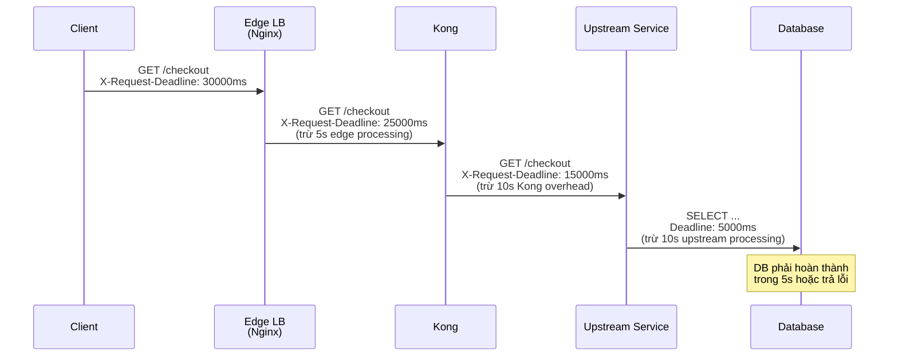
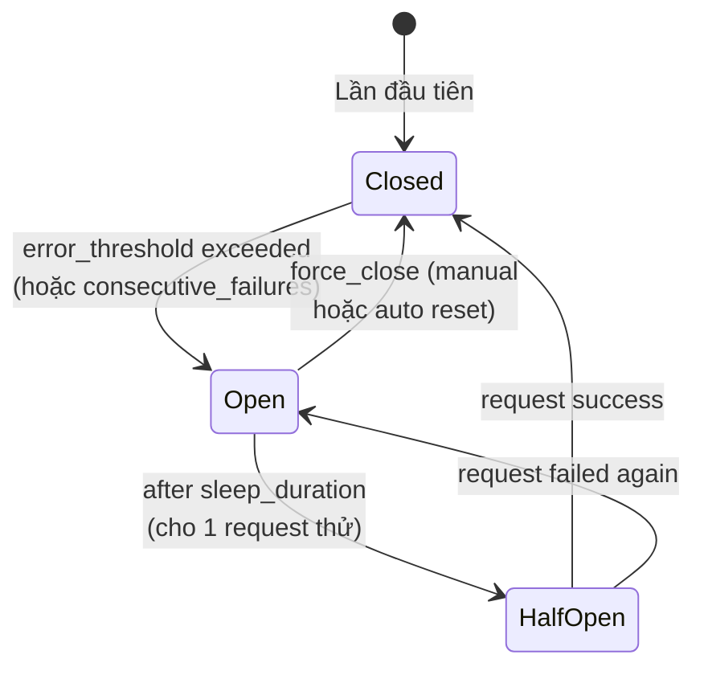
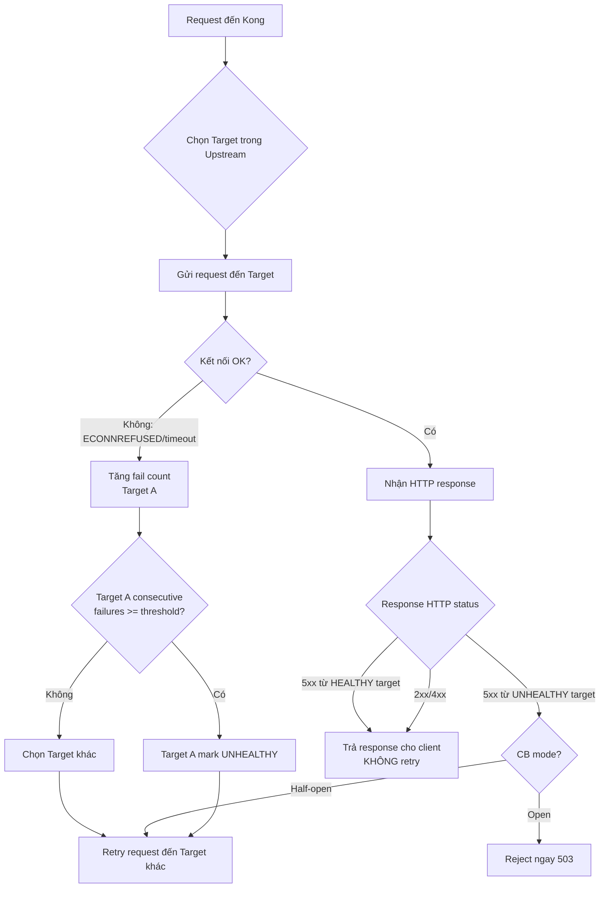

# Day 14: Timeout, Retry, Circuit Breaker & Backpressure

> **Thời lượng**: 2 giờ
> **Độ khó**: ⭐⭐⭐⭐
> **Prerequisites**: Day 4 (Health Check, Failover & Upstream Failure), Day 9 (Kong Core Entities), Day 13 (Kong Upstream Load Balancing & Health Checks)

---

## 1. Learning Objectives

Sau bài này, bạn sẽ có thể:

- Design timeout budget chính xác theo nguyên tắc `T_client > T_edge > T_gateway > T_upstream > T_db` và propagate deadline qua `X-Request-Deadline` header
- Configure retry an toàn trong Kong: chỉ retry idempotent request, giới hạn retries bằng `retries` field và exponential backoff với jitter, tránh retry storm
- Identify và mô phỏng retry storm: khi nào nó xảy ra, cách phát hiện qua metric/log, và cách phòng tránh bằng retry budget và circuit breaker
- Design circuit breaker strategy: passive health check (Day 13) là circuit breaker ở mức target, plugin enterprise `circuit-breaker`, so sánh với Envoy/Istio approach
- Debug cascading failure: trace latency qua `X-Kong-Proxy-Latency` và `X-Kong-Upstream-Latency`, phân biệt 504 do slow upstream vs deadline expired

---

## 2. The Problem

> **Scenario thực tế — Black Friday 14:00**: Hệ thống thanh toán của bạn xử lý 5000 đơn/giây. payment-service bắt đầu trả 504 vì DB query chậm bất thường (index bị missing sau migration). Kong upstream timeout mặc định là 60 giây, retries mặc định là 5. Kong retry mỗi request tới 5 lần → load thực tế lên payment-service tăng 6× (1 gốc + 5 retry). payment-service hoàn toàn down sau 2 phút → toàn bộ checkout chết.
>
> Postmortem timeline:
> - `T+0s`: DB query chạy 8 giây (bình thường < 50ms)
> - `T+0–8s`: payment-service trả 504 cho request đầu tiên
> - `T+8s`: Kong retry lần 1 → DB queue tăng thêm 1 request
> - `T+16s–40s`: 5 retry × 8s = 40 giây backlog tích lũy
> - `T+48s`: payment-service OOM, restart, queue bị drop
> - `T+60s`: Kong upstream timeout, trả 504 cho tất cả
> - Tổng: ~60 giây outage, ~30.000 đơn thất bại
>
> **Root cause**: Timeout cấp cao hơn không inversely proportional (`client 30s < Kong upstream 60s`), retry không idempotent (POST), retries=5 quá nhiều, không có circuit breaker ở route/service level.

**Pain points:**

- Kong `retries` mặc định = 5 — developer không biết trừ khi đọc kỹ docs
- Kong retry trên **connection error/timeout** ( không phải HTTP 5xx từ healthy upstream) — behavior khác Nginx `proxy_next_upstream`
- Passive health check (Day 13) chỉ mark target unhealthy, không reject request ngay khi target slow
- Không có per-route circuit breaker trong Kong OSS — chỉ có plugin enterprise hoặc custom Lua
- Retry budget (Google SRE: ~10% extra request) không được monitor → retry storm không bị phát hiện

**Hậu quả nếu thiết kế sai:**

- Client timeout (30s) < Kong timeout (60s) → client đã ngắt kết nối, Kong vẫn chờ → resource leak
- Gateway timeout > Client timeout → "zombie request" tiêu tốn tài nguyên vô ích
- Retries = 5 với backoff 1s/2s/4s/8s/16s = 31s + actual response = vượt client timeout trước khi retry xong
- Backend slow nhưng không error → passive health check không mark down → request cứ đổ vào → cascading failure
- POST retry không có idempotency-key → duplicate order/payment

---

## 3. Core Concepts

### 3.1 Timeout Budget

**Analogy**: Timeout budget giống như chuỗi cung ứng. Nếu khách hàng chờ tối đa 30 phút mà pizza mất 25 phút để làm xong, thì courier chỉ còn 5 phút để giao. Nếu restaurant timeout (làm mất 60 phút) > khách hàng timeout (30 phút), thì restaurant vẫn làm xong pizza nhưng khách đã bỏ đi rồi.

**Nguyên tắc bắt buộc:**

```
T_client  >  T_edge  >  T_gateway  >  T_upstream  >  T_db/cache
```

Mỗi tầng phải nhỏ hơn tầng ngoài (closer to client) để:
1. Client nhận response trước khi hết deadline
2. Gateway không hold connection/resource khi client đã timeout
3. Upstream không nhận request vô ích khi deadline đã hết

**Timeout Budget Formula:**

```
T_upstream + T_retry × N  ≤  T_gateway
T_gateway   + T_edge       ≤  T_client
```

Trong đó `T_retry` là thời gian mỗi lần retry (đã include backoff).

**Deadline propagation:**



**Public API recommended timeout budget:**

| Layer | Timeout | Lý do |
|---|---|---|
| Client (mobile/browser) | 30s | TCP keepalive, UX expectation |
| CDN/Edge LB | 25s | Processing overhead, TLS handshake |
| Nginx Edge | 20s | Proxy overhead, logging |
| Kong Gateway | 15s | Plugin chain, Lua processing |
| Upstream Service | 10s | Business logic |
| Database/Cache | 5s | Query execution |

**Header `X-Request-Deadline`** (optional propagation):

```nginx
# Nginx edge — propagate deadline
location /api/ {
    set $client_timeout "30000";   # ms
    set $edge_overhead   "5000";   # ms (Nginx processing)

    # Tính deadline còn lại khi forward sang Kong
    set $kong_deadline   $http_x_request_deadline;
    if ($http_x_request_deadline = "") {
        set $kong_deadline "25000";  # fallback nếu client không gửi
    }

    proxy_set_header X-Request-Deadline $kong_deadline;
    proxy_read_timeout 20s;
}
```

### 3.2 Retry Strategy

**Nguyên tắc retry an toàn:**

1. **Chỉ retry idempotent request**: GET, HEAD, PUT, DELETE — **KHÔNG** retry POST, PATCH
2. **Có retry budget**: Google SRE khuyến nghị ~10% extra request cho retry
3. **Exponential backoff + jitter**: tránh thundering herd
4. **Dừng sớm khi nhận 4xx**: chỉ retry 408 (Request Timeout) và 429 (Too Many Requests với `Retry-After`)

**Backoff + Jitter — 3 variants (Marc Brooker, AWS Blog):**

```
Base delay = min(cap, base × 2^attempt)

Full Jitter:      sleep = random(0, base_delay)
Equal Jitter:      sleep = base_delay/2 + random(0, base_delay/2)
Decorrelated:      sleep = random(base, previous_sleep × 3)
```

| Variant | Khi nào dùng | Trade-off |
|---|---|---|
| **Full Jitter (recommended)** | Hầu hết use case | Tốt nhất để tránh thundering herd |
| Equal Jitter | Khi muốn bounded minimum delay | Đảm bảo không quá nhanh |
| Decorrelated | High-contention system | Adapt tốt với varying load |

**Kong retry behavior — quan trọng cần hiểu rõ:**

Kong retry KHÔNG retry trên HTTP response code (4xx/5xx) từ upstream healthy. Kong retry khi:
- Connection error (ECONNREFUSED, ECONNRESET)
- Timeout (connect_timeout, write_timeout, read_timeout)
- HTTP status = 500, 502, 503 từ target **đang unhealthy** (via passive health check)

```yaml
# Kong Service — retry config
services:
  - name: order-service
    url: http://order-svc:3000
    retries: 2                    # Default: 5 — GIẢM!
    connect_timeout: 5000          # Default: 60000ms — QUÁ DÀI!
    write_timeout: 5000           # Default: 60000ms — QUÁ DÀI!
    read_timeout: 5000            # Default: 60000ms — QUÁ DÀI!
    routes:
      - name: order-route
        paths: ["/api/v1/orders"]
```

**Retry budget calculation:**

```
Ví dụ: T_client = 30s, T_upstream = 10s, N_retries = 2, backoff max = 3s
T_max = 10s (lần 1) + 3s (backoff 1) + 10s (lần 2) + 3s (backoff 2) + 10s (lần 3)
      = 36s > 30s → VƯỢT client timeout!

Fix: N_retries = 1, backoff max = 2s
T_max = 10s + 2s + 10s = 22s < 30s ✓
```

### 3.3 Circuit Breaker

**Analogy**: Circuit breaker (CB) giống như aptomat điện trong nhà. Khi dòng điện tăng đột ngột (quá nhiều request vào service yếu), aptomat ngắt ngay để tránh cháy nhà (cascading failure). Sau vài giây, nó thử bật lại — nếu điện ổn định thì CB đóng lại, nếu không thì nó ngắt lại.

**Circuit Breaker State Machine:**



| State | Behavior | Khi nào |
|---|---|---|
| **Closed** | Traffic bình thường, đếm lỗi | Service healthy |
| **Open** | Reject ngay lập tức, không gọi upstream | Lỗi vượt threshold |
| **Half-Open** | Cho 1 (hoặc N) request thử | Sau sleep_duration |

**Threshold types:**

```yaml
# Error rate-based (Netflix Hystrix style)
circuit_breaker:
  error_rate_threshold: 50%    # Mở CB khi error rate > 50%
  volume_threshold: 20        # Ít nhất 20 request mới đếm
  sleep_duration: 30s         # Thử lại sau 30s

# Consecutive failures (Kong passive health check — Day 13)
consecutive_failures: 3
fail_timeout: 10s
```

**Kong passive health check = Circuit Breaker ở target level:**

Trong Kong, passive health check (Day 13) hoạt động giống circuit breaker ở mức **target**:

```
Target A: max_unreachable = 3
→ Khi 3 request liên tiếp fail (timeout/connection error)
→ Target A bị mark unhealthy → không nhận traffic
→ Health check probe sau fail_timeout → thử lại
```

**Nhưng Kong OSS KHÔNG có per-route/service circuit breaker.** Plugin enterprise `circuit-breaker` bổ sung CB ở service/route level.

### 3.4 Backpressure

**Analogy**: Backpressure giống như ống nước bị thu nhỏ. Nếu bạn mở vòi max nhưng ống thoát nước nhỏ, nước sẽ tràn ra (buffer overflow, memory spike) hoặc vòi phải chờ (latency tăng). Gateway phải giới hạn concurrency để upstream không bị quá tải.

**Little's Law cho concurrency:**

```
Concurrent connections = Throughput (req/s) × Latency (s)

Ví dụ:
- Kong xử lý 1000 req/s
- Backend latency p99 = 2s
- Concurrent connections = 1000 × 2 = 2000 connections

Nếu upstream latency tăng lên 10s (DB slow):
- Concurrent connections = 1000 × 10 = 10.000 connections
→ Kong worker_connections (default 1024) bị exhausted
→ Nguy cơ: 504, OOM, crash
```

**Gateway backpressure mechanisms:**

```nginx
# Nginx — worker_connections là giới hạn
worker_connections 1024;   # Per worker — quá thấp cho high-throughput
keepalive_upstream 64;     # Keepalive pool size
proxy_http_version 1.1;    # Dùng keepalive thay vì mỗi request 1 connection
```

```yaml
# Kong — các nơi giới hạn concurrency
# Service level
services:
  - name: slow-service
    url: http://slow-svc:3000
    # Không có built-in concurrency limit trong Kong OSS
    # Phải dùng plugin bổ sung

# Plugin backpressure
plugins:
  - name: proxy-cache          # Cache response → giảm upstream load
    config:
      response_code: [200]
      request_method: [GET]
      cache_ttl: 60

  # Emergency shed traffic: chỉ bật thủ công trong incident,
  # không gắn enabled=true thường trực vào production route.
  - name: request-termination
    enabled: false
    config:
      status_code: 503
      message: "Service temporarily unavailable"
```

### 3.5 Little's Law & Latency Architecture

```
Throughput (req/s) = Concurrency (connections) / Latency (s/req)

→ Latency tăng 5× (từ 200ms → 1000ms)
→ Để giữ throughput 1000 req/s:
  Concurrency phải tăng 5× (từ 200 → 1000 connections)

→ Nếu concurrency bị giới hạn bởi worker_connections:
  Throughput thực tế giảm 5× → 200 req/s
```

---

## 4. How It Works Internally

### 4.1 Kong Service Timeout Fields

Kong Service entity có 3 timeout field (đều default = 60000ms — quá dài cho production):

```yaml
services:
  - name: payment-service
    url: http://payment-svc:3000

    # Thời gian chờ TCP handshake với upstream
    connect_timeout: 5000    # Default: 60000ms (60s!)

    # Thời gian chờ gửi request body đến upstream
    write_timeout: 5000      # Default: 60000ms

    # Thời gian chờ nhận response từ upstream
    read_timeout: 5000      # Default: 60000ms

    # Số lần retry khi upstream unreachable
    retries: 2               # Default: 5
```

**Kong timeout vs Nginx timeout:**

| Aspect | Kong Service | Nginx proxy_ |
|---|---|---|
| connect_timeout | `connect_timeout` | `proxy_connect_timeout` |
| write_timeout | `write_timeout` | `proxy_send_timeout` |
| read_timeout | `read_timeout` | `proxy_read_timeout` |
| Retry | `retries` field | `proxy_next_upstream` |
| Max retries default | 5 | Unlimited (0) |
| Retry on 5xx | KHÔNG (mặc định) | Có (configurable) |

**Khi nào Kong retry:**



**Quan trọng**: Kong retry KHÔNG xảy ra chỉ vì upstream trả 500. Chỉ retry khi:
1. Target bị mark unhealthy (passive health check)
2. Connection error / timeout
3. (Nếu dùng plugin retry nâng cao) Khi upstream trả 5xx và `retries` được cấu hình

### 4.2 Kong Retries Field — Clarification

`retries: 5` nghĩa là retry tối đa **5 lần ADDITIONAL** (tổng cộng 6 lần gọi: 1 lần gốc + 5 lần retry).

```bash
# Kong Admin API — xem retries của service
curl -s http://localhost:8001/services/payment-service | jq '.retries'
# Default: 5

# Xem timeout
curl -s http://localhost:8001/services/payment-service | jq '.connect_timeout, .read_timeout, .write_timeout'
# Default: 60000, 60000, 60000 (60 giây!)
```

**Đặc biệt quan trọng**: Kong retries KHÔNG có exponential backoff tích hợp (khác Envoy). Mỗi retry xảy ra ngay lập tức (hoặc chọn target tiếp theo). Backoff phải implement ở:
- Client (recommended)
- Custom Lua plugin (`pre-function`)
- Envoy sidecar (nếu dùng service mesh)

### 4.3 Passive Health Check = Target-level Circuit Breaker

Kong passive health check (Day 13) hoạt động như circuit breaker ở target level:

```yaml
# kong.yml — upstream với passive health check
upstreams:
  - name: payment-upstream
    healthchecks:
      passive:
        healthy:
          http_statuses: [200, 201, 202]
          interval: 0           # Không active probe
          successes: 3          # 3 lần thành công → healthy
        unhealthy:
          http_statuses: [500, 502, 503, 504]
          interval: 0
          # Khi upstream trả 5xx, Kong đánh dấu target unhealthy
          # Tuy nhiên — 5xx từ healthy upstream KHÔNG gây retry tự động
          # Chỉ connection error/timeout mới trigger target unhealthy
          tcp_failures: 3
          timeouts: 3
          http_failures: 3
    targets:
      - target: payment-svc-1:3000
        weight: 100
      - target: payment-svc-2:3000
        weight: 100
```

### 4.4 Plugin Circuit Breaker (Enterprise)

Plugin `kong-plugin-circuit-breaker` (Enterprise) cung cấp CB thực sự ở service/route level:

```yaml
# kong.yml — Kong Enterprise circuit breaker plugin
services:
  - name: payment-service
    url: http://payment-upstream
    plugins:
      - name: circuit-breaker
        config:
          # Mở CB khi error rate > 50% trong 10 giây
          error_rate_threshold: 0.5
          window_size: 10
          minimum_requests: 20
          # CB mở trong 30 giây
          sleep_duration: 30
          # Half-open: cho 5 request thử
          half_open_requests: 5
          # CB trên status code nào
          status_codes: [500, 502, 503, 504]
```

**Kong OSS workaround**: Dùng plugin `request-termination` kết hợp với `pre-function` để implement CB logic thủ công (không production-grade, chỉ prototype).

### 4.5 Observability: Metrics cho Retry & Circuit Breaker

```bash
# Kong Prometheus metrics — latency
kong_latency_bucket{type="proxy",service="payment"}[...]

# Kong Prometheus metrics — upstream latency
kong_upstream_latency_bucket{service="payment"}[...]

# Kong KHÔNG expose retry count metric mặc định
# Phải dùng custom Lua hoặc parse access log

# Log pattern cho retry (Kong access log)
# Retry không tạo log riêng — chỉ thấy 2 request trong log
# với cùng request ID nhưng target khác nhau

# Header để trace retry
# Kong thêm: X-Kong-Request-Start
# Không có retry count header mặc định
```

---

## 5. Hands-on Lab

Xem file `exercises.md` để thực hành 8 failure scenario với Docker Compose. Tóm tắt:

- **Lab 1**: Configure timeout budget — Kong Service timeouts + Nginx edge
- **Lab 2**: Mô phỏng slow upstream bằng backend với `sleep`
- **Lab 3**: Retry storm — bật retries=5 + slow upstream + benchmark
- **Lab 4**: Circuit breaker — passive health check trigger + observe
- **Lab 5**: Backpressure — worker_connections exhaustion + upstream slow
- **Lab 6**: Cascading failure — 1 backend slow → toàn upstream timeout
- **Lab 7**: Deadline propagation — `X-Request-Deadline` header
- **Lab 8**: Debug latency bằng Kong header metrics

**Lab architecture:**

```
┌──────────────────────────────────────────────────────────┐
│                    Docker Compose                         │
│                                                          │
│  wrk/hey ──► Kong ──► upstream (round-robin 3 targets)  │
│                │                                          │
│                ├── slow-backend:3000  (sleep 5s)         │
│                ├── normal-backend:3000 (sleep 100ms)      │
│                └── fail-backend:3000  (ECONNREFUSED)     │
│                                                          │
│  Prometheus ←─── Kong Prometheus plugin                  │
│                                                          │
└──────────────────────────────────────────────────────────┘
```

---

## 6. Trade-offs Analysis

### 6.1 Retry Strategies Comparison

| Strategy | Retry count | Backoff | Retry storm risk | Correctness | Khi nào dùng |
|---|---|---|---|---|---|
| No retry | 0 | — | Không | Tốt nhất cho mutation | POST, payment, order |
| Fixed retry (no backoff) | N | 0 | Rất cao | Trung bình | Không nên dùng |
| Exponential backoff | N | base × 2^n | Trung bình | Tốt | Legacy system |
| **Exponential + Full Jitter** | N | random(0, base×2^n) | Thấp | Tốt nhất | **Production recommended** |
| Exponential + Equal Jitter | N | base/2 + random | Thấp | Tốt | Khi cần minimum bound |
| Exponential + Decorrelated | N | random | Rất thấp | Tốt | High contention |
| CB trước, retry sau | N | + jitter | Thấp | Tốt nhất | Complex system |

### 6.2 Timeout Strategy Comparison

| Strategy | Description | Pros | Cons | Khi nào |
|---|---|---|---|---|
| Global default | Mọi route dùng chung timeout | Đơn giản | Không fit mọi service | Dev only |
| **Per-route fine-grained** | Mỗi service có timeout riêng | Chính xác, fit SLA | Config phức tạp hơn | **Production** |
| Adaptive timeout | Timeout = p95 latency × multiplier | Tự động fit workload | Khó debug, có thể too short | Advanced |
| Deadline propagation | Client gửi deadline, upstream respect | Rõ ràng, end-to-end | Cần client hỗ trợ | Modern API |

### 6.3 Circuit Breaker Location Comparison

| Location | Implementation | Pros | Cons |
|---|---|---|---|
| **Client** | SDK (Hystrix, Polly, Resilience4j) | Tự chủ, per-request granularity | Code pollution, inconsistency |
| **Gateway** | Kong passive HC / enterprise CB | Centralized, consistent | Kong OSS CB limited |
| **Sidecar mesh** | Envoy outlier detection, Istio | Declarative, per-service | Complexity cao, infra overhead |
| **Per-target ring** | Kong upstream (Day 13) | Target-level, built-in | Không per-route |

### 6.4 Hidden Costs & Anti-patterns

**Hidden cost 1: Retry budget không monitor**
- Retry storm không bị phát hiện nếu không monitor retry count
- Kong OSS không expose retry counter mặc định; cần custom log field/Lua instrumentation hoặc metric riêng như `gateway_upstream_retry_total`

**Hidden cost 2: Circuit breaker false-positive**
- Upstream slow nhưng không error → passive health check không mark down → CB không trigger
- Solution: Dùng p99 latency alert thay vì chỉ error rate

**Hidden cost 3: Exponential backoff mà không có cap**
- Base = 1s, retries = 10 → max delay = 1024s (17 phút!)
- Solution: Luôn có cap (thường 30–60 giây)

**Anti-pattern 1: Gateway timeout > Client timeout**
```
Client timeout = 30s
Kong read_timeout = 60s  ← Zombie request
```
→ Client ngắt kết nối sau 30s → Kong vẫn giữ connection upstream 30s tiếp → resource leak

**Anti-pattern 2: Retry POST không có idempotency-key**
```bash
# SAI: POST retry không idempotent
curl -X POST /api/orders -d '{"amount":1000}'
# → Retry 3 lần → 4 đơn được tạo!

# ĐÚNG: POST với idempotency-key
curl -X POST /api/orders \
  -H "Idempotency-Key: order-abc123-v1" \
  -d '{"amount":1000}'
```

**Anti-pattern 3: retries=5 với exponential backoff không cap**
```
Request tốn 10s + retry backoff 1s/2s/4s/8s/16s = 31s + 10s = 41s
Client timeout = 30s → Client đã timeout khi retry chưa xong!
```

---

## 7. Best Practices & Best Solution

### 7.1 Public API Production Configuration

```yaml
# kong.yml — production timeout/retry config
_format_version: "3.0"
_transform: true

services:
  # === READ-HEAVY SERVICE ===
  - name: catalog-service
    url: http://catalog-svc:3000
    connect_timeout: 3000   # 3s
    write_timeout: 3000
    read_timeout: 5000      # 5s
    retries: 2               # Idempotent GET → retry an toàn
    routes:
      - name: catalog-route
        paths: ["/api/v1/products"]
        methods: [GET, HEAD]
    plugins:
      - name: proxy-cache     # Cache GET → giảm upstream load
        config:
          response_code: [200]
          request_method: [GET]
          content_type: ["application/json"]
          cache_ttl: 60
          strategy: memory

  # === WRITE/MUTATION SERVICE ===
  - name: order-service
    url: http://order-svc:3001
    connect_timeout: 2000   # 2s — mutation ngắn hơn
    write_timeout: 3000
    read_timeout: 3000
    retries: 0               # POST không retry!
    routes:
      - name: order-route
        paths: ["/api/v1/orders"]
        methods: [POST, PUT, DELETE]
    plugins:
      # Chỉ bật bằng change/incident command khi cần shed traffic khẩn cấp.
      - name: request-termination
        enabled: false
        config:
          status_code: 503
          message: "Service unavailable"

upstreams:
  - name: catalog-upstream
    healthchecks:
      passive:
        healthy:
          successes: 2
        unhealthy:
          tcp_failures: 3
          timeouts: 3
          http_failures: 3
    slots: 100

  - name: order-upstream
    healthchecks:
      passive:
        healthy:
          successes: 2
        unhealthy:
          tcp_failures: 2    # Nhạy hơn cho payment
          timeouts: 2
          http_failures: 2
    slots: 100
```

### 7.2 Retry Best Practices

```
DO:
  ✓ Retry chỉ GET/HEAD/PUT/DELETE
  ✓ Retries ≤ 2 cho public API
  ✓ Retries = 0 cho POST/PATCH/mutation
  ✓ Exponential backoff với jitter
  ✓ Retry budget monitoring (extra request < 15%)
  ✓ Idempotency-Key header cho POST
  ✓ Retry chỉ trên connection error/timeout, KHÔNG trên 5xx từ healthy upstream

DON'T:
  ✗ Retry POST mà không có idempotency-key
  ✗ Retries > 3 mà không có circuit breaker trước
  ✗ Exponential backoff không có cap
  ✗ Retry khi client đã timeout (check deadline)
  ✗ Bật retries mặc định mà không hiểu upstream SL
```

### 7.3 Circuit Breaker Best Practices

```
DO:
  ✓ Passive health check (Day 13) là CB ở target level — enable luôn
  ✓ Threshold: consecutive_failures = 3–5, fail_timeout = 10–30s
  ✓ Alert khi passive HC đánh dấu target unhealthy (PagerDuty)
  ✓ Chuẩn bị plugin request-termination ở trạng thái disabled để bật thủ công khi cần shed traffic khẩn cấp
  ✓ Enterprise: bật circuit-breaker plugin cho payment/order service

DON'T:
  ✗ Tắt passive health check (để upstream down vĩnh viễn trong queue)
  ✗ max_unreachable quá cao (target chết nhưng không bị skip)
  ✗ max_unreachable = 1 (false positive khi network blip)
```

### 7.4 Backpressure Best Practices

```
DO:
  ✓ Tune worker_connections: (CPU_cores × 1000) / thread_concurrency
  ✓ Dùng upstream keepalive: keepalive 32–64 cho mỗi upstream
  ✓ Plugin proxy-cache cho GET-heavy service
  ✓ Alert khi active connections > 70% worker_connections limit
  ✓ Monitor upstream latency p95 → giảm throughput bằng rate limit

DON'T:
  ✗ worker_connections default 1024 cho high-throughput (>1000 req/s)
  ✗ Mỗi request mở 1 connection mới (dùng HTTP/1.1 keepalive)
  ✗ Không limit upstream concurrency → cascading failure khi DB slow
```

---

## 8. Performance Considerations

### 8.1 Cascading Failure Demo

**Scenario**: 1 backend trong 3 target chậm 5 giây (thay vì 100ms bình thường).

```
Normal state:
- 3 targets × 100ms = 1000 req/s với latency p99 = 300ms
- worker_connections = 1024 → đủ cho 1024/0.3 = 3413 concurrent

1 target slow (5s):
- Round-robin: 1/3 request → target slow (5s)
- Concurrency = 1000 req/s × 5s = 5000 connections
- worker_connections = 1024 → EXHAUSTED
- Request bị queue → timeout → retry → load × 2 → cascade

Timeline:
t=0s:   Target A bắt đầu chậm (DB lock)
t=0-5s: Request đến A chờ 5s, A không trả lời
t=5s:   Request đầu tiên timeout (Kong read_timeout = 5s)
t=5s:   Kong retry → chọn target B hoặc C
t=5s:   Retries=2 → 2 retry × 5s backlog = thêm 10s backlog
t=10s:  worker_connections exhausted (1024 × 2 vì retry)
t=15s:  Kong trả 504 cho tất cả request mới
```

### 8.2 Sample Latency — Before/After Timeout Tuning

| Config | p50 | p95 | p99 | Error rate | Ghi chú |
|---|---|---|---|---|---|
| Kong default (timeouts=60s, retries=5) | 120ms | 800ms | 5s | 0.5% | Slow target gây backlog |
| Tuned (timeouts=5s, retries=2) | 120ms | 300ms | 500ms | 0.8% | Fail nhanh, retry ít |
| Tuned + proxy-cache | 80ms | 200ms | 300ms | 0.1% | Cache giảm upstream load |
| Tuned + CB (enterprise) | 120ms | 280ms | 400ms | 0.2% | CB reject thay vì timeout |

> **Lưu ý**: số liệu chỉ dùng để tham khảo. Kết quả thực tế phụ thuộc hardware, kernel, network, payload, upstream behavior và plugin chain.

### 8.3 Benchmark Methodology

```bash
# Tool: hey (hoặc wrk)
# Scenario: Slow upstream simulation
# 1 backend normal (100ms), 1 backend slow (5s)

# Before tuning (retries=5, timeout=60s)
hey -z 30s -c 100 -m GET \
  -H "X-Request-Deadline: 30000" \
  http://localhost:8000/api/v1/products

# Sau khi tune (retries=2, timeout=5s)
# Latency p99 giảm từ 5s → 500ms
# Error rate tăng nhẹ (0.5% → 0.8%) nhưng
# Cascade failure được ngăn chặn
```

### 8.4 Retry Storm Detection

```bash
# Alert rule cho Prometheus
- alert: RetryStorm
  expr: |
    sum(rate(gateway_upstream_retry_total[5m])) /
    sum(rate(kong_http_requests_total[5m])) > 0.15
  # Retry > 15% của total request = retry storm
  for: 2m
  labels:
    severity: warning
  annotations:
    summary: "Retry storm detected — retry rate {{ $value | humanizePercentage }}"

# Latency spike khi upstream slow
- alert: UpstreamLatencySpike
  expr: |
    histogram_quantile(0.99,
      sum by (le) (rate(kong_upstream_latency_ms_bucket[5m]))
    ) / 1000 > 3
  # p99 > 3s → có thể upstream slow hoặc cascading
  for: 1m
```

---

## 9. Troubleshooting Checklist

### 9.1 Cascading Failure — Tất cả target unhealthy đột ngột

**Triệu chứng**: Kong trả 503, tất cả upstream đều down cùng lúc.

**Bước 1: Kiểm tra Kong error log**
```bash
docker logs kong 2>&1 | grep -E "timeout|ECONNREFUSED|unreachable"
```

**Bước 2: Kiểm tra timeout config**
```bash
# Kong Service timeout
curl -s http://localhost:8001/services/payment-service \
  | jq '.connect_timeout, .write_timeout, .read_timeout, .retries'
# Default: 60000, 60000, 60000, 5 → QUÁ DÀI!
```

**Bước 3: Kiểm tra upstream health**
```bash
curl -s http://localhost:8001/upstreams/payment-upstream/health \
  | jq '.data[] | {target, weight, healthy, ip}'
```

**Bước 4: Test trực tiếp từ Kong container**
```bash
docker exec kong curl -s -m 5 http://payment-svc:3000/health
# -m 5 = 5 giây timeout
```

### 9.2 Retry Storm — Load gấp N lần expected

**Triệu chứng**: Upstream load tăng gấp 3–6× dù traffic client không đổi.

**Bước 1: Xem retries field**
```bash
curl -s http://localhost:8001/services/payment-service | jq '.retries'
# 5 = default → quá nhiều
```

**Bước 2: Parse access log cho retry pattern**
```bash
# Tìm request cùng request ID nhưng target khác nhau
grep "X-Kong-Request-Start" /var/log/kong/access.log \
  | awk '{print $1, $NF}' | sort | uniq -c | sort -rn | head -20
```

**Bước 3: Giảm retries ngay lập tức**
```bash
# Qua Admin API (DB-less)
curl -X PATCH http://localhost:8001/services/payment-service \
  -d retries=0   # Tắt retry tạm thời

# Qua deck
# Sửa kong.yml: retries: 0
deck gateway sync kong.yml
```

### 9.3 Stuck Connection — worker_connections cao bất thường

**Triệu chứng**: Kong không accept connection mới, `curl` treo.

**Bước 1: Kiểm tra Kong process**
```bash
# Trong container
docker exec kong bash -c 'ulimit -n; cat /proc/$(cat /nginx_pid)/status \
  | grep -i conn'
```

**Bước 2: Kiểm tra upstream timeout**
```bash
# Xem service timeout có quá dài không
curl -s http://localhost:8001/services/payment-service \
  | jq '.read_timeout'
# 60000 = 60s → connection bị giữ 60s nếu upstream slow
```

**Bước 3: Giảm timeout**
```yaml
# kong.yml
services:
  - name: payment-service
    read_timeout: 5000   # 5s thay vì 60s
```

### 9.4 Latency p99 Cao Đều — Timeout Budget không Match

**Triệu chứng**: p99 latency cao nhưng p50/p95 bình thường.

**Bước 1: Đo từng layer**
```bash
# Kong header latency
curl -I -s http://localhost:8000/api/v1/products \
  | grep -i X-Kong
# X-Kong-Proxy-Latency: 5
# X-Kong-Upstream-Latency: 95

# Tổng = 5 + 95 = 100ms
# Nếu p99 upstream = 5000ms → timeout không match
```

**Bước 2: So sánh với upstream p99**
```bash
# Gọi trực tiếp upstream
curl -w "Time: %{time_total}s\n" -s http://payment-svc:3000/api/health
# So sánh với Kong
curl -w "Time: %{time_total}s\n" -s http://localhost:8000/api/v1/products
```

### 9.5 504 Đột Ngột — Upstream Slow hay Deadline đã Hết?

**Triệu chứng**: Request bị 504 nhưng upstream đôi khi vẫn trả lời.

**Bước 1: Check X-Kong-Upstream-Latency**
```bash
curl -s http://localhost:8000/api/v1/products \
  -w "\nUpstream-Latency: %{time_appconnect}s\n" \
  -D - | grep -i "X-Kong\|HTTP"
```

**Bước 2: Check deadline header**
```bash
# Nếu upstream latency > deadline:
# X-Kong-Upstream-Latency: 15000 (15s)
# X-Request-Deadline: 10000 (10s)
# → Deadline đã hết trước khi upstream trả lời
```

**Bước 3: Adjust deadline**
```nginx
# Nginx edge — tăng deadline cho specific endpoint
location /api/v1/reports {
    set $kong_deadline "60000";   # 60s cho report
    proxy_set_header X-Request-Deadline $kong_deadline;
}
```

### 9.6 Half-Open không Đóng — Passive HC Threshold Sai

**Triệu chứng**: Target bị mark unhealthy mãi, không recover.

**Bước 1: Check fail_timeout**
```bash
curl -s http://localhost:8001/upstreams/payment-upstream/health \
  | jq '.data[] | select(.healthy==false) | {target, port, passive_failures}'
```

**Bước 2: Giảm fail_timeout hoặc tăng successes threshold**
```yaml
# kong.yml
upstreams:
  - name: payment-upstream
    healthchecks:
      passive:
        unhealthy:
          timeouts: 3
          tcp_failures: 3
          http_failures: 3
      active:
        healthy:
          interval: 5    # Active probe mỗi 5s
          successes: 1  # 1 lần OK → healthy (nhanh hơn passive)
```

**Bước 3: Manual reset target health**
```bash
curl -X POST http://localhost:8001/upstreams/payment-upstream/targets/\
payment-svc-1:3000/healthy
```

---

## 10. Completion Checklist

Tự đánh giá sau khi hoàn thành Day 14:

- [ ] Giải thích được nguyên tắc Timeout Budget `T_client > T_edge > T_gateway > T_upstream > T_db` và tại sao violates gây zombie request
- [ ] Configure được Kong Service `connect_timeout`, `write_timeout`, `read_timeout` = 3000–5000ms (không phải 60000ms mặc định) và `retries` = 0 cho mutation, = 2 cho GET
- [ ] Phân biệt được khi nào Kong retry (connection error/timeout) và khi nào không retry (5xx từ healthy upstream)
- [ ] Mô phỏng được retry storm: bật retries=5 + slow upstream → load tăng 6× → phát hiện qua Prometheus `retry_rate > 15%`
- [ ] Thiết kế được circuit breaker strategy: passive health check (Day 13) là CB ở target level, plugin enterprise CB cho service level
- [ ] Calculate được concurrency theo Little's Law: `C = throughput × latency`, và biết khi nào dùng proxy-cache để giảm upstream load
- [ ] Debug được 504 bằng `X-Kong-Proxy-Latency` và `X-Kong-Upstream-Latency` header, phân biệt upstream slow vs deadline expired

---

## 11. References

- **Google SRE Book, Chapter "Handling Overload"**: Retry budget ~10%, deadline propagation
  <https://sre.google/sre-book/handling-overload/>
- **Marc Brooker, AWS Architecture Blog**: "Exponential Backoff and Jitter" — full jitter, equal jitter, decorrelated jitter
  <https://aws.amazon.com/builders-library/timeouts-retries-and-backoff-with-jitter/>
- **Netflix Tech Blog**: "Making the Netflix API More Resilient" — retry storm case study
  <https://netflixtechblog.com/making-the-netflix-api-more-resilient-a8ec62159c2d>
- **Martin Fowler**: "Circuit Breaker Pattern"
  <https://martinfowler.com/bliki/CircuitBreaker.html>
- **Hystrix Wiki**: Circuit breaker state machine, error percentage threshold
  <https://github.com/Netflix/Hystrix/wiki>
- **Polly (.NET)**: Resilience patterns — retry, circuit breaker, bulkhead, timeout
  <https://github.com/App-vNext/Polly>
- **Sam Newman, "Building Microservices"**, 2nd Edition: Timeout, retry, circuit breaker patterns
- **Kong Gateway Documentation**: Service timeouts, upstream health checks
  <https://docs.konghq.com/gateway/latest/reference/configuration/>
- **Envoy Proxy Documentation**: Retry policies, outlier detection, circuit breaker
  <https://www.envoyproxy.io/docs/envoy/latest/intro/arch_overview/circuit_breaking>

---

## Recap

Hôm nay bạn đã học:

- **Timeout Budget**: Từng tầng phải nhỏ hơn tầng ngoài, vi phạm → zombie request. Public API budget: 30s/25s/20s/15s/10s/5s
- **Kong timeout/retry**: `connect_timeout/write_timeout/read_timeout` default = 60s (QUÁ DÀI), `retries` default = 5 (QUÁ NHIỀU). Kong retry chỉ trên connection error/timeout, KHÔNG retry trên 5xx từ healthy upstream
- **Retry storm**: Khi retries=5 + upstream slow → load × 6. Detection: Prometheus retry_rate > 15%. Fix: giảm retries, thêm CB, giảm timeout
- **Circuit breaker**: Passive health check (Day 13) = CB ở target level. Kong OSS không có per-route CB. Enterprise có plugin `circuit-breaker`. Envoy có outlier detection
- **Backpressure**: Little's Law: `C = throughput × latency`. Concurrency tăng tuyến tính với latency → worker_connections exhaustion khi upstream slow
- **Observability**: Kong không expose retry count metric mặc định. Dùng `X-Kong-Proxy-Latency`, `X-Kong-Upstream-Latency` để debug latency spike

## Preview Day 15

**Day 15: Canary, Blue-Green & Gateway Config Rollback**

Ngày mai bạn sẽ học cách triển khai Canary deployment và Blue-Green deployment ở Gateway layer:
- Canary: dùng `weight` trong upstream targets để route % traffic sang version mới
- Blue-Green: switch toàn bộ traffic bằng cách đổi upstream URL hoặc DNS cutover
- Config rollback: dùng `deck gateway diff/sync` với backup file để rollback nhanh
- Feature flag: dùng Kong plugin `pre-function` để implement simple feature flag
- Traffic management: `X-Consumer-Groups` header để route theo consumer tier
