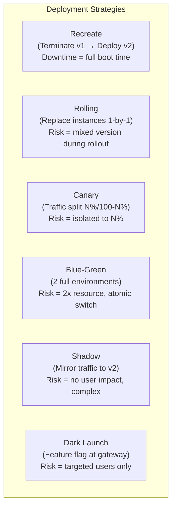
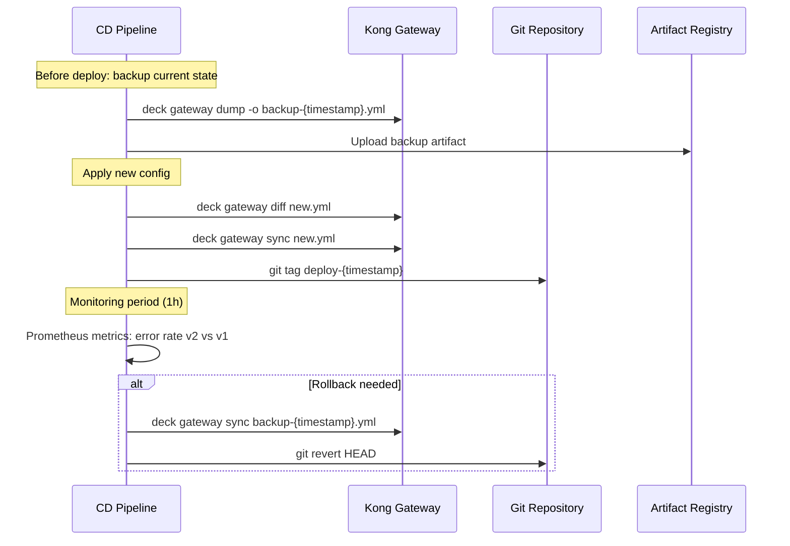

# Day 15: Canary, Blue-Green & Gateway Config Rollback

> **Thời lượng**: 2 giờ
> **Độ khó**: ⭐⭐⭐⭐
> **Prerequisites**: Day 9 (Route entity, plugin scope), Day 10 (decK declarative config, GitOps, rollback strategies), Day 13 (Upstream/Target weight)

---

## 1. Learning Objectives

Sau bài này, bạn sẽ có thể:

- Thiết kế canary deployment strategy phù hợp với business risk và traffic profile
- Implement canary bằng upstream target weight (Kong) và route-level header routing
- Triển khai blue-green deployment với 2 Kong cluster và atomic traffic switch
- Thực hiện gateway config rollback trong < 5 phút (RTO = 5 min, RPO = 0) bằng decK dump-before-sync
- Thiết kế feature flag at gateway level bằng route/header/consumer targeting
- So sánh và chọn đúng deployment strategy: recreate / rolling / canary / blue-green / shadow / dark launch
- Troubleshoot các failure scenario phổ biến: canary stuck, ring balancer chưa rebuild, rollback xong DB schema vẫn incompatible

---

## 2. The Problem

> **Scenario — order-service v2 rollout trong 1 tuần**
>
> Team backend vừa release order-service v2 với major refactoring: tách database read/write, tối ưu query, thay đổi response schema. Bạn (DevOps) được giao nhiệm vụ rollout v2 theo từng bước:
>
> - **Step 1** (Ngày 1-2): 1% traffic → v2, monitor error rate + p99 latency
> - **Step 2** (Ngày 3): 10% traffic → v2, kiểm tra data consistency
> - **Step 3** (Ngày 4-5): 50% traffic → v2, đánh giá performance
> - **Step 4** (Ngày 6-7): 100% traffic → v2, decommission v1
>
> **Yêu cầu**: Sau mỗi step phải có metric rõ ràng (error rate v2 < 0.1%, p99 v2 < p99 v1 × 1.2). Nếu vượt ngưỡng → rollback toàn bộ Gateway config về state 1 giờ trước trong < 5 phút (RTO = 5 min, RPO = 0).
>
> **Thêm**: Team mobile muốn dark launch endpoint `/api/v2/orders/estimate` — hiển thị cho 5% user iOS beta tester để đo conversion rate, không ảnh hưởng 95% user còn lại.
>
> **Thêm**: Sau khi v2 đạt 50%, team phát hiện bug data inconsistency khi v2 write vào DB v1 đang read. Phải rollback về 0% v2 ngay lập tức. DB schema đã forward-migrate. Rollback config Kong là không đủ.

**Pain points thực tế:**

- Không có metric per-version → không biết v2 có tệ hơn v1 không
- Canary mà không có abort criteria → cứ tăng dần dù error rate đang tăng
- Blue-green mà switch bằng DNS TTL → không atomic, connection drain không smooth
- Rollback config nhưng DB schema đã migrate → v1 code không tương thích với schema mới
- Canary qua weight với traffic thấp → % không đại diện cho traffic thực

**Vì sao không chỉ dùng Kubernetes deployment strategy?**

- Kubernetes canary/blue-green chỉ quản lý pod-level, không quản lý được Kong route/plugin/service-level
- Kong là nơi có auth, rate-limit, routing, observability — rollout phải start từ Gateway
- Nhiều team dùng chung Kong cluster → không muốn share Kubernetes deployment object

---

## 3. Core Concepts

### 3.1 Deployment Strategies Overview



### 3.2 Recreate

**Cơ chế**: Terminate toàn bộ v1 → Deploy toàn bộ v2 → Startup v2 → Open traffic.

```
Timeline:
[v1 running] → [v1 down] → [v2 deploying] → [v2 booting] → [v2 ready]
               ↑ Downtime  ↑ Downtime    ↑ Downtime
               |<-     Total Downtime: v1 downtime + v2 boot      ->|
```

**Use case**: Development/staging, hoặc khi schema DB thay đổi backward-incompatible (không có cách nào chạy 2 version cùng lúc).

**Kong implementation**: Không có canary/weight config — chỉ cần swap `kong.yml` version.

**Downtime**: Phụ thuộc vào thời gian boot v2 + DB migration.

### 3.3 Rolling (In-Service Update)

**Cơ chế**: Thay từng instance v1 bằng v2. Kong target-level:

```
Step 1: upstream-order: [v1:8000 w=100]
Step 2: upstream-order: [v1:8000 w=90, v2:8001 w=10]  ← 10% v2
Step 3: upstream-order: [v1:8000 w=50, v2:8001 w=50]  ← 50% v2
Step 4: upstream-order: [v2:8001 w=100]                ← 100% v2
```

**Risk**: 2 version cùng chạy → có thể xảy ra request interleaving, schema mismatch, inconsistent state.

**Kong implementation**: Dùng upstream target weight (Day 13).

### 3.4 Canary — 3 Implementation Patterns

**Analogy**: Thợ mỏ dùng chim canary để phát hiện khí độc. Deploy v2 như "con chim" — nếu canary chết (error rate tăng), rollback toàn bộ trước khi ảnh hưởng toàn bộ user.

#### Pattern A: Route-level Header Routing (Internal Testing)

```
Route A: paths=["/api/v1/orders"]          → Service A → v1
Route B: paths=["/api/v1/orders"]
         headers.x-canary=["true"]          → Service B → v2
```

**Use case**: Internal testing, QA team, early adopter group. Không dùng cho production user-facing canary vì cần client hỗ trợ header injection.

**Kong config**:
```yaml
services:
  - name: order-service-v1
    url: http://order-v1:8080
    routes:
      - name: order-route-v1
        paths: ["/api/v1/orders"]
        strip_path: false

  - name: order-service-v2
    url: http://order-v2:8080
    routes:
      - name: order-route-v2
        paths: ["/api/v1/orders"]
        strip_path: false
        headers:
          x-canary: ["true"]
```

**Ưu điểm**: Hoàn toàn tách biệt v1 và v2 ở routing layer.
**Nhược điểm**: Cần client hỗ trợ header, traffic split không phải random.

#### Pattern B: Upstream-level Weight (Production Canary)

**Cơ chế**: 1 upstream chứa target v1 + target v2, điều chỉnh weight.

```
Upstream: order-upstream
  Target: order-v1:8080  weight=9000  (90%)
  Target: order-v2:8080  weight=1000  (10%)
```

**Use case**: Production user-facing canary với random/traffic-based split.

**Kong config**:
```yaml
upstreams:
  - name: order-upstream
    targets:
      - target: order-v1:8080
        weight: 90
      - target: order-v2:8080
        weight: 10
```

#### Pattern C: Plugin canary-release (Kong Enterprise)

**Overview only**: Kong Enterprise có plugin `canary-release` cho phép:
- Time-based or percentage-based canary
- Automatic promotion/abort dựa trên metric
- Weighted cluster switch thay vì upstream weight

**Community/Kong OSS**: Không có plugin native, phải dùng Pattern A hoặc B.

### 3.5 Blue-Green — 2 Implementation Patterns

**Analogy**: 2 phòng màu xanh và xanh lá. Khi phòng xanh (blue) đầy, mở cửa phòng lá (green) rồi đóng phòng xanh. Switch gần như atomic.

#### Pattern A: Blue-Green qua Service Host Switch

```
Blue (active):   Service.host = http://order-v1
Green (standby): Service.host = http://order-v2

Switch: update Service.host → http://order-v2
        (dùng decK sync)
```

**Use case**: Kong DB-less, single cluster, cùng upstream.

**Limitations**:
- Switch không atomic nếu dùng DNS
- Phải chắc chắn v2 không breaking change với v1 consumers

#### Pattern B: Blue-Green Cluster (2 Kong hoàn toàn riêng)

```
Internet → Edge LB (Nginx/Cloud LB)
              ↓
        ┌─────┴─────┐
        ↓           ↓
   Kong-BLUE    Kong-GREEN
   (v1 active)  (v2 standby)
        ↓           ↓
   order-v1     order-v2

Switch: Update Edge LB upstream
        → atomic, < 1 phút
```

**Use case**: Production critical, cần rollback gần như instant, có đủ resource cho 2 cluster.

**Operational cost**: 2× Kong cluster resource.

### 3.6 Shadow / Dark Launch

**Shadow**: Mirror production traffic đến v2 nhưng response của v2 bị discard. Dùng để:
- Regression test với production-like traffic
- Load test v2 mà không ảnh hưởng user
- Không có user nhìn thấy response của v2

**Kong**: Không có shadow native. Có thể implement bằng:
- Nginx `mirror` directive ở Kong CP node
- External traffic mirroring (Envoy shadow endpoint)
- Argo Rollouts `mirror` strategy

**Dark Launch**: Mở feature cho subset user nhưng feature "tối" — user thấy nhưng không biết đang dùng bản mới. Khác với canary ở chỗ: canary là release strategy, dark launch là feature discovery strategy.

**Kong dark launch**: Dùng route-level targeting theo header/consumer/JWT claim.

### 3.7 Feature Flag at Gateway Level

**Khác với canary**: Canary phân chia traffic theo tỉ lệ %. Feature flag phân chia theo user identity/attribute.

```yaml
# Feature flag: /api/v2/orders/estimate chỉ cho iOS beta
routes:
  - name: estimate-v2-route
    paths: ["/api/v2/orders/estimate"]
    strip_path: false
    headers:
      x-os-platform: ["ios"]
      x-app-version: ["2.0.0-beta"]

# OSS-friendly targeting thường dựa vào header/JWT claim đã được auth layer set.
# Ví dụ: upstream identity provider hoặc plugin auth inject x-beta-tester=true.
routes:
  - name: estimate-v2-beta-route
    paths: ["/api/v2/orders/estimate"]
    strip_path: false
    headers:
      x-beta-tester: ["true"]
```

### 3.8 Config Rollback — 4 Patterns

Từ Day 10, mở rộng 4 pattern:

```
Pattern 1: dump-before-sync (RTO = minutes, RPO = 0)
  deck gateway dump → backup.yml
  deck gateway sync new.yml
  # Nếu cần rollback: deck gateway sync backup.yml

Pattern 2: git revert + sync (RTO = minutes + git time, RPO = git history)
  git revert HEAD
  deck gateway sync (auto-triggered by CI/CD)

Pattern 3: artifact snapshot (RTO = minutes, RPO = build artifact)
  CI/CD build → push artifact to registry
  Rollback: pull old artifact + sync

Pattern 4: blue-green Kong cluster (RTO = seconds to minutes, RPO = 0)
  Kong-BLUE (active)  Kong-GREEN (standby)
  Rollback: switch LB → BLUE
```

---

## 4. How It Works Internally

### 4.1 Ring Balancer — Weight-to-Slot Mapping

Kong upstream dùng **ring balancer**. Với `round-robin`, target được chọn theo weighted round-robin trên ring đã build từ target weight; với `consistent-hashing`, request hash map vào slot trên ring.

```
Target weights:
  v1 = 90
  v2 = 10
Total weight = 100

Ring slots:
  v1 ≈ 90% slots
  v2 ≈ 10% slots

Round-robin selection đi qua ring theo thứ tự đã build; consistent-hashing dùng hash key để chọn slot.
```

**Slot approximation**: Với weight 90/10, traffic split gần đúng 90%/10% trên 1 chu kỳ ~100 request. Với traffic thấp (< 100 req/phút), split có thể lệch đáng kể (có thể nhận 8/2 hoặc 11/9 thay vì 9/1).

**Implication**: Canary 1% (weight 1/99) không accurate với traffic thấp. Cần đợi đủ request để slot distribution "ổn định".

### 4.2 Kong Ring Rebuild on Weight Change

Khi target weight được update:

```
1. Admin API tạo target entry mới cùng `target` nhưng weight khác, hoặc decK sync desired state mới
2. Kong active target set thay đổi; target entry mới nhất cho `host:port` quyết định effective weight
3. Kong rebuilds in-memory ring balancer
4. Existing in-flight requests tiếp tục target cũ cho đến khi hoàn tất
5. New requests dùng ring mới (với weight mới)
6. Ring rebuild time thường tính bằng milliseconds đến vài chục milliseconds với upstream nhỏ
```

**Critical note**: Không có connection draining trên target weight change. Connection đang open đến v1 vẫn tiếp tục đến v1 cho đến khi close. Điều này có nghĩa: sau khi weight v2 = 0, v2 vẫn nhận request từ các connection đang open.

### 4.3 Route-level Canary — Header Matching Precedence

Kong route matching (Day 9) ưu tiên **most specific match**:

```
Request: GET /api/v1/orders
         Headers: x-canary=false

Kong route matching:
  1. Route B: paths=["/api/v1/orders"], headers.x-canary=["true"]  ← NO MATCH
  2. Route A: paths=["/api/v1/orders"]                              ← MATCH
     → Service A → v1

Request: GET /api/v1/orders
         Headers: x-canary=true

Kong route matching:
  1. Route B: paths=["/api/v1/orders"], headers.x-canary=["true"]  ← MATCH
     → Service B → v2
```

**Lưu ý**: Nếu bạn chỉ tạo route có header requirement mà không có route default, request thiếu header sẽ 404.

**Best practice**: Luôn có route default (không header requirement) cho traffic không có header.

### 4.4 decK Rollback — dump-before-sync Workflow



**Script mẫu cho rollback trong 5 phút**:
```bash
#!/bin/bash
# rollback-in-5min.sh
TIMESTAMP=$(date +%F-%H%M)

# Bước 1: Backup ngay lập tức (30s)
deck gateway dump -o /tmp/rollback-${TIMESTAMP}.yml

# Bước 2: Tìm backup gần nhất (1 phút trước)
BACKUP=$(ls -t /backups/snapshot-*.yml | head -1)

# Bước 3: Diff để confirm (30s)
deck gateway diff "${BACKUP}"

# Bước 4: Sync (30s - 2 phút)
deck gateway sync "${BACKUP}"

# Bước 5: Verify (30s)
curl -sf http://kong-admin:8001/services || exit 1

echo "Rollback completed in ~5 minutes"
```

### 4.5 Blue-Green Cluster — Nginx Edge Switch

```
                    ┌─────────────────────────────────────┐
                    │          Edge Nginx LB               │
                    │    upstream kong_fleet {              │
                    │      server kong-blue:8000;  # ACTIVE│
                    │      server kong-green:8000; # STBY │
                    │    }                                │
                    └─────────────────────────────────────┘
                                │ switch: change weight 100/0
                                ↓
         ┌──────────────────────┴──────────────────────┐
         ↓                                              ↓
   Kong-BLUE (v1)                               Kong-GREEN (v2)
   kong.yml: v1                                  kong.yml: v2
   order-v1:8080                                  order-v2:8080
```

**Nginx switch command** (atomic, < 30s):
```bash
# Switch traffic từ BLUE → GREEN
nginx -s reload  # Load balance weight change

# Hoặc dùng upstream weight trên Nginx
upstream kong_fleet {
    server kong-blue:8000 weight=0;   # Drain BLUE
    server kong-green:8000 weight=100; # Activate GREEN
}

# Reload Nginx → atomic switch
nginx -s reload
```

---

## 5. Hands-on Lab

### Lab Setup: Docker Compose Base

**Mục tiêu**: Thực hành canary, blue-green, và rollback trên Kong DB-less với 2 backend version.

```bash
mkdir -p ~/kong-rollout && cd ~/kong-rollout

# docker-compose.yml cho toàn bộ lab
cat > docker-compose.yml << 'EOF'
version: "3.8"
services:
  kong:
    image: kong:3.7
    container_name: kong-rollout
    environment:
      KONG_DATABASE: "off"
      KONG_DECLARATIVE_CONFIG: /kong/declarative/kong.yml
      KONG_ADMIN_LISTEN: "0.0.0.0:8001"
      KONG_PROXY_LISTEN: "0.0.0.0:8000"
      KONG_LOG_LEVEL: info
      KONG_PLUGINS: prometheus,rate-limiting
    volumes:
      - ./kong.yml:/kong/declarative/kong.yml:ro
    ports:
      - "8000:8000"
      - "8001:8001"
    healthcheck:
      test: ["CMD", "kong", "health"]
      interval: 10s
      timeout: 5s
      retries: 5

  # order-service v1 (blue)
  order-v1:
    image: mockserver/mockserver:5.15.0
    container_name: order-v1
    environment:
      MOCKSERVER_INITIALIZATION_JSON_PATH: /config/v1-expectation.json
    volumes:
      - ./mocks/v1-expectation.json:/config/v1-expectation.json:ro
    ports:
      - "8081:1080"

  # order-service v2 (green)
  order-v2:
    image: mockserver/mockserver:5.15.0
    container_name: order-v2
    environment:
      MOCKSERVER_INITIALIZATION_JSON_PATH: /config/v2-expectation.json
    volumes:
      - ./mocks/v2-expectation.json:/config/v2-expectation.json:ro
    ports:
      - "8082:1080"
EOF

mkdir -p mocks

# v1 mock response
cat > mocks/v1-expectation.json << 'EOF'
{
    "httpRequest": { "path": "/api/v1/orders" },
  "httpResponse": {
    "statusCode": 200,
    "body": "{\"version\":\"v1\",\"status\":\"ok\",\"data\":[]}",
    "headers": { "X-Service-Version": ["v1"] }
  }
}
EOF

# v2 mock response
cat > mocks/v2-expectation.json << 'EOF'
{
    "httpRequest": { "path": "/api/v1/orders" },
  "httpResponse": {
    "statusCode": 200,
    "body": "{\"version\":\"v2\",\"status\":\"ok\",\"data\":[],\"estimate\":true}",
    "headers": { "X-Service-Version": ["v2"] }
  }
}
EOF

docker compose up -d
sleep 10

# Verify both backends
curl -s http://localhost:8081/orders | jq '.version'
curl -s http://localhost:8082/orders | jq '.version'
```

**Chi tiết từng lab — xem `exercises.md`**

Lab summary:

- **Lab 1**: Canary qua upstream weight (1% → 10% → 50% → 100%)
- **Lab 2**: Canary qua route-level header routing (internal testing)
- **Lab 3**: Blue-green switch qua decK sync Service.host
- **Lab 4**: Blue-green cluster với Nginx edge switch
- **Lab 5**: Config rollback drill (dump → sync broken → rollback < 5 min)
- **Lab 6**: Feature flag dark launch (consumer/header targeting)
- **Lab 7**: Observability — metric phân biệt v1/v2 với Prometheus

---

## 6. Trade-offs Analysis

### 6.1 Deployment Strategy Comparison

| Strategy | Downtime | Risk | Rollback Speed | Resource Cost | Complexity | Khi nào dùng |
|---|---|---|---|---|---|---|
| **Recreate** | Full boot time | Cao (toàn bộ) | Trung bình (re-deploy) | 1× | Thấp | Dev/staging, breaking change |
| **Rolling** | None | Trung bình (mixed version) | Phút (drain weight) | 1× | Trung bình | Stateful service không breaking |
| **Canary** | None | Thấp (isolated) | < 1 phút (weight=0) | 1× + v2 | Trung bình | Public API, gradual rollout |
| **Blue-Green** | None (atomic switch) | Rất thấp (instant rollback) | < 1 phút (LB switch) | **2×** | Cao | Critical service, DB migration |
| **Shadow** | None | Rất thấp | N/A (no user impact) | 2× | Rất cao | Regression test, load test |
| **Dark Launch** | None | Thấp (targeted) | Instant (remove route) | 1× | Thấp | Feature flag, beta testing |

### 6.2 Kong Canary Implementation Comparison

| Aspect | Route-level Header | Upstream Weight | Enterprise Plugin | Argo Rollouts |
|---|---|---|---|---|
| **Setup complexity** | Thấp | Thấp | Cao (enterprise license) | Rất cao (Kubernetes) |
| **Traffic split accuracy** | Deterministic (by header) | Probabilistic (slot-based) | Configurable | Configurable |
| **Client modification** | Có (inject header) | Không | Không | Không |
| **Auto-abort** | Không | Không | Có (metric-based) | Có |
| **Metric labeling** | Không native | Không native | Có | Có |
| **Scale** | 1 Kong cluster | 1 Kong cluster | 1 Kong cluster | K8s-native |
| **Rollback time** | < 1 phút | < 1 phút | < 1 phút | < 1 phút |
| **Production recommendation** | Internal testing | **OSS production** | Enterprise | K8s production |

### 6.3 Config Rollback Patterns Comparison

| Pattern | RTO | RPO | Cost | Operational Complexity | Best For |
|---|---|---|---|---|---|
| **dump-before-sync** | 2-5 phút | 0 | Thấp | Thấp | Kong DB-less, fast rollback |
| **git revert + sync** | 5-10 phút | Git history | Thấp | Trung bình | GitOps pipeline, audit trail |
| **Artifact snapshot** | 2-5 phút | Build artifact | Trung bình | Trung bình | Immutable artifact policy |
| **Blue-green cluster** | < 1 phút | 0 | **2× infrastructure** | Cao | Critical service, instant switch |

### 6.4 Hidden Costs & Anti-patterns

**Hidden costs:**

- **Blue-green 2× resource**: 2 Kong cluster = 2× compute, 2× memory. Đắt gấp đôi nếu chạy production full-time.
- **Canary weight không smooth**: Với traffic thấp, 10% weight không đảm bảo nhận 10% request. Cần đo trên absolute request count, không phải %.
- **Shadow deployment đắt**: Mirror toàn bộ traffic đến v2 = 2× upstream load. Shadow chỉ dùng khi v2 infrastructure có capacity dư.
- **Rollback ≠ recovery**: Rollback config Kong không undo DB migration. V1 code + v2 schema = crash.

**Anti-patterns:**

```
❌ Anti-pattern 1: Canary 50% từ bước đầu
   → Nếu bug, 50% user bị ảnh hưởng thay vì 1%
   → Luôn bắt đầu từ 1% hoặc internal group

❌ Anti-pattern 2: Canary mà không có observability
   → Không biết v2 error rate thế nào
   → Phải có metric per-version: error_rate_v1 vs error_rate_v2, p50/p95/p99

❌ Anti-pattern 3: Blue-green mà DB schema breaking
   → expand-contract migration phải hoàn tất trước switch
   → v2 chạy trước switch: phải backward-compatible hoặc dùng expand-contract

❌ Anti-pattern 4: Rollback config nhưng app đã migrate DB
   → v1 code không đọc được schema v2
   → Cần backward migration (v2 schema → v1 schema) hoặc feature flag

❌ Anti-pattern 5: decK sync mà không dump trước
   → Không có backup để rollback
   → Phải manually recreate previous state
```

---

## 7. Best Practices & Best Solution

### 7.1 Use Case: Public API Stateless Service (order-service)

**Best solution**: Canary qua upstream weight + decK GitOps + Prometheus auto-rollback

```
Architecture:
  Client → Nginx Edge → Kong Gateway → order-upstream
                                         ├── order-v1:8080 (weight: 90→0)
                                         └── order-v2:8080 (weight: 10→100)

Rollout:
  - Step 1: weight 1/99 (v2 minimal) → monitor 1h
  - Step 2: weight 10/90 → monitor 24h
  - Step 3: weight 50/50 → monitor 24h
  - Step 4: weight 100/0 → done

Rollback:
  - Alert: error_rate_v2 > 0.5% in 5 min
  - Action: deck gateway sync backup.yml
  - RTO: < 5 phút, RPO: 0
```

**Lý do**: Stateless service, không có DB breaking change, có thể dùng upstream weight cho traffic split tự nhiên.

### 7.2 Use Case: Stateful Service với DB Schema Migration

**Best solution**: Blue-green cluster với expand-contract pattern

```
Step 1 (expand): Thêm cột mới, v1 và v2 cùng đọc được
Step 2 (migrate): Deploy v2 (blue-green switch) khi v2 đọc cả cột cũ và mới
Step 3 (contract): Sau 1 tuần, xóa cột cũ (v1 không còn được dùng)
```

**Rollback strategy**: Nếu v2 có bug ở step 2, switch LB về v1 (v1 vẫn tương thích với schema hiện tại).

### 7.3 Use Case: Backward-Incompatible Change

**Best solution**: Feature flag at gateway + version header

```
Strategy:
  1. Kong route: /api/v2/orders/estimate → v2 (không breaking /api/v1)
  2. Consumer targeting: ios-beta-tester → route v2
  3. /api/v1 vẫn hoạt động bình thường cho tất cả user
  4. Sau khi v2 stable → redirect /api/v1 → /api/v2

Rollback: Remove v2 route, v1 route vẫn nguyên
```

### 7.4 Always-On Production Rules

**DO:**
- Dump trước mỗi sync: `deck gateway dump -o backup-$(date +%F-%H%M).yml`
- Tag git commit theo deploy: `git tag deploy-$(date +%F-%H%M)`
- Có observability trước khi canary: Prometheus label `version=v1/v2`, error rate, p95
- Đặt SLO abort criteria trước khi rollout: `error_rate_v2 > 0.5% → auto-rollback`
- Dùng `--select-tag` để isolate team config (tránh accidentally rollback team khác)

**DON'T:**
- Không canary 50% từ đầu
- Không canary mà không có metric
- Không blue-green khi resource không đủ cho 2 cluster
- Không rollback config mà không check DB schema compatibility

---

## 8. Performance Considerations

### 8.1 Rollout Latency Impact

**Metric cần đo** (so sánh v1 vs v2):

| Metric | v1 (baseline) | v2 (canary) | Threshold |
|---|---|---|---|
| Error rate | < 0.1% | < 0.1% | v2 ≤ v1 |
| p50 latency | X ms | < X ms | v2 ≤ v1 × 1.1 |
| p95 latency | Y ms | < Y ms | v2 ≤ v1 × 1.2 |
| p99 latency | Z ms | < Z ms | v2 ≤ v1 × 1.5 |
| Throughput | N RPS | ≥ N RPS | v2 ≥ v1 × 0.95 |

### 8.2 decK Sync Performance

| Config size | Sync time (approx) | Notes |
|---|---|---|
| < 100 entities | 1-3s | Fast |
| 100-1000 entities | 5-15s | Normal |
| 1000-5000 entities | 15-60s | Cần `--parallelism 20` |
| 5000+ entities | 1-5 min | Cần chunked sync |

**Rollback RTO**: Sync time × 1.5 (vì phải dump trước + diff + sync).

### 8.3 Canary Weight Accuracy

**Methodology**: Đo traffic split thực tế với 1000+ requests.

```bash
# Đo traffic split thực tế với weight 10/90
for i in {1..1000}; do
  curl -s http://localhost:8000/api/v1/orders | jq -r '.version'
done | sort | uniq -c

# Expected: ~100 v2, ~900 v1 (với weight 10/90)
# Nếu traffic < 100 req/min: kết quả sẽ lệch nhiều
```

**Lưu ý**: Kong ring balancer dùng weighted selection theo algorithm, không phải random thuần. Split accuracy vẫn cần đủ request volume vì traffic thực tế có keepalive, latency và health state.

### 8.4 Benchmark Disclaimer

> Tất cả số liệu trong phần này chỉ dùng để tham khảo. Kết quả thực tế phụ thuộc vào hardware, kernel, network, payload size, plugin count, và Kong version. Không so sánh absolute number giữa các môi trường khác nhau.

---

## 9. Troubleshooting Checklist

### Checklist 1: Canary không nhận traffic

```
Symptom: Target v2 weight > 0 nhưng không có request đến v2

Root causes to check:
  1. Weight chưa được apply (Kong chưa reload)
     → Fix: POST /upstreams/{name}/targets/{target} với weight mới
     → Verify: GET /upstreams/{name}/targets

  2. Header routing: route canary yêu cầu header nhưng client không gửi
     → Fix: Thêm route default không require header
     → Verify: curl -H "x-canary: true" http://localhost:8000/api/v1/orders

  3. Target v2 không healthy (Kong passive health check)
     → Fix: Check upstream target status
     → Verify: curl http://localhost:8001/upstreams/order-upstream/targets
```

### Checklist 2: V2 nhận quá nhiều traffic

```
Symptom: Weight 10% nhưng v2 nhận 20%+ traffic

Root causes:
  1. Traffic thấp + slot-based distribution → expected behavior
     → Fix: Tăng traffic test hoặc dùng header-based routing deterministic

  2. Weight update race condition
     → Fix: Verify weight qua Admin API
     → curl http://localhost:8001/upstreams/order-upstream/targets | jq
```

### Checklist 3: Rollback xong vẫn lỗi

```
Symptom: deck gateway sync backup.yml hoàn thành nhưng API vẫn broken

Root causes:
  1. DB schema đã forward-migrate (v1 code không đọc được v2 schema)
     → Fix: Cần backward DB migration, không phải config rollback
     → Recovery: deploy v1 application code tương thích với schema

  2. Application process không restart sau config reload
     → Fix: Restart application pod/container

  3. Kong DP cache stale (Hybrid mode)
     → Fix: Restart DP để force re-pull config
```

### Checklist 4: Blue-green switch không atomic

```
Symptom: Switch LB từ blue → green mất 5-10 phút thay vì seconds

Root causes:
  1. DNS TTL chưa expire
     → Fix: Set DNS TTL = 60s hoặc dùng Cloud LB weighted routing thay vì DNS
     → Better: Dùng Nginx upstream weight switch (nginx -s reload = atomic)

  2. Connection draining time
     → Fix: Set connection drain = 0s trên LB (acceptable cho stateless)
     → Long-lived connection (WebSocket): graceful shutdown period

  3. Kong ring balancer chưa rebuild
     → Fix: Wait 10-30s sau sync
```

### Checklist 5: decK sync conflict

```
Symptom: Sync thất bại, partial state applied

Root causes:
  1. Tag mismatch (--select-tag không match entity)
     → Fix: Verify tag trong YAML khớp --select-tag flag

  2. Foreign key dangling (plugin reference non-existent entity)
     → Fix: Sync entity order đúng: services → routes → plugins → consumers

  3. decK version không tương thích với Kong version
     → Fix: deck version phải ≥ 1.21 cho Kong 3.x
```

### Checklist 6: Prometheus metric không phân biệt v1/v2

```
Symptom: Metric không có label version, không biết v1 vs v2 error rate

Fix:
  1. Dùng route/service/upstream name encode version, hoặc inject `X-Service-Version` vào access log:
     plugins:
       - name: prometheus
         config:
           status_code_metrics: true
           latency_metrics: true

  2. Hoặc upstream name encode version:
     upstreams:
       - name: order-v1-upstream
       - name: order-v2-upstream
     → Prometheus metric: kong_upstream_target_weight{upstream="order-v1-upstream"}
```

---

## 10. Completion Checklist

Sau khi hoàn thành bài học, tự kiểm tra:

- [ ] Implement được canary deployment qua upstream target weight (v1 90% / v2 10%)
- [ ] Implement được canary deployment qua route-level header routing
- [ ] Thực hiện blue-green switch bằng decK sync Service.host
- [ ] Thực hiện blue-green switch bằng Nginx edge upstream weight
- [ ] Thực hiện config rollback trong < 5 phút bằng dump-before-sync
- [ ] Implement được feature flag / dark launch bằng consumer targeting
- [ ] Setup được Prometheus metric phân biệt v1 vs v2 (label version)
- [ ] Giải thích được sự khác nhau giữa 6 deployment strategy
- [ ] Giải thích được ring balancer slot mapping với weight
- [ ] Troubleshoot được: canary không nhận traffic, rollback xong vẫn lỗi (DB schema), blue-green switch không atomic
- [ ] Biết khi nào dùng canary vs blue-green vs feature flag
- [ ] Hiểu expand-contract pattern cho DB migration với blue-green

---

## 11. References

- **Google SRE**: [Canarying Releases](https://sre.google/sre-book/release-engineering/) — Chapter Release Engineering
- **Martin Fowler**: [BlueGreenDeployment](https://martinfowler.com/bliki/BlueGreenDeployment.html)
- **Charity Majors**: [Canary in a coal mine](https://charity.wtf/2020/04/23/use-the-index-luke/)
- **Argo Rollouts**: [Canary Strategy](https://argoproj.github.io/argo-rollouts/features/canary/)
- **Flagger**: [Progressive Delivery with Flux](https://flagger.dev/)
- **Envoy**: [weighted_clusters](https://www.envoyproxy.io/docs/envoy/latest/api-v3/config/cluster/v3/cluster.proto#config-cluster-v3-cluster-weighted-clusters)
- **Istio**: [VirtualService traffic splitting](https://istio.io/latest/docs/concepts/traffic-management/)
- **decK Documentation**: [Rollback Guide](https://docs.konghq.com/deck/latest/guides/rollback/)
- **Kong Documentation**: [Upstream Load Balancing](https://docs.konghq.com/gateway/latest/reference/configuration/)
- **Kong Hub**: [Canary Release Plugin (Enterprise)](https://docs.konghq.com/hub/kong-inc/canary-release/)
- **Netflix Tech Blog**: [Canary Analysis](https://netflixtechblog.com/)

---

## Recap

Day 15 là bài chốt tuần 2, tổng hợp kiến thức từ Day 9 (Route, plugin scope), Day 10 (decK GitOps, rollback), và Day 13 (Upstream/Target weight).

**Điều cần nhớ:**

- **Canary**: upstream weight cho production traffic split, route-level header cho internal testing
- **Blue-green**: 2 cluster + LB switch = atomic, rollback < 1 phút, nhưng tốn 2× resource
- **Config rollback**: dump-before-sync = RTO < 5 phút, RPO = 0; không phải giải pháp cho DB schema issue
- **Feature flag**: Gateway-level targeting khác với canary — phân chia theo user attribute không phải %
- **Always**: dump trước sync, observability trước rollout, SLO abort criteria trước khi canary

**Key insight**: Rollout strategy không chỉ là Kubernetes deployment — phải phối hợp Kong Gateway (routing, auth, policy) với application code và database migration. Rollback ở Gateway layer không undo ở data layer.

## Preview Day 16

**Day 16: Observability for Nginx & Kong** — Prometheus metrics, access log, error log, Grafana dashboard cơ bản,告警规则 cho rollout monitoring.

Bài tiếp theo sẽ xây dựng observability stack để đo metric canary chuẩn: error rate per-version, latency p50/p95/p99 per-version, request count per-version — nền tảng bắt buộc để canary deployment có thể auto-rollback.
