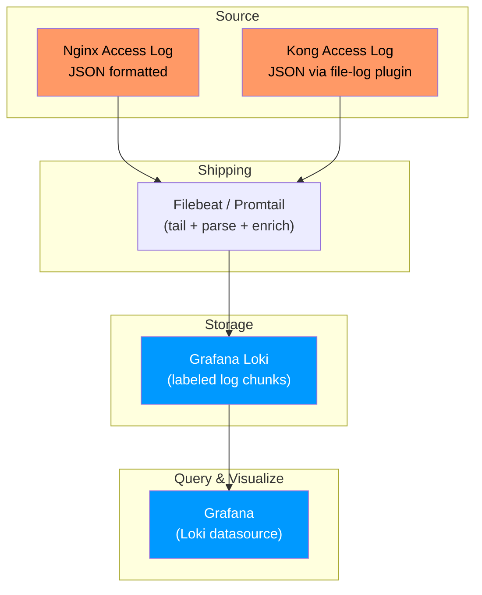
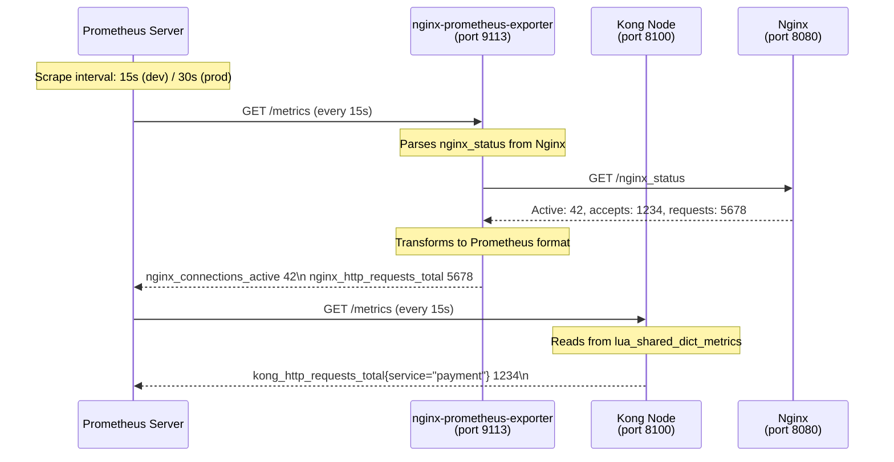

# Day 16: Observability for Nginx & Kong

> **Thời lượng**: 2 giờ
> **Độ khó**: ⭐⭐⭐⭐
> **Prerequisites**: Day 7 (Nginx Performance, access_log buffering), Day 8 (Kong Architecture, plugin lifecycle), Day 12 (Kong Rate Limiting, plugin scope)

---

## 1. Learning Objectives

Sau bài này, bạn sẽ có thể:

- Configure Nginx `stub_status` và `nginx-prometheus-exporter` để expose metrics cho Prometheus scrape
- Enable Kong plugin `prometheus` ở scope phù hợp (global vs service), phân biệt `kong_latency` vs `kong_upstream_latency` vs `kong_kong_latency`
- Configure access log JSON structured cho Nginx (`log_format json escape=json`) và cho Kong (plugin `file-log` / `http-log` với JSON template)
- Thiết kế dashboard theo USE method (Nginx) và RED method (Kong API Gateway)
- Viết PromQL query: `rate`, `histogram_quantile`, `sum by`, tránh sai lầm phổ biến khi aggregate multi-instance
- Setup logging pipeline: access log → Filebeat/Promtail → Loki → Grafana, hiểu buffer/flush tradeoff
- Troubleshoot: Prometheus scrape fail, cardinality bùng nổ, log gây I/O bottleneck

---

## 2. The Problem

> **Scenario — Payment API outage không có observability**
>
> 14:00 ngày thứ Sáu, payment-service bắt đầu trả 5xx tăng dần (50→200→800 lỗi/phút). Ops team không có dashboard metrics. Dev team không biết:
>
> - Lỗi ở Nginx hay Kong hay payment-service?
> - Latency tăng ở tầng nào?
> - Bao nhiêu request bị ảnh hưởng?
> - Có đang retry storm không?
>
> **Timeline postmortem**:
>
> - `T+0`: payment-service bắt đầu slow (DB lock contention)
> - `T+0–5min`: 200 lỗi/phút — không ai phát hiện (không alert)
> - `T+5min`: User báo lỗi thanh toán
> - `T+5–15min`: On-call debug bằng `grep "error" /var/log/nginx/access.log` — mất 10 phút
> - `T+15min`: Phát hiện retry storm từ Kong → restart Kong → không giải quyết
> - `T+30min`: Payment team restart payment-service → hết lỗi
>
> **Tổng damage**: 30 phút downtime, ~500 giao dịch thất bại.
>
> **Root cause cuối cùng**: DB index missing sau migration → query tăng từ 20ms lên 2000ms → Kong upstream timeout 60s + retries=5 → retry storm → 6× load.
>
> **Nếu có observability**:
> - Alert `upstream_latency_p95 > 500ms` → phát hiện T+0, không phải T+5min
> - Dashboard `kong_upstream_latency` vs `kong_kong_latency` → isolate slow layer (upstream, không phải Kong)
> - Metric `kong_upstream_target_health` → phát hiện target unhealthy ngay
> - Log JSON structured → query bằng Grafana Loki: `{job="nginx"} |= "error" |= "payment"` → trả lời trong 30 giây

**Pain points thực tế:**

- Không có metrics → incident response mù hoàn toàn, debug bằng guess
- Access log plain text → không query được bằng log aggregation tool
- Scrape interval 15s → incident đã qua 30s trước khi thấy spike
- Prometheus metric không có label route/service → không isolate được slow endpoint
- Cardinality bùng nổ khi tag theo user-id hoặc full request path
- Kong plugin `prometheus` ở scope global gây double-counting khi có service-level plugin

**Vì sao không chỉ dùng cloud monitoring?**

- CloudWatch/Datadog không expose raw Prometheus metrics cho custom dashboard
- Pull model (Prometheus) an toàn hơn push model (CloudWatch agent) ở scale
- PromQL mạnh hơn CloudWatch metrics query cho multi-instance aggregation
- Kong metrics có bản chất Lua/shared_dict — cần plugin chuyên dụng

---

## 3. Core Concepts

### 3.1 Three Pillars of Observability

```
┌──────────────────────────────────────────────────────────────────┐
│                   Three Pillars of Observability                   │
├──────────────────────────────────────────────────────────────────┤
│                                                                   │
│   METRICS          LOGS              TRACES                      │
│   "What?"          "Why?"            "How?"                       │
│                                                                   │
│   Prometheus        Loki/ELK          OpenTelemetry                │
│   counters          structured JSON   traceparent/B3               │
│   gauges           correlated        distributed                  │
│   histograms       searchable        per-request                   │
│                                                                   │
│   ✅ Day 16 FOCUS  ✅ Day 16 FOCUS  ⚠️ Overview only            │
│                                                                   │
│   RED method        USE method        Sample 1% for hot path       │
│   Gateway           Nginx LB         Full for error path           │
│                                                                   │
└──────────────────────────────────────────────────────────────────┘
```

**Đủ cho production gateway**: Metrics (Prometheus) + Logs (Loki/JSON) = 80% visibility. Traces = 20% cho distributed debugging.

### 3.2 Nginx Metrics Sources

```
┌─────────────────────────────────────────────────────────────┐
│                    Nginx Metrics Stack                       │
│                                                             │
│  ┌───────────────┐   ┌────────────────────────┐             │
│  │ stub_status   │   │ nginx-prometheus-     │             │
│  │ (built-in)    │──▶│ exporter              │──▶Prometheus│
│  │               │   │ (scrapes /metrics)    │             │
│  │ Active conn   │   │                       │             │
│  │ accepts/handl │   │ Converts NGX_HTTP_    │             │
│  │ reading/writin│   │ STUB_MARKER metrics    │             │
│  └───────────────┘   │ to Prometheus format  │             │
│          │           └────────────────────────┘             │
│          │                     │                             │
│  ┌───────▼─────────────────────▼──────────────────┐        │
│  │  nginx_vts_module (Nginx Plus / Open Source)   │        │
│  │  → Virtual host traffic status                  │        │
│  │  → Per upstream/server metrics                  │        │
│  │  ⚠️ Cần recompile hoặc dynamic module         │        │
│  └────────────────────────────────────────────────┘        │
└─────────────────────────────────────────────────────────────┘
```

**Key Nginx metrics** (from `stub_status`):

| Metric | Prometheus name | Ý nghĩa |
|---|---|---|
| Active connections | `nginx_connections_active` | Tổng connection đang mở |
| accepts | `nginx_connections_accepted` | Tổng connection đã accept |
| handled | `nginx_connections_handled` | Tổng connection đã handle (nếu < accepts → backlog drop) |
| requests | `nginx_http_requests_total` | Tổng HTTP request |
| Reading | `nginx_connections_reading` | Đang đọc request headers |
| Writing | `nginx_connections_writing` | Đang gửi response |
| Waiting | `nginx_connections_waiting` | Keepalive idle connections |

### 3.3 Kong Prometheus Metrics — Detailed

```
┌────────────────────────────────────────────────────────────────────┐
│                   Kong Prometheus Plugin Metrics                     │
│                    (enabled via KONG_PLUGINS=bundled,prometheus)    │
│                                                                     │
│  Metric Name                            │ Type      │ Labels          │
│ ────────────────────────────────────────┼───────────┼────────────────│
│  kong_http_requests_total               │ Counter   │ service, route, │
│                                         │           │ consumer, status │
│  kong_latency_bucket / _count / _sum    │ Histogram │ service, route, │
│                                         │           │ consumer, latency_type │
│  kong_upstream_latency_bucket/_count   │ Histogram │ service, upstream│
│  kong_kong_latency_bucket / _count     │ Histogram │ service, route   │
│  kong_bandwidth_bytes_total             │ Counter   │ service, route,  │
│                                         │           │ consumer, direction│
│  kong_nginx_metric_errors_total         │ Counter   │ error_type       │
│  kong_upstream_target_health            │ Gauge     │ upstream, target, │
│                                         │           │ subsystem, address│
│  kong_memory_lua_shared_dict_bytes      │ Gauge     │ kong, dict_name  │
│  kong_datastore_reachable               │ Gauge     │ -                │
└────────────────────────────────────────────────────────────────────┘
```

**Critical distinction — kong_latency vs kong_upstream_latency vs kong_kong_latency**:

```
kong_kong_latency  ── Kong overhead (Lua plugin execution, Lua-resty processing)
                    ── NOT include: network I/O to upstream
                    ── NOT include: upstream response time
                    ── ✅ Dùng để: isolate Kong plugin performance issue

kong_upstream_latency ── Time from Kong opens connection to upstream
                          to Kong receives complete response headers
                        ── Include: TCP handshake + TLS handshake (nếu có)
                          + upstream processing time + network I/O
                        ── NOT include: Kong processing overhead
                        ── ✅ Dùng để: isolate slow upstream

kong_latency (total gateway latency)
  = kong_kong_latency + kong_upstream_latency
  = end-to-end gateway time (client → Kong → upstream response started)
  ⚠️ Note: Không measure full request duration (response body transfer)
```

**Latency histogram bucket recommendation** (ms buckets):
```
[5, 10, 25, 50, 75, 100, 150, 200, 300, 500, 750, 1000, 2000, 5000]
```

### 3.4 USE Method (Nginx Load Balancer)

**Brendan Gregg's USE Method** cho observability:

```
Utilization  ── % thời gian resource đang bận
Saturation   ── queue length / wait time khi resource quá tải
Errors       ── số lỗi trên resource
```

**USE applied to Nginx**:

| Resource | Utilization | Saturation | Errors |
|---|---|---|---|
| CPU | worker CPU% | queue (context switch) | - |
| Memory | RSS / worker_rlimit_nofile | swap | OOM kill |
| Network | bandwidth NIC | TCP retransmit | connection reset |
| Disk (log) | iowait | write queue | write error |
| File descriptors | `ulimit -n` used% | accept backlog | EMFILE |
| Upstream | upstream keepalive pool used% | upstream queue | 502/503/504 |

### 3.5 RED Method (Kong API Gateway)

**Tom Wilkie's RED Method** cho microservices API:

```
Rate      ── Request throughput (RPS)
Errors    ── Error rate (4xx, 5xx)
Duration  ── Latency distribution (p50/p95/p99)
```

**RED applied to Kong**:

```
Rate:
  rate(kong_http_requests_total{service="payment"}[5m])
  → RPS trung bình trong 5 phút

Errors:
  rate(kong_http_requests_total{service="payment", status=~"5.."}[5m])
  / rate(kong_http_requests_total{service="payment"}[5m])
  → Error rate %

Duration (p95):
  histogram_quantile(0.95,
    rate(kong_latency_bucket{service="payment"}[5m]))
  → p95 total gateway latency
```

### 3.6 Trace ID Propagation

```
Client ──▶ Nginx ──▶ Kong ──▶ payment-service

Correlation ID flow:
  Client:  X-Request-ID: abc123
  Kong:    correlation-id plugin generates UUID if missing
           set X-Correlation-ID = UUID
           set X-Request-ID = existing or generated

  Log line:  "request_id=abc123 upstream_latency=45ms kong_latency=2ms"

W3C Trace Context (for distributed tracing):
  traceparent: 00-<trace-id>-<span-id>-01
              └── 32 hex chars     └── 16 hex

  Kong Zipkin plugin (optional):
    Accepts: X-B3-TraceId, X-B3-SpanId (Zipkin B3 format)
    Propagates: traceparent (W3C) header
    Spans exported to: Zipkin / Jaeger / OTLP collector

  ⚠️ Overview only — Day 16 focus là metrics + logs
```

### 3.7 Logging Pipeline Architecture



---

## 4. How It Works Internally

### 4.1 Prometheus Scrape Lifecycle (Nginx + Kong)



### 4.2 Kong Plugin Prometheus — Internal Mechanics

**Kong 3.x `lua_shared_dict_metrics`**:

```
1. Kong worker process (LuaJIT) increments counters in shared memory
   ── Per worker: lua-resty-counter or ngx.var.counter
   ── Shared across workers: lua_shared_dict (shm)

2. Prometheus scrapes /metrics endpoint on port 8100
   ── Kong reads from lua_shared_dict (read-only, no lock)
   ── Aggregates across all workers
   ── Returns Prometheus text format

3. Plugin scope determines what is exposed:
   ┌────────────────────────────────────────────────────────┐
   │  Global scope (no entity):                              │
   │    kong_http_requests_total{route="..."} += 1          │
   │    ⚠️ Nếu có service-level plugin cùng lúc: DOUBLE     │
   │       counting! (global = ALL, service = THAT SERVICE)  │
   │                                                        │
   │  Service scope:                                         │
   │    kong_http_requests_total{service="payment"} += 1    │
   │    ✅ Chỉ count requests qua service "payment"          │
   │                                                        │
   │  Route scope:                                           │
   │    kong_http_requests_total{route="order-route"} += 1 │
   │    ✅ Per-route breakdown                               │
   └────────────────────────────────────────────────────────┘

4. Histogram implementation:
   ── Buckets defined in kong.yml (default buckets)
   ── Server-side: ngx.histogram (OpenResty)
   ── Aggregate: rate() + histogram_quantile() in PromQL
   ── ⚠️ Gotcha: histogram_quantile() aggregates PER BUCKET
     across time, not across instances — use subquery or
     sum(rate(...)) by (le) for multi-instance
```

### 4.3 Nginx `stub_status` + `nginx-prometheus-exporter`

```
Nginx config (stub_status):
  server {
      listen 8080;
      location /nginx_status {
          stub_status on;
          allow 127.0.0.1;
          deny all;
      }
  }

nginx-prometheus-exporter (sidecar):
  docker run -p 9113:9113 nginx/nginx-prometheus-exporter \
    -nginx.scrape-uri=http://nginx:8080/nginx_status

Exposed metrics:
  nginx_connections_active           gauge
  nginx_connections_accepted         counter
  nginx_connections_handled         counter
  nginx_http_requests_total         counter
  nginx_connections_reading         gauge
  nginx_connections_writing         gauge
  nginx_connections_waiting         gauge
```

### 4.4 Access Log Buffering — Why `buffer=64k flush=5s`?

```
Without buffer (default sync):
  Request → write() syscall → disk write (4-10ms)
  ── Every request: 1 disk I/O
  ── 10,000 RPS: 10,000 writes/second → I/O bottleneck

With buffer (buffer=64k flush=5s):
  Request → write() to userspace buffer (microseconds)
  ── Buffer fills (64KB) OR 5s passes → 1 disk write
  ── 10,000 RPS × avg log line 200B = 2MB/s
  ── 64KB buffer ≈ 32 requests before flush
  ── 5s flush → max 5s log delay (acceptable for debugging)

Trade-off:
  ✅ +10-15% RPS improvement (measured)
  ✅ Reduced disk I/O
  ⚠️ Up to 5s log loss on crash (kernel flush still happens)
  ⚠️ Log viewer sees slightly stale timestamps

Buffer size recommendation:
  buffer=32k  flush=5s   → low traffic (< 100 RPS)
  buffer=64k  flush=5s   → medium traffic (100-1000 RPS)
  buffer=128k flush=10s  → high traffic (> 1000 RPS)
  buffer=1m    flush=30s  → very high traffic (> 10000 RPS)
```

### 4.5 Histogram Quantile — The Correct Way

**Wrong (server-side quantile)**:
```
# MySQL: SELECT AVG(response_time) — this is NOT median
# Application: percentile(response_times, 0.95) — this is LOCAL only
# Kong OSS: No built-in quantile
```

**Correct (PromQL with histogram_quantile)**:
```
# Single instance: works correctly
histogram_quantile(0.95,
  rate(kong_latency_bucket{service="payment"}[5m]))

# Multi-instance: MUST use subquery or sum by (le)
# ❌ WRONG for multi-instance:
histogram_quantile(0.95,
  sum(rate(kong_latency_bucket[5m])) by (service))

# ✅ CORRECT for multi-instance:
histogram_quantile(0.95,
  sum(rate(kong_latency_bucket{service="payment"}[5m])) by (le))
```

**Why?** `histogram_quantile()` computes quantile from bucket counts. If you `sum()` then apply quantile, you lose bucket boundary information across instances. The correct approach preserves bucket boundaries within each instance, then sums them.

---

## 5. Hands-on Lab

### Lab Overview

Lab tổng hợp: dựng full observability stack trong Docker Compose.

```
Client → Nginx (reverse proxy) → Kong DB-less → 2 backend services
                          ↓
                    nginx-prometheus-exporter (sidecar)
                          ↓
                    Kong Prometheus plugin (port 8100)
                          ↓
                    Prometheus (scrape Nginx + Kong)
                          ↓
                    Grafana (dashboard + Loki logs)
                          ↓
                    Promtail (tail access log → Loki)
```

**Reference files**: Xem `exercises.md` cho step-by-step chi tiết.

Lab summary:

- **Lab 1**: Setup Docker Compose (Nginx + Kong + Prometheus + Grafana + Promtail + Loki)
- **Lab 2**: Configure Nginx `stub_status` + `nginx-prometheus-exporter`
- **Lab 3**: Enable Kong plugin `prometheus` (scope global vs service) + verify metric
- **Lab 4**: Configure Nginx JSON access log + Kong `file-log` JSON
- **Lab 5**: Generate load bằng `wrk`, query PromQL cụ thể
- **Lab 6**: Import Grafana dashboard JSON skeleton
- **Lab 7**: Simulate failure (backend down), observe `kong_upstream_target_health`
- **Lab 8 (Challenge)**: Viết Prometheus alert rule cho 5xx > 1% + p95 > 500ms

---

## 6. Trade-offs Analysis

### 6.1 Nginx Metrics: stub_status vs VTS vs prometheus-exporter

| Aspect | `stub_status` | nginx-vts-module | prometheus-exporter |
|---|---|---|---|
| **Setup complexity** | Rất thấp (built-in) | Cao (recompile/module) | Thấp (sidecar container) |
| **Metrics available** | Basic (connections, accepts, requests) | Rich (per upstream, per status code, bandwidth) | Basic → Medium (scrapes stub_status) |
| **Per upstream breakdown** | Không | Có | Không |
| **Per status code** | Không | Có | Không |
| **Prometheus native** | Qua exporter | Direct (module exposes /metrics) | Yes (native /metrics) |
| **Overhead** | < 1% | < 2% (module active) | < 5% (extra HTTP request) |
| **Nginx Plus required** | No | No (OSS fork exists) | No |
| **Production recommendation** | ✅ Basic monitoring | ⚠️ VTS stable, NGX-http-lua-vhost-tree for Kong | ✅ **Recommended for Prometheus** |

### 6.2 Kong Prometheus Plugin: Global vs Service Scope

| Aspect | Global scope | Service scope | Route scope |
|---|---|---|---|
| **Metric coverage** | All requests | Requests via that service only | Requests via that route only |
| **Double-counting risk** | ⚠️ HIGH if service-level also enabled | ⚠️ HIGH if global also enabled | Thấp |
| **Cardinality** | Lower (no service label for global) | Trung bình | Cao nhất |
| **Use case** | Simple, single-service cluster | Multi-service, per-team | Per-route SLO |
| **Production recommendation** | ⚠️ Chỉ khi chắc chắn không có service-level | ✅ Phổ biến | Per-route dashboard |
| **Memory overhead** | Shared dict per metric | Additional labels | Highest labels |

### 6.3 Logging Backend: Prometheus vs Loki vs ELK vs CloudWatch

| Backend | Model | Strengths | Weaknesses | Khi nào dùng |
|---|---|---|---|---|
| **Prometheus** | Pull metrics | PromQL, alerting, Grafana integration | Không có log | Metrics-first observability |
| **Grafana Loki** | Pull logs | Label-based, cheap storage, Grafana native | Query language khác SQL | Kubernetes / Prometheus ecosystem |
| **ELK / OpenSearch** | Push logs | Full-text search, Kibana, powerful pipeline | Đắt, complex | Compliance log, audit trail |
| **CloudWatch** | Push metrics/logs | AWS native integration | Vendor lock-in, cost at scale | AWS-only environment |
| **Datadog** | Push agent | APM + logs + traces unified | **Cost per host**, vendor lock-in | Enterprise with budget |
| **Jaeger/Zipkin** | Push traces | Distributed trace visualization | Partial observability | Microservices with tracing need |

### 6.4 Pull vs Push Model

| Aspect | Prometheus Pull | Push Gateway | OpenTelemetry Collector |
|---|---|---|---|
| **Model** | Prometheus pulls from targets | Jobs push to Gateway | App pushes to Collector |
| **Security** | ✅ Prometheus must reach target | ⚠️ Gateway must be reachable | ✅ Collector can be internal |
| **Scale** | ✅ Better (scraping distributed) | ⚠️ Gateway is single point | ✅ Horizontal scaling |
| **Reliability** | ✅ Target down = no data (clear) | ⚠️ Gateway down = data loss | ✅ Collector buffers |
| **Short-lived jobs** | ❌ Not suitable | ✅ Good for batch jobs | ✅ Good for all |
| **Cardinality control** | ✅ Per-scrape config | ⚠️ Easy to overflow | ✅ Processor-based |
| **Gateway recommendation** | ✅ Prefer scraping directly | For batch/short-lived jobs only | ✅ Modern approach |

### 6.5 Cardinality Control — Hidden Costs

```
High cardinality label examples:
  ❌ user_id=user_123456          → millions of values → Prometheus explosion
  ❌ request_id=abc-def-123       → unique per request → useless metric
  ❌ route_path=/orders/12345     → dynamic path param  → useless metric

Safe label examples:
  ✅ service=payment               → bounded (10-50 services)
  ✅ route=order-api              → bounded (50-500 routes)
  ✅ status=500                   → bounded (10 codes)
  ✅ consumer=mobile-app          → bounded (100-1000 consumers)
  ✅ target=payment-v1:8000       → bounded by upstream targets

Cardinality formula:
  Cardinality = product of unique values per label
  Example: 50 services × 100 routes × 10 status × 2 methods = 100,000 series
  vs: 50 services × 100 routes × 10 status × 2 methods × 1000 consumers = 100,000,000 series ❌
```

---

## 7. Best Practices & Anti-patterns

### 7.1 Best Practices

**Prometheus scrape config**:
```yaml
scrape_configs:
  - job_name: 'nginx'
    static_configs:
      - targets: ['nginx-exporter:9113']
    scrape_interval: 30s      # Production: 30s (not 15s)
    scrape_timeout: 10s

  - job_name: 'kong'
    static_configs:
      - targets: ['kong:8100']
    scrape_interval: 30s
    scrape_timeout: 10s
    metrics_path: /metrics
```

**Dashboard layering** (Grafana):
```
Layer 1: Overview (10 panels)
  ── Total RPS (sum of all services)
  ── Global error rate % (5xx / total)
  ── p95 latency (all routes)
  ── Active connections (Nginx)
  ── Upstream health summary
  ── Top 5 slow services (by p95)
  ── Error rate by service (sparklines)
  ── Request rate by service
  ── Kong memory usage (lua_shared_dict)
  ── Prometheus scrape health

Layer 2: Service detail (20+ panels per service)
  ── RED per service: Rate / Errors / Duration
  ── kong_latency vs kong_upstream_latency vs kong_kong_latency
  ── Per-route breakdown
  ── Consumer breakdown (if applicable)
  ── Upstream target health per service

Layer 3: Instance detail (debugging only)
  ── Per Nginx worker stats
  ── Per Kong node stats
  ── TCP connection states
```

**Alert rule best practice**:
```yaml
groups:
  - name: gateway-alerts
    rules:
      - alert: HighErrorRate
        expr: |
          sum(rate(kong_http_requests_total{status=~"5.."}[5m]))
          / sum(rate(kong_http_requests_total[5m])) > 0.01
        for: 2m
        labels:
          severity: critical
        annotations:
          summary: "Kong 5xx error rate > 1%"
          runbook: "https://wiki.example.com/runbooks/high-error-rate"

      - alert: HighLatencyP95
        expr: |
          histogram_quantile(0.95,
            sum(rate(kong_latency_bucket{service="payment"}[5m])) by (le)) > 0.5
        for: 5m
        labels:
          severity: warning
        annotations:
          summary: "payment service p95 latency > 500ms"
```

### 7.2 Anti-patterns

```
❌ Anti-pattern 1: Prometheus scrape interval = 15s cho production
   → Incident spike tăng trong 15s nhưng metric chỉ update sau 15s
   → Production: 30s scrape interval, alert on 2-3 consecutive scrapes
   → 15s chỉ cho development/staging

❌ Anti-pattern 2: Global + service-level prometheus plugin cùng lúc
   → kong_http_requests_total double-counted
   → Error rate = actual_error × 2
   → Fix: Chỉ enable ở 1 scope, disable global khi dùng service scope

❌ Anti-pattern 3: Log full request body (chứa PII/credentials)
   → GDPR violation, token exposure
   → Fix: log request_id + status + latency + size, KHÔNG log body
   → Mask: authorization header = "***", user-data fields = "***"

❌ Anti-pattern 4: Scrape interval < scrape timeout
   → Prometheus không bao giờ hoàn thành scrape
   → Fix: scrape_timeout < scrape_interval

❌ Anti-pattern 5: Cardinality bùng nổ với status_code làm label
   → status_code=200, 201, 202, ... 599 = 400 unique values
   → Fix: Chỉ label cho 5xx hoặc bucket: status_type=success|redirect|client_error|server_error

❌ Anti-pattern 6: Recording rule trên quantile (p99)
   → recording: job:request_latency_p99:rate5m = histogram_quantile(0.99, rate(...))
   → p99 không aggregate được tốt (non-linear function)
   → Fix: Recording rule chỉ trên rate(), không trên histogram_quantile()

❌ Anti-pattern 7: Không label upstream target trong Kong metrics
   → Không biết upstream nào slow
   → Fix: luôn query với label upstream=...

❌ Anti-pattern 8: access_log không buffer trên production
   → 10,000 RPS = 10,000 disk writes/second
   → Fix: buffer=64k flush=5s (hoặc syslog → log aggregation)
```

---

## 8. Performance Considerations

### 8.1 Scrape Interval Trade-off

| Scrape interval | Pros | Cons | Recommended for |
|---|---|---|---|
| 10s | Near real-time | High Prometheus load, cardinality burn | Critical real-time |
| 15s | Reasonable | Alert may fire on single scrape | Development |
| **30s** | Balanced | 30s blind spot | **Production (recommended)** |
| 60s | Low overhead | Too slow for incident response | Non-critical metrics |

**Alert firing guideline**: Luôn dùng `for: 2m` để tránh alert on single scrape spike.

### 8.2 Logging I/O Benchmark Reference

> **Disclaimer**: Số liệu dưới đây chỉ dùng để tham khảo. Kết quả thực tế phụ thuộc vào disk type (SSD vs HDD vs NVMe), kernel, workload pattern.

| Config | Disk I/O (writes/s) | Latency impact | Log loss on crash |
|---|---|---|---|
| `access_log off` | 0 | 0ms | N/A |
| `access_log buffer=64k flush=5s` | ~200/s (2MB/s) | ~1ms | 0-5s log |
| `access_log buffer=128k flush=10s` | ~100/s (1MB/s) | ~0.5ms | 0-10s log |
| `access_log sync` (default) | ~10,000/s (2MB/s) | ~4-10ms | 0 log |
| Syslog → remote (UDP) | ~0 local I/O | < 0.1ms | 0 log (if UDP OK) |
| Syslog → remote (TCP) | ~0 local I/O | ~1-5ms | < 1s log |

**Methodology** (test trên local NVMe SSD, 10,000 RPS, avg log line 200B):

```bash
# Test: ab -n 100000 -c 100 http://localhost/
# Nginx access_log sync: avg latency increase ~4ms
# Nginx access_log buffer=64k flush=5s: avg latency increase ~1ms
# Syslog remote: avg latency increase ~0.1ms

# Note: buffer có benefit lớn nhất khi disk I/O là bottleneck.
# Trên NVMe hoặc tmpfs, difference nhỏ hơn nhiều.
```

### 8.3 Memory Overhead — Kong lua_shared_dict_metrics

| Metric type | Memory per metric | Approx for 10 services |
|---|---|---|
| Counter (http_requests_total) | ~100 bytes | 1 KB |
| Gauge (target_health) | ~150 bytes | 1.5 KB |
| Histogram (latency) | ~bucket_count × 8 bytes | 1-5 KB per service |
| Total per node | — | ~10-50 KB |

**Nginx-prometheus-exporter memory**: ~30-50 MB (static Go binary).

### 8.4 Bottleneck Detection

```bash
# 1. Check Prometheus scrape duration
# Grafana panel: "Scrape Duration" (prometheus_target_scrape_duration_seconds)

# 2. Check Prometheus remote_write queue
# prometheus_remote_storage_queue_length > 0 → remote write bottleneck

# 3. Check Loki ingestion rate
# loki_ingester_lines_received_total rate vs loki_ingester_streams_created_total

# 4. Check Grafana query latency
# grafana_api_response_status{method="query", status="200"} duration
```

---

## 9. Troubleshooting Checklist

### Checklist 1: Prometheus không scrape được Nginx

```
Symptom: Prometheus target page shows Nginx DOWN

[ ] 1. curl http://localhost:8080/nginx_status
       → 200 OK + stub_status output?
       → Fix: Enable stub_status module, check listen port

[ ] 2. curl http://localhost:9113/metrics
       → nginx_prometheus_exporter metrics?
       → Fix: Check nginx-prometheus-exporter container logs
       → Fix: Verify -nginx.scrape-uri points to correct nginx:8080

[ ] 3. Prometheus target page: http://localhost:9090/targets
       → Nginx job = UP?
       → Fix: Check prometheus.yml scrape_configs section
       → Fix: Verify network connectivity (Docker network)

[ ] 4. docker compose logs nginx-exporter
       → Error: "nginx status endpoint returned 403"
       → Fix: Allow Prometheus subnet in Nginx stub_status

[ ] 5. Check firewall / security group
       → Port 9113 reachable from Prometheus?
```

### Checklist 2: Kong Prometheus plugin không expose metrics

```
Symptom: curl :8100/metrics returns empty hoặc không có kong_ metric

[ ] 1. curl http://localhost:8001/plugins?name=prometheus
       → Plugin enabled?
       → Fix: POST /plugins với name=prometheus

[ ] 2. Kong status: KONG_PLUGINS=bundled,prometheus trong env?
       → Fix: Add KONG_PLUGINS env var

[ ] 3. Check plugin scope: global vs service
       → kubectl exec kong -- curl localhost:8100/metrics | grep kong_http_requests_total
       → Fix: Reload Kong sau khi enable plugin

[ ] 4. Global + service-level conflict (double counting)
       → GET /plugins ở global scope vs service scope
       → Fix: Disable global plugin, chỉ enable ở service level

[ ] 5. DB-less: kong.yml không có plugin prometheus
       → Fix: Add vào kong.yml, sync bằng decK
```

### Checklist 3: Access log không ghi JSON

```
Symptom: Log file vẫn là plain text, không phải JSON

[ ] 1. Nginx: nginx -T | grep log_format
       → Có định nghĩa log_format json?
       → Fix: Thêm log_format với escape=json

[ ] 2. nginx -T | grep access_log
       → Có reference log_format json?
       → Fix: access_log /path/to/log json;

[ ] 3. Kong: plugin file-log không có config json
       → Fix: plugin config: log_format="{...json template...}"

[ ] 4. File descriptor full → log ghi ra /dev/null
       → Fix: Check ulimit -n, worker_rlimit_nofile

[ ] 5. Promtail/Filebeat không tail file đúng
       → Fix: Verify path trong promtail.yaml configs
       → Fix: Check Promtail logs: docker compose logs promtail
```

### Checklist 4: Dashboard p95 latency không chính xác

```
Symptom: p95 trên Grafana khác với wrk benchmark

[ ] 1. Scrape interval quá dài (30s) → quantile estimate chậm
       → Fix: Giảm scrape interval hoặc dùng recording rule

[ ] 2. Multi-instance: histogram_quantile() dùng sai
       → Fix: dùng subquery hoặc sum by (le) như phần 4.5

[ ] 3. Histogram bucket không cover p95 region
       → Fix: Thêm bucket: 400, 500, 600, 700, 800, 1000, 2000

[ ] 4. Grafana query: chọn "calculate" thay vì "calculate by (le)"
       → Fix: Grafana → Options → Type = "Bucket (X)" → no Group by

[ ] 5. wrk benchmark đo end-to-end, Prometheus đo server-side
       → Fix: wrk latency > Prometheus latency (vì wrk include network)
       → Expected: wrk p95 ≈ Prometheus p95 × 1.2-1.5
```

### Checklist 5: Cardinality explosion

```
Symptom: Prometheus TSDB size tăng nhanh bất thường

[ ] 1. Check metric count: prometheus_tsdb_head_series
       → Tăng nhanh hơn expected?

[ ] 2. Top label values:
       prometheus_tsdb_head_series /by(__name__, label_name)

[ ] 3. Remove high-cardinality labels trong prometheus.yml:
       metric_relabel_configs:
         - source_labels: [user_id]
           action: labeldrop

[ ] 4. Kong: route_name label OK, request_id label = BAD
       → Fix: Remove request_id label, keep route/service/consumer
```

---

## 10. Completion Checklist

Sau khi hoàn thành bài học, tự kiểm tra:

- [ ] Configure được Nginx `stub_status` và `nginx-prometheus-exporter` sidecar
- [ ] Enable được Kong plugin `prometheus` ở đúng scope (service), verify metrics endpoint `:8100/metrics`
- [ ] Phân biệt được `kong_latency` vs `kong_upstream_latency` vs `kong_kong_latency` và biết khi nào dùng từng metric
- [ ] Configure được Nginx access log JSON (`log_format json escape=json`) và Kong `file-log` JSON
- [ ] Viết được PromQL query: `rate`, `histogram_quantile`, `sum by` đúng cách cho multi-instance
- [ ] Import được Grafana dashboard JSON skeleton và explain RED/USE panels
- [ ] Setup được logging pipeline: access log → Promtail → Loki → Grafana Explore
- [ ] Troubleshoot được: Prometheus scrape fail, plugin scope conflict, cardinality explosion
- [ ] Giải thích được vì sao `buffer=64k flush=5s` tốt hơn sync write
- [ ] Biết khi nào dùng Prometheus vs Loki vs ELK, pull vs push model

---

## 11. References

### Official Documentation

- [Prometheus: Metric Types](https://prometheus.io/docs/concepts/metric_types/) — counter, gauge, histogram, summary
- [Prometheus: Histogram Quantile](https://prometheus.io/docs/prometheus/latest/querying/functions/#histogram_quantile) — cách histogram_quantile() hoạt động
- [Prometheus: Scrape Config](https://prometheus.io/docs/prometheus/latest/configuration/configuration/#scrape_config) — scrape_interval vs scrape_timeout
- [Nginx stub_status Module](https://nginx.org/en/docs/http/ngx_http_stub_status_module.html)
- [nginx-prometheus-exporter](https://github.com/nginx/nginx-prometheus-exporter) — GitHub
- [Kong Plugin: Prometheus](https://docs.konghq.com/hub/kong-inc/prometheus/) — metric reference
- [Kong: Upstream Target Health Metric](https://docs.konghq.com/gateway/latest/reference/configuration/#kong_upstream_target_health) — metric details
- [Grafana Loki: Promtail Configuration](https://grafana.com/docs/loki/latest/clients/promtail/)
- [Grafana Dashboard JSON Model](https://grafana.com/docs/grafana/latest/dashboards/json-model/)

### Engineering Blog & Talks

- [Brendan Gregg: USE Method](https://www.brendangregg.com/usemethod.html) — framework cho system observability
- [Tom Wilkie: RED Method](https://www.weave.works/blog/the-red-method-key-metrics-for-microservices/) — metrics cho microservices
- [Kong Blog: Prometheus Plugin Deep Dive](https://konghq.com/blog/prometheus-monitoring-for-kong) — cardinality, scope
- [Cloudflare: Nginx Log Analytics](https://blog.cloudflare.com/nginx-log-analytics/) — structured logging
- [Grafana Loki Blog: PromQL vs LogQL](https://grafana.com/blog/2019/07/22/how-loki-relates-to-prometheus/) — when to use metrics vs logs
- [Cortex / Thanos: Multi-tenant Prometheus at Scale](https://cortexmetrics.io/) — Prometheus at production scale

### OpenTelemetry (Tracing Overview)

- [W3C Trace Context](https://www.w3.org/TR/trace-context/) — traceparent header format
- [OpenTelemetry: Kong Instrumentation](https://github.com/open-telemetry/opentelemetry-collector-contrib/tree/main/exporter/loadbalancingexporter) — OTLP overview
- [Zipkin B3 Format](https://github.com/openzipkin/b3-propagation) — alternative trace format

### Tools Reference

- [Grafana Dashboard 7424: Kong Gateway](https://grafana.com/grafana/dashboards/7424-kong-gateway/) — official Kong dashboard
- [Grafana Dashboard 12485: Nginx Ingress Controller](https://grafana.com/grafana/dashboards/12485-nginx-ingress-controller/) — reference dashboard
- [json-log-output: Nginx JSON logging module](https://github.com/vozlt/nginx-module-sts) — VTS alternative

---

## Recap

Day 16 là bài mở đầu Tuần 3 — tập trung vào **observability stack đầy đủ** cho Nginx và Kong.

**Điều cần nhớ:**

- **Metrics**: Nginx `stub_status` + prometheus-exporter = full Prometheus pipeline; Kong `prometheus` plugin expose `kong_http_requests_total`, `kong_latency` (3 loại), `kong_upstream_target_health`
- **RED method**: Rate / Errors / Duration — phù hợp cho API Gateway
- **USE method**: Utilization / Saturation / Errors — phù hợp cho Nginx Load Balancer
- **Latency phân biệt**: `kong_kong_latency` (plugin overhead) ≠ `kong_upstream_latency` (network + upstream) ≠ `kong_latency` (tổng)
- **Log JSON**: structured JSON access log thay vì combined format — query bằng Loki/ELK được, latency tăng < 1ms
- **Buffer**: `buffer=64k flush=5s` giảm I/O ~10×, log delay ≤ 5s — acceptable tradeoff
- **Histogram quantile**: `sum by (le)` cho multi-instance — tránh sai lầm `sum()` rồi `histogram_quantile()`
- **Cardinality**: chỉ label theo bounded value (service, route, status, consumer) — không label theo user_id, request_id, dynamic path

**Key insight**: Observability không phải "thêm metrics" mà là thiết kế dashboard phù hợp với audience (on-call vs SRE vs developer), viết alert rule đúng (scrape interval, `for`, `severity`), và kiểm soát cardinality từ đầu. Một Prometheus setup không có cardinality plan sẽ tự hủy sau 3 tháng.

---

## Preview Day 17

**Day 17: Consul Service Discovery Essentials** — Kong gọi backend service bằng tên cố định (`http://backend:8080`). Điều gì xảy ra khi backend IP thay đổi (scale up/down, failover)? Service Discovery tự động cập nhật endpoint.

Bạn sẽ học:

- Consul architecture: Server (5-node Raft consensus) vs Agent (Client mode), ports 8500/8600/8300
- Service registry: register/deregister, health check (HTTP/TCP/script/TTL)
- DNS-based discovery: `curl http://backend.service.consul:8500` — thay thế hardcoded IP
- Kong integration: `lua-resty-dns-client` với SRV record, DNS resolver config
- Nginx + consul-template: dynamic upstream reload khi service instance thay đổi
- Failure mode: Consul down → Kong/DNS cache fallback, stale data, retry behavior

Day 16 (observability) và Day 17 (service discovery) kết hợp tạo nền tảng cho Day 20 (Capstone) — hệ thống tự monitoring và tự discover, không cần hardcoded IP.
