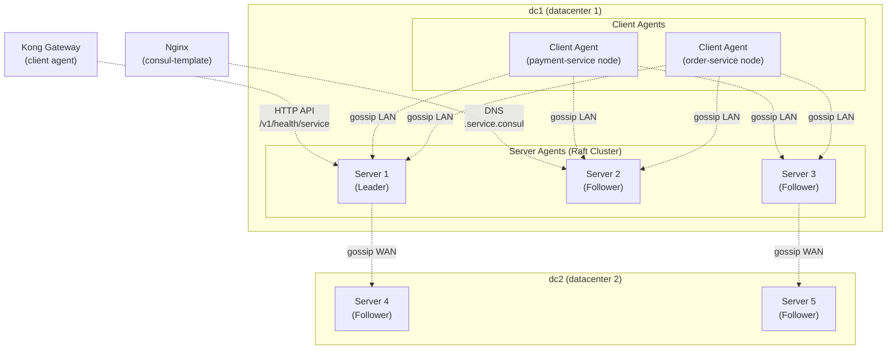

# Day 17: Consul Service Discovery Essentials

> **Thời lượng**: 2 giờ
> **Độ khó**: ⭐⭐⭐
> **Prerequisites**: Day 4 (Health Check, Failover & Upstream Failure), Day 13 (Kong Upstream Load Balancing & Health Checks), Day 16 (Observability for Nginx & Kong)

---

## 1. Learning Objectives

Sau bài này, bạn sẽ có thể:

- Giải thích tại sao service discovery là bắt buộc trong microservice architecture (dynamic IP, autoscaling, zero-downtime deploy)
- Phân biệt 3 mô hình service discovery: static config, DNS-based, registry-based — biết khi nào dùng cái nào
- Configure Consul agent (server + client), hiểu gossip protocol (LAN/WAN) và Raft consensus (quorum 3/5/7)
- Register service bằng HTTP API và config file, configure HTTP/TCP/TTL health check
- Query service qua REST API (`/v1/health/service`) và DNS interface (`<svc>.service.<dc>.consul`, SRV record)
- Configure Consul DNS resolver trên client, giải thích tại sao SRV record cần thiết cho Kong (Day 13 DNS resolution, Day 18 integration)
- Mô phỏng Consul failure scenarios: agent down, quorum loss, DNS stale, network partition
- So sánh Consul với etcd, Eureka, Kubernetes Service, ZooKeeper cho use case phù hợp

---

## 2. The Problem

> **Scenario thực tế — Order-service rollout trong Kubernetes**
>
> Team của bạn có 3 service: `order-service`, `payment-service`, `notification-service`. Mỗi service chạy 3 replicas trong Kubernetes. Tuần này xảy ra 3 incident liên quan đến hardcode IP:
>
> **Incident 1** (Thứ 2): Sau rolling deploy, `order-service` replicas có IP mới. Nginx upstream config vẫn trỏ IP cũ. 30 phút production outage — 2000 request thất bại (502).
>
> **Incident 2** (Thứ 4): Autoscaling tăng `payment-service` từ 3 lên 5 replicas. Nginx không biết replicas mới → 40% traffic vẫn đổ vào 3 instance cũ → latency spike → timeout cascade.
>
> **Incident 3** (Thứ 6): Backend team deploy version mới trên 2/3 replicas. Load balancer cũ vẫn phân phối đều → half của request đi vào version mới, half vào version cũ → data inconsistency.
>
> **Root cause chung**: IP và số lượng backend được hardcode trong Nginx config. Mỗi lần infra thay đổi (deploy, scale, migrate) → phải manual update config → reload Nginx → risk outage.

**Pain points khi không có service discovery:**

```
Static config (hardcode IP):
  - Backend IP đổi sau deploy/scale → 502 Bad Gateway
  - Không biết backend nào healthy → gửi traffic vào dead instance
  - Mỗi lần scale: ssh → edit nginx.conf → nginx -s reload
  - Không scale tự động được

DNS-based discovery (round-robin DNS):
  - DNS TTL quá dài → stale IP → 502
  - DNS TTL = 0 → query DNS mỗi request → latency
  - Không biết health status của backend
  - Không có per-instance health check

Registry-based (Consul/etcd/Eureka):
  - Backend tự register vào registry khi start
  - Backend tự deregister khi stop
  - Registry có health check → chỉ route đến healthy instance
  - Nginx/Kong đọc registry → dynamic upstream config
```

**Vì sao không chỉ dùng Kubernetes Service?**

```
Kubernetes Service (ClusterIP):
  - Chỉ hoạt động trong Kubernetes cluster
  - Không expose ra ngoài K8s network
  - Không có built-in service mesh / multi-cloud
  - Pod IP đổi khi restart → nhưng K8s Service abstract đi

Consul:
  - Platform-agnostic: bare-metal, VM, K8s, multi-cloud
  - Built-in health check + DNS + KV
  - ACL + encryption native
  - Multi-datacenter support
  - HTTP API + DNS interface
```

**Hậu quả nếu không có service discovery đúng cách:**

- 502/503 sau mỗi deploy (hardcode IP outdated)
- Latency spike khi autoscaling (new replica không nhận traffic)
- Thundering herd khi backend IP đổi (DNS TTL = 0, tất cả request cùng query DNS)
- Traffic đổ vào unhealthy backend (không có health check)

---

## 3. Core Concepts

### 3.1 Service Discovery — Ba Mô Hình

```
Mô hình 1: Static Config (hardcode)
  Nginx upstream: server 10.0.1.5:8080;
                 server 10.0.1.6:8080;
                 server 10.0.1.7:8080;

  Vấn đề: IP đổi → manual update → reload → outage

Mô hình 2: DNS-based (round-robin DNS)
  order-service.example.com → [10.0.1.5, 10.0.1.6, 10.0.1.7]
  TTL = 300s

  Vấn đề: DNS không biết health → có thể trả IP dead
  Vấn đề: TTL quá dài → stale IP
  Vấn đề: TTL = 0 → DNS query mỗi request → latency

Mô hình 3: Registry-based (Consul)
  Backend start → PUT /v1/agent/service/register (IP, port, health check)
  Backend stop  → PUT /v1/agent/service/deregister
  Nginx query   → GET /v1/health/service/order-service?passing
                 → [Healthy IP list]

  Ưu điểm: Dynamic, health-aware, platform-agnostic
```

### 3.2 Consul Architecture — Tổng Quan

**Analogy**: Consul giống như "bản đồ thành phố" của hệ thống microservices:
- Server agent = trung tâm điều phối (nơi lưu trữ bản đồ)
- Client agent = điểm phát sóng tại mỗi datacenter (báo cáo thông tin)
- Gossip protocol = mạng lưới truyền tin nhanh (cập nhật bản đồ liên tục)
- Raft consensus = cơ chế bỏ phiếu quyết định (đảm bảo consistency)



**Server Agent vs Client Agent:**

| Tiêu chí | Server Agent | Client Agent |
|---|---|---|
| Chạy trên | Dedicated server (3/5/7 node) | Mỗi node chạy service |
| Gossip | LAN + WAN | Chỉ LAN (với server) |
| Raft participation | Có (bầu leader, replicate state) | Không |
| Service registration | Không (chỉ chứa) | Có (register local service) |
| Health check execution | Không | Có (thực thi check trên local node) |
| HTTP API | Có (toàn bộ) | Chỉ local agent API |
| Resource usage | Cao (Raft + gossip) | Thấp (chỉ gossip) |

### 3.3 Service Registration

**HTTP API Registration:**

```bash
# Register order-service qua Agent HTTP API
curl -s -X PUT http://localhost:8500/v1/agent/service/register \
  -d '{
    "ID": "order-service-1",
    "Name": "order-service",
    "Tags": ["v1", "prod", "api"],
    "Address": "10.0.1.10",
    "Port": 8080,
    "Meta": {
      "version": "1.2.3",
      "environment": "production"
    },
    "Check": {
      "HTTP": "http://10.0.1.10:8080/health",
      "Interval": "10s",
      "Timeout": "5s",
      "DeregisterCriticalServiceAfter": "30s"
    }
  }'
```

**Config File Registration (`services.json`):**

```json
{
  "service": {
    "id": "order-service-1",
    "name": "order-service",
    "tags": ["v1", "prod", "api"],
    "address": "10.0.1.10",
    "port": 8080,
    "meta": {
      "version": "1.2.3",
      "environment": "production"
    },
    "check": {
      "id": "order-health",
      "http": "http://10.0.1.10:8080/health",
      "interval": "10s",
      "timeout": "5s",
      "deregister_critical_service_after": "30s"
    }
  }
}
```

**Service Deregistration:**

```bash
# Deregister khi service stop
curl -s -X PUT http://localhost:8500/v1/agent/service/deregister/order-service-1

# Force deregister (immediate, không chờ deregister_critical_service_after)
curl -s -X PUT http://localhost:8500/v1/agent/service/deregister/order-service-1?force=true
```

### 3.4 Health Check Types

| Type | Cơ chế | Khi nào dùng | Interval/Timeout |
|---|---|---|---|
| **HTTP** | `GET /health`, expect 200 | HTTP service có health endpoint | interval=10s, timeout=5s |
| **TCP** | TCP connect đến port | Non-HTTP service (Redis, PostgreSQL) | interval=10s, timeout=5s |
| **Script** | Chạy script, exit 0 = healthy | Custom logic (check file, memory) | interval=10s, timeout=5s |
| **TTL** | Service gửi heartbeat định kỳ, nếu hết TTL = unhealthy | Service không expose port HTTP (batch job) | TTL phải < interval×2 |
| **gRPC** | gRPC health check | gRPC service ( Envoy/Linkerd) | interval=10s, timeout=5s |
| **Docker** | Docker container health check | Container trong Docker environment | interval=10s, timeout=5s |
| **Alias** | Tham chiếu health check khác | 1 health check cho nhiều service | N/A |

**Script Health Check Example:**

```bash
# Script check disk space
cat > /usr/local/bin/check-disk.sh << 'EOF'
#!/bin/bash
USED=$(df / | tail -1 | awk '{print $5}' | sed 's/%//')
if [ "$USED" -gt 90 ]; then
  echo "Disk usage: ${USED}% - CRITICAL"
  exit 2  # 2 = critical, 1 = warning, 0 = healthy
fi
echo "Disk usage: ${USED}% - OK"
exit 0
EOF
chmod +x /usr/local/bin/check-disk.sh
```

```json
{
  "check": {
    "id": "disk-check",
    "name": "disk space check",
    "script": "/usr/local/bin/check-disk.sh",
    "interval": "60s",
    "timeout": "5s"
  }
}
```

**TTL Health Check (Service sends heartbeat):**

```bash
# Service gửi heartbeat mỗi 10s, TTL = 30s
curl -s -X PUT http://localhost:8500/v1/agent/check/pass/service:order-ttl-check

# Trong application code (pseudocode):
every(10 seconds):
    PUT http://consul-agent:8500/v1/agent/check/pass/service:order-ttl-check
    # Nếu không gửi trong 30s → Consul mark unhealthy
```

### 3.5 Service Discovery — REST API vs DNS

**REST API Discovery:**

```bash
# Lấy tất cả instance healthy của order-service
curl -s 'http://localhost:8500/v1/health/service/order-service?passing=true' \
  | jq '.[] | {Node, Address: .Service.Address, Port: .Service.Port, ServiceID: .Service.ID}'

# Lấy tất cả instance (bao gồm unhealthy)
curl -s 'http://localhost:8500/v1/catalog/service/order-service' \
  | jq '.[].ServiceAddress, .[].ServicePort'

# Filter theo tag
curl -s 'http://localhost:8500/v1/health/service/order-service?passing=true&tag=prod' \
  | jq
```

**DNS Interface:**

```bash
# A record: trả về IP của service
dig @localhost -p 8600 order-service.service.consul

# SRV record: trả về IP + Port của service
dig @localhost -p 8600 order-service.service.consul SRV

# Filter theo tag
dig @localhost -p 8600 prod.order-service.service.consul SRV

# Datacenter-specific
dig @localhost -p 8600 order-service.service.dc1.consul SRV
```

**So sánh REST API vs DNS:**

| Tiêu chí | REST API | DNS |
|---|---|---|
| Thông tin | Full (IP, port, tags, metadata, health) | Chỉ IP + Port (qua SRV) |
| Filter | Tag, node metadata, check status | Tag, datacenter |
| Caching | Client quản lý | OS/DNS cache theo TTL |
| Latency | 5-20ms (HTTP) | 0.1-2ms (cached) |
| Blocking query | Có (long polling) | Không |
| Use case | Gateway dynamic config | Application-level discovery |
| Security | ACL token | Firewall + recursors |

### 3.6 Consul DNS — SRV Record và Tại Sao Quan Trọng

**SRV record format:**

```
;; SRV record cho order-service.service.consul
order-service.service.consul.  300  IN  SRV  10 100 8080 node1.dc1.consul.
order-service.service.consul.  300  IN  SRV  10 100 8080 node2.dc1.consul.
```

SRV record chứa: `weight port target` — cho phép load balancing tại DNS level và biết cả port (không phải mặc định 80).

**Tại sao SRV cần thiết cho Kong (Day 13/18):**

```
Day 13 đã đề cập: Kong dùng lua-resty-dns-client, hỗ trợ SRV record.
Kong upstream với algorithm=none + use_srv_name=true:
  → Kong đọc SRV record từ Consul DNS
  → Tự extract IP + Port từ SRV
  → Ring balancer distribute request đến các target

Day 18 (Integrating Nginx/Kong with Service Discovery):
  → Nginx + consul-template: render upstream config từ Consul DNS
  → Kong + consul-template / DNS resolver: dynamic upstream/target
```

---

## 4. How It Works Internally

### 4.1 Gossip Protocol — SWIM Overview

Consul dùng **SWIM** (Scalable Weakly-consistent Infection-style Membership protocol) để distribute trạng thái cluster:

```
SWIM = Scalable Weakly-consistent Infection-style Membership protocol

Cơ chế:
1. Mỗi node chọn 1-3 random node trong cluster
2. Gửi ping (direct) → nếu không reply trong timeout → gửi indirect ping
3. Indirect ping: nhờ node khác ping giúp → nếu node đó reply → alive
4. Nếu indirect cũng fail → mark node là suspect → alive
5. sau N rounds suspect → mark dead

Lan truyền: Infection-style (như tin đồn)
  - Node A phát hiện B down → gửi "B is dead" đến 3 random node
  - 3 node đó gửi tiếp đến 3 node khác → O(log N) rounds để toàn cluster biết
```

**LAN gossip vs WAN gossip:**

| Tiêu chí | LAN Gossip | WAN Gossip |
|---|---|---|
| Scope | Trong 1 datacenter | Giữa các datacenter |
| Port | 8301/tcp + 8301/udp | 8302/tcp |
| Frequency | 1s (default) | 10s (default) |
| Purpose | Member discovery, health propagation | Cross-DC federation |
| Encryption | Có (encrypt key) | Có (encrypt key) |

**Gossip message overhead:**

```
Per node:
  - Gửi: ~1-5 KB/s (1 ping/indirect ping mỗi ~200ms)
  - Nhận: ~N × 1-5 KB/s (N = cluster size)

Cluster 10 nodes: ~50 KB/s per node
Cluster 100 nodes: ~500 KB/s per node
Cluster 1000 nodes: ~5 MB/s per node → có thể thành bottleneck

→ Best practice: max ~500 nodes per datacenter
```

### 4.2 Raft Consensus — Server Quorum

```
Raft consensus (Consul server agents):

Term = nhiệm kỳ của leader
  - Node gửi RequestVote → các node bỏ phiếu
  - Node nhận đủ (N/2+1) phiếu → trở thành leader
  - Leader gửi AppendEntries định kỳ (heartbeat)
  - Nếu follower không nhận heartbeat trong election_timeout → chuyển sang candidate

Consensus:
  - Write: phải qua leader, replicate đến N/2+1 server → committed
  - Read: có thể đọc từ any server (stale) hoặc từ leader (consistent)

Quorum size:
  3 server: quorum = 2 (1 leader + 1 follower đồng ý)
  5 server: quorum = 3
  7 server: quorum = 4

→ Luôn dùng số lẻ server (3/5/7) để tránh split-brain
→ 3 server: chịu được 1 server down
→ 5 server: chịu được 2 server down
→ 7 server: chịu được 3 server down
```

**Quorum Loss Scenario:**

```
3 server cluster:
  - Server 1 (leader) + Server 2 (follower) + Server 3 (follower)
  - Server 3 down → quorum = 2, still available (1+2 = 2)
  - Write: leader + 1 follower = quorum OK
  - Server 2 down thêm → chỉ còn leader → quorum = 1 → KHÔNG đủ
  - Write: FAIL (cannot replicate to majority)
  - Read: STALE OK (từ leader), CONSISTENT READ: FAIL

→ Production: alert khi server count < quorum
```

### 4.3 Health Check Execution — Push vs Pull

```
Hai mô hình health check:

PUSH (TTL-based):
  - Consul server KHÔNG chủ động probe
  - Service tự gửi heartbeat định kỳ
  - Nếu không heartbeat trong TTL → mark unhealthy
  - Use case: service không expose HTTP port (batch job, background worker)

PULL (HTTP/TCP/Script):
  - Consul client agent thực thi check định kỳ
  - Local execution (không qua network)
  - Gửi result đến server qua RPC/gossip
  - Server update catalog + DNS

Health check execution timeline (HTTP, interval=10s, threshold=3):
  t=0s:   Client probe GET http://10.0.1.10:8080/health
          → 200 OK → successes=1
  t=10s:  Probe → 200 OK → successes=2
  t=20s:  Probe → 200 OK → successes=3 → HEALTHY
  t=30s:  Probe → 500 → successes=0, failures=1
  t=40s:  Probe → 500 → failures=2
  t=50s:  Probe → 500 → failures=3 → UNHEALTHY
  t=50s:  Consul deregister service (nếu deregister_critical_service_after <= 0)
  t=50s:  Consul update DNS → A record không còn IP này
```

### 4.4 Blocking Query — Long Polling

Consul REST API hỗ trợ **blocking query** (long polling) — client gửi request, Consul giữ connection đến khi có thay đổi hoặc timeout:

```bash
# Blocking query: chờ thay đổi health status
curl -s 'http://localhost:8500/v1/health/service/order-service?passing=true&index=12345&wait=60s' \
  | jq '{index: .[0].CheckID, ModifyIndex: .[0].ModifyIndex}'

# index: Consul trả về ModifyIndex hiện tại
# wait=60s: Consul giữ request đến 60s hoặc đến khi index thay đổi
# Khi health check thay đổi → ModifyIndex tăng → response trả về ngay

# Blocking query loop (consul-template pattern):
while true; do
  INDEX=$(curl -s 'http://consul:8500/v1/health/service/order-service?passing=true' \
    | jq -r '.[0].ModifyIndex')
  curl -s "http://consul:8500/v1/health/service/order-service?passing=true&index=${INDEX}&wait=60s"
  # Xử lý response → render config
done
```

**Blocking query vs Polling:**

| Tiêu chí | Short Polling | Blocking Query (Long Polling) |
|---|---|---|
| Request frequency | Mỗi N giây (dù có thay đổi hay không) | Chỉ khi có thay đổi |
| Network overhead | Cao (request thường xuyên) | Thấp (ít request hơn) |
| Latency phát hiện | ~N giây (polling interval) | ~ms (ngay khi có thay đổi) |
| Server load | Cao (nhiều request) | Thấp hơn |
| Use case | Polling tools (watch, curl loop) | consul-template, SDK |

### 4.5 DNS Resolution Path

```
DNS query flow: dig order-service.service.consul SRV @consul-server

1. Client gửi DNS query đến Consul DNS (port 8600)
   dig @10.0.1.5 -p 8600 order-service.service.consul SRV

2. Consul server nhận query
   → Query catalog (Raft replicated state)
   → Filter: chỉ trả về instance có:
       - Check status = passing
       - Tag match (nếu có)
       - Datacenter match (nếu có)

3. Trả về SRV record:
   order-service.service.consul. 300 IN SRV 10 100 8080 node1.dc1.consul.
   order-service.service.consul. 300 IN SRV 10 100 8080 node2.dc1.consul.

4. A record (nếu hỏi):
   order-service.service.consul. 300 IN A 10.0.1.10
   order-service.service.consul. 300 IN A 10.0.1.11

5. Client (hoặc OS resolver) cache theo TTL
   TTL default = 0 (no-cache, mỗi query đều hỏi Consul)
   TTL configurable trong Consul config: "dns_config": {"allow_stale": true}
```

### 4.6 Consul Template — Overview

**consul-template** là tool chạy blocking query đến Consul, render template file khi registry thay đổi. Day 18 sẽ tích hợp với Nginx.

```
consul-template workflow:

1. consul-template đọc template file (nginx.ctmpl)
2. Blocking query đến Consul API
3. Khi service registry thay đổi:
   → Re-render template
   → Execute command (nginx -s reload)
4. Nginx config updated → upstream list mới
```

---

## 5. Hands-on Lab

**Mục tiêu**: Dựng Consul cluster (1 server + 2 client) trong Docker Compose, register 2 service với health check, verify qua API và DNS.

Xem chi tiết trong file `exercises.md`.

**Tóm tắt architecture:**

```
┌──────────────────────────────────────────────────────────────┐
│ Docker Compose Network (consul-lab)                            │
│                                                              │
│  consul-server-1 (server agent, Raft leader)                 │
│    ports: 8500 (HTTP API), 8600 (DNS)                       │
│                                                              │
│  consul-client-1 (client agent)                              │
│    service: order-service (port 8080)                        │
│    health check: HTTP /health                                │
│                                                              │
│  consul-client-2 (client agent)                              │
│    service: payment-service (port 8081)                      │
│    health check: HTTP /health                                │
│                                                              │
│  order-backend (MockServer)                                  │
│    port: 8080, path /health → 200                           │
│                                                              │
│  payment-backend (MockServer)                                │
│    port: 8081, path /health → 200                           │
│                                                              │
│  dig-client (alpine + dig)                                   │
│    test DNS: dig @consul-server-1 -p 8600 order-service.service.consul SRV
└──────────────────────────────────────────────────────────────┘
```

**Tóm tắt commands:**

```bash
# Register service
curl -X PUT http://localhost:8500/v1/agent/service/register \
  -d '{"ID":"order-1","Name":"order-service","Address":"10.0.1.10","Port":8080,"Check":{"HTTP":"http://10.0.1.10:8080/health","Interval":"10s"}}'

# Query healthy instances
curl -s 'http://localhost:8500/v1/health/service/order-service?passing=true' \
  | jq '.[].Service | {Address, Port}'

# DNS SRV record
dig @localhost -p 8600 order-service.service.consul SRV

# DNS A record
dig @localhost -p 8600 order-service.service.consul

# Kill service → observe deregister
docker compose stop order-backend
dig @localhost -p 8600 order-service.service.consul  # → NXDOMAIN hoặc stale

# Restore service
docker compose start order-backend
dig @localhost -p 8600 order-service.service.consul  # → IP trả lại sau health check
```

---

## 6. Trade-offs Analysis

### 6.1 Service Discovery Tools Comparison

| Tiêu chí | Consul | etcd | Eureka | Kubernetes Service | ZooKeeper |
|---|---|---|---|---|---|
| **Protocol** | HTTP + DNS | gRPC | HTTP + Eureka client | Kube-proxy (iptables/IPVS) | ZAB (ZooKeeper Atomic Broadcast) |
| **Health check native** | Có (HTTP/TCP/TTL/Script) | Không (l3-check, etcd keeper) | Có (client heartbeat) | Liveness probe (K8s) | Không |
| **DNS interface** | Có (SRV, A, AAAA) | Có (via etcd-dns) | Không | Có (ClusterIP, headless) | Không |
| **Platform** | Multi-platform (bare metal, VM, K8s) | Multi-platform | Java-only (Netflix OSS) | Kubernetes only | Multi-platform |
| **Consistency** | Strong (Raft) | Strong (Raft) | Eventual (peer-to-peer) | Eventually consistent | Strong (ZAB) |
| **Multi-DC native** | Có (WAN gossip) | Có (but manual) | Không (需 AWS Region) | Không (需 federation) | Không |
| **ACL/Security** | ACL + mTLS | RBAC + mTLS | Basic | K8s RBAC | ACL |
| **Performance** | ~1000 services | ~10k services | ~10k services | ~5k services | ~1k services |
| **Complexity** | Trung bình | Cao | Thấp (Java) | Thấp (K8s-native) | Cao |
| **Best for** | Multi-platform, multi-DC, DNS-first | K8s native, distributed config | Netflix OSS stack | K8s-internal only | Legacy Apache ecosystem |

### 6.2 Consul Discovery Patterns Comparison

| Pattern | Use case | Pros | Cons |
|---|---|---|---|
| **REST API + consul-template** | Nginx static config | Simple, reliable | Nginx reload cần thiết |
| **DNS-based (consul-template)** | Kong upstream (Day 18) | Kong hỗ trợ SRV native | TTL stale risk |
| **Kong DNS resolver** | Kong upstream, algorithm=none | Không cần reload | Chỉ hoạt động khi Kong resolve Consul DNS |
| **Blocking query SDK** | Go/Python/Java client | Near real-time, efficient | Code integration required |
| **consul-template + reload** | Nginx/Kong dynamic reload | Works với mọi tool | Reload latency (~100ms) |

### 6.3 Anti-patterns

```
❌ Anti-pattern 1: Register service mà không deregister
   → Service pod bị OOM kill → không deregister → DNS still points to dead IP
   → Fix: deregister_critical_service_after = 30s (tự động deregister sau TTL)

❌ Anti-pattern 2: Health check interval quá dài
   → interval = 60s → mất 3 phút để phát hiện backend down
   → Fix: interval = 10s cho production

❌ Anti-pattern 3: Dùng Consul KV làm config store mà không có versioning
   → Config thay đổi → application không biết → inconsistent state
   → Fix: Dùng consul-template với blocking query

❌ Anti-pattern 4: Quorum = 2 (even number of servers)
   → Split-brain khi network partition
   → Fix: Luôn dùng số lẻ: 3/5/7

❌ Anti-pattern 5: Scrape API quá thường xuyên
   → 100 service × 1 req/s = 100 req/s → Consul server overload
   → Fix: Blocking query hoặc consul-template

❌ Anti-pattern 6: Không có encrypt key
   → Gossip traffic không encrypted → data leak
   → Fix: Set encrypt key trong Consul config
```

### 6.4 Consul vs Alternatives — Use Case Recommendation

| Use case | Recommendation | Lý do |
|---|---|---|
| Multi-platform (VM + K8s) + multi-DC | **Consul** | Platform-agnostic, multi-DC native |
| Kubernetes-only internal service | **Kubernetes Service** | Đơn giản, native, low overhead |
| Distributed config + service discovery | **etcd** (if K8s) | Dùng chung với K8s API server |
| Netflix OSS stack | **Eureka** | Tích hợp Spring Cloud, Hystrix |
| Legacy Java monolith | **Eureka** | Quen thuộc với Java ecosystem |
| Simple, single-DC, embedded | **Consul** (client mode) | Dễ setup, DNS interface tốt |

---

## 7. Best Practices & Best Solution

### 7.1 Production Consul Cluster Setup

```bash
# Server config (3-node cluster)
cat > consul-server.json << 'EOF'
{
  "server": true,
  "bootstrap_expect": 3,
  "ui_config": {
    "enabled": true
  },
  "data_dir": "/consul/data",
  "advertise_addr": "{{ GetInterfaceIP \"eth0\" }}",
  "client_addr": "0.0.0.0",
  "ports": {
    "dns": 8600,
    "http": 8500,
    "serf_lan": 8301,
    "serf_wan": 8302,
    "server": 8300
  },
  "encrypt": "ZxB5L7H8f2gDq3mN9tR4wY6pA0kE1jC=",
  "recursors": ["8.8.8.8", "8.8.4.4"],
  "dns_config": {
    "allow_stale": true,
    "max_stale": "200s",
    "enable_truncate": true,
    "only_passing": false
  },
  "log_level": "info",
  "enable_syslog": false
}
EOF

# Client config
cat > consul-client.json << 'EOF'
{
  "server": false,
  "data_dir": "/consul/data",
  "advertise_addr": "{{ GetInterfaceIP \"eth0\" }}",
  "client_addr": "0.0.0.0",
  "ports": {
    "dns": 8600,
    "http": 8500,
    "serf_lan": 8301
  },
  "encrypt": "ZxB5L7H8f2gDq3mN9tR4wY6pA0kE1jC=",
  "retry_join": ["consul-server-1", "consul-server-2", "consul-server-3"],
  "enable_script_checks": false,
  "disable_update_check": true,
  "log_level": "warn"
}
EOF
```

### 7.2 Recommended Service Registration Template

```bash
# Service registration với recommended health check config
SERVICE_ID="order-service-$(hostname)"
SERVICE_NAME="order-service"
SERVICE_IP=$(hostname -i | awk '{print $1}')
SERVICE_PORT=8080
CONSUL_HTTP_ADDR="http://consul-server:8500"

curl -s -X PUT "${CONSUL_HTTP_ADDR}/v1/agent/service/register" \
  -d "{
    \"ID\": \"${SERVICE_ID}\",
    \"Name\": \"${SERVICE_NAME}\",
    \"Tags\": [\"prod\", \"api\", \"v1\"],
    \"Address\": \"${SERVICE_IP}\",
    \"Port\": ${SERVICE_PORT},
    \"Meta\": {
      \"version\": \"${APP_VERSION:-unknown}\",
      \"environment\": \"${ENVIRONMENT:-production}\"
    },
    \"Check\": {
      \"id\": \"${SERVICE_ID}-health\",
      \"HTTP\": \"http://${SERVICE_IP}:${SERVICE_PORT}/health\",
      \"Interval\": \"10s\",
      \"Timeout\": \"5s\",
      \"DeregisterCriticalServiceAfter\": \"30s\",
      \"TLSSkipVerify\": false
    }
  }"
```

### 7.3 Service Discovery Pattern — Nginx + consul-template

```bash
# consul-template template file
cat > /etc/consul/templates/nginx-upstream.ctmpl << 'EOF'
upstream order_backend {
{{ range services "order-service" "passing" }}
{{ range service "order-service" "passing" }}
    server {{ .Address }}:{{ .Port }} max_fails=3 fail_timeout=30s;
{{ end }}
{{ end }}
}

upstream payment_backend {
{{ range services "payment-service" "passing" }}
{{ range service "payment-service" "passing" }}
    server {{ .Address }}:{{ .Port }} max_fails=3 fail_timeout=30s;
{{ end }}
{{ end }}
}
EOF

# consul-template command
consul-template \
  -consul-addr consul-server:8500 \
  -template /etc/consul/templates/nginx-upstream.ctmpl:/etc/nginx/conf.d/upstream.conf \
  -reload-command "nginx -s reload" \
  -retry 30s \
  -log-level info
```

### 7.4 Production Checklist

```
DO:
  ✓ Dùng 3 server agents (quorum = 2) cho production
  ✓ Set encrypt key trong config
  ✓ deregister_critical_service_after = 30s (auto-deregister khi health check fail)
  ✓ interval = 10s cho HTTP health check
  ✓ enable only_passing trong DNS query để không trả IP unhealthy
  ✓ Backup Consul state bằng Raft snapshot
  ✓ Monitor server health: /v1/status/leader, /v1/status/peers

DON'T:
  ✗ Quorum = 2 (even number → split-brain risk)
  ✗ Không có encrypt key (gossip không bảo mật)
  ✗ Health check interval > 30s (phát hiện lỗi quá chậm)
  ✗ Disable Consul DNS port (mất DNS-based discovery)
  ✗ Scrape API với polling ngắn (< 5s interval)
```

---

## 8. Performance Considerations

### 8.1 Benchmark Methodology

```
Môi trường test:
  - Consul: 3 server agents (VM 2 vCPU, 4GB RAM each)
  - Client: 10 client agents (VM 1 vCPU, 1GB RAM each)
  - Network: 1 Gbps LAN
  - Service: 50 registered services (mỗi service 3 instances = 150 checks)

Test scenarios:
  1. DNS query latency: A record lookup (cached vs uncached)
  2. Health check overhead: probe execution time
  3. Gossip bandwidth: per-node gossip traffic
  4. Blocking query: response time khi state thay đổi
  5. API throughput: req/s mà server handle được

Command benchmark DNS:
  # Uncached (TTL=0)
  for i in $(seq 1 1000); do
    dig @consul-server -p 8600 order-service.service.consul +short | head -1
  done | wc -l

Command benchmark API:
  hey -z 30s -c 20 -m GET \
    'http://localhost:8500/v1/health/service/order-service?passing=true'
```

> Lưu ý: số liệu dưới đây chỉ dùng để tham khảo. Kết quả thực tế phụ thuộc hardware, network, cluster size, service count.

### 8.2 Sample Performance Numbers

| Metric | Value (tham khảo) | Notes |
|---|---|---|
| DNS A record (cached) | 0.1-0.5ms | OS-level cache hit |
| DNS A record (uncached) | 2-5ms | Round-trip đến Consul DNS |
| DNS SRV record (uncached) | 3-8ms | SRV lookup + A lookup |
| Health check execution (HTTP) | 5-50ms | Tùy endpoint response time |
| Gossip bandwidth per node | 1-5 KB/s | Không đáng kể |
| Raft write latency | 5-15ms | P95 trên 3-node cluster |
| Blocking query wake-up | < 100ms | Từ state change → notification |
| Server API throughput | ~5000 req/s | 3-node cluster, 2 vCPU, 4GB RAM |

### 8.3 Gossip Overhead Scaling

```
Gossip bandwidth formula (ước tính):
  bandwidth_per_node ≈ k × log(N) × message_size / interval

  k = 3 (số node probe mỗi round)
  N = cluster size
  message_size ≈ 500 bytes
  interval = 1 second

N=3 nodes:   ~1.5 KB/s per node
N=10 nodes:  ~2.0 KB/s per node
N=50 nodes:  ~3.0 KB/s per node
N=100 nodes: ~3.5 KB/s per node
N=500 nodes: ~5.0 KB/s per node

→ Gossip overhead thường không phải bottleneck
→ Bottleneck chính: Raft write latency khi nhiều concurrent writes
```

### 8.4 Raft Tuning

```bash
# Performance tuning trong Consul server config
{
  "performance": {
    "raft_multiplier": 1,   # Default 5 → giảm xuống 1-2 cho low latency
    "leave_drain_time": "5s",  # Graceful leave
    "rpc_hold_timeout": "7s"
  }
}

# raft_multiplier:
#   1 = maximum performance (raft heartbeat = 100ms)
#   2 = balanced (raft heartbeat = 200ms)
#   5 = default (raft heartbeat = 500ms) — better stability, higher latency

# Recommended:
#   Low-latency requirement (< 10ms): raft_multiplier = 1
#   Standard production: raft_multiplier = 2-3
#   High-stability requirement: raft_multiplier = 5
```

### 8.5 Recommended Cluster Sizing

| Cluster size | Quorum | Fault tolerance | Memory/server | Use case |
|---|---|---|---|---|
| 3 servers | 2 | 1 node down | 4-8 GB | Dev/staging, small production |
| 5 servers | 3 | 2 node down | 8-16 GB | Medium production |
| 7 servers | 4 | 3 node down | 16-32 GB | Large production, multi-DC |

> Không dùng nhiều hơn 7 server trong 1 datacenter. Quá nhiều server làm Raft replication chậm hơn (phải replicate đến nhiều node hơn).

---

## 9. Troubleshooting Checklist

### Checklist 1: Agent Join Cluster Fail

```
Symptom: consul join không thành công, "No installed Consul could be contacted"

Root causes to check:

□ Encrypt key mismatch:
  → Check encrypt key trong tất cả agent config phải giống nhau
  → Fix: Set cùng encrypt key trong consul-server.json và consul-client.json

□ Gossip port (8301) chưa mở:
  → Fix: firewall-cmd --add-port=8301/tcp --add-port=8301/udp
  → Hoặc docker: -p 8301:8301 -p 8301:8301/udp

□ Server agent chưa ready (Raft chưa elect leader):
  → Fix: Chờ 10-15s sau khi start server, rồi mới join client
  → Check: curl -s http://localhost:8500/v1/status/leader

□ retry_join address sai:
  → Fix: Đúng hostname/IP của server agent
  → Check docker network: dùng container_name trong docker-compose

□ Datacenter name mismatch:
  → Fix: datacenter field phải giống nhau trong tất cả agent
```

### Checklist 2: Service Not Appearing in DNS/API

```
Symptom: Service đã register nhưng không thấy trong /v1/health/service

Root causes to check:

□ Datacenter name sai:
  → Fix: Query đúng datacenter: ?dc=dc1
  → curl -s 'http://localhost:8500/v1/health/service/order-service?dc=dc1'

□ Service ID trùng lặp:
  → Fix: ID phải unique. Dùng hostname + instance ID
  → curl -s http://localhost:8500/v1/agent/services

□ Health check fail ngay lập tức:
  → Check: curl -s http://localhost:8500/v1/agent/checks
  → Fix: Verify health endpoint: curl http://service-ip:port/health

□ Service register qua client agent sai:
  → Check: Service phải register qua client agent gần nó
  → curl -X PUT http://client-agent:8500/v1/agent/service/register
```

### Checklist 3: DNS Not Resolving

```
Symptom: dig @consul-server -p 8600 order-service.service.consul → NXDOMAIN

Root causes to check:

□ Query sai datacenter:
  → Fix: order-service.service.dc1.consul (thêm datacenter suffix)
  → dig @consul -p 8600 order-service.service.dc1.consul SRV

□ SRV vs A record nhầm lẫn:
  → A record: dig order-service.service.consul (không có SRV)
  → SRV record: dig order-service.service.consul SRV
  → Nếu chỉ có SRV → A record sẽ fail (cần query SRV trước)

□ TTL = 0 (no-cache) nhưng OS vẫn cache:
  → Fix: dig +nocookie @consul-server -p 8600 order-service.service.consul

□ Consul DNS service không chạy:
  → Check: netstat -tlnp | grep 8600
  → Fix: Enable DNS port trong config: "ports": {"dns": 8600}

□ only_passing=true nhưng tất cả service unhealthy:
  → Fix: Query không filter: ?passing=false
  → Hoặc fix health check để service pass
```

### Checklist 4: Health Check Fail

```
Symptom: Service bị mark unhealthy liên tục

Root causes to check:

□ HTTP health check endpoint trả non-2xx:
  → Fix: Service /health phải trả HTTP 200
  → curl -v http://service-ip:8080/health

□ Network connectivity:
  → Check: curl -m 5 http://service-ip:8080/health (timeout 5s)
  → Fix: Security group, firewall, Docker network

□ Health check timeout quá ngắn:
  → Fix: timeout >= 2 × service response time
  → "timeout": "5s" (default) → tăng lên "10s" nếu service slow

□ Script health check lỗi:
  → Fix: Chạy script thủ công: /usr/local/bin/check.sh
  → Verify: exit 0 = healthy, exit 1 = warning, exit 2 = critical

□ deregister_critical_service_after quá ngắn:
  → Fix: Đặt >= 2 × interval
  → "deregister_critical_service_after": "30s" với "interval": "10s"
```

### Checklist 5: Agent Disconnect from Cluster

```
Symptom: consul members → status = left/stale

Root causes to check:

□ Gossip port (8301) bị block:
  → Fix: Mở UDP + TCP trên firewall
  → docker: -p 8301:8301/tcp -p 8301:8301/udp

□ Network partition:
  → Fix: Check network connectivity: ping consul-server
  → Consul tự recover khi partition healing

□ Agent process crash:
  → Fix: docker compose restart consul-client-1
  → Check logs: docker logs consul-client-1

□ Client đợi join không đúng server:
  → Fix: retry_join phải trỏ đến IP của server agent, không phải client
```

### Checklist 6: Observability Metrics

```bash
# Cluster health
curl -s http://localhost:8500/v1/status/leader
curl -s http://localhost:8500/v1/status/peers

# Registered services count
curl -s http://localhost:8500/v1/catalog/services | jq 'keys | length'

# Health check status
curl -s http://localhost:8500/v1/agent/checks | jq '.'

# DNS query stats (Consul 1.18+)
curl -s http://localhost:8500/v1/agent/metrics | jq '.Timers | to_entries[] | select(.value.Count > 0)'
```

---

## 10. Completion Checklist

Sau khi hoàn thành Day 17, tự kiểm tra:

- [ ] Giải thích được tại sao static config (hardcode IP) không scale trong microservices và 3 mô hình service discovery khác nhau
- [ ] Mô tả được Consul architecture: server agent (Raft), client agent (gossip LAN), gossip protocol (SWIM, LAN/WAN), Raft consensus (quorum 3/5/7)
- [ ] Register được service qua HTTP API (`PUT /v1/agent/service/register`) và config file (`services.json`) với đầy đủ field (ID, Name, Address, Port, Tags, Meta, Check)
- [ ] Configure được HTTP/TCP/TTL health check, giải thích được khi nào dùng cái nào
- [ ] Query được service discovery qua REST API (`GET /v1/health/service/<name>?passing`) và DNS (`dig @consul -p 8600 <svc>.service.consul SRV`)
- [ ] Giải thích được tại sao SRV record cần thiết cho Kong (IP + Port từ DNS, Day 13 DNS resolution, Day 18 integration)
- [ ] Mô phỏng được Consul failure behavior: agent down (deregister tự động), quorum loss (write fail), DNS stale (only_passing filter)
- [ ] So sánh được Consul với etcd, Eureka, Kubernetes Service, ZooKeeper và chọn đúng tool cho use case
- [ ] Tránh được anti-patterns: không deregister, health check interval quá dài, quorum even number, không có encrypt key
- [ ] Configure được Consul DNS resolver (recursors, port 8600) và giải thích blocking query vs polling
- [ ] Hiểu performance characteristic: gossip overhead O(log N), Raft write latency, cluster sizing (3/5/7)

---

## 11. References

- **HashiCorp Consul Documentation**: Service Discovery & Health Checking
  <https://developer.hashicorp.com/consul/docs/discovery/checks>
- **HashiCorp Consul Architecture**: Anti-Entropy, Gossip Protocol
  <https://developer.hashicorp.com/consul/docs/architecture>
- **HashiCorp Consul DNS Interface**: DNS caching, SRV records
  <https://developer.hashicorp.com/consul/docs/discovery/dns>
- **consul-template Documentation**: Template rendering, blocking queries
  <https://developer.hashicorp.com/consul/docs/dynamic-application-configurations/consul-template>
- **SWIM Paper**: "SWIM: Scalable Weakly-consistent Infection-style Membership" — Lakshman & Malik, USENIX 2002
  <https://www.cs.cornell.edu/~asharifin/papers/swim.pdf>
- **Raft Paper**: "In Search of an Understandable Consensus Algorithm" — Ongaro & Ousterhout, USENIX ATC 2014
  <https://raft.github.io/raft.pdf>
- **HashiCorp Learn**: Consul Service Mesh Fundamentals
  <https://learn.hashicorp.com/tutorials/consul/service-registration-and-discovery>
- **Cloudflare Blog**: "How Cloudflare Uses Consul for Service Discovery"
  <https://blog.cloudflare.com/tag/consul/>
- **Kong Documentation**: DNS Resolver for Upstreams (Day 13 reference)
  <https://docs.konghq.com/gateway/latest/reference/configuration/#dns_resolver>

---

## Recap

Day 17 đã cover Consul Service Discovery Essentials — nền tảng để tích hợp dynamic service discovery vào Nginx và Kong (Day 18).

**Điều cần nhớ:**

- **3 mô hình discovery**: Static config → DNS-based → Registry-based (Consul). Mỗi model phù hợp với infrastructure scale khác nhau.
- **Consul architecture**: Server agents (Raft quorum 3/5/7) + Client agents (gossip LAN). Gossip SWIM protocol cho fast propagation, Raft cho consistency.
- **Service registration**: HTTP API `PUT /v1/agent/service/register` hoặc `services.json` config file. Health check bắt buộc: HTTP/TCP/TTL/Script.
- **Discovery query**: REST API (full info, filter theo tag/health) hoặc DNS (A/SRV record, low latency). SRV record chứa IP + Port — cần thiết cho Kong Day 18.
- **Failure behavior**: Agent down → auto-deregister sau `deregister_critical_service_after`; Quorum loss → write fail, stale read OK; DNS stale → filter `?passing=true`.
- **consul-template**: Blocking query + template render → reload Nginx/Kong config khi registry thay đổi.

**Anti-patterns cần tránh**: Register không deregister, interval quá dài, quorum even number, không encrypt gossip, API polling ngắn.

## Preview Day 18

**Day 18: Integrating Nginx/Kong with Service Discovery**

Ngày mai bạn sẽ học cách tích hợp Consul service discovery vào Nginx và Kong:

- **Nginx + consul-template**: Render `upstream {}` block động từ Consul DNS/SRV, tự động reload khi backend registry thay đổi
- **Kong + consul-template / DNS resolver**: Configure Kong upstream với `algorithm=none` + `use_srv_name=true` để resolve Consul SRV record trực tiếp
- **Pattern comparison**: consul-template (file-based reload) vs DNS resolver (runtime resolve), trade-off giữa Nginx và Kong approach
- **Failure handling**: Khi Consul down, Nginx/Kong behavior như thế nào (stale cache, graceful degradation)
- **Performance**: consul-template blocking query overhead, DNS TTL tuning, upstream reload latency
