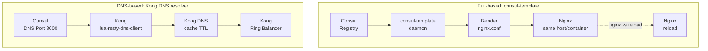
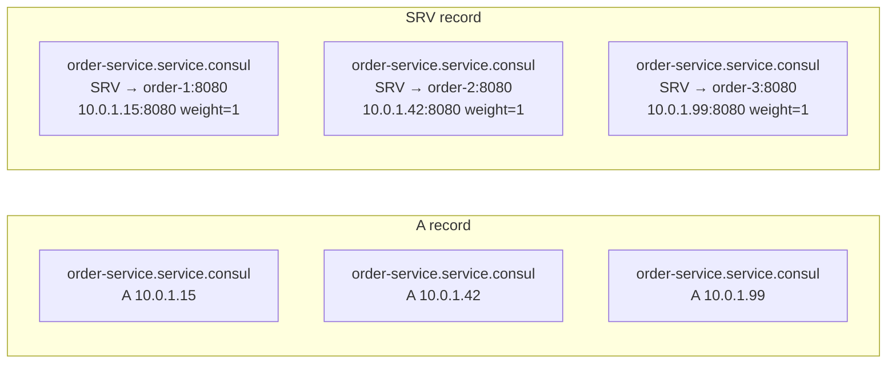
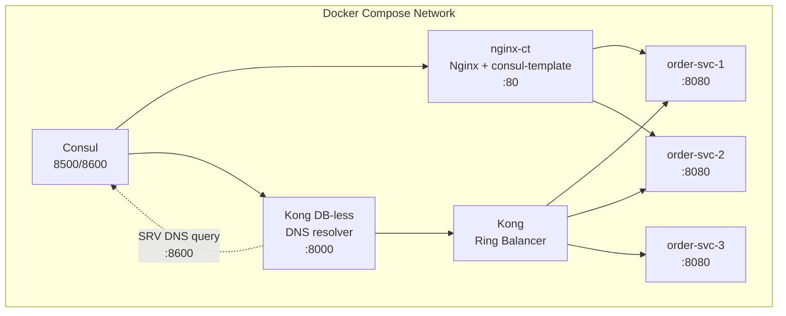

# Day 18: Integrating Nginx/Kong with Service Discovery

> **Thời lượng**: 2 giờ
> **Độ khó**: ⭐⭐⭐⭐
> **Prerequisites**: Day 13 (Kong Upstream, DNS resolver, SRV record), Day 17 (Consul Service Discovery Essentials)

---

## 1. Learning Objectives

Sau bài này, bạn sẽ có thể:

- Phân biệt 2 pattern service discovery: **Pull-based (consul-template)** và **DNS-based (Kong DNS resolver)**, biết khi nào dùng cái nào
- Configure consul-template để render Nginx upstream config từ Consul registry, xử lý reload với debounce/splay
- Configure Kong DNS resolver trỏ tới Consul DNS port (8600), hiểu TTL-based cache và stale TTL fallback
- Phân biệt A record vs SRV record, hiểu tại sao SRV bắt buộc cho service multi-port
- Thiết kế failure scenario: Consul down, DNS stale, reload race condition, và cách mitigate
- Compare service discovery approaches: consul-template + Nginx vs Kong DNS vs Consul Connect/Envoy vs Kubernetes Service
- Implement full lab Docker Compose: Consul + Nginx + consul-template + Kong DB-less + scale/failover

---

## 2. The Problem

> **Scenario — e-commerce platform với auto-scaling**

Bạn vận hành hệ thống e-commerce gồm 8 microservices, mỗi service có 2-5 replicas tự động scale theo load (Kubernetes HPA hoặc ECS auto-scaling). Sau mỗi deploy hoặc scale event, upstream IP/port thay đổi.

**Hai vấn đề cần giải quyết:**

1. **Nginx upstream config cũ**: Nginx đọc upstream IP từ config file tại startup. Khi order-service scale từ 3 replica lên 5 replica, Nginx không tự biết — config vẫn chỉ có 3 IP cũ.

2. **Kong target registry manual**: Bạn phải `POST /upstreams/.../targets` mỗi khi thêm replica mới. Với 8 service × 5 replica = 40 target, việc quản lý thủ công là không khả thi.

**Pain points thực tế:**

- Deploy order-service v2 → 3 replica mới có IP mới → Nginx gửi traffic vào IP cũ (stale) → 502
- Consul health check deregister instance → DNS record biến mất → Kong vẫn resolve IP cũ (DNS TTL chưa expire) → 502
- consul-template reload Nginx mỗi giây khi service flap nhiều lần → Nginx worker crash
- Kong DNS resolver trỏ sai nameserver → query public DNS → leak internal service name ra ngoài

**Tại sao không hardcode IP?**

```
ANTI-PATTERN: order-service có IP 10.0.1.15 hardcode trong nginx.conf
→ Khi pod bị kill và reschedule → IP mới là 10.0.1.42 → Nginx không biết
→ Fix: restart Nginx (downtime) hoặc reload (risk of misconfig)
→ Better: dùng Consul DNS hoặc consul-template
```

---

## 3. Core Concepts

### 3.1 Hai Pattern Service Discovery



**Pattern 1 — Pull-based (consul-template)**:
- Daemon chạy cùng host/container với Nginx, hoặc share filesystem và có cơ chế reload hợp lệ
- Query Consul API → render Nginx upstream config file
- Execute `nginx -s reload` khi config thay đổi
- Nginx reload → áp dụng upstream mới

**Pattern 2 — DNS-based (Kong DNS resolver)**:
- Kong dùng `lua-resty-dns-client` query DNS trực tiếp
- Consul expose DNS service trên port 8600
- Kong cache DNS record theo TTL
- Không cần reload — balancer resolve mỗi lần cần

### 3.2 A Record vs SRV Record



| Tiêu chí | A record | SRV record |
|---|---|---|
| Trả về | Chỉ IP | IP + Port + Weight |
| Use case | Single-port service | Multi-port service, service discovery |
| Kong support | OK (nhưng phải hardcode port) | **Recommended** (port từ SRV) |
| Consul health | Không mang weight | Có weight trong record |
| TTL behavior | Standard TTL | Standard TTL |

**Kong với A record**: `Service.host = order-service.service.consul`, nhưng Kong không biết port → phải hardcode port trong target hoặc dùng `upstream`.

**Kong với SRV record**: `Service.host = order-service.service.consul`, Consul trả về `target:port` từ SRV → Kong resolve chính xác cả IP và port.

### 3.3 Consul DNS Health Filtering

Consul DNS health filtering là cấu hình ở Consul agent, không phải query-string trong DNS name. Trong production, bật `dns_config.only_passing=true` nếu gateway chỉ được nhận instance `passing`.

```
# DNS response theo dns_config.only_passing của Consul agent
dig @127.0.0.1 -p 8600 order-service.service.consul

# API query mới có filter per-request
curl 'http://127.0.0.1:8500/v1/health/service/order-service?passing=true'

# SRV record cũng tuân theo DNS health policy của Consul agent
dig @127.0.0.1 -p 8600 order-service.service.consul SRV
```

**Kong**: Nếu muốn Kong chỉ resolve passing instance, trỏ `KONG_DNS_RESOLVER` tới Consul DNS agent đã bật `only_passing=true`. Không dùng cú pháp `?passing` trong `Service.host`.

---

## 4. How It Works Internally

### 4.1 consul-template Lifecycle

```
consul-template watch loop:
┌─────────────────────────────────────────────────────────────┐
│ 1. WATCH: Long-poll Consul catalog/api/services             │
│    Endpoint: GET /v1/catalog/service/<name>                 │
│    Wait param: ?wait=10s&index=<last_index>                │
│    → Consul trả changes kể từ last_index (blocking query) │
│                                                             │
│ 2. RENDER: Template → Nginx upstream config                 │
│    Template: /etc/consul-template/nginx.ctmpl               │
│    Output:   /etc/nginx/conf.d/upstream.conf                │
│    Template language: Go text/template                      │
│                                                             │
│ 3. VALIDATE: nginx -t (syntax check)                       │
│    → Nếu fail: không reload, log error, retry              │
│                                                             │
│ 4. EXECUTE: command = "nginx -s reload"                    │
│    SIGHUP gửi đến Nginx master process                     │
│    Master gracefully terminate worker (draining)             │
│    Master spawn worker mới với config mới                   │
└─────────────────────────────────────────────────────────────┘
```

**Debounce và Splay**:

```
Scenario: order-service flap 5 lần trong 2 giây
→ Không debounce: 5 lần reload → Nginx worker restart liên tục
→ Có debounce (5s): chỉ reload 1 lần sau 5s không có thay đổi
→ Có splay (2s): reload lần 2 bắt đầu sau 2s splay

consul-template config:
  wait { min = "2s", max = "10s" }   # debounce window
  splay = "2s"                         # random delay trước reload
```

**Race Condition khi service flap nhanh**:

```
Timeline không có debounce:
t=0s    consul-template: render upstream.conf (2 instance)
t=0.1s  Instance 3 register → Consul notify
t=0.2s  consul-template: render (3 instance) → reload
t=0.3s  Instance 1 deregister → Consul notify
t=0.4s  consul-template: render (2 instance) → reload  ← race!
t=0.5s  Instance 2 deregister → Consul notify
t=0.6s  consul-template: render (1 instance) → reload
t=0.7s  Instance 1 register lại → reload
→ 4 reload trong 0.7s → potential connection reset

Timeline có debounce (wait 5s):
t=0s    Change detected → start debounce timer
t=0.1s  Instance 3 register → reset debounce timer
t=0.2s  ...
t=0.3s  Instance 1 deregister → reset debounce timer
t=0.4s  ...
t=0.5s  Instance 2 deregister → reset debounce timer
t=0.6s  Instance 1 register → reset debounce timer
t=5.6s  Debounce timer fires → single reload với final state
→ 1 reload thay vì 4
```

### 4.2 Kong DNS Client — lua-resty-dns-client

```
Kong DNS resolution flow:
┌──────────────────────────────────────────────────────────────┐
│ 1. REQUEST arrives at Kong                                    │
│ 2. Kong checks: is host a Consul DNS name?                    │
│    → Check: host ends with .service.consul?                   │
│                                                              │
│ 3. Kong queries DNS: @<consul-ip>:8600                       │
│    Query type: SRV → returns {IP, Port, Weight}              │
│                                                              │
│ 4. DNS cache lookup:                                          │
│    Cache hit + TTL not expired → return cached record          │
│    Cache hit + TTL expired → return stale (if within stale TTL)│
│    Cache miss → query DNS server, cache result                │
│                                                              │
│ 5. Ring balancer: use resolved IPs                           │
│    (Day 13 ring balancer logic)                               │
└──────────────────────────────────────────────────────────────┘
```

**Kong DNS TTL behavior**:

```
SRV record TTL = 30s
KONG_DNS_STALE_TTL = 4s  (lab override; production default thường cao hơn)

Timeline:
t=0s    Kong resolve order-service.service.consul → IPs [A, B, C], cached
t=30s   TTL expire
t=30-34s Cache stale (stale TTL = 4s)
         → Kong return stale IPs [A, B, C]
         → Simultaneously query DNS in background
         → Background query success → cache updated
         → Background query fail → keep returning stale until 34s
t=34s   Stale TTL expire
         → Kong BLOCKS request, re-queries DNS
         → If DNS OK → continue
         → If DNS FAIL → return error (no fallback)
```

**Stale TTL là cứu cánh khi Consul quá tải hoặc network blip**:
- Default 4s stale → service tiếp tục hoạt động với DNS cũ
- Nếu stale TTL = 0 → Kong fail ngay khi DNS error → outage

### 4.3 Kong Upstream + DNS — Integration with Day 13

Day 13 đã học Kong upstream ring balancer. Với DNS-based discovery:

```
Service: order-service
  host: order-service.service.consul
  (NO upstream entity — DNS resolver tự phân phối)

Upstream: order-upstream (optional, nếu cần health check)
  healthchecks.active: probe DNS name → order-service.service.consul
  targets: dynamic via SRV record from Consul

Request flow:
  Client → Kong → DNS resolve order-service.service.consul → [10.0.1.15:8080, 10.0.1.42:8080]
              → Ring balancer chọn target
              → upstream request
```

**Service.host = DNS name vs Upstream name (từ Day 13)**:

| Config | Load balancing | Health check | DNS support |
|---|---|---|---|
| `Service.host = 10.0.1.15:8080` | Single target | Via upstream | No |
| `Service.host = order-upstream` | Via upstream ring | Kong active HC | No |
| `Service.host = order-service.service.consul` | Via DNS resolver | Consul HC + Kong passive | **Yes (SRV)** |

---

## 5. Hands-on Lab

**Mục tiêu**: Dựng Consul + Nginx + consul-template + Kong DB-less, observe service scale/failover qua DNS và config reload.

Xem `exercises.md` cho chi tiết step-by-step.

**Tóm tắt architecture:**



**Lab summary:**

- **Exercise 0**: Consul + 2 order replicas, Kong DB-less, `nginx-ct`
- **Exercise 1**: Consul DNS resolution verify
- **Exercise 2**: Nginx + consul-template render upstream.conf
- **Exercise 3**: Kong DB-less với `KONG_DNS_RESOLVER`, Service.host = DNS name
- **Exercise 4**: Kill 1 replica, Consul deregister, Kong DNS stale TTL fallback
- **Exercise 5**: consul-template reload debounce/splay behavior
- **Exercise 6**: Tag-based filter (`prod.<service>.service.consul`) trong Consul DNS
- **Exercise 7**: Kong upstream + DNS target + active health check

---

## 6. Trade-offs Analysis

### 6.1 Service Discovery Pattern Comparison

| Pattern | Nginx | Kong | Scalability | Reload needed | Consul dependency | Complexity |
|---|---|---|---|---|---|---|
| **consul-template + Nginx** | ✓ Native | ✗ | 1 Nginx/node | Yes (SIGHUP) | High | Trung bình |
| **Kong DNS resolver + Consul** | ✗ | ✓ Native | Any | **No** | High | Thấp |
| **Consul Connect (Envoy sidecar)** | ✗ | ✗ | Cluster-wide | No | Very High | Cao |
| **Kubernetes Service (DNS)** | ✗ | ✗ | K8s cluster | No | K8s only | Thấp |
| **Static config (hardcode IP)** | ✓ | ✓ | Kém | Yes (restart) | None | Thấp |
| **Nginx resolver + dns_sd** | ✓ (1.25+) | ✗ | Limited | No | Low | Trung bình |

### 6.2 consul-template vs Kong DNS — Chi tiết

| Tiêu chí | consul-template (Nginx) | Kong DNS resolver |
|---|---|---|
| **Update mechanism** | Render file → reload Nginx | DNS query → cache TTL |
| **Latency to detect change** | debounce: 2-10s | TTL-based: 0s (stale serving) |
| **Downtime risk** | Reload race condition | None (no restart) |
| **Stale data window** | Debounce delay (2-10s) | TTL + stale TTL (e.g., 30+4s) |
| **Consul load** | Low (blocking query) | Medium (per-request DNS) |
| **Port discovery** | Template tự thêm port | SRV record mang port |
| **Health-aware** | Consul catalog (via API) | Consul DNS `only_passing` |
| **Multiple service** | File template phức tạp | SRV record per service |
| **Consul down impact** | Không render config → stale | Stale DNS serving → graceful |
| **When to use** | Nginx reverse proxy | Kong API Gateway |

### 6.3 Hidden Costs & Anti-patterns

**consul-template hidden costs:**
```
1. Nginx reload latency: ~100-500ms (worker graceful shutdown)
2. File watch CPU: consul-template watch Consul liên tục
3. Template render: Go template parsing mỗi lần thay đổi
4. Pull-based stale time: debounce 2-10s = service chưa có trong config
```

**Kong DNS hidden costs:**
```
1. DNS UDP truncation: >13 SRV records → fallback TCP DNS
2. TTL=0: mỗi request resolve → Consul load tăng ~RPS
3. Stale TTL too low: Consul blip → service outage
4. Resolver misconfig: forward về public DNS → service name leak
```

**Anti-patterns:**

```
ANTI-PATTERN 1: consul-template reload mỗi giây
  → Root cause: debounce/splay không configured
  → Fix: cấu hình wait { min = "5s", max = "15s" }, splay = "3s"

ANTI-PATTERN 2: Dùng A record cho multi-port service
  → order-service có API port 8080 và gRPC port 9090
  → A record chỉ trả IP, Kong không biết port nào
  → Fix: dùng SRV record

ANTI-PATTERN 3: TTL=0 cho all Consul records
  → Consul phải answer DNS cho mỗi request
  → Load = RPS × number of services
  → Fix: TTL=30s cho dynamic service, TTL=3600s cho static

ANTI-PATTERN 4: Kong DNS resolver trỏ public DNS
  → query order-service.service.consul → forward to 8.8.8.8 → NXDOMAIN
  → Fix: KONG_DNS_RESOLVER=<consul-ip>:8600

ANTI-PATTERN 5: Không có Consul health check monitoring
  → Service flap không bị phát hiện sớm
  → Fix: Prometheus metric từ Consul telemetry endpoint

ANTI-PATTERN 6: Hardcode IP trong nginx.conf khi đã có Consul
  → Inverse of the problem — đi ngược lại service discovery
```

---

## 7. Best Practices & Best Solution

### 7.1 Recommended Architecture

```
Production: Nginx edge + Kong + Consul
┌─────────────────────────────────────────────────────────────┐
│                     Internet                                  │
│                          ↓                                    │
│   ┌──────────────────────────────────────────────────────┐   │
│   │  Nginx Edge (reverse proxy, TLS termination)         │   │
│   │  upstream: kong_cluster                               │   │
│   │  → Consul-template render /etc/nginx/conf.d/...conf │   │
│   └──────────────────────────────────────────────────────┘   │
│                          ↓                                    │
│   ┌──────────────────────────────────────────────────────┐   │
│   │  Kong Gateway                                        │   │
│   │  KONG_DNS_RESOLVER=consul:8600                      │   │
│   │  Service.host = <service>.service.consul (SRV)       │   │
│   │  + Kong upstream health check (active)               │   │
│   └──────────────────────────────────────────────────────┘   │
│                          ↓                                    │
│   ┌──────────────────────────────────────────────────────┐   │
│   │  Consul Service Registry                             │   │
│   │  Port 8500: HTTP API                                │   │
│   │  Port 8600: DNS (SRV + A record)                    │   │
│   │  Health check: HTTP /healthz every 10s               │   │
│   └──────────────────────────────────────────────────────┘   │
│                          ↓                                    │
│              Microservices (order, payment, ...)              │
└─────────────────────────────────────────────────────────────┘
```

**Tại sao dùng cả hai?**

- **Nginx**: Edge proxy cần TLS termination, static asset caching, rate limiting ở edge
- **Kong**: API Gateway cần auth, plugin, upstream health check chủ động
- **Consul**: Nguồn truth cho cả hai — single source of truth

### 7.2 Consul Configuration cho DNS-based Discovery

```hcl
# Consul server/agent config
{
  "datacenter": "dc1",
  "data_dir": "/opt/consul/data",
  "ui_config": {
    "enabled": true
  },
  "ports": {
    "dns": 8600     # Consul DNS port
  },
  "dns_config": {
    "allow_stale": true,          # Cho phép DNS query từ any Consul server
    "max_stale": "10s",           # Maximum stale data
    "service_ttl": {
      "*": "30s"                  # TTL cho service DNS
    },
    "only_passing": false         # true = chỉ trả passing instance
  },
  "enable_central_service_config": true,
  "service": {
    "name": "consul"
  }
}
```

### 7.3 Kong DNS Environment Variables

```bash
# Kong container environment
KONG_DATABASE=off
KONG_DECLARATIVE_CONFIG=/kong/declarative/kong.yml
KONG_ADMIN_LISTEN=0.0.0.0:8001
KONG_PROXY_LISTEN=0.0.0.0:8000

# DNS resolver — trỏ tới Consul DNS
KONG_DNS_RESOLVER=consul:8600

# DNS TTL tuning
KONG_DNS_STALE_TTL=4         # seconds — lab override; production có thể tăng 300-3600s
KONG_DNS_NOT_FOUND_TTL=1      # seconds — NXDOMAIN cache
KONG_DNS_ERROR_TTL=1          # seconds — DNS error cache

# Optional: hosts file và resolv.conf override
# KONG_DNS_HOSTSFILE=/etc/hosts
# KONG_DNS_ORDER=SRV,A,AAAA,CNAME
```

### 7.4 consul-template HCL Config

```hcl
# /etc/consul-template.d/nginx.ctmpl.hcl

consul {
  address = "consul:8500"
  retry {
    attempts = 5
    backoff = "250ms"
  }
}

template {
  source      = "/etc/consul-template/nginx.ctmpl"
  destination = "/etc/nginx/conf.d/upstream.conf"
  command     = "sh -c 'nginx -t && nginx -s reload'"
  command_timeout = "30s"

  # Debounce: chờ tối thiểu 3s sau lần thay đổi cuối
  wait {
    min = "3s"
    max = "10s"
  }

  # Random delay để tránh thundering herd
  splay = "2s"
}

# Reload signal — SIGHUP cho reload Nginx config
reload_signal = "SIGHUP"

# Log
log_level = "info"
pid_file   = "/var/run/consul-template.pid"
```

---

## 8. Performance Considerations

### 8.1 Benchmark Methodology

```
Environment: Docker Compose, single node
CPU: 4 vCPU
RAM: 8GB
Consul: 1 server node
Nginx: 1.25-alpine
Kong: 3.7
consul-template: 0.34+
Order replicas: 5 (Python FastAPI)
Test duration: 60s warmup + 120s measure
Tool: wrk
Connections: 100, Threads: 4
Payload: 1KB JSON
TLS: Off
```

> Lưu ý: số liệu dưới đây chỉ dùng để tham khảo. Kết quả thực tế phụ thuộc vào hardware, kernel, network, payload, plugin, và Consul cluster size.

### 8.2 consul-template Reload Latency

| Config | Reload latency (p50) | Reload latency (p95) | Notes |
|---|---|---|---|
| No debounce | ~80ms | ~150ms | 1 reload mỗi change |
| debounce 5s, splay 2s | ~200ms | ~400ms | Reload bị trì hoãn 3-7s |
| debounce 10s, splay 5s | ~300ms | ~600ms | Chậm phát hiện change |

**Overhead khi reload Nginx**:
- Worker graceful shutdown: ~100-500ms (in-flight request được drain)
- Config parse + re-bind: ~50-100ms
- Total: ~150-600ms downtime ở per-worker level (toàn hệ thống: 0)

### 8.3 Kong DNS Resolution Latency

| DNS config | Resolve latency (p50) | Resolve latency (p99) | Consul load |
|---|---|---|---|
| TTL=0 (no cache) | ~3ms | ~8ms | RPS × services |
| TTL=30s (default) | ~0.1ms | ~0.5ms | Low (cache hit) |
| TTL=300s | ~0.05ms | ~0.2ms | Very low |

**DNS UDP truncation threshold**: DNS response > 512 bytes (UDP) → fallback TCP DNS (thêm ~1ms latency).

### 8.4 Bottleneck Analysis

```
Nginx + consul-template bottleneck:
1. Consul blocking query timeout → consul-template retry → config stale
2. Template render error → nginx -t fail → no reload
3. Nginx worker connections chưa drain hết → in-flight request bị reset
4. Multiple reload trong short window → "duplicate listen" error

Kong DNS bottleneck:
1. Consul DNS port 8600 quá tải → DNS timeout → Kong dùng stale (tốt)
2. SRV TTL=0 → mỗi request query Consul → Consul load = Kong RPS
3. lua-resty-dns-client LRU cache full → eviction → cache miss → query DNS
4. DNS UDP truncation → fallback TCP → thêm latency
```

### 8.5 Tuning Parameters

```bash
# consul-template: tăng debounce window khi service thay đổi thường xuyên
wait { min = "10s", max = "30s" }
splay = "5s"

# Kong DNS: tăng stale TTL cho production stability
KONG_DNS_STALE_TTL=8        # seconds (lab override)
KONG_DNS_NOT_FOUND_TTL=5    # seconds (default: 1)
KONG_DNS_ERROR_TTL=5        # seconds (default: 1)

# Consul DNS: giảm TTL cho service discovery nhanh hơn
"dns_config": {
  "service_ttl": { "*": "10s" }  # cho phép nhanh phát hiện thay đổi
}

# Nginx: worker graceful shutdown để drain connections
worker_shutdown_timeout 30s;
```

---

## 9. Troubleshooting Checklist

### Checklist 1: consul-template không reload Nginx

```
Symptom: Consul có service mới nhưng Nginx upstream.conf không cập nhật

Root causes:
□ consul-template process không chạy
  → docker compose ps | grep nginx-ct
  → Fix: restart daemon

□ Template render lỗi (syntax error)
  → consul-template log: docker logs nginx-ct
  → Fix: sửa template syntax, check nginx.ctmpl

□ nginx -t fail trước reload
  → Template render IP không hợp lệ
  → Fix: validate template, handle missing IP case

□ Debounce delay đang active
  → Change detected nhưng chưa fire reload (trong debounce window)
  → Fix: đợi debounce window hết hoặc config lại

□ Permission error
  → consul-template không có quyền ghi /etc/nginx/conf.d/
  → Fix: chmod 755 trên destination directory
```

### Checklist 2: Kong DNS resolve fail

```
Symptom: Kong trả 502, log có "dns lookup" error

Root causes:
□ KONG_DNS_RESOLVER sai
  → Kong log: docker logs kong | grep dns
  → Fix: KONG_DNS_RESOLVER=consul:8600

□ Consul DNS port 8600 không accessible từ Kong
  → docker exec kong dig @consul -p 8600 order-service.service.consul SRV
  → Fix: check Docker network, firewall

□ SRV record không tồn tại (chỉ có A record)
  → docker exec kong dig @consul -p 8600 order-service.service.consul SRV
  → Fix: Enable Consul DNS SRV record: service registration phải có port

□ Consul DNS chưa enable
  → Check Consul config: ports.dns = 8600
  → Fix: restart Consul với DNS port enabled

□ Kong không reload sau DNS change (stale cache)
  → docker exec kong curl -s http://localhost:8001/cache | jq
  → Fix: restart Kong container
```

### Checklist 3: Consul down impact

```
Symptom: Consul server không available

consul-template impact:
□ consul-template blocking query timeout → retry với backoff
□ Nếu Consul down > retry attempts → consul-template exit (với default config)
□ upstream.conf không re-render → stale IP → 502/503

Kong DNS impact:
□ DNS query fail → stale TTL kicks in (lab override 4s)
□ Sau 4s: Kong trả error (503) hoặc fail ngẫu nhiên
□ Mitigation: tăng KONG_DNS_STALE_TTL=30s để service tiếp tục hoạt động

Recovery:
1. Consul leader election hoàn thành
2. consul-template: auto-reconnect (retry config)
3. Kong DNS: stale cache vẫn valid → zero-downtime
```

### Checklist 4: DNS stale — service IP đổi nhưng vẫn resolve IP cũ

```
Symptom: Deploy xong nhưng traffic vẫn đến IP cũ

Root causes:
□ TTL quá dài → Kong cache chưa expire
  → Check: dig @consul -p 8600 order-service.service.consul SRV (TTL field)
  → Fix: giảm Consul service TTL, restart Kong

□ Kong shared memory DNS cache full
  → lua_shared_dict kong_dns_cache size quá nhỏ
  → Fix: tăng size trong Kong config

□ Consul DNS stale data
  → Consul allow_stale = true → follower trả dữ liệu cũ
  → Fix: max_stale quá dài → giảm hoặc query leader trực tiếp
```

### Checklist 5: Kong + Consul SRV — service bị deregister nhưng vẫn resolve

```
Symptom: Service kill rồi nhưng Kong vẫn gửi traffic vào đó

Root causes:
□ Consul health check interval dài (30s) → deregister chậm
□ Kong DNS stale TTL = 4s → stale IP được serve trong 4s
□ Kong passive health check chưa phát hiện target unhealthy

Fix:
1. Giảm Consul health check interval: "Check": { "Interval": "5s" }
2. Giảm Kong DNS stale TTL: KONG_DNS_STALE_TTL=1
3. Bật Kong active health check (Day 13): probe trực tiếp target
4. Dùng Consul DNS health filter: only_passing=true
```

---

## 10. Completion Checklist

Tự kiểm tra sau khi hoàn thành Day 18:

- [ ] Giải thích được sự khác biệt giữa pull-based (consul-template) và DNS-based (Kong DNS resolver)
- [ ] Configure được consul-template HCL config với debounce/splay, render Nginx upstream.conf
- [ ] Configure được Kong DNS resolver với `KONG_DNS_RESOLVER=consul:8600`
- [ ] Phân biệt được A record vs SRV record, hiểu tại sao SRV bắt buộc cho service discovery
- [ ] Chạy được lab Docker Compose: Consul + Nginx + consul-template + Kong DB-less
- [ ] Scale order replicas (2 → 3) và quan sát Kong DNS re-resolve không cần reload
- [ ] Kill 1 replica và observe Consul deregister + Kong stale TTL fallback
- [ ] Configure được Consul DNS `only_passing` để chỉ resolve healthy instance
- [ ] Debug được: consul-template không reload, Kong DNS resolve fail, Consul down impact
- [ ] Hiểu trade-off: reload latency vs DNS stale, pull vs push, TTL tuning

---

## 11. References

- [Consul Template Documentation](https://developer.hashicorp.com/consul/docs/nia/configuration)
- [Consul Template Template Configuration](https://developer.hashicorp.com/consul/docs/nia/configuration#template-configuration)
- [Kong DNS Resolver — Internal Implementation](https://github.com/kong/kong/blob/master/kong/dns/README.md)
- [Kong Configuration Reference — DNS](https://docs.konghq.com/gateway/latest/reference/configuration/#dns)
- [lua-resty-dns-client — Kong DNS Library](https://github.com/kong/lua-resty-dns-client)
- [Consul DNS Interface](https://developer.hashicorp.com/consul/docs/discovery/services)
- [Consul Service Discovery & Health Checking](https://developer.hashicorp.com/consul/docs/discovery/checks)
- [Nginx DNS Resolution with resolver directive](https://nginx.org/en/docs/http/ngx_http_core_module.html#resolver)
- [NGINX Inc Blog — Zero-Downtime Reloads](https://www.nginx.com/)
- [HashiCorp Consul — Anti-Patterns in Service Discovery](https://developer.hashicorp.com/consul/docs/install/perform-air-gapping)
- [SRV Record — RFC 2782](https://www.rfc-editor.org/rfc/rfc2782)

---

## Recap

Day 18 tổng hợp kiến thức từ Day 13 (Kong Upstream, DNS resolver, SRV record) và Day 17 (Consul registry, DNS port) thành 2 pattern tích hợp service discovery:

- **consul-template (Pull-based)**: Daemon watch Consul → render Nginx upstream.conf → `nginx -s reload`. Cần debounce/splay để tránh reload storm. Trade-off: reload latency 100-500ms, nhưng Nginx không cần restart.

- **Kong DNS resolver (DNS-based)**: Kong dùng `lua-resty-dns-client` query Consul DNS port 8600, cache theo TTL, fallback stale TTL khi DNS error. Không cần reload — dynamic resolution mỗi request. Trade-off: phụ thuộc TTL và Consul DNS availability.

- **Key insight**: Không có giải pháp hoàn hảo. consul-template tốt cho Nginx edge (stability, debounce control), Kong DNS tốt cho service-level discovery (dynamic, no reload). Production nên dùng cả hai: Consul là single source of truth cho cả Nginx và Kong.

---

## Preview Day 19

**Day 19: Production Security Hardening**

Ngày tiếp theo sẽ bảo mật hệ thống Gateway ở production level:

- Admin API security: bind localhost, mTLS, RBAC, JWT for Admin API
- Secret management: Kong Vault integration, `KONG_DECLARATIVE_CONFIG` sensitive field encryption
- TLS hardening: cipher suite audit, TLS 1.3 only, certificate rotation
- Network boundary: Consul ACL, Kong consumer isolation, Nginx internal network separation
- Rate limiting escalation: per-consumer, per-service, per-route
- OAuth2 + mTLS deep dive cho B2B API
