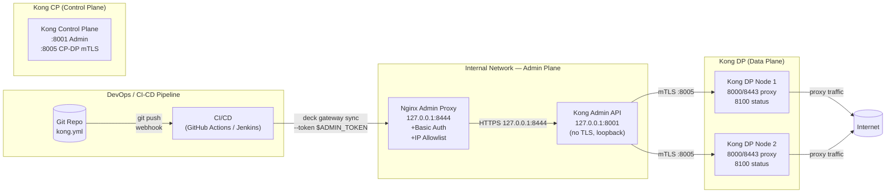

# Day 19 — Production Security Hardening: Deep Dive Reference

> File này chứa deep-dive reference cho Day 19: full config snippet, Kong vault matrix, threat model table, compliance checklist. Đọc kèm `lesson.md`.

---

## A. Full Nginx Hardening Config Reference

### A.1 `nginx.conf` — Global Security Settings

```nginx
user  nginx;
worker_processes  auto;
worker_rlimit_nofile 65535;
error_log  /var/log/nginx/error.log warn;
pid        /var/run/nginx.pid;

events {
    worker_connections  4096;
    use                 epoll;       # Linux: high-performance event model
    multi_accept        on;
}

http {
    include       /etc/nginx/mime.types;
    default_type  application/octet-stream;

    # === LOGGING SECURITY ===
    log_format secure
        '$remote_addr - $remote_user [$time_local] '
        '"$request" $status $body_bytes_sent '
        '"$http_referer" '
        '"$http_user_agent" '
        'rt=$request_time '
        'uip=$http_x_forwarded_for '
        'gzip=$gzip_ratio';

    # NOTE: Authorization/Authorization header NOT logged
    # NOTE: query_string NOT logged (may contain sensitive token)

    access_log  /var/log/nginx/access.log secure;

    # === SECURITY HEADERS (HTTP block — inherit to all server blocks) ===
    add_header X-Frame-Options        "DENY"              always;
    add_header X-Content-Type-Options "nosniff"           always;
    add_header X-XSS-Protection       "1; mode=block"     always;
    add_header Referrer-Policy        "strict-origin"     always;

    # === PROTOCOL & BUFFER LIMITS ===
    server_tokens  off;                            # Khong expose Nginx version
    sendfile      on;
    tcp_nopush    on;                              # Optimized sendfile
    tcp_nodelay   on;                              # Low-latency TCP

    # Client protection
    client_max_body_size      10m;
    client_body_buffer_size  128k;
    client_header_buffer_size 1k;
    large_client_header_buffers 4 8k;             # JWT/Cookie headers
    keepalive_timeout        65s;
    keepalive_requests       1000;

    # Timeout hardening (chong Slowloris)
    client_body_timeout   30s;
    client_header_timeout 10s;
    send_timeout          30s;

    # Connection limiting
    limit_conn_zone $binary_remote_addr zone=conn_limit:10m;

    # === RATE LIMITING ZONES ===
    # Anonymous: 30r/s (unauthenticated)
    limit_req_zone $binary_remote_addr zone=anon_limit:10m rate=30r/s;
    # Authenticated: 100r/s (JWT/key-auth)
    limit_req_zone $http_authorization zone=auth_limit:10m rate=100r/s;
    # API tier: 5r/s (premium partner)
    limit_req_zone $http_x_partner_id zone=partner_limit:10m rate=5r/s;

    # === REAL-IP (when behind LB/CDN) ===
    set_real_ip_from 10.0.0.0/8;
    set_real_ip_from 172.16.0.0/12;
    set_real_ip_from 192.168.0.0/16;
    # Cloudflare IP ranges (tham khao cloudflare)
    set_real_ip_from 103.21.244.0/22;
    set_real_ip_from 103.22.200.0/22;
    real_ip_header X-Forwarded-For;
    real_ip_recursive on;

    # === GEO WHITELIST / BLACKLIST ===
    geo $whitelist_key {
        default         $binary_remote_addr;
        127.0.0.0/8     "";
        10.0.0.0/8      "";
        172.16.0.0/12   "";
        192.168.0.0/16  "";
    }

    geo $blacklist_ip {
        default     0;
        1.2.3.4    1;   # Block IP cu the
        5.6.0.0/16 1;   # Block subnet
    }

    # === SSL GLOBAL ===
    ssl_protocols TLSv1.2 TLSv1.3;
    ssl_prefer_server_ciphers off;
    ssl_session_cache   shared:SSL:50m;
    ssl_session_timeout 1d;
    ssl_session_tickets off;
    ssl_buffer_size     4k;

    # === INCLUDE SERVER BLOCKS ===
    include /etc/nginx/conf.d/*.conf;
}
```

### A.2 Nginx Edge Server Block (Public Proxy)

```nginx
# File: /etc/nginx/conf.d/kong-proxy.conf

# === UPSTREAM: KONG PROXY ===
upstream kong_backend {
    least_conn;

    # Internal Kong proxy (hybrid mode DP)
    server kong-dp-1:8000 weight=100;
    server kong-dp-2:8000 weight=100;

    keepalive 64;   # Connection pooling to Kong
}

# === PUBLIC HTTPS SERVER ===
server {
    listen      443 ssl;
    http2       on;
    server_name api.example.com;

    # TLS Certificate
    ssl_certificate     /etc/nginx/ssl/api.example.com.crt;
    ssl_certificate_key /etc/nginx/ssl/api.example.com.key;
    ssl_trusted_certificate /etc/nginx/ssl/ca-chain.crt;

    # TLS 1.2/1.3 + Modern cipher
    ssl_protocols TLSv1.2 TLSv1.3;
    ssl_ciphers ECDHE-ECDSA-AES128-GCM-SHA256:ECDHE-RSA-AES128-GCM-SHA256:ECDHE-ECDSA-AES256-GCM-SHA384:ECDHE-RSA-AES256-GCM-SHA384:ECDHE-ECDSA-CHACHA20-POLY1305:ECDHE-RSA-CHACHA20-POLY1305:DHE-RSA-AES128-GCM-SHA256:DHE-RSA-AES256-GCM-SHA384;
    ssl_prefer_server_ciphers off;

    # OCSP Stapling
    ssl_stapling on;
    ssl_stapling_verify on;
    resolver 8.8.8.8 8.8.4.4 valid=300s;
    resolver_timeout 5s;

    # HSTS (63072000s = 2 years)
    add_header Strict-Transport-Security "max-age=63072000; includeSubDomains; preload" always;

    # Content Security Policy
    add_header Content-Security-Policy "default-src 'none'; frame-ancestors 'none';" always;

    # === RATE LIMITING (TIERED) ===
    location /api/v1/ {
        # Tier 1: Anonymous — 30r/s
        limit_req zone=anon_limit burst=50 nodelay;
        limit_req_status 429;
        limit_req_log_level warn;

        # Tier 2: Authenticated — 100r/s
        # (via map directive — xem ben duoi)

        # Connection limit chong Slowloris
        limit_conn conn_limit 100;

        proxy_pass         http://kong_backend;
        proxy_http_version 1.1;

        # Headers
        proxy_set_header Host              $host;
        proxy_set_header X-Real-IP        $remote_addr;
        proxy_set_header X-Forwarded-For  $proxy_add_x_forwarded_for;
        proxy_set_header X-Forwarded-Proto $scheme;
        proxy_set_header X-Forwarded-Host $host;

        # Connection keepalive to upstream
        proxy_set_header Connection "";

        # Timeout
        proxy_connect_timeout 5s;
        proxy_send_timeout    30s;
        proxy_read_timeout    30s;

        # Buffering
        proxy_buffering    on;
        proxy_buffer_size  4k;
        proxy_buffers      8 4k;
    }

    location /api/v2/premium/ {
        # Premium tier — 1000r/s
        limit_req zone=auth_limit burst=2000 nodelay;
        limit_req_status 429;

        limit_conn conn_limit 500;

        proxy_pass         http://kong_backend;
        proxy_http_version 1.1;
        proxy_set_header Host $host;
        proxy_set_header X-Real-IP $remote_addr;
        proxy_set_header X-Forwarded-For $proxy_add_x_forwarded_for;
    }

    location /internal/admin/ {
        # Internal admin — IP allowlist
        allow 10.0.0.0/8;
        allow 172.16.0.0/12;
        allow 192.168.0.0/16;
        deny all;

        limit_req zone=auth_limit burst=10 nodelay;
        limit_conn conn_limit 10;

        proxy_pass         http://kong_backend;
        proxy_http_version 1.1;
        proxy_set_header Host $host;
        proxy_set_header X-Real-IP $remote_addr;
    }
}

# === HTTP -> HTTPS REDIRECT ===
server {
    listen 80;
    server_name api.example.com;
    return 301 https://$host$request_uri;
}
```

### A.3 Nginx Admin API Proxy (Loopback Only)

```nginx
# File: /etc/nginx/conf.d/kong-admin-proxy.conf
# Chi accessible tu localhost / internal network

server {
    listen      127.0.0.1:8444 ssl;
    server_name kong-admin-internal;

    # TLS: self-signed cert (hoac internal CA)
    ssl_certificate     /etc/nginx/ssl/kong-admin.internal.crt;
    ssl_certificate_key /etc/nginx/ssl/kong-admin.internal.key;

    # Optional: mTLS client cert verification
    ssl_client_certificate /etc/nginx/ssl/internal-ca.crt;
    ssl_verify_client optional;

    # Basic Auth — bat buoc
    auth_basic "Kong Admin API — Internal Only";
    auth_basic_user_file /etc/nginx/.htpasswd_kong_admin;

    # IP allowlist — bat buoc
    allow 127.0.0.0/8;
    allow 10.0.0.0/8;
    allow 172.16.0.0/12;
    deny all;

    location / {
        proxy_pass         http://127.0.0.1:8001;
        proxy_http_version 1.1;

        proxy_set_header Host $host;
        proxy_set_header X-Real-IP $remote_addr;
        proxy_set_header X-Forwarded-For $proxy_add_x_forwarded_for;
        proxy_set_header X-Forwarded-Proto $scheme;

        # Strip server version headers
        proxy_hide_header Server;
        proxy_hide_header X-Kong-Admin-Latency;
        proxy_hide_header X-Kong-Response-Latency;

        proxy_connect_timeout 10s;
        proxy_send_timeout    60s;
        proxy_read_timeout    60s;
    }
}
```

---

## B. Kong Vault Integration Matrix

### B.1 Vault Reference Syntax

| Provider | Scheme | Syntax | Auth Method | Kong Version |
|---|---|---|---|---|
| Environment | `vault://env/` | `{vault://env/VAR_NAME}` | `os.getenv()` | 3.0+ |
| AWS SM | `vault://aws/secretsmanager/` | `{vault://aws/secretsmanager/secret-id}` | IAM role | 3.0+ (EE) |
| GCP SM | `vault://gcp/secretsmanager/` | `{vault://gcp/secretsmanager/secret-id}` | GCP IAM | 3.0+ (EE) |
| HashiCorp Vault | `vault://hcv/` | `{vault://hcv/kong/data/secret}` | Token/K8s SA/AppRole | 3.0+ (EE) |
| Custom Lua | `vault://custom/` | `{vault://custom/my-plugin/...}` | Plugin-defined | 3.0+ (plugin) |

### B.2 Kong Vault — kong.conf Configuration

```properties
# Vault provider: env (default)
vaults = env

# Hoac cau hinh nhieu provider:
# vaults = env,aws,gcp,hcv

# Vault sync rate (giay giua moi sync)
vault_sync_rate = 300       # default: 300s

# Vault HTTP timeout
vault_http_timeout = 2000   # default: 2000ms

# AWS Secrets Manager specific
vault_aws_region = ap-southeast-1
vault_aws_role = arn:aws:iam::123456789:role/kong-vault-role

# HashiCorp Vault specific
vault_hcv_host = https://vault.internal:8200
vault_hcv_mount = kong
vault_hcv_kv_version = 2
```

### B.3 Kong Vault — kong.yml Examples

```yaml
_format_version: "3.0"
_transform: true

# === VAULT PROVIDERS (Kong Enterprise) ===
# Note: Kong OSS chi ho tro vault://env
# Enterprise ho tro them AWS/GCP/HCV

# === CONSUMER + KEY AUTH with Vault reference ===
consumers:
  - username: mobile-app-prod
    keyauth_credentials:
      # Reference den env variable KONG_ENV_PROD_KEYAUTH
      - key: "{vault://env/KONG_ENV_PROD_KEYAUTH}"

  - username: partner-b2b-prod
    keyauth_credentials:
      # Reference den HashiCorp Vault KV v2
      - key: "{vault://hcv/kong/data/partner-b2b-api-key}"

  - username: internal-service
    jwt_credentials:
      - rsa_public_key: "{vault://env/INTERNAL_SERVICE_RSA_PUBLIC_KEY}"
        algorithm: RS256
        iss: internal-service
        rsa_public_key: "{vault://env/INTERNAL_SERVICE_RSA_PUBLIC_KEY}"

# === SERVICES with mTLS cert from Vault ===
services:
  - name: payment-gateway
    url: https://payment.internal:8443
    tls_verify: true
    # mTLS client cert tu Vault
    tls_cert: "{vault://env/PAYMENT_MTLS_CLIENT_CERT}"
    tls_key: "{vault://env/PAYMENT_MTLS_CLIENT_KEY}"
    ca_certificates:
      - "{vault://env/PAYMENT_INTERNAL_CA_CERT}"
    routes:
      - name: payment-route
        paths:
          - /api/payments
        plugins:
          - name: rate-limiting
            config:
              minute: 500
              policy: redis
              redis_host: redis.internal

plugins:
  # === RESPONSE TRANSFORMER: STRIP SENSITIVE HEADERS ===
  - name: response-transformer
    route: payment-route
    config:
      remove:
        headers:
          # Strip Kong internal headers
          - X-Kong-Upstream-Latency
          - X-Kong-Proxy-Latency
          - X-Kong-Admin-Latency
          - X-Kong-Response-Latency
          - Server
          - Via
      add:
        headers:
          - X-Frame-Options:DENY
          - X-Content-Type-Options:nosniff
          - Strict-Transport-Security:max-age=63072000;includeSubDomains
          - X-XSS-Protection:1; mode=block
          - Referrer-Policy:strict-origin-when-cross-origin
          - Permissions-Policy:camera=(),microphone=(),geolocation=()

  # === Bot Detection (Enterprise) ===
  - name: bot-detection
    route: payment-route
    config:
      allow: []
      deny:
        - curl
        - wget
        - python-requests
        - java/1.

  # === IP RESTRICTION for admin routes ===
  - name: ip-restriction
    route: admin-route
    config:
      allow:
        - 10.0.0.0/8
        - 172.16.0.0/12
        - 192.168.0.0/16
      deny: []

  # === Request Transformer: add consumer headers ===
  - name: request-transformer
    route: payment-route
    config:
      add:
        headers:
          - X-Internal-Request:true
          - X-Gateway:kong
```

---

## C. Kong Admin API Security — Architecture



**Admin API Security Matrix:**

| Attack Vector | Mitigation | Implementation |
|---|---|---|
| Admin API port 8001 public | Bind `127.0.0.1:8001` only | `kong.conf: admin_listen = 127.0.0.1:8001` |
| Credential brute-force | Basic Auth + IP allowlist | Nginx `auth_basic` + `allow/deny` |
| Token leak in CI/CD logs | GitHub Secrets / Vault CI | `--token ${{ secrets.KONG_ADMIN_TOKEN }}` |
| Token rotation | decK token với TTL | Kong Admin token: `validity=86400` |
| Malicious config push | decK `validate` pre-sync | `deck file validate --kong-addr http://localhost:8001` |
| Config drift | `deck gateway sync --select-tag prod` | Sync only tagged resources |

---

## D. Threat Model Table

### D.1 Threat Categories

| ID | Category | Threat | Attack Vector | Mitigation | Severity | OWASP Ref |
|---|---|---|---|---|---|---|
| T01 | External | DDoS volumetric | UDP flood, SYN flood, HTTP flood | Cloud WAF, rate limit, Cloud LB | Critical | API8:2023 |
| T02 | External | Credential stuffing | Leaked credential lists | Rate limit per IP, bot detection, MFA | High | API2:2023 |
| T03 | External | OWASP API1 Broken Object Level Authorization | IDOR via API endpoint | Kong ACL plugin, consumer scope | Critical | API1:2023 |
| T04 | External | Mass assignment | Manipulate object properties | Input validation, response transformer | High | API3:2023 |
| T05 | External | Unrestricted resource consumption | Payload size, nested depth | `client_max_body_size`, limit_req | High | API4:2023 |
| T06 | External | Admin API port scan | Nmap 8001/8444 public | Bind loopback, firewall, IP allowlist | Critical | API7:2023 |
| T07 | Internal | Lateral movement | Public Admin API, leaked token | Loopback bind, token rotation | Critical | API7:2023 |
| T08 | Internal | Leaked admin token in Git | Commit kong.yml with token | Kong Vault, pre-commit hook, CI secret scan | Critical | API2:2023 |
| T09 | Internal | config drift | dev config deployed to prod | decK tag-based sync, CI validation | High | API7:2023 |
| T10 | Supply Chain | Malicious Lua plugin | `os.execute(user_input)` in plugin | Lua sandbox, code review, no `os.*` | Critical | API8:2023 |
| T11 | Supply Chain | Compromised container image | `latest` tag, no scan | Pin sha256, Trivy scan, read-only | High | API8:2023 |
| T12 | Supply Chain | Dependency confusion | NPM/pip fake package | Pin exact version, private registry | Medium | API8:2023 |
| T13 | Data | PII in logs | Authorization header logged | Custom log format, mask headers | High | API10:2023 |
| T14 | Data | Sensitive data exposure | Kong headers leak internal info | `proxy_hide_header`, response-transformer | Medium | API3:2023 |
| T15 | Config | TLS downgrade | TLS 1.0/1.1 enabled | `ssl_protocols TLSv1.2 TLSv1.3` | High | API5:2023 |
| T16 | Config | Server version disclosure | `server_tokens on` | `server_tokens off`, Kong header strip | Medium | API5:2023 |

### D.2 OWASP API Top 10 2023 Mapping

| OWASP API Top 10 | Gateway Mitigation |
|---|---|
| API1:2023 Broken Object Level Authorization | Kong ACL plugin, Consumer scoping |
| API2:2023 Broken Authentication | Kong key-auth/JWT/mTLS plugins |
| API3:2023 Broken Object Property Level Authorization | Response transformer, input validation |
| API4:2023 Unrestricted Resource Consumption | Kong rate-limiting, Nginx limit_req/limit_conn |
| API5:2023 Broken Function Level Authorization | IP restriction, Admin API Nginx proxy |
| API6:2023 Unrestricted Access to Sensitive Business Flows | Rate limiting, bot detection |
| API7:2023 Server Side Request Forgery | Kong proxy restrictions, egress allowlist |
| API8:2023 Security Misconfiguration | Hardening checklist, Nginx/Kong security config |
| API9:2023 Improper Inventory Management | decK sync + tag, no `latest` image |
| API10:2023 Unsafe Consumption of APIs | mTLS internal, input sanitization |

---

## E. Container & Supply Chain Security

### E.1 Dockerfile Security Checklist

```dockerfile
# FROM --chua pin tag = security risk
FROM nginx:1.25-alpine                   # BAD: latest tag
FROM nginx:1.25-alpine@sha256:abc123...   # GOOD: sha256 pin

# USER -- chay root = container breakout risk
USER root                                # BAD
USER nginx                               # GOOD: non-root user

# Filesystem
# Khong co read-only = tampering risk
# --> docker run --read-only --tmpfs /tmp

# Capability
# NET_RAW = network spoofing
# SYS_ADMIN = container escape
# --> docker run --cap-drop=ALL --cap-add=NET_BIND_SERVICE
```

### E.2 Docker Compose Security (Production)

```yaml
# docker-compose.prod.yml
services:
  kong-dbless:
    image: kong:3.7@sha256:abc123def456...  # Pin sha256, not :latest
    security_opt:
      - no-new-privileges:true               # Prevent privilege escalation
    read_only: true                          # Read-only root filesystem
    tmpfs:
      - /tmp:rw,noexec,nosuid,size=64m       # Writable /tmp without exec
      - /var/run/kong:rw                     # PID file
    cap_drop:
      - ALL                                 # Drop all capabilities
    cap_add:
      - NET_BIND_SERVICE                     # Only bind to privileged port if needed
    healthcheck:
      test: ["CMD", "kong", "health"]
      interval: 30s
      timeout: 10s
      retries: 3
    environment:
      # Khong hardcode secret o day
      KONG_ADMIN_AUTH_TOKEN: "{vault://env/KONG_ADMIN_TOKEN}"
      KONG_DATABASE: "off"
      KONG_DECLARATIVE_CONFIG: /kong/kong.yml
    volumes:
      - ./kong.yml:/kong/kong.yml:ro         # Read-only volume
      - kong_temp:/tmp                       # tmpfs mount
    networks:
      - kong-internal                         # Internal network only

volumes:
  kong_temp:
    driver: local

networks:
  kong-internal:
    driver: bridge
    internal: true                          # Khong co external egress
```

### E.3 Lua Plugin Security Checklist

```lua
-- handler.lua --

-- CHAN CHO PHEP:
local kong = kong
local type = type
local string = string

-- TUYET DOI KHONG DUOC DUNG:
-- 1. os.execute() / os.popen()
-- 2. io.popen()
-- 3. loadfile() / loadstring()
-- 4. dofile()
-- 5. debug.* (debug.getlocal, etc.)
-- 6. package.loadlib()
-- 7. socket.*

-- VI DU: INPUT VALIDATION
local function validate_input(input)
  if type(input) ~= "string" then
    return false, "string required"
  end
  -- Do not allow command injection
  if input:match("[;&|`$]") then
    return false, "invalid characters"
  end
  return true, nil
end

-- VI DU: SAFE HTTP CALL (khong tuỳ tiện)
local http = require("resty.http")
local function safe_fetch(url)
  -- Whitelist only allowed upstream
  local allowed = {
    ["internal-auth:8080"] = true,
    ["vault.internal:8200"] = true,
  }
  -- Parse URL and validate host
  local host = parse_host(url)
  if not allowed[host] then
    return nil, "forbidden upstream"
  end
  return http.new():request_uri(url)
end
```

---

## F. Compliance Checklist

### F.1 PCI DSS 4.0 — Gateway Quick Checklist

| Req | Control | Implementation |
|---|---|---|
| 1.1 | Firewall documented | Network topology doc, port matrix |
| 2.1 | Default credentials changed | Kong admin password, Nginx htpasswd |
| 2.2 | Unnecessary services disabled | Port scan, disable unused listeners |
| 3.1 | Cardholder data minimalization | Do not store CHD, mask in logs |
| 3.4 | Data encrypted at rest | Vault encryption, disk encryption |
| 4.1 | Data encrypted in transit | TLS 1.2+, no cleartext PAN transmission |
| 4.2 | mTLS for internal services | Kong mTLS plugin for payment service |
| 6.2 | System components patched | Nginx, Kong, OpenSSL updated |
| 6.3 | Secure software development | Lua plugin code review, no OS access |
| 6.4 | WAF deployed | Cloud WAF + Kong Coraza |
| 6.5 | Anti-malware | Container image scan, Trivy |
| 7.1 | Access control principle | Admin API Nginx proxy + IAM |
| 7.2 | Default deny | IP allowlist, ACL plugin |
| 8.1 | Identification | Admin API auth, audit log |
| 8.2 | Authentication | Basic Auth + IP + mTLS tiered |
| 8.3 | MFA | Kong Enterprise MFA, Cloud IAM MFA |
| 8.4 | Session timeout | Kong session config, Nginx keepalive |
| 10.1 | Audit trail | Kong audit log, Nginx access log |
| 10.2 | Log contents | Authorized user, timestamp, action |
| 10.3 | Time synchronization | NTP on all gateway nodes |
| 11.1 | Vulnerability scan | nikto, testssl.sh, Trivy |
| 12.3 | Risk assessment | Annual threat model review |

### F.2 SOC 2 Trust Services Criteria — Gateway

| Criteria | Control | Implementation |
|---|---|---|
| **CC6.1** Logical access | Admin API Nginx proxy, IAM | Kong workspaces (EE) |
| **CC6.2** Data transmission | TLS 1.2/1.3, mTLS | Nginx SSL + Kong mTLS |
| **CC6.6** Boundary protection | WAF, IP restriction | Cloud WAF + Kong IP restriction |
| **CC7.1** Anomaly detection | Rate limit, bot detection | Kong rate-limit + bot detection |
| **CC7.2** Monitoring | Prometheus, alert | Kong Prometheus plugin, Grafana |
| **CC8.1** Change management | decK GitOps, CI validation | `deck file validate` pre-sync |
| **CC9.3** Vendor risk | Container scan | Trivy in CI pipeline |
| **A1.1** Availability | Health check, failover | Kong health check + Nginx upstream |
| **A1.2** Incident response | Runbook, alert | Prometheus alert rule + PagerDuty |

### F.3 ISO 27001:2022 Annex A — Gateway Relevant Controls

| Control | Implementation |
|---|---|
| A.5.15 Access control | Admin API Nginx proxy, Kong RBAC (EE) |
| A.5.18 Sensitive info | Vault, encryption at rest, masking |
| A.8.3 Information sensitivity | CSP, log masking, header hardening |
| A.8.5 Secure authentication | mTLS, JWT RS256, basic auth |
| A.8.12 Data leakage prevention | Header strip, log masking, WAF |
| A.8.16 Intrusion detection | Cloud WAF, rate limit, Kong bot detection |
| A.8.19 Network security | TLS, mTLS, IP allowlist, network segmentation |
| A.8.24 Security testing | Penetration test, nikto, testssl.sh, Trivy |
| A.8.25 Secure development | Lua plugin code review, no OS exec |

---

## G. Secret Rotation Reference

### G.1 Rotation Policy Matrix

| Secret Type | Rotation Frequency | Rotation Method | Kong Action |
|---|---|---|---|
| Admin API token | 30 ngày | decK token rotate | `deck gateway sync` |
| key-auth credential | 90 ngày | Kong Admin API | Delete + Create credential |
| mTLS cert (client) | 90 ngày | CA re-sign | Kong DP reload |
| mTLS cert (CP-DP) | 365 ngày | `kong hybrid gen_cert` | Restart Kong CP/DP |
| Kong CA cert | 1825 ngày (5yr) | `kong hybrid gen_cert` | Restart all nodes |
| Vault token | 24 giờ (short-lived) | Vault AppRole | Auto-renew |
| AWS IAM role | 1 giờ | AWS STS | Lambda rotation |
| JWT signing key | 90 ngày | App rotation | Update jwt_secret |

### G.2 Leaked Secret Detection Tools

```bash
# GitHub Advanced Security: Secret scanning (tu dong)
# --> Khoong canu cu tool, bat trong repo settings

# Local: gitleaks (thay the git-secrets)
gitleaks detect --source . --verbose

# Local: trufflehog (quet commit history)
trufflehog git file://. \
  --directory=. \
  --repo-path=. \
  --no-update \
  --max-depth=100

# CI/CD: pre-commit hook
# .pre-commit-config.yaml
repos:
  - repo: https://github.com/Yelp/detect-secrets
    rev: v1.4.0
    hooks:
      - id: detect-secrets
        args: ['--baseline', '.secrets.baseline']
```

---

## H. Benchmark Reference — Security Overhead

### H.1 TLS Cipher Performance (CPU-bound, 4 vCPU)

| Cipher | Ops/second (approx) | Notes |
|---|---|---|
| ECDHE-RSA-AES128-GCM-SHA256 | ~150k | TLS 1.2, P-256 |
| ECDHE-RSA-AES256-GCM-SHA384 | ~120k | TLS 1.2, P-256 |
| ECDHE-CHACHA20-POLY1305 | ~180k | TLS 1.2/1.3, lower CPU |
| TLS 1.3 AEAD (AES128-GCM) | ~200k | TLS 1.3, best performance |
| RSA 2048 (full handshake) | ~5k | TLS 1.2 RSA key exchange only |

### H.2 Kong Vault Resolution Latency

| Vault Provider | Cold (first call) | Warm (cached) | Notes |
|---|---|---|---|
| `vault://env/` | <1ms | <0.1ms | Direct `os.getenv()` |
| `vault://hcv/` | 5-20ms | <1ms | HTTP call + Vault auth |
| `vault://aws/secretsmanager/` | 10-50ms | <1ms | IAM auth + HTTPS |
| `vault://gcp/secretsmanager/` | 10-30ms | <1ms | IAM auth + HTTPS |

> Benchmark environment: localhost, 4 vCPU, Kong 3.7, no network latency (env) vs 5-20ms network (Vault). Cached latency: TTL = 300s default.
