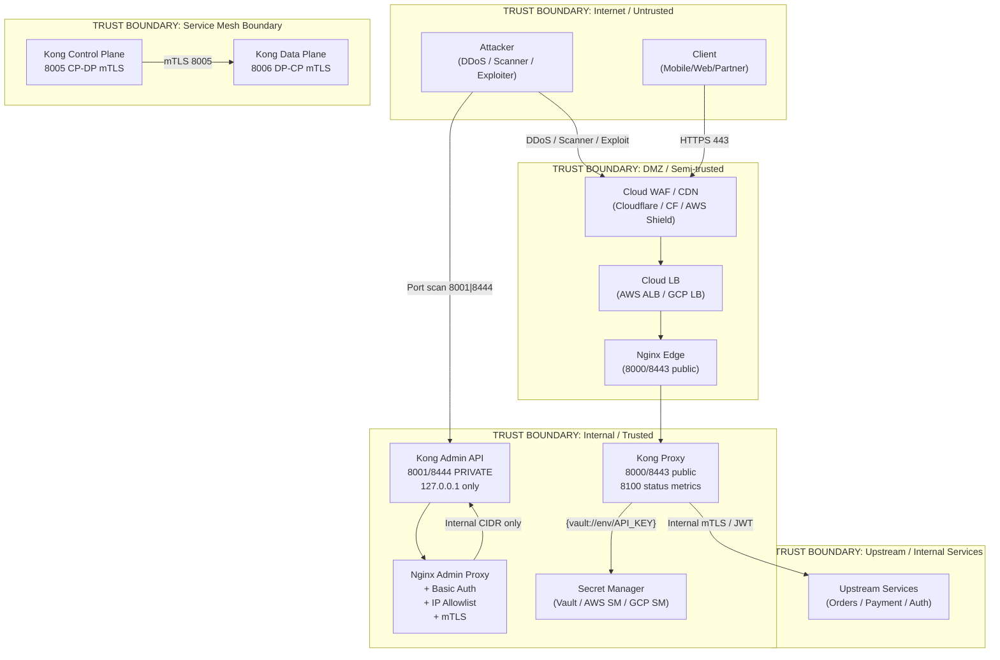
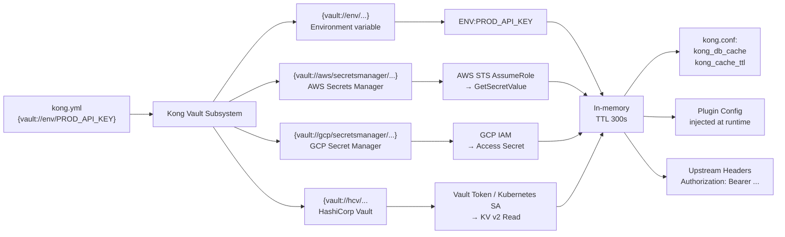
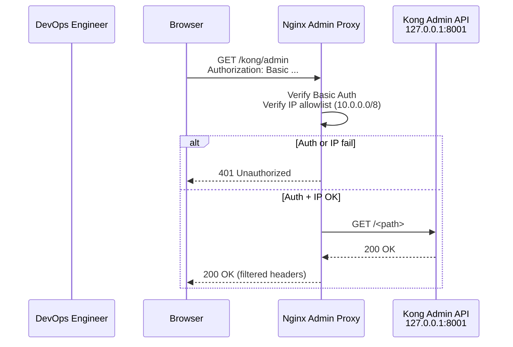

# Day 19: Production Security Hardening

> **Thời lượng**: 2 giờ
> **Độ khó**: ⭐⭐⭐⭐
> **Prerequisites**: Day 5 (TLS/HTTP2 Secure Edge), Day 11 (Kong Authentication), Day 12 (Kong Rate Limiting & ACL), Day 16 (Observability)

---

## 1. Learning Objectives

Sau bài này, bạn sẽ có thể:

- Xây dựng threat model cho gateway layer, phân loại threat theo trust boundary (external/internal/supply chain)
- Configure network boundary đúng: public listener vs private listener, Admin API behind Nginx loopback-only, firewall/Security Group cho từng port
- Configure TLS hardening toàn diện: TLS 1.2/1.3, Mozilla Modern cipher suite, OCSP stapling, HSTS, cert lifecycle bằng ACME, mTLS CP-DP hybrid mode
- Apply Kong Vault references (`{vault://env/...}`, `{vault://aws/...}`, `{vault://gcp/...}`, `{vault://hcv/...}`) để inject secret không có trong kong.yml
- Configure Admin API security: Nginx reverse proxy + basic auth + IP allowlist + mTLS, GitOps decK với token rotation
- Implement header hardening: `server_tokens off`, CSP, HSTS, strip `X-Kong-*` headers, response-transformer plugin
- Thiết kế DDoS/Layer 7 protection: rate limit tier (anonymous/authenticated/premium), `limit_conn` chống Slowloris, WAF overview (ModSecurity/Coraza/Cloud WAF)
- Apply container hardening: image pinning sha256, non-root, read-only root FS, Lua plugin security checklist
- Configure logging hygiene: mask `Authorization`, `Cookie`, query token; PII compliance (GDPR/VN PDPL)
- Thực hiện production hardening checklist: PCI DSS, SOC2, ISO 27001

---

## 2. The Problem

> **Scenario — Security incident từ một misconfigured gateway**

> Tuần trước, một security audit nội bộ phát hiện: (1) Kong Admin API port 8001 bind trên `0.0.0.0` — accessible từ Internet; (2) `kong.yml` chứa raw API key production; (3) Nginx chạy `server_tokens on` — attacker biết chính xác version; (4) Một developer commit `kong.yml` lên GitHub public repository — API key bị leak; (5) Lua plugin tự viết dùng `os.execute(http_body)` — RCE waiting to happen.
>
> Không có incident xảy ra — nhưng attack surface rất lớn. Nếu attacker quét port 8001, họ có toàn quyền thêm/sửa/xóa Kong routes, plugins, credentials. Nếu GitHub secret scanner chậm 1 tuần, partner API key đã bị abuse.
>
> **Câu hỏi**: Kong và Nginx production cần hardening gì, theo thứ tự ưu tiên nào, và làm sao detect misconfiguration trước khi attacker tìm thấy?

**Pain points thực tế:**

- Admin API bind `0.0.0.0` → toàn bộ Internet có thể truy cập nếu không có firewall
- Secret trong `kong.yml` → commit vào Git → leaked credential → partner API bị abuse
- `server_tokens on` → attacker fingerprint chính xác Nginx/Kong version → CVE lookup dễ dàng
- Không có IP allowlist cho Admin API → không có defense-in-depth
- mTLS giữa Kong CP-DP không được configure → hybrid mode traffic đi cleartext trong internal network
- Kong không có native RBAC (OSS) → phải front Admin API bằng Nginx hoặc Cloud LB + IAM
- Lua plugin execute OS command từ user input → RCE attack vector
- Không có Vault integration → secret rotation không thể automate

**Hậu quả nếu thiết kế sai:**

- Admin API public → Attacker thêm malicious route/plugin → data exfiltration
- Secret commit lên Git → Credential leak → unauthorized access → compliance violation
- `server_tokens on` → CVE fingerprint → targeted exploit → server compromise
- mTLS không có → lateral movement trong internal network dễ dàng
- Logging không mask sensitive header → PII leak → GDPR/SOC2 violation

---

## 3. Core Concepts

### 3.1 Threat Model — Trust Boundary cho Gateway Layer



**Threat categories:**

| Category | Threats | Impact | Likelihood |
|---|---|---|---|
| **External** | DDoS, credential stuffing, OWASP API Top 10 (A01-A10), port scanning Admin API | Service disruption, data breach | Cao nếu không có WAF/rate limit |
| **Internal** | Lateral movement (public Admin API), leaked admin token, insider threat | Full cluster compromise | Trung bình nếu Admin API public |
| **Supply Chain** | Malicious Lua plugin, compromised container image, dependency confusion | RCE, backdoor | Thấp nhưng impact rất cao |
| **Config Drift** | decK sync sai môi trường, secret commit lên git, port misconfiguration | Credential leak, misrouting | Cao nếu không có CI/CD validation |

### 3.2 Network Boundary — Port Matrix

| Port | Protocol | Bind Address | Trust Level | Access Control |
|---|---|---|---|---|
| `8000/8443` | HTTP/HTTPS | `0.0.0.0` | **Public (Internet)** | TLS + WAF + Rate Limit |
| `8100` | HTTP | `127.0.0.1` | **Metrics only** | Localhost only, no auth |
| `8001/8444` | HTTP/HTTPS Admin | `127.0.0.1` | **Private (loopback)** | Nginx proxy + Basic Auth + IP allowlist |
| `8005/8006` | HTTP CP-DP | `127.0.0.1` | **Hybrid mTLS only** | mTLS cert + Kong hybrid mode |
| `8005` (DP side) | HTTP | `0.0.0.0` | **Internal cluster** | mTLS cert verification |

### 3.3 Kong Vault Reference — Secret Resolution Pipeline



---

## 4. How It Works Internally

### 4.1 Kong Vault Subsystem — Secret Resolution

Kong Vault là built-in subsystem cho phép reference secret từ external source mà không hardcode vào `kong.yml`:

```
{vault://<provider>/<resource>}
```

**Resolution flow:**

1. Kong worker khởi tạo → load Vault provider plugins
2. Lần đầu plugin access secret → lookup cache
3. Cache miss → call Vault provider API
4. Response cached trong `lua_shared_dict` với TTL (default 300s)
5. TTL expire → automatic re-fetch (không cần reload)
6. Plugin nhận plaintext secret → inject vào config tại access phase

**Supported providers:**

| Provider | Scheme | Auth Method | Use Case |
|---|---|---|---|
| Environment | `vault://env/` | `os.getenv()` | Local dev, Docker env |
| AWS SM | `vault://aws/secretsmanager/` | IAM role / static | Production AWS |
| GCP SM | `vault://gcp/secretsmanager/` | GCP IAM | Production GCP |
| HashiCorp Vault | `vault://hcv/` | Token / K8s SA / AppRole | Enterprise multi-cloud |
| Custom | `vault://custom/` | Plugin author | Ad-hoc |

**Anti-pattern Kong Vault:**

```yaml
# SAI — secret trong kong.yml
plugins:
  - name: key-auth
    config:
      key_names: ["X-API-Key"]
      key: "km_live_secret_key_abc123"   # ← LEAKED!

# DUNG — vault reference
plugins:
  - name: key-auth
    config:
      key_names: ["X-API-Key"]
      key: "{vault://env/PROD_KEYAUTH_KEY}"  # ← resolved at runtime
```

### 4.2 Kong Admin API Security — Nginx Front Proxy



### 4.3 Kong Hybrid Mode — CP-DP mTLS Communication

Trong hybrid mode, Control Plane và Data Plane giao tiếp qua mTLS trên port 8005/8006:

```
Kong Control Plane (port 8005):
  ├─ Serve Admin API (127.0.0.1:8001)
  ├─ Serve CP-DP Admin (127.0.0.1:8005) ← mTLS listen
  └─ Sync config to Data Plane nodes

Kong Data Plane (port 8006):
  ├─ Proxy traffic (0.0.0.0:8000/8443)
  └─ Connect to CP (8005) ← mTLS client
```

**Cert generation:**

```bash
# Tự sinh CA + CP cert + DP cert cho hybrid mode
kong hybrid gen_cert \
  --cert=/etc/kong/ssl/kong-admin.crt \
  --key=/etc/kong/ssl/kong-admin.key \
  --ca-cert=/etc/kong/ssl/kong-ca.crt \
  --ca-key=/etc/kong/ssl/kong-ca.key
```

### 4.4 Header Hardening Pipeline

```
Upstream Response
    │
    ├─► Kong: strip X-Kong-*, X-Internal-*, Server
    │         (response-transformer plugin: remove.headers)
    │
    ├─► Nginx Edge: inject security headers
    │         Strict-Transport-Security
    │         X-Frame-Options
    │         X-Content-Type-Options
    │         Content-Security-Policy
    │         Permissions-Policy
    │         Referrer-Policy
    │
    └─► Client: hardened response
```

### 4.5 DDoS/Layer 7 Protection Layers

```
Layer 1: Cloud WAF (Cloudflare / AWS Shield / Cloud Armor)
  ├─ Rate limiting: global edge
  ├─ Bot detection: JA3 fingerprint, behavior analysis
  ├─ OWASP CRS: SQLi, XSS, RCE rules
  └─ IP reputation: known bad actors

Layer 2: Cloud LB (ALB / Cloud LB)
  ├─ Connection limiting: max connections per client
  ├─ Request size limiting: max body size
  └─ Idle timeout: close slow connections

Layer 3: Nginx Edge (8000/8443)
  ├─ limit_req: rate limit per IP/key
  ├─ limit_conn: concurrent connection limit
  ├─ client_header_timeout: Slowloris protection
  └─ server_tokens off: hide version

Layer 4: Kong Gateway
  ├─ rate-limiting plugin: per consumer quota
  ├─ ip-restriction plugin: whitelist/blacklist
  ├─ Bot Detection plugin (Enterprise)
  └─ WAF plugin: Coraza Lua (Kong plugin)
```

---

## 5. Hands-on Lab

Xem file `exercises.md` cho chi tiết step-by-step. Overview các lab:

| Lab | Chủ đề | Resources tạo |
|---|---|---|
| 1 | Admin API behind Nginx proxy + Basic Auth + IP allowlist | Nginx config, htpasswd, kong.yml |
| 2 | Kong Vault env reference — inject API key | kong.yml vault reference, docker-compose |
| 3 | mTLS giữa Nginx edge ↔ Kong proxy | Self-signed CA, client cert, Nginx config |
| 4 | Kong Vault AWS SM reference (mock) | Environment variable mock |
| 5 | Security header injection (response-transformer) | Kong plugin config |
| 6 | Scan bằng `nikto` và `testssl.sh` | Security audit commands |
| 7 | Rate limit + `slowhttptest` chống Slowloris | limit_req, limit_conn |
| 8 | Log masking — không log Authorization header | Nginx log_format |
| Challenge | Rotate key-auth credential bằng decK + Vault | decK sync, Kong Vault |

---

## 6. Trade-offs Analysis

### 6.1 Admin API Security Options

| Option | Security | Operability | Complexity | Suitable For |
|---|---|---|---|---|
| Admin API on `0.0.0.0` (no auth) | **Rất thấp** | Cao | Thấp | ❌ Không bao giờ |
| Admin API on `127.0.0.1` only | Cao | Trung bình | Thấp | Single-node dev |
| Nginx proxy + Basic Auth + IP allowlist | **Cao** | Tốt | Trung bình | Self-hosted production |
| Cloud LB + IAM + VPC Endpoint | **Rất cao** | Rất tốt | Cao | Cloud production |
| Kong Enterprise RBAC | **Rất cao** | Rất tốt | Cao | Kong Enterprise |

**Trade-off**: Cloud LB + IAM là an toàn nhất nhưng đắt và phụ thuộc cloud. Nginx proxy là giải pháp self-hosted tốt nhất.

### 6.2 Secret Management Options

| Option | Rotation | Audit Log | Multi-provider | Complexity |
|---|---|---|---|---|
| Raw secret trong kong.yml | Không | Không | Không | Thấp |
| Environment variable | Khó (reload) | Không | Không | Thấp |
| Kong Vault env | Cần restart/reload | Không | Không | Trung bình |
| Kong Vault AWS SM | Tự động (Lambda) | Có (CloudTrail) | Có | Cao |
| Kong Vault HashiCorp | Tự động | Có (Vault Audit) | Có | Cao |
| Sealed Secrets (K8s) | Khó | Không | Không | Trung bình |

### 6.3 WAF Deployment Options

| Option | Coverage | Latency | Cost | Configurable |
|---|---|---|---|---|
| ModSecurity 3 + Nginx | L4-L7 | +5-15ms | Free | Lua rules |
| Kong Coraza Lua plugin | L7 (HTTP) | +2-5ms | Free (OSS) | WAF ruleset |
| Cloud WAF (CF/AWS WAF) | L3-L7 + CDN | +0-3ms | Pay-per-rule | Managed rules |
| None | — | 0ms | Free | — |

### 6.4 mTLS vs JWT cho Service-to-Service

| Aspect | mTLS | JWT (RS256) |
|---|---|---|
| **Security** | Rất cao (cert chain verification) | Cao (cryptographic signature) |
| **Secret transmission** | Không (private key never leaves service) | Token có thể leak (but short-lived) |
| **PKI infrastructure** | Cần CA, cert rotation, CRL | Không cần CA |
| **Rotation** | Phức tạp (cert lifecycle) | Dễ (short-lived token) |
| **Performance** | TLS handshake overhead | Stateless verify |
| **Best for** | Zero-trust internal network | Microservices with short-lived tokens |

### 6.5 Hardening vs Operability

| Hardening | Trade-off |
|---|---|
| `server_tokens off` | Việc debug trên production khó hơn (không biết version ngay) → cần internal version tracking |
| Strict TLS cipher | Legacy client có thể bị reject → cần transitional period |
| mTLS everywhere | TLS handshake overhead tăng, cert management phức tạp |
| WAF inline | Latency tăng + false positive có thể block legitimate request |
| Vault secret rotation | Phụ thuộc Vault availability → cần fail-open vs fail-close decision |

---

## 7. Best Practices & Best Solution

### 7.1 Production Security Checklist — Theo Priority

**Tier 1 — Critical (ngay lập tức):**

```nginx
# Nginx: server_tokens off
server_tokens off;

# Kong: admin API loopback only
admin_api_uri = 127.0.0.1
admin_listen = 127.0.0.1:8001

# Firewall: block 8001/8444 từ Internet
# AWS SG: 8001/8444 → source: 10.0.0.0/8 only
```

**Tier 2 — High (trong 1 tuần):**

```bash
# 1. Xóa secret khỏi kong.yml, thay bằng vault reference
# 2. Bật TLS 1.2/1.3 + Mozilla Modern cipher (Day 5 đã cover)
# 3. Nginx Admin proxy: basic auth + IP allowlist
# 4. Strip Kong-specific headers bằng response-transformer
# 5. Bật HSTS header
```

**Tier 3 — Medium (trong 1 tháng):**

```bash
# 1. Kong Vault integration: AWS SM / GCP SM / HashiCorp Vault
# 2. mTLS CP-DP hybrid mode
# 3. Container hardening: non-root, read-only root FS, capability drop
# 4. Lua plugin security review
# 5. Audit log: ship Kong/Nginx logs → Loki / SIEM
```

### 7.2 Nginx Hardening Config (Production)

```nginx
# File: /etc/nginx/conf.d/security-hardening.conf

# === VERSION FINGERPRINT REMOVAL ===
server_tokens off;
proxy_pass_header Server;   # Không expose Kong/Nginx version

# === PROTOCOL & CIPHER HARDENING ===
ssl_protocols TLSv1.2 TLSv1.3;
ssl_ciphers ECDHE-ECDSA-AES128-GCM-SHA256:ECDHE-RSA-AES128-GCM-SHA256:ECDHE-ECDSA-AES256-GCM-SHA384:ECDHE-RSA-AES256-GCM-SHA384:ECDHE-ECDSA-CHACHA20-POLY1305:ECDHE-RSA-CHACHA20-POLY1305:DHE-RSA-AES128-GCM-SHA256:DHE-RSA-AES256-GCM-SHA384;
ssl_prefer_server_ciphers off;

# === OCSP STAPLING ===
ssl_stapling on;
ssl_stapling_verify on;
resolver 8.8.8.8 8.8.4.4 valid=300s;
resolver_timeout 5s;

# === SESSION SECURITY ===
ssl_session_cache shared:SSL:50m;
ssl_session_timeout 1d;
ssl_session_tickets off;
ssl_buffer_size 4k;

# === HSTS & SECURITY HEADERS ===
add_header Strict-Transport-Security "max-age=63072000; includeSubDomains; preload" always;
add_header X-Frame-Options DENY always;
add_header X-Content-Type-Options nosniff always;
add_header X-XSS-Protection "1; mode=block" always;
add_header Referrer-Policy "strict-origin-when-cross-origin" always;
# CSP: điều chỉnh theo ứng dụng
add_header Content-Security-Policy "default-src 'self'; script-src 'self'; object-src 'none';" always;

# === CLIENT PROTECTION ===
client_max_body_size 10m;
client_body_timeout 30s;
client_header_timeout 10s;
large_client_header_buffers 4 16k;
lingering_close on;
lingering_time 30s;
lingering_timeout 5s;

# === SLOWLORIS PROTECTION ===
limit_conn_zone $binary_remote_addr zone=conn_limit:10m;

# === RATE LIMITING (Tier) ===
limit_req_zone $binary_remote_addr zone=anon_limit:10m rate=30r/s;
limit_req_zone $http_authorization zone=auth_limit:10m rate=100r/s;

# === LOG MASKING ===
log_format secure '$remote_addr - $remote_user [$time_local] '
                '"$request" $status $body_bytes_sent '
                '"$http_referer" "$http_user_agent" '
                'rt=$request_time '
                'uag="$http_user_agent" '
                'cip="$http_x_forwarded_for"';
# NOTE: Authorization header NOT logged — sensitive

# === ALLOWLIST IP (Admin proxy) ===
geo $admin_whitelist {
    default 0;
    127.0.0.1 1;
    10.0.0.0/8 1;
    172.16.0.0/12 1;
    192.168.0.0/16 1;
}
```

### 7.3 Kong Admin API Nginx Proxy Config

```nginx
# File: /etc/nginx/conf.d/kong-admin-proxy.conf

server {
    listen 8444 ssl;
    server_name kong-admin-internal;

    # TLS: chứng chỉ internal CA
    ssl_certificate /etc/nginx/ssl/internal-ca.crt;
    ssl_certificate_key /etc/nginx/ssl/internal-ca.key;
    ssl_client_certificate /etc/nginx/ssl/internal-ca.crt;
    ssl_verify_client optional;

    # Basic Auth
    auth_basic "Kong Admin API — Authorized Personnel Only";
    auth_basic_user_file /etc/nginx/.htpasswd_kong_admin;

    # IP allowlist
    allow 127.0.0.0/8;
    allow 10.0.0.0/8;
    allow 172.16.0.0/12;
    deny all;

    # Proxy to Kong Admin
    location / {
        proxy_pass http://127.0.0.1:8001;
        proxy_set_header Host $host;
        proxy_set_header X-Real-IP $remote_addr;
        proxy_set_header X-Forwarded-For $proxy_add_x_forwarded_for;
        proxy_set_header X-Forwarded-Proto $scheme;

        # Strip sensitive headers from upstream response
        proxy_hide_header X-Kong-Response-Latency;
        proxy_hide_header X-Kong-Admin-Latency;
        proxy_hide_header Server;
    }
}
```

### 7.4 Kong Vault Integration Examples

**kong.yml với Kong Vault:**

```yaml
_format_version: "3.0"

# Vault provider configuration
vaults:
  - name: env
    description: Environment variables
    config:
      prefix: ENV

  - name: aws
    description: AWS Secrets Manager
    config:
      region: ap-southeast-1
      role: kong-vault-role   # IAM role ARN

  - name: hcv
    description: HashiCorp Vault
    config:
      url: https://vault.internal:8200
      mount: kong
      kv_version: 2

# Consumer + Plugin với vault reference
consumers:
  - username: partner-api
    keyauth_credentials:
      - key: "{vault://env/PROD_KEYAUTH_KEY}"

services:
  - name: order-service
    url: http://order-service:8080
    routes:
      - name: order-route
        paths:
          - /api/orders
        plugins:
          - name: rate-limiting
            config:
              minute: 1000
              policy: redis

plugins:
  - name: response-transformer
    config:
      remove:
        headers:
          - X-Kong-Upstream-Latency
          - X-Kong-Proxy-Latency
          - Server
          - X-Kong-Admin-Latency
      add:
        headers:
          - X-Frame-Options:DENY
          - X-Content-Type-Options:nosniff
          - Strict-Transport-Security:max-age=63072000
```

### 7.5 Anti-patterns — Security

| Anti-pattern | Hậu quả | Fix |
|---|---|---|
| `admin_listen = 0.0.0.0:8001` | Admin API public → full cluster compromise | Bind `127.0.0.1:8001` |
| `server_tokens on` | CVE fingerprint → targeted exploit | `server_tokens off` |
| Secret trong `kong.yml` | Git commit → credential leak | Kong Vault reference |
| `curl -X POST http://localhost:8001/...` | No auth on Admin API | Nginx proxy + basic auth |
| Log `Authorization` header | PII/compliance violation | Custom log format, mask header |
| `latest` tag Docker image | Image drift → vulnerability untrackable | Pin sha256 tag |
| Run container as root | Container breakout → host compromise | `USER` directive in Dockerfile |
| Lua plugin: `os.execute(http_body)` | RCE vulnerability | Lua sandboxing, no `os.*` access |
| `http_log_endpoint` không TLS | Log data expose trên network | TLS endpoint hoặc Unix socket |
| Không revoke compromised cert | Attacker dùng cert vĩnh viễn | CRL/OCSP check, short-lived cert |

---

## 8. Performance Considerations

### 8.1 TLS Handshake CPU Overhead

```
TLS Handshake cost breakdown (approximate):
  ├─ RSA 2048 key exchange:  ~1-3ms CPU per handshake
  ├─ ECDHE P-256 key exchange: ~0.3-0.8ms CPU per handshake
  └─ TLS 1.3 vs 1.2: ~30-40% less CPU (simplified handshake)

Session resumption (session ticket):
  ├─ First connection: full handshake (see above)
  └─ Subsequent: ~0.1ms (no key exchange)

Recommendation:
  - Prefer ECDHE over RSA
  - Enable session resumption with key rotation
  - TLS 1.3 is ~40% faster than TLS 1.2 for full handshake
```

### 8.2 Benchmark Methodology

```bash
# Tool: wrk (HTTP/1.1) + h2load (HTTP/2)
# CPU: 4 vCPU, 8GB RAM
# Payload: 1KB JSON response
# Duration: 60s
# Connections: 200
# TLS: On (TLS 1.3, ECDHE P-256)
# Kong: DB-less, 2 worker, no heavy plugins

> Lưu ý: số liệu chỉ dùng để tham khảo. Kết quả thực tế phụ thuộc
> hardware, OS, kernel, network, payload, TLS cipher, session resumption
> rate, WAF ruleset size, Kong plugin load.
```

**Sample comparison:**

| Scenario | p50 | p95 | p99 | Notes |
|---|---|---|---|---|
| Baseline (no TLS, no auth) | 1ms | 2ms | 3ms | Kong proxy only |
| TLS 1.3 ECDHE (warm cache) | 2ms | 3ms | 5ms | Session resumed |
| TLS 1.3 ECDHE (cold) | 5ms | 10ms | 15ms | Full handshake |
| + WAF (Coraza Lua) | +1ms | +2ms | +3ms | OWASP CRS rules |
| + Kong Vault lookup (env) | +0.1ms | +0.2ms | +0.5ms | Cached secret |
| + mTLS (session resumed) | +0.5ms | +1ms | +2ms | Cert chain cached |
| + ModSecurity inline | +3ms | +8ms | +15ms | Complex ruleset |

### 8.3 WAF Latency Budget

```
WAF latency by type:
  ├─ Cloud WAF (edge): +0-3ms (geographically close)
  ├─ Kong Coraza Lua: +2-5ms (OWASP CRS, no DB lookup)
  ├─ ModSecurity 3 + Nginx: +5-15ms (complex rules, PCRE)
  └─ Application-level WAF: +5-20ms (regex, DB lookup)

Recommendation:
  - Layer 1: Cloud WAF (DDoS + OWASP Top 10)
  - Layer 2: Kong Coraza (L7 HTTP rules)
  - Layer 3: Application-level validation (input sanitization)
  - NOT: ModSecurity inline at high-traffic gateway (too slow)
```

### 8.4 Kong Vault Cache & TTL

```bash
# Kong memory cache cho vault secrets
# Default: cached in kong_db_cache (128MB) với TTL

# Config kong.conf:
# vault_sync_rate = 300  (default: 300s = 5 phút)
# proxy_cache_path levels=1:2 ...  (Vault không dùng proxy cache)

# Khi vault_secret reload:
# 1. Kong check TTL expiry
# 2. Re-fetch từ Vault provider
# 3. Update cache
# 4. Next plugin access: plaintext secret
```

---

## 9. Troubleshooting Checklist

### 9.1 Admin API — Auth Fail / 401 from Nginx Proxy

```bash
# 1. Kiểm tra IP allowlist
# Nginx config: allow 10.0.0.0/8; deny all;
# Xem IP thực:
curl -v http://localhost:8444/ 2>&1 | head -20
echo $REMOTE_ADDR  # local test

# 2. Kiểm tra Basic Auth
# Tạo htpasswd:
htpasswd -bc /etc/nginx/.htpasswd_kong_admin admin '<password>'
# Test:
curl -u admin:password http://localhost:8444/

# 3. Kiểm tra Kong Admin listen
docker exec kong-dbless curl -s http://127.0.0.1:8001/status
# Nếu lỗi: Kong không listen 127.0.0.1:8001

# 4. Kiểm tra kong.conf
grep -E "admin_listen|admin_api" /etc/kong/kong.conf
```

### 9.2 Certificate — Chain Order / OCSP Timeout

```bash
# 1. Kiểm tra cert chain order
openssl s_client -connect localhost:8443 -showcerts \
  </dev/null 2>/dev/null | grep -E "subject=|issuer="

# Chain phải: Server cert → Intermediate → Root CA
# Wrong order → cert verify fail

# 2. Kiểm tra OCSP stapling
openssl s_client -connect localhost:8443 -status \
  </dev/null 2>/dev/null | grep "OCSP Response"

# OCSP Response Status: successful
# Nếu lỗi: cert không support OCSP hoặc resolver không reach

# 3. Kiểm tra cert expiry
openssl x509 -in /etc/nginx/ssl/server.crt -noout -dates

# 4. Verify cert + key match
openssl x509 -noout -modulus -in cert.crt | md5sum
openssl rsa -noout -modulus -in cert.key | md5sum
# Hai hash phải giống nhau
```

### 9.3 Kong Vault — Secret Not Resolved

```bash
# 1. Kiểm tra kong.yml vault syntax
# Syntax: {vault://<provider>/<resource>}
grep -r "vault://" /etc/kong/kong.yml

# 2. Kiểm tra environment variable tồn tại
docker exec kong-dbless env | grep PROD_KEYAUTH_KEY
# Phải tồn tại: export PROD_KEYAUTH_KEY="actual_secret"

# 3. Kiểm tra Kong vault provider config
curl -s http://localhost:8001/vaults

# 4. Kiểm tra vault cache TTL
curl -s http://localhost:8001/vaults | jq '.data[] | {name, config}'

# 5. Force reload bằng cách POST config
curl -X POST http://localhost:8001/config \
  -F config=@kong.yml
```

### 9.4 Lua Plugin — RCE / Security Audit

```bash
# 1. Scan Lua plugin cho dangerous pattern
grep -rn "os\." /usr/local/share/lua/5.1/kong/plugins/my-custom/
# Pattern cần block: os.execute, os.popen, io.popen, loadstring, dofile

# 2. Kiểm tra plugin không truy cập network
grep -rn "socket\." /path/to/plugin/
grep -rn "http\.request" /path/to/plugin/

# 3. Review plugin handler.lua
# Không nên: loadfile(), loadstring(http_body), os.execute(user_input)

# 4. Check plugin rock dependency
luarocks list | grep -v kong
```

### 9.5 Log — Authorization Header Still Logged

```bash
# 1. Kiểm tra log_format không có $http_authorization
nginx -T | grep "log_format" -A 10

# 2. Kiểm tra không có global log_format ghi đè
# Tìm tất cả log_format trong config:
nginx -T | grep "log_format"

# 3. Test: gửi request với Authorization header
curl -H "Authorization: Bearer secret" http://localhost:8000/api/
# Xem log:
grep "secret" /var/log/nginx/access.log
# Không thấy "secret" trong log = PASS

# 4. Kong: kiểm tra file-log plugin không ghi sensitive header
curl -s http://localhost:8001/plugins | jq '.data[] | select(.name=="file-log") | .config'
```

### 9.6 mTLS — Handshake Fail Between Kong CP-DP

```bash
# 1. Kiểm tra hybrid cert tồn tại
openssl s_client -connect localhost:8005 -CAfile /etc/kong/ssl/kong-ca.crt \
  -cert /etc/kong/ssl/kong-dp.crt -key /etc/kong/ssl/kong-dp.key \
  </dev/null 2>&1 | grep -E "Verify return code|Protocol|Cipher"

# 2. Kiểm tra Kong dp-cluster-communication key/cert
docker exec kong-dp ls -la /etc/kong/ssl/
# dp-key.pem, dp-cert.pem, ca-cert.pem

# 3. Kiểm tra CA cert đúng
openssl x509 -in /etc/kong/ssl/kong-ca.crt -noout -subject -issuer

# 4. Kiểm tra hybrid mode trong kong.conf
grep -E "role|cluster_cert|cluster_key|ca_cert" /etc/kong/kong.conf
```

---

## 10. Completion Checklist

Sau khi hoàn thành bài học, tự kiểm tra:

- [ ] Xây dựng được threat model cho gateway layer: external/internal/supply chain/config drift
- [ ] Configure Kong Admin API bind `127.0.0.1:8001` và front bằng Nginx proxy + Basic Auth + IP allowlist
- [ ] Apply `{vault://env/...}` reference trong `kong.yml` để inject secret không có trong file config
- [ ] Configure TLS hardening: TLS 1.2/1.3, Mozilla Modern cipher, HSTS, OCSP stapling
- [ ] Configure `server_tokens off` và strip `X-Kong-*` headers bằng response-transformer plugin
- [ ] Implement mTLS hybrid mode giữa Kong CP (8005) và DP (8006)
- [ ] Configure rate limiting tier: anonymous 30r/s, authenticated 100r/s, premium 1000r/s
- [ ] Configure `limit_conn` chống Slowloris và verify bằng `slowhttptest`
- [ ] Scan gateway bằng `nikto` và `testssl.sh`, interpret kết quả
- [ ] Configure log format không log `Authorization` header
- [ ] Container hardening: image sha256 pin, non-root user, read-only FS, capability drop
- [ ] Review Lua plugin cho dangerous pattern (`os.execute`, `loadstring`)
- [ ] Giải thích được trade-off: hardening vs operability, mTLS vs JWT, WAF inline vs edge

---

## 11. References

- [OWASP API Security Top 10](https://owasp.org/API-Security/)
- [Kong Security Documentation](https://docs.konghq.com/gateway/latest/security/)
- [Kong Vault Reference](https://docs.konghq.com/gateway/latest/kong-enterprise/secrets-management/)
- [Nginx Security Best Practices](https://nginx.org/en/docs/security_notes.html)
- [Mozilla SSL Configuration Generator](https://ssl-config.mozilla.org/)
- [NIST SP 800-190 — Container Security Guide](https://csrc.nist.gov/publications/detail/sp/800-190/final)
- [ModSecurity OWASP CRS](https://coreruleset.org/)
- [CIS Docker Benchmark](https://www.cisecurity.org/benchmark/docker)
- [OWASP Lua Scoring — Lua Plugin Security](https://owasp.org)
- [PCI DSS 4.0 Gateway Requirement](https://www.pcisecuritystandards.org/)
- [HashiCorp Vault Kong Integration](https://developer.hashicorp.com/vault/docs/platform/kong)
- [GitHub Secret Scanning — Prevent Leaked Credentials](https://docs.github.com/en/code-security/secret-scanning)
- [Gartner CNAPP — Cloud Native Application Protection](https://www.gartner.com)

---

## Recap

Day 19 đã cover toàn bộ production security hardening cho Nginx + Kong gateway:

- **Threat model**: phân loại threat theo trust boundary, hiểu attack surface của từng layer
- **Network boundary**: public listener (8000/8443) vs private (8001/8444) vs mTLS-only (8005/8006) vs metrics (8100)
- **TLS hardening**: TLS 1.2/1.3, Mozilla Modern cipher, HSTS, OCSP stapling, session resumption, cert lifecycle ACME
- **mTLS hybrid CP-DP**: port 8005/8006, cert generation bằng `kong hybrid gen_cert`
- **Kong Vault**: `{vault://env/...}`, `{vault://aws/...}`, `{vault://hcv/...}`, TTL caching, secret rotation
- **Admin API security**: Nginx proxy + Basic Auth + IP allowlist (loopback-only), GitOps decK token rotation
- **Header hardening**: `server_tokens off`, CSP, HSTS, strip `X-Kong-*`, response-transformer plugin
- **DDoS/Layer 7**: tiered rate limiting, `limit_conn` Slowloris, WAF overview (Cloud/ModSecurity/Coraza)
- **Container security**: sha256 pin, non-root, read-only FS, capability drop, Lua plugin audit
- **Logging hygiene**: mask `Authorization`, `Cookie`, PII compliance (GDPR/VN PDPL)
- **Compliance**: PCI DSS, SOC2, ISO 27001 quick checklist

---

## Preview Day 20

**Day 20: Capstone Project — End-to-End Gateway System**

Ngày cuối cùng trước final review, bạn sẽ xây dựng một hệ thống gateway hoàn chỉnh:

- Nginx Edge → Kong Gateway → 3 Microservices (Order/Payment/Tracking)
- Consul Service Discovery
- TLS termination + mTLS internal
- Key Auth + Rate Limiting per Consumer
- Prometheus metrics + Grafana dashboard
- Benchmark bằng `wrk`, failure testing (service down, rate limit, timeout)
- Full security hardening đã học từ Day 19
- Viết benchmark report và troubleshooting guide

Đây là bài tổng hợp toàn bộ kiến thức 19 ngày — đảm bảo bạn có thể design, deploy và operate một production-grade gateway system.
