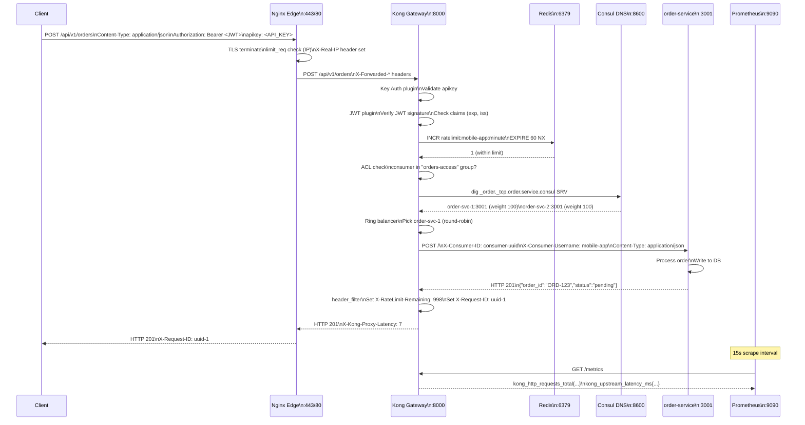
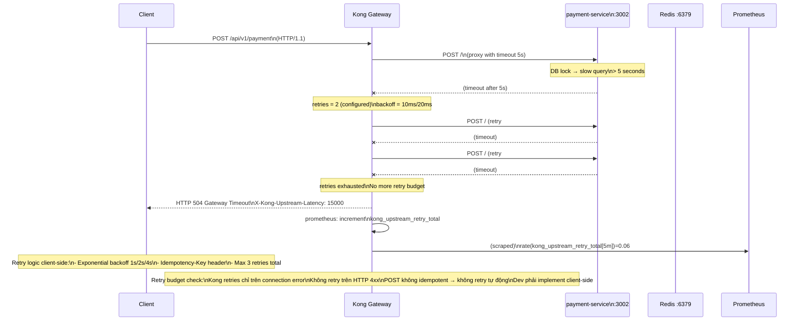
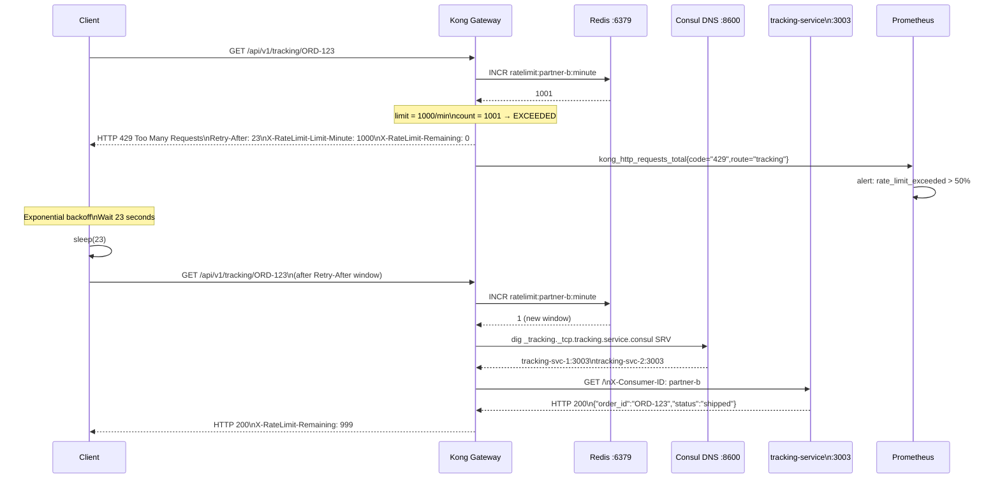

# Day 20: Deep Dive — Full Reference Architecture & Integration Patterns

---

## 1. Complete Reference Architecture

### 1.1 High-Level Architecture with Data Flow

```
Internet / LAN
     │
     │  HTTPS (TLS 1.3)
     │  Host: api.example.internal
     ▼
┌──────────────────────────────────────────────────────────┐
│                    Edge Layer                             │
│  ┌─────────────────────────────────────────────────────┐  │
│  │           Nginx Edge (Reverse Proxy + TLS)           │  │
│  │  - TLS termination (self-signed CA / Let's Encrypt)│  │
│  │  - limit_req_zone $binary_remote_addr (100r/s IP)  │  │
│  │  - limit_conn_zone $binary_remote_addr (10 conn)  │  │
│  │  - stub_status /metrics_nginx (for Prometheus)    │  │
│  │  - proxy_set_header X-Real-IP $remote_addr         │  │
│  │  - proxy_set_header X-Forwarded-Proto $scheme     │  │
│  │  - proxy_set_header X-Forwarded-Host $host         │  │
│  │  - client_max_body_size 1m                         │  │
│  │  - proxy_read_timeout 30s                          │  │
│  └─────────────────────────────────────────────────────┘  │
└────────────────────────────┬─────────────────────────────┘
                             │ HTTP :8000 (internal)
                             ▼
┌──────────────────────────────────────────────────────────┐
│                   Gateway Layer                           │
│  ┌─────────────────────────────────────────────────────┐  │
│  │           Kong Gateway 3.7 DB-less                  │  │
│  │                                                     │  │
│  │  Proxy Pipeline (port 8000):                       │  │
│  │    1. TLS SNI (port 8443, optional)                │  │
│  │    2. rewrite_by_lua (correlation-id)              │  │
│  │    3. access_by_lua:                                │  │
│  │       a. key-auth (consumer identify)              │  │
│  │       b. jwt (optional, for service-to-service)     │  │
│  │       c. acl (consumer group authorization)        │  │
│  │       d. ip-restriction (whitelist)                │  │
│  │       e. rate-limiting (Redis policy)              │  │
│  │       f. request-transformer (inject headers)     │  │
│  │    4. balancer_by_lua (upstream weight + health)  │  │
│  │    5. header_filter (CORS, X-RateLimit-*)          │  │
│  │    6. body_filter (response transformation)       │  │
│  │    7. log_by_lua (Prometheus metrics update)       │  │
│  │                                                     │  │
│  │  Admin API (port 8001, internal only):             │  │
│  │    - Kong config management via decK               │  │
│  │    - Admin API behind Nginx auth (basic or JWT)   │  │
│  │                                                     │  │
│  │  Status API (port 8100):                          │  │
│  │    - /metrics (Prometheus scrape)                  │  │
│  │    - /status/ready                                │  │
│  └─────────────────────────────────────────────────────┘  │
└────────────────────────────┬─────────────────────────────┘
                             │ HTTP (internal network)
          ┌──────────────────┼──────────────────┐
          │                  │                  │
          ▼                  ▼                  ▼
   ┌────────────┐     ┌────────────┐     ┌────────────┐
   │  order-    │     │ payment-   │     │ tracking-  │
   │  service   │     │ service    │     │ service    │
   │  :3001     │     │ :3002     │     │ :3003     │
   └─────┬──────┘     └─────┬──────┘     └─────┬──────┘
         │                  │                  │
         ▼                  ▼                  ▼
┌─────────────────────────────────────────────────────────┐
│              Consul Service Discovery                    │
│  - Service Registry (DNS SRV records)                   │
│  - Health Check (HTTP /health every 10s)               │
│  - DNS Server (:8600) — Kong resolver upstream         │
│  - HTTP API (:8500) — Prometheus scrape                │
│  - Catalog API — service registration                  │
└─────────────────────────────────────────────────────────┘
                             │
                             │ SRV DNS query
                             │ (Kong balancer)
                             ▼
         ┌────────────────────┬────────────────────┐
         │                    │                    │
         │  order-svc-1:3001 │  order-svc-2:3001 │
         │  weight=100        │  weight=100        │
         │  healthy          │  healthy          │
         └────────────────────┴────────────────────┘

┌─────────────────────────────────────────────────────────┐
│                    Cache / State                         │
│  ┌────────────────┐     ┌──────────────────────────┐   │
│  │  Redis 7        │     │  Prometheus 3 (scrape)   │   │
│  │  Rate limit     │     │  Kong :8100/metrics       │   │
│  │  counters       │     │  Nginx :8080/stub_status │   │
│  │  TTL 60s        │     │  Consul :8500/metrics     │   │
│  └────────────────┘     └────────────┬─────────────┘   │
│                                        │                 │
└────────────────────────────────────────┼─────────────────┘
                                         ▼
                              ┌─────────────────────┐
                              │  Grafana 11          │
                              │  Dashboard: Gateway  │
                              │  Overview            │
                              └─────────────────────┘
```

### 1.2 Security Boundary Model

```
┌─────────────────────────────────────────────────────┐
│                 OUTER BOUNDARY (Internet)            │
│                                                     │
│  HTTPS :443 ←──── TLS termination ở đây             │
│                                                     │
│  ✗ Admin API (8001) NOT exposed                     │
│  ✗ Consul HTTP (8500) NOT exposed                   │
│  ✗ Prometheus (9090) NOT exposed                     │
│  ✗ Grafana (3000) NOT exposed                       │
│                                                     │
└─────────────────────────────────────────────────────┘
                          │
                          │ Nginx edge (auth + rate-limit)
                          ▼
┌─────────────────────────────────────────────────────┐
│             INTERNAL NETWORK (Docker net)            │
│                                                     │
│  Kong :8000 ─── public proxy                       │
│  Kong :8100 ─── Prometheus scrape (internal)       │
│  Kong :8001 ─── Admin API (Nginx auth protect)    │
│  Consul :8500 ── Prometheus scrape (internal)      │
│  Consul :8600 ── Kong DNS resolver (internal)      │
│  Redis :6379 ─── Kong rate-limit (internal)        │
│  Grafana :3000─ Prometheus datasource (internal)  │
│                                                     │
└─────────────────────────────────────────────────────┘
```

---

## 2. Sequence Diagrams — User Journeys

### 2.1 Place Order Journey



### 2.2 Retry Payment Journey (with Retry Storm Prevention)



### 2.3 Query Tracking Journey (with Rate Limit Exceeded)



---

## 3. Component Responsibility Matrix

| Component | Responsibility | Does NOT handle | Key Config File |
|---|---|---|---|
| **Nginx Edge** | TLS termination, IP rate-limit, static assets, header normalization | Auth, routing logic, plugin execution | `nginx/nginx.conf` |
| **Kong Gateway** | API routing, auth (Key/JWT), rate-limit, upstream LB, health check, metrics | TLS (chỉ trên 8443), static assets, DNS | `kong/kong.yml` |
| **Consul** | Service registry, DNS SRV, health check agent | Upstream routing, config management | `consul/config/consul.json` |
| **Redis** | Distributed rate-limit counter, TTL-based sliding window | Service discovery, auth, routing | `redis.conf` |
| **order/payment/tracking** | Business logic, health endpoint, Consul registration | Gateway routing, TLS, rate-limit | `services/*/server.js` |
| **Prometheus** | Metrics collection, scrape, alerting | Log aggregation, distributed tracing | `prometheus/prometheus.yml` |
| **Grafana** | Metrics visualization, alerting | Metrics collection, log search | `grafana/provisioning/*` |

### Timeout Budget (per request)

```
Client timeout:         30s  (HTTP client config)
├─ Nginx edge timeout:  25s  (proxy_read_timeout)
│  └─ Kong proxy timeout: 20s (read_timeout default)
│     └─ Kong connect:     5s  (connect_timeout)
│        └─ Upstream timeout: Kong retries x backoff
│           └─ Application:  3-5s (application-level timeout)
│              └─ Database: 2s  (DB connection timeout)
│
└─ Client abort: 30s → Nginx: FIN_WAIT_2
```

---

## 4. Capacity Planning Baseline

### 4.1 RPS Estimation (Docker Desktop, 4 vCPU / 8 GB RAM)

| Component | Max RPS (approx) | Bottleneck |
|---|---|---|
| Kong DB-less (no plugin) | ~5,000-8,000 | LuaJIT CPU |
| Kong + Key Auth + Rate-Limit (Redis) | ~2,500-4,000 | Redis round-trip |
| Kong + full plugin chain (Key+Rate+JWT) | ~2,000-3,000 | Lua execution |
| Kong + Consul DNS resolver | ~-200-300 overhead | DNS resolution |
| **Full stack (Nginx + Kong + Redis + 3 services)** | **~1,500-2,500** | **End-to-end latency** |

### 4.2 Memory Planning

```
Kong LuaJIT:           ~128 MB shared dict + 256 MB process = 384 MB
Kong rate-limit counters: 12 MB shared dict (default)
Consul:                ~256 MB agent + bolt DB = 300 MB
Redis:                 ~64-128 MB (rate-limit counter small)
3 × Node services:     ~64 MB each = 192 MB
Nginx edge:            ~64 MB
Prometheus:            ~512 MB-1 GB (time-series DB)
Grafana:               ~128-256 MB
─────────────────────────────────────────────────────────
Total:                 ~2.5-3.5 GB RAM (baseline)
With margin (50%):     ~4-5 GB RAM (production Docker Desktop)
```

### 4.3 Network Latency Budget (local Docker)

```
Nginx → Kong:           ~1-2 ms (same host, Docker bridge)
Kong → Consul DNS:      ~1-3 ms (SRV lookup, cached)
Kong → Redis:           ~1-2 ms (localhost bridge)
Kong → order-service:   ~2-5 ms (Node.js HTTP, JSON parse)
─────────────────────────────────────────────────────────
End-to-end (no plugin): ~7-12 ms p50
End-to-end (full stack): ~15-25 ms p50
```

---

## 5. Runbook Outline

### 5.1 On-Call Quick Reference

```
=== INCIDENT: API returning 502 ===

T=0:  Alert fires: "Kong 502 rate > 1%"
  1. Check Kong status:       curl http://localhost:8001/status
  2. Check upstream health:   curl http://localhost:8001/upstreams
  3. Check Consul services:   curl http://localhost:8500/v1/health/service/order
  4. Check service logs:      docker compose logs order-service
  5. Check Kong error log:    docker compose logs kong 2>&1 | grep error

If service down:
  → Restart service: docker compose restart order-service
  → Verify: curl http://localhost:3001/health

If Kong unhealthy targets:
  → Check why: docker exec kong curl http://order:3001/health
  → If service OK: Kong health check false positive → PATCH target healthy

If Consul deregistered service:
  → Re-register: curl -X PUT http://localhost:8500/v1/agent/service/register \
      -d @consul/services/order.json

If Redis down:
  → Rate-limit fail-open → 429 không trigger → check Redis: docker compose logs redis
  → Restart Redis: docker compose restart redis

=== INCIDENT: Rate-limit false positive ===
  → Check Redis: docker exec redis redis-cli INFO stats | grep keyspace
  → Check consumer quota: curl http://localhost:8001/consumers
  → Temporarily increase limit: decK sync (updated kong.yml)
  → Emergency: disable rate-limit plugin via Admin API

=== INCIDENT: Prometheus not scraping ===
  → Check Prometheus targets: http://localhost:9090/targets
  → Restart Prometheus: docker compose restart prometheus
  → Check network: docker exec prometheus ping kong
```

### 5.2 Health Check End-to-End Checklist (10 Cases)

| # | Test Case | Method | Expected Result | Pass Criteria |
|---|---|---|---|---|
| 1 | TLS handshake OK | `curl -k https://localhost/orders` | HTTP 200 or 401 | TLS session established |
| 2 | Key Auth reject | `curl http://localhost:8000/orders` | HTTP 401 `No API key found` | Response time < 100ms |
| 3 | Key Auth accept | `curl -H "apikey: test-key" http://localhost:8000/orders` | HTTP 200 | Consumer identified |
| 4 | JWT valid | `curl -H "Authorization: Bearer <valid>" http://localhost:8000/orders` | HTTP 200 | JWT claims parsed |
| 5 | JWT expired | `curl -H "Authorization: Bearer <expired>" http://localhost:8000/orders` | HTTP 401 | `expired claim` |
| 6 | Rate limit triggered | Loop 1001x request | HTTP 429 on request #1001 | `Retry-After` header present |
| 7 | Upstream weight distribution | `curl -X POST /upstreams/order/targets` weight=50/50 | Both targets receive ~50% | Within 5% |
| 8 | Metrics scrape | `curl http://localhost:8100/metrics` | `kong_http_requests_total` | Prometheus format |
| 9 | Log redaction | `curl -H "apikey: secret-key-123" http://localhost:8000/orders` | Kong log has `***` not key | Secret not in plaintext |
| 10 | mTLS optional | Client cert provided | Upstream sees client cert DN | CN extracted in header |

### 5.3 Failure Drill Scenarios (Day 20 + Day 21)

| Scenario | Trigger | Expected Behavior | Pass Criteria |
|---|---|---|---|
| **Service down (order-service)** | `docker stop order-service` | Kong passive health check → target unhealthy, weight=0; traffic → remaining instance | Traffic returns 200 within 30s |
| **All service instances down** | `docker stop order-service-1 order-service-2` | Kong → 503 Service Unavailable; Prometheus alert fires | 503 returned, no 502/504 |
| **Consul down** | `docker stop consul` | Kong DNS → stale TTL (cached IPs still work); after 5min, Kong can't resolve new IPs | Traffic OK for 5min, then slow degradation |
| **Redis down (rate-limit)** | `docker stop redis` | Kong rate-limit fail-open → no 429; `fault_tolerant: false` means no metric logged | Requests pass (fail-open), error log shows Redis error |
| **Kong upstream slow (timeout)** | Set `read_timeout=1` | Requests > 1s → 504 Gateway Timeout; Prometheus records `kong_upstream_latency_ms_bucket{le="1"}` | 504 returned, retry counter incremented |
| **Retry storm** | 100 concurrent requests, backend = 200ms delay, `retries=3` | Backend receives 400 requests (1 + 3 retries); retry rate = 3x | Prometheus: `kong_upstream_retry_total` > baseline |
| **Kong config drift** | `deck gateway sync` with wrong tag | Entity of other team unchanged (--select-tag works); rollback restores | Service of other team unaffected |
| **DNS stale (Consul down 5+ min)** | Consul down > 5 min | Kong DNS resolver returns stale records; dead IP → passive health check fails → target marked unhealthy | Kong eventually converges to only healthy targets |
