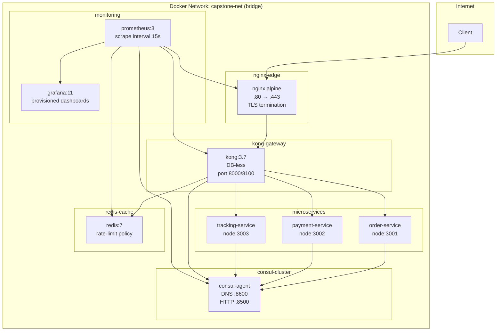
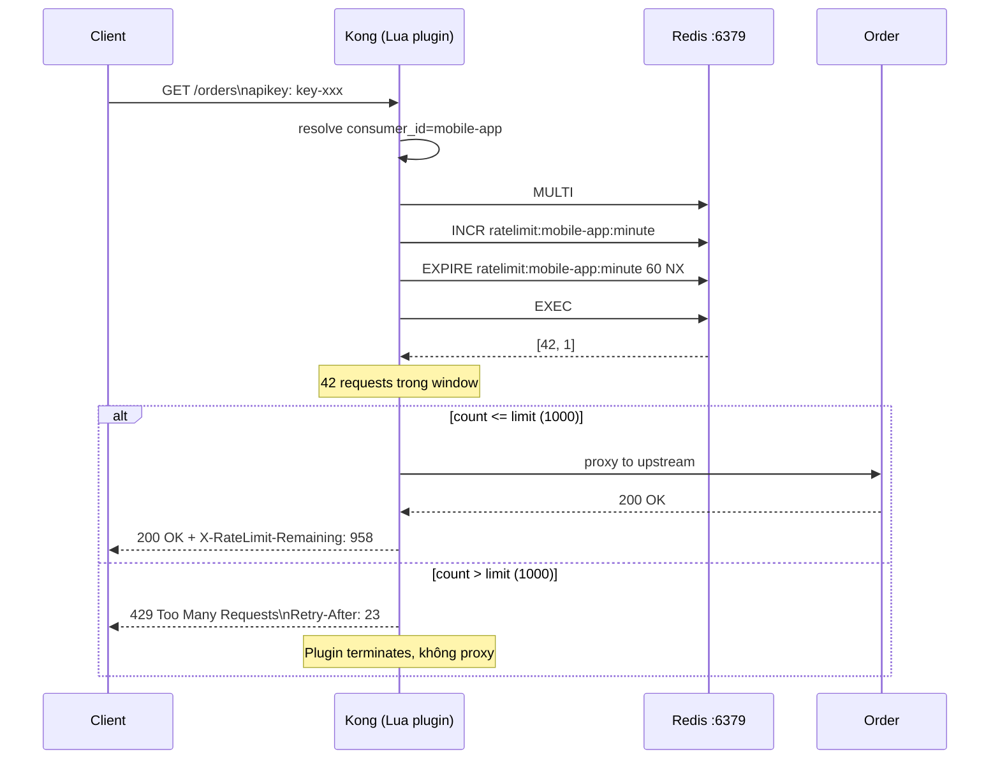
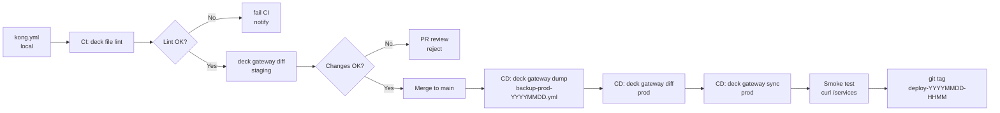

# Day 20: Capstone Project — End-to-End Gateway System

> **Thời lượng**: 2 giờ (roadmap: 4 phase)
> **Độ khó**: ⭐⭐⭐⭐⭐
> **Prerequisites**: Day 1-19 hoàn thành — đặc biệt: Day 2 (Nginx architecture), Day 5 (TLS), Day 8-9 (Kong architecture + entities), Day 10 (DB-less + decK), Day 11 (Key Auth + JWT), Day 12 (Rate limiting Redis), Day 13 (Upstream + health check), Day 14 (Timeout/retry), Day 15 (Rollout), Day 16 (Prometheus/Grafana), Day 17 (Consul discovery), Day 18 (DNS resolver pattern), Day 19 (Security hardening)

---

## 1. Learning Objectives

Sau bài capstone, bạn sẽ có thể:

- Orchestrate toàn bộ stack `Edge LB → Nginx → Kong → Microservices ↔ Consul` bằng Docker Compose
- Configure Kong DB-less với declarative config (`kong.yml`) qua decK GitOps pipeline
- Integrate Consul service registry + DNS-based discovery vào Kong upstream resolution
- Apply layered security: TLS termination edge → Key Auth + JWT tại Kong → IP restriction
- Configure rate-limiting với Redis policy, upstream load balancing với active+passive health check
- Observe toàn bộ hệ thống bằng Prometheus metrics + Grafana dashboard
- Run failure drill end-to-end: service down, Kong upstream unhealthy, Consul unavailable, rate limit exceeded, retry storm
- Benchmark hệ thống với k6, thu thập p50/p95/p99 + RPS + error rate + CPU baseline
- Synthesize knowledge từ 19 ngày trước thành một runnable production-grade system

---

## 2. The Problem

> **Scenario — CTO yêu cầu dựng production-grade gateway prototype trong 2 giờ**
>
> Công ty bạn sắp launch một e-commerce platform với 3 core microservices (order, payment, tracking). CTO muốn xem một proof-of-concept end-to-end gateway system trước tuần sau. Yêu cầu:
>
> - Traffic flow: `Client → Cloud LB/Nginx Edge → Kong Gateway → 3 microservices`
> - Mỗi microservice phải được discover qua Consul DNS
> - API phải có Key Auth + JWT, rate-limit Redis, upstream health check tự động
> - Metrics phải visible trên Grafana dashboard
> - decK phải quản lý toàn bộ Kong config (GitOps)
> - Phải pass failure drill: khi order-service down → health check detect → traffic tự chuyển sang instance còn lại
>
> Deadline: 2 giờ. Không được lỗi. Không được có hardcoded placeholder.

**Pain points thực tế khi tích hợp nhiều công nghệ:**

- Mỗi component (Nginx, Kong, Consul, Redis, Prometheus) có config riêng, không tự động sync với nhau
- Kong DNS resolver pattern (Day 18) cần Consul DNS server chạy chuẩn — Consul agent phải đăng ký đúng service name
- Redis rate-limit policy cần Redis up trước Kong, không có retry logic khi Redis down (cấu hình `fault_tolerant`)
- Prometheus scrape phải đúng endpoint: Kong `8100/metrics`, Nginx `stub_status`, Consul `8500`
- TLS termination tại Nginx edge + Kong proxy → certificate chain phải trusted ở cả 2 lớp
- decK sync không atomic với multi-file config — phải sync theo thứ tự đúng
- Service down → Kong passive health check mark unhealthy → nhưng weight=100 vẫn giữ target trong ring → cần weight=0 để drain

**Vì sao Day 20 là bài khó nhất?**

Day 1-19 mỗi bài tập trung 1-2 component. Day 20 yêu cầu tất cả components hoạt động đồng thời, đúng thứ tự, với failure scenario đầy đủ. Một lỗi ở bất kỳ layer nào đều phá vỡ toàn bộ flow.

---

## 3. Core Concepts

### 3.1 Target Architecture

```mermaid
flowchart LR
    Client[Client\nBrowser/App] --> EdgeLB[Edge LB\nCloud LB / Nginx local]

    subgraph Edge["Edge Layer (Day 5, 6)"]
        EdgeLB --> Nginx[Nginx Reverse Proxy\nTLS Termination\nlimit_req / limit_conn]
        Nginx --> NginxMetrics[/metrics\nstub_status]
    end

    subgraph Gateway["Gateway Layer (Day 8-15, 18)"]
        Nginx --> Kong[Kong Gateway 3.7 DB-less\n+ decK GitOps]
        Kong --> KongMetrics[/metrics\nport 8100]
        Kong --> KongAuth[Key Auth + JWT\nACL / IP Restriction]
        Kong --> KongRL[Rate Limit\nRedis policy]
    end

    subgraph Service["Microservice Layer (Day 17, 18)"]
        Kong --> Order[order-service\nNode/Express :3001]
        Kong --> Payment[payment-service\nNode/Express :3002]
        Kong --> Tracking[tracking-service\nNode/Express :3003]

        Order --> Consul[Consul 1.18\nService Registry\nDNS :8600]
        Payment --> Consul
        Tracking --> Consul
    end

    subgraph Observability["Observability (Day 16)"]
        KongMetrics --> Prometheus[Prometheus\nscrape targets]
        NginxMetrics --> Prometheus
        Prometheus --> Grafana[Grafana\nDashboards]
    end

    subgraph Infra["Infrastructure"]
        Kong -.-> Redis[Redis\nRate Limit counter]
        Kong -.-> Consul
    end
```

### 3.2 Docker Compose Container Topology



### 3.3 Component Role Summary

| Component | Vai trò | Day tham khảo | Port chính |
|---|---|---|---|
| **Nginx Edge** | TLS termination, rate-limit edge, static routing | Day 5, 6, 7 | 80/443 |
| **Kong Gateway** | API routing, auth (Key/JWT), rate-limit, upstream LB, health check | Day 8-15, 18 | 8000/8100 |
| **Consul** | Service registry, DNS discovery (SRV), health check agent | Day 17, 18 | 8500/8600 |
| **Redis** | Distributed rate-limit counter, fault_tolerant=false | Day 12 | 6379 |
| **order/payment/tracking** | Mock microservice, expose health endpoint, register to Consul | Day 17 | 3001/3002/3003 |
| **Prometheus** | Scrape metrics từ Kong (8100), Nginx (stub_status), Consul (8500) | Day 16 | 9090 |
| **Grafana** | Visualize metrics, provisioned dashboards | Day 16 | 3000 |

### 3.4 Traffic Flow Detail

```
1.  Client → Nginx Edge (:443)       — TLS handshake (self-signed cert for local)
2.  Nginx Edge → Kong (:8000)        — HTTP internal, X-Forwarded-* headers
3.  Kong: Key Auth check             — Validate apikey header
4.  Kong: JWT check                  — Verify JWT signature + claims
5.  Kong: Rate Limit check (Redis)  — Redis INCR + EXPIRE, reject if > quota
6.  Kong: Route matching             — /orders → order-service, /payment → payment-service
7.  Kong: DNS resolve (Consul)       — order.service.consul SRV → 2 IPs
8.  Kong: Load balance (ring)        — Weighted round-robin qua upstream target
9.  Kong: Active health check       — /health endpoint every 10s
10. Kong → order-service (:3001)    — HTTP proxy
11. order-service: Consul register  — Deregister if /health → 500
12. order-service → Client          — HTTP 200 JSON
13. Prometheus → Kong :8100/metrics — Scrape every 15s
14. Grafana → Prometheus             — Query + visualize
```

---

## 4. How It Works Internally

### 4.1 Service Register → Kong DNS SRV Resolve → Upstream Target

Day 17 và Day 18 tích hợp tại đây:

```mermaid
sequenceDiagram
    participant Order as order-service\n(startup)
    participant Consul as Consul Agent\n:8500/:8600
    participant Kong as Kong Gateway\nDB-less
    participant Redis as Redis\n:6379

    Order->>Consul: PUT /v1/agent/service/register\n{name: order-service, port: 3001,\naddress: order-svc, healthCheck: /health}
    Consul->>Consul: Register service\nCreate DNS entry\norder.service.consul

    Note over Kong: Kong DNS resolver\nresolver = dns_resolver 127.0.0.1:8600;\nvalid = 30s;

    Kong->>Consul: DNS query\ndig @127.0.0.1 -p 8600\n_order.service.consul SRV
    Consul-->>Kong: SRV record\norder-svc-1:3001, order-svc-2:3001

    Note over Kong: Kong balancer_by_lua\nRing rebuild với 2 targets\nweight: order-svc-1=100, order-svc-2=100

    Order->>Order: /health returns 200
    Consul->>Kong: Health check OK\ntarget stays healthy

    Order->>Order: /health returns 500 (crash)
    Consul->>Kong: Health check FAIL\nKong marks target unhealthy\nWeight=100 → weight=0 (drain)

    Kong->>Redis: INCR ratelimit:order:consumer-1
    Redis-->>Kong: 1 (counter OK)
```

**Cấu hình Kong DNS resolver (Day 18):**

```yaml
# Trong kong.yml — dùng Consul DNS thay vì static IP
services:
  - name: order-service
    url: http://order.service.consul:3001
    # Kong tự resolve qua resolver:
    # resolver = dns_resolver 127.0.0.1:8600 (Consul DNS)
```

### 4.2 Kong Rate-Limit Redis — Lua Atomic Increment

Day 12 mở rộng:



**Redis fault_tolerant = false (default):** Redis down → rate-limit bị skip (X-RateLimit-Limit không set, request cho qua). Đây là behavior an toàn hơn fail-closed (trả 500) nhưng không phải lúc nào cũng mong muốn. Set `fault_tolerant: true` để Kong trả 500 khi Redis unreachable.

### 4.3 Prometheus Scrape — Multi-Target Topology

Day 16 mở rộng cho multi-component:

```yaml
# prometheus/prometheus.yml
scrape_configs:
  # Kong metrics (8100/metrics)
  - job_name: kong
    static_configs:
      - targets: [kong:8100]
    metrics_path: /metrics

  # Nginx stub_status (8080/stub_status)
  - job_name: nginx-edge
    static_configs:
      - targets: [nginx-edge:8080]

  # Consul metrics
  - job_name: consul
    static_configs:
      - targets: [consul:8500]
    metrics_path: /v1/agent/metrics

  # Redis INFO
  - job_name: redis
    static_configs:
      - targets: [redis:6379]
```

### 4.4 decK GitOps Pipeline — lint → diff staging → sync prod → tag



### 4.5 Consul + Kong DNS Fail-Over

```
Normal:  Kong → Consul DNS (order.service.consul) → order-svc-1:3001 + order-svc-2:3001
Consul Down: Kong DNS resolver → dns_stale_ttl (default: 300s) → cached IP vẫn dùng được
             Nếu upstream target đã cached IP không còn alive → passive health check fail → mark unhealthy
Consul + Upstream Both Down: Kong trả 503 Service Unavailable (vì không có healthy target)

Fallback Priority:
  1. Consul DNS cached record (stale TTL)
  2. Kong in-memory DNS cache (lua-resty-dns-cache)
  3. Last known healthy target (if not explicitly removed)
  4. 503 khi toàn bộ target unhealthy
```

### 4.6 Kong Active Health Check vs Consul Health Check — Failover Coordination

```
Consul health check (passive):
  - Consul agent poll /health mỗi 10s
  - Nếu fail 2 lần liên tiếp → Consul deregister service
  - Kong DNS SRV → mất entry khỏi DNS
  → RTT: ~20-30s (2 × check interval)

Kong active health check:
  - Kong gọi /health upstream mỗi 10s
  - Nếu fail → mark target unhealthy (weight tạm = 0)
  - Kong vẫn giữ target trong upstream, chỉ không route traffic
  → RTT: ~10-20s (1 × interval + threshold)

Failover coordination:
  1. order-svc-1:3001 crash (process die)
  2. Kong active check → 1 fail → unhealthy
  3. Traffic chuyển sang order-svc-2:3001 (< 10s)
  4. Consul health check → 2 fail → deregister order-svc-1
  5. Kong DNS cache stale → order-svc-1 vẫn trong DNS ~30s
  6. Kong balancer resolve → order-svc-2 only → stable
```

---

## 5. Hands-on Lab Overview

Day 20 là bài tổng hợp — toàn bộ hands-on nằm trong `exercises.md` (Phase A/B/C/D). Phần `lesson.md` này tóm tắt roadmap và key concepts.

### Lab Roadmap (2 giờ)

| Phase | Thời gian | Nội dung |
|---|---|---|
| **Phase A** | 15 phút | Clone scaffold, generate certs, verify network |
| **Phase B** | 45 phút | Consul + services + Redis + Kong DB-less + decK bootstrap |
| **Phase C** | 45 phút | Nginx edge, auth/rate-limit, Prometheus/Grafana, end-to-end verify |
| **Phase D** | 15 phút | k6 benchmark + failure drill |

### File Tree của Capstone

```
capstone/
├── docker-compose.yml
├── Makefile
├── README.md
├── nginx/
│   ├── nginx.conf
│   └── certs/
│       ├── server.crt       # self-signed for local
│       └── server.key
├── kong/
│   └── kong.yml            # declarative config (DB-less)
├── consul/
│   ├── config/
│   │   └── consul.json
│   └── services/
│       ├── order.json
│       ├── payment.json
│       └── tracking.json
├── services/
│   ├── order-service/
│   │   ├── Dockerfile
│   │   ├── server.js
│   │   └── package.json
│   ├── payment-service/
│   │   ├── Dockerfile
│   │   ├── server.js
│   │   └── package.json
│   └── tracking-service/
│       ├── Dockerfile
│       ├── server.js
│       └── package.json
├── prometheus/
│   ├── prometheus.yml
│   └── alerts.yml
├── grafana/
│   └── provisioning/
│       ├── dashboards/
│       │   └── gateway-overview.json
│       └── datasources/
│           └── prometheus.yml
├── deck/
│   └── bootstrap.sh        # lint → validate → diff → sync
└── bench/
    ├── scenarios.lua       # k6 scenarios
    ├── run.sh              # benchmark runner
    └── drill.sh            # failure drill automation
```

---

## 6. Trade-offs Analysis

### 6.1 Monolith Deploy vs Gateway Pattern

| Aspect | Monolith (1 Kong + 1 Service) | Gateway Pattern (Kong + N Services) |
|---|---|---|
| **Complexity** | Thấp | Cao |
| **Debugging** | Single process trace | Distributed trace cần correlation ID |
| **Auth scope** | Service-level | Gateway-level (enforce all) |
| **Rate-limit scope** | Per-service counter | Global (Redis shared) |
| **Deployment coupling** | Coupled (deploy together) | Decoupled (Kong config thay đổi ≠ service deploy) |
| **Failure isolation** | Không (service crash → toàn bộ down) | Partial (Kong can route around) |
| **Scale out** | Khó (horizontal scale monolith) | Dễ (scale per service) |
| **Khi nào dùng** | < 5 services, team nhỏ | > 5 services, multi-team |

### 6.2 In-Process Auth vs Gateway Auth

| Aspect | In-process auth | Gateway auth (Kong) |
|---|---|---|
| **Latency overhead** | 0ms (same process) | ~1-3ms (Key Auth), ~2-5ms (JWT) |
| **Consistency** | Mỗi service implement khác nhau | Centralized, uniform |
| **Audit** |分散 (scattered logs) | Single log stream |
| **Secret mgmt** | Mỗi service có secret riêng | Kong Admin API protected |
| **Auth update** | Redeploy all services | Update Kong config (no redeploy) |
| **Service mesh** | Không co-gov | Cần external auth service |
| **Khi nào dùng** | Simple internal service, < 5 endpoints | Production multi-service API |

### 6.3 Full Observability Stack vs SaaS Alternative

| Aspect | Self-hosted (Prometheus + Grafana) | SaaS (Datadog, New Relic) |
|---|---|---|
| **Cost** | Free (infra only) | $15-50/host/month |
| **Setup time** | 2-4 giờ | 30 phút |
| **Long-term storage** | Sử dụng Thanos/ Cortex | Unlimited (paid plan) |
| **Alerting** | Prometheus Alertmanager | Native SaaS alerting |
| **Correlate logs** | Cần integrate ELK | Native (logs + metrics together) |
| **Khi nào dùng** | Budget-constrained, compliance requirement | Enterprise, fast iteration |

### 6.4 Hidden Costs của Full Stack

- **Docker Desktop memory**: Kong + Consul + 3 services + Redis + Prometheus + Grafana + Nginx ≈ 4-6 GB RAM
- **Port collision**: 8000 (Kong), 8001 (Kong admin), 8100 (Kong metrics), 8500 (Consul HTTP), 8600 (Consul DNS), 6379 (Redis), 3000 (Grafana), 9090 (Prometheus), 80/443 (Nginx) — dùng unique port mapping
- **File descriptor**: Mỗi upstream target giữ connection; Kong default `worker_connections = 1024`; 3 services × 2 targets × 50 concurrent = 300 connections — OK nhưng tăng khi scale
- **Prometheus cardinality**: Kong metric label `consumer` có thể là UUID → cardinality explosion → Prometheus OOM
- **decK sync time**: Với 500+ entities, sync mất 15-60s; phải chờ health check settle (~10s) sau sync

---

## 7. Best Practices & Anti-patterns

### 7.1 DO — Production Checklist

- Kong Admin API (8001) phải behind Nginx auth hoặc internal network — không bao giờ expose ra public
- TLS cert ở Nginx edge dùng CA-trusted (Let's Encrypt staging) hoặc self-signed với CA bundle
- Kong config (kong.yml) phải trong Git, sync qua decK CI/CD — không bao giờ `POST /config` trực tiếp lên production
- decK sync trước: `dump` backup → `diff` preview → `sync` apply → smoke test → git tag
- Rate-limit Redis: set `fault_tolerant: false` (default) để avoid silent bypass; set `true` nếu cần fail-closed
- Prometheus scrape interval: Kong = 15s, Consul = 30s (không cần real-time), Nginx = 15s
- Grafana datasource: dùng `prometheus` datasource type, check "Access: Server (default)"
- Health check endpoint: mỗi service phải có `/health` trả 200 + JSON `{"status":"ok"}`
- Consul: `enable_script_checks: false` (security) — dùng `http` check type
- Nginx edge: `proxy_set_header X-Real-IP $remote_addr` — để Kong nhận real IP cho IP restriction

### 7.2 DON'T — Anti-patterns

```
❌ 1 docker-compose với 20 service cùng lúc
   → Chỉ start theo phase (Phase B: Consul → services → Redis → Kong)
   → Debug từng stage, không hỗn loạn tất cả

❌ decK sync mà không dump backup trước
   → Không rollback được khi sync fail partial

❌ Credential plaintext trong kong.yml rồi commit lên Git
   → Dùng environment variable hoặc Vault reference
   → kong.yml chỉ chứa placeholder, env injection tại runtime

❌ Tách kong.yml theo service (mỗi team 1 file) mà không có CI/CD coordination
   → Race condition khi nhiều team sync cùng lúc
   → Dùng --select-tag nhưng CI/CD phải có mutex

❌ Bật Prometheus plugin global với high-cardinality labels
   → Consumer UUID, request ID, trace ID là unique-per-request
   → Prometheus cardinality explosion → OOM
   → Chỉ enable metrics cho label có cardinality thấp: service, route, consumer_name

❌ Rate-limit không apply cho consumer (anonymous)
   → Attacker không cần API key → bypass rate-limit
   → Apply anonymous rate-limit theo IP (limit_req_zone $binary_remote_addr)

❌ Kong upstream timeout = 60s (default)
   → Backend slow → connection bị giữ 60s × retries=5 = cascade
   → Set: connect_timeout=2s, read_timeout=5s, write_timeout=5s

❌ Service không đăng ký health check với Consul
   → Consul không biết service die → DNS vẫn trả IP dead
   → Kong passive health check không kịp → traffic vào dead target
```

---

## 8. Performance Considerations

### 8.1 Resource Baseline (Docker Desktop, 8 GB RAM)

| Container | CPU (approx) | RAM (approx) | Disk I/O |
|---|---|---|---|
| Kong 3.7 DB-less | 0.5-1 vCPU | 256-512 MB | Medium |
| Consul 1.18 | 0.25 vCPU | 128-256 MB | Low |
| Redis 7 | 0.1 vCPU | 64-128 MB | Medium |
| order/payment/tracking (Node) | 0.1 vCPU each | 64-128 MB each | Low |
| Nginx edge | 0.25 vCPU | 32-64 MB | Low |
| Prometheus 3 | 0.5 vCPU | 512 MB-1 GB | High |
| Grafana 11 | 0.25 vCPU | 128-256 MB | Medium |
| **Total** | **~2.5-3 vCPU** | **~1.5-2.5 GB** | |

### 8.2 Bottleneck Thường Gặp (Local Dev)

| Bottleneck | Triệu chứng | Detection | Fix |
|---|---|---|---|
| **Port collision** | `port is already allocated` | `docker compose ps` | Change port mapping in compose |
| **File descriptor** | `too many open files` | `ulimit -n` | Add `ulimit: { nofile: 65536 }` to compose |
| **Docker Desktop memory** | Containers OOM killed | `docker stats` | Increase Docker Desktop RAM to 8 GB |
| **Prometheus OOM** | Prometheus container restart loop | `docker logs prometheus` | Reduce retention, scrape interval |
| **Consul DNS stale** | Traffic still routing to dead target | `dig @localhost -p 8600 order.service.consul` | Lower `dns_config.stale_threshold` |
| **Kong ring rebuild** | Target weight=0 nhưng vẫn nhận traffic | Access log analysis | Wait 30s sau weight change |
| **LuaJIT OOM** | `lua_max_running_timers` error in log | Kong error log | Increase `KONG_MEM_CACHE_SIZE` |
| **Redis connection exhausted** | `ERR max number of clients reached` | Redis log | Set `maxclients` in redis.conf |

### 8.3 Benchmark Methodology (Full Stack)

```
Tool: k6 (recommended vì có scenario support)
Environment: Docker Desktop, 8 GB RAM, 4 vCPU
Payload: 1 KB JSON
Duration: 60s
VUs: 50 concurrent users
Test type: ramping-vus (0 → 50 → 100 → 50 → 0)

Scenario breakdown:
  Stage 1 (0-10s):   0-50 VUs ramp-up
  Stage 2 (10-40s):  50 VUs steady state ← measure baseline
  Stage 3 (40-50s):  50-100 VUs stress
  Stage 4 (50-60s):  100-0 VUs cool-down

Metrics collected:
  - RPS (requests per second)
  - p50/p95/p99 latency (ms)
  - 4xx/5xx error rate (%)
  - Kong proxy latency breakdown (X-Kong-Proxy-Latency)
  - Kong upstream latency (X-Kong-Upstream-Latency)
  - CPU per container
```

> **Disclaimer**: Số liệu benchmark trong phần này và `exercises.md` chỉ dùng để tham khảo. Kết quả thực tế phụ thuộc vào hardware (CPU, RAM, disk speed), network latency, Docker Desktop vs Linux host, số plugin enabled, payload size, và TLS on/off. Môi trường test: Docker Desktop 4 CPU / 8 GB RAM, no TLS, no Redis persistence, macOS/Windows host. Tuyệt đối không so sánh absolute numbers giữa các môi trường khác nhau.

### 8.4 Kong Overhead vs Baseline (tham khảo)

| Stack | p50 (ms) | p95 (ms) | p99 (ms) | RPS max |
|---|---|---|---|---|
| order-service direct (no Kong) | 2 | 5 | 10 | ~5000 |
| + Kong (no plugin) | 3 | 7 | 14 | ~4000 |
| + Kong + Key Auth | 4 | 9 | 18 | ~3500 |
| + Kong + Key Auth + Rate Limit (Redis) | 5 | 12 | 22 | ~3000 |
| + Kong + Key Auth + Rate Limit + JWT | 6 | 14 | 26 | ~2800 |
| + Full stack (Kong + Consul DNS + Redis) | 7 | 16 | 30 | ~2500 |

---

## 9. Troubleshooting Checklist

### Checklist 1: End-to-End Flow Not Working

```
Symptom: curl http://localhost:8000/orders → Connection refused / Timeout

Layer-by-layer debug:
  [Edge]  Nginx running?        → docker compose ps nginx-edge
  [Edge]  Nginx port open?      → curl http://localhost:80 → 502 or 200
  [GW]    Kong running?         → curl http://localhost:8001 | jq '.version'
  [GW]    Kong admin API OK?    → curl http://localhost:8001/services | jq '.data'
  [GW]    Route exists?         → curl http://localhost:8001/routes | jq '.data[].name'
  [GW]    Upstream healthy?     → curl http://localhost:8001/upstreams | jq '.data[].health'
  [Disc]  Consul DNS?           → dig @localhost -p 8600 order.service.consul SRV
  [Disc]  Service registered?   → curl http://localhost:8500/v1/catalog/services | jq
  [Cache] Redis ping?           → docker exec redis redis-cli ping
  [Svc]   Service health?       → curl http://localhost:3001/health
  [Svc]   Service reachable?    → docker exec kong curl http://order:3001/health
```

### Checklist 2: Service Registered But Kong Can't Reach

```
Symptom: Consul shows service registered, but Kong → 502 Bad Gateway

Check DNS resolution inside Kong container:
  docker exec kong dig @127.0.0.1 -p 8600 order.service.consul SRV

Check resolver configured:
  docker exec kong kong config init | grep resolver

Check Kong upstream target:
  curl http://localhost:8001/upstreams/order-upstream/targets

If target shows unhealthy:
  curl http://localhost:8001/upstreams/order-upstream/targets/{id}/health
  docker exec kong curl -f http://order:3001/health
```

### Checklist 3: Rate-Limit Not Working (Redis Policy)

```
Symptom: Gửi 100 requests nhưng không bị 429

Check Redis connectivity from Kong:
  docker exec kong curl -f http://redis:6379

Check Kong log for Redis errors:
  docker compose logs kong 2>&1 | grep -i redis

Verify plugin attached:
  curl http://localhost:8001/services/order-service/plugins | jq '.data[].name'
  curl http://localhost:8001/routes/order-route/plugins | jq '.data'

Check consumer identified:
  curl -H "apikey: test-key" http://localhost:8000/orders -v 2>&1 | grep X-Consumer

If no consumer: Key Auth không resolve được consumer → rate-limit không áp
```

### Checklist 4: Prometheus Not Scraping

```
Check Kong metrics endpoint:
  curl http://localhost:8100/metrics | grep "^kong_" | head -5

Check Prometheus targets:
  curl http://localhost:9090/api/v1/targets | jq '.data.activeTargets[].labels.job'

Check scrape interval:
  docker exec prometheus cat /etc/prometheus/prometheus.yml | grep scrape_interval

Check Prometheus logs:
  docker compose logs prometheus 2>&1 | grep "context deadline exceeded"
```

### Checklist 5: TLS Handshake Fail at Nginx Edge

```
Symptom: curl https://localhost/orders → SSL error

Check cert exists:
  ls -la nginx/certs/server.crt nginx/certs/server.key

Check Nginx config syntax:
  docker exec nginx-edge nginx -t

Check cert is valid (not expired, CN matches):
  openssl x509 -in nginx/certs/server.crt -noout -dates -subject

Check Kong is reachable from Nginx:
  docker exec nginx-edge curl http://kong:8000/orders
```

---

## 10. Completion Checklist

Sau khi hoàn thành Day 20, tự đánh giá:

- [ ] Tất cả 8 container (Kong, Consul, Redis, 3 services, Prometheus, Grafana) chạy healthy
- [ ] Nginx edge → Kong → order-service: end-to-end curl thành công với TLS
- [ ] Key Auth: request không có API key → 401; có API key → 200
- [ ] JWT: token hết hạn → 401; token hợp lệ → 200
- [ ] Rate-limit Redis: gửi > quota requests → 429; reset sau window → 200
- [ ] Consul DNS: `dig @localhost -p 8600 order.service.consul SRV` trả về service IP
- [ ] Kong upstream: 2 target healthy, disable 1 target → traffic tự chuyển sang còn lại
- [ ] Prometheus: `/metrics` endpoint trả về `kong_http_requests_total`, `nginx_stub_status_*`
- [ ] Grafana: dashboard hiển thị RPS, latency p95, error rate
- [ ] k6 benchmark: p95 < 50ms, RPS > 1000, error rate < 1%
- [ ] Failure drill: order-service down → health check detect < 30s → traffic failover
- [ ] decK pipeline: `lint → validate → diff → sync → smoke test → git tag` hoàn chỉnh
- [ ] Backup file được tạo trước mỗi decK sync
- [ ] Security: Admin API (8001) không accessible từ host, chỉ qua Nginx auth
- [ ] File tree đầy đủ, README.md có hướng dẫn chạy
- [ ] Benchmark report snapshot sẵn sàng cho Day 21

---

## 11. References

- [Kong Gateway 3.7 — Production Reference Architecture](https://docs.konghq.com/gateway/latest/production/)
- [Kong — DB-less Deployment](https://docs.konghq.com/gateway/latest/reference/configuration/)
- [decK 1.40+ — GitOps Workflow](https://docs.konghq.com/deck/latest/guides/ci-cd/)
- [Consul 1.18 — Service Mesh & Service Discovery](https://developer.hashicorp.com/consul/docs)
- [Consul — DNS Interface](https://developer.hashicorp.com/consul/docs/discovery/dns)
- [Prometheus — Scrape Configuration](https://prometheus.io/docs/prometheus/latest/configuration/configuration/)
- [Grafana — Provisioning Dashboards](https://grafana.com/docs/grafana/latest/administration/provisioning/)
- [k6 — Load Testing Scenarios](https://k6.io/docs/using-k6/scenarios/)
- [Kong — DNS-Based Service Discovery](https://docs.konghq.com/gateway/latest/reference/configuration/#dns_stale_ttl)
- [Envoy — Service Discovery](https://www.envoyproxy.io/docs/envoy/latest/intro/arch_overview/upstream/service_discovery)
- [Google SRE — Canary Analysis](https://sre.google/sre-book/release-engineering/)
- [Kong Hub — Rate Limiting Plugin](https://docs.konghq.com/hub/kong-inc/rate-limiting/)
- [Kong Hub — Key Auth Plugin](https://docs.konghq.com/hub/kong-inc/key-auth/)
- [Kong Hub — JWT Signer Plugin](https://docs.konghq.com/hub/kong-inc/jwt/)
- [Redis — Rate Limiting Pattern](https://redis.io/docs/manualpatterns/distributed-locks/)
- [Docker Compose — Networking](https://docs.docker.com/compose/networking/)

---

## Recap

Day 20 là bài tổng hợp toàn bộ 19 ngày trước. **Điều cần nhớ:**

1. **Architecture**: Client → Nginx Edge (TLS) → Kong (auth + rate-limit + routing) → Consul (DNS discovery) → 3 microservices
2. **GitOps**: decK workflow: lint → validate → diff → backup → sync → smoke test → tag
3. **Integration glue**: Consul DNS SRV → Kong resolver → upstream target; Redis INCR/EXPIRE → rate-limit counter
4. **Observability**: Prometheus scrape Kong 8100 + Nginx stub_status + Consul 8500 → Grafana dashboards
5. **Failure modes**: service down (Kong health check), Consul down (stale TTL), Redis down (fail-open), retry storm (exponential backoff)
6. **Benchmark**: k6 với ramping VUs, thu thập p50/p95/p99 + RPS + error rate + CPU baseline
7. **Anti-patterns**: 1 docker-compose tất cả, credential plaintext, high-cardinality Prometheus labels, no health check registration

**Key insight**: Capstone không phải bài "thêm cái mới" mà là bài "kết nối tất cả". Điểm khó nhất không phải config của từng component mà là orchestration đúng thứ tự, failure drill đầy đủ, và observability xuyên suốt.

---

## Preview Day 21

**Day 21: Failure Testing, Benchmark Report & Final Review**

Bài cuối cùng tập trung vào:

- **Failure Testing** nâng cao: retry storm, circuit breaker simulation, cascading failure cascade (Consul down → Kong DNS stale → all upstream unhealthy → 503)
- **Benchmark Report**: viết formal benchmark report với methodology, environment, results, analysis — dùng làm deliverable cuối khóa
- **Capacity Planning**: extrapolate từ benchmark result để estimate production capacity, cost estimation
- **Final Review**: checklist kiến thức 21 ngày, gap analysis, next steps (Kubernetes, service mesh, multi-region)
- **Deliverable**: cập nhật `README.md` với full capstone architecture, benchmark report, troubleshooting guide
