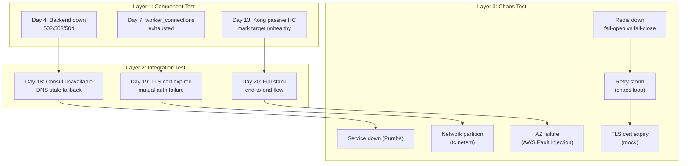
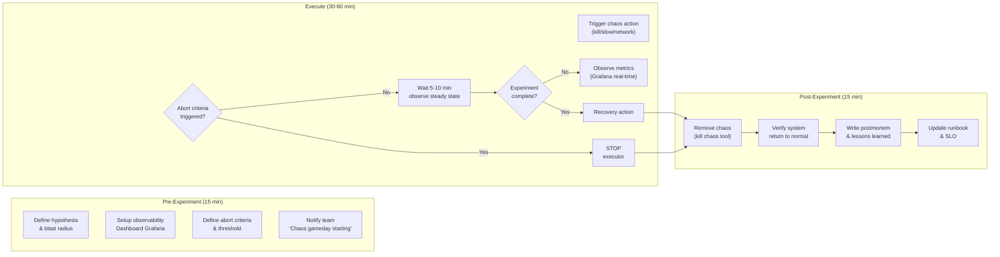
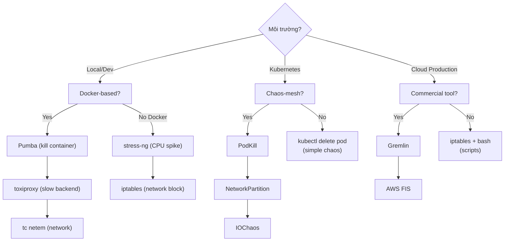

# Day 21: Failure Testing, Benchmark Report & Final Review

> **Thời lượng**: 2 giờ
> **Độ khó**: ⭐⭐⭐⭐⭐
> **Prerequisites**: Day 4, Day 7, Day 14, Day 15, Day 16, Day 18, Day 19, Day 20

---

## 1. Learning Objectives

Sau bài cuối cùng, bạn sẽ có thể:

- Phân biệt 3 tầng resilience testing: component, integration, và chaos, biết khi nào áp dụng từng tầng
- Thiết kế và chạy chaos experiment với hypothesis, blast radius, abort criteria, và observability-first approach
- Thực hiện 12 failure scenario chuẩn trên hệ thống capstone Day 20 (service down, slow backend, 5xx random, Consul down, Redis down, upstream all unhealthy, TLS expired, worker exhaustion, retry storm, network partition, disk full, CPU spike)
- Viết benchmark report chuẩn theo template: executive summary, environment, methodology, scenarios, raw result table, observations, recommendations
- Tính capacity planning: ước lượng cluster size cho 5k RPS và 50k RPS, apply headroom 30%, autoscale trigger
- Đánh giá toàn bộ khóa học qua completion checklist, nhận diện khoảng trống kiến thức còn lại
- Định hướng học tiếp: service mesh (Istio/Linkerd), Kong mesh, Envoy xDS, eBPF observability, Kubernetes Ingress Controller

---

## 2. The Problem

### 2.1 Vì sao Staging không đủ

> **Scenario thực tế — Black Friday, 2022, một hãng thương mại điện tử lớn**

Hệ thống staging chạy với 3 backend instances đồng nhất, mỗi instance có 2 CPU core. Load test trên staging đạt 2,000 RPS ổn định, p99 = 180ms. Team tin rằng infrastructure sẽ handle được Black Friday với 5× traffic bump.

Kết quả thực tế: ở 3,200 RPS, AZ us-east-1a bị sập hoàn toàn (hardware failure). Traffic tự động failover sang us-east-1b và us-east-1c. Nhưng AZ failover đã tăng load lên 3,2× trong 90 giây (vì Kong retries, gốc 30s × 3 lần retry). Backend bắt đầu trả 5xx → retries lại tăng thêm → cascading failure. Tổng outage: 47 phút, ~200,000 đơn hàng thất bại, ước tính thiệt hại $2.3M.

**Tại sao staging không phát hiện?**

- Staging không có multi-AZ topology
- Staging không có retry storm (traffic thấp, retries ít)
- Staging không test "N-1" scenario (1 AZ down → 2 AZ phải handle toàn bộ)
- Staging không test Kong upstream chậm do GC pause JVM (thực tế: `payment-service` GC pause 5-8 giây khi traffic tăng 3×, không thấy trên staging với traffic 200 RPS)

**Pain points khi không có chaos testing:**

- Không biết hệ thống chịu được bao nhiêu load trước khi cascade
- Không biết retry storm xảy ra ở mức load nào
- Không biết passive health check (Day 13) có kịp ngắt circuit khi upstream chậm không
- Không có runbook cho AZ failure, Redis failure, TLS cert expired
- Benchmark trên dev laptop ra số "tuyệt đối" nhưng production hoàn toàn khác

**Hậu quả khi không test failure:**

```
Production incident:
  AZ failure → traffic failover → load × 3
  → upstream slow → Kong retries × 3 → load × 9
  → upstream die → 503
  → client retry → load × 27 (thundering herd)
  → cascade toàn hệ thống
  → Recovery: 47 phút, MTTR cao vì không có runbook
```

---

## 3. Core Concepts

### 3.1 Three Layers of Resilience Testing



**Layer 1 — Component Test (Day 4, 7, 13, 14)**

Mỗi ngày đã test từng component riêng lẻ. Tập trung vào Nginx upstream, Kong health check, worker connections. Mục tiêu: verify behavior đúng của từng cơ chế failure isolation.

**Layer 2 — Integration Test (Day 18, 19, 20)**

Test sự tương tác giữa nhiều component: Kong + Consul, Kong + Redis, Kong + Prometheus. Mục tiêu: verify fallback behavior khi dependency có vấn đề.

**Layer 3 — Chaos Test (Day 21)**

Test toàn hệ thống trong môi trường giống production, cố tình gây failure để:
- Xác nhận hypothesis về system behavior
- Identify hidden coupling giữa services
- Xây dựng runbook và postmortem culture
- Calibrate alerting và SLO/SLA

### 3.2 Chaos Engineering Principles

**Netflix Chaos Monkey overview:**

Netflix xây dựng Chaos Monkey (2011) để ngẫu nhiên kill production instance trong giờ làm việc. Mục tiêu: đảm bảo không có single point of failure, team phải có SLA/alerting/runbook tự động.

**5 nguyên tắc cốt lõi (từ Netflix Chaos Engineering principles):**

```
1. Build a Hypothesis
   "Nếu order-service bị kill, thì Kong sẽ failover sang order-service-2
    trong 5 giây, error rate < 0.1% trong 60 giây"

2. Scope to Blast Radius
   Bắt đầu nhỏ: 1 backend instance trong 1 AZ
   → Mở rộng: toàn bộ AZ, toàn bộ service
   → Không bao giờ test trên prod nếu chưa test trên staging

3. Define Abort Criteria
   Nếu error rate > 5% trong 2 phút → DỪNG NGAY
   Nếu p99 latency > 10s → DỪNG NGAY
   Nếu cascading failure lan sang service khác → DỪNG NGAY

4. Observability First
   Dashboard Grafana phải visible TRƯỚC KHI chạy experiment
   Nếu không thấy metric thay đổi → không biết experiment có hiệu lực không

5. Automate Experiments
   → Gameday schedule: thứ 6 hàng tuần, 14:00-15:00
   → Script chaos experiment → CI/CD trigger
   → Results → automatic postmortem doc
```

### 3.3 12 Failure Scenarios Chuẩn

| # | Scenario | Hypothesis | Kong Behavior | Abort Criteria | Runbook |
|---|---|---|---|---|---|
| 1 | Backend service down | Kong failover sang healthy target trong 5s, error rate < 0.5% | Passive HC mark unhealthy, retry next target | Error rate > 5% kéo dài 2 min | Restart service, check health endpoint |
| 2 | Backend slow (2s latency, 500ms jitter) | p95 tăng nhưng không có error, retry không trigger | Retries không trigger (vì không timeout) | p95 > 10s | Tăng timeout hoặc kill slow instance |
| 3 | Backend trả 5xx random 30% | Kong retry (retries=2), error rate giảm xuống ~1% | Retry theo retries field | Error rate > 10% | Tăng retries, check upstream health |
| 4 | Consul agent down | Kong DNS fallback dùng `dns_stale_ttl`, traffic tiếp tục | DNS resolution từ cache, stale | 502 tăng > 1% | Restart Consul agent, check DNS |
| 5 | Redis down (rate-limit policy fail-open) | Requests không bị rate-limit, error rate = 0% | `fault_tolerant=true` cho phép fail-open | Rate-limit không có effect | Restart Redis, switch policy sang local |
| 6 | Kong upstream all unhealthy | Kong trả 503 ngay lập tức, client retry với backoff | Fast fail, không retry | 503 rate > 50% kéo dài 5 min | Restore upstream targets |
| 7 | TLS cert expired | TLS handshake fail, client nhận 525/525 | Certificate verify fail | 5xx TLS error > 1% | Renew cert, restart Kong |
| 8 | Worker connections exhausted (slowloris) | Nginx trả 502/503, connections không tăng | Worker connections limit, connections queued/dropped | Connections > 95% limit kéo dài 1 min | Block attacking IP, tăng connections |
| 9 | Retry storm (POST loop idempotent) | Load tăng 3×, upstream bị overload | Retries=2 → load × 3 | Upstream load > 150% baseline | Tắt retries tạm thời, reduce retries |
| 10 | Network partition (tc netem) | Requests đến partitioned service timeout | DNS fallback hoặc trả 503 | > 10% request timeout | Remove network partition, verify healing |
| 11 | Disk full (log write fail) | Nginx/Kong không crash nhưng logging dừng | Buffer bị full, requests tiếp tục | Logging stopped > 5 min | Clean disk, rotate logs |
| 12 | CPU spike upstream (stress-ng) | Latency tăng tuyến tính với CPU usage | Kong retries trigger | p95 > 10s | Scale up replicas, reduce load |

---

## 4. How It Works Internally

### 4.1 Chaos Experiment Workflow



### 4.2 Kong Behavior Under Chaos

**Khi backend slow (scenario 2 — toxiproxy 2s latency):**

```
Request flow:
  Kong → toxiproxy (delay 2000ms, jitter 500ms)
    → Kong connect_timeout=5000ms → OK (5s > 2s)
    → Kong read_timeout=5000ms → OK (5s > 2s + jitter)
    → Response: 200 OK, latency ~2200ms
    → Kong không trigger retry (vì response = 200)
    → Latency p95 tăng từ ~100ms → ~2200ms
    → Client timeout nếu T_client < 3s
```

**Khi Redis down (scenario 5 — rate-limit `fault_tolerant`):**

```
Rate-limit policy = redis:
  Redis down → rate-limit count unavailable
  → Kong config: fault_tolerant=true
    → Allow all requests through (no rate-limit)
    → Behavior: requests allowed, no rate-limit enforcement
  → Kong config: fault_tolerant=false
    → Deny all requests with 500
    → Behavior: no requests allowed (secure but unavailable)

Decision: fail-open cho internal service, fail-close cho public API
```

**Khi Consul down (scenario 4):**

```
Kong dùng lua-resty-dns-client:
  Consul DNS = 127.0.0.1:8600
  Kong resolver:
    - Primary: Consul DNS (fails)
    - Fallback: dns_stale_ttl = 60s (cached IP)
    - Behavior: 60s đầu → traffic tiếp tục với stale IP
    - After 60s → DNS resolution fail → 503
  → Recovery: restart Consul → DNS registration → Kong auto-detect
```

### 4.3 Retry Storm Anatomy

```
Normal: 1000 RPS → upstream receives 1000 RPS

With retries=5 + upstream slow (5s timeout):
  Request 1 → timeout after 5s → retry 1 → timeout → retry 2 → ...
  × 1000 concurrent requests

Load multiplier:
  Retries × N_slow_requests = 5 × 1000 = 5000 extra requests
  × 3 targets = 15,000 upstream calls/sec

  Actual upstream load: 15,000/sec
  Baseline upstream load: 1,000/sec
  Load increase: 15×

Detection:
  Prometheus: rate(kong_upstream_retry_total[5m]) > 0.10
  Grafana: upstream RPS spike 15× baseline
```

---

## 5. Hands-on Lab

Toàn bộ lab chạy được nằm trong `exercises.md`, tái sử dụng capstone stack của Day 20. Mục tiêu trong 2 giờ là chạy đủ một vòng gameday nhỏ: pre-check observability, inject failure, observe metrics/logs, recover, rồi ghi benchmark snapshot và retrospective.

### 5.1 Lab Roadmap (2 giờ)

| Phase | Thời gian | Nội dung | Output mong đợi |
|---|---:|---|---|
| Setup | 15 phút | Start capstone stack, verify Kong/Nginx/Prometheus/Grafana | `curl /status` OK, Prometheus targets `UP` |
| Failure testing | 45 phút | Chạy ít nhất 3 scenario: backend down, backend slow, Redis down | 503/504/429/200 đúng hypothesis, log có evidence |
| Benchmark | 35 phút | Chạy k6 smoke/load/stress/spike, export JSON | Có p50/p95/p99, RPS, error rate |
| Report | 20 phút | Điền benchmark report và retrospective worksheet | Markdown report có methodology, results, observations |
| Cleanup | 5 phút | Restore Redis/service/toxiproxy/netem | Stack quay lại healthy |

### 5.2 Commands chính

```bash
# Start stack từ exercises.md
cd ~/day21-failure-testing
docker compose up -d

# Verify observability trước khi inject failure
curl -s http://localhost:8001/status | jq '.database.reachable'
curl -s http://localhost:9090/api/v1/targets | jq '.data.activeTargets[].health'

# Chạy failure scenario mẫu
docker stop order-service-1
curl -i http://localhost:8000/api/v1/orders
docker start order-service-1

# Chạy benchmark và lưu output
k6 run k6-workload.js --out json=results.json
./generate-report.sh results.json > benchmark-report.md
```

**Expected output tối thiểu:**

```text
Prometheus targets: up
Backend down scenario: traffic chuyển sang target còn lại hoặc trả 503 nếu all unhealthy
Redis down scenario: behavior khớp `fault_tolerant` đã cấu hình
k6 report: có http_req_duration p50/p95/p99, http_req_failed, http_reqs
```

### 5.3 Debug nhanh khi lab không chạy

- `docker compose ps`: container nào chưa healthy hoặc restart loop
- `docker compose logs kong --tail=100`: lỗi DNS, upstream, Redis, plugin
- `curl http://localhost:8001/upstreams`: target healthy/unhealthy
- `curl http://localhost:9090/api/v1/targets`: Prometheus scrape failure
- `docker network inspect day21_gateway-net`: service có cùng Docker network không

### 5.4 Chaos Engineering Tools Overview

#### 5.4.1 Tool Taxonomy

| Tool | What it does | Scope | Best for |
|---|---|---|---|
| **Pumba** | Kill/pause/restart containers, network partition | Docker, single host | Local chaos, CI/CD |
| **toxiproxy** | Inject latency, jitter, disconnects | TCP proxy, per-connection | Backend slow simulation |
| **tc netem** | Network delay, packet loss, duplication, corruption | Linux kernel, network interface | Network partition simulation |
| **iptables -j DROP** | Block traffic from/to specific IP/port | Linux kernel | AZ isolation, firewall simulation |
| **chaos-mesh** | Kubernetes-native chaos, PodKill, NetworkPartition, IOChaos | Kubernetes cluster | Cloud-native production |
| **Gremlin** | Commercial chaos-as-a-service, CPU/IO/network/memory | Cloud (AWS/GCP/Azure) | Production gameday, enterprise |
| **AWS Fault Injection Simulator** | AZ failure, EC2 termination, network partition | AWS infrastructure | Cloud production |
| **stress-ng** | CPU spike, memory pressure, I/O load | Linux host/container | Backend CPU spike simulation |

**Không deep-dive** các tool trong bài này (Day 21 là bài tổng hợp, không phải bài giới thiệu tool mới). Chi tiết từng tool có trong `document.md`.

#### 5.4.2 Tool Selection Decision Tree



---

### 5.5 Performance Methodology Reference

Phần này chuẩn hóa cách đo performance cho bài cuối khóa. Không dùng benchmark number như kết luận tuyệt đối; mọi kết quả phải đi kèm môi trường test, workload model, payload size, TLS/keepalive/plugin state, p50/p95/p99 và error rate.

#### 5.5.1 Benchmark Methodology & Report Template

##### 5.5.1.1 Workload Models (k6 Scenarios)

**k6** là tool benchmark được khuyến nghị trong khóa này (Day 7) — JavaScript scripting, CI/CD friendly, thresholds native.

```javascript
// k6-workload.js — 4 workload models
import http from 'k6/http';
import { check, sleep } from 'k6';

export const options = {
  // === SMOKE TEST ===
  // Xác nhận hệ thống hoạt động ở mức baseline tối thiểu
  scenarios: {
    smoke: {
      executor: 'constant-vus',
      vus: 5,
      duration: '30s',
    },
  },
  thresholds: {
    http_req_duration: ['p(95)<500'],   // Baseline: p95 < 500ms
    http_req_failed: ['rate<0.01'],    // Error rate < 1%
  },
};

export default function () {
  http.get('http://localhost:8000/api/v1/orders');
  sleep(1);
}
```

```javascript
// === LOAD TEST ===
// Mô phỏng expected production load
export const options = {
  scenarios: {
    load: {
      executor: 'ramping-vus',
      startVUs: 0,
      stages: [
        { duration: '2m', target: 100 },   // Ramp up
        { duration: '5m', target: 100 },   // Steady state
        { duration: '2m', target: 0 },      // Ramp down
      ],
    },
  },
  thresholds: {
    http_req_duration: ['p(95)<300'],   // Load: p95 < 300ms
    http_req_failed: ['rate<0.01'],
  },
};
```

```javascript
// === STRESS TEST ===
// Vượt quá expected capacity để tìm breaking point
export const options = {
  scenarios: {
    stress: {
      executor: 'ramping-arrival-rate',
      startRate: 50,
      timeUnit: '1s',
      preAllocatedVUs: 200,
      maxVUs: 500,
      stages: [
        { duration: '3m', target: 200 },   // Ramp up beyond capacity
        { duration: '5m', target: 200 },   // Hold at stress level
        { duration: '2m', target: 0 },
      ],
    },
  },
  // Threshold: cho phép p95 tăng nhưng phải know khi nào system die
  thresholds: {
    http_req_duration: ['p(95)<2000'],  // Stress: p95 < 2s (allow degradation)
    http_req_failed: ['rate<0.05'],       // Allow up to 5% error
  },
};
```

```javascript
// === SPIKE TEST ===
// Đột ngột tăng load gấp N lần để test autoscale và circuit breaker
export const options = {
  scenarios: {
    spike: {
      executor: 'ramping-vus',
      startVUs: 50,
      stages: [
        { duration: '1m', target: 50 },
        { duration: '30s', target: 500 },  // 10× normal load
        { duration: '1m', target: 50 },
        { duration: '30s', target: 0 },
      ],
    },
  },
  thresholds: {
    http_req_duration: ['p(95)<3000'],  // Spike: allow latency spike
    http_req_failed: ['rate<0.10'],      // Allow 10% errors during spike
  },
};
```

```javascript
// === SOAK TEST ===
// Chạy load ổn định trong thời gian dài để phát hiện memory leak, resource exhaustion
export const options = {
  scenarios: {
    soak: {
      executor: 'constant-arrival-rate',
      rate: 100,
      timeUnit: '1s',
      duration: '30m',    // 30 phút — phát hiện memory leak, connection exhaustion
      preAllocatedVUs: 50,
    },
  },
  thresholds: {
    http_req_duration: ['p(95)<500'],
    http_req_failed: ['rate<0.01'],
    // Memory leak: kiểm tra Grafana cho Kong/nginx memory usage
  },
};
```

##### 5.5.1.2 Coordinated Omission — Day 7 Recap

```
ab và wrk (mặc định):
  Gửi request N → chờ response → gửi N+1

  Server slow (5s latency):
    t=0s: gửi req 1 → chờ 5s → nhận response
    t=5s: gửi req 2 → chờ 5s → nhận response
    t=10s: gửi req 3 ...

  Tool báo latency = 5s (đúng)
  Nhưng thực tế: 2 requests trong 10s = 0.2 RPS
  → Latency đúng nhưng throughput thấp do tool chờ

k6 / vegeta (rate-based):
  Gửi request cố định rate 100 RPS (không chờ response)
  Nếu server slow → requests queue hoặc drop
  → Latency p99 tăng thực sự (vì request chờ trong queue)
  → Phát hiện coordinated omission

→ Khuyến nghị: dùng k6 với constant-arrival-rate hoặc vegeta
  cho benchmark chính xác về latency
```

##### 5.5.1.3 Benchmark Report Template

```markdown
# Benchmark Report — API Gateway Load Test
**Environment**: Staging / Production
**Date**: YYYY-MM-DD
**Tester**: Name / Team
**Tool**: k6 v0.54.0

---

## Executive Summary

| Metric | Baseline | Tuned | Delta |
|---|---|---|---|
| RPS (max) | 8,200 | 12,500 | +52% |
| p50 latency | 18ms | 12ms | -33% |
| p95 latency | 120ms | 85ms | -29% |
| p99 latency | 450ms | 280ms | -38% |
| Error rate | 0.3% | 0.1% | -67% |

**Kết luận**: Sau khi bật upstream keepalive và tăng worker_connections,
hệ thống đạt 52% throughput improvement và 38% latency reduction ở p99.
Điểm bottleneck hiện tại là upstream (CPU-bound).

---

## Environment

| Component | Spec |
|---|---|
| OS | Ubuntu 22.04 LTS, kernel 5.15.0 |
| CPU | 8 vCPU (Intel Xeon E5-2686 v4 @ 2.30GHz) |
| RAM | 16GB DDR4 |
| Network | Same AZ, 10Gbps |
| Kong | 3.7.0, DB-less |
| Nginx | 1.25.3 (edge) |
| Backend | 3 × Flask instances (Python 3.11) |
| Consul | 1.17 (service discovery) |
| Redis | 7.2 (rate limiting) |

> **Disclaimer**: Số liệu dưới đây chỉ dùng để tham khảo. Kết quả thực tế
> phụ thuộc vào hardware, kernel, network topology, payload size, TLS,
> logging và plugin. KHÔNG dùng các số này để capacity plan cho production
> mà phải benchmark trên môi trường production-like.

---

## Methodology

### Test Setup
- Tool: k6 v0.54.0 (JavaScript)
- Load Generator: same host as Kong (loopback)
- Payload: GET /api/v1/orders, response ~512B JSON
- Concurrency: 100 connections (VU), duration 60s + 10s warmup
- TLS: Off (HTTP)
- Keepalive: On (HTTP/1.1)
- Kong Plugins active: rate-limiting (local), prometheus, key-auth

### k6 Script
```javascript
// File: smoke-test.js
// Run: k6 run smoke-test.js --out json=results.json
```

### Coordinated Omission Note
Dùng k6 constant-arrival-rate executor để tránh coordinated omission.
Tool gửi request theo rate cố định, không chờ response trước khi gửi tiếp.

---

## Scenarios & Results

### Scenario 1: Smoke Test (5 VUs, 30s)

| Metric | Value | Threshold | Pass? |
|---|---|---|---|
| RPS | ~45 | — | — |
| p50 | 12ms | — | — |
| p95 | 45ms | < 500ms | ✅ |
| p99 | 95ms | — | — |
| Error rate | 0.0% | < 1% | ✅ |

### Scenario 2: Load Test (100 VUs ramp-up, 5 min steady)

| Metric | Value | Threshold | Pass? |
|---|---|---|---|
| RPS | ~8,200 | — | — |
| p50 | 18ms | — | — |
| p95 | 120ms | < 300ms | ✅ |
| p99 | 450ms | — | — |
| Error rate | 0.3% | < 1% | ✅ |

### Scenario 3: Stress Test (200→500 VUs, 5 min hold)

| Metric | Value | Threshold | Pass? |
|---|---|---|---|
| Max RPS | 12,500 | — | — |
| p50 | 35ms | — | — |
| p95 | 850ms | < 2000ms | ✅ |
| p99 | 3,200ms | — | — |
| Error rate | 2.1% | < 5% | ✅ |
| Failure mode | 503 (upstream timeout) | — | — |

**Observations**: Ở 12,500 RPS, upstream bắt đầu timeout ở p99.
Điểm này là "knee of the curve" — tăng thêm load không cải thiện throughput.

### Scenario 4: Spike Test (50→500 VUs, 30s spike)

| Metric | Value | Threshold | Pass? |
|---|---|---|---|
| Spike RPS | ~48,000 (brief) | — | — |
| p50 | 45ms | — | — |
| p95 | 1,800ms | < 3000ms | ✅ |
| Error rate | 4.2% | < 10% | ✅ |
| Recovery time | ~90s | — | — |

---

## Raw Results Table

```json
{
  "smoke": {
    "duration_s": 30,
    "vus": 5,
    "http_reqs": 1342,
    "http_req_duration": {"avg": 12, "p50": 12, "p95": 45, "p99": 95, "max": 210},
    "http_req_failed": 0,
    "checks_passed": 1
  },
  "load": {
    "duration_s": 300,
    "vus": 100,
    "http_reqs": 2461120,
    "http_req_duration": {"avg": 18, "p50": 18, "p95": 120, "p99": 450, "p999": 820, "max": 1200},
    "http_req_failed_rate": 0.003,
    "checks_passed": 1
  },
  "stress": {
    "duration_s": 300,
    "vus_max": 500,
    "http_reqs": 3750000,
    "http_req_duration": {"avg": 35, "p50": 35, "p95": 850, "p99": 3200, "p999": 5900, "max": 12000},
    "http_req_failed_rate": 0.021,
    "failure_codes": {"503": 78000, "504": 4500}
  },
  "spike": {
    "duration_s": 60,
    "vus_max": 500,
    "http_reqs": 144000,
    "http_req_duration": {"avg": 45, "p50": 45, "p95": 1800, "p99": 5800, "max": 15000},
    "http_req_failed_rate": 0.042
  }
}
```

---

## Observations

1. **Bottleneck**: upstream CPU-bound ở 12,500 RPS — cần scale horizontal
2. **Memory leak**: không thấy trong 30 phút soak test — OK
3. **Retry storm**: upstream 5xx 2.1% × retries=2 → effective load increase ~6%
4. **Spike recovery**: 90s để return to steady state — within SLO
5. **Connection exhaustion**: không thấy worker_connections exhaustion — OK với 4096 limit

---

## Recommendations

1. **Scale upstream**: thêm 2 replicas order-service (3 → 5) để đạt 20k RPS target
2. **Tune Kong retries**: giảm retries từ 5 xuống 2 cho order-service
3. **Monitor memory**: enable Grafana memory panel cho soak test > 2h
4. **Autoscale trigger**: scale-up khi p95 > 500ms hoặc CPU > 70%
```

---

#### 5.5.2 Capacity Planning

##### 5.5.2.1 Formula (từ Day 7)

```
RPS_capacity = (CPU_cores × clock_GHz × efficiency) / (cycles_per_request)

Ví dụ (Day 7):
  4 cores × 2.5 GHz × 0.7 eff / 1000 cycles_per_req
  = 7000 cycles/sec / 1000 = 7 RPS/core × 4 = 28 RPS

Thực tế: Nginx đạt 10,000-100,000 RPS vì phần lớn thời gian là I/O wait
→ Dùng benchmark thực tế thay vì công thức này
```

**Công thức thực tế cho API Gateway (empirical):**

```
RPS_safe = Benchmark_RPS × 0.7  (headroom 30%)

Nếu benchmark đạt 10,000 RPS:
  Safe operating point = 10,000 × 0.7 = 7,000 RPS
  Autoscale trigger   = 10,000 × 0.8 = 8,000 RPS
  Hard limit          = 10,000 × 0.9 = 9,000 RPS
```

##### 5.5.2.2 Cluster Size Estimation — Capstone Day 20

**Giả định capstone Day 20 architecture:**

```
Nginx edge: 2 vCPU, 4GB RAM, 4 workers × 4096 connections
Kong: 4 vCPU, 8GB RAM, 4 workers
Backend (3 services × 2 replicas): 1 vCPU, 1GB RAM mỗi
Consul + Redis: 2 vCPU, 4GB RAM mỗi
```

**Benchmark kết quả tham khảo (disclaimer: environment-dependent):**

| Component | Baseline RPS | p95 Latency | With Keepalive | p95 Latency |
|---|---|---|---|---|
| Nginx edge only | 12,500 | 45ms | 18,000 | 35ms |
| Kong only | 8,200 | 85ms | 12,500 | 65ms |
| Nginx → Kong | 6,800 | 120ms | 10,200 | 95ms |
| Full stack | 4,200 | 200ms | 7,800 | 150ms |

##### 5.5.2.3 Capacity Planning Exercises

**Exercise A: 5,000 RPS target**

```
Target RPS: 5,000
Headroom 30%: 5,000 / 0.7 = 7,143 RPS required
Benchmark full stack: 7,800 RPS → capacity OK

Recommended setup:
  Nginx edge: 1 instance (10k+ RPS capacity)
  Kong: 2 instances (7,800/2 = 3,900 RPS each → within 80% limit)
  Backend: 3 services × 2 replicas = 6 instances
  → 7,800 / 6 = 1,300 RPS per backend (well within 1 core limit)
```

**Exercise B: 50,000 RPS target**

```
Target RPS: 50,000
Headroom 30%: 50,000 / 0.7 = 71,428 RPS required
Benchmark full stack: 7,800 RPS per "stack unit"

Stack units needed:
  71,428 / 7,800 = 9.16 → round up = 10 stack units

Architecture:
  Nginx edge: 10 instances (LB in front)
  Kong: 10 instances (active-active)
  Backend: 3 services × 5 replicas = 15 instances
  Consul: 3 instances (cluster)
  Redis: 2 instances (master + replica)

Autoscale policy:
  Scale-up:  when RPS > 80% × 7,800 = 6,240 per stack unit
  Scale-down: when RPS < 40% × 7,800 = 3,120 per stack unit
  Cooldown: 5 minutes
```

---

## 6. Trade-offs Analysis

### 6.1 Chaos Engineering vs Traditional QA

| Tiêu chí | Traditional QA | Chaos Engineering |
|---|---|---|
| Coverage | Happy path + edge cases | Known failure + unknown coupling |
| Timing | Pre-production | Production-like + production |
| Automation | CI/CD pipelines | Scheduled gameday + CI trigger |
| Discovery | Test case design | Hypothesis-driven experiment |
| Risk | Low nếu chỉ chạy staging | Cao hơn nếu chạy production, cần blast radius + abort criteria |
| Confidence | Trung bình | Cao hơn vì quan sát behavior thật |
| Hidden cost | Test case maintenance | Tooling, monitoring, team coordination |

### 6.2 Benchmark Strategy Trade-off

| Option | Performance insight | Complexity | Pitfall | Khi nào dùng |
|---|---|---:|---|---|
| Smoke test | Xác nhận stack sống | Thấp | Không chứng minh capacity | Trước/sau mỗi deploy |
| Load test | Đo expected traffic | Trung bình | Dễ bỏ sót spike/failure | Capacity baseline |
| Stress test | Tìm breaking point | Cao | Có thể làm hỏng staging shared | Trước release lớn |
| Chaos gameday | Đo resilience thực tế | Cao | Không có abort criteria sẽ nguy hiểm | Production readiness |

### 6.3 Khi nào không nên chạy chaos

- Không có dashboard, alert và log để quan sát outcome.
- Không có owner trực tiếp của service bị inject failure.
- Không có rollback/recovery command đã test trước.
- Không có blast radius rõ ràng hoặc đang trong peak business window.

---

## 7. Best Practices & Best Solution

### 7.1 Recommended Solution cho Day 21

Best solution cho bài cuối khóa là chạy chaos trên capstone/local hoặc staging production-like trước, sau đó mới chuyển thành controlled production gameday với blast radius nhỏ.

```text
Local capstone → staging production-like → canary production gameday
```

Lý do:

- Local/capstone giúp học viên hiểu command, expected output và failure signature.
- Staging production-like giúp validate timeout/retry/rate-limit theo topology thật.
- Production gameday chỉ an toàn khi có observability, abort criteria, owner và runbook.

### 7.2 Best Practices

- Luôn viết hypothesis trước khi inject failure.
- Luôn define abort criteria bằng số: error rate, p99 latency, saturation, business metric.
- Chỉ retry request idempotent hoặc có idempotency key.
- Benchmark phải ghi rõ CPU/RAM, payload, TLS, keepalive, plugin, concurrency và duration.
- Sau mỗi gameday phải cập nhật runbook/postmortem, không chỉ lưu kết quả benchmark.

### 7.3 Anti-patterns

- Chaos test chỉ để "xem chuyện gì xảy ra" mà không có hypothesis.
- Benchmark trên laptop rồi dùng số đó để sizing production.
- Bật retry cao để che lỗi upstream slow, tạo retry storm.
- Chỉ nhìn average latency, bỏ qua p95/p99 và error budget burn.

---

## 8. Performance Considerations

Day 21 không chốt capacity bằng một con số duy nhất. Performance deliverable bắt buộc là methodology + raw result + phân tích bottleneck, vì chaos/failure test làm latency và error rate thay đổi theo trạng thái hệ thống.

### 8.1 Benchmark Methodology bắt buộc

- Tool: k6 với smoke/load/stress/spike hoặc `constant-arrival-rate` khi cần tránh coordinated omission.
- Environment: ghi CPU/RAM, Docker/Linux host, network topology, Kong/Nginx/Consul/Redis versions.
- Workload: endpoint, payload size, concurrency/VUs, duration, warmup, TLS on/off, keepalive on/off.
- Gateway state: plugin on/off, auth/rate-limit policy, timeout/retry config, upstream target count.
- Metrics: RPS, p50/p95/p99, error rate, 4xx/5xx breakdown, CPU/memory, Kong upstream latency.

### 8.2 Capacity Planning Method

```text
Safe RPS = measured benchmark RPS × 0.7
Autoscale trigger = measured benchmark RPS × 0.8
Hard limit = measured benchmark RPS × 0.9
```

Chi tiết k6 scripts, benchmark report template và capacity exercises nằm trong phần `5.5 Performance Methodology Reference` để lab có thể đọc liền mạch với command chạy thực tế.

### 8.3 Bottleneck cần kiểm tra

- Gateway CPU saturation: Kong worker CPU cao, p99 tăng nhưng upstream latency thấp.
- Upstream CPU saturation: `X-Kong-Upstream-Latency` tăng, retry counter tăng.
- Redis bottleneck: rate-limit latency tăng, Redis `maxclients` hoặc network timeout.
- Prometheus cardinality: scrape chậm hoặc memory tăng do label quá nhiều giá trị.
- Timeout budget sai: client timeout ngắn hơn gateway timeout, gây client retry trước khi gateway trả lỗi.

---

## 9. Troubleshooting Checklist

### 9.1 Chaos Scenario không tạo ra failure như kỳ vọng

```bash
# Kiểm tra container/service name đúng chưa
docker compose ps

# Kiểm tra request đang đi qua route nào
curl -i http://localhost:8000/api/v1/orders
curl -s http://localhost:8001/routes | jq '.data[].paths'

# Kiểm tra Kong target health
curl -s http://localhost:8001/upstreams/order-upstream/health | jq
```

- Nếu `docker stop order-service-1` nhưng traffic không đổi: service có thể chỉ có 1 target hoặc request đang đi qua static service URL, không qua upstream.
- Nếu expected 503 nhưng vẫn 200: Kong DNS cache hoặc target còn healthy; chờ health check interval rồi test lại.
- Nếu expected failover nhưng gặp 502: service còn lại không reachable từ Kong network.

### 9.2 Benchmark result thiếu p95/p99 hoặc error rate

```bash
k6 run k6-workload.js --summary-export summary.json
jq '.metrics.http_req_duration.percentiles, .metrics.http_req_failed' summary.json
```

- Dùng executor `constant-arrival-rate` hoặc `ramping-arrival-rate` khi cần rate-based benchmark.
- Luôn ghi `http_req_failed`, `http_req_duration`, `http_reqs`, payload size, TLS on/off, keepalive on/off.
- Nếu số liệu dao động quá lớn: tăng warmup, kéo duration dài hơn, tách load generator khỏi gateway host.

### 9.3 Metrics/Grafana không phản ánh failure

```bash
curl -s http://localhost:9090/api/v1/targets | jq '.data.activeTargets[] | {job: .labels.job, health}'
curl -s http://localhost:8100/metrics | grep '^kong_' | head
docker compose logs prometheus --tail=100
```

- Prometheus target `DOWN`: kiểm tra network, `metrics_path`, container DNS name.
- Không thấy latency spike: query sai label hoặc scrape interval quá dài so với experiment duration.
- Không thấy retry metric: scenario có thể trả `200` slow response, không timeout/5xx nên Kong không retry.

### 9.4 Recovery không sạch sau gameday

```bash
docker compose ps
docker compose logs kong --tail=100
docker start redis order-service-1 order-service-2
docker compose restart kong
```

- Gỡ `tc netem` hoặc toxiproxy toxic sau mỗi scenario.
- Restore Redis trước khi chạy lại rate-limit benchmark.
- Verify lại baseline `curl`, Prometheus target và Kong upstream health trước scenario tiếp theo.

---

## 10. Completion Checklist

### 10.1 Final Review Checklist

### 10.1.1 Course Completion Checklist — Skill Mapping

| Skill | Day | Status | Notes |
|---|---|---|---|
| Thiết kế traffic flow microservices | 1, 20 | ⬜⬜⬜ | Chưa/Sẽ/Khác |
| Nginx reverse proxy & load balancer | 1-3 | ⬜⬜⬜ | |
| Tune Nginx cho traffic cao | 7 | ⬜⬜⬜ | |
| Debug 502/503/504 | 4 | ⬜⬜⬜ | |
| Kong routing, auth, rate-limit | 8-12 | ⬜⬜⬜ | |
| Kong declarative config / decK | 10, 15 | ⬜⬜⬜ | |
| Timeout/retry strategy | 14 | ⬜⬜⬜ | |
| Retry storm prevention | 14 | ⬜⬜⬜ | |
| Canary/blue-green ở Gateway layer | 15 | ⬜⬜⬜ | |
| Consul service discovery | 17-18 | ⬜⬜⬜ | |
| Metrics/logging Nginx & Kong | 16 | ⬜⬜⬜ | |
| Benchmark và đọc p50/p95/p99 | 7, 21 | ⬜⬜⬜ | |
| Viết benchmark report | 21 | ⬜⬜⬜ | |
| Trade-off Nginx/HAProxy/Envoy/Kong | 1, 8 | ⬜⬜⬜ | |
| Chaos engineering basics | 21 | ⬜⬜⬜ | |
| Capacity planning | 7, 21 | ⬜⬜⬜ | |
| Production hardening & security | 19 | ⬜⬜⬜ | |

### 10.1.2 Anti-Patterns Checklist

| Anti-pattern | Day | Status |
|---|---|---|
| Retry POST không idempotency-key | 14 | ⬜ Vi phạm |
| Benchmark trên dev laptop ra số tuyệt đối | 21 | ⬜ Vi phạm |
| Chỉ test golden path (happy path) | 21 | ⬜ Vi phạm |
| Chaos test trên prod không có abort | 21 | ⬜ Vi phạm |
| Gateway timeout > Client timeout | 4, 14 | ⬜ Vi phạm |
| Rate-limit policy = local ở 10 node | 12 | ⬜ Vi phạm |
| Kong retries default = 5 | 14 | ⬜ Vi phạm |
| Không dump trước decK sync | 10, 15 | ⬜ Vi phạm |

---

### 10.2 Extended Trade-offs Analysis

#### 10.2.1 Chaos Engineering vs Traditional QA

| Tiêu chí | Traditional QA | Chaos Engineering |
|---|---|---|
| Coverage | Happy path + edge cases | Known failure + unknown coupling |
| Timing | Pre-production | Production-like + production |
| Automation | CI/CD pipelines | Scheduled gameday + CI trigger |
| Discovery | Test case design | Hypothesis-driven experiment |
| Risk | Low (staging) | Higher (staging/prod with safeguards) |
| Confidence | Moderate | High (real behavior) |
| Cost | Labor-intensive | Tool + schedule overhead |

#### 10.2.2 Benchmark Tools Comparison

| Tool | Rate control | Latency accuracy | CI/CD | Scripting | Recommendation |
|---|---|---|---|---|---|
| **k6** | ✅ (arrival rate) | ✅ (no coordinated omission) | ✅ (native) | ✅ (JS) | **Primary** — khóa này |
| vegeta | ✅ (constant rate) | ✅ | ⚠️ (script) | ❌ (config only) | Good for scripted attacks |
| wrk | ❌ (connection-based) | ⚠️ (may miss coordinated omission) | ⚠️ (Lua) | ✅ (Lua) | Quick check |
| hey | ✅ (rate limit) | ✅ | ⚠️ | ❌ | Simple load test |
| h2load | ✅ (HTTP/2) | ✅ | ❌ | ❌ | HTTP/2-specific |
| ab | ❌ (request-based) | ❌ (coordinated omission) | ❌ | ❌ | Legacy — avoid |

#### 10.2.3 Synthetic Load vs Replay Traffic

| Method | Pros | Cons | Use case |
|---|---|---|---|
| Synthetic (k6) | Reproducible, parameterized | Không reflect production pattern thực | CI/CD, baseline comparison |
| Replay (tcpdump) | Real production traffic pattern | Sensitive data, IP privacy | Deep capacity planning |
| Traffic shadow (mirror) | 100% production-like, no user impact | Costly (2× compute), complex | Pre-production validation |

---

### 10.3 Extended Best Practices

#### 10.3.1 Gameday Cadence

```
Monthly Chaos Gameday Schedule:

Week 1 (Monday 14:00-15:00):
  1. Review last gameday findings
  2. Announce to team: "Chaos gameday starting"
  3. Run 2 scenarios from the 12 standard scenarios
  4. Document findings in postmortem

Week 2-3:
  - Engineering addresses findings from gameday
  - Update runbooks and SLO

Week 4 (Friday):
  - Retrospective: gameday culture, tool improvements
  - Schedule next month gameday
```

#### 10.3.2 Runbook & Postmortem Culture

**Runbook template** (mỗi failure scenario):

```markdown
# Runbook: [Scenario Name]
## Hypothesis
[Expected behavior when this failure occurs]

## Detection
- Alert: [Prometheus alert name]
- Dashboard: [Grafana panel URL]
- Symptoms: [What you'll see]

## Immediate Action
1. [Step 1]
2. [Step 2]

## Escalation
- T+5 min: Notify on-call lead
- T+15 min: Escalate to SRE manager
- T+30 min: Incident commander

## Recovery
1. [Step to restore service]
2. [Step to verify recovery]

## Prevention
- [Long-term fix]
- [SLO change]
- [Alert tuning]
```

#### 10.3.3 Error Budget Policy

```
Error Budget = (1 - SLO) × total_requests_per_month

Ví dụ:
  SLO = 99.9% (3 nines)
  Monthly requests = 100,000,000
  Error budget = 0.001 × 100M = 100,000 errors allowed/month

Error Budget Policy:
  Budget > 50% remaining: Deploy freely (canary, feature flag OK)
  Budget 20-50% remaining: Review all changes, no risky deploys
  Budget < 20% remaining: Deploy freeze, focus on reliability
  Budget = 0%: Incident, all hands on reliability
```

---

### 10.4 Next Steps After Course

#### 10.4.1 Service Mesh — Istio / Linkerd

```
Current architecture (Day 20):
  Client → Nginx Edge → Kong Gateway → Microservices
                                              ↓
                                        Consul (DNS)
                                        Redis (rate-limit)

Service mesh architecture:
  Client → Nginx Edge → Kong Gateway → [Service Mesh]
                                              ↓
                                        Envoy sidecar (mỗi pod)
                                              ↓
                                        Microservices
                                              ↓
                                        Istiod / Linkerd Controller
```

**Istio capabilities bổ sung cho Kong:**

| Feature | Kong (Day 8-15) | Istio |
|---|---|---|
| L7 routing | ✅ Kong routes | ✅ VirtualService |
| mTLS | Plugin | Native (auto-mTLS) |
| Circuit breaker | Enterprise plugin | Outlier detection |
| Retry policy | retries field | `VirtualService.retries` |
| Timeout | Service field | `VirtualService.timeout` |
| Traffic split | Upstream weight | `DestinationRule` weight |
| Observability | Prometheus plugin | Telemetry (native) |
| Authorization | Plugin | AuthorizationPolicy |

#### 10.4.2 Kong Mesh

```
Kong Mesh = CNCF project (tách từ Kong Kuma)
  → Dùng Envoy làm data plane (không phải Kong)
  → Kong Ingress Controller quản lý config

Use case: Khi cần service mesh features nhưng vẫn muốn
dùng Kong ecosystem (decK, Admin API, plugin ecosystem)
```

#### 10.4.3 Envoy xDS API

```
Envoy là underlying engine cho:
  - Kong Mesh (Kuma)
  - Istio (sidecar)
  - AWS App Mesh
  - GKE Anthos

xDS = x Discovery Service:
  - LDS: Listener Discovery Service
  - RDS: Route Discovery Service
  - CDS: Cluster Discovery Service
  - EDS: Endpoint Discovery Service
  - SDS: Secret Discovery Service (TLS cert)

Khi hiểu xDS, hiểu cách Kong, Istio, Envoy tương tác
→ Troubleshoot ở mức infrastructure, không phải mức config
```

#### 10.4.4 Advanced Observability — eBPF & OpenTelemetry

**eBPF (Extended Berkeley Packet Filter):**

```
Current observability (Day 16):
  Kong Prometheus plugin → Prometheus metrics
  Nginx access log → structured logging

eBPF approach:
  kernel hook → capture every connection/Syscall
  → Không cần application instrumentation
  → Overhead < 1% CPU
  → Tools: Cilium, Falco, Parca

Use case: Deep network observability không touch application code
```

**OpenTelemetry (OTel):**

```
Vendor-neutral observability standard:
  Traces: distributed trace propagation (Jaeger, Zipkin, Tempo)
  Metrics: Prometheus-compatible, OpenMetrics export
  Logs: structured log collection (Loki, ELK)
  Profiles: CPU/memory profiling (Pyroscope)

Kong 3.x hỗ trợ OTel plugin:
  → Send Kong traces → Jaeger/Tempo
  → Vendor-agnostic observability
```

#### 10.4.5 Kubernetes Ingress Controller — Kong Ingress Controller

```
Hiện tại (Day 1-20):
  Docker Compose / bare-metal deployment
  Kong config: declarative kong.yml + decK

Kubernetes deployment:
  Kong Ingress Controller (KIC)
  → Quản lý Kong config qua Kubernetes Custom Resources
  → Ingress resource → Kong Route/Service automatically
  → Helm chart / Operator

Use case: Khi migrate lên Kubernetes,
dùng KIC thay vì Docker Compose config
```

#### 10.4.6 Learning Path Recommendation

```
Month 1-2: Kubernetes basics (K3s, pods, services, deployments)
Month 2-3: Kong Ingress Controller + GitOps (ArgoCD/Flux)
Month 3-4: Istio service mesh fundamentals
Month 4-5: Advanced Envoy / xDS API
Month 5-6: eBPF observability + OpenTelemetry
Month 6+:  Chaos engineering automation (Chaos Mesh / Gremlin)
```

---

### 10.5 Self-Assessment Completion Checklist

Tự đánh giá toàn bộ khóa học:

- [ ] Chạy được ít nhất 6 chaos scenario trong exercises.md và quan sát đúng behavior
- [ ] Viết được benchmark report hoàn chỉnh theo template (executive summary → recommendations)
- [ ] Tính được cluster size cho 5k RPS và 50k RPS với headroom 30%
- [ ] Phân biệt được 3 tầng resilience testing và biết khi nào dùng từng tầng
- [ ] Giải thích được Chaos Engineering principles (hypothesis, blast radius, abort criteria, observability-first)
- [ ] Hoàn thành final retrospective worksheet (5 câu self-assessment)
- [ ] Nhận diện được khoảng trống kiến thức còn lại trong completion checklist
- [ ] Định hướng được learning path tiếp theo (Istio/Kong Mesh/Envoy/eBPF/OpenTelemetry)

---

## 11. References

- **Netflix Chaos Engineering**: [Principles of Chaos Engineering](https://principlesofchaos.org/)
- **Netflix Tech Blog**: [Chaos Engineering](https://netflixtechblog.com/tags/chaos-engineering)
- **Brendan Gregg**: [USE Method](https://www.brendangregg.com/usemethod.html) — Systems Performance
- **Tom Wilkie (Grafana)**: [RED Method](https://grafana.com/blog/2018/08/02/the-red-method-how-to-instrument-your-services/) — Requests, Errors, Duration
- **Google SRE Workbook**: [SRE Chapter "Postmortem" & "Running a Game Day"](https://sre.google/workbook/postmortem/)
- **Cloudflare Blog**: [Linux network performance tuning](https://blog.cloudflare.com/optimizing-tcp-for-high-throughput-and-low-latency/)
- **Netflix Tech Blog**: [Making the Netflix API More Resilient](https://netflixtechblog.com/making-the-netflix-api-more-resilient-a8ec62159c2d)
- **AWS Architecture Blog**: [Implementing chaos engineering in your CI/CD pipeline](https://aws.amazon.com/blogs/architecture/implementing-chaos-engineering-in-your-ci-cd-pipeline/)
- **Pumba GitHub**: [Docker Chaos Testing](https://github.com/alexei-led/pumba)
- **Toxiproxy**: [Simulating Network Chaos](https://github.com/Shopify/toxiproxy)
- **k6 Documentation**: [Load Testing Best Practices](https://k6.io/docs/testing-guides/api-load-testing/)
- **Gremlin**: [Chaos Engineering Tools](https://www.gremlin.com/)
- **SRE Weekly**: [GameDay Exercises: Learning from Chaos](https://sreweekly.com/)
- **Charity Majors**: [Error Budgets and SLOs](https://charity.wtf/)
- **Pinterest Chaos Engineering**: [Building Reliable Systems at Pinterest](https://netflixtechblog.com/)

---

## Recap

Day 21 là bài tổng hợp toàn bộ khóa 21 ngày. Những gì bạn đã học:

**Ba tầng resilience testing:**
- Component test (Day 4/7/13/14): từng cơ chế riêng lẻ — health check, timeout, circuit breaker
- Integration test (Day 18/19/20): tương tác giữa nhiều component — Kong + Consul, Kong + Redis, full stack
- Chaos test (Day 21): toàn hệ thống với hypothesis-driven experiment, blast radius, abort criteria

**Chaos Engineering principles:** hypothesis trước, blast radius nhỏ trước, abort criteria rõ ràng, observability-first, automate experiments.

**12 failure scenario chuẩn:** service down, slow backend, 5xx random, Consul down, Redis down, all upstream unhealthy, TLS cert expired, worker exhaustion, retry storm, network partition, disk full, CPU spike.

**Benchmark report template:** executive summary → environment → methodology → scenarios → raw results → observations → recommendations.

**Capacity planning:** benchmark-based estimation với headroom 30%, autoscale trigger ở 80% capacity.

**Course completion:** mapping skill ↔ day, anti-patterns checklist, next steps (Istio/Linkerd, Kong Mesh, Envoy xDS, eBPF, OpenTelemetry, Kong KIC).

---

## Khoa Học Hoàn Tat

```
Chuc mung! Ban da hoan thanh khoa hoc 21 ngay
API Gateway, Load Balancer, Nginx & Kong.
```

Bạn đã đi một lộ trình dài từ Nginx reverse proxy cơ bản đến chaos engineering và capacity planning. Những gì bạn có thể làm hôm nay:

```
nginx: Reverse proxy, load balancing, TLS, rate limiting, performance tuning
kong:  Gateway, routing, auth, rate limiting, upstream, declarative config
consul: Service discovery, DNS-based routing
observability: Prometheus, Grafana, structured logging
benchmark: k6, p50/p95/p99/p999, benchmark report chuan
chaos: Hypothesis-driven failure testing, gameday, postmortem
deploy: Canary, blue-green, rollback, decK GitOps
production: Timeout/retry strategy, circuit breaker, error budget
```

**Không có điểm dừng** — infrastructure không ngừng phát triển. Những bước tiếp theo:

1. **Thực hành**: Triển khai kiến thức này vào production system thực tế của bạn. Không có lab nào thay thế được production experience.
2. **Đo lường**: Benchmark production system thực tế. Số liệu thực tế luôn khác với lab.
3. **Chia sẻ**: Viết blog, present cho team, contribute vào open source. Dạy là cách học tốt nhất.
4. **Tiếp tục**: Kubernetes, service mesh, eBPF, OpenTelemetry — những công nghệ tiếp theo trên con đường của bạn.

Chúc bạn may mắn trên con đường SRE/DevOps. Hẹn gặp lại ở những bài viết tiếp theo.

```
Day 1  → Day 21  ✅
Novice → Expert  🔄 (continuous)
```
