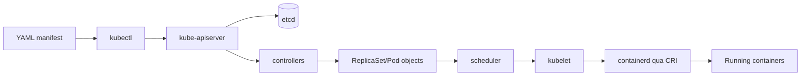

# Document - Day 01: Mental Model Cheatsheet

## Sơ đồ luồng desired state



## Mapping khái niệm nhanh

| Khái niệm | Nghĩa thực dụng | Điều cần nhớ |
|---|---|---|
| `Pod` | Đơn vị scheduling nhỏ nhất | Disposable, IP thay đổi được |
| `Deployment` | Quản lý rollout stateless app | Tạo `ReplicaSet`, rồi tạo `Pod` |
| `ReplicaSet` | Giữ số lượng `Pod` đúng | Thường không sửa trực tiếp |
| `Service` | Stable virtual endpoint cho nhóm `Pod` | Match bằng label selector |
| `OCI` | Chuẩn image/runtime | Giúp image portable |
| `CRI` | Interface kubelet -> runtime | Docker Engine không bắt buộc |
| `containerd` | Runtime pull image và chạy container | Dùng phổ biến trong K8s/K3s |

## Docker Compose vs Kubernetes

| Tiêu chí | Docker Compose | Kubernetes |
|---|---|---|
| Scope | Một host hoặc dev workflow đơn giản | Cluster nhiều node |
| API model | Imperative-ish local orchestration | Declarative API và reconciliation |
| Self-healing | Hạn chế | Controller tự tạo lại `Pod` |
| Service discovery | DNS trong Compose network | `Service`, DNS, endpoint controller |
| Rollout | Đơn giản | Rolling update, rollback, history |
| Scheduling | Không có scheduler cluster-level | Scheduler chọn node theo constraints |
| Production ops | Cần nhiều tooling thêm | Có ecosystem lớn, nhưng phức tạp hơn |

## Command quan sát tối thiểu

```bash
kubectl get nodes -o wide
kubectl get namespaces
kubectl get deploy,rs,pod,svc
kubectl get pods -A
kubectl describe deployment <deployment-name>
kubectl describe pod <pod-name>
kubectl logs <pod-name> -c <container-name>
kubectl get events --sort-by=.lastTimestamp
kubectl explain deployment.spec
```

Runtime quick check:

```bash
kubectl get nodes -o custom-columns=NAME:.metadata.name,RUNTIME:.status.nodeInfo.containerRuntimeVersion,KUBELET:.status.nodeInfo.kubeletVersion
kubectl describe node <node-name>
```

K3s/k3d thường dùng `containerd`. Nếu app chạy bằng Docker local nhưng lỗi trong cluster, hãy nhớ kubelet đang gọi runtime qua `CRI`, không gọi Docker Compose.

## Debug path cơ bản

```text
User symptom
  |
  v
Service reachable?
  |
  +-- no --> selector/endpoints/DNS/networking
  |
  v
Pod ready?
  |
  +-- no --> describe pod/events/probes/logs
  |
  v
Deployment healthy?
  |
  +-- no --> rollout status/replicaset/image/resources
```

## YAML tối giản để thử nghiệm

```yaml
apiVersion: apps/v1
kind: Deployment
metadata:
  name: web
  labels:
    app: web
spec:
  replicas: 2
  selector:
    matchLabels:
      app: web
  template:
    metadata:
      labels:
        app: web
    spec:
      containers:
        - name: nginx
          image: nginx:1.27
          ports:
            - containerPort: 80
---
apiVersion: v1
kind: Service
metadata:
  name: web
spec:
  type: ClusterIP
  selector:
    app: web
  ports:
    - port: 80
      targetPort: 80
```
