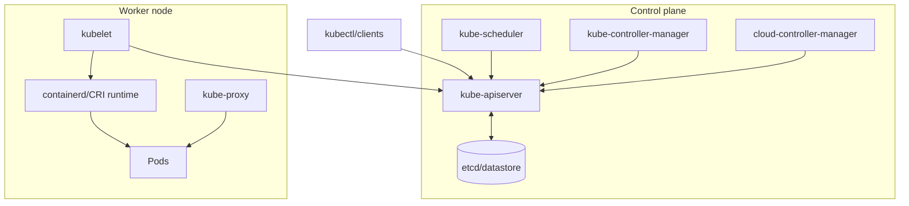

# Document - Day 02: Architecture Reference

## Sơ đồ component



## Component responsibility matrix

| Component | Primary job | Không làm việc gì |
|---|---|---|
| `kube-apiserver` | API, authn/authz, validation, admission, persistence | Không schedule trực tiếp, không chạy container |
| `etcd` | Lưu cluster state | Không chạy workload app |
| `kube-scheduler` | Chọn node cho unscheduled Pod | Không pull image, không restart container |
| `kube-controller-manager` | Chạy built-in controllers | Không expose API trực tiếp cho user |
| `kubelet` | Thực thi PodSpec trên node | Không quyết định desired replicas |
| `kube-proxy` | Service routing rules trên node | Không làm HTTP ingress routing |
| `containerd` | Pull image, tạo/chạy container | Không hiểu Kubernetes rollout |

## Luồng lỗi theo trạng thái Pod

| Pod state | Nơi bắt đầu điều tra | Command |
|---|---|---|
| Không thấy Pod | Controller/ReplicaSet | `kubectl describe deployment <name>` |
| `Pending` | Scheduler/capacity/PVC | `kubectl describe pod <pod>` |
| `ContainerCreating` | Kubelet/runtime/CNI/volume | `kubectl describe pod <pod>` |
| `ImagePullBackOff` | Registry/image secret | `kubectl get events --sort-by=.lastTimestamp` |
| `CrashLoopBackOff` | App process/config/probe | `kubectl logs <pod> --previous` |
| Running nhưng NotReady | Readiness probe/dependency | `kubectl describe pod <pod>` |
| Ready nhưng không có traffic | Service selector/endpoints | `kubectl get svc,endpoints` |

## Commands theo lớp kiến trúc

API/control plane:

```bash
kubectl cluster-info
kubectl version
kubectl api-resources
kubectl get --raw=/readyz
```

Node:

```bash
kubectl get nodes -o wide
kubectl describe node <node-name>
kubectl top nodes
```

`kubectl top` phụ thuộc Metrics Server. Nếu metrics API chưa có, dùng `describe node`, `get events` và system Pod status thay thế trong lab ngày 02.

Workload:

```bash
kubectl get deploy,rs,pod -o wide
kubectl rollout status deployment/<name>
kubectl describe pod <pod-name>
kubectl logs <pod-name> -c <container-name>
```

Networking:

```bash
kubectl get svc,endpoints,endpointslice
kubectl describe svc <service-name>
```

Events:

```bash
kubectl get events --sort-by=.lastTimestamp
kubectl get events -A --sort-by=.lastTimestamp
```

## K3s architecture notes

- `k3s server` đóng gói nhiều control plane component trong một process.
- `k3s agent` chạy ở worker node và kết nối về server.
- K3s single-node thường dùng SQLite để giảm độ phức tạp.
- K3s HA có thể dùng embedded `etcd` hoặc external datastore.
- Packaged components như CoreDNS, Traefik, local storage và metrics-server được K3s quản lý; không nên sửa trực tiếp manifest do K3s quản lý vì có thể bị ghi đè.
