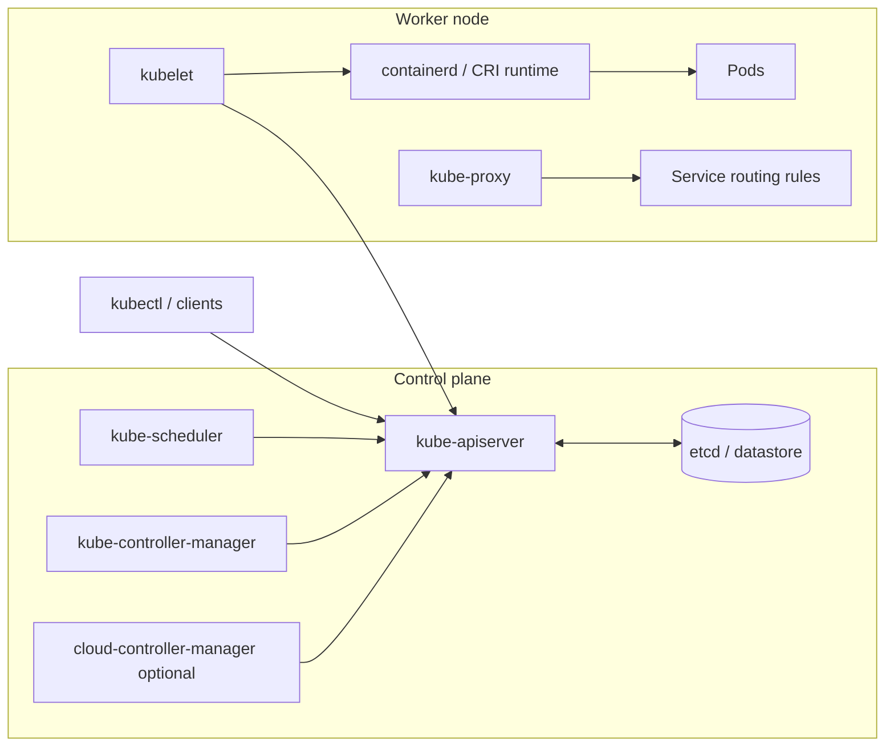
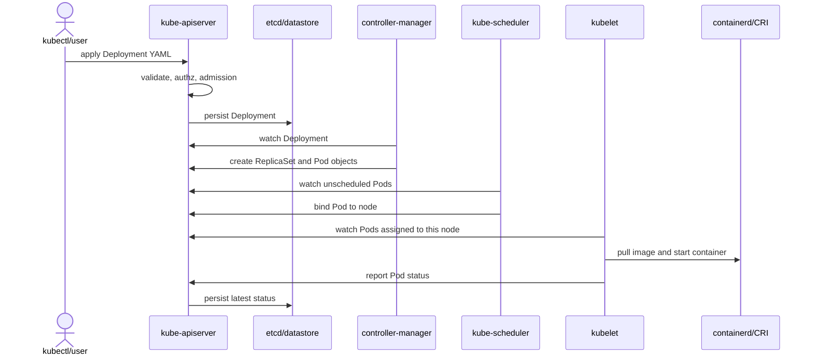

# Day 02: Kubernetes Architecture Overview

## Mục tiêu bài học

- Mô tả được các thành phần chính của `control plane` và `worker node`.
- Đọc được sơ đồ kiến trúc Kubernetes ở mức component và luồng request.
- Giải thích được luồng từ `kubectl apply` đến khi `Pod` chạy trên node.
- Phân biệt nhiệm vụ của `kube-apiserver`, `etcd`, `kube-scheduler`, `kube-controller-manager`, `kubelet`, `kube-proxy` và container runtime.
- Hiểu vì sao Kubernetes là hệ thống API-driven và controller-driven.
- Biết các khác biệt kiến trúc khi dùng K3s và managed Kubernetes.

## Vấn đề cần giải quyết

Khi debug Kubernetes, câu hỏi quan trọng là lỗi nằm ở lớp nào:

- API server không nhận object?
- Scheduler không chọn được node?
- Controller không tạo đủ object con?
- Kubelet không chạy được container?
- Service routing không tới đúng endpoint?

Nếu không có mental model kiến trúc, bạn dễ nhảy thẳng vào app logs và bỏ qua nơi lỗi thật sự phát sinh.

Ngày 02 chỉ dùng kiến trúc để định vị lỗi theo lớp. Ngày 05 sẽ đi sâu hơn vào admission chain, watch/cache, scheduler phases, controller workqueue và leader election để tránh trùng nội dung.

## Mental Model

Kubernetes có hai nhóm lớn:

```text
Control plane: quyết định và lưu trạng thái
Worker nodes: thực thi workload
```

Control plane không "chạy app business" của bạn. Nó nhận desired state, validate, lưu, schedule và điều phối. Worker node mới là nơi container chạy.

Sơ đồ tối giản để đọc từ trái sang phải:

```text
kubectl / client
      |
      v
kube-apiserver <----> etcd
      |
      +----> kube-scheduler
      |
      +----> kube-controller-manager
      |
      v
worker node
  |
  +---- kubelet ----> containerd/CRI ----> Pod containers
  |
  +---- kube-proxy ----> Service routing rules
```

Sơ đồ component đầy đủ hơn:



Cách đọc nhanh:

- Mọi component đều đi qua `kube-apiserver`; không component nào nên ghi trực tiếp vào `etcd`.
- `etcd` lưu state, nhưng không chạy workload.
- `kube-scheduler` chỉ chọn node; `kubelet` mới chạy container.
- `kube-proxy` xử lý đường đi của `Service`, không phải HTTP reverse proxy.

## Lý thuyết cốt lõi

### `kube-apiserver`

`kube-apiserver` là cửa ngõ trung tâm của Kubernetes API. `kubectl`, controllers, scheduler, kubelet và các operator đều nói chuyện qua API server.

Nhiệm vụ chính:

- Expose REST API.
- Validate object schema.
- Chạy authentication, authorization và admission.
- Lưu trạng thái vào `etcd`.
- Làm điểm giao tiếp nhất quán giữa các component.

Nếu API server không ổn, cluster vẫn có thể tiếp tục chạy workload hiện có một lúc, nhưng bạn không thể tạo/sửa/xóa object bình thường.

### `etcd`

`etcd` là key-value store lưu cluster state. Nó là source-of-truth cho Kubernetes object state.

Điểm production cần nhớ:

- Backup/restore `etcd` là năng lực sống còn với self-managed cluster.
- Latency/disk I/O của `etcd` ảnh hưởng trực tiếp tới control plane.
- Không xem `etcd` như database app; nó là state store của cluster.

K3s single-node mặc định thường dùng SQLite để đơn giản hóa, và có thể dùng embedded `etcd` hoặc external datastore cho HA.

### `kube-scheduler`

Scheduler chọn node cho `Pod` chưa được gán `nodeName`. Nó xét tài nguyên, constraints, taints/tolerations, affinity, topology và nhiều plugin scheduling khác.

Scheduler không chạy container. Nó chỉ ghi quyết định scheduling vào Pod binding. Kubelet trên node được chọn mới chạy container.

### `kube-controller-manager`

Controller manager chạy nhiều controller built-in. Controller là reconciliation loop:

```text
watch desired state -> compare actual state -> perform action -> repeat
```

Ví dụ:

- `Deployment controller` tạo/cập nhật `ReplicaSet`.
- `ReplicaSet controller` tạo/xóa `Pod`.
- `Node controller` theo dõi node health.
- `EndpointSlice controller` cập nhật endpoints cho `Service`.

### `kubelet`

`kubelet` là agent chạy trên mỗi worker node. Nó nhận `PodSpec` đã schedule về node của nó, rồi gọi container runtime qua `CRI`.

Nhiệm vụ:

- Pull image và tạo container qua runtime.
- Mount volumes.
- Chạy probes.
- Report Pod/Node status về API server.
- Restart container theo policy.

### `kube-proxy`

`kube-proxy` lập trình rule networking trên node để `Service` có thể route traffic tới backend `Pod`. Tùy cluster, implementation có thể dùng iptables, IPVS hoặc được thay thế bởi CNI eBPF như Cilium ở một số mô hình.

Không nên nhầm `Service` với reverse proxy HTTP. `Service` chủ yếu là abstraction L4 và service discovery.

### Container runtime

Container runtime như `containerd` thực thi phần runtime: pull image, tạo container, quản lý lifecycle. Kubelet giao tiếp qua `CRI`.

## Deep Dive: Luồng apply Deployment

```text
kubectl apply -f deploy.yaml
  |
  v
kube-apiserver validate/admission/authz
  |
  v
etcd lưu Deployment
  |
  v
Deployment controller tạo ReplicaSet
  |
  v
ReplicaSet controller tạo Pod
  |
  v
scheduler bind Pod vào node
  |
  v
kubelet trên node gọi containerd
  |
  v
container chạy, kubelet report status
```

Debug theo luồng này sẽ nhanh hơn đoán mò. Nếu `Pod` không có node, nhìn scheduler/events. Nếu đã có node nhưng container không start, nhìn kubelet events, image pull, volume, command, probes.

Nhìn theo sequence:



Nếu chỉ nhớ một điều: `kubectl apply` chỉ ghi desired state vào API. Việc container thật sự chạy là kết quả của nhiều vòng watch/reconcile phía sau.

## K3s vs Kubernetes chuẩn vs Managed Kubernetes

| Thành phần | Kubernetes chuẩn | K3s | Managed Kubernetes |
|---|---|---|---|
| Control plane process | Component tách rời | Gói trong process `k3s server` | Provider quản lý |
| Datastore | `etcd` | SQLite mặc định single-node, embedded `etcd` hoặc external DB cho HA | Provider quản lý `etcd` |
| Worker agent | `kubelet`, `kube-proxy`, runtime | `k3s agent` đóng gói agent-side behavior | Node image do provider quản |
| CNI/Ingress/Storage | Tự chọn/cài | Có packaged defaults như Flannel, Traefik, local storage | Cloud CNI/CSI/LB tích hợp |
| Upgrade | Team tự làm | Team tự làm, quy trình gọn hơn | Provider hỗ trợ nhưng app/node vẫn phải kiểm soát |

Trong EKS/GKE/AKS, provider quản lý API server và datastore, nhưng team vẫn chịu trách nhiệm:

- Workload manifests.
- RBAC và namespace model.
- Resource requests/limits.
- Network policies nếu dùng.
- Observability, alerting và incident response.
- Node pool capacity, upgrade window và cost.

## Trade-offs và Best Practices

### Trade-offs

| Option | Khi chọn | Performance implication | Operational complexity | Failure mode |
|---|---|---|---|---|
| Self-managed upstream K8s | Cần full control/on-prem | Phụ thuộc cấu hình control plane/etcd | Cao | etcd/control plane incident do team xử lý |
| K3s | Edge, lab, small prod | Footprint thấp | Trung bình | Defaults tiện nhưng cần hiểu để harden |
| Managed K8s | Cloud production | Control plane thường ổn định hơn | Trung bình, cloud-specific | Cloud quota/IAM/CNI/LB issue |
| Kind | CI/test manifest | Nhanh, ephemeral | Thấp | Không đại diện đầy đủ cho network/storage production |

### Best Practices

Nên làm:

- Khi debug, xác định lỗi nằm ở API, scheduling, node runtime, networking hay app.
- Theo dõi `events` cùng với object status.
- Với self-managed/K3s HA, có backup datastore và restore drill.
- Với managed Kubernetes, đọc rõ responsibility split giữa provider và team.

Tránh làm:

- Giả định control plane managed nghĩa là workload tự production-ready.
- Bỏ qua node-level issue như disk pressure, image pull, cgroup, runtime.
- Xem K3s packaged defaults là production baseline cho mọi môi trường.

## Performance Considerations

- API server latency ảnh hưởng mọi thao tác object và controller throughput.
- `etcd` cần disk latency thấp; I/O kém làm control plane chậm hoặc timeout.
- Scheduler bottleneck thường hiếm ở lab, nhưng quan trọng khi cluster rất lớn hoặc có scheduling constraints phức tạp.
- Kubelet bị nghẽn khi node quá tải CPU/memory/disk hoặc image pull quá nhiều.
- kube-proxy/routing overhead phụ thuộc mode và số lượng Service/Endpoint; ngày 16 sẽ đi sâu.

## Debugging Checklist

Kiểm tra control plane/API:

```bash
kubectl cluster-info
kubectl version
kubectl get --raw=/readyz
```

Kiểm tra node:

```bash
kubectl get nodes -o wide
kubectl describe node <node-name>
kubectl top nodes
```

`kubectl top` chỉ chạy nếu cluster có Metrics Server hoặc metrics API tương đương. Nếu lệnh báo `Metrics API not available`, ghi nhận caveat đó và tiếp tục bằng `describe node`, events và system Pod status.

Kiểm tra workload flow:

```bash
kubectl get deploy,rs,pod -o wide
kubectl describe pod <pod-name>
kubectl get events --sort-by=.lastTimestamp
```

Symptom phổ biến:

| Symptom | Lớp nghi ngờ | Root cause phổ biến |
|---|---|---|
| `kubectl` timeout | API/control plane/network | API server down, kubeconfig sai, network/firewall |
| `Pod` mãi `Pending` | Scheduler/capacity | Thiếu CPU/RAM, node selector, taint, PVC |
| `ContainerCreating` lâu | Kubelet/runtime/storage | Pull image chậm, volume mount lỗi, CNI lỗi |
| Service không có endpoints | Controller/selector/readiness | Label mismatch, Pod chưa Ready |

## Liên hệ với kiến thức đã biết

Kubernetes giống một distributed control plane hơn là một process manager. Nếu đã từng xây event-driven system, hãy nghĩ controller như consumer đọc event/object changes và ghi lại state mới. Nếu đã từng vận hành database, hãy xem `etcd` như state store cần backup và latency ổn định, không phải chi tiết phụ.

## Tóm tắt

Kubernetes architecture xoay quanh API server, datastore và các reconciliation loop. Control plane quyết định và lưu trạng thái; worker node thực thi qua kubelet và container runtime. Debug hiệu quả bắt đầu bằng việc đặt lỗi vào đúng component.

## Câu hỏi tự kiểm tra

1. Vì sao scheduler không phải component chạy container?
2. Nếu `Pod` đã có `nodeName` nhưng không chạy, bạn kiểm tra component nào tiếp theo?
3. `etcd` có vai trò gì và vì sao backup quan trọng?
4. K3s thay đổi packaging control plane như thế nào so với upstream Kubernetes?
5. Managed Kubernetes quản lý phần nào, và team vẫn phải tự vận hành phần nào?

## Tài liệu tham khảo

- Kubernetes Components: https://kubernetes.io/docs/concepts/overview/components/
- Kubernetes API Concepts: https://kubernetes.io/docs/reference/using-api/api-concepts/
- Kubernetes Nodes: https://kubernetes.io/docs/concepts/architecture/nodes/
- K3s Architecture: https://docs.k3s.io/architecture
- K3s Datastore: https://docs.k3s.io/datastore
