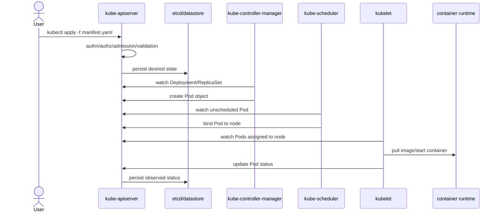

# Document - Day 05: Control Plane Reference

## Luồng từ manifest đến container



## Component responsibility table

| Component | Trách nhiệm chính | Không làm | Debug signal |
|---|---|---|---|
| `kube-apiserver` | API, authn/authz, admission, validation, watch, storage gateway | Không tự chạy container | `/readyz`, API latency, request errors |
| `etcd`/datastore | Lưu cluster state | Không quyết định scheduling | Disk latency, quorum, snapshot health |
| `kube-scheduler` | Chọn node cho Pod chưa có `nodeName` | Không pull image/start container | Pod events: insufficient resource, taint, affinity |
| `kube-controller-manager` | Chạy built-in controllers | Không thay kubelet | Object drift, controller events |
| `cloud-controller-manager` | Cloud-specific node/LB/route integration | Không tồn tại như nhau ở mọi cluster | Cloud LB/node route/IAM symptoms |

## Internal mechanics quick reference

| Cơ chế | Ý nghĩa | Debug signal |
|---|---|---|
| API request lifecycle | `authn -> authz -> admission -> validation/defaulting -> persistence` | Apply chậm, webhook timeout, audit/API logs |
| Watch/informer cache | Component nhận thay đổi object qua watch stream thay vì poll liên tục | Watch reconnect, stale cache, API errors |
| Controller workqueue | Object key được queue/retry/rate-limit khi reconcile fail | Rollout/scale chậm, controller logs, events |
| Scheduler `Filter` | Loại node không đáp ứng resource/taint/affinity/topology | Pod `Pending`, scheduler events |
| Scheduler `Score` | Chấm điểm node còn lại để chọn vị trí tốt hơn | Khó thấy trực tiếp; suy từ placement và scheduler config |
| Scheduler `Bind` | Ghi quyết định node vào API server | Pod có `spec.nodeName` |
| Leader election `Lease` | Chọn một replica active cho controller/scheduler | `kubectl get lease -A`, controller logs |

## Health commands

API health:

```bash
kubectl get --raw='/readyz?verbose'
kubectl get --raw='/livez?verbose'
kubectl get --raw='/version'
kubectl cluster-info
```

Cluster state:

```bash
kubectl get nodes -o wide
kubectl get pods -A -o wide
kubectl get events -A --sort-by=.lastTimestamp
kubectl get lease -A
kubectl get componentstatuses
```

Lưu ý: `componentstatuses` đã cũ và không đáng tin bằng health endpoints/logs trong nhiều cluster hiện đại. Dùng nó như tín hiệu phụ, không phải nguồn sự thật duy nhất.

K3s server:

```bash
sudo systemctl status k3s
sudo journalctl -u k3s -n 200 --no-pager
sudo cat /etc/rancher/k3s/config.yaml
sudo ls -lh /var/lib/rancher/k3s/server/
```

## Control plane symptoms

| Dấu hiệu | Có thể do | Command xác minh |
|---|---|---|
| `kubectl get pods` rất chậm | API server/datastore/admission webhook | `kubectl get --raw='/readyz?verbose'`, control plane logs |
| Pod mãi `Pending` | Scheduler không chọn được node | `kubectl describe pod <pod>` |
| Deployment không tạo ReplicaSet/Pod | Controller manager, admission, quota | `kubectl describe deploy <name>`, events |
| Service endpoint không cập nhật | EndpointSlice controller hoặc selector sai | `kubectl get endpointslice`, `kubectl describe svc` |
| Node `Unknown`/`NotReady` | Node controller/kubelet heartbeat | `kubectl describe node`, lease object |
| LoadBalancer không tạo IP | Cloud controller/ServiceLB/MetalLB | `kubectl describe svc`, controller logs |

## Scheduler event patterns

| Event message | Ý nghĩa | Hướng xử lý |
|---|---|---|
| `Insufficient cpu` / `Insufficient memory` | Node không đủ allocatable resource | Giảm requests, thêm node, scale node |
| `had untolerated taint` | Pod không toleration phù hợp | Thêm toleration hoặc bỏ taint |
| `didn't match Pod's node affinity/selector` | Selector/affinity quá hẹp | Sửa selector/label |
| `preemption is not helpful` | Không có victim phù hợp để preempt | Thêm capacity hoặc sửa constraints |

## Datastore operation notes

| Môi trường | Datastore thường gặp | Ghi chú |
|---|---|---|
| K3s single-node lab | SQLite | Đơn giản, không HA |
| K3s HA | Embedded etcd hoặc external DB | Cần quorum/backup/restore drill |
| kubeadm/self-managed | etcd | Team tự vận hành hoàn toàn |
| EKS/GKE/AKS | Provider-managed | Team không truy cập trực tiếp etcd |

Backup cluster state không thay thế backup database của application. Nếu PostgreSQL chạy trong cluster, backup datastore Kubernetes không đủ để restore dữ liệu PostgreSQL.

## Incident checklist

1. Xác định phạm vi: chỉ một workload, một namespace, một node, hay toàn cluster?
2. Kiểm tra API health: `/readyz`, `/livez`, latency khi chạy `kubectl`.
3. Đọc events theo thời gian.
4. Với Pod `Pending`, đọc scheduler events.
5. Với object không reconcile, kiểm tra controller-related events/logs.
6. Với K3s, đọc `journalctl -u k3s`.
7. Nếu nghi datastore, kiểm tra disk, I/O latency, free space, snapshot/quorum theo backend đang dùng.
8. Chỉ restart control plane sau khi đã ghi symptom và hiểu blast radius.
