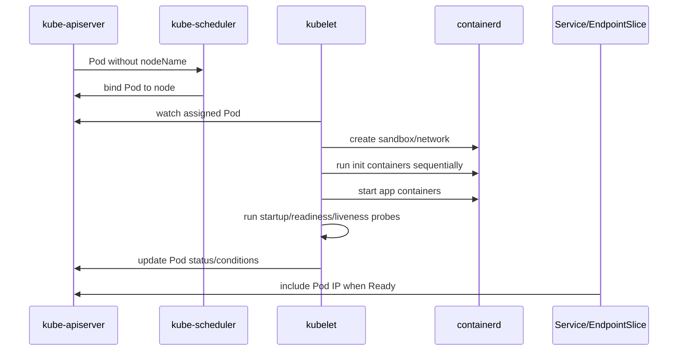

# Document - Day 08: Pod Lifecycle Reference

## Lifecycle map



## Pod phase vs conditions

| Signal | Loại | Ý nghĩa |
|---|---|---|
| `.status.phase` | Summary | `Pending`, `Running`, `Succeeded`, `Failed`, `Unknown` |
| `PodScheduled` | Condition | Scheduler đã gán node |
| `Initialized` | Condition | Init containers đã hoàn tất |
| `ContainersReady` | Condition | Tất cả app containers ready |
| `Ready` | Condition | Pod sẵn sàng được Service route |
| `containerStatuses[*].state` | Container state | waiting/running/terminated |
| `containerStatuses[*].lastState` | Container state trước | Hữu ích khi restart |
| `restartCount` | Counter | Số lần container restart |

## restartPolicy quick reference

| Policy | Restart khi nào | Thường đi với |
|---|---|---|
| `Always` | Container exit thì restart | `Deployment`, `StatefulSet`, service lâu dài |
| `OnFailure` | Chỉ restart khi exit code != 0 | `Job`, batch retry |
| `Never` | Không restart | Debug Pod, one-shot Pod |

Với Pod do `Deployment` quản lý, `restartPolicy` hợp lệ thực tế là `Always`. Đừng dùng Pod trần với `Never` cho service production chỉ để tránh restart; hãy sửa app/probe hoặc controller phù hợp.

## Probe decision table

| Probe | Dùng để | Không nên dùng để | Action khi fail |
|---|---|---|---|
| `startupProbe` | Bảo vệ app cold start lâu | Health dài hạn | Chưa chạy liveness/readiness, fail quá ngưỡng thì restart |
| `readinessProbe` | Quyết định nhận traffic | Restart container | Loại Pod khỏi endpoints |
| `livenessProbe` | Restart app bị kẹt | Kiểm tra dependency ngoài sâu | Restart container |

## Probe tuning fields

| Field | Ý nghĩa | Ghi chú |
|---|---|---|
| `initialDelaySeconds` | Chờ trước probe đầu tiên | Ít cần hơn nếu dùng startup probe |
| `periodSeconds` | Khoảng cách giữa các probe | Quá thấp tạo tải |
| `timeoutSeconds` | Timeout mỗi probe | Quá thấp dễ false positive |
| `failureThreshold` | Số lần fail trước action | Nhân với period để tính tolerance |
| `successThreshold` | Số lần success để pass | Readiness có thể cần >1 |

## Common YAML snippets

Init container + shared volume:

```yaml
apiVersion: v1
kind: Pod
metadata:
  name: init-demo
spec:
  volumes:
  - name: workdir
    emptyDir: {}
  initContainers:
  - name: init-page
    image: busybox:1.36
    command: ["sh", "-c", "echo 'ready from init' > /workdir/index.html"]
    volumeMounts:
    - name: workdir
      mountPath: /workdir
  containers:
  - name: web
    image: nginx:1.27
    volumeMounts:
    - name: workdir
      mountPath: /usr/share/nginx/html
```

Readiness/liveness/startup:

```yaml
apiVersion: v1
kind: Pod
metadata:
  name: probe-demo
spec:
  containers:
  - name: web
    image: nginx:1.27
    ports:
    - containerPort: 80
    startupProbe:
      httpGet:
        path: /
        port: 80
      failureThreshold: 30
      periodSeconds: 2
    readinessProbe:
      httpGet:
        path: /
        port: 80
      periodSeconds: 5
      timeoutSeconds: 2
    livenessProbe:
      httpGet:
        path: /
        port: 80
      periodSeconds: 10
      timeoutSeconds: 2
```

Multi-container with shared logs:

```yaml
apiVersion: v1
kind: Pod
metadata:
  name: sidecar-demo
spec:
  volumes:
  - name: logs
    emptyDir: {}
  containers:
  - name: app
    image: busybox:1.36
    command: ["sh", "-c", "i=0; while true; do echo \"event-$i\" >> /logs/app.log; i=$((i+1)); sleep 2; done"]
    volumeMounts:
    - name: logs
      mountPath: /logs
  - name: log-sidecar
    image: busybox:1.36
    command: ["sh", "-c", "tail -n+1 -F /logs/app.log"]
    volumeMounts:
    - name: logs
      mountPath: /logs
```

Graceful termination:

```yaml
apiVersion: v1
kind: Pod
metadata:
  name: termination-demo
spec:
  terminationGracePeriodSeconds: 15
  containers:
  - name: web
    image: nginx:1.27
    lifecycle:
      preStop:
        exec:
          command: ["sh", "-c", "sleep 10"]
```

Native sidecar caveat: restartable init containers chỉ portable khi cluster version/feature support tương ứng. Nếu course/lab cần chạy được trên nhiều cluster, dùng sidecar truyền thống trong `containers` trước.

## Debug commands

```bash
kubectl get pods -o wide
kubectl describe pod <pod>
kubectl get pod <pod> -o yaml
kubectl get pod <pod> -o jsonpath='{.status.conditions}{"\n"}'
kubectl get pod <pod> -o jsonpath='{.status.initContainerStatuses}{"\n"}'
kubectl get pod <pod> -o jsonpath='{.status.containerStatuses}{"\n"}'
kubectl logs <pod> -c <container>
kubectl logs <pod> -c <container> --previous
kubectl exec -it <pod> -c <container> -- sh
kubectl get events --sort-by=.lastTimestamp
kubectl get endpoints,endpointslice
```

## Symptom to cause

| Symptom | Nghi ngờ | Kiểm tra |
|---|---|---|
| `Init:CrashLoopBackOff` | Init command fail | `logs -c <init>`, events |
| `Running` nhưng `READY 0/1` | Readiness fail | `describe pod`, endpoint |
| Restart count tăng | Liveness fail/app crash/OOM | `logs --previous`, `lastState` |
| Pod không terminate nhanh | App không handle SIGTERM/preStop dài | Events, app logs |
| Multi-container Pod không ready | Một container chưa ready | `containerStatuses`, logs theo `-c` |

## Answer key ngắn

| Câu hỏi | Đáp án ngắn |
|---|---|
| `Running` khác `Ready` thế nào? | `Running` là container đã chạy trên node; `Ready` quyết định Pod có vào Service endpoints không |
| Init container fail thì app container chạy không? | Không, app containers chỉ start sau khi toàn bộ init containers exit 0 |
| Vì sao liveness không nên phụ thuộc database? | Dependency chậm có thể gây restart storm hàng loạt và làm incident nặng hơn |
| Sidecar tốn gì? | CPU, memory, image pull time, log volume và độ phức tạp termination/debug |
| Pod nhiều container xem logs thế nào? | Thêm `-c <container>` và dùng `--previous` khi container restart |

## Production checklist

- [ ] Readiness endpoint tách rõ với liveness endpoint.
- [ ] Startup probe có cho app cold start dài.
- [ ] Liveness không phụ thuộc database/cache bên ngoài một cách cứng.
- [ ] Sidecar có `resources.requests` và log policy.
- [ ] Init container idempotent và timeout rõ.
- [ ] App handle SIGTERM và shutdown trong `terminationGracePeriodSeconds`.
- [ ] Rollout test đã quan sát endpoint không route traffic quá sớm.
