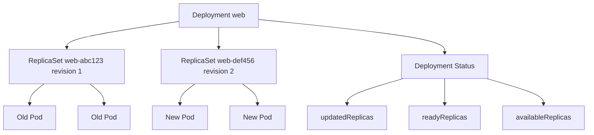

# Document - Day 09: Deployment Rollout Reference

## Controller relationship



## Minimal Deployment

```yaml
apiVersion: apps/v1
kind: Deployment
metadata:
  name: web
  labels:
    app: web
spec:
  replicas: 3
  revisionHistoryLimit: 5
  selector:
    matchLabels:
      app: web
  strategy:
    type: RollingUpdate
    rollingUpdate:
      maxSurge: 1
      maxUnavailable: 0
  minReadySeconds: 5
  progressDeadlineSeconds: 120
  template:
    metadata:
      labels:
        app: web
    spec:
      containers:
      - name: web
        image: nginx:1.27
        ports:
        - containerPort: 80
        readinessProbe:
          httpGet:
            path: /
            port: 80
          periodSeconds: 5
        resources:
          requests:
            cpu: 50m
            memory: 64Mi
          limits:
            cpu: 250m
            memory: 128Mi
```

## Rollout command cheatsheet

```bash
kubectl apply -f deployment.yaml
kubectl get deploy,rs,pod -l app=web -o wide
kubectl describe deployment web
kubectl set image deployment/web web=nginx:1.28
kubectl rollout status deployment/web
kubectl rollout history deployment/web
kubectl rollout history deployment/web --revision=2
kubectl rollout undo deployment/web
kubectl rollout undo deployment/web --to-revision=2
kubectl rollout pause deployment/web
kubectl rollout resume deployment/web
kubectl scale deployment/web --replicas=5
```

## Deployment status fields

| Field | Ý nghĩa |
|---|---|
| `replicas` | Tổng Pod Deployment đang quản |
| `updatedReplicas` | Pod thuộc template mới |
| `readyReplicas` | Pod ready |
| `availableReplicas` | Pod ready đủ `minReadySeconds` |
| `unavailableReplicas` | Pod chưa available |
| `conditions` | `Available`, `Progressing`, reason/message |

JSONPath:

```bash
kubectl get deployment web -o jsonpath='{.status.updatedReplicas}{" updated / "}{.status.availableReplicas}{" available\n"}'
kubectl get deployment web -o jsonpath='{range .status.conditions[*]}{.type}{"\t"}{.status}{"\t"}{.reason}{"\n"}{end}'
```

## Strategy trade-offs

| Strategy setting | Ưu điểm | Nhược điểm | Khi dùng |
|---|---|---|---|
| `maxSurge: 1`, `maxUnavailable: 0` | Giữ availability | Cần dư capacity | Service quan trọng, replicas vừa |
| `maxSurge: 25%`, `maxUnavailable: 25%` | Cân bằng tốc độ/capacity | Có thể giảm capacity | Default nhiều workload |
| `maxSurge: 0`, `maxUnavailable: 1` | Không vượt capacity | Có downtime/capacity drop | Cluster rất chật, non-critical |
| `Recreate` | Đơn giản, tránh chạy song song version | Downtime | Dev/lab hoặc app không chạy hai version cùng lúc |

Capacity example:

| Replicas | Request per Pod | Strategy | Peak Pods | Min available | Peak request |
|---:|---|---|---:|---:|---|
| 3 | `50m`, `64Mi` | `maxSurge=1`, `maxUnavailable=0` | 4 | 3 | `200m`, `256Mi` |
| 3 | `50m`, `64Mi` | `maxSurge=0`, `maxUnavailable=1` | 3 | 2 | `150m`, `192Mi` |
| 10 | `200m`, `256Mi` | `25%`, `25%` | 13 | 7 | `2600m`, `3328Mi` |

## Rollout failure flow

```text
rollout status timeout
-> describe deployment để xem condition/reason
-> get rs,pod để thấy ReplicaSet mới/cũ
-> describe Pod mới để đọc events
-> nếu ImagePullBackOff: sửa image/secret/registry
-> nếu Pending: xem resource/taint/quota
-> nếu Running 0/1: xem readiness/liveness/app logs
-> rollback hoặc patch manifest
```

## Common failure modes

| Symptom | Có thể do | First commands |
|---|---|---|
| `ProgressDeadlineExceeded` | Pod mới không available | `describe deployment`, `describe pod` |
| New ReplicaSet có Pod `ImagePullBackOff` | Image/tag/registry/auth sai | `describe pod`, events |
| Pod `Pending` | Thiếu resource, taint, quota | `describe pod`, `describe node` |
| Pod `Running` nhưng `0/1` | Readiness fail | `describe pod`, endpoints |
| Rollback không về version mong muốn | Revision history thiếu/đã cleanup | `rollout history` |
| Service vẫn route version cũ | Pod mới chưa ready hoặc selector sai | `get endpointslice`, labels |

## Answer key ngắn

| Câu hỏi | Đáp án ngắn |
|---|---|
| Vì sao dùng Deployment thay ReplicaSet? | Deployment quản rollout, rollback, history và scale qua ReplicaSet |
| Field nào tạo revision mới? | Thay đổi trong `.spec.template` của Deployment |
| `maxSurge=1,maxUnavailable=0` trade-off gì? | Giữ availability tốt hơn nhưng cần dư capacity cho Pod surge |
| Readiness fail kiểm tra gì? | `rollout status`, `describe deployment`, `describe pod`, events và EndpointSlice |
| Rollback trong GitOps lưu ý gì? | Phải sửa source of truth trong Git/Helm values, nếu không controller có thể sync lại version lỗi |

## Production release checklist

- [ ] Image tag immutable hoặc digest.
- [ ] Readiness probe phản ánh khả năng nhận traffic.
- [ ] Liveness probe không gây restart storm.
- [ ] Resource requests đủ để scheduler tính capacity.
- [ ] `maxSurge` phù hợp với cluster capacity.
- [ ] `maxUnavailable` phù hợp với SLO và số replicas.
- [ ] Rollout metadata gắn với Git commit/build number.
- [ ] Rollback plan cập nhật cả Git/GitOps source.
- [ ] Metrics/logs/error rate được theo dõi sau rollout.
