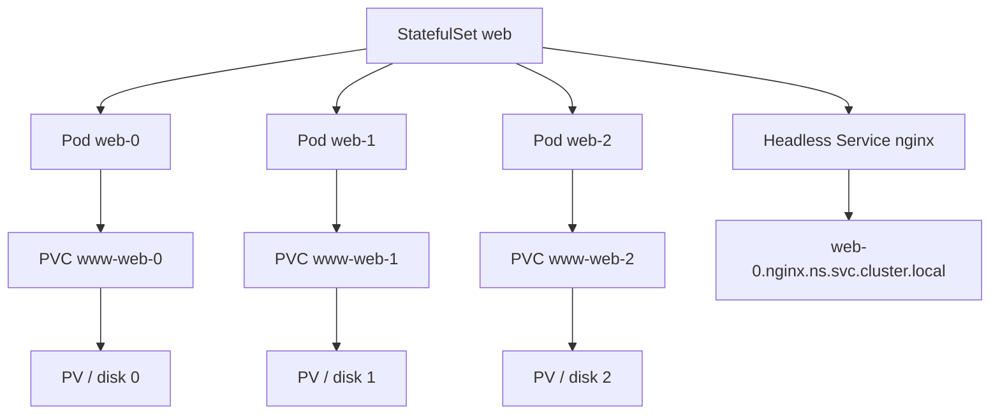

# Document - Day 10: StatefulSet Reference

## Controller relationship



## Minimal StatefulSet with Headless Service

```yaml
apiVersion: v1
kind: Service
metadata:
  name: nginx
  labels:
    app: nginx
spec:
  clusterIP: None
  selector:
    app: nginx
  ports:
  - name: web
    port: 80
---
apiVersion: apps/v1
kind: StatefulSet
metadata:
  name: web
spec:
  serviceName: nginx
  replicas: 3
  selector:
    matchLabels:
      app: nginx
  podManagementPolicy: OrderedReady
  updateStrategy:
    type: RollingUpdate
  template:
    metadata:
      labels:
        app: nginx
    spec:
      terminationGracePeriodSeconds: 10
      containers:
      - name: nginx
        image: nginx:1.27
        ports:
        - name: web
          containerPort: 80
        volumeMounts:
        - name: www
          mountPath: /usr/share/nginx/html
        readinessProbe:
          httpGet:
            path: /
            port: web
          periodSeconds: 5
        resources:
          requests:
            cpu: 50m
            memory: 64Mi
          limits:
            cpu: 250m
            memory: 128Mi
  volumeClaimTemplates:
  - metadata:
      name: www
    spec:
      accessModes: ["ReadWriteOnce"]
      resources:
        requests:
          storage: 1Gi
```

## Identity patterns

| Object | Pattern | Example |
|---|---|---|
| Pod name | `<statefulset>-<ordinal>` | `web-0` |
| PVC name | `<claimTemplate>-<statefulset>-<ordinal>` | `www-web-0` |
| Pod DNS | `<pod>.<service>.<namespace>.svc.cluster.local` | `web-0.nginx.day10.svc.cluster.local` |
| Ordinal range | `0..replicas-1` | `0,1,2` |

## Command cheatsheet

```bash
kubectl get statefulset
kubectl describe statefulset web
kubectl get pod -l app=nginx -o wide
kubectl get pvc
kubectl get pv
kubectl get pod web-0 -o jsonpath='{.metadata.name}{" "}{.spec.hostname}{"\n"}'
kubectl exec -it web-0 -- hostname
kubectl logs web-0 -c nginx
kubectl scale statefulset web --replicas=5
kubectl rollout status statefulset/web
kubectl rollout history statefulset/web
kubectl delete pod web-1
```

## Update strategies

| Strategy | Ý nghĩa | Khi dùng |
|---|---|---|
| `RollingUpdate` | Controller tự recreate Pod khi template đổi | Default cho phần lớn workload |
| `RollingUpdate` + `partition` | Chỉ update ordinal >= partition | Canary một member, phased upgrade |
| `OnDelete` | Chỉ update khi bạn xóa Pod | Upgrade cần kiểm soát thủ công |

Partition example:

```bash
kubectl patch statefulset web -p '{"spec":{"updateStrategy":{"type":"RollingUpdate","rollingUpdate":{"partition":2}}}}'
kubectl set image statefulset/web nginx=nginx:1.28
kubectl rollout status statefulset/web
```

## Storage notes

| Topic | Ghi chú |
|---|---|
| PVC retention | PVC thường được giữ lại khi scale down/delete StatefulSet |
| `ReadWriteOnce` | Một volume được mount read-write bởi một node tại một thời điểm, tùy CSI |
| `local-path` trong K3s | Tốt cho lab, không phải HA distributed storage |
| Cloud CSI | Cần chú ý zone, attach limit, snapshot, reclaim policy |
| Backup | Kubernetes object backup không đủ; cần app/data backup |

PVC/PV selector caveat: PVC tạo từ `volumeClaimTemplates` có thể có label nếu bạn khai báo trong template, nhưng PV do provisioner tạo không nhất thiết giữ label app. Khi debug binding, dùng tên PVC deterministic (`www-web-0`) và `.spec.volumeName` thay vì chỉ dùng `-l app=...`.

## PDB manifest và anti-affinity patch

```yaml
# web-pdb.yaml
apiVersion: policy/v1
kind: PodDisruptionBudget
metadata:
  name: web-pdb
spec:
  minAvailable: 2
  selector:
    matchLabels:
      app: nginx
```

`web-affinity-patch.json`:

```json
{
  "spec": {
    "template": {
      "spec": {
        "affinity": {
          "podAntiAffinity": {
            "preferredDuringSchedulingIgnoredDuringExecution": [
              {
                "weight": 100,
                "podAffinityTerm": {
                  "labelSelector": {
                    "matchLabels": {
                      "app": "nginx"
                    }
                  },
                  "topologyKey": "kubernetes.io/hostname"
                }
              }
            ]
          }
        }
      }
    }
  }
}
```

Trong single-node lab, dùng preferred anti-affinity để không block scheduling. Trong production multi-zone, cân nhắc hard anti-affinity hoặc topology spread nhưng phải kiểm tra capacity.

## Common failure modes

| Symptom | Có thể do | First commands |
|---|---|---|
| Pod `Pending` | PVC chưa bind, thiếu StorageClass, thiếu resource | `describe pod`, `describe pvc` |
| Pod stuck `ContainerCreating` | Volume mount/attach lỗi | `describe pod`, CSI logs |
| DNS Pod không resolve | Thiếu Headless Service hoặc selector sai | `get svc,endpointslice`, `nslookup` |
| Scale up kẹt tại `web-1` | `web-1` chưa ready nên `web-2` chưa tạo | `describe sts`, `describe pod web-1` |
| Update không chạy | `OnDelete` hoặc partition chặn | `get sts -o yaml` |
| Data mất trong lab | Xóa PVC/PV hoặc dùng ephemeral path | `get pvc,pv`, kiểm tra reclaim policy |

## Answer key ngắn

| Câu hỏi | Đáp án ngắn |
|---|---|
| Vì sao cần Headless Service? | Để publish DNS identity ổn định cho từng Pod ordinal |
| PVC của `web-2` tên gì nếu template là `www`? | `www-web-2` |
| `OrderedReady` kẹt khi nào? | Khi ordinal thấp hơn chưa Ready, ordinal sau sẽ chưa được tạo/update |
| Khi nào dùng `OnDelete`? | Khi upgrade stateful cần thao tác thủ công từng member |
| Vì sao `local-path` không đủ HA? | Volume gắn với disk/node cục bộ, node hỏng không tự chuyển data an toàn |

## Production checklist

- [ ] Storage backend phù hợp với workload và topology.
- [ ] Backup/restore đã diễn tập.
- [ ] Readiness probe kiểm tra trạng thái app thật.
- [ ] Resource requests/limits dựa trên benchmark.
- [ ] `PodDisruptionBudget` cho quorum system.
- [ ] Anti-affinity/topology spread để tránh gom replicas trên một node/zone.
- [ ] Upgrade plan có rollback và data migration plan.
- [ ] PVC retention/reclaim policy được review.
- [ ] Monitoring có disk latency, disk usage, replication lag, restart count.
