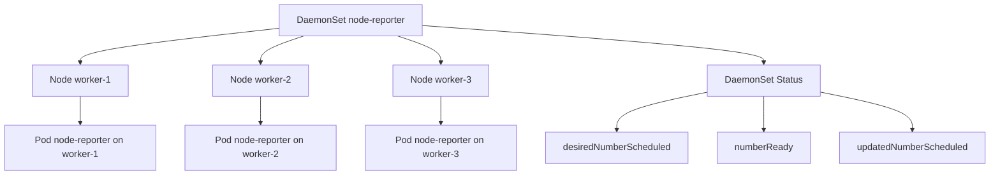

# Document - Day 11: DaemonSet Reference

## Controller relationship



## Minimal DaemonSet

```yaml
apiVersion: apps/v1
kind: DaemonSet
metadata:
  name: node-reporter
  labels:
    app: node-reporter
spec:
  selector:
    matchLabels:
      app: node-reporter
  updateStrategy:
    type: RollingUpdate
    rollingUpdate:
      maxUnavailable: 1
  template:
    metadata:
      labels:
        app: node-reporter
    spec:
      containers:
      - name: reporter
        image: busybox:1.36
        command: ["sh", "-c"]
        args:
        - |
          while true; do
            echo "pod=$HOSTNAME node=$NODE_NAME time=$(date -Iseconds)"
            sleep 10
          done
        env:
        - name: NODE_NAME
          valueFrom:
            fieldRef:
              fieldPath: spec.nodeName
        resources:
          requests:
            cpu: 10m
            memory: 16Mi
          limits:
            cpu: 50m
            memory: 64Mi
```

## Node targeting patterns

### nodeSelector

```yaml
spec:
  template:
    spec:
      nodeSelector:
        node-role: observability
```

### node affinity

```yaml
affinity:
  nodeAffinity:
    requiredDuringSchedulingIgnoredDuringExecution:
      nodeSelectorTerms:
      - matchExpressions:
        - key: node-role
          operator: In
          values: ["observability", "infra"]
```

### tolerations

```yaml
tolerations:
- key: "dedicated"
  operator: "Equal"
  value: "infra"
  effect: "NoSchedule"
```

## Host access template

Chỉ dùng khi agent thật sự cần đọc host files/logs.

```yaml
spec:
  template:
    spec:
      serviceAccountName: log-agent
      containers:
      - name: agent
        image: example/log-agent:v1
        securityContext:
          readOnlyRootFilesystem: true
          allowPrivilegeEscalation: false
        volumeMounts:
        - name: varlog
          mountPath: /var/log
          readOnly: true
      volumes:
      - name: varlog
        hostPath:
          path: /var/log
          type: Directory
```

Privileged agent cần review riêng:

```yaml
securityContext:
  privileged: true
```

## Command cheatsheet

```bash
kubectl get daemonset -A -o wide
kubectl describe daemonset node-reporter -n day11
kubectl get pods -n day11 -l app=node-reporter -o wide
kubectl logs -n day11 -l app=node-reporter --tail=20
kubectl rollout status daemonset/node-reporter -n day11
kubectl rollout history daemonset/node-reporter -n day11
kubectl set image daemonset/node-reporter -n day11 reporter=busybox:1.37
kubectl get nodes --show-labels
kubectl describe node <node>
```

## Status fields

| Field | Ý nghĩa |
|---|---|
| `desiredNumberScheduled` | Số node đủ điều kiện cần có Pod |
| `currentNumberScheduled` | Số node hiện có Pod được schedule |
| `numberReady` | Số Pod ready |
| `numberAvailable` | Số Pod available |
| `numberUnavailable` | Số Pod unavailable |
| `updatedNumberScheduled` | Số Pod đã theo template mới |
| `numberMisscheduled` | Pod đang chạy trên node không còn match |

## Cordon, drain và resource-fit nuance

| Tình huống | Điều cần nhớ | Command kiểm tra |
|---|---|---|
| Node bị `cordon` | DaemonSet có toleration tự động cho `unschedulable`, nên Pod DaemonSet có thể vẫn được tạo trên node đó | `kubectl describe node <node>` |
| Node `drain` | `kubectl drain` thường cần `--ignore-daemonsets` và không evict Pod do DaemonSet quản lý | `kubectl drain <node> --ignore-daemonsets --dry-run=server` |
| Resource không fit | Desired có thể vẫn bao gồm node, còn Pod kẹt `Pending` vì scheduler reject | `kubectl describe pod <pod>`, `kubectl get events` |
| Taint custom | Tolerations tự động không cover taint nghiệp vụ của bạn | `kubectl describe node <node>`, `kubectl describe ds <name>` |

JSONPath:

```bash
kubectl get ds node-reporter -n day11 -o jsonpath='{.status.desiredNumberScheduled}{" desired / "}{.status.numberReady}{" ready\n"}'
kubectl get ds node-reporter -n day11 -o jsonpath='{.status.numberMisscheduled}{" misscheduled\n"}'
```

## Failure modes

| Symptom | Có thể do | First commands |
|---|---|---|
| Desired thấp hơn số node | `nodeSelector`/affinity lọc node | `describe ds`, `get nodes --show-labels` |
| Pod `Pending` | Thiếu resource, taint thiếu toleration, policy reject | `describe pod`, events |
| Pod `CrashLoopBackOff` | Config/permission/hostPath sai | `logs --previous`, `describe pod` |
| Pod không đọc được host log | `hostPath` sai hoặc permission thiếu | `describe pod`, exec kiểm tra mount |
| Rollout kẹt | Image lỗi, readiness fail, maxUnavailable quá chặt | `rollout status`, `describe ds` |
| Node pressure sau khi cài agent | Requests quá thấp hoặc agent dùng quá nhiều tài nguyên | `top nodes`, `describe node` |

## Production checklist

- [ ] Mỗi DaemonSet có owner rõ ràng.
- [ ] Resource requests/limits được benchmark theo node size.
- [ ] Quyền hostPath/privileged/capabilities được review.
- [ ] RBAC tối thiểu theo nhu cầu.
- [ ] Image tag immutable/digest.
- [ ] Rollout strategy phù hợp mức critical của agent.
- [ ] Có dashboard desired/current/ready/unavailable.
- [ ] Có alert khi DaemonSet misscheduled hoặc unavailable.
- [ ] Không patch thủ công addon do cloud/K3s quản lý nếu chưa hiểu lifecycle.
