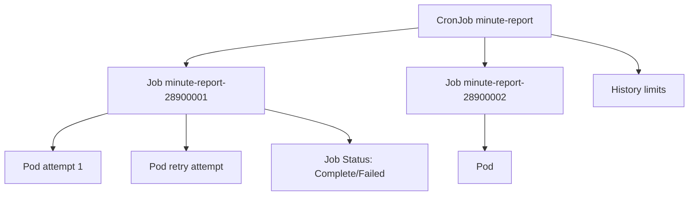

# Document - Day 12: Job and CronJob Reference

## Object relationship



## Minimal Job

```yaml
apiVersion: batch/v1
kind: Job
metadata:
  name: hello
spec:
  backoffLimit: 2
  ttlSecondsAfterFinished: 600
  template:
    spec:
      restartPolicy: Never
      containers:
      - name: hello
        image: busybox:1.36
        command: ["sh", "-c", "echo hello from $HOSTNAME && sleep 5"]
        resources:
          requests:
            cpu: 20m
            memory: 32Mi
          limits:
            cpu: 100m
            memory: 64Mi
```

## Parallel Job

```yaml
apiVersion: batch/v1
kind: Job
metadata:
  name: batch-workers
spec:
  completions: 6
  parallelism: 2
  backoffLimit: 2
  ttlSecondsAfterFinished: 600
  template:
    spec:
      restartPolicy: Never
      containers:
      - name: worker
        image: busybox:1.36
        command: ["sh", "-c", "echo start $HOSTNAME; sleep 10; echo done $HOSTNAME"]
```

## Minimal CronJob

```yaml
apiVersion: batch/v1
kind: CronJob
metadata:
  name: minute-report
spec:
  schedule: "*/1 * * * *"
  concurrencyPolicy: Forbid
  startingDeadlineSeconds: 30
  successfulJobsHistoryLimit: 3
  failedJobsHistoryLimit: 3
  jobTemplate:
    spec:
      backoffLimit: 1
      template:
        spec:
          restartPolicy: Never
          containers:
          - name: report
            image: busybox:1.36
            command: ["sh", "-c", "date -Iseconds; echo report; sleep 20"]
```

## Field reference

| Resource | Field | Ý nghĩa |
|---|---|---|
| Job | `completions` | Tổng số successful Pods cần đạt |
| Job | `parallelism` | Số Pods chạy đồng thời tối đa |
| Job | `backoffLimit` | Retry limit trước khi mark Failed |
| Job | `activeDeadlineSeconds` | Deadline tổng cho Job active |
| Job | `ttlSecondsAfterFinished` | Cleanup object sau khi finished |
| Job | `suspend` | Tạm dừng tạo Pod mới |
| Job | `completionMode: Indexed` | Gán index ổn định cho từng completion khi batch chia partition |
| Job | `backoffLimitPerIndex` | Retry limit riêng từng index, chỉ dùng khi cluster hỗ trợ |
| Job | `podFailurePolicy` | Rule xử lý failure để fail nhanh, ignore hoặc count theo điều kiện |
| CronJob | `schedule` | Cron expression |
| CronJob | `timeZone` | Time zone diễn giải schedule |
| CronJob | `concurrencyPolicy` | `Allow`, `Forbid`, `Replace` |
| CronJob | `startingDeadlineSeconds` | Deadline cho missed schedule |
| CronJob | `successfulJobsHistoryLimit` | Số Job success giữ lại |
| CronJob | `failedJobsHistoryLimit` | Số Job fail giữ lại |

## Command cheatsheet

```bash
kubectl create job hello --image=busybox:1.36 -- sh -c 'echo hello'
kubectl get job,pod
kubectl describe job hello
kubectl logs -l job-name=hello
kubectl delete job hello

kubectl get cronjob
kubectl describe cronjob minute-report
kubectl create job manual-report --from=cronjob/minute-report
kubectl get jobs --sort-by=.metadata.creationTimestamp
kubectl patch cronjob minute-report -p '{"spec":{"suspend":true}}'
kubectl patch cronjob minute-report -p '{"spec":{"suspend":false}}'
```

## CronJob concurrency policies

| Policy | Hành vi | Rủi ro |
|---|---|---|
| `Allow` | Job mới vẫn tạo dù Job cũ chưa xong | Overlap, duplicate side effect |
| `Forbid` | Skip schedule mới nếu Job cũ còn chạy | Dữ liệu trễ, missed run |
| `Replace` | Xóa Job cũ và tạo Job mới | Work dở dang, partial output |

## Indexed Job và failure policy quick reference

```yaml
apiVersion: batch/v1
kind: Job
metadata:
  name: indexed-workers
spec:
  completionMode: Indexed
  completions: 4
  parallelism: 2
  backoffLimitPerIndex: 1
  template:
    spec:
      restartPolicy: Never
      containers:
      - name: worker
        image: busybox:1.36
        command: ["sh", "-c", "echo index=$JOB_COMPLETION_INDEX"]
```

Ghi chú:

- Chỉ dùng các field nâng cao nếu API server của cluster nhận manifest. Kiểm tra bằng `kubectl explain job.spec.completionMode`, `kubectl explain job.spec.backoffLimitPerIndex` và `kubectl explain job.spec.podFailurePolicy`.
- `Indexed Job` phù hợp với partition cố định. Nếu work đến từ queue động, Deployment worker hoặc workflow engine thường hợp lý hơn.
- `podFailurePolicy` hữu ích để fail nhanh khi lỗi cấu hình không thể retry, nhưng cần test kỹ để tránh bỏ qua lỗi thật.

## Rerun safety checklist

- [ ] Xác định side effect của attempt cũ đã xảy ra hay chưa.
- [ ] Có idempotency key, checkpoint hoặc lock.
- [ ] Downstream database/API còn capacity.
- [ ] Input range và output path deterministic.
- [ ] Log có attempt id/correlation id.
- [ ] Nếu dùng CronJob, concurrency policy phù hợp với rerun thủ công.

## Failure modes

| Symptom | Có thể do | First commands |
|---|---|---|
| Job `Failed` | Container exit non-zero, vượt `backoffLimit` | `describe job`, `logs` |
| Pod `ImagePullBackOff` | Image/tag/secret sai | `describe pod`, events |
| Job chạy quá lâu | App hang, external dependency chậm | `logs`, `activeDeadlineSeconds` |
| Quá nhiều Pod batch | `parallelism` cao hoặc nhiều CronJob cùng lịch | `get pods`, quota, events |
| CronJob không tạo Job | `suspend`, missed deadline, schedule sai | `describe cronjob` |
| CronJob overlap | `concurrencyPolicy: Allow` | `get jobs`, `describe cronjob` |
| Logs biến mất nhanh | TTL cleanup trước khi log ship | history/TTL/log pipeline |

## Production checklist

- [ ] Task idempotent hoặc có deduplication/lock.
- [ ] `backoffLimit` và `activeDeadlineSeconds` được set.
- [ ] `resources.requests/limits` không tranh chấp quá mức với online services.
- [ ] `concurrencyPolicy` được chọn rõ ràng.
- [ ] Có namespace quota cho batch nặng.
- [ ] Có logging/metrics/alert cho failed jobs.
- [ ] Schedule được phân tán, tránh mọi job chạy cùng phút.
- [ ] `ttlSecondsAfterFinished` hoặc history limit không xóa evidence quá sớm.
- [ ] Rerun procedure kiểm tra side effect trước khi chạy lại.
