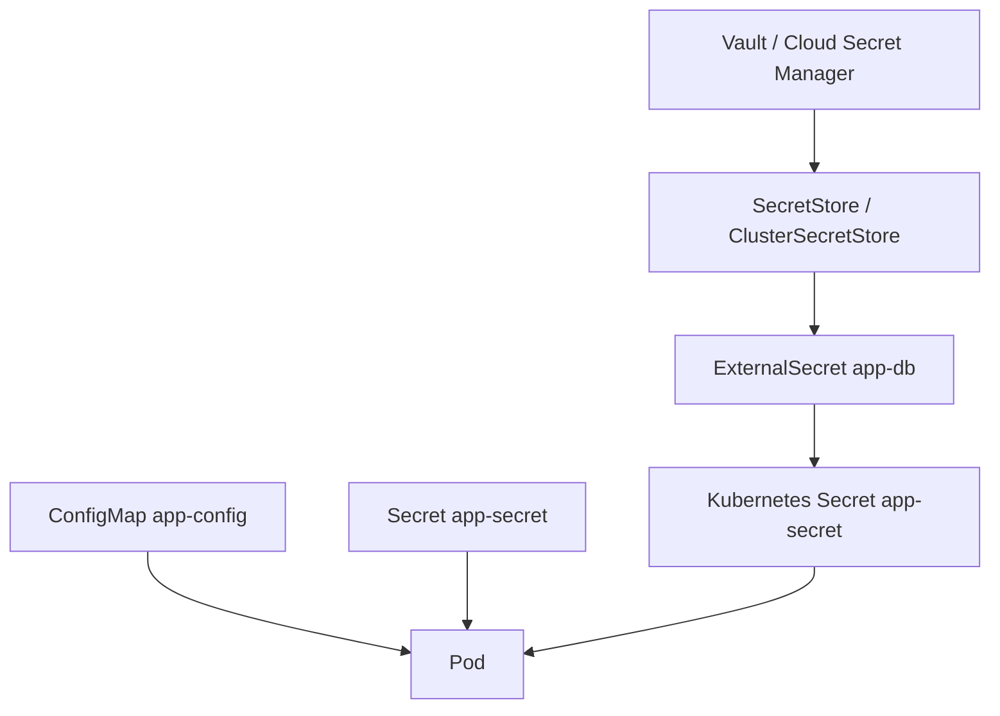

# Document - Day 13: ConfigMap, Secret and Secret Management Reference

## Object relationship



## Minimal ConfigMap

```yaml
apiVersion: v1
kind: ConfigMap
metadata:
  name: app-config
data:
  APP_MODE: "lab"
  LOG_LEVEL: "debug"
  settings.ini: |
    timeout_seconds=5
    feature_flag=true
```

## Minimal Secret

```yaml
apiVersion: v1
kind: Secret
metadata:
  name: app-secret
type: Opaque
stringData:
  DB_USERNAME: app
  DB_PASSWORD: change-me-in-lab
```

## Consume config and secret in a Deployment

```yaml
apiVersion: apps/v1
kind: Deployment
metadata:
  name: config-demo
spec:
  replicas: 2
  selector:
    matchLabels:
      app: config-demo
  template:
    metadata:
      labels:
        app: config-demo
    spec:
      containers:
      - name: app
        image: busybox:1.36
        command: ["sh", "-c", "while true; do env | grep -E 'APP_MODE|DB_'; cat /etc/app/config/settings.ini; sleep 30; done"]
        env:
        - name: APP_MODE
          valueFrom:
            configMapKeyRef:
              name: app-config
              key: APP_MODE
        - name: DB_USERNAME
          valueFrom:
            secretKeyRef:
              name: app-secret
              key: DB_USERNAME
        - name: DB_PASSWORD
          valueFrom:
            secretKeyRef:
              name: app-secret
              key: DB_PASSWORD
        volumeMounts:
        - name: app-config-volume
          mountPath: /etc/app/config
          readOnly: true
      volumes:
      - name: app-config-volume
        configMap:
          name: app-config
          items:
          - key: settings.ini
            path: settings.ini
```

## ExternalSecret template

```yaml
apiVersion: external-secrets.io/v1
kind: ExternalSecret
metadata:
  name: app-db
spec:
  refreshInterval: 1h
  secretStoreRef:
    name: team-secret-store
    kind: SecretStore
  target:
    name: app-secret
    creationPolicy: Owner
  data:
  - secretKey: DB_PASSWORD
    remoteRef:
      key: production/app/db-password
```

## Consume patterns

| Pattern | Pros | Cons | Use case |
|---|---|---|---|
| `env.valueFrom.configMapKeyRef` | Contract rõ, dễ debug | Cần restart để cập nhật | Few stable settings |
| `env.valueFrom.secretKeyRef` | Rõ app cần secret nào | Có thể lộ qua env dump/log | Credentials nhỏ |
| `envFrom` | Nhanh cho nhiều key | Key conflict, khó audit | Lab hoặc config ít nhạy |
| ConfigMap volume | Có thể update file | App phải reload | File config, NGINX config |
| Secret volume | Giảm lộ qua env | App đọc file, permission cần chú ý | TLS key, token file |
| `subPath` mount | Mount một key vào path cụ thể | Không nhận update tự động | Legacy app cần file path cố định |
| ExternalSecret | Source of truth bên ngoài | Thêm operator/provider dependency | Production cloud |

## Update behavior và limits

| Cách consume | Update khi object đổi | Cách vận hành an toàn |
|---|---|---|
| Env var | Không đổi cho container đang chạy | `kubectl rollout restart deployment/<name>` hoặc release mới |
| ConfigMap/Secret volume | Kubelet cập nhật eventually | App reload file hoặc reread file theo chu kỳ |
| Volume mount qua `subPath` | Không update tự động | Dùng object name versioned và rollout restart |
| `immutable: true` | Không sửa được object | Tạo object mới như `app-config-v2` |

Giới hạn thực tế:

- `ConfigMap` và `Secret` có limit khoảng 1 MiB mỗi object.
- Object đổi liên tục làm tăng watch load lên API server/kubelet.
- Secret trong env dễ bị lộ qua debug dump; secret dạng file dễ kiểm soát permission hơn nhưng app phải đọc file.
- Base64 trong `Secret.data` chỉ là encoding, không phải encryption.

## Command cheatsheet

```bash
kubectl create configmap app-config --from-literal=APP_MODE=lab
kubectl create secret generic app-secret --from-literal=DB_PASSWORD=change-me

kubectl get configmap,secret
kubectl describe configmap app-config
kubectl describe secret app-secret
kubectl get secret app-secret -o jsonpath='{.data.DB_PASSWORD}'
kubectl rollout restart deployment/config-demo

kubectl get events --sort-by=.lastTimestamp
kubectl describe pod <pod>
kubectl exec -it <pod> -- sh
```

Decode base64 trong lab:

```bash
# Linux/macOS/WSL
kubectl get secret app-secret -o jsonpath='{.data.DB_PASSWORD}' | base64 -d
```

```powershell
# PowerShell
$encoded = kubectl get secret app-secret -o jsonpath='{.data.DB_PASSWORD}'
[Text.Encoding]::UTF8.GetString([Convert]::FromBase64String($encoded))
```

ExternalSecret version check:

```bash
kubectl api-resources | grep -i externalsecret
kubectl explain externalsecret.spec
```

PowerShell fallback:

```powershell
kubectl api-resources | Select-String -Pattern externalsecret
kubectl explain externalsecret.spec
```

## Failure modes

| Symptom | Có thể do | First commands |
|---|---|---|
| `CreateContainerConfigError` | Thiếu `ConfigMap`, `Secret` hoặc key | `describe pod`, `get cm,secret` |
| App vẫn dùng config cũ | Env không tự update, app không reload file | `exec env`, `cat mounted file`, restart |
| Secret bị decode được | RBAC quá rộng hoặc secret plain trong Git | `kubectl auth can-i get secrets`, audit |
| ExternalSecret không sync | Provider auth sai, store sai, remote key sai | `describe externalsecret`, operator logs |
| Image pull fail | `dockerconfigjson` Secret sai hoặc thiếu SA link | `describe pod`, `get secret regcred` |
| Rotation làm app lỗi | App không reconnect hoặc credential overlap không đủ | app logs, connection metrics |

## Production checklist

- [ ] Không commit Kubernetes `Secret` plain text.
- [ ] Bật encryption at rest cho Secret.
- [ ] RBAC không cấp `list/watch secrets` rộng hơn cần thiết.
- [ ] Mỗi app chỉ đọc secret của chính nó.
- [ ] Có rotation plan và rollback plan.
- [ ] Secret source of truth rõ ràng.
- [ ] CI/CD log không in secret.
- [ ] App không dump toàn bộ environment variables.
- [ ] Secret dùng cho registry, TLS, DB được tách theo purpose.
- [ ] External secret sync interval không quá dày.

## Decision matrix

| Bối cảnh | Khuyến nghị |
|---|---|
| Lab local | `ConfigMap` + `Secret stringData`, cleanup sau lab |
| Small production | SOPS hoặc Sealed Secrets, RBAC chặt, encryption at rest |
| Cloud production | Cloud Secret Manager + External Secrets Operator, IAM scoped |
| Regulated environment | Vault hoặc managed secret manager có audit/KMS/policy rõ |
| Multi-cluster GitOps | External Secrets hoặc SOPS với key management chuẩn hóa |
