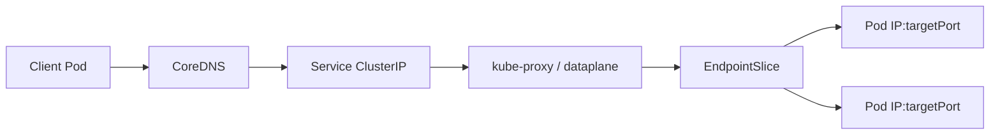

# Document - Day 15: Service Types Reference

## Traffic flow



## ClusterIP template

```yaml
apiVersion: v1
kind: Service
metadata:
  name: web
spec:
  type: ClusterIP
  selector:
    app: web
  ports:
  - name: http
    port: 8080
    targetPort: 8080
```

## NodePort template

```yaml
apiVersion: v1
kind: Service
metadata:
  name: web-nodeport
spec:
  type: NodePort
  selector:
    app: web
  ports:
  - name: http
    port: 8080
    targetPort: 8080
    nodePort: 30080
```

## LoadBalancer template

```yaml
apiVersion: v1
kind: Service
metadata:
  name: web-lb
spec:
  type: LoadBalancer
  selector:
    app: web
  ports:
  - name: http
    port: 80
    targetPort: 8080
```

## ExternalName template

```yaml
apiVersion: v1
kind: Service
metadata:
  name: external-api
spec:
  type: ExternalName
  externalName: api.example.com
```

## Headless Service template

```yaml
apiVersion: v1
kind: Service
metadata:
  name: web-headless
spec:
  clusterIP: None
  selector:
    app: web
  ports:
  - name: http
    port: 8080
    targetPort: 8080
```

## Service type decision matrix

| Requirement | Recommended type |
|---|---|
| App A gọi App B trong cluster | `ClusterIP` |
| Expose nhanh trong lab qua node port | `NodePort` |
| Public/private L4 entrypoint trên cloud | `LoadBalancer` |
| HTTP host/path routing | `ClusterIP` backend sau `Ingress` hoặc Gateway |
| Alias tới DNS ngoài cluster | `ExternalName` |
| Stateful peer discovery | Headless Service |
| Client cần từng Pod IP | Headless Service hoặc direct EndpointSlice-aware client |

## Lab exposure matrix

| Môi trường | `NodePort` | `LoadBalancer` | Ghi chú |
|---|---|---|---|
| k3d | Cần map port khi tạo cluster nếu test từ host | Có thể phụ thuộc ServiceLB và mapped ports | Test nội bộ bằng debug Pod đáng tin hơn |
| K3s trực tiếp trên VM/Linux | Dùng node IP nếu firewall mở | ServiceLB có thể tạo external IP nếu còn bật | Khác cloud LB về health check/source IP |
| Bare-metal upstream | Phụ thuộc node network/firewall | Thường `Pending` nếu chưa cài MetalLB | Cần LB integration |
| Managed cloud | Security group/firewall quyết định | Cloud LB thật, có cost | Annotation/health check khác theo provider |

## Important fields

| Field | Notes |
|---|---|
| `spec.type` | `ClusterIP`, `NodePort`, `LoadBalancer`, `ExternalName` |
| `spec.selector` | Labels chọn backend Pods |
| `spec.ports[].port` | Port Service expose |
| `spec.ports[].targetPort` | Port backend Pod/container listen |
| `spec.ports[].nodePort` | Node port khi dùng NodePort/LoadBalancer |
| `spec.clusterIP` | Virtual IP, hoặc `None` cho headless |
| `spec.externalTrafficPolicy` | `Cluster` hoặc `Local` cho external traffic |
| `spec.sessionAffinity` | `None` hoặc `ClientIP` |

## Command cheatsheet

```bash
kubectl get svc
kubectl get svc -o wide
kubectl describe svc web
kubectl get endpoints web
kubectl get endpointslice -l kubernetes.io/service-name=web
kubectl get pods --show-labels
kubectl get pods -l app=web -o wide

kubectl port-forward service/web 8080:8080
kubectl run curl --rm -it --restart=Never --image=curlimages/curl:8.10.1 -- http://web:8080
kubectl run curl-loop --rm -it --restart=Never --image=curlimages/curl:8.10.1 --command -- sh -c 'for i in 1 2 3; do curl -s http://web:8080; echo; done'
kubectl run wget-test --rm -it --restart=Never --image=busybox:1.36 --command -- wget -qO- http://web:8080
```

PowerShell host test cho `NodePort` nếu node IP reachable:

```powershell
Invoke-WebRequest -UseBasicParsing http://<node-ip>:30080
```

## Failure modes

| Symptom | Có thể do | First commands |
|---|---|---|
| Service no endpoints | Selector sai, Pod chưa Ready, sai namespace | `describe svc`, `get pods --show-labels` |
| Endpoints có nhưng curl fail | `targetPort` sai, app không listen, NetworkPolicy | `describe svc`, `logs`, `exec` |
| NodePort không vào được | Firewall, node IP sai, k3d không map port | `get nodes -o wide`, `describe svc` |
| LoadBalancer Pending | Không có provider/ServiceLB/MetalLB | `describe svc`, check controller pods |
| Mất source IP | `externalTrafficPolicy: Cluster` hoặc LB/NAT | inspect headers/logs, LB config |
| Headless DNS nhiều IP | Expected behavior | client retry/load balancing |
| ExternalName không health check | DNS alias only | `nslookup`, `dig`, app logs |

## K3s notes

- K3s thường đóng gói Traefik, CoreDNS, local-storage, metrics-server và có cơ chế bundled load balancing tùy cấu hình.
- Nếu disable `servicelb`, Service `LoadBalancer` trong lab có thể `Pending` giống bare-metal chưa cài MetalLB.
- Với k3d, truy cập từ host còn phụ thuộc port mapping khi tạo cluster.
- `NodePort` trên local VM cần biết đúng node IP và firewall.

## Production checklist

- [ ] Internal services dùng `ClusterIP` mặc định.
- [ ] Public HTTP traffic đi qua Ingress/Gateway/API gateway thay vì mỗi app một LB.
- [ ] Service selectors match Pod template labels.
- [ ] Readiness probe bảo vệ endpoint readiness.
- [ ] Port names rõ ràng.
- [ ] `targetPort` đúng với container listen port.
- [ ] Cloud `LoadBalancer` annotations, firewall, health check và cost được review.
- [ ] NodePort không mở public nếu không có lý do.
- [ ] Headless Service chỉ dùng khi client/app hiểu endpoint churn.
- [ ] Runbook debug có `svc`, `endpoints`, `endpointslice`, `pods --show-labels`.
