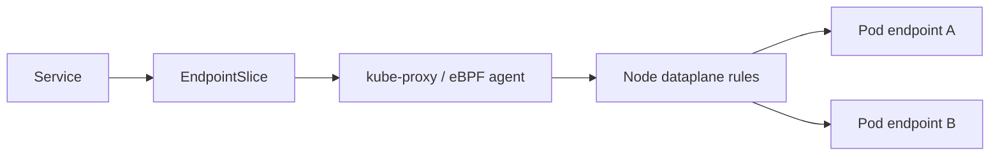

# Document - Day 16: kube-proxy Modes Reference

## Service dataplane flow



## Mode comparison

| Mode | Core mechanism | Strength | Cost | Debug tools |
|---|---|---|---|---|
| `iptables` | netfilter NAT chains | Mature, default-friendly | Rule count and sync overhead | `iptables-save`, kube-proxy logs, `conntrack` |
| `IPVS` | Linux Virtual Server | Efficient kernel load balancing | Kernel modules and IPVS state | `ipvsadm`, `lsmod`, kube-proxy logs |
| eBPF replacement | BPF programs in kernel | Performance, policy, observability | CNI/kernel complexity | CNI-specific tools, BPF maps, agent logs |

## Decision matrix

| Situation | Practical choice |
|---|---|
| Local K3s/k3d lab | Keep default, learn object and dataplane inspection |
| Small production | Default `iptables` is usually acceptable |
| Large number of Services/Endpoints | Evaluate IPVS or eBPF with load test |
| Need advanced NetworkPolicy and flow observability | Evaluate Cilium/eBPF |
| Strict managed Kubernetes support boundary | Use provider-supported add-ons first |
| Team lacks kernel/networking ops experience | Avoid custom dataplane until necessary |

## Commands: Kubernetes-level inspection

```bash
kubectl get svc,endpoints,endpointslice -A
kubectl describe svc <service> -n <namespace>
kubectl get pods -n <namespace> -o wide --show-labels
kubectl get nodes -o wide
kubectl get events -n <namespace> --sort-by=.lastTimestamp
```

## Commands: upstream kube-proxy DaemonSet

```bash
kubectl -n kube-system get ds kube-proxy
kubectl -n kube-system get pods -l k8s-app=kube-proxy -o wide
kubectl -n kube-system get configmap kube-proxy -o yaml
kubectl -n kube-system logs -l k8s-app=kube-proxy --tail=100
```

## Commands: K3s notes

```bash
kubectl -n kube-system get pods -o wide
kubectl -n kube-system get configmap coredns -o yaml

# Trên Linux node:
sudo journalctl -u k3s -n 200
sudo journalctl -u k3s-agent -n 200
```

K3s đóng gói nhiều component trong một binary, nên không phải cluster K3s nào cũng có Pod/DaemonSet `kube-proxy` để bạn xem logs như kubeadm.

## Commands: node dataplane

```bash
sudo iptables-save | grep KUBE-SVC | head
sudo iptables-save | grep KUBE-NODEPORTS | head
sudo ipvsadm -Ln
sudo lsmod | grep ip_vs
sudo conntrack -S
sudo sysctl net.netfilter.nf_conntrack_count
sudo sysctl net.netfilter.nf_conntrack_max
```

## Service fields that affect dataplane

| Field | Effect |
|---|---|
| `spec.type` | `ClusterIP`, `NodePort`, `LoadBalancer` create different rule paths |
| `spec.ports[].port` | Service frontend port |
| `spec.ports[].targetPort` | Backend Pod port |
| `spec.externalTrafficPolicy` | `Cluster` may cross nodes; `Local` preserves source IP better |
| `spec.sessionAffinity` | Can pin a client IP to same backend for a period |
| `spec.internalTrafficPolicy` | Can prefer local node endpoints for internal traffic |
| Endpoint readiness | Only Ready endpoints normally receive Service traffic |

## Failure modes

| Symptom | Likely layer | First check |
|---|---|---|
| Service no endpoints | Kubernetes metadata/readiness | `describe svc`, `get pods --show-labels` |
| Endpoints exist, connection refused | App port or `targetPort` | `describe svc`, `logs`, `exec` |
| Endpoints exist, timeout | Dataplane/CNI/firewall | kube-proxy logs, node routes, CNI pods |
| Works same-node, fails cross-node | CNI routing | Pod `-o wide`, node routes, CNI logs |
| Random timeout under load | `conntrack`/node saturation | `conntrack -S`, node metrics |
| Source IP missing | NAT policy | `externalTrafficPolicy`, LB config |
| K3s has no kube-proxy Pod | Packaging difference | `journalctl -u k3s`, K3s docs |

## Actual mode detection checklist

| Check | Command | Interpretation |
|---|---|---|
| Upstream kube-proxy object | `kubectl -n kube-system get ds kube-proxy` | Có DaemonSet riêng để inspect ConfigMap/logs |
| K3s packaging | `kubectl -n kube-system get pods -o wide` | Không thấy `kube-proxy` riêng có thể là bình thường |
| iptables backend | `sudo iptables -V` | Có thể là `nf_tables`; hiểu là compatibility backend |
| iptables Service rules | `sudo iptables-save | grep KUBE-SVC` | Chỉ có output khi iptables path tham gia Service dataplane |
| IPVS state | `sudo ipvsadm -Ln` | Có virtual services nếu IPVS mode dùng thật |
| eBPF replacement | CNI CLI/logs, ví dụ `cilium service list` | Service dataplane nằm trong CNI/eBPF |

## Quick answer key

- `Service` không route nếu không có Ready endpoint, dù `ClusterIP` tồn tại.
- `iptables` dùng rule chains; IPVS dùng kernel virtual service table; eBPF có thể thay kube-proxy tùy CNI.
- K3s có thể đóng gói kube-proxy trong process K3s, nên không có Pod `kube-proxy` riêng.
- `conntrack` đầy thường tạo timeout/reset ngẫu nhiên và p99 latency xấu.
- `targetPort` sai là lỗi Service/app port, không phải bằng chứng kube-proxy hỏng.

## Production checklist

- [ ] Know the actual Service dataplane mode.
- [ ] Track Service count, endpoint count and endpoint churn.
- [ ] Monitor node networking errors and conntrack usage.
- [ ] Keep CNI/kube-proxy/eBPF add-on versions aligned with Kubernetes version.
- [ ] Test cross-node traffic, not only same-node traffic.
- [ ] Document whether K3s bundled components are enabled or replaced.
- [ ] Have a rollback plan before switching dataplane mode.
- [ ] Keep cloud provider support boundaries clear for managed clusters.
