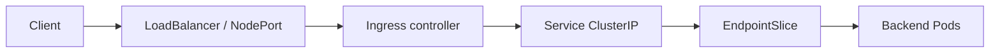

# Document - Day 17: Ingress Reference

## Traffic flow



## Minimal Ingress template

```yaml
apiVersion: networking.k8s.io/v1
kind: Ingress
metadata:
  name: app
spec:
  ingressClassName: traefik
  rules:
  - host: app.example.com
    http:
      paths:
      - path: /api
        pathType: Prefix
        backend:
          service:
            name: api
            port:
              number: 8080
```

## TLS template

```yaml
apiVersion: networking.k8s.io/v1
kind: Ingress
metadata:
  name: app-tls
spec:
  ingressClassName: traefik
  tls:
  - hosts:
    - app.example.com
    secretName: app-tls
  rules:
  - host: app.example.com
    http:
      paths:
      - path: /
        pathType: Prefix
        backend:
          service:
            name: app
            port:
              number: 8080
```

Create TLS Secret:

```bash
kubectl create secret tls app-tls --cert=tls.crt --key=tls.key
```

## pathType quick reference

| pathType | Match behavior | Use case |
|---|---|---|
| `Exact` | Request path must match exactly | `/healthz`, fixed callback path |
| `Prefix` | Prefix by path segments | `/api`, `/orders` |
| `ImplementationSpecific` | Controller decides | Only when you accept lock-in |

## Prefix routing vs path rewrite

`Prefix` chỉ quyết định route nào match request. Nó không đảm bảo controller sẽ strip prefix trước khi gửi tới backend.

| Need | Portable Ingress? | Typical solution |
|---|---:|---|
| Backend phục vụ đúng `/api` | Yes | Route `/api` trực tiếp |
| Backend phục vụ `/`, public path là `/api` | No | Controller-specific rewrite/middleware |
| Cần auth/rate-limit/transform/canary phức tạp | Usually no | API Gateway, Gateway API implementation hoặc service mesh |

Khi debug 404 sau Ingress, kiểm tra cả route match ở controller và path thật backend nhận được.

## Ingress vs Gateway API vs API Gateway

| Option | Khi dùng | Caveat |
|---|---|---|
| Ingress | HTTP/S routing cơ bản vào cluster | API nhỏ, portability giới hạn bởi annotation |
| Gateway API | Muốn model route/gateway hiện đại, nhiều role ownership hơn | Cần controller hỗ trợ Gateway API |
| API Gateway | Auth, rate limit, transform, developer portal, policy L7 sâu | Vận hành thêm một gateway layer |

## Controller comparison

| Controller | Strength | Watch out |
|---|---|---|
| Traefik | K3s default, dynamic config, simple lab setup | Production config must be reviewed |
| NGINX Ingress | Very common, many examples | Annotation behavior and reload tuning |
| HAProxy Ingress | Strong proxy behavior, HAProxy familiarity | Smaller ecosystem than NGINX |
| Cloud ingress | Cloud LB/cert/WAF integration | Provider lock-in, cost, quota |

## Commands cheatsheet

```bash
kubectl get ingressclass
kubectl get ingress -A
kubectl describe ingress <name> -n <namespace>
kubectl get svc,endpoints,endpointslice -n <namespace>
kubectl get pods -n <namespace> -o wide --show-labels

kubectl -n kube-system get pods,svc | grep -E 'traefik|ingress|nginx|haproxy'
kubectl -n kube-system logs deploy/traefik --tail=100
kubectl -n ingress-nginx logs deploy/ingress-nginx-controller --tail=100
```

## curl patterns

HTTP with Host header:

```bash
curl -H 'Host: app.example.com' http://<ingress-ip>/api
```

HTTPS with SNI and local IP override:

```bash
curl -k --resolve app.example.com:443:<ingress-ip> https://app.example.com/api
```

Port-forward controller Service:

```bash
kubectl -n kube-system port-forward svc/traefik 8080:80
curl -H 'Host: app.example.com' http://127.0.0.1:8080/api
```

## Failure modes

| Symptom | Có thể do | First commands |
|---|---|---|
| Ingress không có address | Controller không chạy, class sai, LB pending | `get ingressclass`, `describe ingress`, controller logs |
| 404 | Host/path không match, request đi sai controller | `describe ingress`, curl Host header |
| 502 | Controller route được nhưng upstream reset/bad response | Controller logs, Pod logs, readiness |
| 503 | Backend Service/Endpoint rỗng hoặc upstream fail | `get svc,endpoints,endpointslice` |
| TLS default cert | Secret sai, SNI sai, cert chưa reload | `get secret`, `describe ingress`, controller logs |
| Rule không apply | Annotation sai controller hoặc config invalid | controller logs/events |
| Works locally, fails public | DNS, firewall, cloud LB, security group | LB status, cloud console, `curl --resolve` |

## Quick answer key

- `Ingress` là desired state; `Ingress controller` mới là reverse proxy/load balancer runtime.
- `IngressClass` chọn controller chịu trách nhiệm reconcile route.
- `Prefix` routing không tự rewrite path; rewrite là controller-specific.
- 404 thường là host/path không match; 503 thường là backend Service/Endpoint rỗng hoặc upstream fail.
- TLS Secret phải nằm cùng namespace với Ingress và SNI/host phải match cert.

## K3s notes

- K3s thường cài Traefik mặc định.
- Disable Traefik bằng `k3s server --disable=traefik` trên tất cả server nodes.
- Cấu hình packaged Traefik bằng `HelmChartConfig` thay vì sửa manifest được K3s quản lý thủ công.
- Traefik external access trong K3s lab thường phụ thuộc ServiceLB, NodePort hoặc k3d port mapping.
- `kubectl get ingressclass` là cách nhanh nhất để biết class name nên dùng.

## Production checklist

- [ ] `ingressClassName` được set rõ.
- [ ] Backend Service dùng `ClusterIP`.
- [ ] Service có endpoints Ready.
- [ ] TLS cert được cấp/renew tự động.
- [ ] Annotation được chuẩn hóa cho đúng controller.
- [ ] Controller có requests/limits và replicas phù hợp.
- [ ] Access logs, 4xx/5xx, latency, upstream errors được monitor.
- [ ] Public DNS, LB, firewall/security group được kiểm tra.
- [ ] Có runbook phân biệt 404, 503 và TLS error.
