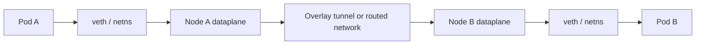

# Document - Day 20: CNI Reference

## Pod traffic flow



## CNI comparison

| CNI | Primary strength | Typical mode | Policy | Watch out |
|---|---|---|---|---|
| Flannel | Simple Pod connectivity | VXLAN overlay, host-gw in some setups | Not Flannel's main strength | MTU, limited advanced policy/observability |
| Calico | NetworkPolicy and routing | Overlay or routed/BGP | Strong | More config, BGP/IP pool complexity |
| Cilium | eBPF networking/security/observability | eBPF datapath, tunnel or native routing | Strong L3/L4, optional L7 extensions | Kernel/version/tooling complexity |
| Cloud CNI | Cloud-native IP/routing integration | VPC/VNet native | Provider-dependent | IP exhaustion, subnet sizing, quota |

## Overlay vs routed

| Pattern | Strength | Cost | Debug clues |
|---|---|---|---|
| VXLAN/Geneve overlay | Works without underlay knowing PodCIDR | Encapsulation overhead, MTU risk | Tunnel interface, lower MTU, UDP encapsulation |
| WireGuard overlay | Encryption between nodes | CPU overhead, key/config lifecycle | WireGuard interfaces, peer status |
| Routed/BGP | Lower overhead, clear routing model | Needs network integration | PodCIDR routes, BGP sessions |
| Cloud native | Integrates with VPC/VNet | Cloud quota and IP planning | ENI/NIC/IP allocation, route tables |

## K3s CNI commands

Inspect current cluster:

```bash
kubectl -n kube-system get pods -o wide
kubectl -n kube-system get ds
kubectl get nodes -o wide
kubectl describe node <node>
```

Linux node:

```bash
sudo ls /etc/cni/net.d
sudo cat /etc/cni/net.d/*
ip addr
ip route
sudo journalctl -u k3s -n 200
```

K3s custom CNI install pattern:

```bash
curl -sfL https://get.k3s.io | INSTALL_K3S_EXEC="server --flannel-backend=none --disable-network-policy" sh -
```

Sau đó cài CNI bạn chọn theo docs chính thức của CNI đó.

## Cilium quick commands

```bash
kubectl -n kube-system get pods -l k8s-app=cilium -o wide
kubectl -n kube-system logs -l k8s-app=cilium --tail=100
cilium status
cilium connectivity test
kubectl get ciliumnetworkpolicies -A
```

Kube-proxy replacement thường được bật qua Helm value như `kubeProxyReplacement=true`; cần cấu hình API server host/port theo docs Cilium và support matrix của cluster.

## Calico quick commands

```bash
kubectl -n kube-system get pods | grep -i calico
kubectl -n kube-system logs -l k8s-app=calico-node --tail=100
kubectl get networkpolicies -A
```

Nếu có `calicoctl`, dùng để inspect IP pools, node status và policy state theo docs Calico.

## Debug decision tree

```text
Service timeout
  |
  +-- Service has endpoints?
  |     |
  |     +-- no  -> selector/readiness/targetPort issue
  |     +-- yes -> continue
  |
  +-- Direct Pod IP works?
  |     |
  |     +-- no  -> CNI/policy/node route/app port
  |     +-- yes -> Service dataplane/kube-proxy/eBPF
  |
  +-- Same-node works but cross-node fails?
        |
        +-- overlay/firewall/MTU/route/CNI pod on one node
```

## Commands: object layer

```bash
kubectl get pods -A -o wide
kubectl get svc,endpoints,endpointslice -A
kubectl get nodes -o wide
kubectl describe node <node>
kubectl get events -A --sort-by=.lastTimestamp
```

## Commands: test layer

```bash
kubectl run netshoot --rm -it --restart=Never --image=nicolaka/netshoot -- bash
curl -m 2 http://<service>.<namespace>.svc.cluster.local:<port>
curl -m 2 http://<pod-ip>:<port>
ping -c 3 <pod-ip>
tracepath <pod-ip>
```

## Commands: node layer

```bash
ip addr
ip route
ip link
ip -d link
ss -tunlp
ls /etc/cni/net.d
cat /etc/cni/net.d/*
```

For k3d node container:

```bash
docker ps --format '{{.Names}}' | grep k3d
docker exec -it <k3d-node-container> sh
```

## Failure modes

| Symptom | Likely layer | First check |
|---|---|---|
| Pod stuck `ContainerCreating` | CNI ADD failed | Pod events, kubelet/K3s logs |
| Pod has no IP | CNI/IPAM | `describe pod`, CNI logs |
| Same-node OK, cross-node timeout | CNI route/overlay/firewall | Pod `-o wide`, node routes, CNI pods |
| Small request OK, large request hangs | MTU/path MTU | `tracepath`, interface MTU |
| NetworkPolicy ignored | CNI no policy enforcement | CNI docs/logs, K3s policy controller |
| Service fails, direct Pod IP OK | kube-proxy/eBPF Service dataplane | Day 16 checklist |
| Direct Pod IP works, external API sees node IP | Egress NAT/masquerade | Node NAT, cloud NAT gateway, egress gateway logs |
| New Pods cannot start on one node | CNI agent/node state | CNI Pod on that node, node pressure |
| Cloud cluster Pods pending due IP | IP/subnet quota | Cloud CNI logs, subnet usage |

## Egress NAT and source IP checklist

- Identify whether external systems see Pod IP, node IP, NAT Gateway IP or egress gateway IP.
- For cloud CNI, check subnet free IPs, ENI/NIC limits and prefix delegation settings.
- For allowlists, document the stable egress IP source instead of assuming Pod IP stability.
- For incidents, compare Pod logs with node/NAT/cloud flow logs before blaming DNS or Service routing.

## Production checklist

- [ ] CNI choice is documented with trade-offs.
- [ ] PodCIDR/subnet/IP pool capacity is sized.
- [ ] MTU is validated for overlay/VPN/cloud path.
- [ ] Same-node and cross-node connectivity tests exist.
- [ ] NetworkPolicy support is verified.
- [ ] CNI add-on version is pinned and upgrade-tested.

## Quick answer key

- CNI hiện thực Pod networking/IPAM/routes; kubelet gọi CNI ADD/DEL khi Pod sandbox được tạo/xóa.
- Single-node chỉ xác minh local Pod network, không đủ kết luận overlay/routed cross-node.
- Service fail nhưng direct Pod IP OK nghiêng về kube-proxy/eBPF Service dataplane; direct Pod IP cross-node fail nghiêng về CNI route/overlay/firewall/MTU.
- Cloud CNI có thể fail scheduling vì hết subnet/ENI/NIC IP dù node còn CPU/memory.
- Egress ra ngoài cluster thường thấy node/NAT/egress gateway IP, không nhất thiết thấy Pod IP.
- [ ] CNI logs/metrics/alerts are monitored.
- [ ] Rollback/rebuild plan exists before CNI migration.
- [ ] Managed Kubernetes support boundary is clear.
