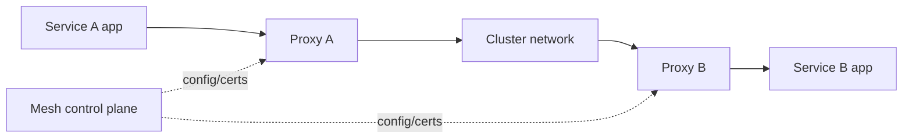

# Document - Day 21: Service Mesh Reference

## Mesh architecture



## What mesh adds

| Capability | Kubernetes primitive gần nhất | Mesh bổ sung gì |
|---|---|---|
| Service discovery | `Service`, DNS | Identity-aware routing, subset/version routing |
| Encryption | TLS trong app hoặc Ingress | mTLS giữa services nội bộ |
| Traffic split | Deployment rollout | Weighted routing giữa versions |
| Policy | `NetworkPolicy` | Service identity, đôi khi L7 method/path policy |
| Observability | logs/metrics app | Request metrics và dependency graph tự động |
| Resilience | code/library | Timeout, retry, circuit breaking nhất quán |

## Istio vs Linkerd

| Tiêu chí | Istio | Linkerd |
|---|---|---|
| Dataplane | Envoy sidecar, có các mode mới tùy cấu hình | Linkerd proxy |
| Strength | Feature-rich traffic, policy, gateway, extensibility | Simpler mTLS and golden metrics |
| Complexity | Cao hơn | Thấp hơn |
| Resource overhead | Thường cao hơn | Thường nhẹ hơn |
| Best fit | Platform lớn, policy/routing phức tạp | Team muốn mesh đơn giản và nhanh |
| Watch out | CRD nhiều, upgrade/debug khó hơn | Ít tính năng advanced hơn |

## Core terms

| Term | Meaning |
|---|---|
| Data plane | Component xử lý request thật |
| Control plane | Component sinh config/cert/policy cho data plane |
| Sidecar injection | Thêm proxy container vào Pod |
| mTLS | Mutual TLS giữa client và server workload |
| Service identity | Identity workload, thường gắn với `ServiceAccount` |
| Traffic split | Chia traffic theo weight giữa versions |
| Authorization policy | Rule cho phép hoặc chặn caller identity |

## Istio object map

| Need | Istio resource thường gặp |
|---|---|
| Edge routing | `Gateway`, `VirtualService` |
| Version subset | `DestinationRule` |
| mTLS mode | `PeerAuthentication` |
| Allow/deny identity | `AuthorizationPolicy` |
| Proxy config override | `EnvoyFilter` hoặc mesh config, dùng thận trọng |

## Linkerd command map

| Need | Command/resource thường gặp |
|---|---|
| Check cluster readiness | `linkerd check --pre` |
| Install control plane | `linkerd install | kubectl apply -f -` |
| Enable namespace injection | `kubectl annotate ns <ns> linkerd.io/inject=enabled` |
| Check mesh health | `linkerd check` |
| Inspect routes/metrics | `linkerd viz stat`, `linkerd viz top`, `linkerd viz tap` |

## Baseline commands

Before blaming mesh:

```bash
kubectl get pods -A -o wide
kubectl get svc,endpoints,endpointslice -A
kubectl get events -A --sort-by=.lastTimestamp
kubectl describe pod <pod> -n <namespace>
kubectl logs <pod> -n <namespace>
```

Check sidecars:

```bash
kubectl get pod <pod> -n <namespace> -o jsonpath='{.spec.containers[*].name}'
kubectl describe pod <pod> -n <namespace>
```

## Istio quick commands

```bash
istioctl analyze
istioctl proxy-status
istioctl proxy-config clusters <pod>.<namespace>
istioctl proxy-config routes <pod>.<namespace>
kubectl -n istio-system get pods
kubectl get peerauthentication,authorizationpolicy -A
kubectl get virtualservice,destinationrule,gateway -A
```

## Linkerd quick commands

```bash
linkerd check
linkerd viz stat deploy -n <namespace>
linkerd viz top deploy/<deployment> -n <namespace>
linkerd viz tap deploy/<deployment> -n <namespace>
kubectl -n linkerd get pods
```

## Traffic splitting mental model

```text
client
  |
  v
service host
  |
  +-- subset v1: 90%
  +-- subset v2: 10%
```

Requirements:

- Both versions have healthy Pods.
- Labels used by subsets match actual Pods.
- Service selector includes both versions or intentionally targets a common app label.
- Dashboard confirms real request distribution.

## mTLS checklist

- [ ] Workloads are meshed/injected.
- [ ] Each workload uses a dedicated `ServiceAccount`.
- [ ] Control plane certificate issuer is healthy.
- [ ] mTLS mode is known: permissive, strict or disabled depending on mesh.
- [ ] Non-mesh workloads and external clients have an explicit migration plan.

## Retry and timeout guardrails

| Setting | Good default thinking | Risk |
|---|---|---|
| Timeout | Shorter than caller SLA and downstream expected latency | Too low creates false failures |
| Retry count | Small, only for safe/idempotent calls | Amplifies outage traffic |
| Retry budget | Bound total retry load | Without budget, failure storms |
| Circuit breaking | Protect downstream under failure | Misconfig can block healthy recovery |

## Common failure modes

| Symptom | Likely layer | First check |
|---|---|---|
| Pod stuck creating | Sidecar injection/admission issue | Events, mutating webhook |
| Service worked before mesh, now 503 | Proxy route/policy/mTLS | Proxy logs, mesh config |
| Only new version gets no traffic | Subset labels wrong | Pod labels, DestinationRule/route |
| mTLS handshake fails | Cert/identity mismatch | Mesh cert status, ServiceAccount |
| External caller cannot reach service | Strict mTLS blocks non-mesh client | Peer auth mode, gateway path |
| Latency increased after injection | Proxy overhead/config | CPU/memory, proxy metrics |

## Adoption checklist

- [ ] Start with one namespace or one low-risk service pair.
- [ ] Define success metric: encrypted traffic, traffic split, policy, telemetry.
- [ ] Set proxy resource requests/limits.
- [ ] Add dashboards before enforcing strict policy.
- [ ] Document rollback: remove injection label, restart workloads, remove mesh CRDs only after cleanup.
- [ ] Avoid global strict mTLS until all expected callers are known.
