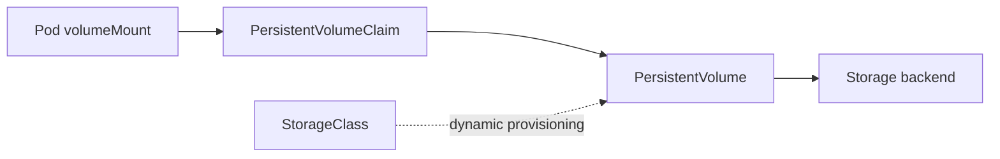

# Document - Day 23: PV/PVC Reference

## Object relationship



## Key objects

| Object | Scope | Owner usually | Purpose |
|---|---|---|---|
| `PersistentVolume` | Cluster | Platform/provisioner | Concrete storage resource |
| `PersistentVolumeClaim` | Namespace | App/team | Request for storage |
| `StorageClass` | Cluster | Platform | Dynamic provisioning policy |
| Pod volume | Namespace | App/team | Mount PVC into container |

## PV phases

| Phase | Meaning |
|---|---|
| `Available` | PV exists and can be claimed |
| `Bound` | PV is bound to a PVC |
| `Released` | PVC deleted, PV not yet reusable |
| `Failed` | PV failed automatic reclaim |

## PVC phases

| Phase | Meaning | Common next step |
|---|---|---|
| `Pending` | No matching/provisioned PV yet | `describe pvc`, check StorageClass/provisioner |
| `Bound` | Claim has a PV | Mount from Pod |
| `Lost` | Bound PV no longer exists | Investigate data loss/control plane state |

## Access modes

| Mode | Meaning | Typical backend |
|---|---|---|
| `ReadWriteOnce` | Read-write by one node | Cloud block disk, local volume |
| `ReadOnlyMany` | Read-only by many nodes | NFS/object-fuse/special drivers |
| `ReadWriteMany` | Read-write by many nodes | NFS, CephFS, some managed file storage |
| `ReadWriteOncePod` | Read-write by one Pod | CSI drivers that support it |

Access mode is storage attach capability, not Linux file permission.

## Reclaim policy

| Policy | Behavior after PVC deletion | Use case |
|---|---|---|
| `Delete` | Delete PV and often backend volume | Disposable/dynamic volumes with backup elsewhere |
| `Retain` | Keep PV and backend data | Important data, manual recovery |
| `Recycle` | Deprecated | Avoid |

## Static PV/PVC example

For lab only:

```yaml
apiVersion: v1
kind: PersistentVolume
metadata:
  name: pv-manual-demo
spec:
  capacity:
    storage: 1Gi
  accessModes:
  - ReadWriteOnce
  persistentVolumeReclaimPolicy: Retain
  storageClassName: manual
  hostPath:
    path: /tmp/pv-manual-demo
    type: DirectoryOrCreate
---
apiVersion: v1
kind: PersistentVolumeClaim
metadata:
  name: data
spec:
  storageClassName: manual
  accessModes:
  - ReadWriteOnce
  resources:
    requests:
      storage: 512Mi
```

## Pod mount PVC

```yaml
apiVersion: v1
kind: Pod
metadata:
  name: pvc-demo
spec:
  volumes:
  - name: data
    persistentVolumeClaim:
      claimName: data
  containers:
  - name: app
    image: busybox:1.36
    command: ["sh", "-c", "date >> /data/history.txt; sleep 3600"]
    volumeMounts:
    - name: data
      mountPath: /data
```

## StatefulSet PVC pattern

```yaml
volumeClaimTemplates:
- metadata:
    name: data
  spec:
    accessModes:
    - ReadWriteOnce
    resources:
      requests:
        storage: 1Gi
```

Kubernetes creates one PVC per Pod ordinal.

## Useful commands

```bash
kubectl get storageclass
kubectl get pv
kubectl get pvc -A
kubectl describe pvc <pvc> -n <namespace>
kubectl describe pv <pv>
kubectl get events -n <namespace> --sort-by=.lastTimestamp
kubectl get pod <pod> -o wide
kubectl describe pod <pod>
```

Find the PV bound to a PVC:

```bash
kubectl get pvc <pvc> -o jsonpath='{.spec.volumeName}'
```

Find all PVCs used by a Pod:

```bash
kubectl get pod <pod> -o jsonpath='{range .spec.volumes[*]}{.name}{" claim="}{.persistentVolumeClaim.claimName}{"\n"}{end}'
```

## PVC Pending decision tree

```text
PVC Pending
  |
  +-- storageClassName exists?
  |     +-- no -> fix class name or default class
  |
  +-- dynamic provisioner healthy?
  |     +-- no -> check provisioner Pod/events
  |
  +-- static PV expected?
  |     +-- yes -> check capacity/accessModes/class/selector
  |
  +-- WaitForFirstConsumer?
        +-- yes -> create Pod and inspect scheduling/topology
```

## Failure modes

| Symptom | Likely cause | First check |
|---|---|---|
| PVC `Pending` | No matching PV/StorageClass/provisioner | `describe pvc` |
| Pod `ContainerCreating` | Attach/mount failed | `describe pod`, events |
| Multi-replica Deployment stuck | RWO volume cannot attach to many nodes | Pod placement, access mode |
| Data gone after cleanup | Reclaim policy `Delete` | PV/StorageClass policy |
| PV stuck `Released` | Retain needs manual recovery | PV claimRef and backend data |
| Expansion ignored | StorageClass/driver does not support expansion | StorageClass and PVC conditions |

## K3s local-path reminders

- Good for lab and small single-node use.
- Data is node-local.
- Not HA by itself.
- Backup strategy is still required.
- In `k3d`, storage path may live inside node container or mounted host path depending on setup.

## Production checklist

- [ ] PVC class and access mode match workload.
- [ ] Reclaim policy is intentional.
- [ ] Backup/restore is tested outside normal PVC lifecycle.
- [ ] Capacity and inode monitoring exist.
- [ ] Expansion process is documented.
- [ ] Node/zone topology constraints are understood.
- [ ] Storage driver alerts are wired into ops.
