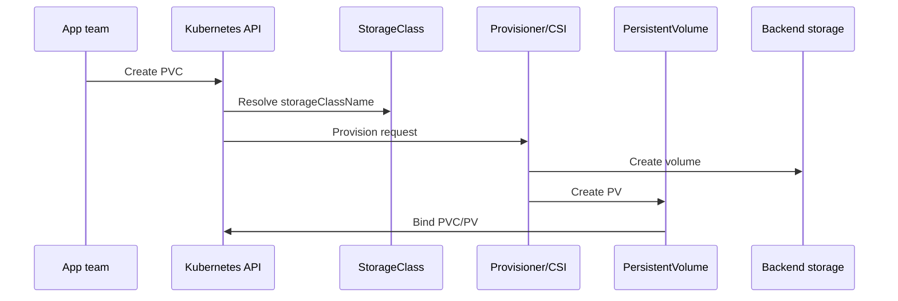

# Document - Day 24: StorageClass Reference

## Dynamic provisioning flow



## StorageClass fields

| Field | Purpose | Operational question |
|---|---|---|
| `provisioner` | Which driver handles PVCs | Is the driver installed and healthy? |
| `parameters` | Driver-specific options | Are these documented and supported? |
| `reclaimPolicy` | PV behavior after PVC deletion | Does delete destroy backend data? |
| `allowVolumeExpansion` | Can PVC size increase? | Is expansion tested end-to-end? |
| `volumeBindingMode` | Bind now or after Pod scheduling | Does storage have topology constraints? |
| `mountOptions` | Filesystem mount options | Are options supported by backend/OS? |

## Minimal StorageClass

K3s local-path example:

```yaml
apiVersion: storage.k8s.io/v1
kind: StorageClass
metadata:
  name: day24-local-path
provisioner: rancher.io/local-path
reclaimPolicy: Delete
volumeBindingMode: WaitForFirstConsumer
allowVolumeExpansion: false
```

Only use this if the `rancher.io/local-path` provisioner exists in your cluster.

## PVC using explicit class

```yaml
apiVersion: v1
kind: PersistentVolumeClaim
metadata:
  name: data
spec:
  storageClassName: day24-local-path
  accessModes:
  - ReadWriteOnce
  resources:
    requests:
      storage: 512Mi
```

## Default class annotation

```yaml
metadata:
  annotations:
    storageclass.kubernetes.io/is-default-class: "true"
```

Check default classes:

```bash
kubectl get storageclass
kubectl get storageclass -o jsonpath='{range .items[*]}{.metadata.name}{" default="}{.metadata.annotations.storageclass\.kubernetes\.io/is-default-class}{"\n"}{end}'
```

## `storageClassName` behavior

| PVC field | Meaning |
|---|---|
| Omitted | Use default StorageClass if one exists |
| `storageClassName: fast` | Use class named `fast` |
| `storageClassName: ""` | Do not use dynamic provisioning; bind only matching static PV with no class |

## Binding modes

| Mode | When PV is created/bound | Good for | Risk |
|---|---|---|---|
| `Immediate` | When PVC is created | Simple non-topology storage | Wrong zone/node |
| `WaitForFirstConsumer` | After Pod using PVC is scheduled | Cloud zones, local volumes | PVC stays Pending until consumer exists |

## Topology mental model

```text
Pod constraints + node availability
  |
  v
Scheduler picks node/zone
  |
  v
Provisioner creates volume compatible with that node/zone
```

This is why `WaitForFirstConsumer` matters.

## Useful commands

```bash
kubectl get storageclass
kubectl describe storageclass <class>
kubectl get pvc,pv
kubectl describe pvc <pvc>
kubectl describe pv <pv>
kubectl get events --sort-by=.lastTimestamp
kubectl -n kube-system get pods
kubectl -n kube-system logs <provisioner-pod> --tail=100
```

List PVCs and classes:

```bash
kubectl get pvc -A -o custom-columns=NS:.metadata.namespace,NAME:.metadata.name,STATUS:.status.phase,CLASS:.spec.storageClassName,VOLUME:.spec.volumeName
```

## Provisioning failure modes

| Symptom | Likely cause | First check |
|---|---|---|
| PVC Pending, no events | Waiting for first consumer | `describe pvc`, create Pod |
| PVC Pending, class not found | Wrong `storageClassName` | `kubectl get sc` |
| PVC Pending, external provisioner error | Driver/provisioner unhealthy | Provisioner logs |
| Pod cannot attach volume | Zone/node mismatch or CSI node issue | Pod events, PV topology |
| Expansion stuck | Driver/filesystem/quota issue | PVC conditions, CSI logs |
| Data deleted after PVC removal | Reclaim policy `Delete` | StorageClass/PV policy |

## StorageClass design template

For each supported class, document:

```text
Name:
Backend:
Access modes:
Binding mode:
Reclaim policy:
Expansion:
Snapshot support:
Backup policy:
Topology/zone behavior:
Latency/throughput expectation:
Intended workloads:
Not intended for:
Owner:
```

## K3s local-path checklist

- [ ] `local-path-provisioner` Pod is running.
- [ ] StorageClass provisioner is `rancher.io/local-path`.
- [ ] Workload can tolerate node-local data.
- [ ] Backup is not assumed.
- [ ] Multi-node scheduling behavior is understood.

## Production guardrails

- [ ] Only platform-owned classes are default-capable.
- [ ] App teams use explicit class for important data.
- [ ] `WaitForFirstConsumer` is preferred for topology-sensitive storage.
- [ ] Reclaim policy is reviewed before destructive cleanup.
- [ ] Expansion is tested in staging.
- [ ] Provisioner metrics/logs are monitored.
