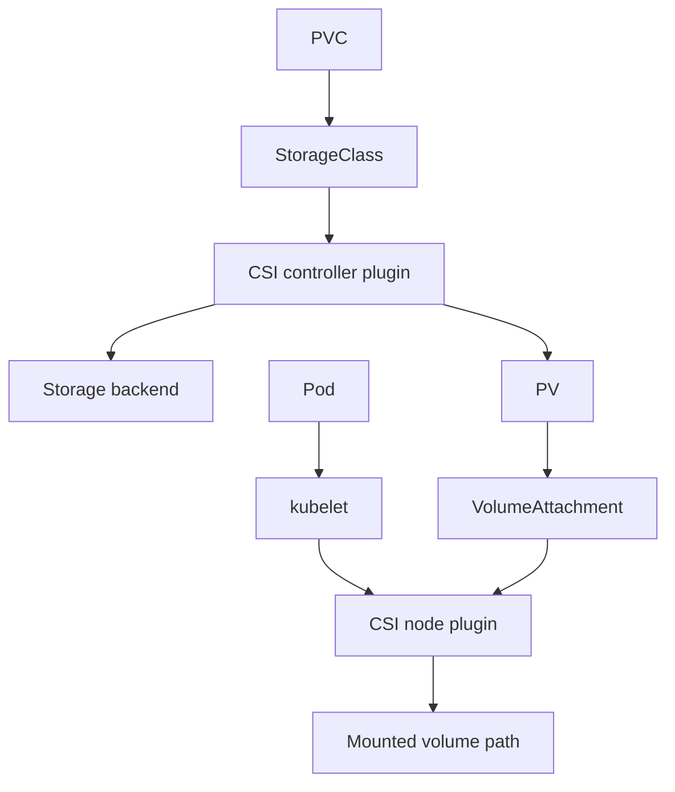

# Document - Day 25: CSI and Storage Troubleshooting Reference

## CSI architecture



## CSI components

| Component | Usually runs as | Responsibility |
|---|---|---|
| Controller plugin | Deployment/StatefulSet | Create/delete/attach/snapshot/expand |
| Node plugin | DaemonSet | Stage/publish/mount/unmount |
| external-provisioner | Sidecar | Watches PVC, creates PV |
| external-attacher | Sidecar | Handles VolumeAttachment |
| external-resizer | Sidecar | Handles expansion |
| external-snapshotter | Sidecar | Handles snapshots |
| node-driver-registrar | Sidecar | Registers driver with kubelet |
| livenessprobe | Sidecar | Health probe |

## Objects to inspect

```bash
kubectl get storageclass
kubectl get csidriver
kubectl get pv
kubectl get pvc -A
kubectl get volumeattachment
kubectl get volumesnapshotclass
kubectl get volumesnapshot -A
```

Snapshot objects may not exist if snapshot CRDs are not installed.

## Provisioning path

```text
PVC created
  |
  +-- StorageClass exists?
  |
  +-- Provisioner/CSI controller healthy?
  |
  +-- Backend capacity/quota/IAM OK?
  |
  v
PV created and bound
```

## Attach/mount path

```text
Pod scheduled to node
  |
  +-- Volume attached to node if required?
  |
  +-- CSI node plugin running on that node?
  |
  +-- Filesystem/device mounted?
  |
  +-- Permissions/securityContext OK?
  |
  v
Container sees mountPath
```

## Core commands

```bash
kubectl describe pvc <pvc> -n <ns>
kubectl describe pv <pv>
kubectl describe pod <pod> -n <ns>
kubectl get events -n <ns> --sort-by=.lastTimestamp
kubectl get volumeattachment
kubectl describe volumeattachment <name>
kubectl get pods -A -o wide | grep -Ei 'csi|storage|longhorn|openebs|rook|ceph|local-path'
```

## Driver log commands

Generic:

```bash
kubectl -n <driver-namespace> get pods -o wide
kubectl -n <driver-namespace> logs <controller-pod> --all-containers --tail=100
kubectl -n <driver-namespace> logs <node-plugin-pod> --all-containers --tail=100
```

Kube-system local-path:

```bash
kubectl -n kube-system get pods | grep local-path
kubectl -n kube-system logs -l app=local-path-provisioner --tail=100
```

Longhorn:

```bash
kubectl -n longhorn-system get pods -o wide
kubectl -n longhorn-system get volumes.longhorn.io
kubectl -n longhorn-system logs -l app=longhorn-manager --tail=100
```

Rook/Ceph:

```bash
kubectl -n rook-ceph get pods -o wide
kubectl -n rook-ceph get cephcluster
kubectl -n rook-ceph logs deploy/rook-ceph-operator --tail=100
```

## Storage backend comparison

| Option | Best for | Strength | Main caveat |
|---|---|---|---|
| K3s local-path | Lab, single-node, simple local data | Simple, bundled with K3s | Node-local, not HA |
| Longhorn | K3s/edge replicated block | Kubernetes-native, snapshots/backups | Network/disk sensitive, operational overhead |
| OpenEBS Local PV | Node-local performance | Simple local volumes | Not HA by itself |
| OpenEBS replicated engines | Kubernetes-native storage | Multiple engine choices | Behavior varies by engine |
| Rook/Ceph | Serious platform storage | Block/file/object, mature Ceph | High complexity |
| Cloud block CSI | Managed K8s databases, RWO | Cloud integration, snapshots | Zone attach, quota, cost |
| Cloud file CSI | RWX/shared files | Multi-node access | Latency/semantics/cost |

## Failure mode table

| Symptom | Layer | First check |
|---|---|---|
| PVC Pending | Provisioning | `describe pvc`, StorageClass, controller logs |
| PV Bound, Pod `ContainerCreating` | Attach/mount | Pod events, VolumeAttachment, node plugin |
| Volume attached to wrong zone | Topology | PV node affinity, Pod node/zone |
| `Multi-Attach error` | Access mode/attach | RWO volume used across nodes |
| Permission denied | Filesystem/security | `runAsUser`, `fsGroup`, file mode |
| App sees disk full | Capacity/inodes | `df -h`, `df -i`, PVC size |
| Expansion pending | Resize support | PVC conditions, resizer logs |
| I/O latency high | Backend/data path | Driver/backend metrics, node pressure |

## VolumeAttachment quick read

```bash
kubectl get volumeattachment
kubectl describe volumeattachment <name>
```

Look for:

- `Attached: true/false`
- attach errors
- target node
- PV name
- driver name

Some provisioners do not use attach in the same way; absence of VolumeAttachment is not always a bug.

## Permission checklist

- [ ] Container user can read/write mount path.
- [ ] `securityContext.fsGroup` is set if needed.
- [ ] Storage driver supports fsGroup behavior expected.
- [ ] Init container does not create root-owned files that app cannot write.
- [ ] Read-only mount is intentional.

## Node drain checklist for storage workloads

- [ ] Workload has PodDisruptionBudget if appropriate.
- [ ] Application can tolerate restart/failover.
- [ ] Volume detach timeout is known.
- [ ] Replacement Pod can attach volume on target node/zone.
- [ ] StatefulSet ordering is understood.
- [ ] Backup exists before risky maintenance.

## Production readiness questions

```text
What is the RPO/RTO?
Who owns restore drills?
What happens if one node dies?
What happens if one disk dies?
What happens if one zone dies?
What latency p99 is acceptable?
How is capacity forecasted?
How are CSI upgrades tested?
How are snapshots retained and encrypted?
```
