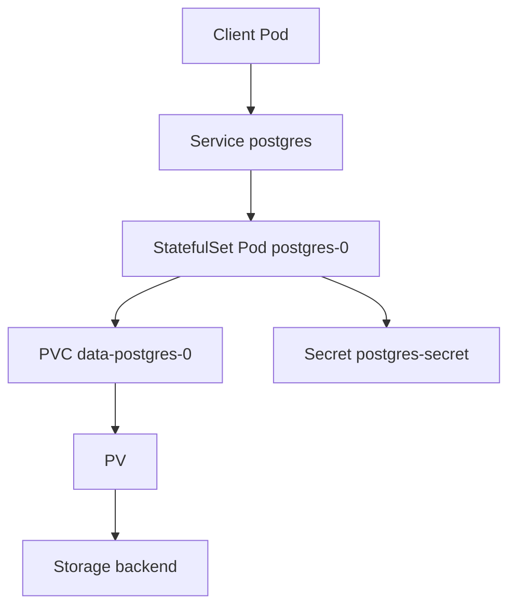

# Document - Day 26: PostgreSQL on Kubernetes Reference

## Lab architecture



## Object mapping

| Requirement | Kubernetes object | Notes |
|---|---|---|
| Stable database endpoint | `Service` | App should use Service DNS, not Pod IP |
| Stable Pod identity | `StatefulSet` | Needed for predictable identity and volume claim |
| Durable data | `PersistentVolumeClaim` | Depends on StorageClass/backend quality |
| Credentials | `Secret` | Rotate intentionally, avoid committing real secrets |
| Readiness | `readinessProbe` | Route only when PostgreSQL responds |
| Restart recovery | StatefulSet + PVC | Not the same as HA |
| Backup | Job/operator/external tooling | Must restore successfully |

## Core commands

```bash
kubectl get statefulset,pod,pvc,svc -n day26 -o wide
kubectl describe pod postgres-0 -n day26
kubectl describe pvc data-postgres-0 -n day26
kubectl logs postgres-0 -n day26 --tail=100
kubectl exec -n day26 pg-client -- psql -h postgres -U app -d appdb -c "SELECT version();"
```

## psql checks

```sql
SELECT version();
SELECT current_database(), current_user;
SELECT now();
SELECT count(*) FROM orders;
```

Useful database inspection:

```sql
SELECT datname, pg_size_pretty(pg_database_size(datname)) FROM pg_database;
SELECT * FROM pg_stat_activity;
SELECT checkpoints_timed, checkpoints_req FROM pg_stat_bgwriter;
```

## Backup and restore snippets

Logical backup:

```bash
kubectl exec -n day26 pg-client -- sh -c 'PGPASSWORD=dev-password pg_dump -h postgres -U app -d appdb' > appdb.sql
```

Restore into a fresh database:

```bash
kubectl exec -n day26 pg-client -- createdb -h postgres -U app restoredb
kubectl exec -i -n day26 pg-client -- sh -c 'PGPASSWORD=dev-password psql -h postgres -U app -d restoredb' < appdb.sql
```

Physical/PITR production backup usually needs:

- Base backup.
- Continuous WAL archiving.
- Retention policy.
- Restore target time.
- Off-cluster storage.
- Restore drill.

## Operator comparison

| Option | Main value | Caveats |
|---|---|---|
| CloudNativePG | Kubernetes-native PostgreSQL cluster lifecycle, backup/recovery features | Still requires PostgreSQL/storage expertise |
| Zalando Postgres Operator | Mature operator, Patroni-based HA model | Operational model and CRDs must be understood |
| Crunchy Postgres Operator | Enterprise-oriented PostgreSQL operations | More platform surface to operate |
| Managed PostgreSQL | Provider handles much of HA, backups, patching | Cost, cloud coupling, networking/IAM constraints |
| Plain StatefulSet | Good for learning object model | Not production HA by itself |

## CloudNativePG CR example

Do not apply this unless the CloudNativePG operator CRDs are installed. The point is to see what the operator owns compared with the plain StatefulSet lab.

```yaml
apiVersion: postgresql.cnpg.io/v1
kind: Cluster
metadata:
  name: app-postgres
spec:
  instances: 3
  imageName: ghcr.io/cloudnative-pg/postgresql:16
  storage:
    size: 100Gi
    storageClass: fast-ssd
  bootstrap:
    initdb:
      database: appdb
      owner: app
      secret:
        name: app-postgres-owner
  monitoring:
    enablePodMonitor: true
  backup:
    barmanObjectStore:
      destinationPath: s3://prod-postgres-backup/app-postgres
      endpointURL: https://s3.example.internal
      s3Credentials:
        accessKeyId:
          name: backup-creds
          key: ACCESS_KEY_ID
        secretAccessKey:
          name: backup-creds
          key: ACCESS_SECRET_KEY
    retentionPolicy: 30d
```

What this CR changes:

- Operator reconciles primary/replica Pods, Services and PVCs.
- Failover and rolling maintenance move into the operator model.
- Backup config becomes declarative, but restore drills are still required.
- StorageClass, credentials, monitoring and object storage remain platform responsibilities.

## PgBouncer connection pooling sketch

Minimal topology:

```text
App Deployment
  -> Service pgbouncer:6432
  -> Deployment pgbouncer
  -> Service postgres:5432
  -> PostgreSQL primary
```

Example ConfigMap shape:

```ini
[databases]
appdb = host=postgres port=5432 dbname=appdb

[pgbouncer]
listen_addr = 0.0.0.0
listen_port = 6432
auth_type = scram-sha-256
auth_file = /etc/pgbouncer/userlist.txt
pool_mode = transaction
max_client_conn = 1000
default_pool_size = 30
reserve_pool_size = 10
server_reset_query = DISCARD ALL
```

Decision notes:

| Pool mode | Good for | Caveat |
|---|---|---|
| `session` | Apps that rely on session state | Fewer pooling gains |
| `transaction` | Stateless API transactions | Watch prepared statements/session variables |
| `statement` | Very narrow workloads | Not compatible with explicit transactions |

Start with app-side pool limits plus PgBouncer. Do not set every app replica to open hundreds of direct PostgreSQL connections.

## Managed vs self-hosted decision

Choose managed when:

- RPO/RTO matters.
- Team does not have database operations coverage.
- Backups, upgrades, monitoring and failover need SLA.
- Cloud/provider dependency is acceptable.

Choose self-hosted only when:

- You have a clear on-prem/edge/platform reason.
- You can operate PostgreSQL and storage failures.
- Backup/restore and upgrade drills are practiced.
- You accept the operational cost.

## Production metrics

PostgreSQL:

- Availability and restart count.
- Active connections and max connections.
- Query latency and slow queries.
- Replication lag.
- WAL generation and archive failures.
- Checkpoint frequency and duration.
- Dead tuples, autovacuum health.
- Lock waits.

Storage:

- Disk usage and inode usage.
- fsync/write latency.
- IOPS and throughput.
- PVC/PV events.
- Volume attach/detach delay.
- Backend health.

Backup:

- Last successful backup time.
- Backup duration.
- Backup size trend.
- Restore drill result.
- WAL archive age.

## Troubleshooting runbook

### Pod is CrashLooping

```bash
kubectl describe pod postgres-0 -n day26
kubectl logs postgres-0 -n day26 --previous
kubectl get events -n day26 --sort-by=.lastTimestamp
kubectl describe pvc data-postgres-0 -n day26
```

Likely causes:

- Bad env/Secret.
- Permission issue on mounted volume.
- Incompatible PostgreSQL version and data directory.
- Disk full.
- Corrupted data directory.

### Client cannot connect

```bash
kubectl get svc,endpoints,endpointslice -n day26
kubectl exec -n day26 pg-client -- nslookup postgres
kubectl exec -n day26 pg-client -- pg_isready -h postgres -U app -d appdb
kubectl logs -n day26 postgres-0 --tail=100
```

Likely causes:

- Pod not Ready.
- Service selector mismatch.
- Wrong credentials.
- NetworkPolicy blocks traffic.
- PostgreSQL not listening or still starting.

### Data missing after restart

Check:

- Was a PVC used?
- Was `PGDATA` inside the mounted path?
- Did the Pod mount the expected PVC?
- Did namespace/PVC get deleted?
- Did reclaim policy delete the PV?

## PostgreSQL production readiness checklist

- [ ] Restore drill passes from backup.
- [ ] PITR tested if required.
- [ ] Replication/failover tested under load.
- [ ] Client routing after failover tested.
- [ ] Storage benchmark recorded.
- [ ] Node drain behavior tested.
- [ ] Minor upgrade rehearsed.
- [ ] Major upgrade plan exists.
- [ ] Monitoring and alerts wired.
- [ ] Secrets and TLS managed.
- [ ] Decision to self-host is documented.
