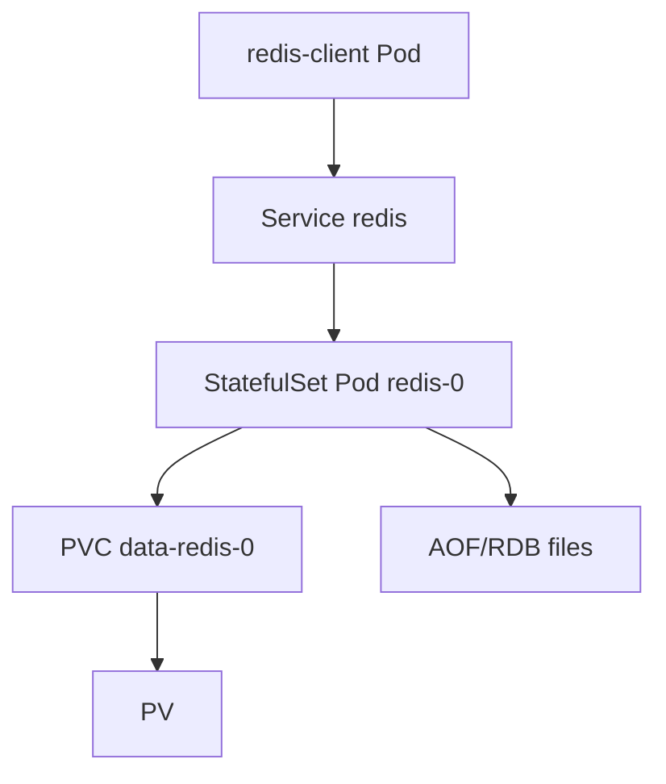

# Document - Day 27: Redis on Kubernetes Reference

## Lab architecture



## Redis modes

| Mode | Solves | Does not solve | Client requirement |
|---|---|---|---|
| Standalone | Simple Redis process, lab/cache | HA, sharding, automatic failover | Normal Redis client |
| Primary/replica | Read replicas, async copy | Automatic promotion by itself | Client/routing aware of primary |
| Sentinel | Failover for primary/replica | Sharding | Client supports Sentinel or proxy/operator routing |
| Cluster | Sharding and HA by hash slots | Simple single endpoint semantics | Client supports Redis Cluster |

## Redis mode decision table

| Requirement | Standalone | Sentinel | Cluster | Managed Redis |
|---|---|---|---|---|
| Simple lab/dev cache | Best fit | Overkill | Overkill | Also fine |
| Write HA | No | Yes, with correct client/routing | Yes, per hash slot | Usually yes |
| Sharding/write scale-out | No | No | Yes | Provider-dependent |
| Client complexity | Low | Medium | High | Low to medium |
| Operational complexity | Low | Medium | High | Lower for app team |
| Kubernetes Service as one endpoint | Safe only with one backend | Needs primary routing model | Not enough for non-cluster client | Provider endpoint handles routing |

Default recommendation:

- Lab: standalone with PVC if you need persistence practice.
- Small production cache: managed Redis unless there is a strong platform reason.
- Self-managed HA: operator/Sentinel/Cluster only after client compatibility and failover drill.

## Persistence modes

| Persistence | Behavior | Good for | Caveats |
|---|---|---|---|
| None | Memory only | Pure cache | Data lost on restart |
| RDB | Periodic snapshots | Compact backups, fast restart | Can lose recent writes |
| AOF everysec | Append log, fsync roughly every second | Better durability | Larger files, rewrite overhead |
| AOF always | fsync every write | Stronger durability | Slower, storage sensitive |

## Kubernetes object mapping

| Need | Object/config | Notes |
|---|---|---|
| Stable endpoint | `Service` | Good for standalone |
| Stable Pod DNS | Headless `Service` + `StatefulSet` | Needed for direct Pod identity |
| Durable data | `PVC` | Only useful if Redis persists to disk |
| Password | `Secret` | Real production needs rotation story |
| Runtime config | Args or `ConfigMap` | Keep memory/persistence explicit |
| Health | Probe + Redis `INFO` | `PING` is only a shallow check |

## Core commands

```bash
kubectl get statefulset,pod,pvc,svc -n day27 -o wide
kubectl describe pod redis-0 -n day27
kubectl logs redis-0 -n day27 --tail=100
kubectl exec -n day27 redis-client -- redis-cli -h redis PING
kubectl exec -n day27 redis-client -- redis-cli -h redis INFO memory
kubectl exec -n day27 redis-client -- redis-cli -h redis INFO persistence
```

## Useful Redis commands

```bash
redis-cli -h redis SET key value
redis-cli -h redis GET key
redis-cli -h redis DBSIZE
redis-cli -h redis INFO server
redis-cli -h redis INFO memory
redis-cli -h redis INFO persistence
redis-cli -h redis INFO replication
redis-cli -h redis CONFIG GET maxmemory
redis-cli -h redis CONFIG GET maxmemory-policy
```

## Memory sizing rule of thumb

```text
container memory limit
  > Redis maxmemory
  + Redis overhead
  + replication/AOF buffers
  + fragmentation headroom
```

Example:

```text
Container limit: 512Mi
Redis maxmemory: 384Mi
Headroom: 128Mi
```

This is only a starting point. Validate with real workload and metrics.

## Health signals

Redis-level:

- `used_memory`
- `used_memory_rss`
- `mem_fragmentation_ratio`
- `evicted_keys`
- `rejected_connections`
- `connected_clients`
- `blocked_clients`
- `instantaneous_ops_per_sec`
- `aof_last_write_status`
- `loading`
- `master_link_status`
- `master_repl_offset`

Kubernetes-level:

- Pod restart count.
- `OOMKilled`.
- PVC events.
- Node memory pressure.
- NetworkPolicy effects.
- Service endpoints.

## Probe guidance

Lab readiness example:

```bash
redis-cli -a "$REDIS_PASSWORD" --raw PING | grep -q '^PONG$'
redis-cli -a "$REDIS_PASSWORD" --raw INFO persistence | grep -q '^loading:0'
```

Write-primary readiness in production may also check:

```bash
redis-cli -a "$REDIS_PASSWORD" --raw INFO replication | grep -q '^role:master'
```

Use that only for a Service intended for writes. A read-replica Service should use a different readiness rule.

Liveness should be less strict and less frequent. Restarting Redis while it loads a large AOF/RDB can make recovery slower.

## Service load-balance anti-pattern

Bad topology:

```text
Service redis selector app=redis
  -> redis-0 standalone data set A
  -> redis-1 standalone data set B
```

Symptoms:

- `GET` sometimes returns value and sometimes returns nil.
- Sessions appear to disappear.
- Writes from one app replica are not visible to another app replica.
- `kubectl get endpoints redis` shows more than one standalone backend.

Verification:

```bash
kubectl get endpoints redis -n day27
kubectl exec -n day27 redis-client -- redis-cli -h redis-0.redis-headless SET only-on-0 yes
kubectl exec -n day27 redis-client -- redis-cli -h redis-1.redis-headless SET only-on-1 yes
kubectl exec -n day27 redis-client -- sh -c 'for i in $(seq 1 10); do redis-cli -h redis MGET only-on-0 only-on-1; done'
```

Fix direction:

- Keep standalone replicas at `1`.
- Use Sentinel/operator/managed Redis for failover.
- Use Redis Cluster and cluster-aware clients for sharding.
- Split Services by role if exposing primary/read replicas.

## Sentinel caveats

Sentinel requires:

- Odd number of Sentinel instances for quorum.
- Stable network connectivity.
- Correct `announce-ip`/DNS behavior in some environments.
- Client support for Sentinel discovery.
- Failover drill under realistic latency.

Common failure:

```text
Sentinel promotes a new primary, but application still writes to old Service endpoint.
```

## Cluster caveats

Redis Cluster requires:

- Client supports MOVED/ASK redirection.
- Stable addresses advertised by nodes.
- Enough masters and replicas.
- Understanding of hash slots.
- Resharding and rebalance procedure.
- Backup story per shard.

Common failure:

```text
Kubernetes Service load-balances across Redis Cluster nodes, but client does not understand cluster redirections.
```

## Troubleshooting runbook

### Client cannot connect

```bash
kubectl get svc,endpoints,endpointslice -n day27
kubectl exec -n day27 redis-client -- redis-cli -h redis PING
kubectl describe pod redis-0 -n day27
kubectl logs redis-0 -n day27 --tail=100
```

Likely causes:

- Wrong password.
- Pod not Ready.
- Service selector mismatch.
- NetworkPolicy blocks traffic.
- Redis still loading AOF/RDB.

### Data missing after restart

Check:

- Is persistence enabled?
- Is `/data` mounted to a PVC?
- Did Redis write AOF/RDB successfully?
- Was namespace/PVC deleted?
- Is the client reading another Redis instance?

### Redis is OOMKilled

Check:

```bash
kubectl describe pod redis-0 -n day27
kubectl exec -n day27 redis-client -- redis-cli -h redis INFO memory
kubectl exec -n day27 redis-client -- redis-cli -h redis INFO stats
```

Likely causes:

- `maxmemory` missing or too high.
- Eviction policy not suitable.
- Large keys.
- AOF/replication buffers.
- Memory fragmentation.

## Production readiness checklist

- [ ] Redis use case classified.
- [ ] Mode selected: standalone, Sentinel, Cluster, managed.
- [ ] Client compatibility confirmed.
- [ ] `maxmemory` and memory limit set.
- [ ] Eviction policy documented.
- [ ] Persistence mode selected.
- [ ] Backup/restore tested if needed.
- [ ] Failover drill tested if HA.
- [ ] Metrics and alerts wired.
- [ ] Password/TLS/NetworkPolicy reviewed.
- [ ] Upgrade procedure rehearsed.
