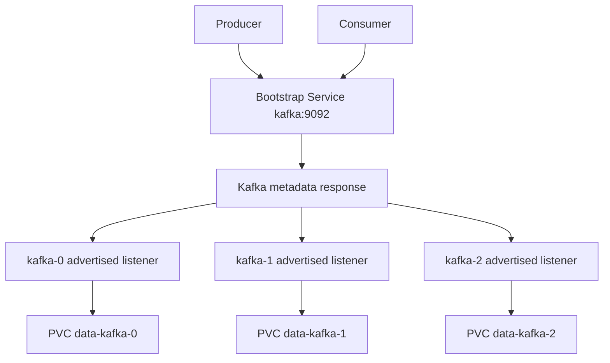

# Document - Day 28: Kafka on Kubernetes Reference

## Kafka on Kubernetes architecture



## Object mapping

| Requirement | Kubernetes/Strimzi mapping | Notes |
|---|---|---|
| Stable broker identity | `StatefulSet` or Strimzi-managed Pods | Broker identity must match data |
| Stable DNS | Headless Service | Used by broker-to-broker and clients |
| Bootstrap endpoint | ClusterIP Service | Only initial metadata discovery |
| Durable logs | PVC per broker | Storage latency matters |
| Declarative cluster | Strimzi `Kafka` CR | Prefer operator for real clusters |
| Declarative topics | Strimzi `KafkaTopic` CR | Avoid manual drift |
| Declarative users | Strimzi `KafkaUser` CR | TLS/SASL/ACL automation |
| DR replication | MirrorMaker 2 | Better than relying only on PVC snapshots |

## Kafka concepts

| Concept | Meaning | Production note |
|---|---|---|
| Topic | Named stream/log | Configure retention and partitions intentionally |
| Partition | Ordered log shard | Ordering only guaranteed within partition |
| Broker | Kafka server | Needs stable identity and storage |
| Leader replica | Replica handling reads/writes | Leaders move during failover/rebalance |
| Replication factor | Number of replicas per partition | Usually 3 for important production data |
| ISR | In-sync replicas | Low ISR means durability risk |
| `min.insync.replicas` | Minimum ISR for writes with `acks=all` | Often 2 with RF=3 |
| Consumer group | Consumers sharing partitions | Monitor lag |
| Retention | Time/size based log deletion | Disk capacity planning depends on it |

## Listener model

```text
Client connects to bootstrap service
  |
  v
Broker returns metadata with advertised broker addresses
  |
  v
Client connects directly to broker advertised addresses
```

Common internal address:

```text
kafka-0.kafka-headless.<namespace>.svc.cluster.local:9092
```

Common failure:

```text
advertised.listeners points to localhost, Pod IP, or internal DNS unreachable by the client.
```

## Core commands

```bash
kubectl get statefulset,pod,pvc,svc -n day28 -o wide
kubectl logs kafka-0 -n day28 --tail=100
kubectl describe pod kafka-0 -n day28
kubectl exec -n day28 kafka-client -- kafka-broker-api-versions.sh --bootstrap-server kafka:9092
kubectl exec -n day28 kafka-client -- kafka-topics.sh --bootstrap-server kafka:9092 --list
```

## Topic commands

```bash
kafka-topics.sh --bootstrap-server kafka:9092 --create --topic orders --partitions 3 --replication-factor 1
kafka-topics.sh --bootstrap-server kafka:9092 --describe --topic orders
kafka-topics.sh --bootstrap-server kafka:9092 --alter --topic orders --partitions 6
```

Do not casually reduce partitions. Kafka does not support shrinking partitions in place.

## Produce and consume

```bash
printf "one\ntwo\n" | kafka-console-producer.sh --bootstrap-server kafka:9092 --topic orders
kafka-console-consumer.sh --bootstrap-server kafka:9092 --topic orders --from-beginning --timeout-ms 5000
```

Consumer groups:

```bash
kafka-consumer-groups.sh --bootstrap-server kafka:9092 --list
kafka-consumer-groups.sh --bootstrap-server kafka:9092 --describe --group <group>
```

## Production sizing questions

- What is expected ingress MB/s?
- What is expected egress MB/s?
- How many partitions are needed?
- What retention time/size is required?
- What replication factor is required?
- What disk throughput and capacity are needed per broker?
- What is acceptable consumer lag?
- How many brokers can be unavailable?
- Are clients internal only or external too?

## Strimzi resource model

| Resource | Purpose |
|---|---|
| `Kafka` | Defines Kafka cluster, listeners, storage, versions |
| `KafkaNodePool` | Defines pools of Kafka nodes in newer Strimzi layouts |
| `KafkaTopic` | Declarative topic management |
| `KafkaUser` | User, certs, ACLs |
| `KafkaConnect` | Kafka Connect cluster |
| `KafkaConnector` | Connector definitions |
| `KafkaMirrorMaker2` | Cross-cluster replication |
| `KafkaRebalance` | Cruise Control rebalance workflow |

## Strimzi CR examples

Do not apply these unless Strimzi CRDs are installed. Verify API/version fields against the Strimzi version installed in your cluster.

Minimal KRaft cluster shape:

```yaml
apiVersion: kafka.strimzi.io/v1beta2
kind: KafkaNodePool
metadata:
  name: brokers
  labels:
    strimzi.io/cluster: app-kafka
spec:
  replicas: 3
  roles:
  - controller
  - broker
  storage:
    type: persistent-claim
    size: 100Gi
    class: fast-ssd
---
apiVersion: kafka.strimzi.io/v1beta2
kind: Kafka
metadata:
  name: app-kafka
  annotations:
    strimzi.io/node-pools: enabled
    strimzi.io/kraft: enabled
spec:
  kafka:
    version: 3.7.0
    metadataVersion: 3.7-IV4
    listeners:
    - name: plain
      port: 9092
      type: internal
      tls: false
    config:
      default.replication.factor: 3
      min.insync.replicas: 2
      offsets.topic.replication.factor: 3
      transaction.state.log.replication.factor: 3
      transaction.state.log.min.isr: 2
      auto.create.topics.enable: false
  entityOperator:
    topicOperator: {}
    userOperator: {}
```

Declarative topic:

```yaml
apiVersion: kafka.strimzi.io/v1beta2
kind: KafkaTopic
metadata:
  name: orders
  labels:
    strimzi.io/cluster: app-kafka
spec:
  partitions: 6
  replicas: 3
  config:
    min.insync.replicas: 2
    retention.ms: 604800000
```

Why this is safer than handwritten YAML:

- Broker identity, storage, rolling restart and listeners are reconciled by the operator.
- Topic/user drift can be managed declaratively.
- Upgrades and rebalance hooks have a defined control surface.
- The team still owns sizing, SLOs, producer/consumer config, DR and incident response.

## Probe template for manual lab only

For a single-broker lab, probes can use local broker metadata:

```yaml
startupProbe:
  exec:
    command:
    - sh
    - -c
    - kafka-broker-api-versions.sh --bootstrap-server 127.0.0.1:9092 >/dev/null 2>&1
  periodSeconds: 10
  failureThreshold: 30
  timeoutSeconds: 5
readinessProbe:
  exec:
    command:
    - sh
    - -c
    - kafka-broker-api-versions.sh --bootstrap-server 127.0.0.1:9092 >/dev/null 2>&1
  periodSeconds: 10
  timeoutSeconds: 5
livenessProbe:
  exec:
    command:
    - sh
    - -c
    - kafka-broker-api-versions.sh --bootstrap-server 127.0.0.1:9092 >/dev/null 2>&1
  initialDelaySeconds: 120
  periodSeconds: 30
  timeoutSeconds: 5
  failureThreshold: 3
```

Do not copy this blindly to production. Prefer the operator/distribution probe defaults and test restart with real data volume.

## Metrics to alert on

Cluster/broker:

- Broker down.
- Under-replicated partitions.
- Offline partitions.
- Active controller count abnormal.
- Request handler idle low.
- Produce/fetch request latency.
- Disk usage high.
- Network throughput saturation.

Consumers:

- Consumer group lag.
- Rebalance frequency.
- Commit failures.
- Processing error rate.

Storage:

- PVC usage.
- Disk latency.
- I/O wait.
- Volume attach/mount events.

## Troubleshooting runbook

### Producer cannot send

```bash
kubectl get svc,endpoints,endpointslice -n day28
kubectl exec -n day28 kafka-client -- kafka-broker-api-versions.sh --bootstrap-server kafka:9092
kubectl exec -n day28 kafka-client -- kafka-topics.sh --bootstrap-server kafka:9092 --describe --topic <topic>
kubectl logs -n day28 kafka-0 --tail=150
```

Likely causes:

- Wrong bootstrap server.
- Advertised listener unreachable.
- Topic missing.
- Replication/ISR constraints reject writes.
- NetworkPolicy blocks traffic.
- Broker disk full.

### Consumer lag grows

Check:

```bash
kafka-consumer-groups.sh --bootstrap-server kafka:9092 --describe --group <group>
kubectl top pod -n day28
kubectl logs -n day28 kafka-0 --tail=100
```

Likely causes:

- Consumer capacity too low.
- Hot partition.
- Broker latency.
- Downstream dependency slow.
- Rebalance loop.

### Broker restart loop

```bash
kubectl describe pod kafka-0 -n day28
kubectl logs kafka-0 -n day28 --previous --tail=150
kubectl describe pvc data-kafka-0 -n day28
kubectl get events -n day28 --sort-by=.lastTimestamp
```

Likely causes:

- Bad listener/quorum config.
- Storage permission issue.
- Disk full.
- Data directory identity mismatch.
- Memory limit too low.

## Production readiness checklist

- [ ] Operator or automation selected.
- [ ] Broker/controller count documented.
- [ ] RF and `min.insync.replicas` set.
- [ ] Producer defaults reviewed.
- [ ] Topic creation policy exists.
- [ ] Storage benchmark and capacity plan exist.
- [ ] Anti-affinity/topology/PDB configured.
- [ ] Internal and external listener design tested.
- [ ] Consumer lag monitoring exists.
- [ ] DR/replication strategy exists.
- [ ] Rolling upgrade rehearsed.
- [ ] Incident runbook tested.
