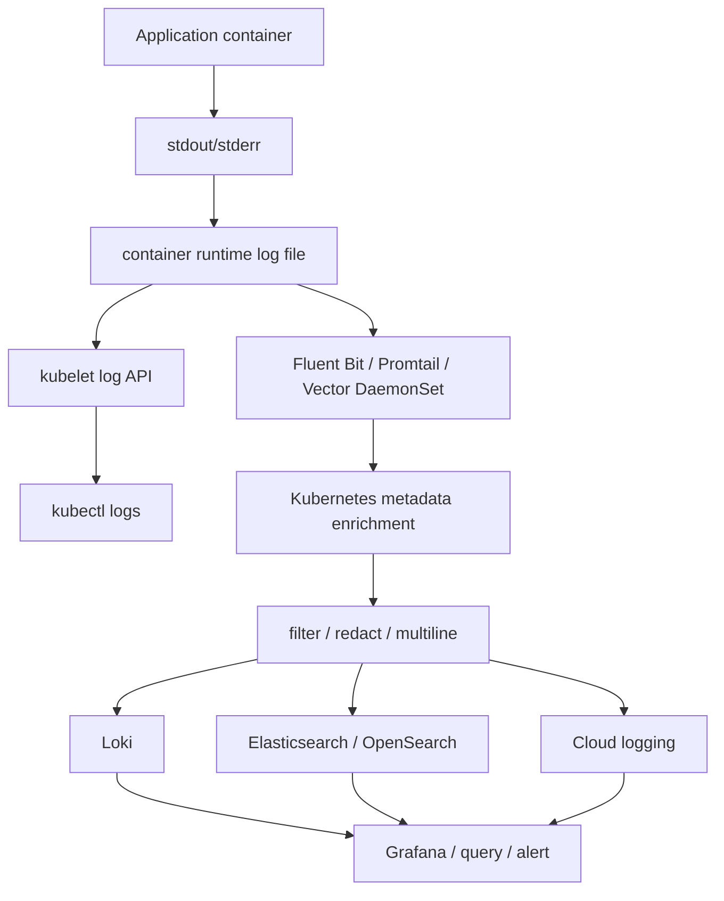

# Document - Day 29: Logging Reference

## Logging architecture



## Command cheatsheet

### Basic logs

```bash
kubectl logs pod/<pod>
kubectl logs deploy/<deployment>
kubectl logs statefulset/<statefulset>
kubectl logs job/<job>
kubectl logs -l app=<app>
```

### Useful flags

```bash
kubectl logs <pod> -c <container>
kubectl logs <pod> --all-containers=true
kubectl logs <pod> --previous
kubectl logs <pod> --tail=100
kubectl logs <pod> --since=15m
kubectl logs <pod> --timestamps
kubectl logs <pod> -f
kubectl logs -l app=<app> --max-log-requests=10
```

### Events near log investigation

```bash
kubectl describe pod <pod>
kubectl get events --sort-by=.lastTimestamp
kubectl get pod <pod> -o jsonpath='{.status.containerStatuses[*].restartCount}'
```

## Log source mapping

| Need | Kubernetes source | Notes |
|---|---|---|
| Current container log | `kubectl logs <pod>` | Works while Pod/container exists |
| Previous crashed container log | `kubectl logs <pod> --previous` | Essential for `CrashLoopBackOff` |
| Multi-container Pod log | `kubectl logs <pod> -c <container>` | Container name is required |
| Many replicas | `kubectl logs -l app=<app>` | Use `--tail`, `--since`, `--max-log-requests` |
| Node/system component log | component Pod logs or node journal | Depends on cluster install |
| Historical search | log backend | Kubernetes API is not log archive |

## Structured logging fields

| Field | Required? | Notes |
|---|---:|---|
| `ts` | Yes | UTC timestamp, preferably RFC3339 |
| `level` | Yes | `debug`, `info`, `warn`, `error` |
| `service` | Yes | Stable service name |
| `version` | Recommended | Helps compare rollout versions |
| `trace_id` | Recommended | Correlates logs with traces |
| `request_id` | Recommended | Correlates logs within one request |
| `user_id` | Be careful | Sensitive/cardinality risk |
| `msg` | Yes | Human-readable message |
| `error.kind` | Recommended | Useful for grouping |
| `duration_ms` | Recommended | Helpful for latency incidents |

## Loki label guidance

Good labels:

```text
cluster
namespace
app
container
environment
team
level
```

Avoid high-cardinality labels:

```text
request_id
trace_id
user_id
order_id
session_id
ip_address
```

Rule of thumb: a label should have a small, bounded set of values and be useful to select a stream before searching content.

## Elasticsearch/OpenSearch field guidance

| Field type | Index? | Notes |
|---|---|---|
| timestamp | Yes | Time range query |
| level | Yes | Filtering |
| service/app | Yes | Filtering |
| namespace | Yes | Filtering |
| message | Usually text index | Full-text search |
| request_id | Keyword with caution | Useful exact lookup, high volume |
| payload body | Usually no | Cost and sensitive data risk |
| dynamic JSON fields | Control carefully | Can explode mapping/cardinality |

## Collector comparison

| Collector | Common use | Notes |
|---|---|---|
| Fluent Bit | Lightweight node log collector | Common DaemonSet choice |
| Fluentd | Heavier routing/transforming | Mature plugin ecosystem |
| Promtail | Loki-focused collector | Tight integration with Loki labels |
| Vector | High-performance observability pipeline | Flexible transforms |
| Grafana Alloy | OTel/Prometheus/Loki style pipelines | Useful in Grafana ecosystem |

## Common Fluent Bit pipeline

```text
[INPUT] tail /var/log/containers/*.log
  |
  v
[PARSER] cri/containerd
  |
  v
[FILTER] kubernetes metadata
  |
  v
[FILTER] grep/modify/lua/redaction
  |
  v
[OUTPUT] loki/elasticsearch/http/cloud
```

## Lab stdout output vs real aggregation

In the lab, Fluent Bit can use:

```ini
[OUTPUT]
    Name   stdout
    Match  kube.*
```

This proves:

- The DaemonSet can read container runtime logs from the node.
- The CRI parser works.
- Kubernetes metadata enrichment can work if RBAC is correct.
- Filters can transform/drop fields.

It does not prove:

- Long-term retention.
- Query across days.
- Backend HA.
- Access control by team/namespace.
- Alerting on logs.

Production output should go to Loki, Elasticsearch/OpenSearch, cloud logging or another managed backend.

## RBAC required for metadata enrichment

Minimal read permissions for Fluent Bit Kubernetes metadata:

```yaml
rules:
- apiGroups: [""]
  resources:
  - pods
  - namespaces
  verbs: ["get", "list", "watch"]
```

Verification:

```bash
kubectl auth can-i list pods --as=system:serviceaccount:day29:fluent-bit -n day29
kubectl auth can-i watch namespaces --as=system:serviceaccount:day29:fluent-bit
```

If this fails, log events may still be collected but metadata enrichment will be missing or incomplete.

## Redaction filter example

When app logs are JSON and `Merge_Log On` is enabled, sensitive fields can be removed before output:

```ini
[FILTER]
    Name                kubernetes
    Match               kube.*
    Merge_Log           On
    Keep_Log            Off

[FILTER]
    Name    modify
    Match   kube.*
    Remove  token
    Remove  password
    Remove  authorization
    Remove  email
```

Prefer preventing sensitive logs in application code. Collector redaction is a second line of defense.

## Multiline parser sketch

Use this only when the application cannot log stack traces as one-line JSON.

```ini
[MULTILINE_PARSER]
    Name          java_stack
    Type          regex
    Flush_Timeout 1000
    Rule          "start_state" "/^[0-9-]+T[0-9:.]+Z ERROR/" "cont"
    Rule          "cont" "/^[[:space:]]+at /" "cont"
    Rule          "cont" "/^Caused by:/" "cont"

[INPUT]
    Name              tail
    Path              /var/log/containers/*.log
    multiline.parser  cri, java_stack
```

Risks:

- Too broad continuation rules can merge unrelated events.
- Too short flush timeout can split one stack trace.
- Multi-language clusters may need separate parsers or app-side JSON logging.

## Troubleshooting runbook

### `kubectl logs` shows nothing

Check:

```bash
kubectl get pod <pod>
kubectl describe pod <pod>
kubectl get pod <pod> -o jsonpath='{.status.containerStatuses[*].state}'
kubectl logs <pod> -c <container>
kubectl logs <pod> --previous
```

Likely causes:

- Container has not started.
- Wrong container selected.
- App logs to file instead of stdout/stderr.
- Container exits too fast and current log is empty.
- RBAC does not allow `pods/log`.

### Log collector has no data

Check:

```bash
kubectl get daemonset -A
kubectl get pod -l app=<collector> -o wide
kubectl logs daemonset/<collector> --tail=200
kubectl describe pod -l app=<collector>
```

Likely causes:

- Collector not scheduled on the node that runs the app.
- HostPath log directory is wrong.
- Parser does not match runtime log format.
- RBAC cannot list/watch Pods/namespaces.
- Backend output rejects writes.
- NetworkPolicy blocks backend.

### Logs missing Kubernetes metadata

Check:

```bash
kubectl logs daemonset/<collector> --tail=200
kubectl get serviceaccount <collector>
kubectl auth can-i list pods --as=system:serviceaccount:<ns>:<sa> -n <app-ns>
```

Likely causes:

- Kubernetes metadata filter disabled.
- ServiceAccount missing RBAC.
- Collector cannot reach Kubernetes API.
- Tag/path format does not include namespace/pod/container.

### Stack traces are split

Fix options:

- Prefer JSON one-line logs.
- Configure multiline parser by language/runtime.
- Ensure first line includes timestamp/level.
- Avoid mixing unrelated streams into one multiline rule.

## Production questions

- What log volume per service per day?
- What retention is required by severity and environment?
- Which fields are labels/indexed fields?
- What data must never appear in logs?
- Who can read logs from each namespace?
- How do you correlate logs with metrics and traces?
- What happens if the log backend is down?
- Does collector backpressure affect application Pods?
- Are audit/security logs handled separately from app logs?

## Minimal incident query checklist

When a service is failing, collect:

- Namespace, app label and version.
- Time window.
- Pod names and restart counts.
- Error-level logs.
- Previous container logs if restart happened.
- Correlation ID or trace ID from one failed request.
- Related Kubernetes events.

## Cleanup commands from lab

```bash
kubectl delete namespace day29
kubectl delete clusterrole day29-fluent-bit-read
kubectl delete clusterrolebinding day29-fluent-bit-read
```
