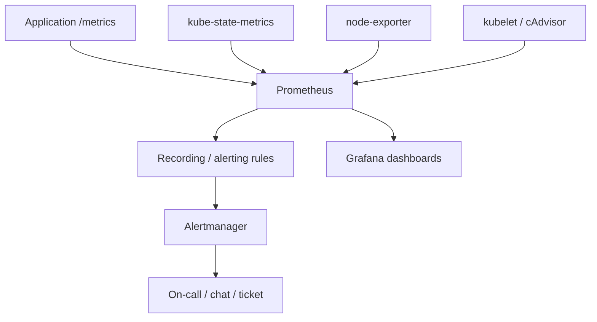

# Document - Day 30: Monitoring Reference

## Monitoring architecture



## Metric type quick reference

| Type | Behavior | Query pattern | Example |
|---|---|---|---|
| Counter | Monotonically increases | `rate()` / `increase()` | requests total |
| Gauge | Goes up and down | direct value / aggregation | memory in use |
| Histogram | Bucketed distribution | `histogram_quantile()` | request latency |
| Summary | Client-side quantiles | direct quantile | less flexible aggregation |

## PromQL essentials

### Target health

```promql
up
up{job="example-app"}
```

### Rate from counter

```promql
rate(http_requests_total[5m])
sum by (service) (rate(http_requests_total[5m]))
increase(http_requests_total[1h])
```

### Error ratio

```promql
sum(rate(http_requests_total{status=~"5.."}[5m]))
/
sum(rate(http_requests_total[5m]))
```

### Latency p95 from histogram

```promql
histogram_quantile(
  0.95,
  sum by (le, service) (
    rate(http_request_duration_seconds_bucket[5m])
  )
)
```

### Deployment unavailable

```promql
kube_deployment_status_replicas_available
<
kube_deployment_spec_replicas
```

### Restart spike

```promql
increase(kube_pod_container_status_restarts_total[15m]) > 3
```

## RED metrics

| Signal | Meaning | Example query |
|---|---|---|
| Rate | Request throughput | `sum(rate(http_requests_total[5m])) by (service)` |
| Errors | Failed request ratio | `sum(rate(http_requests_total{status=~"5.."}[5m])) / sum(rate(http_requests_total[5m]))` |
| Duration | Latency distribution | `histogram_quantile(0.95, sum by (le, service) (rate(http_request_duration_seconds_bucket[5m])))` |

Use RED for:

- HTTP APIs.
- gRPC services.
- Message consumers if mapped to processed messages, errors and processing duration.

## USE metrics

| Resource | Utilization | Saturation | Errors |
|---|---|---|---|
| CPU | CPU busy | CPU throttling, load/run queue | rare hardware errors |
| Memory | Used/available memory | memory pressure, reclaim, swap | OOM kills |
| Disk | Used capacity, I/O busy | I/O latency, queue depth | read/write errors |
| Network | Throughput | drops, retransmits, queue | rx/tx errors |

Use USE for:

- Nodes.
- Disks/volumes.
- Network interfaces.
- Shared infrastructure.

## Kubernetes metrics sources

| Source | Provides | Does not provide |
|---|---|---|
| App `/metrics` | Business/app RED metrics | Kubernetes object state |
| kube-state-metrics | Desired/current object state | CPU/memory runtime usage |
| node-exporter | Node OS metrics | Pod labels/object state |
| kubelet/cAdvisor | Container runtime metrics | Business-level request outcome |
| API server metrics | Control plane request/latency | App behavior |

## kube-state-metrics examples

| Question | Metric direction |
|---|---|
| Deployment has enough replicas? | compare desired vs available |
| Pod keeps restarting? | restart counter increase |
| Pod stuck Pending? | pod phase metrics |
| PVC bound? | PVC phase metrics |
| Job failed? | job failed metrics |
| Node condition unhealthy? | node condition metrics |

## Label discipline

Good labels:

```text
service
namespace
route template
method
status code class
environment
version
```

Bad labels:

```text
request_id
user_id
session_id
raw URL with IDs
full error message
pod UID unless needed
```

Prefer route templates:

```text
/orders/{id}
```

Avoid raw paths:

```text
/orders/123456
/orders/987654
```

## Alert design checklist

- Is this alert tied to user impact or imminent risk?
- Can the receiver take action?
- Is the threshold based on SLO, capacity or known behavior?
- Is the window long enough to avoid single-sample noise?
- Does it include labels needed to route to the owner?
- Is there a runbook?
- Does it avoid duplicate alerts for the same incident?

## Alert examples

### HTTP 5xx ratio

```yaml
alert: HighHttp5xxRatio
expr: |
  (
    sum by (service) (rate(http_requests_total{status=~"5.."}[5m]))
    /
    sum by (service) (rate(http_requests_total[5m]))
  ) > 0.05
for: 10m
labels:
  severity: page
annotations:
  summary: "High 5xx ratio for {{ $labels.service }}"
```

### Deployment replicas unavailable

```yaml
alert: DeploymentReplicasUnavailable
expr: kube_deployment_status_replicas_available < kube_deployment_spec_replicas
for: 10m
labels:
  severity: ticket
annotations:
  summary: "Deployment has unavailable replicas"
```

### PVC pending

```yaml
alert: PersistentVolumeClaimPending
expr: kube_persistentvolumeclaim_status_phase{phase="Pending"} == 1
for: 15m
labels:
  severity: ticket
annotations:
  summary: "PVC is pending"
```

## Minimal rule file for standalone Prometheus

```yaml
groups:
- name: day30-core
  rules:
  - alert: ExampleAppTargetDown
    expr: up{job="example-app"} == 0
    for: 2m
    labels:
      severity: ticket
    annotations:
      summary: "example-app scrape target is down"
  - record: job:http_requests:rate5m
    expr: sum by (job) (rate(http_requests_total[5m]))
```

Verify rules through the Prometheus HTTP API:

```bash
kubectl exec -n day30 deploy/prometheus -- wget -qO- http://localhost:9090/api/v1/rules
kubectl exec -n day30 deploy/prometheus -- wget -qO- http://localhost:9090/api/v1/alerts
```

## kube-state-metrics practical add-on

For production, install from the official manifests or Helm chart. Minimal learning checklist:

```bash
kubectl get deploy,svc -n kube-system | grep kube-state-metrics
kubectl port-forward -n kube-system svc/kube-state-metrics 8080:8080
curl -s http://localhost:8080/metrics | grep kube_deployment_status_replicas_available | head
```

Prometheus scrape job shape:

```yaml
- job_name: kube-state-metrics
  static_configs:
  - targets:
    - kube-state-metrics.kube-system.svc.cluster.local:8080
```

Useful queries:

```promql
kube_deployment_status_replicas_available < kube_deployment_spec_replicas
increase(kube_pod_container_status_restarts_total[15m]) > 3
kube_persistentvolumeclaim_status_phase{phase="Pending"} == 1
```

## node-exporter practical add-on

For production, install from the official manifests or kube-prometheus-stack. Minimal scrape job shape:

```yaml
- job_name: node-exporter
  static_configs:
  - targets:
    - node-exporter.monitoring.svc.cluster.local:9100
```

Useful queries:

```promql
1 - avg by (instance) (rate(node_cpu_seconds_total{mode="idle"}[5m]))
node_memory_MemAvailable_bytes / node_memory_MemTotal_bytes
1 - (node_filesystem_avail_bytes{fstype!~"tmpfs|overlay"} / node_filesystem_size_bytes{fstype!~"tmpfs|overlay"})
rate(node_network_receive_errs_total[5m]) + rate(node_network_transmit_errs_total[5m])
```

Node-exporter often needs host mounts and tolerations. In managed Kubernetes, check provider restrictions and prefer maintained chart/manifests.

## Grafana and Alertmanager add-on scope

Core lab does not require Grafana/Alertmanager. If adding them:

```text
Prometheus -> alerting config -> Alertmanager Service
Prometheus datasource -> Grafana dashboard
```

Minimal Alertmanager config shape:

```yaml
route:
  receiver: default
  group_by: ["alertname", "namespace", "service"]
  group_wait: 30s
  group_interval: 5m
  repeat_interval: 4h
receivers:
- name: default
```

Minimal Grafana validation:

- Add Prometheus datasource URL: `http://prometheus.day30.svc.cluster.local:9090`.
- Create panels for `up`, request rate, error ratio and p95 latency.
- Import or create Kubernetes object/node dashboard only after kube-state-metrics/node-exporter are scraped.

## Prometheus troubleshooting

### Target down

Check:

```bash
kubectl get svc,endpoints,endpointslice -n <namespace>
kubectl exec -n <prom-ns> deploy/prometheus -- wget -qO- http://<target>:<port>/metrics
kubectl logs -n <prom-ns> deploy/prometheus --tail=100
```

Likely causes:

- Wrong service DNS or port.
- App does not expose `/metrics`.
- NetworkPolicy blocks Prometheus.
- Scrape path mismatch.
- TLS/auth required but scrape config lacks credentials.

### Query is slow

Likely causes:

- High-cardinality labels.
- Wide time range.
- Regex over too many series.
- No recording rule for expensive aggregate.
- Prometheus under-sized.

### Alert noisy

Likely causes:

- Threshold too low.
- Window too short.
- Alerting on cause instead of symptom.
- Missing route grouping/inhibition.
- No distinction between dev/staging/prod.

## Dashboard layout suggestion

For one service:

- Request rate by status class.
- Error ratio.
- p50/p95/p99 latency.
- In-flight requests or queue length.
- Pod replicas ready/unready.
- Restart count.
- CPU/memory usage and throttling.
- Recent logs link filtered by service/version.
- Trace link for slow/error requests if available.

## Production questions

- What SLO does this service own?
- Which metrics directly prove SLO health?
- What labels are required for owner routing?
- What is acceptable metric cardinality?
- How long must Prometheus retain raw samples?
- Do you need Prometheus HA or remote write?
- How are dashboards and alerts versioned?
- Who reviews alert quality after incidents?

## Cleanup commands from lab

```bash
kubectl delete namespace day30
```
