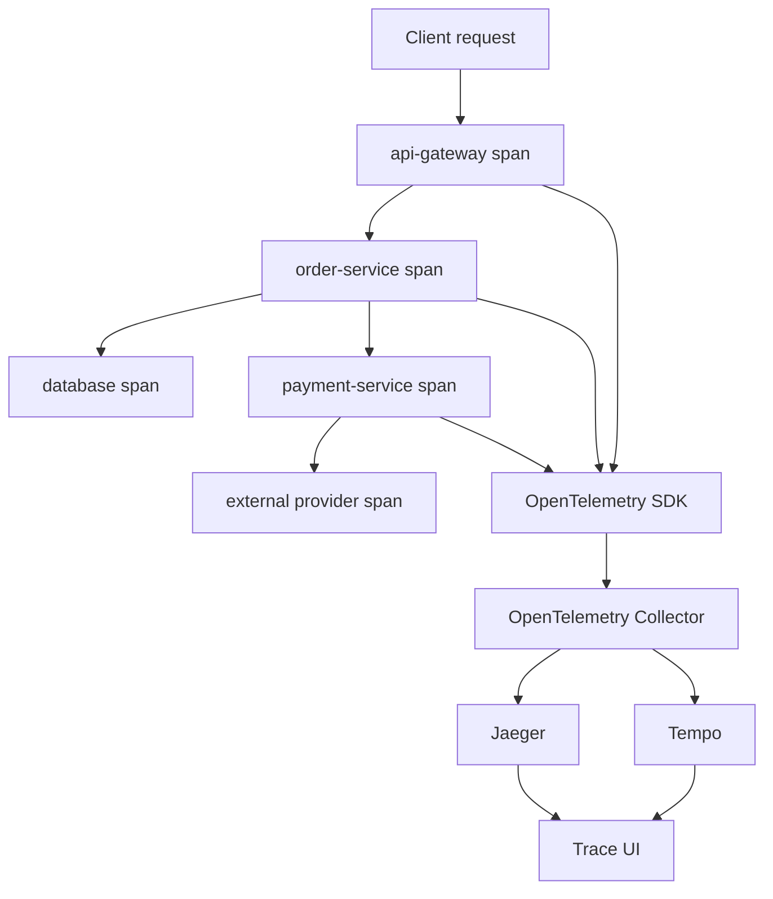

# Document - Day 31: Distributed Tracing Reference

## Trace architecture



## Core terms

| Term | Meaning |
|---|---|
| Trace | End-to-end transaction/request |
| Span | One timed operation within a trace |
| Root span | First/top-level span in a trace |
| Parent span | Span that caused another span |
| Child span | Span created under a parent |
| Trace ID | ID shared by all spans in a trace |
| Span ID | ID of one span |
| Context propagation | Passing trace context across process boundaries |
| Sampling | Deciding which traces to keep |
| Attributes/tags | Key-value metadata on span |
| Baggage | Cross-service contextual key-value data, use carefully |

## W3C Trace Context

Header:

```text
traceparent: 00-<trace-id>-<span-id>-<trace-flags>
```

Example:

```text
traceparent: 00-4bf92f3577b34da6a3ce929d0e0e4736-00f067aa0ba902b7-01
```

Fields:

| Part | Meaning |
|---|---|
| `00` | Version |
| `4bf92f...4736` | Trace ID |
| `00f067...02b7` | Parent span ID |
| `01` | Flags, sampled bit enabled |

## OpenTelemetry Collector model

```text
receivers:
  otlp / zipkin / jaeger / prometheus

processors:
  memory_limiter / batch / attributes / resource / tail_sampling

exporters:
  otlp / jaeger / zipkin / debug / prometheusremotewrite

service pipelines:
  traces / metrics / logs
```

Minimal trace pipeline:

```yaml
receivers:
  otlp:
    protocols:
      grpc:
      http:

processors:
  memory_limiter:
    check_interval: 1s
    limit_mib: 256
  batch: {}

exporters:
  otlp/tempo:
    endpoint: tempo:4317
    tls:
      insecure: true

service:
  pipelines:
    traces:
      receivers: [otlp]
      processors: [memory_limiter, batch]
      exporters: [otlp/tempo]
```

Lab note:

- App mới nên ưu tiên OTLP exporter tới Collector khi SDK hỗ trợ.
- Zipkin receiver trong lab giúp gửi span bằng `curl`/script đơn giản, không phải yêu cầu production.
- Jaeger/Tempo nên nằm sau Collector để bạn có chỗ cấu hình batch, memory limiter, attributes và sampling.

## Semantic attributes examples

| Area | Attribute examples |
|---|---|
| Service | `service.name`, `service.version`, `deployment.environment` |
| Kubernetes | `k8s.namespace.name`, `k8s.pod.name`, `k8s.deployment.name` |
| HTTP | `http.method`, `http.route`, `http.status_code` |
| Database | `db.system`, `db.name`, `db.operation` |
| Messaging | `messaging.system`, `messaging.destination.name`, `messaging.operation` |
| Error | `error.type`, span status error |

Avoid attributes containing:

- Full request/response body.
- Secrets/tokens.
- PII.
- Raw SQL with sensitive values.
- High-cardinality unbounded values unless necessary.

## Jaeger vs Tempo

| Aspect | Jaeger | Tempo |
|---|---|---|
| Common use | Trace backend and UI | Grafana-native trace backend |
| Lab experience | Very easy with all-in-one | Usually paired with Grafana |
| Storage model | Multiple backends depending setup | Object storage oriented |
| Query style | Service/operation/tag/duration | Trace ID first, metadata depending setup |
| Ecosystem | CNCF tracing project | Grafana LGTM stack |

## Sampling strategies

| Strategy | Use case | Risk |
|---|---|---|
| Always on | Low traffic, critical debug | High cost at scale |
| Probabilistic | General traffic sampling | May miss rare errors |
| Head sampling | Simple, cheap | Decision before knowing outcome |
| Tail sampling | Keep errors/slow traces | Needs collector buffering and sizing |
| Rules-based | Keep specific routes/statuses | Rules can drift |

Useful production approach:

- Keep all error traces.
- Keep all very slow traces.
- Sample successful high-volume routes.
- Keep higher sample rate during incident if cost allows.

## Correlation pattern

### Metrics to trace

From alert:

```text
service=checkout
route=/orders/{id}
status=500
time window=10:00-10:15 UTC
```

Open trace UI filtered by service, operation/route, error and time window.

### Trace to logs

Take trace ID:

```text
4bf92f3577b34da6a3ce929d0e0e4736
```

Query logs:

```text
{service="checkout"} |= "4bf92f3577b34da6a3ce929d0e0e4736"
```

or in Elasticsearch-style query:

```text
service:checkout AND trace_id:4bf92f3577b34da6a3ce929d0e0e4736
```

### Service A -> B propagation evidence

Trong lab runnable, evidence tối thiểu phải có:

| Evidence | Ý nghĩa |
|---|---|
| `service-a` log có `trace_id` | Request boundary tạo/nhận context |
| `service-a` log có `downstream_traceparent` | Outbound client path inject context |
| `service-b` log có cùng `trace_id` | Downstream extract đúng context |
| `service-b` log có `incoming_traceparent` bằng header từ A | Header không bị Service/Ingress/proxy strip |
| Jaeger có `service-a` và `service-b` trong cùng trace | Logs và trace backend correlate được |

Nếu chỉ gửi spans thủ công cùng `traceId`, bạn mới kiểm tra backend shape. Bạn chưa chứng minh code/service propagation đang hoạt động.

## Troubleshooting runbook

### No traces in backend

Check:

```bash
kubectl get pod,svc -n <observability-ns>
kubectl logs deploy/<otel-collector> -n <observability-ns> --tail=200
kubectl logs deploy/<jaeger-or-tempo> -n <observability-ns> --tail=200
kubectl get endpoints -n <observability-ns>
```

Likely causes:

- App not instrumented.
- Wrong collector endpoint.
- NetworkPolicy blocks collector/backend.
- Collector receiver protocol mismatch.
- Exporter endpoint/TLS config wrong.
- Sampling drops traces.

### Trace starts but breaks between services

Check:

- Does upstream inject `traceparent`?
- Does downstream extract `traceparent`?
- Are proxies/gateways stripping headers?
- For gRPC, is metadata propagated?
- For Kafka/queue, are message headers preserved?
- Is async consumer creating child or linked span?

Fast lab check:

```bash
kubectl logs deploy/service-a --tail=20
kubectl logs deploy/service-b --tail=20
kubectl logs deploy/otel-collector --tail=120
```

Expected: `service-a` and `service-b` logs share one `trace_id`, and Collector logs show spans from both services.

### Too many traces or backend cost high

Check:

- Sample rate.
- High-volume routes.
- Span count per request.
- Attributes with high cardinality.
- Collector batching and queue settings.
- Backend retention.

### Trace exists but logs cannot be found

Likely causes:

- App does not include `trace_id` in logs.
- Log format/parser drops trace field.
- Different trace ID format.
- Logs sampled/dropped separately.
- Time window or service label mismatch.

## Instrumentation checklist by service

- Stable `service.name`.
- `service.version` from image/app version.
- HTTP/gRPC server spans.
- HTTP/gRPC client spans.
- Database spans with safe attributes.
- Messaging spans with context headers.
- Error status and exception attributes.
- Logs include `trace_id` and `span_id`.
- Metrics labels align with trace route/service names.

## Production questions

- Which services must be traced first?
- What is the sampling policy per environment?
- What trace retention is needed?
- What data is forbidden in span attributes?
- Does tracing work through ingress, service mesh and queues?
- How do developers find traces from logs?
- How do alerts link to traces?
- Who owns collector and backend availability?

## Cleanup commands from lab

```bash
kubectl delete namespace day31
```
