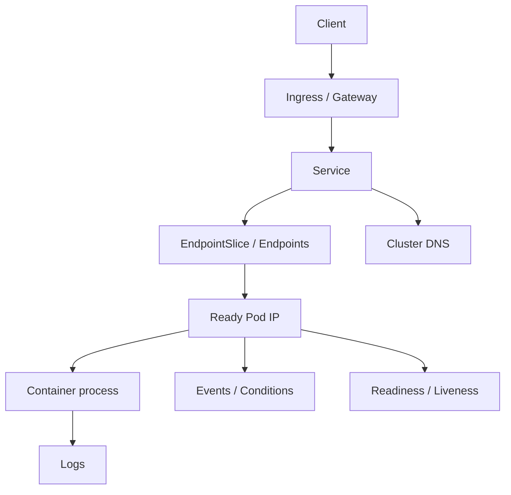

# Document - Day 32: Kubernetes Debugging Toolkit Reference

## Debug graph



Rule: debug from the symptom inward, but verify the object graph in order.

## First five commands

For most namespace-scoped incidents:

```bash
kubectl get deploy,rs,pod,svc,endpoints,endpointslice -n <ns> -o wide
kubectl get pod -n <ns> --show-labels
kubectl describe pod <pod> -n <ns>
kubectl get events -n <ns> --sort-by=.lastTimestamp
kubectl logs <pod> -n <ns> --tail=100
```

If restart happened:

```bash
kubectl logs <pod> -n <ns> --previous
```

If resource pressure is part of the symptom and Metrics Server exists:

```bash
kubectl top nodes
kubectl top pods -n <ns>
```

## Command matrix

| Question | Commands |
|---|---|
| What exists? | `kubectl get all -n <ns>` |
| Where is the Pod? | `kubectl get pod -o wide` |
| What labels does it have? | `kubectl get pod --show-labels` |
| Why is Pod not ready? | `kubectl describe pod <pod>` |
| What changed recently? | `kubectl get events --sort-by=.lastTimestamp` |
| What did app log? | `kubectl logs <pod>` |
| What did previous crash log? | `kubectl logs <pod> --previous` |
| Current CPU/memory snapshot? | `kubectl top pod <pod> -n <ns>` or `kubectl top pods -n <ns>` |
| Does Service select Pods? | `kubectl describe svc <svc>` |
| Does Service have endpoints? | `kubectl get endpoints <svc> -o wide` and `kubectl get endpointslice -l kubernetes.io/service-name=<svc> -o wide` |
| Does DNS work? | `kubectl exec <client> -- nslookup <svc>` |
| Does HTTP work in cluster? | `kubectl exec <client> -- wget -S -O- http://<svc>:<port>/` |
| Can local reach internal service? | `kubectl port-forward svc/<svc> 8080:<port>` |
| Need tools in minimal image? | `kubectl debug -it pod/<pod> --image=nicolaka/netshoot --target=<container>` |

## Pod status quick reference

| Status | Meaning | First checks |
|---|---|---|
| `Pending` | Not scheduled or waiting dependency | `describe pod`, events, PVC, resources, taints |
| `ContainerCreating` | Runtime creating container | image, volume mount, CNI, sandbox events |
| `ImagePullBackOff` | Image pull failed | image name, tag, registry auth, network |
| `CrashLoopBackOff` | Process exits repeatedly | logs, `--previous`, env/config/secret |
| `Running` not Ready | Container alive, readiness fail | readiness probe, app bind, logs |
| `Terminating` stuck | Finalizer/volume/node issue | finalizers, node state, grace period |

## Service debug

### Checklist

```bash
kubectl get svc <svc> -o yaml
kubectl describe svc <svc>
kubectl get pod --show-labels
kubectl get endpoints <svc> -o wide
kubectl get endpointslice -l kubernetes.io/service-name=<svc> -o wide
```

### Common causes

| Symptom | Likely cause |
|---|---|
| Endpoints empty | selector mismatch, Pods not Ready |
| DNS resolves, connection refused | wrong `targetPort`, app not listening |
| DNS resolves, timeout | NetworkPolicy, app hang, node/network issue |
| Works by Pod IP, fails by Service | Service port/selector/kube-proxy issue |
| Works by Service, fails by Ingress | Ingress rule/controller/Host/TLS issue |

## DNS debug

```bash
kubectl exec <client> -- cat /etc/resolv.conf
kubectl exec <client> -- nslookup kubernetes.default
kubectl exec <client> -- nslookup <service>
kubectl exec <client> -- nslookup <service>.<namespace>.svc.cluster.local
kubectl get pod -n kube-system -l k8s-app=kube-dns
kubectl logs -n kube-system -l k8s-app=kube-dns --tail=100
```

DNS naming:

```text
<service>
<service>.<namespace>
<service>.<namespace>.svc
<service>.<namespace>.svc.cluster.local
```

Short name only works reliably within the same namespace.

## Ingress debug

```bash
kubectl get ingress -A
kubectl describe ingress <ingress> -n <ns>
kubectl get ingress <ingress> -n <ns> -o yaml
kubectl get svc <backend-service> -n <ns> -o wide
kubectl get endpoints <backend-service> -n <ns> -o wide
kubectl get endpointslice -n <ns> -l kubernetes.io/service-name=<backend-service> -o wide
kubectl get ingressclass
kubectl logs -n <controller-ns> deploy/<controller> --tail=100
```

Check:

- Correct host.
- Correct path and `pathType`.
- Correct service name.
- Correct service port.
- IngressClass matches controller.
- TLS secret exists in same namespace.
- Backend Service has endpoints.
- Request uses expected Host header.

Ingress test fallbacks:

```bash
curl -H 'Host: <host>' http://127.0.0.1/
kubectl get ingress <ingress> -n <ns> -o wide
curl -H 'Host: <host>' http://<node-or-lb-ip>/
kubectl -n <controller-ns> port-forward svc/<controller-service> 8088:80
curl -H 'Host: <host>' http://127.0.0.1:8088/
```

Use the fallback that matches how the controller is exposed. K3s with Traefik, k3d port mapping, bare-metal K3s and managed cloud LoadBalancer can all differ.

## NetworkPolicy timeout drill

When DNS resolves but HTTP times out:

```bash
kubectl get networkpolicy -n <ns>
kubectl describe networkpolicy <policy> -n <ns>
kubectl exec <client> -n <ns> -- nslookup <svc>
kubectl exec <client> -n <ns> -- wget -T 5 -S -O- http://<svc>:<port>/ || true
```

Interpretation:

- DNS works but HTTP times out: check NetworkPolicy, app hang, node network or service mesh policy.
- Endpoints are empty: fix Service selector/readiness before debugging NetworkPolicy.
- Applying a deny policy changes nothing: the CNI/policy engine may not enforce NetworkPolicy in this lab.

## Ephemeral containers

Use:

```bash
kubectl debug -it pod/<pod> --image=nicolaka/netshoot --target=<container>
```

Good for:

- Distroless/minimal images.
- Network inspection.
- DNS inspection.
- Checking Pod namespace context.

Not good for:

- Permanent fixes.
- Installing tools in production app container.
- Bypassing image hardening as a normal workflow.

RBAC usually needs permission on:

```text
pods
pods/exec
pods/log
pods/ephemeralcontainers
```

Actual verbs depend on cluster policy.

## JSONPath snippets

```bash
kubectl get pod <pod> -o jsonpath='{.status.phase}'
kubectl get pod <pod> -o jsonpath='{.status.containerStatuses[*].restartCount}'
kubectl get pod <pod> -o jsonpath='{.status.containerStatuses[*].ready}'
kubectl get svc <svc> -o jsonpath='{.spec.selector}'
kubectl get endpoints <svc> -o jsonpath='{.subsets[*].addresses[*].ip}'
```

## Rollout debug

```bash
kubectl rollout status deploy/<deploy>
kubectl rollout history deploy/<deploy>
kubectl describe deploy <deploy>
kubectl get rs -l app=<app>
kubectl get pod -l app=<app> -o wide
```

Rollback:

```bash
kubectl rollout undo deploy/<deploy>
```

Before rollback, capture evidence:

- Current image.
- Previous image.
- Error/latency change.
- Logs or metrics showing regression.
- Owner approval if production process requires it.

## Events

Get recent events:

```bash
kubectl get events -n <ns> --sort-by=.lastTimestamp
```

Filter by object:

```bash
kubectl describe pod <pod>
kubectl describe deploy <deploy>
kubectl describe pvc <pvc>
```

Events are not long-term audit logs. They are short-lived cluster signals.

## Incident note template

```text
Symptom:
Scope:
Start time:
Recent changes:
Evidence:
Root cause:
Fix:
Verification:
Prevention:
```

Example:

```text
Symptom: client Pod got connection timeout to http://api
Scope: namespace day32, Service api only
Evidence: Service selector app=api-wrong, Pods labeled app=api, endpoints empty
Root cause: selector typo in Service manifest
Fix: changed selector to app=api
Verification: endpoints populated with 2 Pod IPs, wget http://api succeeded
Prevention: add manifest test to verify Service selectors match workload labels
```

## Debug order by symptom

### HTTP 503 from Ingress

1. `describe ingress`.
2. Check backend service name/port.
3. Check Service endpoints.
4. Check Pod readiness.
5. Check controller logs.

### Service DNS NXDOMAIN

1. Confirm service exists in namespace.
2. Use FQDN.
3. Test `kubernetes.default`.
4. Check CoreDNS Pods/logs.
5. Check NetworkPolicy for DNS egress.

### Connection refused

1. Check endpoints.
2. Check `targetPort`.
3. Check app listening port.
4. Check container logs.
5. Test Pod IP directly from debug Pod.

### Timeout

1. Check endpoints.
2. Check NetworkPolicy.
3. Check app latency/hang.
4. Check node/network issues.
5. Check service mesh policy if installed.

## Production questions

- Who can run `kubectl debug` in production?
- Which debug images are approved?
- How are debug actions audited?
- Are runbooks stored with service ownership?
- How do you preserve evidence before deleting Pods?
- How do you link incident notes to alerts/logs/traces?
- What must go through GitOps instead of manual patch?

## Cleanup commands from lab

```bash
kubectl delete namespace day32
```
