# Phase 1 Summary: Nền tảng, K3s Setup và Mental Model

## Key Takeaways

- Kubernetes là hệ thống reconciliation: bạn khai báo desired state, controllers và kubelet đưa cluster tiến gần trạng thái đó.
- `Pod` là đơn vị scheduling/runtime nhỏ nhất, nhưng phần lớn workload production nên được quản bởi controller như `Deployment`.
- Control plane quyết định, worker node thực thi. Debug tốt cần biết lỗi đang nằm ở API, scheduler, controller, kubelet, runtime, CNI hay Service dataplane.
- `k3d` là cách nhanh để có lab K3s local từ Day 1; K3s cài trực tiếp ở Day 4 giúp hiểu `server`, `agent`, `systemd`, kubeconfig và node token.
- K3s là Kubernetes conformant nhưng được đóng gói nhẹ hơn: `containerd`, Flannel, CoreDNS, Traefik, ServiceLB và `local-path-provisioner` thường có sẵn.
- `kubectl` là công cụ đọc API state quan trọng nhất: `get`, `describe`, `logs`, `events`, `jsonpath`, labels/selectors và rollout commands.

## Mind Map

```mermaid
mindmap
  root((Phase 1))
    Mental model
      Desired state
      Reconciliation loop
      Pod as scheduling unit
      OCI/CRI/containerd
    Architecture
      kube-apiserver
      datastore
      scheduler
      controller-manager
      kubelet
      kube-proxy
    K3s
      Single binary
      Embedded components
      Kubeconfig path
      k3s server/agent
      Lab trade-offs
    Debugging
      kubectl get/describe
      Events
      Logs previous
      Node conditions
      Service endpoints
```



## Self-assessment Quiz

1. Reconciliation loop khác imperative script ở điểm nào?
2. Vì sao `Pod` không nên là abstraction deploy chính cho app production?
3. `kube-apiserver` làm gì trước khi object được persist?
4. Scheduler và kubelet khác nhau thế nào?
5. Khi Pod `Pending` không có `nodeName`, bạn nghi component nào trước?
6. Khi Pod có `nodeName` nhưng kẹt `ContainerCreating`, bạn kiểm tra gì?
7. K3s khác kubeadm Kubernetes ở packaging và default components ra sao?
8. Vì sao Service có ClusterIP chưa chứng minh backend hoạt động?
9. EndpointSlice rỗng thường do những nguyên nhân nào?
10. `logs --previous` dùng khi nào?
11. Kubeconfig K3s mặc định nằm ở đâu?
12. Khi node `NotReady`, bạn cần đọc những tín hiệu nào?
13. `kubectl apply` khác `kubectl rollout status` ở mục đích nào?
14. Trong managed Kubernetes, cloud provider thường quản phần nào?
15. Khi nào nên dùng `k3d` multi-node hoặc K3s cài trực tiếp multi-node thay vì single-node?

## Production Scenarios

### Scenario 1: API deploy xong nhưng không nhận traffic

Điều tra theo thứ tự:

```bash
kubectl get deploy,pod,svc,endpoints,endpointslice -n <ns> -o wide
kubectl describe deployment <name> -n <ns>
kubectl describe svc <name> -n <ns>
kubectl get pods -n <ns> --show-labels
kubectl logs deployment/<name> -n <ns> --all-containers=true --tail=100
```

Root cause thường gặp: readiness fail, selector sai, Pod chưa ready, app bind sai port.

### Scenario 2: Rollout nhiều Pod bị chậm

Điều tra:

```bash
kubectl rollout status deployment/<name> -n <ns>
kubectl get pods -n <ns> -o wide
kubectl describe pod <pod> -n <ns>
kubectl get events -n <ns> --sort-by=.lastTimestamp
kubectl describe node <node>
```

Root cause thường gặp: image pull chậm, resource requests quá cao, node pressure, probe quá gắt.

### Scenario 3: K3s node vào `NotReady`

Điều tra:

```bash
kubectl get nodes -o wide
kubectl describe node <node-name>
kubectl get lease -n kube-node-lease
sudo systemctl status k3s-agent
sudo journalctl -u k3s-agent -n 200 --no-pager
sudo k3s crictl ps
```

Production cần cordon/drain hoặc replace node tùy blast radius; lab có thể restart agent sau khi ghi nhận symptom.

## Cheatsheet Commands

```bash
kubectl config current-context
kubectl get nodes -o wide
kubectl get pods -A -o wide
kubectl get events -A --sort-by=.lastTimestamp
kubectl describe pod <pod>
kubectl logs <pod> --previous
kubectl get svc,endpoints,endpointslice -A
kubectl get pod <pod> -o yaml
kubectl get pods -o custom-columns=NAME:.metadata.name,NODE:.spec.nodeName,PHASE:.status.phase
kubectl rollout status deployment/<name>
sudo k3s crictl ps
sudo journalctl -u k3s -n 200 --no-pager
```

## Common Failure Modes

| Failure mode | Dấu hiệu | Layer nghi ngờ | First commands |
|---|---|---|---|
| API server chậm/không phản hồi | `kubectl` timeout | Control plane | `kubectl get --raw='/readyz?verbose'`, logs |
| Pod `Pending` | Không có node | Scheduler/resources/taints | `describe pod`, `describe node` |
| `ImagePullBackOff` | Pull image fail | Runtime/registry | `describe pod`, events |
| `CrashLoopBackOff` | Restart count tăng | App/probe/config | `logs --previous`, `describe pod` |
| Service no endpoint | Endpoint rỗng | Selector/readiness | `describe svc`, labels |
| Node `NotReady` | Node condition xấu | kubelet/CNI/runtime | `describe node`, agent logs |
| Pod bị evict | `Evicted`, pressure events | Node resources | `describe pod`, `describe node`, `top` |

## Checklist: Sẵn sàng sang Phase 2 chưa?

- [ ] Có thể giải thích luồng từ YAML manifest đến container chạy trên node.
- [ ] Biết phân biệt responsibility của API server, scheduler, controller-manager, kubelet, runtime và kube-proxy.
- [ ] Có K3s lab chạy ổn định và biết kubeconfig nằm ở đâu.
- [ ] Dùng được `kubectl get/describe/logs/events/exec` không cần tra cứu liên tục.
- [ ] Biết debug Service không có endpoint.
- [ ] Biết đọc Node conditions và Pod events.
- [ ] Hiểu vì sao K3s lab khác managed Kubernetes về LB, storage, IAM và node lifecycle.

Nếu còn yếu ở `kubectl`, hãy lặp lại Day 07 trước khi học Phase 2. Các ngày tiếp theo dùng `kubectl` liên tục để quan sát Pod lifecycle và controller behavior.
