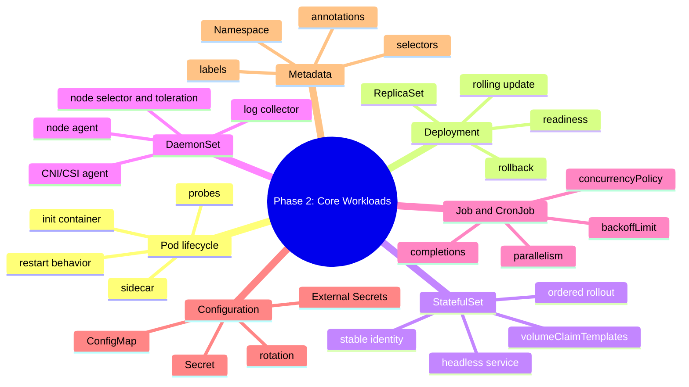

# Phase 2 Summary: Core Workloads và Configuration

## Key takeaways

Phase 2 đi từ Pod runtime patterns đến các workload controllers và runtime configuration. Sau Phase này, bạn nên nhìn workload Kubernetes theo 4 câu hỏi:

- Workload này chạy mãi, có identity ổn định, chạy trên mọi node hay chạy đến khi xong?
- Config và secret được inject vào runtime như thế nào?
- Metadata nào giúp Service, policy, observability và ownership hoạt động đúng?
- Khi lỗi xảy ra, object chain cần debug là gì?

Các mapping quan trọng:

| Use case | Kubernetes primitive phù hợp |
|---|---|
| Stateless service | `Deployment` |
| Stable identity và per-replica storage | `StatefulSet` |
| Agent chạy trên mỗi node | `DaemonSet` |
| Batch one-off | `Job` |
| Batch định kỳ | `CronJob` |
| Non-sensitive runtime config | `ConfigMap` |
| Sensitive runtime config | `Secret` hoặc external secret system |
| Organize/query/ownership | `Namespace`, `labels`, `annotations` |

## Mind map



## Core mental models

### Controller ownership

```text
Deployment -> ReplicaSet -> Pod
StatefulSet -> Pod identity + PVC identity
DaemonSet -> one Pod per matched node
CronJob -> Job -> Pod
```

Khi debug, đi theo owner chain thay vì nhìn một Pod cô lập.

### Runtime readiness

Pod Running không có nghĩa app sẵn sàng nhận traffic. `readinessProbe` quyết định Pod có nên vào Service endpoints hay không. `livenessProbe` quyết định container có cần restart không. `startupProbe` bảo vệ app start chậm khỏi bị liveness kill quá sớm.

### Configuration contract

`ConfigMap` và `Secret` là contract giữa platform/runtime và application. Nếu app đổi tên env/key mà manifest không đổi theo, lỗi sẽ xuất hiện ở rollout hoặc runtime.

### Metadata as control plane glue

Labels không chỉ để trang trí. Chúng nối Deployment, Service, NetworkPolicy, dashboards, log queries, cost allocation và cleanup automation.

## Self-assessment quiz

1. Vì sao `Deployment` phù hợp cho stateless API nhưng không phù hợp cho database cần identity ổn định?
2. `ReplicaSet` có vai trò gì trong rolling update của `Deployment`?
3. Khi nào nên dùng `startupProbe` thay vì chỉ tăng `initialDelaySeconds` của `livenessProbe`?
4. `StatefulSet` đảm bảo những loại ordering nào và không đảm bảo điều gì?
5. Vì sao `DaemonSet` thường dùng cho log agent, CNI agent hoặc monitoring node agent?
6. `Job` có đảm bảo exactly-once không? Vì sao?
7. `CronJob.concurrencyPolicy: Forbid` khác `Replace` thế nào?
8. `ConfigMap` mounted file và env var khác nhau thế nào khi config thay đổi?
9. Vì sao Kubernetes `Secret` base64 không đủ cho production secret management?
10. `External Secrets Operator` giải quyết phần nào của secret lifecycle và phần nào vẫn là trách nhiệm của team?
11. Namespace có phải security boundary đầy đủ không?
12. Vì sao Service không có endpoints thường nên kiểm tra labels/selectors trước?
13. Khi nào dùng annotation thay vì label?
14. Label nào bạn sẽ dùng để query tất cả backend API thuộc hệ thống commerce?
15. Nếu rollout fail sau khi đổi config, bạn kiểm tra object nào theo thứ tự?

## Production scenarios

### Scenario 1: API rollout gây downtime

Symptom:

- Deployment rollout bắt đầu.
- New Pods Running nhưng traffic lỗi 5xx.
- Rollout tiếp tục thay thế old Pods.

Likely causes:

- `readinessProbe` quá lỏng.
- App start nhưng dependency chưa sẵn sàng.
- Config/Secret key đổi sai.
- Resource limit quá thấp gây crash sau startup.

First commands:

```bash
kubectl rollout status deployment/<app> -n <namespace>
kubectl describe deployment <app> -n <namespace>
kubectl get rs,pod -n <namespace> -l app=<app>
kubectl describe pod <pod> -n <namespace>
kubectl logs <pod> -n <namespace>
kubectl get events -n <namespace> --sort-by=.lastTimestamp
```

### Scenario 2: CronJob tạo duplicate side effects

Symptom:

- Báo cáo gửi hai lần.
- Dữ liệu batch bị ghi trùng.
- Một số Jobs overlap.

Likely causes:

- `concurrencyPolicy: Allow`.
- App không idempotent.
- Retry sau partial success.
- Không có lock/checkpoint ở database.

Fix direction:

- Chọn `Forbid` nếu không được overlap.
- Thêm idempotency key/checkpoint.
- Giới hạn `backoffLimit` và `activeDeadlineSeconds`.
- Review downstream rate limit.

### Scenario 3: Service mất backend sau cleanup labels

Symptom:

- Pods Running.
- Service tồn tại.
- App khác gọi DNS Service bị timeout.

Likely causes:

- Label dùng trong Service selector bị đổi hoặc xóa.
- Pod chưa Ready nên không vào EndpointSlice.
- Service ở namespace khác.

First commands:

```bash
kubectl get svc,endpoints,endpointslice -n <namespace>
kubectl describe service <service> -n <namespace>
kubectl get pods -n <namespace> --show-labels
kubectl get pods -n <namespace> -l '<service-selector>'
```

## Cheatsheet commands

### Workloads

```bash
kubectl get deploy,rs,pod
kubectl rollout status deployment/<name>
kubectl rollout history deployment/<name>
kubectl rollout undo deployment/<name>
kubectl scale deployment/<name> --replicas=3

kubectl get statefulset,pod,pvc
kubectl get daemonset,pod -o wide
kubectl get job,cronjob,pod
```

### Debug Pod and controller chain

```bash
kubectl describe pod <pod>
kubectl logs <pod> -c <container>
kubectl logs <pod> --previous
kubectl get events --sort-by=.lastTimestamp
kubectl get pod <pod> -o jsonpath='{.metadata.ownerReferences}'
```

### Config and Secret

```bash
kubectl get configmap,secret
kubectl describe configmap <name>
kubectl describe secret <name>
kubectl rollout restart deployment/<name>
kubectl auth can-i get secrets -n <namespace>
```

### Namespace and labels

```bash
kubectl get ns --show-labels
kubectl get pods --show-labels
kubectl get pods -A -l app.kubernetes.io/name=<app>
kubectl label pod <pod> key=value
kubectl annotate deployment <name> key=value
kubectl api-resources --namespaced=true
kubectl api-resources --namespaced=false
```

## Common failure modes

| Symptom | Common root cause | First check |
|---|---|---|
| `CrashLoopBackOff` | App crash, bad config, liveness kill | logs, describe pod |
| `ImagePullBackOff` | Image/tag/registry secret sai | describe pod, events |
| Pod `Pending` | Resource thiếu, PVC, node selector/taint | describe pod |
| Rollout stuck | New Pods not Ready | rollout status, describe deployment |
| StatefulSet stuck | Ordered rollout waiting for previous Pod | get pod,pvc,events |
| DaemonSet missing node | Node selector/taint/resource | describe ds, get pods -o wide |
| Job failed | Non-zero exit, backoff exceeded | describe job, logs |
| CronJob missed | suspend, deadline, controller schedule | describe cronjob |
| `CreateContainerConfigError` | Missing ConfigMap/Secret/key | describe pod |
| Service no endpoints | Label/selector mismatch, Pod not Ready | get endpoints, labels |

## K3s vs standard Kubernetes vs managed Kubernetes

| Topic | K3s lab | Self-managed Kubernetes | Managed Kubernetes |
|---|---|---|---|
| Workload APIs | Same upstream APIs | Same upstream APIs | Same upstream APIs |
| Control plane | Lightweight, bundled components | Team operates components | Cloud operates control plane |
| Secret encryption | Configure in K3s | Configure API server encryption provider | Usually cloud/KMS integrated but must verify |
| Storage for StatefulSet | Often local-path for lab | Need CSI/storage design | Cloud CSI/managed disks |
| Node agents | Good DaemonSet lab | Requires node lifecycle ops | Node pools managed partly by cloud |
| Metadata governance | Manual | Manual/policy enforced | Often integrated with IAM/cost tooling |

## Checklist: sẵn sàng sang Phase 3 chưa?

- [ ] Bạn chọn được `Deployment`, `StatefulSet`, `DaemonSet`, `Job`, `CronJob` theo use case.
- [ ] Bạn hiểu owner chain của Pod và biết debug từ controller xuống Pod.
- [ ] Bạn cấu hình được probes cơ bản và hiểu readiness ảnh hưởng traffic.
- [ ] Bạn biết update image, rollback và đọc rollout history.
- [ ] Bạn biết vì sao stateful workloads khó hơn stateless workloads.
- [ ] Bạn biết inject config/secret qua env và volume.
- [ ] Bạn không nhầm Kubernetes `Secret` với secret management hoàn chỉnh.
- [ ] Bạn biết dùng namespace để tổ chức resource và cleanup.
- [ ] Bạn biết dùng labels/selectors để query và kết nối Service với Pod.
- [ ] Bạn có thói quen kiểm tra events, logs, describe và endpoints khi debug.

## Next phase preview

Phase 3 chuyển trọng tâm sang networking:

- Day 15: Service types.
- Day 16: kube-proxy modes.
- Day 17: Ingress và Ingress controllers.
- Day 18: DNS trong Kubernetes.
- Day 19: Network Policies.
- Day 20: CNI deep-dive.
- Day 21: Service Mesh introduction.

Mục tiêu là đi từ "workload đã chạy" sang "traffic đi tới workload như thế nào, fail ở layer nào và nên expose microservices ra sao".
