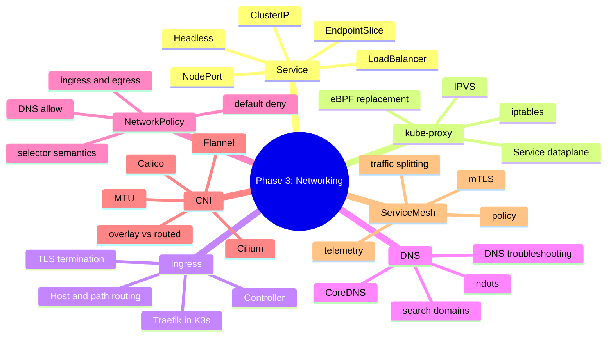

# Phase 3 Summary: Networking, Traffic Flow và Service Discovery

## Key takeaways

Phase 3 đi từ Kubernetes Service cơ bản đến traffic path đầy đủ: Service routing, kube-proxy/eBPF dataplane, Ingress, DNS, NetworkPolicy, CNI và service mesh. Sau phase này, bạn nên debug network theo lớp thay vì đoán:

```text
Client
  -> DNS
  -> Service
  -> EndpointSlice
  -> kube-proxy/eBPF dataplane
  -> CNI Pod network
  -> NetworkPolicy/mesh policy
  -> Pod/container port
```

Các mapping quan trọng:

| Need | Kubernetes/networking layer |
|---|---|
| Stable virtual IP nội bộ | `Service` `ClusterIP` |
| Expose app qua node port | `NodePort`, thường chỉ cho lab/edge đặc biệt |
| Cloud load balancer | `LoadBalancer` Service |
| HTTP host/path routing | `Ingress` + Ingress controller |
| Service discovery nội bộ | CoreDNS + Service DNS records |
| Pod connectivity | CNI |
| L3/L4 allow-list | `NetworkPolicy` với CNI/policy engine hỗ trợ |
| mTLS/traffic split/service identity | Service mesh, khi có use case rõ |

## Mind map



## Core mental models

### Service is not the backend

`Service` là stable frontend cho một nhóm Pods. Backend thật nằm trong `EndpointSlice`. Khi Service timeout, đừng chỉ describe Service; kiểm tra selector, Pod labels, readiness và EndpointSlice.

### DNS is discovery, not connectivity

DNS resolve thành công chỉ chứng minh tên được phân giải. Nó không chứng minh Service có endpoints, kube-proxy/eBPF route đúng, CNI cross-node chạy hoặc policy cho phép traffic.

### Ingress needs a controller

`Ingress` resource chỉ là config. Ingress controller mới là component nhận traffic thật và reconcile config thành proxy/runtime state. Trong K3s, Traefik thường được cài mặc định, nhưng production vẫn cần hiểu TLS, class, annotations và controller logs.

### CNI is the Pod network implementation

Kubernetes yêu cầu Pod-to-Pod networking, nhưng CNI quyết định overlay, routed mode, IPAM, policy enforcement và đôi khi cả eBPF Service dataplane. Same-node OK nhưng cross-node fail thường là dấu hiệu cần debug CNI/route/MTU/firewall.

### Policy is additive allow

`NetworkPolicy` không có explicit deny. Khi Pod bị selected bởi policy ở hướng ingress/egress, chỉ traffic được allow bởi ít nhất một rule mới đi qua. Default-deny mà quên DNS egress là lỗi rất phổ biến.

### Mesh is optional and expensive

Service mesh thêm mTLS, identity-aware policy, traffic splitting và telemetry. Nó cũng thêm proxy overhead, control plane, certificate lifecycle và một lớp debug mới. Chỉ dùng khi có use case rõ.

## Self-assessment quiz

1. `ClusterIP`, `NodePort`, `LoadBalancer` và `Headless Service` khác nhau ở use case nào?
2. Service không có endpoints thì bạn kiểm tra object nào theo thứ tự?
3. Vì sao Pod Running nhưng không Ready có thể làm Service không route traffic tới Pod đó?
4. kube-proxy `iptables` và `IPVS` khác nhau ở mental model nào?
5. eBPF Service dataplane có thể thay vai trò nào của kube-proxy?
6. Ingress resource khác Ingress controller thế nào?
7. Khi DNS resolve được nhưng curl Service timeout, bạn debug các lớp nào?
8. Vì sao default-deny egress thường làm app báo lỗi DNS?
9. `namespaceSelector` và `podSelector` nằm cùng một item khác gì so với tách thành hai item?
10. CNI overlay có rủi ro MTU nào?
11. Khi same-node Pod IP chạy nhưng cross-node fail, bạn nghi ngờ gì?
12. Service mesh giải quyết gì mà Ingress không giải quyết?
13. Vì sao bật retry trong mesh có thể làm incident nặng hơn?
14. Khi nào service mesh là overkill?
15. Với K3s, Traefik, Flannel và local policy controller nằm ở lớp nào?

## Production scenarios

### Scenario 1: API Gateway báo 502 tới backend

Symptom:

- Ingress trả 502.
- Backend Pods Running.
- Client bên ngoài không gọi được.

First commands:

```bash
kubectl get ingress -A
kubectl describe ingress <name> -n <namespace>
kubectl get svc,endpoints,endpointslice -n <namespace>
kubectl get pods -n <namespace> -o wide --show-labels
kubectl logs -n <ingress-namespace> <ingress-controller-pod> --tail=100
```

Likely causes:

- Ingress route sai service/port.
- Service selector sai.
- Pods chưa Ready.
- Backend protocol mismatch HTTP/HTTPS.
- IngressClass/controller không match.

### Scenario 2: Service DNS resolve nhưng request timeout

Symptom:

- `nslookup api` trả IP.
- `curl http://api:8080` timeout.

First commands:

```bash
kubectl get svc,endpoints,endpointslice -n <namespace>
kubectl describe svc api -n <namespace>
kubectl get pods -n <namespace> -o wide --show-labels
kubectl exec <client> -n <namespace> -- curl -v --max-time 3 http://<pod-ip>:8080
kubectl get networkpolicy -n <namespace>
```

Likely causes:

- Service có DNS nhưng không có endpoints.
- targetPort sai.
- NetworkPolicy chặn.
- CNI/dataplane lỗi.
- App không listen đúng port/interface.

### Scenario 3: Default deny rollout làm toàn bộ app mất kết nối

Symptom:

- Sau khi apply NetworkPolicy, app báo DNS và database timeout.
- Pods vẫn Running.

First commands:

```bash
kubectl get netpol -n <namespace>
kubectl describe netpol <policy> -n <namespace>
kubectl get ns --show-labels
kubectl -n kube-system get pods --show-labels | grep -i dns
kubectl exec <pod> -n <namespace> -- nslookup kubernetes.default
```

Likely causes:

- Thiếu allow DNS egress.
- Selector namespace/CoreDNS sai.
- Chỉ mở ingress mà quên egress.
- CNI không enforce hoặc enforce khác kỳ vọng.

### Scenario 4: Cross-node traffic lỗi sau thay đổi CNI/firewall

Symptom:

- Pods cùng node gọi nhau được.
- Pods khác node timeout.
- Service có endpoints đúng.

First commands:

```bash
kubectl get pods -A -o wide
kubectl get nodes -o wide
kubectl -n kube-system get pods -o wide
kubectl describe node <node>
kubectl exec <client> -- curl -m 3 http://<remote-pod-ip>:<port>
```

Likely causes:

- Overlay port bị firewall/security group chặn.
- MTU mismatch.
- Route PodCIDR thiếu.
- CNI DaemonSet lỗi trên một node.
- eBPF/kube-proxy replacement config sai.

## Phase 3 operational checklist

- [ ] Mọi Service production có selector/labels rõ và readinessProbe đúng.
- [ ] Có dashboard cho Ingress 4xx/5xx, latency và backend health.
- [ ] CoreDNS metrics/logs được monitor.
- [ ] NetworkPolicy baseline được test bằng positive và negative tests.
- [ ] CNI choice và trade-offs được document.
- [ ] Cross-node connectivity test tồn tại.
- [ ] K3s defaults như Traefik/Flannel/network policy controller được hiểu.
- [ ] Service mesh chỉ được cài sau khi có use case và owner rõ.

## Bridge to Phase 4

Networking trả lời "service nói chuyện với nhau thế nào". Phase 4 chuyển sang câu hỏi "data sống ở đâu và sống sót ra sao". Storage sẽ khó hơn stateless networking vì lifecycle dữ liệu không tự biến mất khi Pod biến mất. Từ Day 22 trở đi, mỗi quyết định storage cần đi kèm reclaim, backup, restore, topology và failure-mode analysis.
