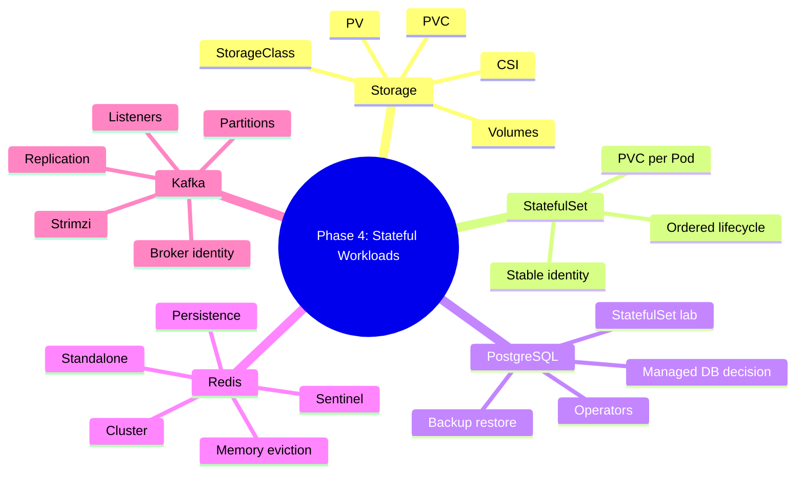

# Phase 4 Summary: Storage, Stateful Apps và Data Platform Caveats

## Key takeaways

Phase 4 chuyển từ workload stateless sang stateful. Điểm quan trọng nhất: Kubernetes cung cấp API để gắn storage và giữ identity, nhưng không tự biến database, cache hoặc streaming platform thành production-ready.

Mental model tổng quát:

```text
Application
  |
  v
Kubernetes workload object
  |
  +-- StatefulSet identity
  +-- Service DNS
  +-- PVC/PV binding
  +-- StorageClass/CSI driver
  |
  v
Stateful system semantics
  |
  +-- backup/restore
  +-- replication/failover
  +-- consistency
  +-- latency/capacity
  +-- upgrade/operations
```

Nếu chỉ nhìn Pod `Running` và PVC `Bound`, bạn mới kiểm tra được Kubernetes control surface. Data safety nằm ở các lớp bên dưới và bên trong ứng dụng stateful.

## Mind map



## Core mental models

### Volume is not backup

PVC giúp Pod thấy một filesystem ổn định. Backup là bản sao có thể restore được theo quy trình đã test. Snapshot, dump, WAL archive và cross-cluster replication có mục tiêu khác nhau.

### StatefulSet is identity, not high availability

StatefulSet cho Pod name ổn định và PVC riêng. Nó không tự cấu hình PostgreSQL replication, Redis Sentinel hay Kafka partition replication.

### StorageClass is policy, not performance proof

StorageClass định nghĩa provisioner và parameters. Nó không chứng minh latency, IOPS, topology, attach/detach behavior hoặc restore safety phù hợp với database.

### Operators reduce YAML, not operational responsibility

CloudNativePG, Redis operators và Strimzi giúp reconcile stateful systems tốt hơn hand-written manifests. Nhưng team vẫn cần hiểu backup, restore, failover, monitoring, upgrades và incident response.

### Managed service is often the production default

Với PostgreSQL, Redis và Kafka production, managed service thường là lựa chọn thực dụng nếu team không có lý do mạnh để tự vận hành trong Kubernetes.

## Object mapping

| Need | Kubernetes layer | Application layer |
|---|---|---|
| Stable endpoint | `Service` | Client connection/routing |
| Stable identity | `StatefulSet` | DB node/broker identity |
| Durable local data | `PVC`/`PV` | Data files, WAL, AOF, Kafka log segments |
| Dynamic storage | `StorageClass`/CSI | Storage latency, topology, snapshots |
| Restart recovery | Controller recreate Pod | App recovery from disk |
| HA/failover | Scheduling primitives | Replication, quorum, promotion, client routing |
| Backup | Jobs/snapshots/operators | Consistent dump, WAL, restore, DR |

## Self-assessment quiz

1. PVC `Bound` chứng minh điều gì và không chứng minh điều gì?
2. Vì sao StatefulSet không tự tạo HA?
3. `ReadWriteOnce`, `ReadWriteMany` và topology có ảnh hưởng gì đến stateful workload?
4. CSI controller plugin và node plugin khác nhau thế nào?
5. Khi Pod kẹt `ContainerCreating` vì volume, bạn kiểm tra object nào theo thứ tự?
6. Vì sao local-path storage của K3s chỉ phù hợp lab?
7. PostgreSQL logical backup khác physical backup + WAL archive thế nào?
8. Khi nào nên chọn managed PostgreSQL?
9. Redis standalone, Sentinel và Cluster khác nhau ở use case nào?
10. Vì sao Redis cần `maxmemory` thấp hơn container memory limit?
11. Kafka `advertised.listeners` sai gây lỗi kiểu gì?
12. Replication factor, ISR và `min.insync.replicas` liên quan thế nào?
13. Vì sao PVC snapshot không đủ làm DR strategy cho Kafka?
14. Operator giúp gì và không giúp gì?
15. Bạn cần test gì trước khi gọi một stateful workload là production-ready?

## Production scenarios

### Scenario 1: PVC Pending sau khi deploy database

Symptom:

- Pod không start.
- PVC `Pending`.
- Events báo storage provisioning lỗi.

First commands:

```bash
kubectl get pvc -A
kubectl describe pvc <pvc> -n <namespace>
kubectl get storageclass
kubectl describe storageclass <class>
kubectl get events -n <namespace> --sort-by=.lastTimestamp
```

Likely causes:

- StorageClass không tồn tại.
- Provisioner/CSI driver lỗi.
- `WaitForFirstConsumer` chưa có Pod scheduled.
- Topology constraints không thỏa.
- Backend hết quota/capacity.

### Scenario 2: PostgreSQL restart xong nhưng app lỗi

Symptom:

- Pod PostgreSQL Running.
- App báo connection refused, auth failed hoặc query timeout.

First commands:

```bash
kubectl get svc,endpoints,endpointslice -n <namespace>
kubectl describe pod <postgres-pod> -n <namespace>
kubectl logs <postgres-pod> -n <namespace> --tail=100
kubectl exec <client-pod> -n <namespace> -- pg_isready -h <service>
```

Likely causes:

- Pod Running nhưng chưa Ready.
- Secret/credential sai.
- PostgreSQL đang recovery.
- Service selector sai.
- Storage latency hoặc disk full.

### Scenario 3: Redis mất key sau scale

Symptom:

- Redis StatefulSet scale từ 1 lên 2.
- Client đôi khi đọc không thấy key.

First commands:

```bash
kubectl get pod,svc,endpoints -n <namespace> -o wide
kubectl exec <client> -n <namespace> -- redis-cli -h redis-0.<headless> GET <key>
kubectl exec <client> -n <namespace> -- redis-cli -h redis-1.<headless> GET <key>
kubectl exec <client> -n <namespace> -- redis-cli -h redis INFO replication
```

Likely causes:

- Hai Pod là hai standalone Redis.
- Không có replication/Sentinel/Cluster.
- Service load-balances qua instances không cùng data.

### Scenario 4: Kafka producer timeout

Symptom:

- Bootstrap server connect được.
- Produce timeout hoặc client log báo broker unreachable.

First commands:

```bash
kubectl get svc,endpoints,endpointslice -n <namespace>
kubectl logs <broker-pod> -n <namespace> --tail=150
kubectl exec <client> -n <namespace> -- kafka-broker-api-versions.sh --bootstrap-server <bootstrap>
kubectl exec <client> -n <namespace> -- kafka-topics.sh --bootstrap-server <bootstrap> --describe --topic <topic>
```

Likely causes:

- `advertised.listeners` unreachable.
- Topic missing hoặc RF/ISR không thỏa.
- Broker disk full.
- NetworkPolicy/firewall chặn broker address.
- Client dùng bootstrap đúng nhưng metadata trả địa chỉ sai.

## Phase 4 readiness checklist

- [ ] Biết đọc PVC/PV/StorageClass/CSI events.
- [ ] Biết phân biệt provision, attach, mount và application I/O.
- [ ] Hiểu StatefulSet identity và giới hạn của nó.
- [ ] Đã deploy lab PostgreSQL, Redis và Kafka.
- [ ] Đã test restart recovery qua PVC.
- [ ] Đã tạo và restore ít nhất một PostgreSQL logical backup.
- [ ] Hiểu Redis persistence, memory và mode HA.
- [ ] Hiểu Kafka broker identity, listeners và replication.
- [ ] Có checklist quyết định managed vs self-hosted.
- [ ] Không nhầm lab YAML với production architecture.

## Next phase bridge

Phase 5 đi vào observability, debugging, security và operations. Đây là phần bắt buộc sau Phase 4 vì stateful workloads không thể vận hành bằng cảm giác. Bạn cần logs, metrics, tracing, events, RBAC, Pod Security và runbook để biến kiến thức object model thành năng lực vận hành sự cố thật.
